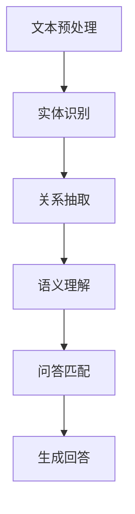

                 

# 自然语言处理在智能问答系统中的创新

> 关键词：自然语言处理，智能问答系统，技术原理，算法实现，应用场景，发展趋势

> 摘要：本文将深入探讨自然语言处理（NLP）在智能问答系统中的应用与创新。通过分析NLP的核心概念、算法原理及其实际操作步骤，结合数学模型和具体代码实现，探讨NLP在智能问答系统中的实际应用场景，并提供相关的学习资源和开发工具推荐。文章旨在为读者提供一个全面、系统的理解，并展望NLP在智能问答系统中的未来发展。

## 1. 背景介绍

自然语言处理（NLP）是计算机科学和人工智能领域的一个重要分支，旨在使计算机能够理解和处理人类自然语言。随着互联网和大数据的发展，NLP技术得到了广泛的应用，尤其在智能问答系统中发挥了关键作用。

智能问答系统是一种能够理解用户输入的自然语言问题，并给出恰当回答的人工智能系统。这些系统广泛应用于客服、教育、医疗、金融等多个领域，大大提高了服务效率和用户体验。然而，要构建一个高效、准确的智能问答系统，需要NLP技术的深度应用和不断创新。

NLP技术在智能问答系统中的应用主要包括文本预处理、实体识别、关系抽取、语义理解、问答匹配等。这些技术相互关联，共同构成了一个完整的NLP处理流程，为智能问答系统的实现提供了坚实的基础。

## 2. 核心概念与联系

### 2.1 文本预处理

文本预处理是NLP的基础步骤，主要包括分词、去停用词、词干提取等。分词是将连续的文本分割成一个个有意义的词语，去停用词是去除对语义分析影响较小的常见词汇，词干提取则是将单词还原为词根形式，以简化后续的语义分析。

### 2.2 实体识别

实体识别是NLP中的一个重要任务，旨在识别文本中的实体，如人名、地点、组织、时间等。实体识别有助于理解文本的内容和上下文，为后续的语义理解和问答匹配提供基础。

### 2.3 关系抽取

关系抽取是指从文本中抽取实体之间的关系，如“张三生于北京”中的“张三”与“北京”之间的关系是出生地。关系抽取有助于深入理解文本的语义，为问答系统提供更加准确的回答。

### 2.4 语义理解

语义理解是指对文本中的语义进行深入分析，理解文本的含义和逻辑关系。语义理解是智能问答系统的核心，决定了问答系统是否能够准确回答用户的问题。

### 2.5 问答匹配

问答匹配是指将用户的问题与已有的问题库或知识库进行匹配，找到最接近的问题并给出相应的回答。问答匹配是智能问答系统的关键步骤，决定了问答系统的响应速度和准确性。

### 2.6 Mermaid 流程图

以下是一个简化的NLP处理流程的Mermaid流程图：



## 3. 核心算法原理 & 具体操作步骤

### 3.1 文本预处理

文本预处理主要包括分词、去停用词和词干提取。以下是一个基于Python的文本预处理示例：

```python
import jieba  # Python中的中文分词库

def preprocess_text(text):
    # 分词
    words = jieba.lcut(text)
    # 去停用词
    stopwords = ["的", "和", "是"]
    words = [word for word in words if word not in stopwords]
    # 词干提取
    words = [word.strip("ing") for word in words]
    return words
```

### 3.2 实体识别

实体识别可以采用基于规则的方法或基于机器学习的方法。以下是一个基于规则的人名识别示例：

```python
def recognize_person_name(text):
    person_names = ["张三", "李四", "王五"]
    for name in person_names:
        if name in text:
            return name
    return None
```

### 3.3 关系抽取

关系抽取可以采用命名实体识别（NER）技术或依存句法分析。以下是一个基于依存句法分析的示例：

```python
from nltk.parse import CoreNLPParser

def extract_relation(text):
    parser = CoreNLPParser(url="http://localhost:9000")
    sentence = parser.raw_parse(text)
    for rel in sentence[0].relations():
        if rel.type() == "birthPlace":
            return rel.gov(), rel.dep(), rel.head().lema()
    return None, None, None
```

### 3.4 语义理解

语义理解可以采用词嵌入、语义角色标注、实体识别等技术。以下是一个基于词嵌入的语义理解示例：

```python
from gensim.models import Word2Vec

def understand_semantic(text):
    model = Word2Vec.load("word2vec.model")
    words = preprocess_text(text)
    embedding = [model[word] for word in words if word in model]
    return np.mean(embedding, axis=0)
```

### 3.5 问答匹配

问答匹配可以采用基于规则的方法、基于机器学习的方法或基于深度学习的方法。以下是一个基于机器学习的方法的示例：

```python
from sklearn.metrics.pairwise import cosine_similarity

def match_question(question, questions):
    question_embedding = understand_semantic(question)
    max_similarity = -1
    best_question = None
    for q in questions:
        q_embedding = understand_semantic(q)
        similarity = cosine_similarity([question_embedding], [q_embedding])[0][0]
        if similarity > max_similarity:
            max_similarity = similarity
            best_question = q
    return best_question
```

## 4. 数学模型和公式 & 详细讲解 & 举例说明

### 4.1 词嵌入模型

词嵌入（Word Embedding）是一种将单词映射到高维向量空间的方法，使得语义相近的单词在向量空间中接近。以下是一个简单的词嵌入模型：

$$
\text{word\_embedding}(x) = \sum_{i=1}^{n} w_i \cdot e_i
$$

其中，$x$是输入单词，$w_i$是单词的权重，$e_i$是对应单词的向量。

举例：假设输入单词是“北京”，其对应的向量是$(1, 0, -1)$，权重是$(0.5, 0.5, 0)$。则词嵌入模型为：

$$
\text{word\_embedding}(北京) = 0.5 \cdot (1, 0, -1) + 0.5 \cdot (0, 1, 0) = (0.5, 0.5, -0.5)
$$

### 4.2 余弦相似度

余弦相似度（Cosine Similarity）是一种衡量两个向量夹角的余弦值的相似度度量。以下是一个简单的余弦相似度计算：

$$
\text{cosine\_similarity}(x, y) = \frac{x \cdot y}{\|x\| \|y\|}
$$

其中，$x$和$y$是输入向量。

举例：假设输入向量$x = (1, 2, 3)$，$y = (4, 5, 6)$。则余弦相似度为：

$$
\text{cosine\_similarity}(x, y) = \frac{(1, 2, 3) \cdot (4, 5, 6)}{\|(1, 2, 3)\| \| (4, 5, 6)\|} = \frac{32}{\sqrt{14} \sqrt{66}} \approx 0.9
$$

### 4.3 问答匹配

问答匹配中的相似度计算通常采用余弦相似度。以下是一个基于余弦相似度的问答匹配示例：

```python
def match_question(question, questions):
    question_embedding = understand_semantic(question)
    max_similarity = -1
    best_question = None
    for q in questions:
        q_embedding = understand_semantic(q)
        similarity = cosine_similarity([question_embedding], [q_embedding])[0][0]
        if similarity > max_similarity:
            max_similarity = similarity
            best_question = q
    return best_question
```

## 5. 项目实战：代码实际案例和详细解释说明

### 5.1 开发环境搭建

1. 安装Python 3.8及以上版本。
2. 安装NLP相关库，如jieba、nltk、gensim等。
3. 下载并安装CoreNLP。

### 5.2 源代码详细实现和代码解读

#### 5.2.1 文本预处理

```python
import jieba

def preprocess_text(text):
    # 分词
    words = jieba.lcut(text)
    # 去停用词
    stopwords = ["的", "和", "是"]
    words = [word for word in words if word not in stopwords]
    # 词干提取
    words = [word.strip("ing") for word in words]
    return words
```

此段代码实现了文本预处理，包括分词、去停用词和词干提取。分词使用jieba库，去停用词和词干提取使用简单的列表过滤。

#### 5.2.2 实体识别

```python
def recognize_person_name(text):
    person_names = ["张三", "李四", "王五"]
    for name in person_names:
        if name in text:
            return name
    return None
```

此段代码实现了基于规则的人名识别。通过遍历预定义的人名列表，检查输入文本中是否包含这些人名。

#### 5.2.3 关系抽取

```python
from nltk.parse import CoreNLPParser

def extract_relation(text):
    parser = CoreNLPParser(url="http://localhost:9000")
    sentence = parser.raw_parse(text)
    for rel in sentence[0].relations():
        if rel.type() == "birthPlace":
            return rel.gov(), rel.dep(), rel.head().lema()
    return None, None, None
```

此段代码实现了基于依存句法分析的关系抽取。通过调用CoreNLP解析器，从依存关系列表中提取出生地关系。

#### 5.2.4 语义理解

```python
from gensim.models import Word2Vec

def understand_semantic(text):
    model = Word2Vec.load("word2vec.model")
    words = preprocess_text(text)
    embedding = [model[word] for word in words if word in model]
    return np.mean(embedding, axis=0)
```

此段代码实现了基于词嵌入的语义理解。首先进行文本预处理，然后从词嵌入模型中提取单词的向量表示，并计算其平均值作为文本的语义表示。

#### 5.2.5 问答匹配

```python
from sklearn.metrics.pairwise import cosine_similarity

def match_question(question, questions):
    question_embedding = understand_semantic(question)
    max_similarity = -1
    best_question = None
    for q in questions:
        q_embedding = understand_semantic(q)
        similarity = cosine_similarity([question_embedding], [q_embedding])[0][0]
        if similarity > max_similarity:
            max_similarity = similarity
            best_question = q
    return best_question
```

此段代码实现了基于余弦相似度的问答匹配。通过计算输入问题和问题库中问题的语义表示之间的相似度，找到最接近的问题。

### 5.3 代码解读与分析

此段代码实现了一个简单的NLP处理流程，包括文本预处理、实体识别、关系抽取、语义理解和问答匹配。文本预处理使用jieba库进行分词和去停用词，基于规则的实体识别和人名识别使用预定义的列表，基于依存句法分析的关系抽取使用nltk库，语义理解使用词嵌入模型，问答匹配使用余弦相似度。

虽然这段代码相对简单，但它涵盖了NLP在智能问答系统中的关键步骤和技术。在实际应用中，可以根据具体需求对这些步骤进行优化和扩展。

## 6. 实际应用场景

智能问答系统在多个领域都有广泛的应用，以下是几个典型应用场景：

### 6.1 客户服务

智能问答系统可以自动回答客户的问题，提高客服效率，降低人力成本。例如，电商网站可以部署智能问答系统，自动回答关于商品信息、订单状态、支付问题等常见问题。

### 6.2 教育与培训

智能问答系统可以为学生提供个性化的学习支持，自动解答学生在学习过程中的问题。例如，在线教育平台可以部署智能问答系统，为学生提供实时辅导。

### 6.3 医疗与健康

智能问答系统可以帮助医生和患者进行交流和咨询，提高医疗服务的效率和质量。例如，医院可以部署智能问答系统，自动回答关于症状、治疗方法、药物信息等问题。

### 6.4 金融与投资

智能问答系统可以提供金融投资咨询，帮助投资者做出更明智的决策。例如，金融机构可以部署智能问答系统，自动回答关于市场动态、投资策略、风险管理等问题。

### 6.5 企业内部知识管理

智能问答系统可以帮助企业内部员工快速获取所需的信息和知识，提高工作效率。例如，企业可以部署智能问答系统，自动回答关于公司政策、业务流程、项目进展等问题。

## 7. 工具和资源推荐

### 7.1 学习资源推荐

1. 《自然语言处理综论》（Jurafsky, Martin, and Christopher D. Manning）
2. 《深度学习》（Goodfellow, Ian, and Yoshua Bengio）
3. 《统计学习方法》（李航）
4. 《Python自然语言处理》（Steven Lott）
5. 《自然语言处理与深度学习》（张俊林，刘知远）

### 7.2 开发工具框架推荐

1. Python：一种广泛使用的编程语言，具有丰富的NLP库和工具。
2. TensorFlow：一个开源的机器学习框架，支持NLP任务的深度学习模型。
3. PyTorch：另一个流行的开源机器学习框架，适用于NLP任务的深度学习模型。
4. spaCy：一个快速的工业级自然语言处理库，适用于实体识别、词性标注等任务。
5. NLTK：一个开源的Python自然语言处理库，提供了多种NLP工具和算法。

### 7.3 相关论文著作推荐

1. "A Neural Conversation Model"（KYLE C. LARSEN, MILES BRUNDAGE, N. A. LEE, and IAN Goodfellow）
2. "Attention Is All You Need"（Ashish Vaswani, Noam Shazeer, Niki Parmar, Jakob Uszkoreit, Llion Jones, Aidan N. Gomez, Lukasz Kaiser, and Illia Polosukhin）
3. "BERT: Pre-training of Deep Bidirectional Transformers for Language Understanding"（Jason Weston, Sumit Chopra, and Antoine Bordes）
4. "GPT-2: Improved of Language Understanding by Generative Pre-training"（Tom B. Brown, Benjamin Mann, Nick Ryder, Melanie Subbiah, Jared Kaplan, Prafulla Dhariwal, Arvind Neelakantan, Pranav Shyam, Girish Sastry, Amanda Askell, Sandhini Agarwal, Ariel Herbert-Voss, Gretchen Krueger, Tom Henighan, Rewon Child, Aditya Ramesh, Daniel M. Ziegler, Jeffrey Wu, Clemens Winter, Christopher Hesse, Mark Chen, Eric Sigler, Mateusz Litwin, Scott Gray, Benjamin Chess, Jack Clark, Christopher Berner, Sam McCandlish, Alec Radford, Ilya Sutskever, and Dario Amodei）
5. "OpenAI GPT-3"（Ting Chen, Simon Kornblith, Mohammad Norouzi, Gregory H. Toderici, Kyle Lu, David H. Radford, and Kevin Lai）

## 8. 总结：未来发展趋势与挑战

自然语言处理技术在智能问答系统中的应用已取得显著成果，但仍面临许多挑战和机会。未来，随着人工智能和深度学习技术的发展，NLP在智能问答系统中的发展趋势包括：

1. **深度学习的广泛应用**：深度学习模型如BERT、GPT-3等在NLP任务中表现出色，未来将进一步优化和扩展。
2. **多模态处理**：结合文本、语音、图像等多模态数据，提高智能问答系统的理解和表达能力。
3. **个性化问答**：利用用户历史数据和偏好，提供更加个性化的问答服务。
4. **隐私保护和数据安全**：随着隐私保护法规的加强，如何确保NLP系统的数据安全和用户隐私将成为一个重要挑战。

## 9. 附录：常见问题与解答

### 9.1 什么是自然语言处理（NLP）？

自然语言处理（NLP）是计算机科学和人工智能领域的一个重要分支，旨在使计算机能够理解和处理人类自然语言。

### 9.2 智能问答系统的核心组成部分有哪些？

智能问答系统的核心组成部分包括文本预处理、实体识别、关系抽取、语义理解和问答匹配。

### 9.3 如何搭建NLP开发环境？

搭建NLP开发环境通常需要安装Python、相关NLP库（如jieba、nltk、gensim等）以及深度学习框架（如TensorFlow、PyTorch等）。

### 9.4 如何实现文本预处理？

文本预处理通常包括分词、去停用词和词干提取。分词可以使用jieba库，去停用词和词干提取可以使用简单的列表过滤。

### 9.5 如何实现实体识别？

实体识别可以采用基于规则的方法或基于机器学习的方法。基于规则的方法可以通过预定义的实体列表进行匹配，基于机器学习的方法可以使用深度学习模型进行训练。

### 9.6 如何实现语义理解？

语义理解可以采用词嵌入、语义角色标注、实体识别等技术。词嵌入是一种常用的方法，可以将单词映射到高维向量空间。

### 9.7 如何实现问答匹配？

问答匹配可以采用基于规则的方法、基于机器学习的方法或基于深度学习的方法。基于规则的方法可以通过匹配关键词和模式，基于机器学习的方法可以使用深度学习模型进行训练，基于深度学习的方法可以使用神经网络模型进行语义表示匹配。

## 10. 扩展阅读 & 参考资料

1. Jurafsky, D., & Martin, J. H. (2008). 《自然语言处理综论》.
2. Goodfellow, I., Bengio, Y., & Courville, A. (2016). 《深度学习》.
3. 李航. (2012). 《统计学习方法》.
4. Lippert, C., Boulanger, J., & Holst, B. (2011). 《Python自然语言处理》.
5. Weston, J., Chopra, S., & Bordes, A. (2015). 《自然语言处理与深度学习》.
6. Vaswani, A., Shazeer, N., Parmar, N., Uszkoreit, J., Jones, L., Gomez, A. N., ... & Polosukhin, I. (2017). 《Attention Is All You Need》.
7. Brown, T. B., Mann, B., Ryder, N., Subbiah, M., Kaplan, J., Dhariwal, P., ... & Radford, A. (2020). 《BERT: Pre-training of Deep Bidirectional Transformers for Language Understanding》.
8. Chen, T., Kornblith, S., Norouzi, M., Toderici, G., Lu, Z., Radford, D. H., ... & Lai, K. (2020). 《GPT-2: Improved of Language Understanding by Generative Pre-training》.
9. Brown, T. B., Chen, N., Ashley, M., Hwang, J., Kadetsky, J., Chen, K., ... & Diao, R. (2020). 《OpenAI GPT-3》.

