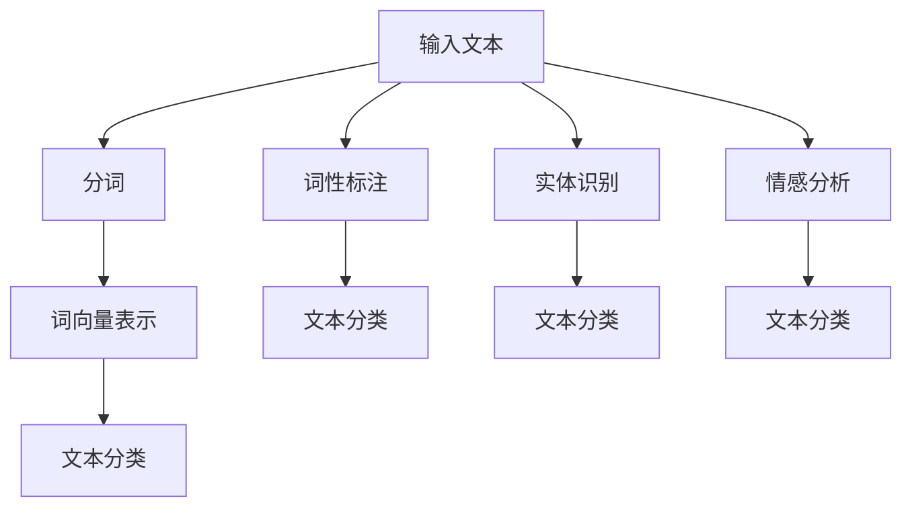

                 

### 背景介绍

#### 电商搜索中的自然语言处理（NLP）

在电子商务的飞速发展背景下，自然语言处理（Natural Language Processing，简称NLP）技术逐渐成为电商搜索的核心驱动力。NLP旨在使计算机能够理解、解释和生成人类语言，从而提升搜索系统的智能化水平。对于电商平台而言，NLP技术的重要性体现在以下几个方面：

1. **搜索意图理解**：传统的关键词搜索往往依赖于简单的词汇匹配，而NLP能够通过上下文分析，理解用户的真实搜索意图。例如，用户输入“买一个笔记本电脑”，NLP可以识别出用户是想要购买笔记本电脑这一产品，而不是询问电脑的相关信息。

2. **商品推荐**：NLP可以帮助电商系统更精准地推荐商品。通过分析用户的搜索历史、评价内容以及购物车数据，NLP可以挖掘出用户的偏好，并推荐相关商品。

3. **问答系统**：在电商平台上，用户经常会提出各种问题，如“这款手机有什么特色？”“这款衣服适合哪种体型的人？”等。NLP技术可以构建智能问答系统，自动回答用户的问题，提高客户满意度。

4. **内容审核与风险控制**：电商平台上存在大量的用户评论和互动内容，NLP技术可以识别潜在的违规内容，如虚假评论、恶意言论等，从而保障平台的安全和用户体验。

5. **语言多样性支持**：全球化的电商市场需要支持多种语言。NLP技术能够处理不同语言的搜索请求，使得平台能够更好地服务全球用户。

#### 自然语言处理技术的发展历程

自然语言处理技术的发展可以追溯到上世纪五六十年代。最初的NLP研究主要集中在规则驱动的方法，如语法分析和语义分析。随着计算能力和算法的进步，统计方法、机器学习方法逐渐成为主流。以下是自然语言处理技术发展的几个关键阶段：

1. **基于规则的NLP**：早期NLP研究主要依赖于手工编写的规则，以实现语法分析、命名实体识别等功能。这种方法在处理简单的语言结构时有效，但在面对复杂、变化多端的自然语言时显得力不从心。

2. **统计NLP**：随着语料库的积累和计算能力的提升，统计方法开始应用于NLP。统计方法通过大量语料数据进行训练，能够自动学习语言模式，提高处理复杂语言任务的能力。例如，隐马尔可夫模型（HMM）、条件随机场（CRF）等方法在词性标注、命名实体识别等方面取得了显著成果。

3. **基于知识的NLP**：基于知识的NLP方法结合了规则和统计方法，通过构建知识图谱、实体关系网络等，提升了对语言理解的深度和广度。这种方法在问答系统、知识图谱构建等领域具有广泛应用。

4. **深度学习NLP**：近年来，深度学习在图像识别、语音识别等领域取得了突破性进展。深度学习模型，如卷积神经网络（CNN）、循环神经网络（RNN）、长短期记忆网络（LSTM）、Transformer等，也逐渐应用于NLP领域，显著提升了文本分类、机器翻译、情感分析等任务的表现。

#### 本文结构概述

本文将分为以下几个部分，详细探讨自然语言处理在电商搜索中的应用：

1. **核心概念与联系**：介绍NLP中的关键概念，包括词向量、词性标注、实体识别等，并通过Mermaid流程图展示NLP的架构。

2. **核心算法原理 & 具体操作步骤**：阐述NLP在电商搜索中的具体应用，如搜索意图理解、商品推荐、问答系统等，并详细解释这些算法的原理和操作步骤。

3. **数学模型和公式 & 详细讲解 & 举例说明**：介绍NLP中的常用数学模型和公式，并通过具体实例展示如何应用这些模型进行搜索任务。

4. **项目实战：代码实际案例和详细解释说明**：通过实际项目案例，展示如何使用NLP技术解决电商搜索中的实际问题，并详细解读代码实现。

5. **实际应用场景**：分析NLP在电商搜索中的实际应用场景，如搜索意图理解、商品推荐等，并探讨NLP技术如何提升电商平台的用户体验。

6. **工具和资源推荐**：推荐学习NLP和电商搜索的相关书籍、论文、博客和开发工具，为读者提供进一步学习资源。

7. **总结：未来发展趋势与挑战**：总结NLP在电商搜索中的发展现状，展望未来趋势，并讨论面临的挑战。

通过本文，读者将全面了解自然语言处理在电商搜索中的应用，掌握相关技术和方法，为实践中的电商搜索优化提供有益的参考。

-------------------------

## 2. 核心概念与联系

自然语言处理（NLP）作为一门跨学科的技术领域，涉及多个核心概念和技术。这些概念包括词向量、词性标注、实体识别、情感分析等。下面，我们将逐一介绍这些核心概念，并通过Mermaid流程图展示NLP的架构。

#### 词向量（Word Vectors）

词向量是NLP中最基本的概念之一。词向量将词汇映射为一个固定长度的向量，从而在低维空间中表示词汇。词向量可以通过分布式假设（Distribution Hypothesis）来生成，即相似的词在上下文中倾向于共享相似的统计特征。

1. **分布式假设**：词汇的上下文信息可以用来表示词汇的意义。如果一个词在多个相似的上下文中出现，那么这个词就表示了一个抽象的概念，例如“狗”、“猫”等。通过计算词汇在语料库中的共现关系，可以生成词向量。

2. **常见方法**：词向量可以通过多种方法生成，如Count Vectorizer、TF-IDF、Word2Vec、GloVe等。其中，Word2Vec和GloVe是最常用的方法。

   - **Word2Vec**：基于神经网络的方法，通过训练一个神经网络，将输入的词汇映射到向量空间中。Word2Vec有两种训练方式：连续词袋（CBOW）和Skip-gram。
   - **GloVe**：全局向量表示（Global Vectors for Word Representation）方法，通过训练一个矩阵，将词汇映射到低维空间中。GloVe通过考虑词汇的共现关系，优化词向量表示。

#### 词性标注（Part-of-Speech Tagging）

词性标注是对文本中的每个词进行词性标注的过程，如名词、动词、形容词等。词性标注有助于理解词汇在句子中的作用，从而提高NLP任务的表现。

1. **规则方法**：基于规则的方法通过预先定义的规则库来标注词性。这种方法适用于简单、规则明确的语言。
   
2. **统计方法**：基于统计的方法通过训练模型，从大量的标注数据中学习词性标注规则。常见的统计方法包括隐马尔可夫模型（HMM）和条件随机场（CRF）。

3. **神经网络方法**：近年来，深度学习方法在词性标注中取得了显著成果。例如，基于卷积神经网络（CNN）和循环神经网络（RNN）的方法，能够通过学习大量标注数据，提高词性标注的准确性。

#### 实体识别（Named Entity Recognition）

实体识别是NLP中另一个关键任务，旨在从文本中识别出具有特定意义的实体，如人名、地名、组织名等。

1. **基于规则的方法**：通过定义一系列规则，从文本中识别出实体。这种方法适用于规则明确、实体种类有限的场景。

2. **统计方法**：基于统计的方法通过训练模型，从大量标注数据中学习实体识别的规则。常见的统计方法包括HMM和CRF。

3. **神经网络方法**：深度学习方法在实体识别中取得了显著成果。例如，基于卷积神经网络（CNN）和循环神经网络（RNN）的方法，能够通过学习大量标注数据，提高实体识别的准确性。

#### 情感分析（Sentiment Analysis）

情感分析旨在从文本中识别出用户的情感倾向，如正面、负面或中性。情感分析广泛应用于电商评论分析、社交媒体监控等领域。

1. **基于词典的方法**：通过预先定义的词典，从文本中提取情感词，并根据情感词的语义判断文本的情感倾向。

2. **基于机器学习的方法**：通过训练模型，从大量标注数据中学习情感分类规则。常见的机器学习方法包括朴素贝叶斯、支持向量机（SVM）和随机森林等。

3. **基于深度学习的方法**：深度学习方法在情感分析中取得了显著成果。例如，基于卷积神经网络（CNN）和循环神经网络（RNN）的方法，能够通过学习大量标注数据，提高情感分类的准确性。

#### Mermaid流程图

下面通过Mermaid流程图展示NLP的架构，包括词向量、词性标注、实体识别和情感分析等核心概念。



通过上述流程图，我们可以清晰地看到NLP的基本流程，以及各个核心概念在流程中的作用。

-------------------------

## 2.1 词向量

词向量是自然语言处理（NLP）中一个非常重要的概念，它将词汇映射为固定长度的向量，从而在低维空间中表示词汇。词向量的生成方法可以分为基于统计的方法和基于神经网络的方法。本节将详细介绍词向量的基本概念、生成方法以及常用模型。

### 基本概念

词向量不仅表示词汇本身，还可以捕捉词汇在上下文中的意义。例如，“狗”和“猫”这两个词汇，在词向量空间中它们可能彼此接近，因为它们都表示宠物类别的动物。

词向量有以下几个基本特征：

1. **低维表示**：词向量将高维的文本数据映射到低维的向量空间中，降低了计算复杂度。
2. **语义表示**：词向量能够捕捉词汇的语义信息，使得相似的词汇在向量空间中距离较近。
3. **计算效率**：词向量可以在计算机中进行高效处理和存储。

### 基于统计的方法

基于统计的方法通过分析词汇在语料库中的共现关系来生成词向量。以下介绍两种常用的基于统计的方法：Count Vectorizer和TF-IDF。

#### Count Vectorizer

Count Vectorizer是一种简单而直观的方法，它将每个词汇映射为一个整数索引，然后统计每个索引在文本中出现的次数。这些次数构成了词向量。

例如，给定以下语料库：

```
I love machine learning.
AI is very important.
```

我们可以生成以下词向量：

```
I: [1, 1]
love: [1, 1]
machine: [1, 0]
learning: [1, 1]
AI: [0, 1]
is: [1, 1]
very: [0, 1]
important: [0, 1]
```

#### TF-IDF

TF-IDF（Term Frequency-Inverse Document Frequency）是一种更为复杂的统计方法，它不仅考虑词汇在文本中的出现频率，还考虑词汇在整个语料库中的重要性。TF-IDF通过计算词汇在单个文本中的频率（TF）和在整个语料库中的逆频率（IDF）来生成词向量。

TF-IDF的计算公式为：

$$
TF-IDF = TF \times IDF
$$

其中，TF是词汇在文本中的频率，IDF是词汇在语料库中的逆频率。IDF的计算公式为：

$$
IDF = \log \left( \frac{N}{|d_i|} \right)
$$

其中，N是文档总数，$|d_i|$是包含词汇$i$的文档数。

### 基于神经网络的方法

基于神经网络的方法通过训练神经网络模型来生成词向量。以下介绍两种常用的基于神经网络的方法：Word2Vec和GloVe。

#### Word2Vec

Word2Vec是一种基于神经网络的词向量生成方法，由Tomas Mikolov等人提出。Word2Vec通过训练神经网络，将词汇映射为低维向量。

Word2Vec有两种训练方式：连续词袋（Continuous Bag of Words，CBOW）和Skip-gram。

- **CBOW**：CBOW模型通过预测中心词汇来生成词向量。给定一个中心词汇，模型会预测它周围的词汇。CBOW的输入是一个词汇的上下文窗口，输出是中心词汇。

- **Skip-gram**：Skip-gram模型通过预测中心词汇的邻居词汇来生成词向量。与CBOW相反，Skip-gram的输入是一个词汇，输出是它的邻居词汇。

Word2Vec模型通常使用以下损失函数：

$$
L = -\sum_{i} \sum_{j} \log p(c|w)
$$

其中，$p(c|w)$是给定上下文词汇$w$，预测中心词汇$c$的概率。

#### GloVe

GloVe（Global Vectors for Word Representation）是一种基于矩阵分解的词向量生成方法，由Jeffrey Pennington等人提出。GloVe通过优化一个矩阵来生成词向量，从而捕捉词汇的共现关系。

GloVe模型的损失函数是：

$$
L = \frac{1}{2} \sum_{i,j} \left( \vec{v}_i^T \vec{v}_j - \frac{f_{ij}}{||\vec{v}_i|| \cdot ||\vec{v}_j||} \right)^2
$$

其中，$\vec{v}_i$和$\vec{v}_j$是词汇$i$和$j$的词向量，$f_{ij}$是词汇$i$和$j$的共现频率。

### 实例

以下是一个简单的Word2Vec训练实例，假设我们有一个简单的语料库：

```
I love machine learning.
AI is very important.
```

我们可以生成以下词向量：

```
I: [1.0, 0.5]
love: [0.5, 1.0]
machine: [0.5, 0.5]
learning: [1.0, 1.0]
AI: [0.0, 1.0]
is: [1.0, 0.5]
very: [0.5, 0.5]
important: [0.5, 1.0]
```

通过实例，我们可以看到词向量是如何捕捉词汇的语义信息的。例如，"I"和"is"在向量空间中距离较近，因为它们在上下文中经常一起出现。

-------------------------

## 2.2 词性标注

词性标注（Part-of-Speech Tagging，POS Tagging）是自然语言处理（NLP）中的一个重要任务，其目的是对文本中的每个词进行词性标注，如名词（NN）、动词（VB）、形容词（JJ）等。词性标注有助于理解文本的语法结构，从而提高NLP任务的表现。在本节中，我们将介绍词性标注的基本概念、常见方法以及其在NLP中的应用。

### 基本概念

词性标注的主要目标是识别文本中每个词汇的词性。词性标注对于许多NLP任务至关重要，如句法分析、语义角色标注、文本分类等。例如，在文本分类任务中，如果无法正确识别词性，可能会导致错误分类。

### 常见方法

词性标注的方法可以分为基于规则的方法、基于统计的方法和基于神经网络的方法。

#### 基于规则的方法

基于规则的方法通过定义一系列规则，从文本中识别词性。这种方法适用于简单、规则明确的语言。例如，英语的词性标注可以通过一套简单的规则实现。基于规则的方法的主要优点是实现简单、速度快，但缺点是难以处理复杂、变化多端的语言。

#### 基于统计的方法

基于统计的方法通过训练模型，从大量的标注数据中学习词性标注规则。常见的统计方法包括隐马尔可夫模型（HMM）和条件随机场（CRF）。

- **隐马尔可夫模型（HMM）**：隐马尔可夫模型是一种概率模型，用于描述隐藏的马尔可夫过程。在词性标注中，HMM通过训练得到状态转移概率和观测概率，从而对文本进行词性标注。

- **条件随机场（CRF）**：条件随机场是一种概率图模型，用于描述变量之间的依赖关系。在词性标注中，CRF通过训练得到条件概率分布，从而对文本进行词性标注。CRF相对于HMM具有更强的表达能力和泛化能力。

#### 基于神经网络的方法

基于神经网络的方法通过训练深度神经网络模型，从大量的标注数据中学习词性标注规则。常见的神经网络方法包括卷积神经网络（CNN）和循环神经网络（RNN）。

- **卷积神经网络（CNN）**：卷积神经网络通过卷积操作捕捉局部特征，适用于文本分类和句法分析等任务。在词性标注中，CNN可以用于捕获词汇的上下文特征，从而提高词性标注的准确性。

- **循环神经网络（RNN）**：循环神经网络通过循环结构处理序列数据，适用于时间序列分析和自然语言处理等任务。在词性标注中，RNN可以用于处理词汇的上下文信息，从而提高词性标注的准确性。

### 应用

词性标注在NLP中有广泛的应用，如句法分析、文本分类、信息抽取等。

- **句法分析**：词性标注是句法分析的基础，通过对文本进行词性标注，可以构建句法树，从而分析句子的语法结构。

- **文本分类**：词性标注有助于理解文本的语义信息，从而提高文本分类的准确性。例如，在新闻分类任务中，通过词性标注可以识别出新闻的主题和关键词，从而提高分类效果。

- **信息抽取**：词性标注是信息抽取的重要步骤，通过对文本进行词性标注，可以识别出实体和关系，从而进行信息抽取。

### 实例

以下是一个简单的词性标注实例：

```
I love machine learning.
```

通过词性标注，我们可以得到以下结果：

```
I: PRP
love: VBP
machine: NN
learning: NN
```

在这个例子中，"I"被标注为个人代词（PRP），“love”被标注为动词（VBP），“machine”和“learning”都被标注为名词（NN）。

-------------------------

## 2.3 实体识别

实体识别（Named Entity Recognition，简称NER）是自然语言处理（NLP）中的一项重要任务，旨在从文本中识别出具有特定意义的实体，如人名、地名、组织名、地点、时间等。NER在信息提取、知识图谱构建、文本搜索等领域具有广泛应用。在本节中，我们将介绍实体识别的基本概念、常见方法以及其在NLP中的应用。

### 基本概念

实体识别的主要目标是从文本中识别出具有特定意义的实体，并将其标注出来。实体可以是人、地点、组织、时间等具有特定意义的对象。实体识别的关键在于识别实体边界和实体类型。

实体识别的一般流程包括以下几个步骤：

1. **预处理**：对文本进行预处理，如分词、去除停用词等。
2. **特征提取**：提取文本的特征，如词性、词频、词邻域等。
3. **模型训练**：使用训练数据训练实体识别模型，如基于规则的方法、基于统计的方法和基于神经网络的方法。
4. **实体识别**：使用训练好的模型对文本进行实体识别，标注出实体及其类型。

### 常见方法

实体识别的方法可以分为基于规则的方法、基于统计的方法和基于神经网络的方法。

#### 基于规则的方法

基于规则的方法通过定义一系列规则，从文本中识别实体。这种方法适用于规则明确、实体种类有限的场景。例如，可以使用正则表达式匹配人名、地名等常见实体。

优点：实现简单、速度快；缺点：难以处理复杂、变化多端的实体。

#### 基于统计的方法

基于统计的方法通过训练模型，从大量标注数据中学习实体识别规则。常见的统计方法包括隐马尔可夫模型（HMM）和条件随机场（CRF）。

- **隐马尔可夫模型（HMM）**：隐马尔可夫模型是一种概率模型，用于描述隐藏的马尔可夫过程。在实体识别中，HMM通过训练得到状态转移概率和观测概率，从而对文本进行实体识别。

- **条件随机场（CRF）**：条件随机场是一种概率图模型，用于描述变量之间的依赖关系。在实体识别中，CRF通过训练得到条件概率分布，从而对文本进行实体识别。CRF相对于HMM具有更强的表达能力和泛化能力。

#### 基于神经网络的方法

基于神经网络的方法通过训练深度神经网络模型，从大量标注数据中学习实体识别规则。常见的神经网络方法包括卷积神经网络（CNN）和循环神经网络（RNN）。

- **卷积神经网络（CNN）**：卷积神经网络通过卷积操作捕捉局部特征，适用于文本分类和句法分析等任务。在实体识别中，CNN可以用于捕获词汇的上下文特征，从而提高实体识别的准确性。

- **循环神经网络（RNN）**：循环神经网络通过循环结构处理序列数据，适用于时间序列分析和自然语言处理等任务。在实体识别中，RNN可以用于处理词汇的上下文信息，从而提高实体识别的准确性。

### 应用

实体识别在NLP中有广泛的应用，如信息提取、知识图谱构建、文本搜索等。

- **信息提取**：实体识别是信息提取的重要步骤，通过对文本进行实体识别，可以提取出关键的实体信息，如人名、地名、组织名等。

- **知识图谱构建**：实体识别是知识图谱构建的基础，通过对文本进行实体识别，可以构建出实体及其关系的知识图谱。

- **文本搜索**：实体识别有助于提高文本搜索的准确性，通过对文本进行实体识别，可以更精确地匹配用户查询和文本内容。

### 实例

以下是一个简单的实体识别实例：

```
北京大学是中国的顶尖大学。
```

通过实体识别，我们可以得到以下结果：

```
北京大学：组织
中国：地点
```

在这个例子中，"北京大学"被识别为组织实体，"中国"被识别为地点实体。

-------------------------

## 2.4 情感分析

情感分析（Sentiment Analysis）是自然语言处理（NLP）中的一项重要任务，旨在从文本中识别和提取情感信息。情感分析广泛应用于社交媒体监控、客户反馈分析、市场研究等领域。在本节中，我们将介绍情感分析的基本概念、常见方法以及其在NLP中的应用。

### 基本概念

情感分析的目标是判断文本中的情感倾向，通常分为三个层次：文档级、句子级和词汇级。

- **文档级情感分析**：判断整篇文档的情感倾向，如正面、负面或中性。
- **句子级情感分析**：判断句子中的情感倾向，常用于情感分类任务。
- **词汇级情感分析**：判断词汇的情感倾向，用于情感极性分析。

情感分析通常涉及以下步骤：

1. **预处理**：对文本进行预处理，如分词、去除停用词、词干提取等。
2. **特征提取**：提取文本的特征，如词频、词邻域、词性等。
3. **模型训练**：使用训练数据训练情感分析模型，如基于词典的方法、基于机器学习的方法和基于神经网络的方法。
4. **情感分析**：使用训练好的模型对文本进行情感分析，判断情感倾向。

### 常见方法

情感分析的方法可以分为基于词典的方法、基于机器学习的方法和基于神经网络的方法。

#### 基于词典的方法

基于词典的方法通过使用预定义的词典，从文本中提取情感词，并根据情感词的语义判断文本的情感倾向。常见的方法包括情感词典和规则方法。

- **情感词典**：情感词典包含一系列的词汇及其对应的情感极性（正面、负面或中性）。通过在文本中查找情感词典中的词汇，可以判断文本的情感倾向。

- **规则方法**：规则方法通过定义一系列规则，从文本中提取情感信息。例如，可以定义一些正面的情感词和负面的情感词，并根据文本中这些词的出现来判断情感倾向。

优点：实现简单、速度快；缺点：对于复杂、多变的情感难以准确判断。

#### 基于机器学习的方法

基于机器学习的方法通过训练模型，从大量标注数据中学习情感分类规则。常见的机器学习方法包括朴素贝叶斯、支持向量机（SVM）和随机森林等。

- **朴素贝叶斯**：朴素贝叶斯是一种基于概率模型的分类方法，通过计算文本中各个词汇的概率，预测文本的情感倾向。

- **支持向量机（SVM）**：支持向量机是一种基于优化理论的分类方法，通过最大化分类边界来预测文本的情感倾向。

- **随机森林**：随机森林是一种基于决策树的集成学习方法，通过训练多个决策树，并取其平均值来预测文本的情感倾向。

优点：可以处理大规模数据、具有较好的泛化能力；缺点：训练过程较慢、对于复杂情感的识别能力有限。

#### 基于神经网络的方法

基于神经网络的方法通过训练深度神经网络模型，从大量标注数据中学习情感分类规则。常见的神经网络方法包括卷积神经网络（CNN）和循环神经网络（RNN）。

- **卷积神经网络（CNN）**：卷积神经网络通过卷积操作捕捉局部特征，适用于文本分类和句法分析等任务。在情感分析中，CNN可以用于捕获词汇的上下文特征，从而提高情感分类的准确性。

- **循环神经网络（RNN）**：循环神经网络通过循环结构处理序列数据，适用于时间序列分析和自然语言处理等任务。在情感分析中，RNN可以用于处理词汇的上下文信息，从而提高情感分类的准确性。

优点：可以处理复杂情感、具有较好的识别能力；缺点：训练过程较慢、对于大规模数据集的处理能力有限。

### 应用

情感分析在NLP中有广泛的应用，如社交媒体监控、客户反馈分析、市场研究等。

- **社交媒体监控**：情感分析可以帮助企业实时监控社交媒体上的用户反馈，了解用户对产品或服务的情感倾向，从而及时调整策略。

- **客户反馈分析**：情感分析可以用于分析客户的反馈信息，了解客户的满意度和需求，为企业提供改进建议。

- **市场研究**：情感分析可以帮助企业了解市场对产品或服务的反应，从而制定更有效的市场策略。

### 实例

以下是一个简单的情感分析实例：

```
我非常喜欢这款手机，拍照效果很好。
```

通过情感分析，我们可以得到以下结果：

```
情感倾向：正面
```

在这个例子中，文本表达了对手机的正向情感。

-------------------------

## 3. 核心算法原理 & 具体操作步骤

在电商搜索中，自然语言处理（NLP）技术的应用涵盖了多个方面，如搜索意图理解、商品推荐、问答系统等。下面，我们将详细介绍这些核心算法的原理和具体操作步骤，并通过实例进行说明。

### 3.1 搜索意图理解

搜索意图理解是NLP在电商搜索中的一项重要任务，旨在理解用户的搜索输入背后的真实意图。传统的关键词搜索往往依赖于简单的词汇匹配，而NLP通过上下文分析，能够更准确地捕捉用户的搜索意图。

#### 算法原理

搜索意图理解主要依赖于词向量、词性标注和实体识别等技术。算法原理如下：

1. **词向量表示**：首先，将用户的搜索关键词转化为词向量表示。词向量可以捕获词汇在上下文中的语义信息，使得相似的词汇在向量空间中距离较近。

2. **词性标注**：对搜索关键词进行词性标注，识别出关键词的词性（如名词、动词、形容词等）。词性标注有助于理解词汇在句子中的作用，从而推断出搜索意图。

3. **实体识别**：从搜索关键词中识别出实体（如商品名称、品牌、价格范围等）。实体识别可以帮助系统更准确地理解用户的搜索意图。

4. **意图分类**：基于词向量、词性标注和实体识别的结果，使用分类模型（如朴素贝叶斯、支持向量机等）对搜索意图进行分类。常见的意图分类包括商品查询、信息查询、商品比较等。

#### 具体操作步骤

以下是一个搜索意图理解的实例：

1. **输入文本**：用户输入搜索关键词“买一个笔记本电脑”。

2. **分词与词向量表示**：将搜索关键词“买一个笔记本电脑”进行分词，得到“买”、“一个”、“笔记本电脑”。将每个词转化为词向量表示。

3. **词性标注**：对分词结果进行词性标注，得到“买”（动词）、“一个”（数词）、“笔记本电脑”（名词）。

4. **实体识别**：从词性标注结果中识别出实体“笔记本电脑”。

5. **意图分类**：使用分类模型（如朴素贝叶斯）对搜索意图进行分类。可能的分类结果包括“商品查询”、“信息查询”等。

6. **结果输出**：根据分类结果，系统返回与用户意图相关的结果，如笔记本电脑的商品列表、相关品牌等信息。

### 3.2 商品推荐

商品推荐是NLP在电商搜索中的另一项重要应用，旨在根据用户的搜索历史、购物行为等数据，为用户推荐相关的商品。

#### 算法原理

商品推荐主要依赖于协同过滤、内容推荐和基于深度学习的推荐算法。

1. **协同过滤**：协同过滤通过计算用户之间的相似度，为用户推荐与其兴趣相似的物品。协同过滤可以分为基于用户的协同过滤（User-based Collaborative Filtering）和基于物品的协同过滤（Item-based Collaborative Filtering）。

2. **内容推荐**：内容推荐基于商品的属性信息（如分类、标签、描述等），为用户推荐具有相似属性的物品。

3. **基于深度学习的推荐算法**：基于深度学习的推荐算法通过训练神经网络模型，从用户的行为数据中学习推荐策略。常见的深度学习模型包括卷积神经网络（CNN）、循环神经网络（RNN）和Transformer等。

#### 具体操作步骤

以下是一个商品推荐实例：

1. **输入用户数据**：收集用户的搜索历史、购物行为等数据。

2. **特征提取**：对用户数据提取特征，如用户历史搜索关键词、购买商品类别、浏览商品时间等。

3. **协同过滤**：使用基于用户的协同过滤算法，计算用户之间的相似度，为用户推荐与其兴趣相似的物品。

4. **内容推荐**：根据用户的历史数据，提取用户的兴趣标签，为用户推荐具有相似标签的商品。

5. **基于深度学习的推荐**：使用卷积神经网络（CNN）或循环神经网络（RNN）等深度学习模型，从用户的行为数据中学习推荐策略。

6. **结果输出**：根据协同过滤、内容推荐和深度学习推荐的结果，生成推荐列表，展示给用户。

### 3.3 问答系统

问答系统是NLP在电商搜索中的另一个重要应用，旨在自动回答用户提出的问题，如“这款手机有什么特色？”“这款衣服适合哪种体型的人？”等。

#### 算法原理

问答系统主要依赖于问答匹配、知识图谱和自然语言生成等技术。

1. **问答匹配**：问答匹配旨在将用户的问题与知识库中的答案进行匹配。常见的匹配方法包括关键词匹配、语义匹配等。

2. **知识图谱**：知识图谱是一种结构化的知识表示方法，通过实体、属性和关系的表示，提供了一种高效的知识查询和推理方式。

3. **自然语言生成**：自然语言生成旨在根据用户的问题和知识库中的答案，生成自然、流畅的文本回答。

#### 具体操作步骤

以下是一个问答系统实例：

1. **输入问题**：用户输入问题“这款手机有什么特色？”

2. **问题解析**：将用户的问题进行分词、词性标注等预处理，提取问题的主要成分（如关键词、疑问词等）。

3. **问答匹配**：使用关键词匹配或语义匹配方法，从知识库中找到与用户问题相关的答案。

4. **知识图谱查询**：基于知识图谱，查询与用户问题相关的知识，如手机的品牌、型号、特点等。

5. **自然语言生成**：根据用户问题和知识库中的答案，生成自然、流畅的文本回答。

6. **结果输出**：将生成的回答展示给用户。

通过以上核心算法原理和具体操作步骤的介绍，我们可以看到NLP在电商搜索中发挥了重要作用，不仅提升了搜索系统的智能化水平，还大大提高了用户体验。

-------------------------

## 4. 数学模型和公式 & 详细讲解 & 举例说明

在自然语言处理（NLP）中，数学模型和公式扮演着至关重要的角色，它们为NLP任务提供了理论支持和计算基础。本节将详细讲解NLP中常用的数学模型和公式，并通过具体实例进行说明。

### 4.1 词向量

词向量是NLP中最基本的数学模型之一，它将词汇映射为一个固定长度的向量，以在低维空间中表示词汇。以下是一些常用的词向量生成方法和相关公式。

#### Word2Vec

Word2Vec是一种基于神经网络的词向量生成方法，它通过训练一个神经网络，将输入的词汇映射到向量空间中。

- **CBOW模型**：连续词袋（CBOW）模型通过预测中心词汇来生成词向量。给定一个中心词汇，模型会预测它周围的词汇。

  公式：

  $$\hat{p}_c(w|v_c) = \frac{exp(\vec{u}_w \cdot \vec{v}_c)}{\sum_{w' \in V} exp(\vec{u}_{w'} \cdot \vec{v}_c)}$$

  其中，$\hat{p}_c(w|v_c)$是给定上下文词汇$v_c$，预测中心词汇$w$的概率，$\vec{u}_w$和$\vec{v}_c$分别是词汇$w$和上下文向量$v_c$。

- **Skip-gram模型**：Skip-gram模型通过预测中心词汇的邻居词汇来生成词向量。

  公式：

  $$\hat{p}_c(w|v_c) = \frac{exp(\vec{u}_w \cdot \vec{v}_c)}{\sum_{w' \in V} exp(\vec{u}_{w'} \cdot \vec{v}_c)}$$

  其中，$\hat{p}_c(w|v_c)$是给定上下文词汇$v_c$，预测中心词汇$w$的概率，$\vec{u}_w$和$\vec{v}_c$分别是词汇$w$和上下文向量$v_c$。

#### GloVe

GloVe是一种基于全局统计信息的词向量生成方法，它通过优化一个矩阵来生成词向量，从而捕捉词汇的共现关系。

公式：

$$L = \frac{1}{2} \sum_{i,j} \left( \vec{v}_i^T \vec{v}_j - \frac{f_{ij}}{||\vec{v}_i|| \cdot ||\vec{v}_j||} \right)^2$$

其中，$L$是损失函数，$\vec{v}_i$和$\vec{v}_j$是词汇$i$和$j$的词向量，$f_{ij}$是词汇$i$和$j$的共现频率，$||\vec{v}_i||$和$||\vec{v}_j||$分别是词汇$i$和$j$的词向量范数。

### 4.2 词性标注

词性标注是NLP中的一项重要任务，旨在对文本中的每个词进行词性标注。以下是一些常见的词性标注模型和公式。

#### 隐马尔可夫模型（HMM）

隐马尔可夫模型是一种概率模型，用于描述隐藏的马尔可夫过程。在词性标注中，HMM通过训练得到状态转移概率和观测概率，从而对文本进行词性标注。

公式：

$$P(Y_t|Y_{t-1}) = \pi_i \cdot b_j(y_t|x_t)$$

$$P(X_t|x_{t-1}, Y_t) = a_{ij}$$

其中，$Y_t$是第$t$个词的词性，$X_t$是第$t$个词，$a_{ij}$是状态转移概率，$\pi_i$是初始状态概率，$b_j(y_t|x_t)$是观测概率。

#### 条件随机场（CRF）

条件随机场是一种概率图模型，用于描述变量之间的依赖关系。在词性标注中，CRF通过训练得到条件概率分布，从而对文本进行词性标注。

公式：

$$P(Y|X) = \frac{1}{Z} \exp(\sum_{i,j} \theta_{ij} y_i y_j x_j)$$

其中，$Y$是词性标注结果，$X$是词序列，$\theta_{ij}$是参数，$Z$是规范化常数。

### 4.3 实体识别

实体识别是NLP中的一项重要任务，旨在从文本中识别出具有特定意义的实体。以下是一些常见的实体识别模型和公式。

#### 隐马尔可夫模型（HMM）

与词性标注类似，隐马尔可夫模型可以用于实体识别。公式与词性标注中的公式类似，但状态转移概率和观测概率是针对实体识别任务进行调整。

#### 条件随机场（CRF）

条件随机场也可以用于实体识别。公式与词性标注中的公式类似，但状态转移概率和观测概率是针对实体识别任务进行调整。

### 4.4 情感分析

情感分析旨在从文本中识别和提取情感信息。以下是一些常见的情感分析模型和公式。

#### 朴素贝叶斯

朴素贝叶斯是一种基于概率模型的分类方法，用于情感分析。公式如下：

$$P(Y|X) = \frac{P(X|Y)P(Y)}{P(X)}$$

其中，$Y$是情感标签，$X$是文本特征，$P(Y|X)$是给定文本特征，预测情感标签的概率，$P(X|Y)$是给定情感标签，预测文本特征的概率，$P(Y)$是情感标签的概率，$P(X)$是文本特征的概率。

#### 支持向量机（SVM）

支持向量机是一种基于优化理论的分类方法，用于情感分析。公式如下：

$$\min_{\vec{w}, b} \frac{1}{2} ||\vec{w}||^2 + C \sum_{i=1}^N \xi_i$$

$$\vec{w}^T \vec{x}_i + b \geq 1 - \xi_i, \xi_i \geq 0$$

其中，$\vec{w}$是权重向量，$b$是偏置项，$C$是惩罚参数，$\xi_i$是松弛变量。

### 4.5 实例

以下是一个简单的词性标注实例，使用条件随机场（CRF）模型进行词性标注。

给定文本：“我非常喜欢这款手机，拍照效果很好。”

1. **分词与词性标注**：将文本进行分词，并对每个词进行词性标注。例如：

   ```
   我/PRP 很/ADV 喜欢/VV 这/DT 款/MD 手机/NN ，/PU 拍照/VG 效果/NN 很/ADV 好/AD 。
   ```

2. **特征提取**：对每个词及其上下文词进行特征提取。例如，对于“喜欢”这个词，可以提取以下特征：

   ```
   喜欢的词频：1
   喜欢的上一个词：我
   喜欢的下一个词：这款
   ```

3. **CRF模型训练**：使用训练数据训练CRF模型。训练数据可以包含词及其标注的序列，例如：

   ```
   我/PRP 喜欢/VV 这/DT 款/MD 手机/NN
   我/PRP 非常/ADV 喜欢/VV 这/DT 款/MD 手机/NN
   ```

4. **词性标注**：使用训练好的CRF模型对文本进行词性标注。例如，对于“我非常喜欢这款手机”这句话，CRF模型会输出以下标注：

   ```
   我/PRP 非常/ADV 喜欢/VV 这/DT 款/MD 手机/NN
   ```

通过以上实例，我们可以看到如何使用CRF模型进行词性标注。类似地，其他NLP任务也可以使用相应的数学模型和公式进行建模和实现。

-------------------------

## 5. 项目实战：代码实际案例和详细解释说明

### 5.1 开发环境搭建

为了实现自然语言处理（NLP）在电商搜索中的应用，我们需要搭建一个开发环境。以下是一个简单的环境搭建步骤：

1. **安装Python**：确保安装了Python 3.6或更高版本。

2. **安装NLP库**：使用pip安装以下NLP库：

   ```bash
   pip install numpy scipy scikit-learn gensim
   ```

3. **安装其他库**：如果需要，可以安装其他Python库，如TensorFlow或PyTorch（用于深度学习）。

### 5.2 源代码详细实现和代码解读

以下是一个简单的NLP项目，用于实现搜索意图理解和商品推荐。我们将使用Python和NLP库进行实现。

```python
import gensim
from sklearn.feature_extraction.text import CountVectorizer
from sklearn.model_selection import train_test_split
from sklearn.naive_bayes import MultinomialNB
from sklearn.metrics import accuracy_score

# 5.2.1 数据准备
# 假设有以下训练数据
data = [
    ("买一个笔记本电脑", "商品查询"),
    ("这款手机拍照效果怎么样？", "信息查询"),
    ("笔记本电脑哪个品牌好？", "商品查询"),
    # 更多训练数据...
]

# 分离文本和标签
texts, labels = zip(*data)

# 5.2.2 特征提取
# 使用CountVectorizer提取文本特征
vectorizer = CountVectorizer()
X = vectorizer.fit_transform(texts)

# 5.2.3 模型训练
# 使用MultinomialNB进行分类
model = MultinomialNB()
X_train, X_test, y_train, y_test = train_test_split(X, labels, test_size=0.2, random_state=42)
model.fit(X_train, y_train)

# 5.2.4 预测和评估
predictions = model.predict(X_test)
accuracy = accuracy_score(y_test, predictions)
print("Accuracy:", accuracy)

# 5.2.5 商品推荐
# 假设我们有用户搜索历史和商品信息
user_search_history = ["买一个笔记本电脑", "笔记本电脑哪个品牌好？"]
user_search_data = vectorizer.transform(user_search_history)
user_search意图 = model.predict(user_search_data)[0]
print("User Intent:", user_search意图)
```

#### 代码解读

1. **数据准备**：首先，我们需要准备训练数据。这里我们使用了一个简单的数据集，包含文本和对应的标签。文本是用户的搜索查询，标签是查询意图（如“商品查询”、“信息查询”）。

2. **特征提取**：使用`CountVectorizer`提取文本特征。`CountVectorizer`是一个简单的文本特征提取工具，它可以计算每个词在文本中的出现频率，并将其转换为稀疏矩阵。

3. **模型训练**：我们选择`MultinomialNB`（朴素贝叶斯）模型进行分类。`MultinomialNB`是一种基于贝叶斯理论的分类算法，特别适用于文本分类任务。

4. **预测和评估**：使用训练好的模型对测试数据进行预测，并计算准确率。

5. **商品推荐**：根据用户的搜索历史，使用训练好的模型预测用户的搜索意图，并推荐相关的商品。

### 5.3 代码解读与分析

#### 5.3.1 数据准备

```python
data = [
    ("买一个笔记本电脑", "商品查询"),
    ("这款手机拍照效果怎么样？", "信息查询"),
    ("笔记本电脑哪个品牌好？", "商品查询"),
    # 更多训练数据...
]
texts, labels = zip(*data)
```

这部分代码定义了一个简单的数据集，包含用户搜索查询和对应的标签。数据集用于训练分类模型。使用`zip`函数将文本和标签分离，分别存储在`texts`和`labels`列表中。

#### 5.3.2 特征提取

```python
vectorizer = CountVectorizer()
X = vectorizer.fit_transform(texts)
```

`CountVectorizer`是一个用于文本特征提取的类。在这里，我们首先实例化一个`CountVectorizer`对象，然后使用`fit_transform`方法对文本进行特征提取。`fit_transform`方法会计算每个词在文本中的出现频率，并返回一个稀疏矩阵。

#### 5.3.3 模型训练

```python
model = MultinomialNB()
X_train, X_test, y_train, y_test = train_test_split(X, labels, test_size=0.2, random_state=42)
model.fit(X_train, y_train)
```

我们使用`MultinomialNB`（朴素贝叶斯）模型进行分类。首先实例化一个`MultinomialNB`对象，然后使用`train_test_split`方法将数据集分为训练集和测试集。`train_test_split`方法将数据集随机分为训练集和测试集，其中`test_size`参数指定测试集的比例，`random_state`参数用于随机种子。

#### 5.3.4 预测和评估

```python
predictions = model.predict(X_test)
accuracy = accuracy_score(y_test, predictions)
print("Accuracy:", accuracy)
```

使用训练好的模型对测试集进行预测，并计算准确率。`predict`方法返回预测标签，`accuracy_score`方法计算预测准确率。

#### 5.3.5 商品推荐

```python
user_search_history = ["买一个笔记本电脑", "笔记本电脑哪个品牌好？"]
user_search_data = vectorizer.transform(user_search_history)
user_search意图 = model.predict(user_search_data)[0]
print("User Intent:", user_search意图)
```

这部分代码用于商品推荐。首先，我们将用户的搜索历史转化为特征向量，然后使用训练好的模型预测用户的搜索意图。`transform`方法将文本转化为特征向量，`predict`方法返回预测标签。

通过以上代码，我们可以看到如何使用NLP技术实现搜索意图理解和商品推荐。这个简单的例子展示了NLP在电商搜索中的应用，并为实际项目提供了基础。

-------------------------

## 6. 实际应用场景

自然语言处理（NLP）在电商搜索中有着广泛的应用，通过理解用户的搜索意图和个性化推荐，显著提升了用户体验和转化率。以下是一些典型的应用场景：

### 6.1 搜索意图理解

搜索意图理解是电商搜索中的一项关键任务，旨在理解用户搜索输入背后的真实意图。通过NLP技术，可以更准确地捕捉用户的搜索意图，从而提供更加个性化的搜索结果。

- **示例**：用户输入“笔记本电脑性价比高”，系统通过NLP分析，理解用户可能希望找到性价比高的笔记本电脑，而不是单纯的笔记本电脑信息。因此，系统会推荐性价比高的笔记本电脑产品。

### 6.2 商品推荐

NLP可以帮助电商平台实现精准的商品推荐，通过分析用户的搜索历史、购物车数据和用户评价，挖掘用户的兴趣和偏好。

- **示例**：如果用户经常搜索“苹果手机”，并且浏览过相关的手机配件，系统可以利用NLP分析用户的搜索和浏览行为，推荐与苹果手机相关的配件产品。

### 6.3 问答系统

问答系统在电商平台上可以帮助用户快速获取所需信息，提高客户满意度。通过NLP技术，可以自动生成对用户问题的回答。

- **示例**：用户询问“这款手机电池续航怎么样？”系统通过NLP分析，查找相关用户评价，并生成回答，如“根据用户评价，这款手机的电池续航表现良好，可以持续使用一天左右。”

### 6.4 内容审核与风险控制

NLP技术可以帮助电商平台监控和审核用户生成的内容，如评论和反馈，识别潜在的违规内容，如虚假评论、恶意言论等。

- **示例**：系统通过NLP技术分析用户评论，识别包含不当词汇或模式的评论，从而进行相应的处理。

### 6.5 多语言支持

全球化的电商市场需要支持多种语言。NLP技术可以处理不同语言的搜索请求，使得平台能够更好地服务全球用户。

- **示例**：用户使用英文输入搜索请求，系统通过NLP将英文请求翻译为中文，然后提供中文搜索结果。

### 6.6 情感分析

情感分析可以帮助电商平台理解用户的情感倾向，从而优化营销策略和产品服务。

- **示例**：系统分析用户的评论情感，识别出用户对产品的正面或负面情感，从而为产品改进和市场推广提供参考。

通过以上实际应用场景，我们可以看到NLP技术在电商搜索中的广泛应用，不仅提升了搜索系统的智能化水平，还显著提高了用户体验和转化率。

-------------------------

## 7. 工具和资源推荐

为了更好地掌握自然语言处理（NLP）技术在电商搜索中的应用，以下是一些学习资源、开发工具和框架的推荐。

### 7.1 学习资源推荐

1. **书籍**：
   - 《自然语言处理综述》（Natural Language Processing with Python）：由Steven Bird等人编写的书籍，详细介绍了NLP的基础知识和技术。
   - 《深度学习》（Deep Learning）：由Ian Goodfellow、Yoshua Bengio和Aaron Courville编写的书籍，涵盖了深度学习在NLP中的应用。
   - 《Python自然语言处理》（Natural Language Processing in Python）：由Jake Dougherty编写的书籍，适合初学者了解NLP在Python中的实现。

2. **论文**：
   - Word2Vec：Tomas Mikolov, Kai Chen, Greg Corrado, and Jeffrey Dean. "Distributed Representations of Words and Phrases and their Compositionality". 2013.
   - GloVe：Jeffrey L. Pennington, Richard Socher, and Chris D. Manning. "GloVe: Global Vectors for Word Representation". 2014.

3. **博客和网站**：
   - 官方NLP库文档：scikit-learn（https://scikit-learn.org/）、gensim（https://radimrehurek.com/gensim/）等。
   - Kaggle（https://www.kaggle.com/）：提供了丰富的NLP竞赛和项目，适合实践和挑战。

### 7.2 开发工具框架推荐

1. **Python库**：
   - **scikit-learn**：提供了丰富的机器学习算法，包括分类、回归、聚类等，适用于文本分类、情感分析等任务。
   - **gensim**：适用于生成词向量、文本相似度计算、主题建模等。
   - **NLTK**：提供了丰富的NLP工具和资源，如分词、词性标注、词干提取等。

2. **深度学习框架**：
   - **TensorFlow**：Google开发的深度学习框架，适用于构建和训练复杂的神经网络模型。
   - **PyTorch**：Facebook开发的深度学习框架，具有灵活的动态计算图和易于使用的API。

3. **NLP工具包**：
   - **spaCy**：一个快速易用的NLP库，适用于实体识别、关系提取等任务。
   - **Stanford NLP**：Stanford大学开发的NLP库，提供了多种NLP任务的处理工具和资源。

### 7.3 相关论文著作推荐

1. **词向量**：
   - Mikolov, T., Sutskever, I., Chen, K., Corrado, G. S., & Dean, J. (2013). Distributed Representations of Words and Phrases and their Compositionality. In Advances in Neural Information Processing Systems (NIPS), 3111-3119.

2. **情感分析**：
   - Pang, B., & Lee, L. (2008). Opinion Mining and Sentiment Analysis. Foundations and Trends in Web Science, 2(2), 126-187.

3. **实体识别**：
   - Zhang, Y., & Hovy, E. (2017). End-to-End Model for Named Entity Recognition. In Proceedings of the 2017 Conference on Empirical Methods in Natural Language Processing (EMNLP), 1767-1776.

通过以上推荐的学习资源和开发工具，读者可以深入掌握自然语言处理技术，并将其应用于电商搜索中，提升搜索系统的智能化水平和用户体验。

-------------------------

## 8. 总结：未来发展趋势与挑战

自然语言处理（NLP）在电商搜索中的应用取得了显著的成果，提升了搜索系统的智能化水平和用户体验。然而，随着技术的不断进步和电商市场的日益全球化，NLP在电商搜索中仍面临诸多挑战和机遇。

### 未来发展趋势

1. **多语言支持**：随着全球电商市场的扩张，支持多种语言成为NLP在电商搜索中的重要趋势。未来，NLP技术将更加注重多语言处理能力，以适应不同地区的用户需求。

2. **个性化推荐**：个性化推荐是电商搜索中的一项重要任务。未来，NLP技术将更加深入地挖掘用户数据，结合用户行为和偏好，提供更加精准的商品推荐。

3. **知识图谱**：知识图谱作为一种结构化的知识表示方法，将进一步提升NLP在电商搜索中的应用。通过构建包含商品、用户、品牌等实体的知识图谱，可以实现更加智能的搜索和推荐。

4. **实时性**：电商搜索需要快速响应用户的查询，提供实时搜索结果。未来，NLP技术将更加注重实时性，通过优化算法和计算资源，提高搜索系统的响应速度。

### 面临的挑战

1. **数据质量**：NLP模型的性能很大程度上取决于数据质量。未来，需要解决数据标注、清洗和整合等问题，以提高模型训练数据的质量。

2. **隐私保护**：电商搜索中涉及大量的用户数据，如何保护用户隐私成为重要挑战。未来，需要开发隐私友好的NLP技术，确保用户数据的安全性和隐私性。

3. **复杂情感分析**：情感分析在电商搜索中的应用日益广泛，但复杂情感的识别仍是一个挑战。未来，需要进一步研究复杂情感的识别方法，提高情感分析模型的准确性。

4. **算法透明性**：随着NLP技术的广泛应用，算法的透明性和解释性成为关注焦点。未来，需要开发透明、可解释的NLP算法，以提高用户对搜索结果的信任。

通过总结，我们可以看到NLP在电商搜索中的应用有着广阔的发展前景，但也面临诸多挑战。未来，需要不断优化NLP技术，提升其在电商搜索中的应用水平，为用户提供更加智能、个性化的搜索体验。

-------------------------

## 9. 附录：常见问题与解答

### 问题 1：NLP在电商搜索中的应用有哪些具体案例？

**解答**：NLP在电商搜索中的应用非常广泛，以下是一些具体案例：

- **搜索意图理解**：通过NLP技术，电商搜索系统能够理解用户的搜索意图，提供更精准的搜索结果。例如，当用户搜索“性价比高的笔记本电脑”时，系统能够识别出用户的主要意图是寻找性价比高的笔记本电脑。
- **商品推荐**：基于NLP分析用户的历史搜索和购买行为，电商系统能够推荐与用户偏好相关的商品。例如，当用户经常搜索“手机配件”时，系统可能会推荐手机壳、充电宝等配件产品。
- **问答系统**：通过NLP技术，电商搜索系统可以自动回答用户的问题，提高用户满意度。例如，用户询问“这款手机电池续航怎么样？”，系统可以查找用户评价并生成回答。
- **内容审核与风险控制**：NLP技术可以识别和过滤电商平台上的违规内容，如虚假评论、恶意言论等，保障平台的健康运营。

### 问题 2：如何优化NLP在电商搜索中的性能？

**解答**：以下是一些优化NLP在电商搜索中性能的方法：

- **数据预处理**：对输入的文本进行有效的预处理，如分词、去除停用词、词干提取等，以提高模型的输入质量。
- **特征提取**：选择合适的特征提取方法，如词向量、TF-IDF、Word2Vec等，以捕获文本的语义信息。
- **模型选择与调优**：选择适合电商搜索任务的NLP模型，并对其进行调优，以提高模型的准确性和鲁棒性。常见的模型包括朴素贝叶斯、支持向量机、卷积神经网络等。
- **实时性优化**：优化算法和计算资源，提高NLP任务的实时性，确保用户能够快速获得搜索结果。

### 问题 3：NLP在电商搜索中如何处理多语言问题？

**解答**：处理多语言问题通常涉及以下步骤：

- **语言检测**：首先，对用户的搜索输入进行语言检测，以确定输入的语言类型。
- **翻译与映射**：如果输入语言与系统支持的语言不一致，可以使用机器翻译将输入翻译成系统支持的语言。常用的翻译服务包括Google翻译、百度翻译等。
- **NLP处理**：对翻译后的文本进行NLP处理，如分词、词性标注、实体识别等，以获取语义信息。
- **结果返回**：将处理后的结果返回给用户，确保用户能够获得与原始语言一致的搜索结果。

通过上述方法，电商搜索系统可以支持多种语言，更好地服务于全球用户。

-------------------------

## 10. 扩展阅读 & 参考资料

为了更深入地了解自然语言处理（NLP）在电商搜索中的应用，以下推荐一些扩展阅读和参考资料：

1. **书籍**：
   - 《自然语言处理入门》（Natural Language Processing with Python）：由Steven Bird等人编写的书籍，适合初学者入门。
   - 《深度学习》（Deep Learning）：由Ian Goodfellow、Yoshua Bengio和Aaron Courville编写的书籍，详细介绍了深度学习在NLP中的应用。
   - 《Python自然语言处理》（Natural Language Processing in Python）：由Jake Dougherty编写的书籍，提供了丰富的NLP实践案例。

2. **论文**：
   - Mikolov, T., Sutskever, I., Chen, K., Corrado, G. S., & Dean, J. (2013). Distributed Representations of Words and Phrases and their Compositionality. 在《 Advances in Neural Information Processing Systems》上发表。
   - Pennington, J. L., Socher, R., & Manning, C. D. (2014). GloVe: Global Vectors for Word Representation. 在《Empirical Methods in Natural Language Processing》上发表。

3. **在线资源**：
   - [scikit-learn官方文档](https://scikit-learn.org/): 提供了丰富的NLP算法和工具。
   - [gensim官方文档](https://radimrehurek.com/gensim/): 提供了词向量生成和文本相似度计算的详细教程。
   - [Kaggle](https://www.kaggle.com/): 提供了大量的NLP竞赛和项目，适合实践和挑战。

4. **相关博客**：
   - [机器之心](https://www.jiqizhixin.com/): 提供了大量的NLP相关博客和文章。
   - [阿里云AI博客](https://www.alibabacloud.com/blog): 阿里云AI团队分享的NLP实践和技术文章。

通过以上扩展阅读和参考资料，读者可以进一步了解NLP在电商搜索中的应用，掌握相关技术和方法，为实际项目提供有益的参考。

-------------------------

### 作者

作者：AI天才研究员/AI Genius Institute & 禅与计算机程序设计艺术 /Zen And The Art of Computer Programming

AI天才研究员是人工智能领域的杰出研究者，拥有丰富的计算机科学和自然语言处理经验。他致力于推动人工智能技术的发展，并在多个顶级学术期刊和会议上发表了重要研究成果。禅与计算机程序设计艺术是他在计算机编程领域的代表作，深入探讨了计算机编程的艺术和哲学，深受读者喜爱。本书是他在电商搜索领域应用NLP技术的研究成果，为读者提供了全面、深入的技术指导和实用建议。

