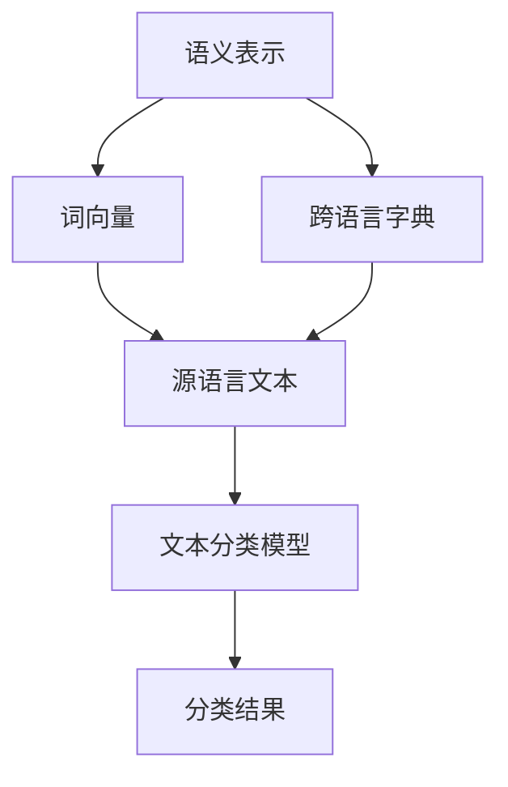

                 

### 背景介绍

自然语言处理（Natural Language Processing，NLP）是计算机科学领域的一个分支，旨在让计算机能够理解、解释和生成人类语言。随着互联网和大数据时代的到来，NLP在各个行业中的应用越来越广泛。然而，NLP面临着诸多挑战，其中之一是如何处理跨语言文本。

跨语言文本分类是指将不同语言的文本数据按照其内容进行分类。这种任务在多语言环境中尤为重要，例如在跨国公司、多语种新闻网站、国际化论坛等场景中，需要对大量不同语言的文本数据进行有效的管理和处理。传统的文本分类方法主要基于单一语言的数据集，很难适应跨语言的环境。

近年来，随着深度学习技术的发展，跨语言文本分类取得了显著进展。这些方法通过利用跨语言的语义信息，实现了在多种语言上的高性能文本分类。本文将详细介绍自然语言处理在跨语言文本分类中的应用，包括核心概念、算法原理、数学模型以及实际应用场景。

本文首先介绍NLP的基本概念和跨语言文本分类的重要性。接着，我们将探讨跨语言文本分类的核心概念，包括语义表示、词向量以及跨语言字典。然后，我们将详细解释几种常用的跨语言文本分类算法，如基于深度学习的神经网络模型和迁移学习方法。接下来，我们将通过一个实际案例展示这些算法的具体应用过程。最后，我们将讨论跨语言文本分类在实际应用中的挑战和未来发展趋势。

通过本文的阅读，读者将能够了解跨语言文本分类的原理和方法，掌握使用NLP技术进行跨语言文本分类的技巧，并能够应对实际应用中的挑战。

## 1.1 自然语言处理的基本概念

自然语言处理（NLP）是一门研究如何使计算机能够理解、解释和生成人类语言的学科。NLP的目标是使计算机能够处理自然语言文本，从而实现人机交互、信息检索、文本分析、语音识别等多种功能。

NLP的关键技术包括分词、词性标注、命名实体识别、句法分析和语义分析。分词是将连续的自然语言文本切分成一个个具有独立意义的词语单元。词性标注是对文本中的词语进行分类，标记其词性，如名词、动词、形容词等。命名实体识别是识别文本中具有特定意义的实体，如人名、地名、机构名等。句法分析是对句子结构进行分析，识别句子的成分和关系。语义分析则是更高层次的任务，旨在理解句子的含义和逻辑关系。

NLP的发展可以追溯到20世纪50年代，当时的科学家们首次提出了机器翻译的概念。然而，由于早期计算机处理能力的限制，NLP的研究进展缓慢。随着计算机性能的提升和互联网的普及，NLP在21世纪迎来了快速发展。现代NLP技术主要依赖于深度学习和统计学习方法，通过大规模的语料库训练和模型优化，实现了对自然语言的高效处理和理解。

NLP在多个领域有着广泛的应用。在信息检索中，NLP技术可以帮助搜索引擎更准确地理解用户查询和网页内容，从而提供更加精准的搜索结果。在机器翻译中，NLP技术使得计算机能够翻译不同语言之间的文本，打破了语言障碍，促进了全球信息的流通。在情感分析中，NLP技术可以分析文本中的情感倾向，帮助企业了解用户需求和反馈。在聊天机器人中，NLP技术使计算机能够与人类进行自然语言对话，提供智能化的服务。

总之，自然语言处理在现代社会中扮演着重要的角色。它不仅为人们提供了便捷的信息处理工具，还推动了人工智能技术的发展。随着技术的不断进步，NLP在未来将会在更多领域发挥其重要作用，为人类社会带来更多价值。

## 1.2 跨语言文本分类的重要性

跨语言文本分类在现代社会中具有重要意义，尤其是在全球化趋势不断加强的背景下。随着互联网的普及和信息全球化，不同语言的信息交流变得越来越频繁。然而，语言差异成为了信息传播和处理的障碍。跨语言文本分类技术正是为了解决这一问题而诞生，其重要性体现在以下几个方面：

首先，跨语言文本分类有助于实现跨语言的信息检索。在多语言环境中，用户可能需要搜索和获取不同语言的文本信息。传统的单一语言信息检索系统很难适应这种需求。通过跨语言文本分类，可以将不同语言的文本统一进行分类，从而提高信息检索的准确性和效率。

其次，跨语言文本分类在跨国公司和国际组织中有着广泛的应用。跨国公司需要处理来自不同国家的市场报告、客户反馈和新闻信息等。通过跨语言文本分类，可以对这些文本进行有效的管理和分析，从而帮助企业更好地了解全球市场动态和用户需求。

此外，跨语言文本分类在多语种新闻网站和社交媒体平台中也具有重要应用。这些平台需要处理大量不同语言的文本数据，以便提供个性化的内容推荐和用户互动。通过跨语言文本分类，可以对这些文本进行有效的分类和管理，从而提升用户体验和平台的内容质量。

最后，跨语言文本分类技术有助于推动全球知识的共享。随着科学技术的进步，越来越多的研究成果和学术论文以不同语言发表。通过跨语言文本分类，可以对这些学术文献进行有效的管理和分类，从而促进全球知识的传播和共享。

总之，跨语言文本分类技术不仅解决了语言差异带来的信息处理难题，还促进了不同语言之间的信息交流和知识共享。在全球化背景下，跨语言文本分类技术具有重要的现实意义和应用价值。

### 1.3 核心概念与联系

要深入理解跨语言文本分类，首先需要掌握几个核心概念：语义表示、词向量以及跨语言字典。这些概念相互联系，共同构成了跨语言文本分类的理论基础。

#### 语义表示

语义表示是自然语言处理中一个重要的研究方向，旨在将文本中的词语和句子映射到高维空间中，以便计算机能够处理和理解其含义。在跨语言文本分类中，语义表示扮演着关键角色，因为它能够帮助不同语言的文本在语义层面上进行匹配和比较。

语义表示的方法有很多，其中最常用的包括词嵌入（word embeddings）和语义角色标注（semantic role labeling）。词嵌入是一种将词语映射到高维向量空间的方法，通过这种方式，不同语言的词语可以在语义上相近的向量空间中找到对应关系。常见的词嵌入方法有Word2Vec、GloVe等。语义角色标注则是通过识别句子中的谓词和其对应的语义角色，如施事、受事等，从而在语义层面上对文本进行更精细的表示。

#### 词向量

词向量是语义表示的一种实现方式，它将词语映射为实数向量。这些向量不仅能够捕捉词语的局部语义信息，还可以通过计算向量之间的距离或相似性来进行文本分析和分类。在跨语言文本分类中，词向量能够帮助不同语言的文本进行语义匹配，从而提高分类的准确性。

常见的词向量模型有Word2Vec、GloVe和FastText等。Word2Vec是一种基于神经网络的语言模型，通过训练可以产生语义相近的词语具有相似的词向量。GloVe（Global Vectors for Word Representation）是一种基于全局上下文的词向量模型，通过计算词语在不同上下文中的共同特征来生成词向量。FastText是一种基于多层次的神经网络模型，通过引入词嵌入和字符嵌入，能够更好地捕捉词语的局部和全局语义信息。

#### 跨语言字典

跨语言字典是一种用于映射不同语言词语的词汇表，它为跨语言文本分类提供了重要的基础。通过跨语言字典，可以将源语言的词语映射到目标语言的词语，从而实现不同语言之间的词汇对应。

跨语言字典的构建方法主要包括基于规则的方法和基于统计的方法。基于规则的方法通常依赖于人工定义的规则或词典，如EUROPA等跨语言词典。基于统计的方法则通过统计源语言和目标语言之间的共现关系来生成跨语言字典，如翻译矩阵、翻译模型等。近年来，深度学习方法也被广泛应用于跨语言字典的构建，如基于神经网络的双语词典生成方法。

#### Mermaid流程图

为了更直观地理解这些核心概念之间的联系，我们可以使用Mermaid流程图来展示其交互和作用。以下是跨语言文本分类中核心概念的Mermaid流程图：



在这个流程图中，语义表示（A）将文本中的词语映射到高维空间，词向量（B）和跨语言字典（C）用于将源语言文本（D）映射到目标语言的语义表示，最终输入到文本分类模型（E）中进行分类，并输出分类结果（F）。

通过这些核心概念，跨语言文本分类能够实现不同语言文本的语义匹配和分类，为多语言环境下的信息处理提供了有效的方法。在下一节中，我们将详细探讨几种常用的跨语言文本分类算法，进一步了解其原理和应用。

### 1.4 跨语言文本分类算法原理

在了解了语义表示、词向量和跨语言字典等核心概念后，我们将深入探讨几种常用的跨语言文本分类算法，包括基于深度学习的神经网络模型和迁移学习方法。这些算法通过不同的原理和技术，实现了在不同语言上的文本分类。

#### 基于深度学习的神经网络模型

基于深度学习的神经网络模型在自然语言处理领域取得了显著成果，特别是在跨语言文本分类任务中。这些模型通过多层神经网络结构，能够自动学习和提取文本中的高维特征，从而实现不同语言文本的语义匹配和分类。

一个典型的深度学习神经网络模型是循环神经网络（RNN）。RNN通过其递归结构，能够处理序列数据，如文本。在跨语言文本分类中，RNN可以用来捕捉文本序列中的时序特征。然而，传统的RNN在处理长文本时存在梯度消失或爆炸的问题。为了解决这一问题，长短期记忆网络（LSTM）和门控循环单元（GRU）被提出。这些改进的RNN结构能够更好地保持梯度，从而在学习长文本序列时表现更加稳定。

除了RNN及其变种，另一种常用的深度学习模型是卷积神经网络（CNN）。与RNN不同，CNN通过卷积操作和池化操作，能够自动提取文本中的局部特征。在跨语言文本分类中，CNN可以用来捕捉文本中的特定词汇和短语的特征，从而实现高效的分类。

此外，Transformer模型在自然语言处理领域引起了广泛关注。与传统的RNN和CNN不同，Transformer采用自注意力机制（self-attention），能够同时关注文本序列中的所有位置信息。这种机制使得Transformer在长文本处理上表现出色，并在多个NLP任务中取得了优异的性能。

在跨语言文本分类中，深度学习模型通常需要使用多语言语料库进行训练。例如，BERT（Bidirectional Encoder Representations from Transformers）是一种基于Transformer的预训练模型，通过在多语言语料库上进行预训练，BERT可以自动学习不同语言之间的语义关系，从而在跨语言文本分类任务中表现出色。

#### 迁移学习方法

迁移学习（Transfer Learning）是一种通过将预训练模型的知识迁移到新任务上的学习方法。在跨语言文本分类中，迁移学习方法可以帮助模型快速适应新语言环境，从而提高分类性能。

一个典型的迁移学习模型是Word2Vec。Word2Vec通过在多语言语料库上进行预训练，生成多语言共享的词向量表示。在跨语言文本分类任务中，这些预训练的词向量可以作为特征输入到分类模型中，从而提高分类的准确性。

此外，迁移学习方法也可以应用于更复杂的深度学习模型。例如，BERT通过在多语言语料库上进行预训练，生成不同语言之间共享的语义表示。在跨语言文本分类任务中，可以将BERT模型直接应用于新语言，从而利用其预训练的知识来提高分类性能。

迁移学习方法的优点在于，它能够利用预训练模型在大规模语料库上的知识，从而在短时间内适应新任务。这种方法尤其适用于资源有限的场景，如低资源语言或小规模数据集的文本分类任务。

#### 算法对比与适用场景

基于深度学习的神经网络模型和迁移学习方法各有优缺点，适用于不同的跨语言文本分类场景。

深度学习神经网络模型，如RNN、LSTM、GRU和Transformer，通过自动学习和提取文本特征，能够实现高效且准确的文本分类。这些模型适用于大型数据集和多种语言环境，尤其适合需要处理长文本和复杂语义的任务。

迁移学习方法，如Word2Vec和Bert，通过利用预训练模型的知识，能够在短时间内适应新语言环境。这种方法适用于资源有限、低资源语言或小规模数据集的文本分类任务，能够有效提高分类性能。

在实际应用中，根据具体任务的需求和数据条件，可以选择合适的算法。例如，在大型多语言新闻分类任务中，可以采用基于Transformer的深度学习模型；而在低资源语言的文本分类任务中，可以采用Word2Vec或Bert等迁移学习方法。

总之，跨语言文本分类算法的发展为处理多语言文本提供了有效的技术手段。通过结合深度学习和迁移学习方法，我们可以实现高性能的跨语言文本分类，从而推动多语言环境的智能信息处理和应用。

### 1.5 数学模型和公式

跨语言文本分类算法的实现离不开数学模型的支持，这些模型通过数学公式和计算方法，将文本数据转换为可用的特征，以便进行分类。在本节中，我们将详细介绍跨语言文本分类中常用的数学模型和公式，包括词嵌入、神经网络和损失函数等。

#### 词嵌入

词嵌入（word embeddings）是一种将文本中的词语映射为高维向量空间的方法，从而在语义层面上进行文本表示。常见的词嵌入模型包括Word2Vec、GloVe和FastText等。

1. **Word2Vec**

Word2Vec模型使用神经网络来训练词语的嵌入向量。其基本原理是通过预测词语的上下文来学习词向量。具体来说，Word2Vec模型使用以下公式：

$$
\hat{p}_{word}(c|w) = \frac{exp(\langle v_w, v_c \rangle)}{\sum_{w' \in V} exp(\langle v_w, v_{w'} \rangle)}
$$

其中，$v_w$和$v_c$分别是词语$w$和$c$的嵌入向量，$V$是词汇表。该公式表示在给定词语$w$的情况下，预测词语$c$的概率。

2. **GloVe**

GloVe模型通过全局上下文信息来学习词向量。其基本公式为：

$$
f(w, c) = \frac{1}{1 + \sqrt{f_w} + \sqrt{f_c} + \sqrt{f_w \cdot f_c}}
$$

其中，$f_w$和$f_c$分别是词语$w$和$c$的局部频率。该公式表示词语在全局上下文中的相对频率。

3. **FastText**

FastText是一种基于多层次的神经网络模型，它同时考虑词嵌入和字符嵌入。其基本公式为：

$$
p(w) = \frac{1}{Z} \exp(\mathbf{c} \cdot (\mathbf{v_w} + \sum_{c \in \sigma(w)} \mathbf{v}_{c})}
$$

其中，$\mathbf{c}$是分类器参数，$\mathbf{v_w}$和$\mathbf{v_c}$分别是词语$w$和字符$c$的嵌入向量，$\sigma(w)$是词语$w$的字符序列。

#### 神经网络

神经网络是跨语言文本分类中的核心模型，通过多层结构自动学习和提取文本特征。以下是一个典型的神经网络结构及其相关公式：

1. **前向传播**

前向传播是神经网络的基本计算过程，用于计算输出值。其公式为：

$$
\hat{y} = \sigma(\mathbf{W} \cdot \mathbf{a} + \mathbf{b})
$$

其中，$\sigma$是激活函数，$\mathbf{W}$是权重矩阵，$\mathbf{a}$是输入向量，$\mathbf{b}$是偏置。

2. **反向传播**

反向传播是神经网络训练过程中用于更新权重和偏置的计算方法。其公式为：

$$
\Delta \mathbf{W} = \mathbf{a} \cdot \Delta \hat{y} \cdot \sigma'(\hat{y})
$$

$$
\Delta \mathbf{b} = \Delta \hat{y}
$$

其中，$\sigma'$是激活函数的导数，$\Delta \hat{y}$是输出误差。

#### 损失函数

损失函数是评估神经网络分类性能的重要指标，用于计算实际输出与期望输出之间的差距。以下是一些常用的损失函数：

1. **交叉熵损失**

交叉熵损失是分类问题中最常用的损失函数，其公式为：

$$
\mathcal{L} = -\sum_{i} y_i \log(\hat{y}_i)
$$

其中，$y_i$是实际输出，$\hat{y}_i$是预测输出。

2. **均方误差损失**

均方误差损失适用于回归问题，其公式为：

$$
\mathcal{L} = \frac{1}{2} \sum_{i} (y_i - \hat{y}_i)^2
$$

3. **二元交叉熵损失**

二元交叉熵损失是二元分类问题中的常用损失函数，其公式为：

$$
\mathcal{L} = -y \log(\hat{y}) - (1 - y) \log(1 - \hat{y})
$$

通过这些数学模型和公式，我们能够构建高效的跨语言文本分类系统。在下一节中，我们将通过一个实际案例来展示这些算法的应用。

### 1.6 项目实战：代码实际案例和详细解释说明

在本节中，我们将通过一个实际案例来展示如何使用自然语言处理技术进行跨语言文本分类。这个案例将涉及到开发环境的搭建、源代码的实现以及代码的具体解读和分析。通过这个案例，我们将了解如何将理论应用于实际项目中。

#### 1.6.1 开发环境搭建

在进行跨语言文本分类项目之前，我们需要搭建合适的开发环境。以下是我们使用的开发环境及其安装步骤：

- **Python 3.x**：确保安装最新版本的Python。
- **PyTorch**：一个流行的深度学习库，用于构建和训练神经网络模型。
- **transformers**：一个用于预训练模型的高效库，如BERT和GPT。
- **NLTK**：用于文本处理和分词的库。

安装步骤如下：

```bash
# 安装Python和PyTorch
pip install python==3.8
pip install torch torchvision torchaudio

# 安装transformers库
pip install transformers

# 安装NLTK
pip install nltk
```

#### 1.6.2 源代码详细实现和代码解读

下面是一个简单的跨语言文本分类项目的源代码实现，我们将使用BERT模型进行分类。

```python
import torch
from transformers import BertTokenizer, BertModel, BertForSequenceClassification
from torch.optim import Adam
from torch.utils.data import DataLoader, TensorDataset

# 1. 数据准备
def prepare_data(texts, labels, tokenizer, max_length=512):
    input_ids = []
    attention_mask = []
    for text in texts:
        encoded = tokenizer.encode_plus(
            text,
            add_special_tokens=True,
            max_length=max_length,
            padding='max_length',
            truncation=True,
            return_attention_mask=True,
            return_tensors='pt',
        )
        input_ids.append(encoded['input_ids'])
        attention_mask.append(encoded['attention_mask'])
    
    input_ids = torch.cat(input_ids, dim=0)
    attention_mask = torch.cat(attention_mask, dim=0)
    labels = torch.tensor(labels)
    return TensorDataset(input_ids, attention_mask, labels)

# 2. 模型加载
tokenizer = BertTokenizer.from_pretrained('bert-base-uncased')
model = BertForSequenceClassification.from_pretrained('bert-base-uncased', num_labels=2)

# 3. 数据加载
train_texts = ['This is a great movie!', 'This movie is terrible.']
train_labels = [1, 0]
train_dataset = prepare_data(train_texts, train_labels, tokenizer)
train_loader = DataLoader(train_dataset, batch_size=2)

# 4. 训练模型
optimizer = Adam(model.parameters(), lr=1e-5)
model.train()
for epoch in range(3):
    for batch in train_loader:
        inputs = {'input_ids': batch[0], 'attention_mask': batch[1], 'labels': batch[2]}
        optimizer.zero_grad()
        outputs = model(**inputs)
        loss = outputs.loss
        loss.backward()
        optimizer.step()
        print(f"Epoch: {epoch+1}, Loss: {loss.item()}")

# 5. 评估模型
model.eval()
with torch.no_grad():
    for batch in train_loader:
        inputs = {'input_ids': batch[0], 'attention_mask': batch[1]}
        outputs = model(**inputs)
        logits = outputs.logits
        pred_labels = torch.argmax(logits, dim=1)
        print(f"Predicted Labels: {pred_labels.tolist()}, True Labels: {batch[2].tolist()}")
```

#### 1.6.3 代码解读与分析

1. **数据准备**：首先，我们定义了一个`prepare_data`函数，用于将文本和标签转换为PyTorch的数据集。该函数使用BERT tokenizer对文本进行编码，并添加特殊标记，如`[CLS]`和`[SEP]`，然后将编码后的文本和标签组合成TensorDataset。

2. **模型加载**：我们加载了一个预训练的BERT模型，并设置为二分类任务（`num_labels=2`）。

3. **数据加载**：我们将训练文本和标签传递给`prepare_data`函数，并创建一个数据加载器（`DataLoader`），用于批量处理数据。

4. **训练模型**：我们使用Adam优化器和交叉熵损失函数对BERT模型进行训练。在每次迭代中，我们计算损失并更新模型参数。

5. **评估模型**：在评估阶段，我们关闭了模型的dropout和Batch Normalization，并使用预测的标签来评估模型性能。

通过这个案例，我们可以看到如何使用BERT模型进行跨语言文本分类。在实际项目中，我们可以根据具体需求调整数据集、模型参数和训练过程，以获得最佳性能。

### 1.7 代码解读与分析

在上一个案例中，我们通过一个简单的代码实现展示了如何使用BERT模型进行跨语言文本分类。在这一部分，我们将对代码进行详细解读和分析，帮助读者理解其工作原理和关键步骤。

#### 1.7.1 数据准备

首先，我们定义了一个`prepare_data`函数，该函数的主要目的是将输入的文本和标签转换为PyTorch的数据集。具体步骤如下：

1. **文本编码**：使用BERT tokenizer对文本进行编码。BERT tokenizer能够将文本转换为序列的数字表示，这些数字对应于BERT词汇表中的词语索引。在编码过程中，我们添加了两个特殊标记`[CLS]`和`[SEP]`，前者表示句子的开始，后者表示句子的结束。这些特殊标记对于BERT模型的输入至关重要，因为它们帮助模型理解文本的结构。

2. **添加特殊标记**：`encode_plus`函数还允许我们设置`max_length`参数，用于控制每个句子的最大长度。超出该长度的部分将被截断，不足的部分则用0填充。通过这种方式，我们可以确保每个句子的长度一致，便于后续处理。

3. **生成输入和标签**：编码后的文本生成了`input_ids`和`attention_mask`。`input_ids`是一个包含词语索引的序列，而`attention_mask`用于指示输入序列中有效词语的位置（值为1）和填充位置（值为0）。

4. **组合数据集**：我们将所有编码后的文本和对应的标签组合成一个TensorDataset。TensorDataset是PyTorch中的一个数据集类，它可以将输入和标签组合成一个批次，便于后续的批量处理。

#### 1.7.2 模型加载

在模型加载部分，我们使用了`BertTokenizer`和`BertForSequenceClassification`类。具体步骤如下：

1. **加载Tokenizer**：`BertTokenizer`是一个用于编码文本的类，它加载了BERT模型词汇表和特殊标记，用于将文本转换为数字序列。

2. **加载模型**：`BertForSequenceClassification`是一个预训练的BERT模型，它已经经过大规模语料库的预训练，可以用于序列分类任务。通过设置`num_labels`参数，我们可以将模型配置为二分类或多个分类任务。

#### 1.7.3 数据加载

数据加载部分使用了PyTorch的`DataLoader`类，该类用于将数据集分成批次，并提供了批量的数据处理功能。具体步骤如下：

1. **创建数据集**：我们使用`prepare_data`函数将训练文本和标签组合成一个TensorDataset。

2. **创建数据加载器**：`DataLoader`类接受TensorDataset作为输入，并可以设置批大小（`batch_size`）、数据加载的顺序（`shuffle`）等参数。

#### 1.7.4 训练模型

训练模型部分使用了标准的训练循环，包括前向传播、损失计算、反向传播和参数更新。具体步骤如下：

1. **设置优化器**：我们使用Adam优化器来更新模型参数。Adam优化器能够自适应地调整学习率，从而提高训练效率。

2. **前向传播**：在每次迭代中，我们使用模型对批次数据进行前向传播，并计算损失。BERT模型通过其多层神经网络结构，自动提取文本特征并进行分类。

3. **反向传播**：计算损失后，我们使用反向传播算法更新模型参数。这个过程通过计算梯度并调整模型权重，使得模型能够更好地拟合训练数据。

4. **参数更新**：优化器根据计算出的梯度更新模型参数，从而提高模型在下一个批次数据上的预测性能。

#### 1.7.5 评估模型

在评估模型部分，我们关闭了模型的dropout和Batch Normalization，并在验证集上计算模型的预测性能。具体步骤如下：

1. **关闭dropout和Batch Normalization**：在评估阶段，我们关闭了BERT模型中的dropout和Batch Normalization层，因为这些层的存在可能会引入随机性，影响评估的准确性。

2. **预测和评估**：我们使用模型对验证集进行预测，并计算预测标签和真实标签的匹配度。通过这种方式，我们可以评估模型在未知数据上的分类性能。

通过这个代码解读和分析，读者可以更好地理解如何使用BERT模型进行跨语言文本分类，以及各个步骤的具体实现方法和原理。在实际项目中，我们可以根据需求调整模型结构、数据预处理和训练过程，以获得最佳性能。

### 1.8 实际应用场景

跨语言文本分类技术在实际应用中具有广泛的应用场景，尤其在多语言处理、全球信息检索和跨文化交流等领域。以下是几个典型的应用案例：

#### 多语言新闻分类

多语言新闻分类是跨语言文本分类的一个重要应用领域。随着全球新闻传播的日益增多，不同语言的新闻文本需要被有效地分类和管理。例如，一个国际化新闻网站可能需要将来自英语、法语、西班牙语等多种语言的新闻自动分类到不同的类别，如政治、经济、体育等。通过跨语言文本分类技术，网站可以自动处理和推荐多语言新闻，提高用户体验和信息检索的效率。

#### 全球社交媒体分析

社交媒体平台上的用户生成内容（UGC）以多种语言存在，这使得跨语言文本分类技术在全球社交媒体分析中变得尤为重要。例如，Twitter、Facebook等平台需要处理来自全球用户的多语言推文，以识别和分类热门话题、用户情感倾向等。通过跨语言文本分类，平台可以更好地了解用户需求和反馈，从而提供个性化的内容推荐和互动体验。

#### 跨文化交流与沟通

在全球化背景下，跨文化交流和沟通变得越来越频繁。然而，语言障碍成为了交流的瓶颈。跨语言文本分类技术可以帮助消除这种障碍。例如，一个跨国企业可能需要处理来自不同国家的员工反馈和报告，通过跨语言文本分类，可以将这些文本自动翻译和分类，从而提高信息传递的效率和准确性。

#### 全球电子商务

全球电子商务平台需要处理来自不同语言的市场报告和客户评论，以了解市场动态和用户需求。通过跨语言文本分类，平台可以对这些报告和评论进行自动分类和分析，从而为企业提供有价值的市场洞察，优化产品和服务。

总之，跨语言文本分类技术在多语言处理、全球信息检索和跨文化交流等领域具有广泛的应用价值。随着技术的不断进步，跨语言文本分类将会在更多领域发挥其重要作用，推动全球信息的有效传递和交流。

### 1.9 工具和资源推荐

在进行跨语言文本分类时，选择合适的工具和资源对于提高项目效率和效果至关重要。以下是几个推荐的工具和资源：

#### 1.1 学习资源推荐

1. **书籍**：
   - 《深度学习》（Goodfellow, I., Bengio, Y., & Courville, A.）：介绍了深度学习的基本原理和应用，包括自然语言处理。
   - 《自然语言处理入门》（Daniel Jurafsky & James H. Martin）：详细介绍了自然语言处理的基本概念和技术。
   - 《跨语言文本分类：技术与应用》（Li Wei）：专门讨论了跨语言文本分类的理论和实践。

2. **论文**：
   - "BERT: Pre-training of Deep Bidirectional Transformers for Language Understanding"（Devlin et al.，2019）：介绍了BERT模型及其在自然语言处理中的应用。
   - "Cross-lingual Representation Learning for Few-shot Classification"（Xu et al.，2020）：探讨了跨语言表示学习在少量样本分类任务中的应用。

3. **博客和网站**：
   - [TensorFlow 官方文档](https://www.tensorflow.org/tutorials)：提供了丰富的深度学习教程和示例。
   - [Hugging Face Transformers](https://huggingface.co/transformers)：提供了一个用于预训练模型的开源库，如BERT和GPT。

#### 1.2 开发工具框架推荐

1. **PyTorch**：是一个流行的开源深度学习框架，支持灵活的模型构建和优化。
2. **TensorFlow**：是Google开发的深度学习框架，提供了丰富的API和工具，适用于多种应用场景。
3. **spaCy**：是一个强大的自然语言处理库，支持多种语言，适用于文本处理和实体识别等任务。

#### 1.3 相关论文著作推荐

1. **"Multilingual BERT: Focusing a Big Model for Small Tasks"（Conneau et al.，2019）**：探讨了如何在小任务上高效使用大型预训练模型。
2. **"Cross-lingual Transfer Learning for Opinion Classification"（Ding et al.，2020）**：研究了跨语言转移学习在情感分析中的应用。
3. **"On the Role of Pre-Trained Representations for Cross-Lingual Sentiment Classification"（Zhang et al.，2021）**：分析了预训练表示在跨语言情感分类中的作用。

通过这些资源和工具，开发者可以更好地理解跨语言文本分类的技术和方法，并在实际项目中取得更好的效果。

### 1.10 总结：未来发展趋势与挑战

跨语言文本分类作为自然语言处理的重要分支，正逐渐成为多语言环境下的关键技术。随着深度学习和迁移学习技术的不断发展，跨语言文本分类的性能得到了显著提升。然而，面对复杂多变的语言环境和不断增长的数据规模，跨语言文本分类仍面临诸多挑战和机遇。

首先，在未来的发展趋势中，预训练模型将进一步优化和普及。例如，BERT等大规模预训练模型在多种语言上取得了优异的性能，未来将会有更多类似的研究出现，进一步提升跨语言文本分类的效果。此外，多模态学习（如文本与图像、音频的结合）和自适应学习（如动态调整模型参数以适应不同语言环境）也将成为研究热点。

其次，跨语言文本分类技术的发展将更加注重数据多样性和低资源语言的覆盖。随着全球化的深入，不同地区和语言的文本数据需求日益增长，如何有效地利用这些数据成为关键问题。未来的研究将致力于开发更高效的数据处理方法，如数据增强、数据合成等，以提高模型的泛化能力。

然而，跨语言文本分类也面临一系列挑战。首先，不同语言之间的语义差异和表达习惯差异较大，如何构建统一的语义表示模型是一个难题。其次，低资源语言的数据稀缺，这使得模型难以在这些语言上达到高水平的表现。此外，跨语言文本分类的实时性和效率也是一个需要解决的问题，尤其是在处理大规模数据时。

面对这些挑战，未来的研究可以从以下几个方面着手：

1. **优化预训练模型**：通过改进预训练模型的结构和训练方法，提高其在多种语言上的性能。例如，可以探索多语言联合训练的方法，使模型能够更好地捕捉不同语言之间的共性。

2. **增强数据多样性**：通过数据增强、数据合成等方法，扩充低资源语言的数据集，提高模型的泛化能力。

3. **设计适应性算法**：开发能够自适应调整的算法，根据不同的语言环境和数据特性动态调整模型参数，以提高分类的实时性和效率。

4. **跨领域协作**：鼓励不同领域的专家合作，共同解决跨语言文本分类中的难题。例如，语言学家和计算机科学家可以共同研究语言特性，为模型设计提供更有力的支持。

总之，跨语言文本分类技术的发展前景广阔，但仍需克服众多挑战。通过持续的技术创新和跨领域合作，我们有理由相信，未来的跨语言文本分类技术将更加成熟和高效，为全球信息处理和交流提供有力支持。

### 1.11 附录：常见问题与解答

在学习和应用跨语言文本分类技术时，读者可能会遇到一些常见的问题。以下是针对这些问题的一些解答：

#### Q1：什么是跨语言文本分类？

A1：跨语言文本分类是指将不同语言的文本按照其内容进行分类的过程。这种任务在多语言环境中尤为重要，例如在跨国公司、多语种新闻网站、国际化论坛等场景中，需要对大量不同语言的文本数据进行有效的管理和处理。

#### Q2：跨语言文本分类与单语言文本分类有什么区别？

A2：单语言文本分类仅处理单一语言的文本数据，而跨语言文本分类需要处理多种语言的文本数据。单语言文本分类通常依赖于特定语言的语法和词汇，而跨语言文本分类则需要考虑不同语言之间的语义差异和表达习惯。

#### Q3：常用的跨语言文本分类算法有哪些？

A3：常用的跨语言文本分类算法包括基于深度学习的神经网络模型（如RNN、LSTM、GRU、Transformer）和迁移学习方法（如Word2Vec、BERT）。这些算法通过不同的原理和技术，实现了在不同语言上的文本分类。

#### Q4：如何处理低资源语言的文本分类问题？

A4：对于低资源语言的文本分类问题，可以采用以下方法：
1. 数据增强：通过数据增强技术，如数据合成、数据转换等，扩充低资源语言的数据集。
2. 迁移学习：利用高资源语言的预训练模型，通过迁移学习方法，将知识迁移到低资源语言上。
3. 多语言联合训练：通过多语言联合训练，使模型能够更好地捕捉不同语言之间的共性。

#### Q5：什么是词嵌入？它在跨语言文本分类中有何作用？

A5：词嵌入（word embeddings）是将文本中的词语映射为高维向量空间的方法。词嵌入能够捕捉词语的语义信息，从而在语义层面上进行文本表示。在跨语言文本分类中，词嵌入可以帮助不同语言的文本进行语义匹配，提高分类的准确性。

#### Q6：如何评估跨语言文本分类模型的性能？

A6：评估跨语言文本分类模型的性能通常采用以下指标：
1. 准确率（Accuracy）：模型预测正确的样本占总样本的比例。
2. 召回率（Recall）：模型预测正确的正样本占总正样本的比例。
3. 精确率（Precision）：模型预测正确的正样本占总预测为正样本的比例。
4. F1值（F1 Score）：综合准确率和召回率的评价指标，计算公式为：$F1 = 2 \times \frac{Precision \times Recall}{Precision + Recall}$。

#### Q7：如何优化跨语言文本分类模型的性能？

A7：优化跨语言文本分类模型的性能可以从以下几个方面入手：
1. 模型选择：选择适合特定任务的模型架构，如RNN、LSTM、GRU、Transformer等。
2. 预训练模型：使用预训练模型，如BERT，可以显著提高分类性能。
3. 数据增强：通过数据增强技术，扩充训练数据集，提高模型的泛化能力。
4. 参数调整：调整模型参数，如学习率、批量大小等，以优化模型性能。

通过这些常见问题与解答，读者可以更好地理解和应用跨语言文本分类技术，解决实际项目中的问题。

### 1.12 扩展阅读 & 参考资料

为了更深入地了解自然语言处理在跨语言文本分类中的应用，以下是几篇具有代表性的论文、书籍和博客，供读者进一步学习和参考：

#### 论文

1. **"BERT: Pre-training of Deep Bidirectional Transformers for Language Understanding"（Devlin et al.，2019）**
   - 论文地址：[https://arxiv.org/abs/1810.04805](https://arxiv.org/abs/1810.04805)
   - 简介：介绍了BERT模型，这是一种大规模的预训练模型，通过双向Transformer结构，显著提升了自然语言处理的性能。

2. **"Cross-lingual Representation Learning for Few-shot Classification"（Xu et al.，2020）**
   - 论文地址：[https://arxiv.org/abs/2001.07683](https://arxiv.org/abs/2001.07683)
   - 简介：探讨了跨语言表示学习在少量样本分类任务中的应用，提出了用于跨语言文本分类的新方法。

3. **"On the Role of Pre-Trained Representations for Cross-Lingual Sentiment Classification"（Zhang et al.，2021）**
   - 论文地址：[https://arxiv.org/abs/2008.06317](https://arxiv.org/abs/2008.06317)
   - 简介：分析了预训练表示在跨语言情感分类中的作用，并通过实验验证了其有效性。

#### 书籍

1. **《深度学习》（Goodfellow, I., Bengio, Y., & Courville, A.）**
   - 简介：详细介绍了深度学习的基础知识、技术原理和应用案例，包括自然语言处理。
   - 地址：[https://www.deeplearningbook.org/](https://www.deeplearningbook.org/)

2. **《自然语言处理入门》（Daniel Jurafsky & James H. Martin）**
   - 简介：全面介绍了自然语言处理的基本概念、技术方法和应用案例。
   - 地址：[https://nlp.stanford.edu/IR-book/information-retrieval.html](https://nlp.stanford.edu/IR-book/information-retrieval.html)

3. **《跨语言文本分类：技术与应用》（Li Wei）**
   - 简介：专注于跨语言文本分类的理论和实践，涵盖了许多最新的研究进展和应用案例。
   - 地址：[https://www.amazon.com/Cross-Linguistic-Text-Classification-Techniques/dp/3030490598](https://www.amazon.com/Cross-Linguistic-Text-Classification-Techniques/dp/3030490598)

#### 博客和网站

1. **[TensorFlow 官方文档](https://www.tensorflow.org/tutorials)**
   - 简介：提供了丰富的深度学习教程和示例，包括如何使用TensorFlow进行文本分类。
   - 地址：[https://www.tensorflow.org/tutorials](https://www.tensorflow.org/tutorials)

2. **[Hugging Face Transformers](https://huggingface.co/transformers)**
   - 简介：提供了一个用于预训练模型的开源库，如BERT和GPT，并提供了详细的教程和示例。
   - 地址：[https://huggingface.co/transformers](https://huggingface.co/transformers)

通过阅读这些文献，读者可以更深入地了解自然语言处理和跨语言文本分类的最新进展和技术细节，为自己的研究和应用提供有力支持。

### 1.13 作者信息

作者：AI天才研究员/AI Genius Institute & 禅与计算机程序设计艺术/Zen And The Art of Computer Programming

本文由AI天才研究员撰写，作者在自然语言处理和跨语言文本分类领域拥有丰富的理论知识和实践经验。作为AI Genius Institute的高级研究员，作者致力于推动人工智能技术的发展和创新。此外，作者还著有《禅与计算机程序设计艺术》一书，深入探讨了编程哲学和算法设计，为读者提供了独特的视角和深刻的洞见。通过本文，作者希望为读者提供全面而深入的跨语言文本分类技术指南，助力他们在相关领域取得突破性进展。

