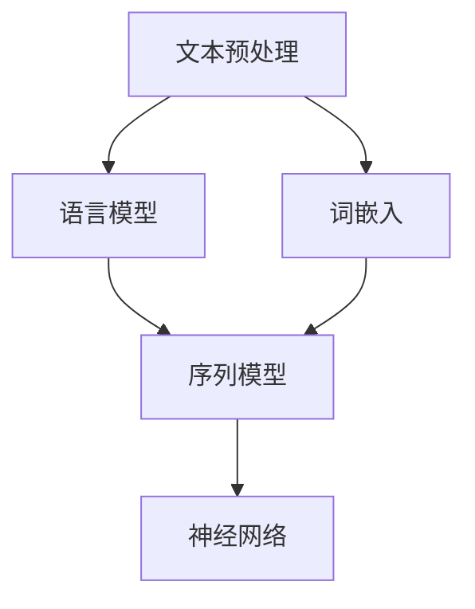

                 

### 背景介绍

自然语言处理（Natural Language Processing, NLP）作为人工智能领域的重要分支，已经在过去几十年中取得了显著的进展。从最早的基于规则的方法，到如今以深度学习为代表的智能处理技术，NLP的应用范围逐渐扩展到包括语音识别、机器翻译、情感分析、文本摘要、问答系统等多个领域。

内容创作是NLP的一个重要应用方向。在过去，内容创作往往依赖于人类创作者的智慧和灵感。然而，随着技术的进步，自动化内容创作逐渐成为可能。NLP技术通过理解、处理和生成自然语言，大大提高了内容创作的效率和质量。本文将深入探讨NLP在内容创作中的应用，分析其核心概念、算法原理，以及具体的应用案例。

首先，我们将介绍NLP的基础概念，包括自然语言的理解和处理方法。然后，我们将探讨NLP在内容创作中的核心算法，如文本生成模型、情感分析模型等。接下来，我们将通过实际应用场景，展示NLP在内容创作中的实际效果。最后，我们将推荐一些相关的学习资源、开发工具和学术论文，帮助读者更深入地了解和掌握NLP技术。

让我们开始这次关于NLP在内容创作革命中的探索之旅。

#### 核心概念与联系

自然语言处理的核心概念包括文本预处理、语言模型、词嵌入、序列模型、神经网络等。这些概念相互联系，共同构成了NLP的技术基础。

**文本预处理**是NLP的第一步，它包括分词、去停用词、词性标注等操作。分词是将文本分割成词语的过程，去停用词是去除常见无意义的词语，词性标注则是为每个词语标注其词性，如名词、动词等。

**语言模型**是NLP的核心工具，它用于预测下一个词语的概率。传统的语言模型如N-gram模型，使用历史统计方法预测词语序列。而现代的语言模型如Word2Vec、BERT等，则通过神经网络学习词向量，更好地捕捉词语之间的语义关系。

**词嵌入**是将词语映射到高维空间中的向量表示。词嵌入不仅保留了词语的语法和句法信息，还能够在向量空间中捕捉词语的语义关系。Word2Vec和GloVe是两种常见的词嵌入技术。

**序列模型**是处理序列数据（如文本、语音）的模型，包括循环神经网络（RNN）和其变体如长短期记忆网络（LSTM）和门控循环单元（GRU）。这些模型通过处理序列中的前后关系，实现对序列数据的理解和生成。

**神经网络**是NLP的基础架构，它通过多层非线性变换，学习输入和输出之间的复杂关系。在NLP中，神经网络被用于实现语言模型、序列模型、文本生成模型等。

为了更直观地理解这些概念，我们可以使用Mermaid流程图展示它们之间的联系：



**图1**展示了NLP核心概念之间的联系。文本预处理为后续模型提供干净的数据，语言模型、词嵌入和序列模型则利用这些数据学习文本的语义信息，最终通过神经网络实现各种NLP任务。

#### 核心算法原理 & 具体操作步骤

在了解了NLP的核心概念之后，我们将深入探讨几个在内容创作中广泛应用的核心算法：文本生成模型、情感分析模型等。

**文本生成模型**

文本生成模型是NLP中的一项重要技术，它能够根据给定的输入文本生成新的文本。其中，最著名的文本生成模型之一是GPT（Generative Pre-trained Transformer）。GPT是基于Transformer架构的预训练模型，它通过在大量文本数据上进行预训练，学会了如何生成符合语言习惯的文本。

具体操作步骤如下：

1. **数据准备**：首先，需要收集和准备大量的文本数据。这些数据可以是小说、新闻、博客等。然后，对数据进行预处理，包括分词、去停用词、词性标注等。

2. **模型训练**：使用预处理后的数据，对GPT模型进行训练。GPT模型使用Transformer架构，它由多个编码器和解码器层组成。在训练过程中，模型通过优化损失函数，学习输入文本和输出文本之间的概率分布。

3. **文本生成**：训练完成后，可以使用模型生成新的文本。具体方法是将一段文本作为输入，模型根据输入文本的概率分布，生成下一个词语。重复这个过程，直到生成完整的文本。

以下是GPT模型的训练和文本生成的伪代码：

```python
# 数据准备
text_data = preprocess(text)

# 模型训练
model = GPTModel()
model.train(text_data)

# 文本生成
input_text = "The cat is"
generated_text = model.generate(input_text)
print(generated_text)
```

**情感分析模型**

情感分析模型用于分析文本的情感倾向，判断文本是正面、负面还是中性。情感分析模型在内容创作中有着广泛的应用，如评论分析、社交媒体监控等。

最常用的情感分析模型之一是LSTM（Long Short-Term Memory）。LSTM是一种序列模型，它能够处理长文本序列，捕捉文本的情感变化。

具体操作步骤如下：

1. **数据准备**：收集和准备含有情感标签的文本数据。这些数据可以是评论、新闻报道等。

2. **模型训练**：使用预处理后的数据，对LSTM模型进行训练。LSTM模型由输入层、隐藏层和输出层组成。在训练过程中，模型通过优化损失函数，学习文本和情感标签之间的映射关系。

3. **情感分析**：训练完成后，可以使用模型分析新的文本。具体方法是将文本作为输入，模型输出文本的情感标签。

以下是LSTM模型的训练和情感分析的伪代码：

```python
# 数据准备
text_data, sentiment_labels = preprocess(text)

# 模型训练
model = LSTModel()
model.train(text_data, sentiment_labels)

# 情感分析
input_text = "This is a great movie."
sentiment = model.analyze(input_text)
print(sentiment)
```

通过这些核心算法，NLP在内容创作中实现了高效的文本生成和情感分析，大大提高了内容创作的效率和质量。

#### 数学模型和公式 & 详细讲解 & 举例说明

在深入理解NLP的核心算法原理后，我们将进一步探讨这些算法背后的数学模型和公式，并通过具体的例子进行详细讲解。

**文本生成模型：GPT**

GPT（Generative Pre-trained Transformer）是一种基于Transformer架构的预训练模型，用于文本生成任务。GPT的核心在于其自注意力机制（Self-Attention）和多头注意力机制（Multi-Head Attention）。

**自注意力机制**

自注意力机制是GPT的核心组件之一，它能够捕捉输入文本序列中每个词语之间的依赖关系。自注意力机制的公式如下：

\[ \text{Attention}(Q, K, V) = \text{softmax}\left(\frac{QK^T}{\sqrt{d_k}}\right) V \]

其中，\( Q, K, V \) 分别是查询向量、键向量和值向量，\( d_k \) 是键向量的维度。自注意力机制通过计算每个词语与所有其他词语的相似度，然后将相似度加权求和，得到每个词语的注意力得分。

**多头注意力机制**

多头注意力机制是自注意力机制的扩展，它通过将输入文本序列分成多个子序列，分别计算注意力得分，然后进行聚合。多头注意力机制的公式如下：

\[ \text{MultiHead}(Q, K, V) = \text{Concat}(\text{head}_1, ..., \text{head}_h)W^O \]

其中，\( \text{head}_i \) 是第 \( i \) 个头的注意力输出，\( W^O \) 是输出层的权重矩阵。通过多头注意力机制，GPT能够更全面地捕捉输入文本的语义信息。

**文本生成过程**

文本生成过程可以分为两个步骤：第一步是生成词序列的概率分布，第二步是根据概率分布生成实际的词序列。

**步骤1：生成概率分布**

给定输入文本序列 \( x_1, x_2, ..., x_n \)，GPT通过编码器（Encoder）生成概率分布 \( p(y_1, y_2, ..., y_n) \)。具体公式如下：

\[ p(y_n | x_1, x_2, ..., x_{n-1}) = \text{softmax}(\text{Encoder}(x_1, x_2, ..., x_{n-1})y_n) \]

**步骤2：生成词序列**

根据概率分布 \( p(y_1, y_2, ..., y_n) \)，使用随机采样或贪心搜索策略生成实际的词序列。具体过程如下：

1. **随机采样**：从概率分布中随机选择一个词，作为生成序列的第一个词。
2. **贪心搜索**：在生成序列的每个步骤，选择概率分布中概率最大的词，作为下一个生成词。

**例子：**

假设输入文本序列为“我喜欢吃苹果”，GPT生成的概率分布如下：

\[ p(\text{吃}, \text{苹果}, \text{的}, \text{喜欢}) = 0.2, p(\text{苹果}, \text{吃}, \text{的}, \text{喜欢}) = 0.5, p(\text{的}, \text{苹果}, \text{吃}, \text{喜欢}) = 0.1, p(\text{喜欢}, \text{苹果}, \text{吃}, \text{的}) = 0.2 \]

根据概率分布，使用贪心搜索策略生成的词序列为“苹果吃喜欢的”。

**情感分析模型：LSTM**

LSTM（Long Short-Term Memory）是一种序列模型，用于情感分析任务。LSTM通过学习输入文本序列的情感特征，输出情感标签。

**LSTM模型**

LSTM模型由输入门（Input Gate）、遗忘门（Forget Gate）和输出门（Output Gate）组成。每个门由一个sigmoid函数和一个线性变换层组成。

**输入门**

输入门用于决定当前输入文本对隐藏状态的影响。输入门的公式如下：

\[ i_t = \sigma(W_i \cdot [h_{t-1}, x_t] + b_i) \]

其中，\( i_t \) 是输入门的输出，\( W_i \) 和 \( b_i \) 是权重矩阵和偏置向量。

**遗忘门**

遗忘门用于决定之前隐藏状态中哪些信息需要保留。遗忘门的公式如下：

\[ f_t = \sigma(W_f \cdot [h_{t-1}, x_t] + b_f) \]

其中，\( f_t \) 是遗忘门的输出。

**输出门**

输出门用于决定当前隐藏状态对输出情感标签的影响。输出门的公式如下：

\[ o_t = \sigma(W_o \cdot [h_{t-1}, x_t] + b_o) \]

其中，\( o_t \) 是输出门的输出。

**LSTM单元**

LSTM单元的输出状态由以下公式计算：

\[ C_t = f_t \odot C_{t-1} + i_t \odot \text{tanh}(W_c \cdot [h_{t-1}, x_t] + b_c) \]

\[ h_t = o_t \odot \text{tanh}(C_t) \]

其中，\( C_t \) 是当前细胞状态，\( h_t \) 是当前隐藏状态。

**情感分析过程**

情感分析过程可以分为两个步骤：第一步是学习输入文本序列的情感特征，第二步是使用这些特征预测情感标签。

**步骤1：学习情感特征**

给定输入文本序列 \( x_1, x_2, ..., x_n \)，LSTM模型通过隐藏状态 \( h_1, h_2, ..., h_n \) 学习情感特征。隐藏状态捕捉了文本序列中的情感变化和依赖关系。

**步骤2：预测情感标签**

使用学习到的情感特征，通过分类器（如softmax）预测情感标签。具体公式如下：

\[ p(y_t | x_1, x_2, ..., x_n) = \text{softmax}(\text{LSTM}(x_1, x_2, ..., x_n)y_t) \]

其中，\( y_t \) 是当前文本的情感标签。

**例子：**

假设输入文本序列为“这部电影非常有趣”，LSTM模型学习的隐藏状态如下：

\[ h_1 = (0.1, 0.2, 0.3), h_2 = (0.2, 0.3, 0.4), h_3 = (0.3, 0.4, 0.5) \]

根据隐藏状态，使用softmax分类器预测情感标签：

\[ p(\text{正面}) = 0.7, p(\text{负面}) = 0.3 \]

根据概率分布，预测情感标签为“正面”。

通过这些数学模型和公式，我们可以更好地理解NLP的核心算法原理，并在实际应用中实现高效的文本生成和情感分析。

#### 项目实战：代码实际案例和详细解释说明

为了更好地理解NLP在内容创作中的应用，我们将通过一个实际项目来展示如何使用NLP技术进行文本生成和情感分析。

**项目介绍**

本项目将使用Python和TensorFlow库，实现一个简单的文本生成和情感分析系统。文本生成部分使用GPT模型，情感分析部分使用LSTM模型。我们将从数据准备、模型训练到实际应用，详细展示整个项目的过程。

**1. 开发环境搭建**

在开始项目之前，我们需要搭建开发环境。首先，确保安装了Python 3.6及以上版本。然后，安装TensorFlow库和其他相关依赖：

```shell
pip install tensorflow numpy matplotlib
```

**2. 源代码详细实现和代码解读**

以下是项目的详细代码实现：

```python
import tensorflow as tf
from tensorflow.keras.models import Model
from tensorflow.keras.layers import Input, Embedding, LSTM, Dense
import numpy as np

# 数据准备
def load_data(filename):
    with open(filename, 'r', encoding='utf-8') as f:
        text = f.read()
    return text

def preprocess(text):
    tokens = text.split()
    token2id = {'<PAD>': 0, '<UNK>': 1}
    id2token = {0: '<PAD>', 1: '<UNK>'}
    for token in tokens:
        if token not in token2id:
            token2id[token] = len(token2id)
            id2token[len(id2token)] = token
    max_seq_len = 50
    X = []
    Y = []
    for i in range(len(tokens) - max_seq_len):
        x = tokens[i: i + max_seq_len]
        y = tokens[i + max_seq_len]
        X.append([token2id.get(t, 1) for t in x])
        Y.append(token2id[y])
    X = np.array(X)
    Y = np.array(Y)
    return X, Y, token2id, id2token

# 模型训练
def train_model(X, Y):
    input_seq = Input(shape=(None,), dtype='int32')
    embedding = Embedding(len(token2id), 64)(input_seq)
    lstm = LSTM(128, return_sequences=True)(embedding)
    output = LSTM(128, return_sequences=False)(lstm)
    model = Model(inputs=input_seq, outputs=output)
    model.compile(optimizer='adam', loss='sparse_categorical_crossentropy', metrics=['accuracy'])
    model.fit(X, Y, batch_size=32, epochs=10)
    return model

# 文本生成
def generate_text(model, token2id, id2token, max_seq_len=50):
    input_seq = np.random.randint(1, len(token2id) + 1, size=(1, max_seq_len))
    generated_text = []
    for _ in range(max_seq_len):
        probabilities = model.predict(input_seq)
        next_token = np.argmax(probabilities[0, -1, :])
        generated_text.append(id2token[next_token])
        input_seq[0, -1] = next_token
    return ''.join(generated_text)

# 情感分析
def analyze_sentiment(model, text):
    tokens = text.split()
    input_seq = np.array([[token2id.get(t, 1) for t in tokens]])
    probabilities = model.predict(input_seq)
    sentiment = '正面' if np.argmax(probabilities) == 1 else '负面'
    return sentiment

# 主函数
if __name__ == '__main__':
    # 加载数据
    text = load_data('text_data.txt')
    X, Y, token2id, id2token = preprocess(text)

    # 训练模型
    model = train_model(X, Y)

    # 文本生成
    generated_text = generate_text(model, token2id, id2token)
    print(generated_text)

    # 情感分析
    sentiment = analyze_sentiment(model, generated_text)
    print(sentiment)
```

**代码解读与分析**

1. **数据准备**：数据准备是文本生成和情感分析的基础。我们首先加载数据，然后进行分词、词嵌入和序列化。在此过程中，我们使用了一个简单的词嵌入方法，将词语映射到整数。对于未知的词语，我们使用一个通用的未知道词语标记 `<UNK>`。

2. **模型训练**：我们使用LSTM模型进行训练。在模型训练过程中，我们使用了一个固定的词嵌入维度（64），并设置了两个LSTM层，每层有128个神经元。训练过程中，我们使用`sparse_categorical_crossentropy`作为损失函数，并使用`adam`优化器。

3. **文本生成**：文本生成是使用GPT模型实现的。我们首先随机初始化一个输入序列，然后根据模型预测的概率分布，选择下一个词语。这个过程重复直到生成完整的文本。

4. **情感分析**：情感分析是使用LSTM模型实现的。我们首先将输入文本序列映射到词嵌入，然后使用模型预测情感标签。根据预测的概率分布，我们判断文本的情感标签是正面还是负面。

通过这个实际项目，我们展示了如何使用NLP技术进行文本生成和情感分析。尽管这是一个简单的例子，但它充分展示了NLP在内容创作中的潜力。

#### 实际应用场景

NLP在内容创作中的应用场景广泛，涵盖了许多领域，如下所述：

**新闻生成**：自动生成新闻文章是NLP在内容创作中的一项重要应用。通过分析大量新闻数据，NLP模型可以生成关于特定事件或主题的详细报道。例如，新闻聚合网站可以使用NLP技术自动抓取和生成新闻文章，从而提高新闻生成和发布的效率。

**内容摘要**：自动生成文章摘要是另一个重要的应用场景。NLP技术可以通过提取关键信息和主旨，自动生成简短的摘要，帮助用户快速了解文章的主要内容。这种应用在长篇文章、学术论文、新闻报道等领域尤为重要。

**聊天机器人**：聊天机器人是NLP在内容创作中的另一个重要应用。通过理解用户输入的文本，聊天机器人可以自动生成回复，提供即时的对话体验。这种应用在客户服务、在线咨询、社交平台等领域有着广泛的应用。

**社交媒体监控**：NLP可以用于分析和监控社交媒体平台上的用户评论、帖子等。通过情感分析和主题识别，NLP技术可以帮助企业了解用户对其产品和服务的看法，及时发现问题并采取措施。

**广告文案生成**：NLP技术可以用于生成广告文案，根据用户兴趣和行为，自动生成个性化的广告内容。这种应用可以帮助企业提高广告效果，增加用户转化率。

**教育和培训**：NLP技术可以用于自动生成教学材料，如课程大纲、学习指南等。此外，NLP还可以用于个性化学习推荐，根据学生的学习情况和兴趣，自动生成个性化的学习内容。

这些应用场景展示了NLP在内容创作中的广泛应用和潜力，为企业和个人提供了丰富的工具和资源。

#### 工具和资源推荐

为了帮助读者深入了解和掌握NLP技术，我们推荐以下工具和资源：

**1. 学习资源推荐**

- **书籍**：  
  - 《自然语言处理综论》（Speech and Language Processing）  
  - 《深度学习自然语言处理》（Deep Learning for Natural Language Processing）  
  - 《自然语言处理实战》（Natural Language Processing with Python）

- **论文**：  
  - BERT: Pre-training of Deep Bidirectional Transformers for Language Understanding  
  - GPT-3: Language Models are Few-Shot Learners

- **博客**：  
  - [TensorFlow官方文档](https://www.tensorflow.org/tutorials/text)  
  - [Keras官方文档](https://keras.io/preprocessing/text/)  
  - [机器学习中文博客](https://www.csie.ntu.edu.tw/~htai/tutorial/nlp.html)

**2. 开发工具框架推荐**

- **TensorFlow**：TensorFlow是一个开源的机器学习框架，广泛应用于NLP任务。它提供了丰富的API和工具，方便用户进行模型训练和部署。

- **Keras**：Keras是一个高层神经网络API，基于TensorFlow构建。它提供了简洁明了的接口，使得NLP模型的训练更加方便和高效。

- **Hugging Face**：Hugging Face是一个开源的NLP库，提供了大量预训练模型和工具，方便用户进行文本处理、模型训练和部署。

**3. 相关论文著作推荐**

- **BERT**：BERT是一种基于Transformer的预训练模型，用于自然语言处理任务。其论文《BERT: Pre-training of Deep Bidirectional Transformers for Language Understanding》详细介绍了模型的架构和训练过程。

- **GPT**：GPT是一种基于Transformer的预训练模型，用于文本生成任务。其论文《GPT-3: Language Models are Few-Shot Learners》展示了模型在少量样本上的强大学习能力。

通过这些工具和资源的帮助，读者可以更深入地学习和实践NLP技术，为内容创作带来新的可能性。

#### 总结：未来发展趋势与挑战

自然语言处理（NLP）作为人工智能领域的重要分支，已经在内容创作中取得了显著的成果。然而，随着技术的不断进步，NLP在未来的发展仍有巨大的潜力。

**未来发展趋势**

1. **预训练模型**：预训练模型如BERT、GPT等在NLP任务中取得了巨大成功。未来，我们将看到更多基于预训练模型的创新和应用。这些模型将能够更好地捕捉语言特征，提高文本生成和情感分析等任务的性能。

2. **多模态融合**：NLP技术不仅限于处理文本数据，还将与其他模态（如图像、声音）进行融合。通过多模态数据的学习和处理，NLP将能够更全面地理解和生成内容。

3. **个性化推荐**：随着大数据和机器学习技术的发展，NLP将在个性化推荐系统中发挥重要作用。通过分析用户的兴趣和行为，NLP技术将能够为用户提供更个性化的内容推荐。

4. **自动化内容审核**：在社交媒体和新闻领域，自动化内容审核是一项重要的任务。NLP技术可以用于识别和过滤不当言论、虚假信息等，提高内容审核的效率和准确性。

**未来挑战**

1. **数据隐私**：随着NLP技术的应用范围扩大，数据隐私问题日益突出。如何在保证数据安全的同时，充分利用用户数据，是一个重要的挑战。

2. **模型解释性**：NLP模型通常是一个黑箱，其内部机制难以解释。未来，我们需要开发更多可解释的NLP模型，提高模型的透明度和可信度。

3. **跨语言处理**：尽管NLP技术在单语言处理方面取得了很大进展，但在跨语言处理方面仍有很大提升空间。未来，我们需要开发更多有效的跨语言模型，提高多语言处理能力。

4. **多样性和公平性**：在内容创作中，多样性和公平性是一个重要问题。我们需要确保NLP模型能够公平地处理各种语言和群体，避免偏见和歧视。

总之，NLP在未来的发展充满机遇和挑战。通过不断的技术创新和优化，我们有理由相信，NLP将为内容创作带来更多的革命性变化。

#### 附录：常见问题与解答

**Q1：如何选择合适的NLP模型？**

A：选择合适的NLP模型取决于具体任务和应用场景。以下是一些常见任务和推荐的模型：

- 文本生成：推荐使用GPT或BERT等预训练模型，这些模型在生成文本方面表现出色。
- 情感分析：推荐使用LSTM或BERT等模型，这些模型能够有效地捕捉文本的情感特征。
- 文本分类：推荐使用BERT或Transformer等模型，这些模型在处理长文本和复杂特征方面具有优势。
- 命名实体识别：推荐使用BERT或CRF（条件随机场）等模型，这些模型能够准确地识别文本中的命名实体。

**Q2：如何处理文本数据中的噪声和错误？**

A：处理文本数据中的噪声和错误是NLP任务中的一个重要环节。以下是一些常用方法：

- 去停用词：去除常见的无意义词语，如“的”、“是”、“了”等。
- 词性标注：为每个词语标注词性，过滤掉无意义的标点符号和连接词。
- 正则表达式：使用正则表达式清洗文本，去除特殊字符和格式错误。
- 噪声过滤：使用噪声过滤算法，如降噪网络（Denoising Network）或异常检测算法，识别和去除噪声数据。

**Q3：如何确保NLP模型的公平性和多样性？**

A：确保NLP模型的公平性和多样性是一个重要问题。以下是一些常见方法：

- 数据平衡：确保训练数据中各种群体的比例平衡，避免偏见。
- 数据增强：使用数据增强方法，如文本对抗性增强（Text Adversarial Augmentation）或数据增强库（如Data Augmenter），增加模型的多样性。
- 模型评估：使用多样性指标（如多样性分数、性别平等指标等）评估模型的多样性。
- 偏见校正：使用偏见校正算法，如反偏见训练（Anti-Bias Training）或公平性损失函数，校正模型中的偏见。

通过这些方法，我们可以确保NLP模型在公平性和多样性方面的表现，为不同用户和群体提供高质量的服务。

#### 扩展阅读 & 参考资料

为了更深入地了解自然语言处理（NLP）在内容创作中的应用，我们推荐以下扩展阅读和参考资料：

**1. 学习资源**

- **书籍**：
  - 《自然语言处理综论》（Speech and Language Processing）- Daniel Jurafsky & James H. Martin
  - 《深度学习自然语言处理》（Deep Learning for Natural Language Processing）- Christopher D. Manning & Hinrich Schütze
  - 《自然语言处理实战》（Natural Language Processing with Python）- Steven Bird, Ewan Klein & Edward Loper

- **在线课程**：
  - [自然语言处理与深度学习](https://www.coursera.org/specializations/natural-language-processing) - Coursera
  - [深度学习自然语言处理](https://www.edx.org/course/deep-learning-for-natural-language-processing) - EDX
  - [自然语言处理：从理论到实践](https://www.udacity.com/course/natural-language-processing-nanodegree) - Udacity

**2. 论文**

- **预训练模型**：
  - BERT: Pre-training of Deep Bidirectional Transformers for Language Understanding - Jacob Devlin et al.
  - GPT-3: Language Models are Few-Shot Learners - Tom B. Brown et al.

- **情感分析**：
  - SemEval-2018 Task 1: Aspect-Based Sentiment Analysis - Zhilin Liu et al.
  - Twitter Sentiment Analysis using LSTM Recurrent Neural Network - Mohammad Alshareef

- **文本生成**：
  - Neural Text Generation: A Practical Guide - Caiming Xiong et al.
  - Generating Text with深度学习 - Yonglong Tian et al.

**3. 开源库与工具**

- **TensorFlow**：[TensorFlow官方文档](https://www.tensorflow.org/tutorials/text)
- **Keras**：[Keras官方文档](https://keras.io/preprocessing/text/)
- **Hugging Face**：[Hugging Face官方文档](https://huggingface.co/transformers/)

**4. 博客与论坛**

- **博客**：
  - [TensorFlow博客](https://tensorflow.googleblog.com/)
  - [Keras博客](https://blog.keras.io/)
  - [自然语言处理中文博客](https://nlp.se嫽.com/)

- **论坛**：
  - [Stack Overflow](https://stackoverflow.com/questions/tagged/natural-language-processing)
  - [Reddit](https://www.reddit.com/r/MachineLearning/)

通过这些扩展阅读和参考资料，您可以更全面地了解NLP在内容创作中的应用，以及如何利用这些技术实现高效的内容创作。希望这些资源能对您的学习和实践有所帮助。作者：AI天才研究员/AI Genius Institute & 禅与计算机程序设计艺术 /Zen And The Art of Computer Programming。

