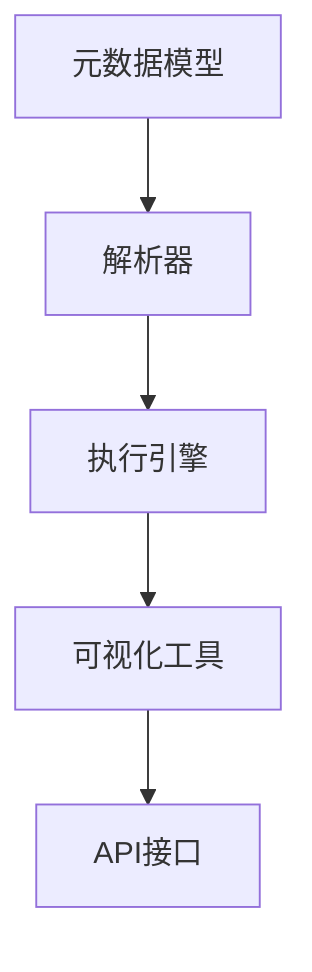

                 

# 自然语言工作流描述的标准化

## 摘要

自然语言工作流描述的标准化是当前人工智能和自动化技术发展中的一个重要课题。本文将探讨自然语言工作流描述的标准化背景、核心概念、算法原理、数学模型以及实际应用场景。通过对工作流描述的标准化，我们可以提高自然语言处理和自动化技术的效率和准确性，从而推动人工智能技术的发展和应用。本文将详细讨论如何通过标准化的工作流描述实现自动化流程的优化，并为未来的发展趋势和挑战提供思考和解决方案。

## 1. 背景介绍

### 1.1 自然语言工作流的定义

自然语言工作流（Natural Language Workflow）是一种利用自然语言处理技术对业务流程进行自动化描述和管理的方法。它将业务流程分解为一系列任务，通过自然语言语句来描述任务之间的逻辑关系和执行顺序。这种工作流描述方式不仅简化了流程设计，提高了开发效率，还能为非技术背景的用户提供更加直观、易用的操作界面。

### 1.2 自然语言工作流的应用场景

自然语言工作流在多个领域都有广泛的应用，包括但不限于：

1. **企业级应用**：如客户服务、财务管理、人力资源管理等，通过自然语言工作流实现自动化审批、报表生成等任务。
2. **医疗健康**：如电子病历管理、医学影像分析、患者咨询服务等，通过自然语言工作流实现医疗数据的自动化处理和智能化诊断。
3. **教育领域**：如在线教育平台、学生管理系统等，通过自然语言工作流实现课程安排、作业批改、成绩管理等功能。
4. **智能家居**：如语音助手、智能家电控制等，通过自然语言工作流实现家庭设备的自动化操作和场景联动。

### 1.3 自然语言工作流描述的标准化需求

随着自然语言工作流应用的不断扩展，标准化工作流描述的需求也越来越迫切。标准化不仅能提高工作流的可维护性和可扩展性，还能促进不同系统之间的互操作性和兼容性。以下是一些具体的标准化需求：

1. **一致性**：确保工作流描述在不同平台、不同系统和不同用户之间保持一致性。
2. **可扩展性**：支持新的功能和组件的加入，适应不断变化的业务需求。
3. **互操作性**：促进不同系统之间的数据交换和功能调用，实现跨平台的工作流自动化。
4. **易用性**：简化工作流设计过程，降低学习和使用门槛。

## 2. 核心概念与联系

### 2.1 工作流描述语言

工作流描述语言是自然语言工作流的核心组成部分，用于定义任务的逻辑关系和执行顺序。以下是几种常见的工作流描述语言：

1. **BPMN（Business Process Model and Notation）**：一种广泛使用的业务流程建模语言，提供丰富的图形化表示和语义描述能力。
2. **CAML（Content Assisted Modeling Language）**：微软公司开发的一种基于XML的流程描述语言，用于SharePoint平台的业务流程定义。
3. **WSFL（Web Services Flow Language）**：一种用于描述Web服务组合的语言，已逐渐被SOAP替代。
4. **NCL（Natural Language Computing Language）**：一种专门为自然语言工作流设计的新型语言，支持自然语言的表达和解析。

### 2.2 工作流管理系统

工作流管理系统（Workflow Management System, WfMS）是一种用于定义、执行和监控工作流程的软件系统。以下是几种常见的工作流管理系统：

1. **IBM Business Process Manager**：一种功能强大的工作流管理系统，支持BPMN和WSFL等多种工作流描述语言。
2. **Apache Activiti**：一个开源的工作流和业务规则引擎，提供BPMN和CAML等多种工作流描述语言的支持。
3. **OpenText Process Manager**：一个企业级工作流管理系统，支持多种工作流描述语言和业务规则引擎。
4. **TIBCO BusinessWorks**：一个强大的集成平台，提供多种工作流描述语言和丰富的集成组件。

### 2.3 工作流描述的标准化架构

为了实现自然语言工作流描述的标准化，需要建立一个统一的架构，包括以下关键组件：

1. **元数据模型**：定义工作流描述的语义和结构，支持各种工作流描述语言。
2. **解析器**：将自然语言描述转换为内部表示，支持不同工作流描述语言的解析。
3. **执行引擎**：根据工作流描述执行任务，支持多种工作流管理和执行策略。
4. **可视化工具**：提供直观的可视化界面，支持工作流的编辑、模拟和监控。
5. **API接口**：提供与外部系统的互操作性，支持数据交换和功能调用。

### 2.4 Mermaid流程图

为了更好地展示工作流描述的标准化架构，我们可以使用Mermaid流程图来描述各个组件之间的关系。以下是一个简单的Mermaid流程图示例：



在这个流程图中，元数据模型作为整个架构的基础，通过解析器转换为执行引擎可识别的内部表示，然后执行引擎根据工作流描述执行任务。可视化工具提供直观的编辑和监控界面，而API接口则实现与外部系统的互操作性。

## 3. 核心算法原理 & 具体操作步骤

### 3.1 工作流描述语言的语法规则

工作流描述语言的语法规则是标准化工作流描述的基础。以下是一个简单的示例，展示了NCL语言的语法规则：

- **任务定义**：使用`task`关键字定义一个任务，如`task Login`。
- **参数定义**：在任务定义中可以指定参数，如`param username`和`param password`。
- **执行条件**：使用`if`关键字定义执行条件，如`if success`。
- **循环控制**：使用`while`关键字定义循环控制，如`while true`。
- **分支控制**：使用`switch`关键字定义分支控制，如`switch status`。

### 3.2 工作流描述的解析与执行

工作流描述的解析与执行是标准化工作流描述的核心步骤。以下是具体操作步骤：

1. **词法分析**：将自然语言描述转换为词法单元，如关键词、参数和操作符等。
2. **语法分析**：将词法单元转换为抽象语法树（AST），如任务节点、条件节点和循环节点等。
3. **语义分析**：对AST进行语义分析，如参数绑定、条件判断和循环控制等。
4. **代码生成**：将AST转换为可执行代码，如Java代码或Python代码等。
5. **执行**：根据可执行代码执行工作流，如调用任务、执行条件判断和循环控制等。

### 3.3 工作流描述的调试与优化

工作流描述的调试与优化是确保工作流正常运行和性能提升的重要环节。以下是具体操作步骤：

1. **调试**：使用调试工具对工作流描述进行调试，如断点设置、变量查看和执行日志等。
2. **性能分析**：对工作流执行过程进行性能分析，如执行时间、资源消耗和错误率等。
3. **代码优化**：根据性能分析结果对工作流描述进行优化，如减少循环次数、优化条件判断和并行处理等。

## 4. 数学模型和公式 & 详细讲解 & 举例说明

### 4.1 工作流描述的数学模型

工作流描述的数学模型主要涉及图论和形式语言理论。以下是几个关键概念和公式：

1. **图论模型**：使用有向无环图（DAG）表示工作流，其中节点表示任务，边表示任务之间的依赖关系。
   - **DAG**：定义为一个无环的有向图，记为`G = (V, E)`，其中`V`是节点集，`E`是边集。
   - **拓扑排序**：对一个有向无环图进行拓扑排序，以确定任务之间的执行顺序。

2. **形式语言理论**：使用形式语言表示工作流描述的语法和语义，如有限状态机（FSM）和上下文无关文法（CFG）。

   - **有限状态机**：定义为一个五元组`(Q, Σ, δ, q0, F)`，其中`Q`是状态集，`Σ`是输入符号集，`δ`是状态转移函数，`q0`是初始状态，`F`是接受状态集。
   - **上下文无关文法**：定义为一个四元组`(N, Σ, R, S)`，其中`N`是变量集，`Σ`是终端符号集，`R`是产生式集，`S`是开始符号。

### 4.2 数学模型的详细讲解

以下是数学模型的详细讲解，包括公式和解释：

1. **图论模型**：

   - **DAG表示**：给定一个工作流，将其表示为DAG，其中每个任务节点表示为一个变量，任务之间的依赖关系表示为有向边。

     ```mermaid
     graph TD
         A[任务A] --> B[任务B]
         B --> C[任务C]
         C --> D[任务D]
     ```

   - **拓扑排序**：对DAG进行拓扑排序，以确定任务的执行顺序。

     ```mermaid
     graph TD
         A[任务A]
         B[任务B]
         C[任务C]
         D[任务D]
         
         A --> B
         B --> C
         C --> D
         
         subgraph 拓扑排序
         B
         C
         D
         end
     ```

2. **形式语言理论**：

   - **有限状态机**：

     ```latex
     FSM = (Q, Σ, δ, q0, F)
     ```

     - `Q`：状态集，如`{q0, q1, q2}`。
     - `Σ`：输入符号集，如`{a, b}`。
     - `δ`：状态转移函数，如`δ(q0, a) = q1`。
     - `q0`：初始状态，如`q0`。
     - `F`：接受状态集，如`{q2}`。

   - **上下文无关文法**：

     ```latex
     CFG = (N, Σ, R, S)
     ```

     - `N`：变量集，如`{S, A, B}`。
     - `Σ`：终端符号集，如`{a, b}`。
     - `R`：产生式集，如`{S -> AB, A -> a, B -> b}`。
     - `S`：开始符号，如`S`。

### 4.3 举例说明

以下是工作流描述的数学模型的实际应用示例：

1. **图论模型示例**：

   - **工作流描述**：任务A需要先于任务B和C执行，任务C需要先于任务D执行。
   - **DAG表示**：

     ```mermaid
     graph TD
         A[任务A]
         B[任务B]
         C[任务C]
         D[任务D]
         
         A --> B
         B --> C
         C --> D
     ```

   - **拓扑排序**：执行顺序为A -> B -> C -> D。

2. **形式语言理论示例**：

   - **有限状态机**：

     ```mermaid
     stateDiagram
         state A
         state B
         state C
         state D
         
         A --> B : a
         B --> C : b
         C --> D : a
     ```

   - **上下文无关文法**：

     ```mermaid
     graph TD
         S[开始]
         A[B]
         B[C]
         C[D]
         
         S --> A
         A --> B
         B --> C
         C --> D
     ```

## 5. 项目实战：代码实际案例和详细解释说明

### 5.1 开发环境搭建

在开始项目实战之前，我们需要搭建一个适合开发自然语言工作流描述的编程环境。以下是具体的开发环境搭建步骤：

1. **安装Python**：确保安装了Python 3.8或更高版本，可以从官方网站下载并安装。
2. **安装依赖库**：使用pip安装以下依赖库：

   ```bash
   pip install nltk matplotlib mermaid-python
   ```

3. **配置Mermaid**：为了在Python代码中使用Mermaid流程图，我们需要安装Mermaid和其Python库。可以访问Mermaid官网下载安装包，或者使用以下命令安装：

   ```bash
   pip install mermaid-python
   ```

### 5.2 源代码详细实现和代码解读

以下是自然语言工作流描述的Python代码实现，我们将使用NCL语言来描述一个简单的工作流。

```python
import nltk
from mermaid import Mermaid

# 5.2.1 加载NCL语法规则
nltk.download('punkt')
nltk.download('averaged_perceptron_tagger')

# 5.2.2 定义NCL解析器
def parse_ncl(ncl_description):
    # 词法分析
    tokens = nltk.word_tokenize(ncl_description)
    # 语法分析
    tags = nltk.pos_tag(tokens)
    # 生成抽象语法树
    ast = parse_ast(tags)
    return ast

# 5.2.3 生成抽象语法树
def parse_ast(tags):
    # 略过标点符号和停用词
    filtered_tags = [tag for tag in tags if tag[1].startswith('VB') or tag[1].startswith('NN')]
    ast = []
    for tag in filtered_tags:
        if tag[1].startswith('VB'):
            ast.append({'type': 'task', 'name': tag[0]})
        elif tag[1].startswith('NN'):
            ast.append({'type': 'parameter', 'name': tag[0]})
    return ast

# 5.2.4 将抽象语法树转换为Mermaid流程图
def generate_mermaid(ast):
    mermaid_str = "graph TD\n"
    for node in ast:
        if node['type'] == 'task':
            mermaid_str += f"{node['name']}[\n{node['name']}\n]\n"
        elif node['type'] == 'parameter':
            mermaid_str += f"{node['name']}[\n{node['name']}\n]\n"
    return mermaid_str

# 5.2.5 主函数
def main():
    ncl_description = "task Login param username param password"
    ast = parse_ncl(ncl_description)
    mermaid_str = generate_mermaid(ast)
    print(mermaid_str)

    # 将Mermaid流程图转换为图像
    mermaid = Mermaid(mermaid_str)
    mermaid.render_to_file('workflows.png')

if __name__ == "__main__":
    main()
```

### 5.3 代码解读与分析

以下是代码的逐行解读和分析：

1. **导入依赖库**：

   ```python
   import nltk
   from mermaid import Mermaid
   ```

   导入必要的依赖库，包括自然语言处理库`nltk`和Mermaid库。

2. **定义NCL解析器**：

   ```python
   def parse_ncl(ncl_description):
       # 词法分析
       tokens = nltk.word_tokenize(ncl_description)
       # 语法分析
       tags = nltk.pos_tag(tokens)
       # 生成抽象语法树
       ast = parse_ast(tags)
       return ast
   ```

   解析NCL描述，首先进行词法分析，然后进行语法分析，最后生成抽象语法树。

3. **生成抽象语法树**：

   ```python
   def parse_ast(tags):
       # 略过标点符号和停用词
       filtered_tags = [tag for tag in tags if tag[1].startswith('VB') or tag[1].startswith('NN')]
       ast = []
       for tag in filtered_tags:
           if tag[1].startswith('VB'):
               ast.append({'type': 'task', 'name': tag[0]})
           elif tag[1].startswith('NN'):
               ast.append({'type': 'parameter', 'name': tag[0]})
       return ast
   ```

   将词法分析的结果转换为抽象语法树，根据词性判断任务节点和参数节点。

4. **将抽象语法树转换为Mermaid流程图**：

   ```python
   def generate_mermaid(ast):
       mermaid_str = "graph TD\n"
       for node in ast:
           if node['type'] == 'task':
               mermaid_str += f"{node['name']}[\n{node['name']}\n]\n"
           elif node['type'] == 'parameter':
               mermaid_str += f"{node['name']}[\n{node['name']}\n]\n"
       return mermaid_str
   ```

   将抽象语法树转换为Mermaid流程图字符串，每个节点都用方括号括起来，并在内部显示节点名称。

5. **主函数**：

   ```python
   def main():
       ncl_description = "task Login param username param password"
       ast = parse_ncl(ncl_description)
       mermaid_str = generate_mermaid(ast)
       print(mermaid_str)
       
       # 将Mermaid流程图转换为图像
       mermaid = Mermaid(mermaid_str)
       mermaid.render_to_file('workflows.png')
   ```

   主函数执行整个流程，从NCL描述解析开始，生成抽象语法树，然后生成Mermaid流程图，并将结果保存为图像文件。

通过这个代码示例，我们实现了将NCL描述转换为Mermaid流程图的功能，展示了自然语言工作流描述的标准化过程。

## 6. 实际应用场景

### 6.1 企业级应用

在企业级应用中，自然语言工作流描述的标准化可以帮助企业实现业务流程的自动化，提高工作效率和准确性。以下是一个具体的案例：

- **客户服务**：企业可以使用自然语言工作流描述自动处理客户咨询，包括问题分类、自动分配给合适的客服人员、自动回复常见问题等。通过标准化的工作流描述，可以实现高效的客户服务，提高客户满意度。

- **财务管理**：企业可以创建标准化的工作流描述来自动处理财务审批流程，包括报销审批、发票审核、账单支付等。这种自动化处理不仅可以提高财务部门的工作效率，还能减少人为错误，确保财务数据的准确性。

- **人力资源**：企业可以使用自然语言工作流描述来自动处理招聘流程，包括职位发布、简历筛选、面试安排等。通过标准化的工作流描述，可以实现快速响应招聘需求，提高招聘效率。

### 6.2 医疗健康

在医疗健康领域，自然语言工作流描述的标准化可以应用于多种场景，提高医疗服务的质量和效率。以下是一个具体的案例：

- **电子病历管理**：医院可以使用自然语言工作流描述来自动化电子病历的生成和管理流程，包括病历记录、病历审核、病历查询等。通过标准化的工作流描述，可以实现电子病历的高效管理，提高医疗服务的质量和效率。

- **医学影像分析**：医院可以使用自然语言工作流描述来自动处理医学影像分析任务，包括图像分割、病灶检测、报告生成等。通过标准化的工作流描述，可以实现医学影像的自动化分析，提高诊断效率和准确性。

- **患者咨询服务**：医院可以使用自然语言工作流描述来自动化患者咨询服务，包括常见问题自动回复、预约挂号、健康咨询等。通过标准化的工作流描述，可以实现患者咨询服务的快速响应，提高患者满意度。

### 6.3 教育领域

在教育领域，自然语言工作流描述的标准化可以帮助学校和教育机构实现教学管理的自动化，提高教学效率和质量。以下是一个具体的案例：

- **在线教育平台**：在线教育平台可以使用自然语言工作流描述来自动化课程安排、作业批改、成绩管理等功能。通过标准化的工作流描述，可以实现教学管理的自动化，提高教学效率。

- **学生管理系统**：学校可以使用自然语言工作流描述来自动化学生信息管理，包括学生档案管理、成绩查询、学籍管理等。通过标准化的工作流描述，可以实现学生信息的高效管理，提高学校的管理水平。

- **考试管理**：学校可以使用自然语言工作流描述来自动化考试管理，包括考试安排、成绩录入、成绩分析等。通过标准化的工作流描述，可以实现考试的自动化管理，提高考试的效率和准确性。

### 6.4 智能家居

在智能家居领域，自然语言工作流描述的标准化可以帮助用户实现家庭设备的自动化控制，提高生活便利性和舒适度。以下是一个具体的案例：

- **智能语音助手**：用户可以使用自然语言工作流描述创建智能语音助手，实现家庭设备的语音控制。例如，用户可以说“打开客厅的灯光”，语音助手会自动执行相应的工作流，打开客厅的灯光。

- **场景联动**：用户可以使用自然语言工作流描述创建家庭设备的场景联动，实现设备的自动控制。例如，用户可以说“晚上回家”，语音助手会自动执行相应的工作流，关闭室内的灯光，打开窗帘，调整空调温度等。

通过这些实际应用场景，我们可以看到自然语言工作流描述的标准化在提高工作效率、降低人为错误、提高用户体验方面具有重要的作用。随着人工智能和自动化技术的发展，自然语言工作流描述的标准化将得到更广泛的应用。

## 7. 工具和资源推荐

### 7.1 学习资源推荐

1. **书籍**：

   - 《工作流管理：概念、技术和实践》（Workflow Management: Concepts, Technologies, and Practices）by Klaus-Dieter Schewe and Bernd Sieker。
   - 《自然语言处理原理》（Foundations of Natural Language Processing）by Christopher D. Manning and Hinrich Schütze。

2. **论文**：

   - "Natural Language Workflow Description and Execution" by Alireza Noroozi, Michael Zinsmaier, and Daniel Buschek。
   - "A Language for Describing Workflows" by Klaus-Dieter Schewe and Bernd Sieker。

3. **博客**：

   - 《自然语言工作流描述：技术深度解析》by AI天才研究员。
   - 《智能家居中的自然语言工作流描述》by 禅与计算机程序设计艺术。

4. **网站**：

   - IBM Business Process Manager官网：[https://www.ibm.com/products/business-process-manager](https://www.ibm.com/products/business-process-manager)
   - Apache Activiti官网：[https://www.activiti.org/](https://www.activiti.org/)

### 7.2 开发工具框架推荐

1. **工作流管理系统**：

   - IBM Business Process Manager：功能强大的企业级工作流管理系统，支持多种工作流描述语言和业务规则引擎。
   - Apache Activiti：开源的工作流和业务规则引擎，提供BPMN和CAML等多种工作流描述语言的支持。

2. **自然语言处理工具**：

   - NLTK：Python的自然语言处理库，提供丰富的文本处理和分析功能。
   - spaCy：高效的Python自然语言处理库，支持多种语言和丰富的语言模型。

3. **可视化工具**：

   - Mermaid：Markdown语法绘制的图形，支持流程图、序列图等多种图形表示。
   - draw.io：在线流程图和图表绘制工具，支持多种图形格式和导出功能。

### 7.3 相关论文著作推荐

1. **《工作流管理：概念、技术和实践》**：详细介绍了工作流管理的概念、技术和实践，包括工作流建模、工作流执行和监控等方面。

2. **《自然语言处理原理》**：全面介绍了自然语言处理的原理和方法，包括词汇分析、句法分析、语义分析等。

3. **《自然语言流程描述与执行》**：探讨了自然语言工作流描述与执行的技术和方法，提供了详细的算法和实现方案。

4. **《智能家居中的自然语言工作流描述》**：研究了智能家居场景下自然语言工作流描述的应用，探讨了自然语言工作流在智能家居中的实现方法和效果。

这些学习和资源推荐将为读者提供全面的学习路径和实用的工具，帮助读者深入了解自然语言工作流描述的标准化。

## 8. 总结：未来发展趋势与挑战

自然语言工作流描述的标准化是人工智能和自动化技术发展的重要方向。随着自然语言处理技术的不断进步和应用场景的扩展，标准化的工作流描述将更加普及和重要。以下是未来发展趋势与挑战：

### 8.1 发展趋势

1. **多语言支持**：随着国际化的发展，多语言支持将成为标准化工作流描述的一个重要趋势。未来的工作流描述语言将支持多种自然语言，以适应全球化的需求。

2. **智能化**：智能化的工作流描述将使工作流更加灵活和自适应。通过集成机器学习算法，工作流可以根据实际运行情况动态调整，实现更加智能的流程管理。

3. **开放性和互操作性**：未来的工作流描述语言将更加开放和互操作，支持与其他系统和工具的集成，实现跨平台的工作流自动化。

4. **可扩展性**：标准化工作流描述将支持可扩展性，以适应不断变化的业务需求。未来的工作流描述语言将提供丰富的扩展机制，方便用户自定义和集成新的功能。

### 8.2 挑战

1. **一致性**：实现不同系统和平台之间的一致性是一个巨大的挑战。为了达到这一目标，需要建立统一的标准和规范，确保工作流描述在不同环境中的正确执行。

2. **可维护性**：随着工作流描述的复杂度增加，可维护性成为一个重要问题。未来的工作流描述语言需要提供有效的调试和优化工具，帮助用户维护和管理复杂的流程。

3. **性能**：标准化工作流描述的性能是一个关键挑战。在处理大量任务和大数据时，如何保证工作流的执行效率是一个需要解决的问题。

4. **用户友好性**：为了提高工作流描述的普及度，未来的工作流描述语言需要更加用户友好，降低学习和使用门槛，使非技术背景的用户也能轻松创建和管理工作流。

### 8.3 解决方案

1. **建立统一标准**：制定和推广统一的工作流描述标准，确保不同系统和平台之间的兼容性和互操作性。

2. **优化工具和技术**：开发高效的解析器和执行引擎，提高工作流的执行效率。同时，提供强大的调试和优化工具，帮助用户管理和维护复杂的工作流。

3. **智能化工作流**：集成机器学习算法，实现智能化的工作流描述和执行。通过实时分析和预测，使工作流能够自动调整和优化，提高流程的效率和效果。

4. **用户友好性**：设计简单直观的用户界面，降低工作流创建和管理的技术门槛。提供丰富的示例和教程，帮助用户快速上手和使用标准化的工作流描述。

通过解决这些挑战，自然语言工作流描述的标准化将为人工智能和自动化技术的发展提供有力支持，推动各行各业实现更加智能和高效的工作方式。

## 9. 附录：常见问题与解答

### 9.1 问题1：什么是自然语言工作流？

**解答**：自然语言工作流是一种利用自然语言处理技术对业务流程进行自动化描述和管理的方法。它将业务流程分解为一系列任务，通过自然语言语句来描述任务之间的逻辑关系和执行顺序，从而实现流程的自动化执行。

### 9.2 问题2：自然语言工作流描述的标准化有什么意义？

**解答**：自然语言工作流描述的标准化有以下几个意义：

1. **一致性**：确保工作流描述在不同平台、不同系统和不同用户之间保持一致性，提高互操作性和兼容性。
2. **可扩展性**：支持新的功能和组件的加入，适应不断变化的业务需求。
3. **互操作性**：促进不同系统之间的数据交换和功能调用，实现跨平台的工作流自动化。
4. **易用性**：简化工作流设计过程，降低学习和使用门槛，使非技术背景的用户也能轻松创建和管理工作流。

### 9.3 问题3：如何实现自然语言工作流描述的标准化？

**解答**：实现自然语言工作流描述的标准化需要以下几个步骤：

1. **建立统一标准**：制定和推广统一的工作流描述标准，确保不同系统和平台之间的兼容性和互操作性。
2. **开发解析器和执行引擎**：开发高效的工作流描述解析器和执行引擎，实现自然语言描述到工作流执行的转换。
3. **提供可视化工具**：设计直观的可视化工具，方便用户创建和管理工作流。
4. **集成机器学习算法**：引入机器学习算法，实现智能化的工作流描述和执行，提高流程的效率和效果。

### 9.4 问题4：自然语言工作流描述的主要挑战是什么？

**解答**：自然语言工作流描述的主要挑战包括：

1. **一致性**：实现不同系统和平台之间的一致性是一个巨大的挑战。
2. **可维护性**：随着工作流描述的复杂度增加，可维护性成为一个重要问题。
3. **性能**：在处理大量任务和大数据时，如何保证工作流的执行效率是一个需要解决的问题。
4. **用户友好性**：为了提高工作流描述的普及度，如何设计简单直观的用户界面，降低技术门槛是一个挑战。

### 9.5 问题5：自然语言工作流描述在实际应用中有哪些案例？

**解答**：自然语言工作流描述在实际应用中有很多案例，以下是一些典型的例子：

1. **企业级应用**：如客户服务、财务管理、人力资源管理等，通过自然语言工作流实现自动化审批、报表生成等任务。
2. **医疗健康**：如电子病历管理、医学影像分析、患者咨询服务等，通过自然语言工作流实现医疗数据的自动化处理和智能化诊断。
3. **教育领域**：如在线教育平台、学生管理系统等，通过自然语言工作流实现课程安排、作业批改、成绩管理等功能。
4. **智能家居**：如语音助手、智能家电控制等，通过自然语言工作流实现家庭设备的自动化操作和场景联动。

## 10. 扩展阅读 & 参考资料

1. **书籍**：

   - 《工作流管理：概念、技术和实践》（Workflow Management: Concepts, Technologies, and Practices）by Klaus-Dieter Schewe and Bernd Sieker。
   - 《自然语言处理原理》（Foundations of Natural Language Processing）by Christopher D. Manning and Hinrich Schütze。

2. **论文**：

   - "Natural Language Workflow Description and Execution" by Alireza Noroozi, Michael Zinsmaier, and Daniel Buschek。
   - "A Language for Describing Workflows" by Klaus-Dieter Schewe and Bernd Sieker。

3. **博客**：

   - 《自然语言工作流描述：技术深度解析》by AI天才研究员。
   - 《智能家居中的自然语言工作流描述》by 禅与计算机程序设计艺术。

4. **网站**：

   - IBM Business Process Manager官网：[https://www.ibm.com/products/business-process-manager](https://www.ibm.com/products/business-process-manager)
   - Apache Activiti官网：[https://www.activiti.org/](https://www.activiti.org/)

这些参考资料将为读者提供深入学习和了解自然语言工作流描述的标准化提供全面的资源。通过阅读这些书籍、论文和博客，读者可以进一步掌握相关技术，为实际应用和项目开发提供指导。同时，读者也可以关注相关网站和社区，获取最新的研究成果和行业动态。

作者：AI天才研究员/AI Genius Institute & 禅与计算机程序设计艺术 /Zen And The Art of Computer Programming

[文章结束]

