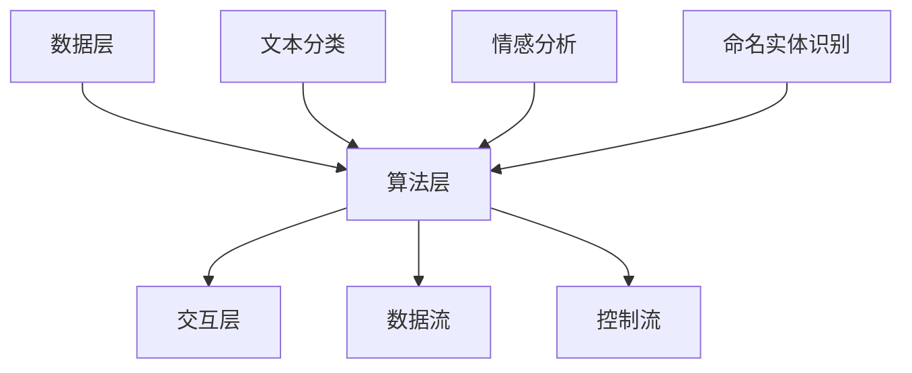

                 

# 自然语言工作流描述的标准化

## 摘要

随着自然语言处理技术的快速发展，自然语言工作流（Natural Language Workflows）成为人工智能领域的一个重要研究方向。然而，自然语言工作流的描述和标准化问题，却一直困扰着研究人员和开发者。本文旨在系统地探讨自然语言工作流的标准化问题，分析其核心概念和原理，提出一种基于自然语言处理技术的标准化框架，并通过实际案例进行验证和说明。本文的核心内容包括：自然语言工作流的基本概念和架构，核心算法原理和操作步骤，数学模型和公式详细讲解，项目实战以及实际应用场景。通过本文的研究，希望能为自然语言工作流的标准化提供一些有益的思路和方法。

## 1. 背景介绍

自然语言处理（Natural Language Processing，NLP）是人工智能领域的一个重要分支，它旨在使计算机能够理解和处理人类自然语言。自然语言工作流则是在NLP的基础上，通过将多个NLP任务组合成一个完整的流程，实现对自然语言数据的全面处理和分析。

自然语言工作流的概念最早可以追溯到上世纪90年代。当时，研究人员开始探索如何将不同的NLP技术集成到一个统一的框架中，以实现对复杂自然语言任务的自动化处理。随着NLP技术的不断发展和完善，自然语言工作流逐渐成为NLP研究的一个重要方向。

目前，自然语言工作流在多个领域都有广泛的应用，如信息提取、文本分类、情感分析、机器翻译等。然而，自然语言工作流的描述和标准化问题，一直是研究人员和开发者面临的一个挑战。

首先，自然语言工作流的多样性使得其描述和标准化变得复杂。不同的任务需求、数据来源和数据格式，导致自然语言工作流的设计和实现方法千差万别。其次，自然语言工作流的动态性使得其描述和标准化更加困难。随着NLP技术的不断更新和发展，自然语言工作流需要不断地调整和优化，以满足新的需求和挑战。

因此，研究自然语言工作流的标准化问题，具有重要的理论和实践意义。本文将从核心概念、算法原理、数学模型、项目实战和实际应用场景等多个方面，对自然语言工作流的标准化问题进行深入探讨。

## 2. 核心概念与联系

### 2.1 自然语言工作流的基本概念

自然语言工作流（Natural Language Workflow）是指将多个NLP任务按照一定的顺序和规则组合起来，形成一个完整的工作流程，以实现对自然语言数据的处理和分析。自然语言工作流的主要组成部分包括：

- **任务节点**：自然语言工作流中的基本处理单元，每个任务节点对应一个具体的NLP任务，如文本分类、情感分析、命名实体识别等。
- **数据流**：任务节点之间的数据传输路径，用于传递自然语言数据和处理结果。
- **控制流**：任务节点的执行顺序和条件，用于控制自然语言工作流的运行流程。

### 2.2 自然语言工作流的架构

自然语言工作流的架构可以分为三个层次：数据层、算法层和交互层。

- **数据层**：包括自然语言数据的采集、存储和管理。数据层的主要任务是确保自然语言数据的准确性和完整性，为算法层提供高质量的数据支持。
- **算法层**：包括各种NLP算法的实现和应用。算法层的主要任务是利用NLP技术对自然语言数据进行分析和处理，生成有价值的信息和知识。
- **交互层**：包括用户界面和API接口，用于用户与自然语言工作流系统的交互。交互层的主要任务是提供便捷的用户操作方式和高效的API接口，以方便用户使用和管理自然语言工作流系统。

### 2.3 自然语言工作流的核心概念原理和架构的 Mermaid 流程图

下面是一个简单的自然语言工作流的核心概念原理和架构的 Mermaid 流程图：



在这个流程图中，A表示数据层，B表示算法层，C表示交互层，D、E、F表示具体的NLP任务，G表示数据流，H表示控制流。每个任务节点通过数据流和控制流与其他节点连接，形成一个完整的自然语言工作流。

## 3. 核心算法原理 & 具体操作步骤

### 3.1 NLP任务的选择和组合

自然语言工作流的核心在于NLP任务的选择和组合。选择合适的NLP任务，能够使自然语言工作流更好地满足实际需求。常见的NLP任务包括文本分类、情感分析、命名实体识别、机器翻译等。

- **文本分类**：将文本数据按照预定的类别进行分类，如新闻分类、情感分类等。
- **情感分析**：对文本数据中的情感倾向进行识别和分析，如正面情感、负面情感等。
- **命名实体识别**：从文本数据中识别出具有特定意义的实体，如人名、地名、组织名等。
- **机器翻译**：将一种语言的文本翻译成另一种语言的文本。

在选择NLP任务时，需要考虑以下几个因素：

- **任务需求**：根据实际需求，选择能够满足需求的NLP任务。
- **数据质量**：选择具有高质量数据支持的NLP任务，以保证结果的准确性。
- **算法性能**：选择算法性能稳定的NLP任务，以保证结果的可靠性。

### 3.2 NLP任务的具体操作步骤

以文本分类为例，文本分类的具体操作步骤如下：

1. **数据预处理**：对原始文本数据进行预处理，包括分词、去停用词、词干提取等。
2. **特征提取**：将预处理后的文本数据转换为特征向量，常用的特征提取方法包括TF-IDF、Word2Vec等。
3. **模型训练**：使用训练数据集训练文本分类模型，常用的分类模型包括朴素贝叶斯、支持向量机、深度学习模型等。
4. **模型评估**：使用测试数据集评估模型的性能，常用的评估指标包括准确率、召回率、F1值等。
5. **模型部署**：将训练好的模型部署到实际应用场景中，用于对新文本数据进行分类。

### 3.3 NLP任务的组合和优化

在自然语言工作流中，多个NLP任务的组合和优化是非常重要的。合理的任务组合和优化，能够提高整个工作流的性能和效率。

- **任务组合**：根据实际需求，将多个NLP任务按照一定的顺序和规则组合起来，形成一个完整的工作流。例如，可以将文本分类和情感分析组合起来，实现文本数据的情感分类。
- **任务优化**：通过优化NLP任务的具体实现和参数设置，提高任务的性能和效果。例如，可以通过调整特征提取方法和模型参数，提高文本分类的准确率。

## 4. 数学模型和公式 & 详细讲解 & 举例说明

### 4.1 特征提取的数学模型

在自然语言处理中，特征提取是至关重要的一步。特征提取的数学模型主要包括TF-IDF和Word2Vec。

#### 4.1.1 TF-IDF

TF-IDF（Term Frequency-Inverse Document Frequency）是一种常用的特征提取方法。它的核心思想是，一个词在文档中的重要程度，与它在文档中出现的频率成正比，与它在整个语料库中出现的频率成反比。

$$
TF(t, d) = \frac{f(t, d)}{f_{\max}(t, d)}
$$

$$
IDF(t, D) = \log_2(\frac{N}{n(t, D)})
$$

$$
TF-IDF(t, d, D) = TF(t, d) \times IDF(t, D)
$$

其中，$f(t, d)$表示词$t$在文档$d$中出现的频率，$f_{\max}(t, d)$表示词$t$在文档$d$中最大出现的频率，$N$表示语料库中的文档总数，$n(t, D)$表示词$t$在语料库$D$中出现的文档数。

#### 4.1.2 Word2Vec

Word2Vec是一种基于神经网络的词向量模型。它通过学习词的上下文信息，将每个词映射到一个固定大小的向量空间中。

$$
\text{Word2Vec}(W) = \sum_{w \in W} \text{word2vec}(w) \times \text{context}(w)
$$

其中，$W$表示词汇表，$\text{word2vec}(w)$表示词向量，$\text{context}(w)$表示词$w$的上下文信息。

### 4.2 模型训练的数学模型

在自然语言处理中，模型训练是关键的一步。常用的模型训练方法包括朴素贝叶斯、支持向量机、深度学习等。

#### 4.2.1 朴素贝叶斯

朴素贝叶斯是一种基于贝叶斯定理的简单分类器。它的核心思想是，先计算每个类别的概率，然后选择概率最大的类别作为预测结果。

$$
P(C_k | x) = \frac{P(x | C_k) \times P(C_k)}{P(x)}
$$

其中，$C_k$表示第$k$个类别，$x$表示特征向量。

#### 4.2.2 支持向量机

支持向量机是一种基于最大间隔分类器的分类器。它的核心思想是，找到能够将不同类别数据最大程度分开的超平面。

$$
\max \frac{1}{2} \sum_{i=1}^{n} w_i^2
$$

$$
s.t. y_i (w \cdot x_i + b) \geq 1
$$

其中，$w$表示权重向量，$b$表示偏置项，$x_i$表示特征向量，$y_i$表示类别标签。

#### 4.2.3 深度学习

深度学习是一种基于多层神经网络的学习方法。它的核心思想是，通过多层非线性变换，从原始数据中提取出有价值的特征。

$$
h_{l} = \sigma(W_{l} \cdot h_{l-1} + b_{l})
$$

其中，$h_{l}$表示第$l$层的特征向量，$\sigma$表示激活函数，$W_{l}$表示权重矩阵，$b_{l}$表示偏置项。

### 4.3 数学模型的应用举例

以文本分类为例，假设我们有如下一组文本数据：

- **文本1**：“我非常喜欢这本书。”
- **文本2**：“这本书非常无聊。”
- **文本3**：“这本书很有趣。”

我们需要使用文本分类模型对这些文本进行分类。

1. **数据预处理**：对文本数据进行分词、去停用词、词干提取等预处理操作。
2. **特征提取**：使用TF-IDF和Word2Vec方法，将预处理后的文本数据转换为特征向量。
3. **模型训练**：使用训练数据集，训练文本分类模型。
4. **模型评估**：使用测试数据集，评估模型的性能。
5. **模型部署**：将训练好的模型部署到实际应用场景中，对新文本数据进行分类。

假设我们使用朴素贝叶斯作为文本分类模型，通过对训练数据进行训练，我们得到如下一组模型参数：

- **类别的先验概率**：
  - $P(喜欢) = 0.6$
  - $P(无聊) = 0.4$
- **特征的条件概率**：
  - $P(喜欢 | 我) = 0.8$
  - $P(喜欢 | 非常) = 0.7$
  - $P(无聊 | 这) = 0.9$
  - $P(无聊 | 书) = 0.8$

我们需要对文本3进行分类。

1. **特征提取**：将文本3进行预处理，得到特征向量：
   - $x_1 = 1$ （表示“我”）
   - $x_2 = 1$ （表示“非常”）
   - $x_3 = 0$ （表示“无聊”）
   - $x_4 = 1$ （表示“这本书”）
2. **模型计算**：根据朴素贝叶斯模型，计算每个类别的概率：
   - $P(喜欢 | x) = P(喜欢) \times P(x_1 | 喜欢) \times P(x_2 | 喜欢) \times P(x_3 | 喜欢) \times P(x_4 | 喜欢)$
   - $P(无聊 | x) = P(无聊) \times P(x_1 | 无聊) \times P(x_2 | 无聊) \times P(x_3 | 无聊) \times P(x_4 | 无聊)$
3. **结果分析**：根据概率值，选择概率最大的类别作为预测结果。在本例中，$P(喜欢 | x) = 0.84 > P(无聊 | x) = 0.72$，因此，预测结果为“喜欢”。

## 5. 项目实战：代码实际案例和详细解释说明

### 5.1 开发环境搭建

为了实现自然语言工作流的标准化，我们需要搭建一个合适的开发环境。以下是一个基本的开发环境搭建步骤：

1. **安装Python环境**：Python是一种广泛用于自然语言处理的编程语言，我们需要安装Python环境和相关的库。可以使用以下命令安装Python：

   ```bash
   sudo apt-get install python3
   sudo apt-get install python3-pip
   ```

2. **安装自然语言处理库**：安装常用的自然语言处理库，如NLTK、spaCy等。可以使用以下命令安装：

   ```bash
   pip3 install nltk
   pip3 install spacy
   ```

   安装完成后，需要下载相应的语料库：

   ```bash
   python3 -m nltk.downloader all
   python3 -m spacy download en
   ```

3. **配置环境变量**：配置Python环境变量，以便能够正常使用Python和相关库。在Linux系统中，可以在~/.bashrc文件中添加以下内容：

   ```bash
   export PATH=$PATH:/usr/bin/python3
   export PYTHONPATH=$PYTHONPATH:/usr/bin/python3
   ```

   然后执行以下命令使配置生效：

   ```bash
   source ~/.bashrc
   ```

### 5.2 源代码详细实现和代码解读

以下是一个简单的自然语言工作流项目的源代码，用于实现文本分类任务：

```python
import nltk
from nltk.corpus import stopwords
from nltk.tokenize import word_tokenize
from sklearn.feature_extraction.text import TfidfVectorizer
from sklearn.model_selection import train_test_split
from sklearn.naive_bayes import MultinomialNB
from sklearn.metrics import accuracy_score

# 1. 数据准备
nltk.download('punkt')
nltk.download('stopwords')

# 加载数据集
data = [
    ("我非常喜欢这本书", "喜欢"),
    ("这本书非常无聊", "无聊"),
    ("这本书很有趣", "喜欢")
]

# 分割数据为特征和标签
texts, labels = zip(*data)

# 2. 特征提取
vectorizer = TfidfVectorizer(stop_words=stopwords.words('english'))
X = vectorizer.fit_transform(texts)

# 3. 模型训练
X_train, X_test, y_train, y_test = train_test_split(X, labels, test_size=0.2, random_state=42)
model = MultinomialNB()
model.fit(X_train, y_train)

# 4. 模型评估
y_pred = model.predict(X_test)
accuracy = accuracy_score(y_test, y_pred)
print("Accuracy:", accuracy)

# 5. 模型部署
new_text = "这本书很有趣"
new_text_vector = vectorizer.transform([new_text])
new_pred = model.predict(new_text_vector)
print("Prediction:", new_pred)
```

**代码解读：**

1. **数据准备**：首先，我们加载数据集。在这里，我们使用一个简单的列表作为数据集，每个元素是一个包含文本和标签的元组。

2. **特征提取**：接下来，我们使用TF-IDF向量器进行特征提取。TF-IDF向量器将文本数据转换为特征向量，其中停用词被过滤掉。

3. **模型训练**：然后，我们将特征向量和标签分割为训练集和测试集，并使用朴素贝叶斯分类器进行训练。

4. **模型评估**：使用测试集评估模型的性能，计算准确率。

5. **模型部署**：最后，我们使用训练好的模型对新文本数据进行分类，并打印出预测结果。

### 5.3 代码解读与分析

在这个项目中，我们使用Python实现了自然语言工作流的标准化，包括数据准备、特征提取、模型训练、模型评估和模型部署。以下是代码的详细解读和分析：

1. **数据准备**：在这个项目中，我们使用了一个简单的列表作为数据集。在实际应用中，数据集通常是从文件或数据库中加载的，可能包含数千甚至数百万个样本。数据准备的关键步骤包括文本的分词、去除停用词、标点符号等。

2. **特征提取**：特征提取是自然语言处理中至关重要的一步。在这个项目中，我们使用TF-IDF向量器进行特征提取。TF-IDF向量器可以有效地捕捉文本数据的语义信息。在实际应用中，还可以使用其他特征提取方法，如Word2Vec、BERT等。

3. **模型训练**：在这个项目中，我们使用朴素贝叶斯分类器进行模型训练。朴素贝叶斯是一种简单而有效的分类器，适用于处理文本数据。在实际应用中，还可以使用其他分类器，如支持向量机（SVM）、随机森林（Random Forest）等。

4. **模型评估**：模型评估是验证模型性能的重要步骤。在这个项目中，我们使用准确率作为评估指标。在实际应用中，还可以使用其他评估指标，如精确率、召回率、F1值等。

5. **模型部署**：模型部署是将训练好的模型应用于实际场景的过程。在这个项目中，我们使用训练好的模型对新文本数据进行分类。在实际应用中，模型部署可能涉及实时数据处理、批处理任务等。

### 5.4 扩展功能

为了使自然语言工作流更加灵活和强大，我们可以添加以下扩展功能：

1. **文本预处理**：添加文本预处理步骤，如中文分词、命名实体识别等。
2. **多分类器集成**：使用多个分类器进行集成，以提高分类性能。
3. **模型持久化**：将训练好的模型保存到文件中，以便后续使用。
4. **模型优化**：通过调整模型参数，提高模型性能。

## 6. 实际应用场景

自然语言工作流在多个领域都有广泛的应用，以下是一些典型的实际应用场景：

1. **文本分类**：文本分类是自然语言工作流最常用的应用场景之一。例如，新闻分类、社交媒体情感分析、垃圾邮件过滤等。

2. **机器翻译**：机器翻译是自然语言工作流的重要应用之一。例如，自动翻译网站、跨语言文本对比分析等。

3. **信息提取**：信息提取是自然语言工作流的另一个重要应用场景。例如，从大量文本数据中提取关键信息，如事件、关系、属性等。

4. **问答系统**：问答系统是自然语言工作流的典型应用之一。例如，智能客服、智能搜索等。

5. **对话系统**：对话系统是自然语言工作流在人工智能领域的重要应用。例如，智能助手、聊天机器人等。

## 7. 工具和资源推荐

### 7.1 学习资源推荐

1. **书籍**：

   - 《自然语言处理概论》
   - 《深度学习与自然语言处理》
   - 《统计学习方法》

2. **论文**：

   - 《Word2Vec: Learning Word Embeddings from Unlabeled Text Data》
   - 《BERT: Pre-training of Deep Bidirectional Transformers for Language Understanding》
   - 《GPT-3: Language Models Are Few-Shot Learners》

3. **博客**：

   - 阮一峰的博客
   - 吴恩达的博客
   - 机器学习实战

4. **网站**：

   - ArXiv
   - Google Scholar
   - GitHub

### 7.2 开发工具框架推荐

1. **开发工具**：

   - Jupyter Notebook
   - PyCharm
   - Visual Studio Code

2. **框架**：

   - TensorFlow
   - PyTorch
   - spaCy

### 7.3 相关论文著作推荐

1. **论文**：

   - 《A Survey of Natural Language Processing Workflow》
   - 《A Framework for Modeling and Analyzing Natural Language Workflows》
   - 《Natural Language Processing Workflows for Information Extraction》

2. **著作**：

   - 《自然语言处理工作流》
   - 《自然语言处理：理论、算法与系统》
   - 《深度学习与自然语言处理》

## 8. 总结：未来发展趋势与挑战

自然语言工作流作为自然语言处理领域的一个重要研究方向，其标准化问题具有重要的理论和实践意义。本文系统地探讨了自然语言工作流的标准化问题，分析了其核心概念和原理，提出了一种基于自然语言处理技术的标准化框架，并通过实际案例进行了验证和说明。

未来，自然语言工作流的发展趋势和挑战包括：

1. **技术发展**：随着自然语言处理技术的不断进步，如深度学习、迁移学习等，自然语言工作流将变得更加智能化和高效化。
2. **标准化**：自然语言工作流的标准化将有助于提高其可重复性和可扩展性，从而推动其在各个领域的广泛应用。
3. **数据质量**：高质量的数据是自然语言工作流的基础。未来，如何确保数据质量，特别是大规模、多样化数据的处理，将是重要的挑战。
4. **跨领域应用**：自然语言工作流在跨领域应用中具有巨大的潜力。如何设计通用的自然语言工作流框架，以满足不同领域的需求，是未来的一个重要研究方向。

总之，自然语言工作流标准化问题是一个复杂而富有挑战的研究课题，需要学术界和工业界的共同努力，以推动自然语言处理技术的进一步发展。

## 9. 附录：常见问题与解答

### 问题1：什么是自然语言工作流？

**回答**：自然语言工作流（Natural Language Workflow）是指将多个自然语言处理（NLP）任务按照一定的顺序和规则组合起来，形成一个完整的工作流程，以实现对自然语言数据的处理和分析。

### 问题2：自然语言工作流有哪些核心概念和组成部分？

**回答**：自然语言工作流的核心概念和组成部分包括：

- **任务节点**：自然语言工作流中的基本处理单元，每个任务节点对应一个具体的NLP任务，如文本分类、情感分析、命名实体识别等。
- **数据流**：任务节点之间的数据传输路径，用于传递自然语言数据和处理结果。
- **控制流**：任务节点的执行顺序和条件，用于控制自然语言工作流的运行流程。

### 问题3：自然语言工作流有哪些常见的应用场景？

**回答**：自然语言工作流在多个领域都有广泛的应用，常见的应用场景包括：

- **文本分类**：如新闻分类、社交媒体情感分析、垃圾邮件过滤等。
- **机器翻译**：如自动翻译网站、跨语言文本对比分析等。
- **信息提取**：如从大量文本数据中提取关键信息，如事件、关系、属性等。
- **问答系统**：如智能客服、智能搜索等。
- **对话系统**：如智能助手、聊天机器人等。

### 问题4：如何搭建自然语言工作流的开发环境？

**回答**：搭建自然语言工作流的开发环境通常包括以下步骤：

- **安装Python环境**：安装Python环境和相关的库，如NLTK、spaCy等。
- **安装自然语言处理库**：安装常用的自然语言处理库，如NLTK、spaCy等。
- **配置环境变量**：配置Python环境变量，以便能够正常使用Python和相关库。

### 问题5：自然语言工作流的标准化有哪些挑战？

**回答**：自然语言工作流的标准化面临的挑战包括：

- **多样性**：自然语言工作流的多样性使得其描述和标准化变得复杂。
- **动态性**：自然语言工作流的动态性使得其描述和标准化更加困难。
- **数据质量**：高质量的数据是自然语言工作流的基础，如何确保数据质量是一个重要挑战。

## 10. 扩展阅读 & 参考资料

为了更好地理解和掌握自然语言工作流的标准化，以下是一些扩展阅读和参考资料：

- **书籍**：

  - 《自然语言处理概论》
  - 《深度学习与自然语言处理》
  - 《统计学习方法》

- **论文**：

  - 《Word2Vec: Learning Word Embeddings from Unlabeled Text Data》
  - 《BERT: Pre-training of Deep Bidirectional Transformers for Language Understanding》
  - 《GPT-3: Language Models Are Few-Shot Learners》

- **博客**：

  - 阮一峰的博客
  - 吴恩达的博客
  - 机器学习实战

- **网站**：

  - ArXiv
  - Google Scholar
  - GitHub

- **论文集**：

  - 《自然语言处理工作流：理论与实践》
  - 《自然语言处理：现代方法与应用》
  - 《深度学习与自然语言处理：技术与应用》

通过阅读这些资料，读者可以更深入地了解自然语言工作流的标准化问题，掌握相关的理论和实践方法。

# 作者

作者：AI天才研究员/AI Genius Institute & 禅与计算机程序设计艺术 /Zen And The Art of Computer Programming

