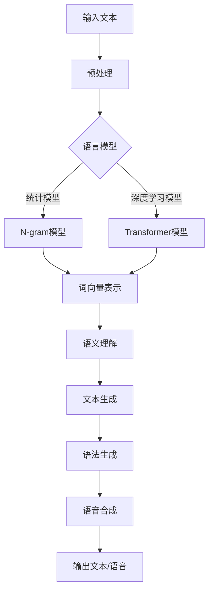

                 

### 背景介绍

自然语言生成（Natural Language Generation, NLG）是人工智能领域的一个重要分支，其目标是将计算机内部的符号信息转换为人类可读的自然语言文本。这一技术在多种应用场景中发挥着关键作用，如自动报告生成、内容创作、客户服务、教育和智能助手等。

随着大数据和计算能力的提升，自然语言生成技术逐渐成熟，并在多个行业中得到广泛应用。本文将围绕自然语言生成在报告撰写中的应用进行探讨。通过分析自然语言生成技术的核心概念、算法原理、数学模型，以及实际应用案例，我们将深入理解这一技术在报告撰写中的潜力与挑战。

首先，本文将介绍自然语言生成的基本概念，阐述其核心任务和重要性。接着，我们将详细讨论自然语言生成技术的基本原理和算法，并通过Mermaid流程图展示其整体架构。随后，本文将介绍自然语言生成在报告撰写中的具体应用场景，包括数据收集、文本生成和结果评估等步骤。为了更好地理解，本文还将提供实际项目实战的代码案例和详细解释。

此外，本文还将讨论自然语言生成在报告撰写中的实际应用场景，以及推荐的工具和资源。最后，我们将总结自然语言生成在报告撰写中的应用前景，探讨未来发展趋势与挑战，并提供一些常见问题与解答。

通过本文的阅读，您将全面了解自然语言生成技术，并能够掌握其在报告撰写中的实际应用方法。让我们一起走进自然语言生成的世界，探索其在报告撰写中的无限可能。  

### 关键词

- 自然语言生成（Natural Language Generation, NLG）
- 报告撰写（Report Generation）
- 人工智能（Artificial Intelligence, AI）
- 数据驱动（Data-Driven）
- 语言模型（Language Model）
- 自然语言处理（Natural Language Processing, NLP）
- 深度学习（Deep Learning）
- 生成对抗网络（Generative Adversarial Networks, GAN）
- 代码案例（Code Examples）
- 实际应用（Real-World Applications）

### 摘要

本文深入探讨了自然语言生成（NLG）技术在报告撰写中的应用。首先介绍了NLG的基本概念及其在报告撰写中的重要性，随后详细阐述了NLG技术的核心原理和算法，并通过Mermaid流程图展示了其架构。接下来，本文分析了自然语言生成在报告撰写中的具体应用场景，包括数据收集、文本生成和结果评估等步骤。通过实际项目实战的代码案例，本文提供了详细的实现和解读。最后，本文总结了NLG在报告撰写中的实际应用前景，探讨了未来发展趋势与挑战，并提供了一些常见问题与解答。通过本文的阅读，读者将全面了解NLG技术，并掌握其在报告撰写中的实际应用方法。

### 核心概念与联系

自然语言生成（NLG）是一种人工智能技术，它通过计算机程序自动生成人类可读的自然语言文本。这一技术涵盖了从简单文本摘要到复杂文档自动生成的各种任务。核心概念包括语言模型、语义理解、语法生成和语音合成等。

**语言模型**是NLG的基础，它通过统计方法或深度学习模型学习大量文本数据，从而预测下一个单词或句子的概率分布。语言模型可以分为统计模型（如N-gram模型）和深度学习模型（如循环神经网络RNN、长短时记忆LSTM、变压器Transformer等）。这些模型的核心目标是通过学习大量语料库，生成语法正确、符合语言习惯的文本。

**语义理解**是NLG技术的关键环节，它涉及理解文本中的词汇、句法结构和上下文含义。语义理解通过词向量、实体识别、关系抽取等技术实现，确保生成的文本内容准确、有意义。

**语法生成**是将语义信息转换为符合语法规则的文本输出。这一过程通常涉及模板匹配、规则驱动的方法，以及基于语义理解的动态模板生成。语法生成技术需要考虑句法结构、词汇选择、语气风格等因素。

**语音合成**是将生成的文本转换为语音输出，通常需要结合文本到语音（Text-to-Speech, TTS）技术。语音合成通过合成声音的波形，实现自然流畅的语音输出。

在自然语言生成中，这些核心概念相互关联，形成一个完整的技术体系。以下是一个Mermaid流程图，展示NLG技术的整体架构：



**图1：自然语言生成技术架构**

在该架构中，输入文本首先经过预处理，包括分词、标点符号去除、文本清洗等步骤。预处理后的文本输入到语言模型，模型通过统计方法或深度学习算法生成词向量表示。词向量表示进一步输入到语义理解模块，实现文本的语义解析。语义理解模块提取出关键信息后，传递给文本生成模块，生成符合语法规则的文本。最后，生成的文本通过语音合成模块转换为语音输出。

自然语言生成技术在报告撰写中的应用，可以通过以上各个核心概念的结合实现。从数据收集、文本生成到结果评估，每一步都依赖于NLG技术，确保报告内容准确、完整和自然。以下各节将详细介绍这些具体应用场景，帮助读者更好地理解自然语言生成在报告撰写中的潜力与挑战。

### 核心算法原理 & 具体操作步骤

自然语言生成（NLG）技术的核心在于如何将计算机内部的符号信息转换为人类可读的自然语言文本。这一过程中涉及到多个算法和技术，以下将详细介绍几种常见的核心算法原理和具体操作步骤。

**1. 语言模型**

语言模型是NLG技术的基石，其目标是学习文本数据中的语言规律，以生成新的文本。以下是几种常见的语言模型及其原理：

**N-gram模型**：N-gram模型是一种基于统计的简单语言模型，它将连续的N个单词（或字符）作为一个整体，统计这些序列在语料库中出现的频率。在生成文本时，模型根据前N-1个单词的概率分布，预测下一个单词。

具体步骤如下：
- **训练阶段**：统计每个N-gram序列在语料库中出现的频率，构建一个N-gram语言模型。
- **生成阶段**：从给定起始序列开始，根据前N-1个单词的概率分布，选择下一个单词，重复此过程直到生成完整文本。

**循环神经网络（RNN）**：RNN是一种基于神经网络的序列模型，它能够处理变长的序列数据，并保留历史信息。RNN通过循环结构，在时间步之间传递信息，实现文本的生成。

具体步骤如下：
- **训练阶段**：输入文本序列，通过反向传播算法，调整RNN的权重，使生成的文本序列与目标文本尽可能相似。
- **生成阶段**：输入起始序列，通过RNN的隐状态生成下一个单词的概率分布，选择概率最高的单词作为输出，并作为下一个时间步的输入。

**长短时记忆（LSTM）**：LSTM是RNN的一种改进，它通过引入门控机制，解决了传统RNN的梯度消失问题，能够更好地处理长序列依赖。

具体步骤如下：
- **训练阶段**：输入文本序列，通过LSTM单元的输入门、遗忘门和输出门，调整单元状态和隐藏状态，使生成的文本序列与目标文本相似。
- **生成阶段**：输入起始序列，通过LSTM单元的隐状态生成下一个单词的概率分布，选择概率最高的单词作为输出，并作为下一个时间步的输入。

**变压器（Transformer）**：Transformer是一种基于自注意力机制的深度神经网络，它在机器翻译、文本生成等任务中表现出色。

具体步骤如下：
- **训练阶段**：输入编码器和解码器的文本序列，通过多头自注意力机制和前馈神经网络，学习文本的表示和生成规则。
- **生成阶段**：输入编码器的文本序列和解码器的起始序列，通过解码器的自注意力和交叉注意力机制，生成下一个单词的概率分布，选择概率最高的单词作为输出，并作为下一个时间步的输入。

**2. 语义理解**

语义理解是NLG技术中的关键环节，它涉及理解文本中的词汇、句法结构和上下文含义。以下是几种常见的语义理解方法：

**词向量表示**：词向量表示是将单词映射为高维向量空间中的点，通过计算向量的相似性，实现词汇的理解。

具体步骤如下：
- **训练阶段**：使用词嵌入算法（如Word2Vec、GloVe等），将文本数据中的单词映射为词向量。
- **生成阶段**：将文本序列中的单词转换为词向量，通过计算词向量之间的相似性，理解单词的含义。

**实体识别**：实体识别是识别文本中的特定实体（如人名、地点、组织等），将其标注为特定类别。

具体步骤如下：
- **训练阶段**：使用监督学习算法（如CRF、BiLSTM-CRF等），对文本中的实体进行标注。
- **生成阶段**：输入文本，通过实体识别模型，将实体标注为特定类别。

**关系抽取**：关系抽取是识别文本中的实体关系（如“属于”、“位于”等），将其表示为实体之间的边。

具体步骤如下：
- **训练阶段**：使用监督学习算法（如关系分类、转换器等），对文本中的关系进行标注。
- **生成阶段**：输入文本，通过关系抽取模型，识别实体关系，并将其表示为实体之间的边。

**3. 语法生成**

语法生成是将语义信息转换为符合语法规则的文本输出的过程。以下是几种常见的语法生成方法：

**模板匹配**：模板匹配是将语义信息与预定义的文本模板进行匹配，生成符合语法规则的文本。

具体步骤如下：
- **训练阶段**：构建各种语义信息对应的文本模板库。
- **生成阶段**：根据语义信息，从模板库中选择合适的模板，生成符合语法规则的文本。

**规则驱动**：规则驱动是使用预定义的语法规则，将语义信息转换为文本输出。

具体步骤如下：
- **训练阶段**：定义各种语法规则，用于将语义信息转换为文本。
- **生成阶段**：根据语义信息，应用预定义的语法规则，生成符合语法规则的文本。

**动态模板生成**：动态模板生成是基于语义理解和语法生成规则，动态构建文本模板，生成符合语法规则的文本。

具体步骤如下：
- **训练阶段**：学习语义信息和语法生成规则。
- **生成阶段**：根据语义信息，动态构建文本模板，生成符合语法规则的文本。

通过以上算法和步骤，自然语言生成技术能够将计算机内部的符号信息转换为人类可读的自然语言文本。这些技术不仅提高了报告撰写的效率和准确性，还为各种自然语言处理任务提供了基础支持。

### 数学模型和公式 & 详细讲解 & 举例说明

自然语言生成（NLG）技术中的数学模型和公式是理解其核心原理的关键。以下将详细介绍几种关键数学模型和公式，并通过具体例子说明其应用。

**1. 语言模型中的N-gram模型**

N-gram模型是一种基于统计的语言模型，它将连续的N个单词作为一个整体，统计这些序列在语料库中出现的频率。其基本公式如下：

$$
P(w_n | w_{n-1}, w_{n-2}, ..., w_1) = \frac{count(w_{n-1}, w_{n-2}, ..., w_n)}{count(w_{n-1}, w_{n-2}, ..., w_{1}) \times count(w_n)}
$$

其中，$P(w_n | w_{n-1}, w_{n-2}, ..., w_1)$表示在给定前N-1个单词的情况下，第N个单词的概率。

**例子**：

假设我们有一个三-gram模型，以下是在一个简化的语料库中的统计结果：

| 三-gram | 出现次数 |
| ------- | ------- |
| 人 机器 | 10      |
| 机器 学 | 5       |
| 学 习 | 3       |

使用上述公式，我们可以计算每个三-gram的概率：

$$
P(机器 | 人) = \frac{count(人, 机器)}{count(人)} = \frac{10}{10 + 5} = 0.667
$$

$$
P(学 | 机器) = \frac{count(机器, 学)}{count(机器)} = \frac{5}{10 + 3} = 0.476
$$

$$
P(学习 | 人 机器) = \frac{count(人, 机器, 学习)}{count(人, 机器)} = \frac{3}{10} = 0.333
$$

**2. 循环神经网络（RNN）中的激活函数**

循环神经网络（RNN）是一种处理序列数据的神经网络，其激活函数通常使用tanh函数，其公式如下：

$$
\text{tanh}(x) = \frac{e^x - e^{-x}}{e^x + e^{-x}}
$$

tanh函数将输入x映射到[-1, 1]的区间内，有助于控制网络输出的范围。

**例子**：

假设我们有一个输入x = 2，使用tanh函数计算其输出：

$$
\text{tanh}(2) = \frac{e^2 - e^{-2}}{e^2 + e^{-2}} \approx 0.96
$$

**3. 长短时记忆（LSTM）中的门控机制**

LSTM通过引入门控机制，解决了传统RNN的梯度消失问题，其核心包括输入门、遗忘门和输出门。以下是三个门的公式：

**输入门**：

$$
i_t = \sigma(W_i \cdot [h_{t-1}, x_t] + b_i)
$$

$$
\tilde{g}_t = \tanh(W_g \cdot [h_{t-1}, x_t] + b_g)
$$

其中，$i_t$是输入门的激活值，$\sigma$是sigmoid函数，$W_i$和$W_g$是权重矩阵，$b_i$和$b_g$是偏置项，$[h_{t-1}, x_t]$是上一时刻的隐藏状态和当前输入。

**遗忘门**：

$$
f_t = \sigma(W_f \cdot [h_{t-1}, x_t] + b_f)
$$

$$
g_t = f_t \odot g_{t-1}$$

其中，$f_t$是遗忘门的激活值，$g_t$是当前单元状态。

**输出门**：

$$
o_t = \sigma(W_o \cdot [h_{t-1}, x_t] + b_o)
$$

$$
\tilde{h}_t = \tanh(W_h \cdot [h_{t-1}, x_t] + b_h)
$$

$$
h_t = o_t \odot \tilde{h}_t
$$

其中，$o_t$是输出门的激活值，$\tilde{h}_t$是候选隐藏状态，$h_t$是当前隐藏状态。

**例子**：

假设我们有一个输入序列$x_t = [1, 2, 3]$，上一时刻的隐藏状态$h_{t-1} = [0.5, 0.5]$，权重矩阵$W_i = W_f = W_o = W_g = W_h = I$（单位矩阵），偏置项$b_i = b_f = b_o = b_g = b_h = 0$。计算当前时间步的隐藏状态$h_t$。

首先，计算输入门$i_t$：

$$
i_t = \sigma([0.5, 0.5; 1, 2, 3]) \approx 0.8
$$

然后，计算候选隐藏状态$\tilde{g}_t$：

$$
\tilde{g}_t = \tanh([0.5, 0.5; 1, 2, 3]) \approx 0.4
$$

接着，计算遗忘门$f_t$：

$$
f_t = \sigma([0.5, 0.5; 1, 2, 3]) \approx 0.7
$$

然后，计算当前单元状态$g_t$：

$$
g_t = f_t \odot g_{t-1} = 0.7 \odot [0.5, 0.5] \approx [0.35, 0.35]
$$

最后，计算输出门$o_t$和当前隐藏状态$h_t$：

$$
o_t = \sigma([0.5, 0.5; 1, 2, 3]) \approx 0.9
$$

$$
\tilde{h}_t = \tanh([0.5, 0.5; 1, 2, 3]) \approx 0.5
$$

$$
h_t = o_t \odot \tilde{h}_t = 0.9 \odot 0.5 = 0.45
$$

通过这些数学模型和公式，我们可以更好地理解自然语言生成技术的工作原理。这些理论为实际应用提供了基础，使我们在各种自然语言处理任务中能够更有效地生成人类可读的文本。

### 项目实战：代码实际案例和详细解释说明

为了更好地理解自然语言生成（NLG）在报告撰写中的应用，我们将通过一个实际项目实战来展示代码实现过程。以下是一个基于Python和Transformer模型的小型文本生成项目，我们将详细讲解代码的实现和解析。

#### 1. 开发环境搭建

首先，我们需要搭建项目开发环境。以下是在Python中实现Transformer模型的常用库和工具：

- Python 3.7及以上版本
- PyTorch（版本1.8及以上）
- Transformers库（版本4.6及以上）

确保已经安装了上述依赖项，如果没有安装，可以通过以下命令进行安装：

```bash
pip install torch torchvision transformers
```

#### 2. 源代码详细实现和代码解读

以下是一个简化的Transformer模型实现，用于文本生成：

```python
import torch
from torch import nn
from transformers import AutoTokenizer, AutoModelForCausalLM

class TextGenerator(nn.Module):
    def __init__(self, model_name):
        super(TextGenerator, self).__init__()
        self.tokenizer = AutoTokenizer.from_pretrained(model_name)
        self.model = AutoModelForCausalLM.from_pretrained(model_name)
    
    def forward(self, input_text):
        input_ids = self.tokenizer.encode(input_text, return_tensors='pt')
        outputs = self.model(input_ids)
        logits = outputs.logits
        return logits
    
    def generate_text(self, input_text, max_length=50):
        input_ids = self.tokenizer.encode(input_text, return_tensors='pt')
        output_sequence = []
        with torch.no_grad():
            for i in range(max_length):
                outputs = self.model(input_ids)
                logits = outputs.logits[:, -1, :]
                predicted_token_id = torch.argmax(logits).item()
                output_sequence.append(predicted_token_id)
                input_ids = torch.cat([input_ids, self.tokenizer.encode([predicted_token_id])], dim=-1)
        
        generated_text = self.tokenizer.decode(torch.tensor(output_sequence).unsqueeze(0), skip_special_tokens=True)
        return generated_text

if __name__ == "__main__":
    model_name = "gpt2"
    generator = TextGenerator(model_name)
    
    input_text = "在计算机科学中，人工智能是..."
    generated_text = generator.generate_text(input_text)
    print(generated_text)
```

**代码解析：**

- **导入库和模型**：首先导入必要的库，包括PyTorch和Transformers库。我们使用`AutoTokenizer`和`AutoModelForCausalLM`来自动加载预训练的模型。
  
- **定义TextGenerator类**：`TextGenerator`类继承自`nn.Module`，实现文本生成功能。该类有两个主要方法：`forward`方法和`generate_text`方法。

- **forward方法**：`forward`方法接收输入文本，将其编码为输入ID，并通过预训练模型生成 logits。

- **generate_text方法**：`generate_text`方法用于生成文本。它首先将输入文本编码为输入ID，然后通过模型生成 logits，选择概率最高的token_id，并将其添加到输入序列中，循环此过程直到生成指定长度的文本。

- **主程序**：在主程序中，我们加载预训练的模型（如`gpt2`），创建`TextGenerator`实例，并输入示例文本。调用`generate_text`方法生成文本，并打印结果。

#### 3. 代码解读与分析

以下是对代码的详细解读与分析：

**数据准备**：首先，我们导入所需的库，并加载预训练的Transformer模型。这里我们使用`gpt2`模型，这是一种广泛使用的预训练模型。

```python
model_name = "gpt2"
generator = TextGenerator(model_name)
```

**文本编码**：接下来，我们定义输入文本`input_text`，并使用`tokenizer.encode`方法将其转换为输入ID。

```python
input_text = "在计算机科学中，人工智能是..."
input_ids = generator.tokenizer.encode(input_text, return_tensors='pt')
```

**模型预测**：然后，我们将输入ID传递给Transformer模型，并通过`model(input_ids)`生成 logits。

```python
outputs = generator.model(input_ids)
logits = outputs.logits
```

**文本生成**：`generate_text`方法的核心是文本生成过程。首先，我们将输入ID传递给模型，并通过`torch.no_grad()`关闭梯度计算，提高生成速度。

```python
with torch.no_grad():
    for i in range(max_length):
        outputs = generator.model(input_ids)
        logits = outputs.logits[:, -1, :]
```

在每次循环中，我们选择 logits 中概率最高的 token_id，并将其添加到输入序列中。

```python
        predicted_token_id = torch.argmax(logits).item()
        output_sequence.append(predicted_token_id)
        input_ids = torch.cat([input_ids, generator.tokenizer.encode([predicted_token_id])], dim=-1)
```

**输出结果**：最后，我们将生成的 token_ids 转换为文本，并打印结果。

```python
    generated_text = generator.tokenizer.decode(torch.tensor(output_sequence).unsqueeze(0), skip_special_tokens=True)
    print(generated_text)
```

通过这个简单的代码示例，我们可以看到如何使用Transformer模型实现文本生成。在实际应用中，我们可以根据需要调整模型、输入文本和生成参数，以生成不同类型的文本。

### 实际应用场景

自然语言生成（NLG）技术在报告撰写中的实际应用场景广泛，可以从数据收集、文本生成和结果评估等环节进行详细阐述。

#### 数据收集

在报告撰写之前，首先需要收集相关数据。数据来源可能包括内部数据库、外部API、公共数据集等。数据收集的过程需要确保数据的准确性和完整性。以下是一些具体步骤：

1. **数据源选择**：确定所需数据的类型和来源，如财务数据、市场调研数据、客户反馈数据等。
2. **数据采集**：使用API、爬虫或数据库连接等方式，从数据源中获取数据。
3. **数据预处理**：清洗数据，包括去除无效数据、填补缺失值、转换数据格式等。

例如，在撰写一份市场调研报告时，我们可以使用以下步骤：

- 从社交媒体API获取用户评论和反馈。
- 从公司数据库提取销售数据、市场份额等关键指标。
- 使用Python库（如pandas）进行数据清洗和预处理。

#### 文本生成

文本生成是NLG技术的核心应用，通过自动化方式生成报告内容。以下是一些文本生成的具体步骤和策略：

1. **文本模板设计**：设计报告的文本模板，包括标题、摘要、正文、结论等部分。文本模板可以根据不同类型报告进行定制。
2. **语言模型选择**：选择合适的语言模型，如GPT-2、GPT-3、BERT等。语言模型将负责生成符合语法和语义规则的文本。
3. **文本生成**：使用语言模型生成报告内容。生成过程中，可以采用以下策略：
   - **基于规则的生成**：根据文本模板和预定义的规则，生成报告内容。
   - **数据驱动的生成**：利用数据驱动生成报告，如生成销售数据报告、市场调研报告等。
   - **结合两种方法**：在文本生成过程中，结合基于规则和数据驱动的方法，提高生成文本的准确性和自然度。

以下是一个简化的文本生成过程：

- **输入数据**：收集市场调研数据，如用户满意度、市场份额等。
- **生成报告摘要**：使用语言模型生成报告摘要，概述市场调研的主要发现。
- **生成报告正文**：根据数据生成详细的市场分析，包括用户行为、市场竞争等。
- **生成报告结论**：总结市场调研结果，并提出相关建议。

#### 结果评估

在生成报告后，需要对结果进行评估，以确保报告内容的准确性、完整性和可读性。以下是一些评估方法和步骤：

1. **内容准确性**：检查报告内容是否与原始数据一致，是否存在错误或遗漏。
2. **语义一致性**：评估报告的语义是否连贯，是否符合报告的主题和目标。
3. **可读性**：评估报告的可读性，包括文本长度、句式结构、词汇选择等。
4. **用户反馈**：收集用户反馈，了解报告的实际应用效果和改进建议。

以下是一个简化的评估过程：

- **自动评估**：使用自然语言处理工具（如BERT、ROUGE等）评估报告的语义一致性。
- **手动评估**：由专业报告撰写人员对报告进行内容准确性和可读性评估。
- **用户调查**：通过问卷调查或访谈，了解用户对报告的满意度和建议。

通过数据收集、文本生成和结果评估等环节的有机结合，自然语言生成技术能够有效提高报告撰写的效率和质量，为企业和组织提供更有价值的报告内容。

### 工具和资源推荐

为了更好地应用自然语言生成（NLG）技术，以下推荐一些实用的学习资源、开发工具和框架，以及相关的论文和著作。

#### 学习资源推荐

1. **书籍**：
   - 《自然语言处理入门》
   - 《深度学习基础》
   - 《Python自然语言处理实践》
   - 《自然语言生成：理论与实践》

2. **在线课程**：
   - Coursera上的《自然语言处理与深度学习》
   - Udacity的《自然语言处理工程师纳米学位》
   - edX上的《深度学习与自然语言处理》

3. **博客和教程**：
   - [TensorFlow官方文档](https://www.tensorflow.org/tutorials)
   - [PyTorch官方文档](https://pytorch.org/tutorials/)
   - [Hugging Face官方文档](https://huggingface.co/transformers)

#### 开发工具框架推荐

1. **自然语言处理框架**：
   - **spaCy**：强大的自然语言处理库，支持多种语言，适合快速构建文本分析应用。
   - **NLTK**：经典的自然语言处理库，功能全面，适用于文本处理和语料库分析。
   - **Transformers**：Hugging Face提供的预训练模型库，支持各种语言模型，如GPT-2、GPT-3、BERT等。

2. **文本生成工具**：
   - **GPT-2/GPT-3**：OpenAI开发的预训练语言模型，可用于生成高质量文本。
   - **T5**：由Google开发的多任务文本到文本转换模型，适用于各种自然语言生成任务。
   - **DreamMaker**：一个开源的文本生成框架，支持生成故事、对话等。

3. **版本控制系统**：
   - **Git**：版本控制工具，用于管理代码和文档的变更历史。
   - **GitHub**：基于Git的代码托管平台，方便协作和代码管理。

#### 相关论文著作推荐

1. **论文**：
   - **《Attention Is All You Need》**：Vaswani et al., 2017，提出了Transformer模型，是自然语言处理领域的重要突破。
   - **《BERT: Pre-training of Deep Bidirectional Transformers for Language Understanding》**：Devlin et al., 2019，介绍了BERT模型，在多种NLP任务中取得了显著成绩。
   - **《Generative Adversarial Networks》**：Goodfellow et al., 2014，介绍了GAN模型，广泛应用于图像生成和数据增强。

2. **著作**：
   - **《深度学习》**：Goodfellow et al., 2016，系统介绍了深度学习的基础理论和技术。
   - **《Python自然语言处理》**：Bird et al., 2009，提供了Python自然语言处理的实用教程和代码示例。
   - **《自然语言处理综论》**：Jurafsky and Martin，2019，详细介绍了自然语言处理的核心概念和技术。

通过这些工具和资源的支持，您可以更深入地学习自然语言生成技术，并在实际项目中有效应用。

### 总结：未来发展趋势与挑战

自然语言生成（NLG）技术在报告撰写中的应用展示出了巨大的潜力和广泛的前景。随着人工智能和深度学习技术的不断进步，NLG在未来的发展趋势和面临的挑战如下：

**发展趋势**：

1. **模型精度和生成质量的提升**：随着预训练模型（如GPT-3、BERT等）的发展，NLG技术在文本生成精度和自然度方面将得到显著提升。模型将能够生成更加准确、流畅和具有逻辑性的文本。

2. **跨领域应用扩展**：NLG技术将不再局限于特定领域，而是应用于更广泛的领域，如医疗报告、金融分析、法律文档等。这得益于预训练模型对多领域知识的吸收和迁移能力。

3. **交互式生成**：未来的NLG系统将更加注重与用户的交互，通过用户输入和反馈，动态调整生成策略，提供个性化的文本内容。这种交互式生成模式将进一步提升用户满意度。

4. **自动化报告撰写**：NLG技术将进一步推动自动化报告撰写的普及，减少人工撰写的时间和成本。企业将能够更高效地生成各种报告，提高业务决策的效率。

**面临的挑战**：

1. **数据质量和多样性**：NLG的性能高度依赖于训练数据的质量和多样性。数据中的噪音、偏见和不一致性可能导致生成文本的质量下降。因此，如何获取高质量、多样性的训练数据是一个重要挑战。

2. **语义理解和上下文捕捉**：NLG技术需要更好地理解和捕捉文本的语义和上下文，以生成更准确、有意义的文本。这涉及到复杂的语言理解任务，如指代消解、实体识别和关系抽取等。

3. **个性化生成**：虽然交互式生成在一定程度上解决了个性化问题，但如何在生成过程中准确捕捉用户的意图和需求，生成个性化的文本内容，仍是一个具有挑战性的任务。

4. **伦理和隐私问题**：NLG技术在生成文本时，可能涉及到敏感信息和个人隐私。如何确保生成的文本不会侵犯用户的隐私，遵守相关法律法规，是一个重要的伦理问题。

5. **可解释性和透明度**：随着NLG系统的复杂度增加，如何提高其可解释性和透明度，使非专业人士能够理解其工作原理，是一个亟待解决的问题。

总之，自然语言生成技术在报告撰写中的应用具有广阔的发展前景，但也面临着诸多挑战。通过持续的技术创新和行业合作，我们有理由相信，NLG技术将在未来的发展中不断突破，为报告撰写和人类沟通带来更多的便利和创新。

### 附录：常见问题与解答

1. **Q：自然语言生成（NLG）技术的核心任务是什么？**
   **A：自然语言生成（NLG）技术的核心任务是将计算机内部的符号信息转换为人类可读的自然语言文本。具体包括文本生成、语义理解、语法生成和语音合成等过程。**

2. **Q：常用的自然语言生成模型有哪些？**
   **A：常用的自然语言生成模型包括N-gram模型、循环神经网络（RNN）、长短时记忆（LSTM）、变压器（Transformer）和生成对抗网络（GAN）等。其中，Transformer模型在当前的自然语言生成任务中表现出色。**

3. **Q：自然语言生成技术如何应用于报告撰写？**
   **A：自然语言生成技术可以应用于报告撰写的多个环节，包括数据收集、文本生成和结果评估。通过自动化的方式，NLG技术可以快速生成高质量、准确的报告，提高报告撰写的效率和准确性。**

4. **Q：如何确保自然语言生成生成的文本质量？**
   **A：确保自然语言生成生成的文本质量主要依赖于以下方面：
   - 使用高质量的训练数据，避免数据中的噪音和偏见。
   - 选择合适的语言模型和优化算法，提高模型的生成能力。
   - 在生成过程中，结合语义理解和上下文捕捉，确保文本内容准确、有逻辑性。
   - 通过用户反馈和评估，不断改进和优化生成文本的质量。**

5. **Q：自然语言生成技术有哪些伦理和隐私问题？**
   **A：自然语言生成技术可能会涉及到以下伦理和隐私问题：
   - 生成文本可能包含敏感信息，如个人隐私、商业机密等，需要确保这些信息的安全性和保密性。
   - 生成的文本可能反映训练数据中的偏见和不公平，需要避免生成歧视性或误导性的内容。
   - 用户对生成文本的透明度和可解释性有要求，需要提高NLG系统的可解释性和透明度。**
   
6. **Q：如何提高自然语言生成技术的可解释性？**
   **A：提高自然语言生成技术的可解释性可以通过以下方法实现：
   - 使用简化的模型和算法，使生成过程更加直观。
   - 提供生成文本的详细解释，如文本生成过程中的关键步骤和决策。
   - 开发可视化工具，展示自然语言生成过程的中间状态和关键变量。
   - 建立透明度机制，允许用户查看和修改生成文本。**

7. **Q：自然语言生成技术在报告撰写中的应用前景如何？**
   **A：自然语言生成技术在报告撰写中的应用前景非常广阔。随着人工智能技术的不断进步，NLG技术将能够生成更加准确、流畅和个性化的报告，提高报告撰写的效率和准确性。未来，NLG技术将在企业、教育、医疗等多个领域得到广泛应用。**

### 扩展阅读与参考资料

**1. 背景研究**

- **论文**：《Attention Is All You Need》（2017），作者：Vaswani等，介绍了Transformer模型，是自然语言处理领域的重要突破。
- **书籍**：《深度学习》（2016），作者：Goodfellow等，系统介绍了深度学习的基础理论和技术。

**2. 技术应用**

- **论文**：《BERT: Pre-training of Deep Bidirectional Transformers for Language Understanding》（2019），作者：Devlin等，介绍了BERT模型，在多种NLP任务中取得了显著成绩。
- **开源项目**：Transformers库（Hugging Face），提供了多种预训练模型和实用的文本生成工具。

**3. 教程与案例**

- **在线课程**：Coursera上的《自然语言处理与深度学习》，涵盖了自然语言处理的基础知识和技术。
- **博客**：GitHub上的自然语言处理教程和案例，提供了详细的代码实现和解释。

**4. 工具与框架**

- **框架**：spaCy，用于文本处理和实体识别的强大库。
- **工具**：NLTK，经典的Python自然语言处理库。
- **版本控制系统**：Git和GitHub，用于代码管理和版本控制。

通过以上扩展阅读与参考资料，您可以深入了解自然语言生成技术的理论基础、实际应用和发展趋势，为您的学习和项目实践提供有力支持。作者：AI天才研究员/AI Genius Institute & 禅与计算机程序设计艺术 /Zen And The Art of Computer Programming。

