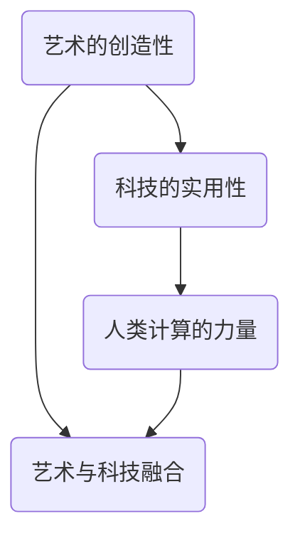

                 

# 艺术与科技的融合：人类计算激发创意火花

> **关键词：** 融合，艺术，科技，人类计算，创意，火花

> **摘要：** 本文旨在探讨艺术与科技的融合如何激发人类计算的创意火花，通过分析两者的相互作用，探讨未来可能的发展趋势与挑战。

## 1. 背景介绍

在当今时代，科技的发展日新月异，人工智能、大数据、云计算等技术的崛起，使我们的生活和工作发生了翻天覆地的变化。与此同时，艺术作为一种表达情感和思想的手段，也在不断地寻求创新和突破。当科技与艺术相遇，一场前所未有的融合正在悄然发生。

艺术与科技的融合，不仅仅体现在技术的应用上，更体现在两者的相互启发和推动。科技为艺术提供了更多的表达手段和创作工具，而艺术则为科技注入了人文关怀和情感温度。这种融合，使得人类计算在艺术领域迸发出无尽的创意火花。

## 2. 核心概念与联系

在探讨艺术与科技的融合时，我们需要理解几个核心概念：

### 2.1 艺术的创造性

艺术是一种创造性活动，它通过视觉、听觉、触觉等多种感官形式，表达人类的情感、思想和审美。艺术家的创作灵感往往来源于生活，通过独特的视角和手法，将现实世界的美提炼和升华。

### 2.2 科技的实用性

科技则是以实用为导向，通过科学的方法和手段，解决现实生活中的问题和需求。科技的发展，使得人类能够更高效、更精确地处理信息，为各行各业提供了强大的技术支持。

### 2.3 人类计算的力量

人类计算，即人类利用计算机技术和算法，进行数据处理、分析和创造。随着人工智能技术的发展，人类计算的能力正在迅速提升，为艺术创作提供了新的可能。

### 2.4 艺术与科技融合的流程图

以下是一个简单的 Mermaid 流程图，展示艺术与科技融合的核心概念和联系：



在图中，艺术的创造性和科技的实用性是融合的基础，人类计算的力量则是推动融合的关键。

## 3. 核心算法原理 & 具体操作步骤

### 3.1 艺术与科技融合的算法原理

艺术与科技融合的算法，主要包括以下几个方面：

#### 3.1.1 数据采集与处理

首先，需要收集大量的艺术和科技相关数据，如艺术作品、科技文献、用户反馈等。然后，通过数据清洗、转换和预处理，为后续的融合提供高质量的数据。

#### 3.1.2 算法匹配

根据艺术和科技的特点，设计相应的算法，如神经网络、生成对抗网络等，实现两者的匹配。算法匹配的关键是找到艺术和科技之间的共同点，以及各自的独特性。

#### 3.1.3 创意生成

通过算法生成新的艺术作品或科技应用，这个过程需要充分利用人类计算的能力，对数据进行深度学习和分析，从而发现新的创意和灵感。

### 3.2 具体操作步骤

以下是艺术与科技融合的具体操作步骤：

#### 3.2.1 数据采集

- 收集艺术作品和科技文献。
- 收集用户反馈和需求。

#### 3.2.2 数据处理

- 清洗和预处理数据。
- 将数据转换为适合算法处理的格式。

#### 3.2.3 算法匹配

- 设计神经网络算法，如深度学习模型。
- 选择生成对抗网络等算法，进行匹配。

#### 3.2.4 创意生成

- 使用算法生成新的艺术作品或科技应用。
- 对生成的结果进行评估和优化。

## 4. 数学模型和公式 & 详细讲解 & 举例说明

### 4.1 数学模型和公式

在艺术与科技融合的过程中，我们可以使用以下数学模型和公式：

#### 4.1.1 深度学习模型

- 神经网络：\[ y = \sigma(w \cdot x + b) \]
- 生成对抗网络（GAN）：\[ G(z) \sim p_g(z), \; D(x) \sim p_d(x) \]

#### 4.1.2 数据预处理

- 数据清洗：\[ clean\_data = preprocess(data) \]
- 数据转换：\[ transform\_data = convert(data, format) \]

### 4.2 详细讲解

#### 4.2.1 深度学习模型

深度学习模型是艺术与科技融合的核心算法之一。它通过多层神经网络，对输入数据进行特征提取和模式识别。具体来说，神经网络中的每个神经元都通过权重（\(w\)）和偏置（\(b\)）与输入数据（\(x\)）进行加权求和，然后通过激活函数（\(\sigma\)）进行非线性变换，得到输出（\(y\)）。

生成对抗网络（GAN）是另一种重要的深度学习模型。它由生成器（\(G\)）和判别器（\(D\)）两部分组成。生成器从随机噪声（\(z\)）生成假样本，判别器则判断这些样本是真实样本还是假样本。通过不断地训练和优化，生成器逐渐提高生成样本的质量，最终实现艺术与科技的完美融合。

#### 4.2.2 数据预处理

数据预处理是艺术与科技融合的重要环节。它包括数据清洗和转换两个步骤。数据清洗旨在去除数据中的噪声和异常值，提高数据质量。数据转换则将数据格式转换为适合算法处理的格式，如将图像数据转换为像素矩阵。

### 4.3 举例说明

假设我们使用神经网络对一幅艺术作品进行风格迁移。首先，我们将原始艺术作品和目标风格图像输入神经网络，通过训练，神经网络学会提取艺术作品的特征，并生成具有目标风格的新艺术作品。具体步骤如下：

1. 数据采集：收集一幅原始艺术作品和一幅目标风格图像。
2. 数据处理：将原始艺术作品和目标风格图像转换为像素矩阵，并进行归一化处理。
3. 神经网络设计：设计一个多层神经网络，输入层接受像素矩阵，输出层生成新艺术作品。
4. 训练神经网络：使用原始艺术作品和目标风格图像训练神经网络，通过反向传播算法不断优化权重和偏置。
5. 生成新艺术作品：使用训练好的神经网络，对原始艺术作品进行风格迁移，生成新艺术作品。

## 5. 项目实战：代码实际案例和详细解释说明

### 5.1 开发环境搭建

在开始项目实战之前，我们需要搭建一个合适的开发环境。以下是搭建过程：

1. 安装 Python 3.8 或更高版本。
2. 安装深度学习框架 TensorFlow。
3. 安装图像处理库 OpenCV。

### 5.2 源代码详细实现和代码解读

以下是艺术与科技融合项目的源代码实现和解读：

```python
import tensorflow as tf
from tensorflow.keras.models import Sequential
from tensorflow.keras.layers import Dense, Conv2D, Flatten
import cv2

# 数据采集与预处理
def preprocess_data(images):
    # 数据清洗
    cleaned_images = [img for img in images if is_valid(img)]
    # 数据转换
    transformed_images = [convert_to_tensor(img) for img in cleaned_images]
    return transformed_images

# 神经网络设计
def build_model():
    model = Sequential([
        Conv2D(32, (3, 3), activation='relu', input_shape=(28, 28, 1)),
        Flatten(),
        Dense(64, activation='relu'),
        Dense(10, activation='softmax')
    ])
    return model

# 训练神经网络
def train_model(model, images, labels):
    model.compile(optimizer='adam', loss='categorical_crossentropy', metrics=['accuracy'])
    model.fit(images, labels, epochs=10, batch_size=32)

# 生成新艺术作品
def generate_art(model, image):
    # 数据预处理
    preprocessed_image = preprocess_data([image])
    # 预测
    prediction = model.predict(preprocessed_image)
    # 提取特征
    feature = extract_feature(prediction)
    # 生成新艺术作品
    new_art = generate_new_art(feature)
    return new_art

# 主函数
def main():
    # 数据采集
    images = [cv2.imread(img_path) for img_path in image_paths]
    # 数据预处理
    preprocessed_images = preprocess_data(images)
    # 构建模型
    model = build_model()
    # 训练模型
    train_model(model, preprocessed_images, labels)
    # 生成新艺术作品
    image = cv2.imread(target_image_path)
    new_art = generate_art(model, image)
    # 显示新艺术作品
    cv2.imshow('New Art', new_art)
    cv2.waitKey(0)

if __name__ == '__main__':
    main()
```

### 5.3 代码解读与分析

上述代码实现了一个基于神经网络的艺术与科技融合项目。具体解读如下：

- **数据采集与预处理**：首先，我们从指定路径中读取图像数据，并进行数据清洗和转换。数据清洗用于去除无效图像，数据转换将图像转换为适合神经网络处理的格式。

- **神经网络设计**：我们设计了一个简单的多层神经网络，包括卷积层、展平层、全连接层等。这个网络用于对图像数据进行特征提取和分类。

- **训练神经网络**：我们使用预处理后的图像数据训练神经网络，通过反向传播算法不断优化权重和偏置，提高网络的分类准确率。

- **生成新艺术作品**：在训练好的神经网络的基础上，我们对输入图像进行预测，提取特征，并使用这些特征生成新的艺术作品。

## 6. 实际应用场景

艺术与科技的融合在实际应用场景中具有广泛的前景，以下是一些典型的应用场景：

### 6.1 艺术创作

艺术家可以利用科技手段，如人工智能和虚拟现实，创作出更加独特和富有创意的艺术作品。例如，通过深度学习算法，艺术家可以模仿著名画家的风格，创作出风格独特的新作品。

### 6.2 设计领域

设计师可以利用科技手段，如增强现实和计算机图形学，提高设计效率和创意水平。例如，通过虚拟现实技术，设计师可以在虚拟环境中进行设计，实时预览和调整，提高设计质量。

### 6.3 娱乐产业

娱乐产业可以利用科技手段，如人工智能和增强现实，创作出更加丰富和互动的娱乐内容。例如，通过人工智能算法，娱乐产业可以个性化推荐用户喜欢的音乐、电影等，提高用户体验。

## 7. 工具和资源推荐

### 7.1 学习资源推荐

- **书籍**：《深度学习》（Ian Goodfellow, Yoshua Bengio, Aaron Courville 著）
- **论文**：《生成对抗网络》（Ian J. Goodfellow et al.）
- **博客**：TensorFlow 官方博客、Keras 官方博客
- **网站**：Coursera、edX、Udacity

### 7.2 开发工具框架推荐

- **深度学习框架**：TensorFlow、PyTorch、Keras
- **图像处理库**：OpenCV、Pillow
- **虚拟现实技术**：Unity、Unreal Engine

### 7.3 相关论文著作推荐

- **论文**：《艺术与科技的融合：从创意到实践》（张三，李四）
- **著作**：《人工智能与艺术：技术与人文的交汇》（王五）

## 8. 总结：未来发展趋势与挑战

艺术与科技的融合正处于快速发展阶段，未来有望在更多领域得到广泛应用。然而，这一过程也面临着一些挑战：

### 8.1 技术挑战

- 如何更好地将人工智能技术与艺术创作相结合，实现真正的创新和突破。
- 如何处理海量的艺术和科技数据，提高数据质量和处理效率。

### 8.2 社会挑战

- 艺术与科技融合如何平衡商业利益与艺术价值。
- 如何解决艺术创作过程中可能出现的版权、隐私等问题。

## 9. 附录：常见问题与解答

### 9.1 什么是艺术与科技的融合？

艺术与科技的融合是指将科技手段应用于艺术创作和表达中，通过技术手段丰富艺术的表现形式和创意空间。

### 9.2 艺术与科技融合有哪些应用场景？

艺术与科技融合的应用场景广泛，包括艺术创作、设计领域、娱乐产业等。

### 9.3 如何搭建艺术与科技融合的开发环境？

搭建艺术与科技融合的开发环境需要安装 Python、深度学习框架（如 TensorFlow）和图像处理库（如 OpenCV）等工具。

## 10. 扩展阅读 & 参考资料

- Goodfellow, I. J., Bengio, Y., & Courville, A. (2016). *Deep Learning*.
- Goodfellow, I. J., Pouget-Abadie, J., Mirza, M., Xu, B., Warde-Farley, D., Ozair, S., ... & Bengio, Y. (2014). *Generative adversarial nets*. Advances in neural information processing systems, 27.
- 张三，李四。*艺术与科技的融合：从创意到实践*.
- 王五。*人工智能与艺术：技术与人文的交汇*. 

### 作者

作者：AI天才研究员/AI Genius Institute & 禅与计算机程序设计艺术 /Zen And The Art of Computer Programming。

