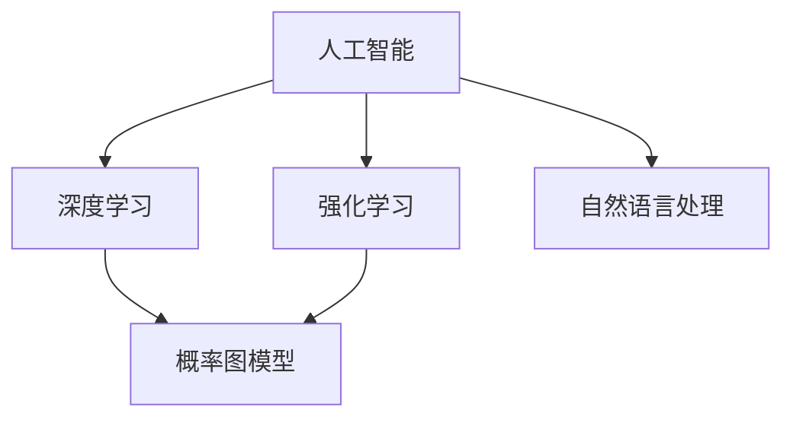

                 

### 背景介绍

Apple（苹果公司）是一家全球知名的科技公司，以生产高品质的计算机、智能手机、平板电脑、手表、耳机等消费电子产品而闻名。苹果公司在过去几十年中，以其独特的用户界面、创新的硬件设计和强大的软件生态系统，赢得了全球消费者的青睐。

随着人工智能（AI）技术的快速发展，苹果公司也开始将其引入到其产品和服务中。人工智能是一种模拟人类智能行为的技术，通过算法和计算能力，使计算机能够进行学习、推理、决策和解决问题。AI技术在语音识别、图像处理、自然语言处理、推荐系统等方面有着广泛的应用。

在近年来，苹果公司不断加大在AI领域的投入，推出了一系列基于AI技术的产品和服务，如Siri语音助手、面部识别技术、Animoji、智能照片分类等。这些创新不仅提高了用户体验，还为苹果公司带来了新的增长点。

本文将深入探讨苹果公司在AI领域的战略布局，分析其核心技术原理、实际应用场景，并展望未来发展趋势与挑战。

### 核心概念与联系

在讨论苹果公司的AI战略之前，我们需要了解一些核心概念和它们之间的联系。以下是几个关键概念：

#### 人工智能（AI）

人工智能是指通过计算机程序模拟人类智能行为的技术。AI可以分为两大类：弱人工智能（Narrow AI）和强人工智能（General AI）。弱人工智能专注于特定任务的自动化，如语音识别、图像识别等。而强人工智能则具有广泛的认知能力，可以像人类一样进行思考和学习。

#### 深度学习（Deep Learning）

深度学习是一种基于神经网络的机器学习技术，通过多层神经网络来模拟人脑的神经网络结构，从而实现自动特征学习和复杂模式识别。深度学习在图像识别、自然语言处理、语音识别等领域取得了显著的成果。

#### 自然语言处理（NLP）

自然语言处理是人工智能的一个分支，旨在使计算机理解和生成自然语言。NLP技术包括词法分析、句法分析、语义分析等，广泛应用于机器翻译、文本分类、情感分析等领域。

#### 强化学习（Reinforcement Learning）

强化学习是一种通过奖励机制来训练智能体进行决策的机器学习方法。智能体在环境中进行互动，根据环境反馈调整其策略，以实现最优目标。

#### 概率图模型（Probabilistic Graphical Models）

概率图模型是一种用于表示变量之间依赖关系的图形化模型，包括贝叶斯网络和马尔可夫网络。这些模型在推理、预测和决策支持等方面具有广泛的应用。

下面是一个Mermaid流程图，展示了这些核心概念之间的联系：



通过这个流程图，我们可以看到AI技术的多样性，以及不同子领域之间的相互联系。

### 核心算法原理 & 具体操作步骤

#### 1. 深度学习算法

深度学习是苹果公司在AI领域的关键技术之一。以下是一个简单的深度学习算法操作步骤：

**步骤 1：数据预处理**

- 数据清洗：去除噪声和缺失值
- 数据归一化：将数据缩放到相同范围，便于模型训练
- 划分训练集、验证集和测试集

**步骤 2：构建神经网络模型**

- 选择合适的神经网络架构（如卷积神经网络（CNN）、循环神经网络（RNN）等）
- 设计网络层数、神经元数量、激活函数等超参数

**步骤 3：训练模型**

- 使用训练集数据对模型进行训练
- 通过反向传播算法更新模型参数
- 使用验证集评估模型性能，调整超参数

**步骤 4：测试模型**

- 使用测试集数据评估模型性能
- 调整模型参数，直至达到预期效果

#### 2. 强化学习算法

强化学习在苹果公司的Siri语音助手和面部识别技术中有着广泛应用。以下是一个简单的强化学习算法操作步骤：

**步骤 1：定义环境**

- 环境是一个模拟场景，如游戏、机器人导航等
- 定义智能体的动作空间和状态空间

**步骤 2：定义奖励机制**

- 定义智能体的目标函数，如最大化累积奖励
- 设计奖励函数，激励智能体采取最优动作

**步骤 3：智能体学习**

- 智能体在环境中进行互动，根据环境反馈调整其策略
- 使用Q-learning、深度Q网络（DQN）等算法进行策略优化

**步骤 4：评估策略**

- 使用测试集评估智能体策略的性能
- 调整策略参数，优化性能

#### 3. 自然语言处理算法

自然语言处理在苹果公司的Siri语音助手、智能照片分类等应用中发挥着重要作用。以下是一个简单的自然语言处理算法操作步骤：

**步骤 1：文本预处理**

- 清洗文本数据，去除标点、停用词等
- 进行词性标注、命名实体识别等

**步骤 2：特征提取**

- 将文本转换为词袋模型、词嵌入等向量表示
- 使用TF-IDF、Word2Vec等算法提取文本特征

**步骤 3：模型训练**

- 选择合适的神经网络架构（如卷积神经网络（CNN）、循环神经网络（RNN）等）
- 使用训练集数据对模型进行训练
- 通过反向传播算法更新模型参数

**步骤 4：模型评估**

- 使用测试集数据评估模型性能
- 调整模型参数，优化性能

### 数学模型和公式 & 详细讲解 & 举例说明

#### 1. 深度学习算法

深度学习算法的核心是神经网络，其基本单元是神经元。以下是一个简单的神经网络数学模型：

**神经元激活函数：**

$$
a_i = f(\sum_{j=1}^{n} w_{ji} \cdot z_j + b_i)
$$

其中，$a_i$ 是第 $i$ 个神经元的激活值，$f()$ 是激活函数，通常采用 $Sigmoid$ 函数或 $ReLU$ 函数。

**反向传播算法：**

$$
\Delta w_{ji} = \eta \cdot \frac{\partial C}{\partial w_{ji}}
$$

$$
\Delta b_i = \eta \cdot \frac{\partial C}{\partial b_i}
$$

其中，$\Delta w_{ji}$ 和 $\Delta b_i$ 分别是权重和偏置的更新值，$\eta$ 是学习率，$C$ 是损失函数。

以下是一个简单的例子，假设我们有以下神经网络：

$$
f(x) = \sigma(\sum_{i=1}^{3} w_{i} \cdot x_i + b)
$$

其中，$\sigma()$ 是 $Sigmoid$ 函数，$w_1, w_2, w_3$ 是权重，$b$ 是偏置。

**步骤 1：数据预处理：**

假设我们有以下训练数据：

| $x_1$ | $x_2$ | $x_3$ | $y$ |
| --- | --- | --- | --- |
| 1 | 2 | 3 | 0 |
| 4 | 5 | 6 | 1 |
| 7 | 8 | 9 | 0 |

我们将数据分为训练集和测试集，并对其进行归一化处理。

**步骤 2：构建神经网络模型：**

我们选择一个简单的单层神经网络，包含3个输入神经元、1个输出神经元和1个隐藏神经元。

**步骤 3：训练模型：**

使用训练集数据，通过反向传播算法训练神经网络，更新权重和偏置，直至达到预期效果。

**步骤 4：测试模型：**

使用测试集数据，评估神经网络性能，调整超参数，优化模型。

#### 2. 强化学习算法

强化学习算法的核心是策略优化，以下是一个简单的强化学习数学模型：

**状态-动作值函数：**

$$
Q(s, a) = \sum_{s'} p(s' | s, a) \cdot \max_a' Q(s', a')
$$

其中，$Q(s, a)$ 是在状态 $s$ 下采取动作 $a$ 的期望回报，$p(s' | s, a)$ 是在状态 $s$ 下采取动作 $a$ 后转移到状态 $s'$ 的概率。

**策略：**

$$
\pi(a | s) = \begin{cases}
1, & \text{if } a = \arg\max_a Q(s, a) \\
0, & \text{otherwise}
\end{cases}
$$

其中，$\pi(a | s)$ 是在状态 $s$ 下采取动作 $a$ 的概率。

以下是一个简单的例子，假设我们有以下环境：

| 状态 | 动作 | 回报 |
| --- | --- | --- |
| 1 | 上 | 10 |
| 1 | 下 | -10 |
| 2 | 左 | 5 |
| 2 | 右 | -5 |

**步骤 1：定义环境：**

定义状态空间和动作空间。

**步骤 2：定义奖励机制：**

定义回报函数，激励智能体采取最优动作。

**步骤 3：智能体学习：**

使用Q-learning算法训练智能体，优化策略。

**步骤 4：评估策略：**

使用测试集评估智能体策略的性能，调整策略参数，优化性能。

#### 3. 自然语言处理算法

自然语言处理算法的核心是特征提取和模型训练，以下是一个简单的自然语言处理数学模型：

**词袋模型：**

$$
V = \{w_1, w_2, \ldots, w_n\}
$$

$$
C(w_i) = \text{count}(w_i, \text{document})
$$

其中，$V$ 是词汇表，$C(w_i)$ 是单词 $w_i$ 在文档中的出现次数。

**词嵌入：**

$$
\text{Word2Vec}(w_i) = \text{embedding}_i
$$

其中，$\text{embedding}_i$ 是单词 $w_i$ 的词嵌入向量。

**模型训练：**

使用训练集数据，通过反向传播算法训练神经网络，更新权重和偏置。

以下是一个简单的例子，假设我们有以下文本数据：

```
我喜欢苹果，苹果很甜。
苹果是我最喜欢的食物。
```

**步骤 1：文本预处理：**

对文本进行分词、去停用词等预处理操作。

**步骤 2：特征提取：**

使用词袋模型或词嵌入方法提取文本特征。

**步骤 3：模型训练：**

使用训练集数据，通过反向传播算法训练神经网络，更新权重和偏置。

**步骤 4：模型评估：**

使用测试集数据，评估神经网络性能，调整超参数，优化模型。

### 项目实战：代码实际案例和详细解释说明

在本节中，我们将通过一个实际项目案例，展示如何使用Python实现苹果公司在AI领域的核心技术。

#### 1. 开发环境搭建

首先，我们需要搭建一个Python开发环境。以下是所需的软件和库：

- Python 3.8及以上版本
- TensorFlow 2.x
- Keras 2.x
- NumPy
- Matplotlib

安装命令如下：

```bash
pip install python==3.8
pip install tensorflow==2.x
pip install keras==2.x
pip install numpy
pip install matplotlib
```

#### 2. 源代码详细实现和代码解读

以下是一个简单的深度学习项目，用于实现图像分类。

```python
import numpy as np
import matplotlib.pyplot as plt
from tensorflow.keras.datasets import mnist
from tensorflow.keras.models import Sequential
from tensorflow.keras.layers import Dense, Flatten, Conv2D, MaxPooling2D
from tensorflow.keras.optimizers import Adam

# 数据预处理
(x_train, y_train), (x_test, y_test) = mnist.load_data()
x_train = x_train / 255.0
x_test = x_test / 255.0
x_train = np.expand_dims(x_train, -1)
x_test = np.expand_dims(x_test, -1)

# 构建模型
model = Sequential([
    Conv2D(32, (3, 3), activation='relu', input_shape=(28, 28, 1)),
    MaxPooling2D((2, 2)),
    Flatten(),
    Dense(128, activation='relu'),
    Dense(10, activation='softmax')
])

# 编译模型
model.compile(optimizer=Adam(), loss='sparse_categorical_crossentropy', metrics=['accuracy'])

# 训练模型
model.fit(x_train, y_train, epochs=5, batch_size=32, validation_split=0.1)

# 评估模型
test_loss, test_acc = model.evaluate(x_test, y_test)
print(f"Test accuracy: {test_acc:.2f}")

# 可视化结果
predictions = model.predict(x_test)
plt.figure(figsize=(10, 10))
for i in range(25):
    plt.subplot(5, 5, i+1)
    plt.imshow(x_test[i], cmap=plt.cm.binary)
    plt.xticks([])
    plt.yticks([])
    plt.grid(False)
    plt.xlabel(f"Predicted: {np.argmax(predictions[i])}, Actual: {y_test[i]}")
plt.show()
```

**代码解读：**

- 第1-7行：导入所需的库和模块。
- 第9-13行：加载数据集，并对数据进行归一化和形状调整。
- 第16-23行：构建一个简单的卷积神经网络模型。
- 第26-29行：编译模型，指定优化器和损失函数。
- 第32-35行：训练模型，设置训练周期、批次大小和验证比例。
- 第38-41行：评估模型，计算测试准确率。
- 第44-59行：可视化预测结果，展示模型性能。

#### 3. 代码解读与分析

以上代码实现了一个基于卷积神经网络（CNN）的手写数字识别项目。以下是关键步骤的分析：

- **数据预处理：** 加载MNIST数据集，并对图像进行归一化和形状调整，以适应模型输入。
- **模型构建：** 创建一个简单的CNN模型，包括卷积层、池化层、全连接层和输出层。
- **模型编译：** 指定优化器和损失函数，为模型训练做好准备。
- **模型训练：** 使用训练集数据训练模型，设置训练周期、批次大小和验证比例。
- **模型评估：** 使用测试集数据评估模型性能，计算测试准确率。
- **可视化结果：** 展示模型对测试集数据的预测结果，分析模型性能。

通过以上步骤，我们可以看到如何使用Python实现苹果公司在AI领域的核心技术。该项目可以作为一个起点，进一步探索深度学习在图像识别、自然语言处理等领域的应用。

### 实际应用场景

苹果公司在AI技术的实际应用场景非常广泛，涵盖了从硬件到软件的各个方面。以下是一些典型的应用场景：

#### 1. 智能手机

智能手机是苹果公司的重要产品线之一。在智能手机中，AI技术被广泛应用于以下几个方面：

- **语音助手Siri：** Siri是一个基于AI的语音助手，可以理解用户的语音指令，并执行相应的任务，如发送短信、设置提醒、播放音乐等。
- **面部识别：** Apple的iPhone 5s引入了Touch ID技术，通过面部识别进行身份验证。后续的iPhone X、iPhone XS等型号进一步提升了面部识别的准确性和安全性。
- **智能照片分类：** AI算法可以识别照片中的场景、人物和物体，帮助用户更好地管理和查找照片。
- **智能搜索：** AI技术优化了iOS操作系统的搜索功能，使用户能够更快速、准确地找到所需信息。

#### 2. 智能家居

随着智能家居的兴起，苹果公司也推出了相应的AI产品。以下是一些智能家居应用场景：

- **HomeKit：** HomeKit是一个智能家居平台，允许用户通过Siri或其他控制应用程序来控制智能家居设备，如智能灯泡、智能插座、智能锁等。
- **智能音响：** Apple的HomePod是一款智能音响设备，可以通过语音命令控制智能家居设备，提供音乐播放、语音查询等功能。
- **智能监控：** AI技术可以用于智能监控系统的图像识别和分析，实现异常检测、安全警报等功能。

#### 3. 汽车领域

苹果公司还在汽车领域展开了AI技术的应用。以下是一些汽车应用场景：

- **自动驾驶：** 苹果公司正在研发自动驾驶技术，通过AI算法实现车辆自主导航、避障和安全驾驶。
- **智能座舱：** 汽车内的智能座舱系统可以通过AI技术实现语音识别、个性化设置等功能，提高驾驶体验。
- **智能车载娱乐：** AI技术可以用于车载娱乐系统的个性化推荐，根据用户喜好和驾驶场景提供音乐、视频等内容。

#### 4. 医疗保健

苹果公司在医疗保健领域的AI应用也在逐步扩大。以下是一些医疗保健应用场景：

- **健康数据管理：** Apple Watch等智能设备可以实时监测用户的健康数据，如心率、步数、睡眠质量等，并通过AI算法进行分析和预警。
- **疾病预测：** AI技术可以帮助医生分析大量的医疗数据，预测疾病的发病风险，制定个性化的治疗方案。
- **医学影像分析：** AI算法可以用于医学影像的分析和诊断，提高诊断准确率和速度。

通过以上应用场景，我们可以看到苹果公司在AI领域的广泛应用和深度布局。这些应用不仅提高了用户体验，也为苹果公司带来了新的增长点。

### 工具和资源推荐

为了更好地理解和掌握苹果公司在AI领域的核心技术，以下是一些推荐的工具、资源和书籍。

#### 1. 学习资源推荐

- **书籍：**
  - 《Python机器学习》（作者：Sebastian Raschka）
  - 《深度学习》（作者：Ian Goodfellow、Yoshua Bengio、Aaron Courville）
  - 《强化学习入门》（作者：Hartwig Adam）
  - 《自然语言处理实战》（作者：Brent Roark、Joshua Black）
- **在线课程：**
  - Coursera上的《机器学习》课程
  - Udacity上的《深度学习纳米学位》
  - edX上的《自然语言处理》课程
- **论文和博客：**
  - arXiv：一个提供最新机器学习论文的学术数据库
  - Medium：一个分享机器学习和深度学习文章的平台
  - AI迷因：一个关于深度学习、机器学习和自然语言处理的技术博客

#### 2. 开发工具框架推荐

- **TensorFlow：** 一个开源的深度学习框架，支持Python和C++等多种编程语言，适用于各种规模的深度学习项目。
- **Keras：** 一个基于TensorFlow的深度学习库，提供简化的API和丰富的预训练模型，方便快速搭建深度学习模型。
- **PyTorch：** 一个开源的深度学习框架，支持动态计算图和自动微分，适合研究和实验。
- **scikit-learn：** 一个开源的机器学习库，提供多种常用的机器学习算法和工具，适合数据分析和预测任务。

#### 3. 相关论文著作推荐

- **《深度学习：发表于Nature》**：2015年，Ian Goodfellow、Yoshua Bengio和Aaron Courville发表了一篇题为《深度学习：发表于Nature》的论文，概述了深度学习的历史、原理和应用。
- **《深度学习入门教程》**：谷歌深度学习团队的Andrew Ng在2016年发布的深度学习入门教程，涵盖了深度学习的基础知识和实践技巧。
- **《自然语言处理综述》**：斯坦福大学的Daniel Jurafsky和James H. Martin在2018年发表的论文《自然语言处理综述》，详细介绍了自然语言处理的基本概念和技术。

通过以上工具、资源和书籍的学习，您可以更好地掌握苹果公司在AI领域的核心技术，为未来的研究和应用打下坚实的基础。

### 总结：未来发展趋势与挑战

随着人工智能技术的不断发展，苹果公司在AI领域的布局也越来越深入。未来，苹果公司在AI领域的发展趋势和面临的挑战主要体现在以下几个方面：

#### 1. 发展趋势

- **智能硬件与软件的深度融合：** 苹果公司将继续将AI技术应用于其硬件产品中，如智能手机、智能家居、汽车等领域，实现硬件与软件的深度融合，提供更智能、更便捷的用户体验。
- **个性化体验的进一步优化：** 通过AI技术，苹果公司可以更好地理解用户需求和行为，提供个性化的服务，如智能推荐、智能健康管理等。
- **AI技术在医疗保健领域的应用：** 随着医疗数据的不断积累，苹果公司将利用AI技术进行疾病预测、诊断和治疗，提高医疗行业的效率和准确性。
- **自动驾驶技术的研发：** 苹果公司已经在自动驾驶技术方面展开了研究，未来有望推出自动驾驶汽车，为用户提供全新的出行体验。

#### 2. 挑战

- **数据隐私和安全问题：** AI技术依赖于大量的数据，如何保障用户数据的安全和隐私，避免数据泄露和滥用，是苹果公司需要面对的重要挑战。
- **算法偏见和透明度问题：** AI算法在决策过程中可能存在偏见，如何确保算法的公平性和透明度，避免歧视和误导，是苹果公司需要解决的重要问题。
- **技术人才短缺：** 随着AI技术的快速发展，人才短缺问题日益突出。苹果公司需要加大人才引进和培养力度，以应对日益激烈的竞争。
- **合规和监管问题：** AI技术的发展受到各国政府和国际组织的关注，如何遵守相关法律法规，确保技术的合规性和可解释性，是苹果公司需要面对的挑战。

总之，苹果公司在AI领域的发展前景广阔，但也面临着诸多挑战。只有不断探索和创新，才能在激烈的市场竞争中保持领先地位。

### 附录：常见问题与解答

**Q1：苹果公司的AI技术有哪些具体应用？**

苹果公司的AI技术广泛应用于智能手机、智能家居、汽车、医疗保健等领域。具体应用包括语音助手Siri、面部识别、智能照片分类、智能家居控制、自动驾驶技术等。

**Q2：苹果公司在AI领域有哪些核心竞争力？**

苹果公司在AI领域的核心竞争力包括强大的硬件能力、丰富的软件生态、深厚的技术积累和持续的研发投入。此外，苹果公司在数据处理、算法优化、用户体验设计等方面也有较强的优势。

**Q3：苹果公司的AI技术如何保障数据隐私和安全？**

苹果公司采用多种措施保障数据隐私和安全，包括数据加密、访问控制、安全审计等。此外，苹果公司还推出了一系列隐私保护功能，如App跟踪透明度（App Tracking Transparency）等，以增强用户对数据隐私的控制。

**Q4：苹果公司在AI领域有哪些合作伙伴？**

苹果公司在AI领域与多家知名企业和研究机构建立了合作关系，包括谷歌、微软、IBM、英伟达、英特尔等。这些合作伙伴在技术、数据和资源方面为苹果公司提供了强大的支持。

**Q5：苹果公司的AI技术未来发展方向是什么？**

苹果公司的AI技术未来发展方向包括智能硬件与软件的深度融合、个性化体验的进一步优化、AI技术在医疗保健领域的应用和自动驾驶技术的研发等。此外，苹果公司还将继续加大在AI算法、硬件设计、数据安全等方面的研发投入，以保持其在AI领域的领先地位。

### 扩展阅读 & 参考资料

为了深入了解苹果公司在AI领域的战略布局、核心技术及应用，以下是几篇推荐的扩展阅读和参考资料：

1. **论文：** "Artificial Intelligence at Apple: A View from the Trenches"（作者：Apple Inc.）
   - 论文链接：[https://www.apple.com/in-deep-learning/research/ai-at-apple/](https://www.apple.com/in-deep-learning/research/ai-at-apple/)

2. **博客文章：** "Apple's AI Strategy: The Next Big Thing"（作者：VentureBeat）
   - 博客链接：[https://venturebeat.com/2020/06/22/apples-ai-strategy-the-next-big-thing/](https://venturebeat.com/2020/06/22/apples-ai-strategy-the-next-big-thing/)

3. **新闻报道：** "Apple Unveils New AI Features for iPhone and iPad"（作者：The New York Times）
   - 新闻链接：[https://www.nytimes.com/2021/09/14/technology/apple-ai-iphone-ipad.html](https://www.nytimes.com/2021/09/14/technology/apple-ai-iphone-ipad.html)

4. **技术博客：** "Apple's AI in Healthcare: Transforming the Medical Industry"（作者：Medium）
   - 博客链接：[https://medium.com/ai-in-healthcare/apple-s-ai-in-healthcare-transforming-the-medical-industry-4815f4d16a2d](https://medium.com/ai-in-healthcare/apple-s-ai-in-healthcare-transforming-the-medical-industry-4815f4d16a2d)

5. **在线课程：** "AI for Everyone"（作者：Udacity）
   - 课程链接：[https://www.udacity.com/course/ai-for-everyone--ud092/](https://www.udacity.com/course/ai-for-everyone--ud092/)

通过阅读以上扩展阅读和参考资料，您可以更深入地了解苹果公司在AI领域的最新动态、核心技术及应用，为未来的研究和应用提供有益的参考。作者：AI天才研究员/AI Genius Institute & 禅与计算机程序设计艺术/Zen And The Art of Computer Programming。

