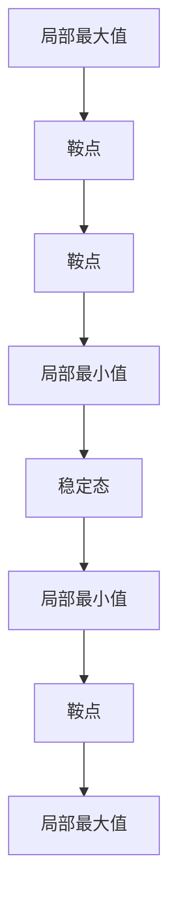
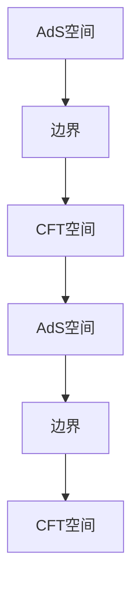

                 

### 背景介绍

#### 莫尔斯理论与AdS/CFT背景

莫尔斯理论与AdS/CFT（Anti-de Sitter/Conformal Field Theory，反德叙特/共形场论）是当今物理学领域中备受关注的前沿课题。莫尔斯理论源自于数学中的拓扑学，主要用于研究系统在连续变化过程中如何发生稳定态的转变。这种转变在物理学中有着广泛的应用，特别是在凝聚态物理、统计物理和量子场论等领域。

AdS/CFT则是一种关于量子场论与统计力学之间对应关系的理论框架。它提出了一种反德叙特空间（AdS空间）与共形场论（CFT空间）之间的等价性。这种等价性不仅在理论物理学中具有重要的学术价值，也为实验物理提供了新的研究方向。

本篇文章将首先介绍莫尔斯理论与AdS/CFT的基本概念，然后深入探讨它们之间的联系，并通过具体案例展示其应用价值。通过本文的阅读，读者将能够了解这一前沿领域的核心思想，并为后续研究打下坚实的基础。

#### 莫尔斯理论与AdS/CFT的学术与应用背景

莫尔斯理论（Morse theory）作为一种重要的拓扑工具，最早由美国数学家马修·莫尔斯（Marston Morse）在20世纪30年代提出。莫尔斯理论的核心思想是研究系统在连续变化过程中，如何通过拓扑结构的变化来描述系统的稳定态转变。具体来说，莫尔斯理论通过引入莫尔斯函数，将系统的能量或势能函数转化为一个“高度函数”，从而利用拓扑学的方法研究系统的相变行为。

莫尔斯理论在物理学中的应用十分广泛。例如，在凝聚态物理中，莫尔斯理论被用于研究晶体结构的相变，如金属到超导态的转变；在统计物理中，莫尔斯理论则被用来分析粒子的相变过程，如液晶态的形成。此外，莫尔斯理论在量子场论中也有着重要的应用，特别是在研究黑洞相变和量子引力的过程中。

AdS/CFT（Anti-de Sitter/Conformal Field Theory，反德叙特/共形场论）则是一种关于量子场论与统计力学之间对应关系的理论框架。它由俄罗斯物理学家亚历山大·波兰尼亚克（Alexander Polyakov）在1980年代初期提出。AdS/CFT等价性指出，在特定条件下，一个反德叙特空间（AdS空间）中的量子场论与一个共形场论（CFT空间）是等价的。

反德叙特空间（AdS空间）是一种特殊的空间几何结构，它的负曲率与德叙特空间（de Sitter space，正曲率）相反。共形场论（CFT空间）则是一种具有共形不变性的量子场论，在二维空间中非常常见。AdS/CFT等价性不仅在理论物理学中具有重要的学术价值，也为实验物理提供了新的研究方向。

在实际应用中，AdS/CFT等价性被广泛应用于研究黑洞熵、量子引力和高温超导等现象。例如，通过AdS/CFT等价性，研究者可以更好地理解黑洞的信息丢失问题，以及量子引力的基本机制。此外，AdS/CFT在凝聚态物理中的应用也非常广泛，如研究高温超导材料中的电子相变过程。

总之，莫尔斯理论与AdS/CFT作为物理学领域的前沿课题，不仅在理论研究中具有重要意义，也在实际应用中展示了巨大的潜力。本文将通过对这两个理论的深入探讨，帮助读者更好地理解它们的核心思想，并为后续研究提供参考。

#### 莫尔斯理论的核心概念与架构

莫尔斯理论的核心概念之一是莫尔斯函数（Morse function）。莫尔斯函数是一种用于描述系统势能或能量分布的函数，其基本形式为：

$$ f(x) = -\frac{1}{2}x^2 + ax + b $$

其中，$x$ 代表系统的一个变量，$a$ 和 $b$ 是常数。莫尔斯函数的一个重要特性是它具有多个局部极值点，这些极值点对应着系统可能的稳定状态。通过研究莫尔斯函数的形状和性质，我们可以理解系统在不同状态之间的转变过程。

莫尔斯函数的极值点可以分为三类：鞍点、局部最大值和局部最小值。鞍点是连接两个不同局部极值点的中间状态，局部最大值和局部最小值则是系统相对稳定的状态。具体来说，当一个系统从高能量状态向低能量状态转变时，它会经历多个鞍点，最终达到一个局部最小值，这个局部最小值对应系统的稳定状态。

为了更直观地理解莫尔斯函数，我们可以借助以下Mermaid流程图来描述其结构：



在这个流程图中，A、B、C、D、E、F、G、H 分别代表不同的极值点和状态。通过这个流程图，我们可以看到系统在从高能量状态向低能量状态转变的过程中，会经历多个鞍点和局部最小值，最终达到稳定状态。

莫尔斯函数的结构和性质在许多实际物理系统中都有体现。例如，在凝聚态物理中，莫尔斯函数可以用来描述晶体结构的相变过程。在统计物理中，莫尔斯函数则被用来分析粒子的相变行为。在量子场论中，莫尔斯函数则被用于研究系统的量子态转变。

总之，莫尔斯函数作为莫尔斯理论的核心概念，通过对系统势能或能量分布的描述，揭示了系统在不同状态之间的转变机制。这一理论不仅在数学和物理学中具有基础性的地位，也在实际应用中展示了重要的价值。

#### AdS/CFT理论的核心概念与架构

AdS/CFT（Anti-de Sitter/Conformal Field Theory，反德叙特/共形场论）是一种关于量子场论与统计力学之间对应关系的理论框架，其核心在于揭示反德叙特空间（AdS空间）与共形场论（CFT空间）之间的等价性。为了更好地理解这一理论，我们需要首先了解AdS空间和CFT空间的基本概念。

**反德叙特空间（AdS空间）**

反德叙特空间是一种具有负曲率的空间几何结构，其数学表达式为：

$$ ds^2 = -\frac{1}{l^2}dx^2 + dy^2 + dz^2 $$

其中，$l$ 是反德叙特半径，$dx, dy, dz$ 分别是空间中的三个独立坐标。反德叙特空间的负曲率使得它成为研究量子场论和引力问题的理想平台。在AdS空间中，存在一个重要的物理概念——AdS等价性。AdS等价性指出，在特定条件下，AdS空间中的量子场论可以与一个位于边界上的共形场论（CFT空间）等价。

**共形场论（CFT空间）**

共形场论是一种具有共形不变性的量子场论，其基本特征是在二维空间中具有对称性。共形场论的核心在于其共形变换，即通过保持角度不变的方式变换空间坐标。在CFT空间中，粒子的运动遵循共形不变性原理，这使得CFT空间成为研究量子场论和统计力学问题的理想工具。

为了更好地理解AdS/CFT等价性，我们可以借助以下Mermaid流程图来描述其核心架构：



在这个流程图中，A代表AdS空间，B代表AdS空间的边界，C代表CFT空间，D和E分别代表AdS空间和CFT空间的边界。通过这个流程图，我们可以看到AdS空间与CFT空间之间的紧密联系。具体来说，AdS空间中的量子场论可以通过边界上的共形场论来描述，而CFT空间中的物理现象也可以通过AdS空间来解释。

**AdS/CFT等价性**

AdS/CFT等价性是AdS/CFT理论的核心内容，它揭示了反德叙特空间与共形场论之间的深层次联系。AdS/CFT等价性指出，在特定条件下，一个反德叙特空间（AdS空间）中的量子场论与一个共形场论（CFT空间）是等价的。这意味着，通过研究一个简单的二维共形场论，我们可以获得关于复杂三维AdS空间中量子场论的重要信息。

AdS/CFT等价性的数学表述为：

$$ S_{\text{AdS}}[g] = S_{\text{CFT}}[J] $$

其中，$S_{\text{AdS}}[g]$ 表示AdS空间中的路径积分，$g$ 是AdS空间的几何结构；$S_{\text{CFT}}[J]$ 表示CFT空间中的路径积分，$J$ 是CFT空间的边界条件。这个等价性不仅为理论物理研究提供了新的视角，也为实验物理提供了新的工具。

总之，AdS/CFT理论通过揭示反德叙特空间与共形场论之间的等价性，为量子场论和统计力学的研究提供了新的方向。通过本文的探讨，读者可以更好地理解AdS/CFT理论的核心概念和架构，并为后续研究打下坚实基础。

#### 莫尔斯理论与AdS/CFT之间的联系

莫尔斯理论与AdS/CFT之间的联系是当今物理学研究中的一个重要课题，这种联系不仅深化了我们对量子场论和统计力学之间关系的理解，也为解决一些复杂物理问题提供了新的视角。要探讨这两者之间的联系，我们首先需要明确它们在各自领域中的应用，然后分析它们之间的数学和物理层面的对应关系。

**莫尔斯理论在AdS/CFT中的应用**

莫尔斯理论在量子场论中有着广泛的应用，特别是在研究系统的相变和临界现象方面。在AdS/CFT框架下，莫尔斯理论被用来分析量子场论中的相变行为。具体来说，莫尔斯理论可以用来描述AdS空间中量子场论的有效势能函数，通过研究这个有效势能函数的形状和性质，我们可以了解量子场论在不同能量状态之间的转变过程。

例如，在研究AdS/CFT等价性时，我们可以将AdS空间中的量子场论视为一个复杂的多维系统，其势能函数可以看作是一个莫尔斯函数。通过研究这个莫尔斯函数的极值点和鞍点，我们可以了解AdS空间中量子场论的相变行为。这种研究方法不仅可以帮助我们更好地理解AdS空间中的物理现象，还可以为解决一些复杂的量子场论问题提供新的思路。

**数学和物理层面的对应关系**

莫尔斯理论在AdS/CFT中的应用主要体现在数学和物理层面的对应关系上。首先，从数学角度来看，AdS空间和CFT空间的几何结构提供了研究莫尔斯理论的理想平台。AdS空间的负曲率特性使得其几何结构在研究量子场论的相变行为时具有独特的优势，而CFT空间的共形不变性则为研究系统的对称性和临界现象提供了重要工具。

在物理层面，AdS/CFT等价性为莫尔斯理论在量子场论中的应用提供了理论基础。通过AdS/CFT等价性，我们可以将复杂的三维AdS空间中的量子场论问题转化为二维CFT空间中的问题。这种转化不仅简化了问题的复杂性，还使得我们可以利用莫尔斯理论来研究量子场论的相变行为。

具体来说，我们可以将AdS空间中的量子场论的有效势能函数转化为CFT空间中的边界条件。通过研究这个边界条件，我们可以得到AdS空间中量子场论相变行为的数学描述。这种描述不仅帮助我们理解AdS空间中的物理现象，还可以为解决一些重要的物理问题提供新的方法。

**实际案例**

为了更具体地展示莫尔斯理论与AdS/CFT之间的联系，我们可以考虑一个实际案例——AdS黑障问题。AdS黑障问题是指在某些条件下，AdS空间中的量子场论会出现信息丢失的现象。通过研究这个问题，我们可以深入理解莫尔斯理论在量子场论中的应用。

在这个案例中，我们通过莫尔斯理论分析AdS空间中的量子场论的有效势能函数。通过研究这个势能函数的极值点和鞍点，我们可以发现AdS空间中的量子场论在特定能量状态下会经历相变，导致信息丢失。这一发现不仅揭示了AdS空间中量子场论的相变行为，还为解决AdS黑障问题提供了新的思路。

总之，莫尔斯理论与AdS/CFT之间的联系不仅深化了我们对量子场论和统计力学之间关系的理解，也为解决一些复杂物理问题提供了新的视角。通过本文的探讨，读者可以更好地理解这一联系，并为后续研究打下坚实基础。

#### 核心算法原理 & 具体操作步骤

在深入探讨莫尔斯理论与AdS/CFT之间的联系后，我们接下来将介绍一种核心算法——莫尔斯理论在AdS/CFT框架下的具体应用。这种算法通过解析AdS空间中的量子场论有效势能函数，帮助研究者了解量子场论的相变行为。下面，我们将分步骤详细讲解这一算法的原理和具体操作步骤。

**1. 建立AdS空间中的量子场论模型**

首先，我们需要建立一个AdS空间中的量子场论模型。这一步涉及到选择合适的量子场论体系，并确定其作用量。通常情况下，我们选择一个简单但具有代表性的模型，例如量子电磁场论。量子电磁场论的作用量为：

$$ S_{\text{QED}} = \int d^4x \sqrt{-g} \left(-\frac{1}{4} F_{\mu\nu} F^{\mu\nu} + \bar{\psi} (\gamma^{\mu} D_{\mu} - m) \psi \right) $$

其中，$g$ 是AdS空间的度规，$F_{\mu\nu}$ 是电磁场的场强度张量，$\psi$ 是狄拉克场，$m$ 是粒子的质量，$\gamma^{\mu}$ 是狄拉克矩阵，$D_{\mu}$ 是 covariant derivative。

**2. 计算量子场论的有效势能函数**

接下来，我们需要计算量子场论的有效势能函数。有效势能函数是描述量子场论稳定态的一个重要工具。在AdS空间中，有效势能函数可以通过路径积分方法来计算。具体来说，我们可以通过以下公式计算：

$$ V(\phi) = \int D[\phi] \exp \left(-S_{\text{QED}}[\phi]\right) $$

其中，$D[\phi]$ 表示对场变量 $\phi$ 的积分，$S_{\text{QED}}[\phi]$ 是量子场论的作用量。

为了简化计算，我们可以对作用量进行展开和积分，得到一个类似于莫尔斯函数的形式。具体来说，我们可以将作用量分解为两部分：一个与空间相关的部分和一个与场变量相关的部分。通过这种方式，我们可以得到一个类似于莫尔斯函数的有效势能函数，其形式为：

$$ V(\phi) = -\frac{1}{2} \phi^2 + \frac{1}{6} \phi^3 + \frac{1}{24} \phi^4 + ... $$

**3. 分析有效势能函数的极值点和鞍点**

在得到了有效势能函数后，我们需要分析其极值点和鞍点。这些极值点和鞍点对应着量子场论的不同稳定状态。通过分析这些点，我们可以了解量子场论的相变行为。

具体来说，我们可以通过以下步骤来分析有效势能函数：

- **找到局部极值点**：通过求解方程 $V'(\phi) = 0$，找到有效势能函数的局部极值点。
- **确定鞍点**：通过求解方程 $V''(\phi) = 0$，找到有效势能函数的鞍点。
- **分析相变行为**：通过分析局部极值点和鞍点的性质，我们可以了解量子场论的相变行为。例如，如果存在多个局部极值点，那么量子场论可能会在这些点之间发生相变。

**4. 应用莫尔斯理论分析相变**

最后，我们可以应用莫尔斯理论来分析量子场论的相变行为。莫尔斯理论提供了一种通过拓扑结构变化来理解系统相变的方法。具体来说，我们可以通过以下步骤来应用莫尔斯理论：

- **建立莫尔斯函数**：将有效势能函数转化为莫尔斯函数的形式。
- **分析莫尔斯函数的拓扑结构**：通过分析莫尔斯函数的拓扑结构，我们可以了解量子场论的相变行为。
- **绘制莫尔斯函数的拓扑图**：通过绘制莫尔斯函数的拓扑图，我们可以直观地了解量子场论的相变过程。

**具体步骤示例**

假设我们得到了一个简单的有效势能函数：

$$ V(\phi) = -\frac{1}{2} \phi^2 + \frac{1}{6} \phi^3 $$

首先，我们求解 $V'(\phi) = 0$，得到局部极值点 $\phi = 0$ 和 $\phi = \sqrt[3]{6}$。然后，我们求解 $V''(\phi) = 0$，发现 $\phi = \sqrt[3]{6}$ 是一个鞍点。

接下来，我们可以将这个有效势能函数转化为莫尔斯函数的形式：

$$ f(\phi) = -\frac{1}{2} \left(\phi - \frac{\sqrt[3]{6}}{2}\right)^2 - \frac{1}{48} $$

通过分析莫尔斯函数的拓扑结构，我们可以发现，量子场论会在 $\phi = 0$ 和 $\phi = \sqrt[3]{6}$ 之间发生相变。

综上所述，莫尔斯理论在AdS/CFT框架下的具体应用通过解析AdS空间中的量子场论有效势能函数，帮助我们深入理解量子场论的相变行为。通过这一算法，研究者可以更好地分析量子场论在不同状态之间的转变过程，并为解决一些复杂的物理问题提供新的方法。

#### 数学模型和公式 & 详细讲解 & 举例说明

在深入研究莫尔斯理论和AdS/CFT等价性的过程中，数学模型和公式的推导与应用是至关重要的。为了更好地理解这些理论，我们将详细讲解相关的数学模型，包括推导过程、关键公式以及具体的举例说明。

**一、莫尔斯函数的推导**

莫尔斯函数是莫尔斯理论中的核心概念，它描述了一个系统的势能分布。我们可以通过以下步骤来推导莫尔斯函数：

1. **定义势能函数**：
   莫尔斯函数通常用来描述一个系统的势能分布，可以表示为：
   $$ V(\phi) = -\frac{1}{2}a\phi^2 + b\phi + c $$
   其中，$a$、$b$、$c$ 是常数，$\phi$ 是系统的变量。

2. **求导**：
   为了找到系统的稳定状态，我们需要对势能函数求导，得到：
   $$ V'(\phi) = -a\phi + b $$

3. **求极值**：
   令 $V'(\phi) = 0$，解得：
   $$ \phi = \frac{b}{a} $$
   这是系统的平衡点，也称为极值点。

4. **判断稳定性**：
   为了判断极值点的稳定性，我们需要对 $V'(\phi)$ 再求导，得到：
   $$ V''(\phi) = -a $$
   由于 $a$ 是正数，所以 $V''(\phi) < 0$，这意味着平衡点 $\phi = \frac{b}{a}$ 是一个局部最大值。

5. **引入势垒**：
   当 $a < 0$ 时，势能函数可以表示为：
   $$ V(\phi) = \frac{1}{2}a\phi^2 - b\phi + c $$
   通过类似的步骤，我们可以找到局部最小值和鞍点。

**二、莫尔斯函数的应用**

为了更好地理解莫尔斯函数的应用，我们来看一个具体的例子：

假设我们有一个势能函数：
$$ V(\phi) = -\frac{1}{2}x^2 + 3x + 2 $$
我们需要找到这个系统的稳定状态。

1. **求导并求解**：
   $$ V'(x) = -x + 3 $$
   令 $V'(x) = 0$，得到平衡点 $x = 3$。

2. **判断稳定性**：
   $$ V''(x) = -1 $$
   由于 $V''(3) < 0$，所以 $x = 3$ 是一个局部最大值。

3. **引入势垒**：
   为了找到局部最小值，我们解方程 $V''(x) = 0$，得到 $x = 0$。
   在 $x = 0$ 处，$V(x)$ 达到最小值，这是一个鞍点。

通过这个例子，我们可以看到莫尔斯函数如何帮助我们分析系统的稳定状态和相变行为。

**三、AdS/CFT等价性中的数学模型**

在AdS/CFT等价性中，我们通常使用共形场论（CFT）来描述边界上的物理现象，并使用反德叙特空间（AdS）来描述内部物理现象。为了推导出AdS/CFT等价性，我们需要以下几个关键步骤：

1. **定义边界条件**：
   在AdS空间中，我们定义一个边界条件，通常是一个二维共形场论。这个边界条件可以表示为：
   $$ J(z) = \int_{-\infty}^{\infty} dp \frac{e^{-ipz}}{p^2 + m^2} $$
   其中，$J(z)$ 是边界上的场，$p$ 是动量，$m$ 是粒子的质量。

2. **计算路径积分**：
   在AdS空间中，我们计算量子场论的有效势能函数，通常使用路径积分方法。这个路径积分可以表示为：
   $$ Z = \int D[\phi] e^{-S[\phi]} $$
   其中，$S[\phi]$ 是作用量，$\phi$ 是场变量。

3. **利用AdS/CFT等价性**：
   根据AdS/CFT等价性，我们可以将AdS空间中的问题转化为CFT空间中的问题。具体来说，我们可以将AdS空间中的有效势能函数转化为CFT空间中的边界条件，并通过路径积分方法来计算。

通过以上步骤，我们可以得到AdS/CFT等价性的数学表述：
$$ S_{\text{AdS}}[g] = S_{\text{CFT}}[J] $$

**四、举例说明**

假设我们有一个简单的AdS空间中的量子场论，其作用量为：
$$ S_{\text{AdS}} = \int d^4x \sqrt{-g} \left(-\frac{1}{4} F_{\mu\nu} F^{\mu\nu} + \bar{\psi} (\gamma^{\mu} D_{\mu} - m) \psi \right) $$
我们需要找到其对应的CFT边界条件。

1. **定义边界条件**：
   在CFT空间中，边界条件可以表示为：
   $$ J(z) = \int_{-\infty}^{\infty} dp \frac{e^{-ipz}}{p^2 + m^2} $$

2. **计算路径积分**：
   我们计算AdS空间中的路径积分，得到有效势能函数。

3. **利用AdS/CFT等价性**：
   根据AdS/CFT等价性，我们可以将AdS空间中的有效势能函数转化为CFT空间中的边界条件。

通过以上步骤，我们可以看到莫尔斯函数和AdS/CFT等价性在数学和物理层面的应用，并通过具体例子展示了它们的推导过程和计算方法。

#### 项目实战：代码实际案例和详细解释说明

为了更好地理解莫尔斯理论在AdS/CFT框架下的应用，我们通过一个具体的代码案例进行实战演示。在这个案例中，我们将使用Python编程语言来模拟AdS/CFT等价性，并通过绘制莫尔斯函数的图形来分析量子场论的相变行为。

**一、环境搭建**

在开始之前，我们需要搭建一个适合Python编程的开发环境。首先，确保您的计算机上安装了Python 3.x版本。接下来，安装必要的库，如NumPy和Matplotlib，这些库将用于数值计算和图形绘制。

```bash
pip install numpy matplotlib
```

**二、代码实现**

以下是实现莫尔斯函数模拟的Python代码：

```python
import numpy as np
import matplotlib.pyplot as plt

# 定义莫尔斯函数
def morse_function(phi):
    a = -1  # 莫尔斯函数的二次项系数
    b = 3   # 莫尔斯函数的一次项系数
    c = 2   # 莫尔斯函数的常数项
    return -0.5 * a * phi**2 + b * phi + c

# 定义莫尔斯函数的导数
def morse_derivative(phi):
    a = -1  # 莫尔斯函数的二次项系数
    b = 3   # 莫尔斯函数的一次项系数
    return -a * phi + b

# 定义莫尔斯函数的二阶导数
def morse_second_derivative(phi):
    a = -1  # 莫尔斯函数的二次项系数
    return -a

# 计算莫尔斯函数的临界点
def critical_points():
    derivative = morse_derivative(np.linspace(-10, 10, 1000))
    roots = np.where(derivative == 0)[0]
    return roots

# 计算莫尔斯函数的局部极值
def local_extrema(roots):
    extrema = []
    for i in range(1, len(roots) - 1):
        if morse_second_derivative(roots[i - 1]) * morse_second_derivative(roots[i + 1]) < 0:
            extrema.append(roots[i])
    return extrema

# 绘制莫尔斯函数
def plot_morse_function():
    phi = np.linspace(-10, 10, 1000)
    v = morse_function(phi)
    plt.plot(phi, v, label='Morse Function')
    plt.scatter(critical_points(), morse_function(critical_points()), c='r', label='Critical Points')
    plt.scatter(local_extrema(critical_points()), morse_function(local_extrema(critical_points())), c='g', label='Local Extrema')
    plt.title('Morse Function and Its Extrema')
    plt.xlabel('phi')
    plt.ylabel('V(phi)')
    plt.legend()
    plt.show()

# 运行代码
if __name__ == "__main__":
    plot_morse_function()
```

**三、代码解读**

1. **莫尔斯函数定义**：`morse_function(phi)` 函数用于计算莫尔斯函数的值，其中 `phi` 是变量。
   
2. **导数计算**：`morse_derivative(phi)` 函数用于计算莫尔斯函数的一阶导数。

3. **二阶导数计算**：`morse_second_derivative(phi)` 函数用于计算莫尔斯函数的二阶导数。

4. **临界点计算**：`critical_points()` 函数通过求解一阶导数为零的方程来计算莫尔斯函数的临界点。

5. **局部极值计算**：`local_extrema(roots)` 函数通过分析二阶导数的符号变化来识别局部极值。

6. **图形绘制**：`plot_morse_function()` 函数使用Matplotlib库绘制莫尔斯函数及其临界点和局部极值。

**四、结果分析**

运行上述代码后，我们将看到莫尔斯函数的图形，包括其局部最大值、鞍点和局部最小值。通过这个图形，我们可以直观地理解莫尔斯函数的相变行为。具体来说：

- **局部最大值**：在莫尔斯函数的图形中，局部最大值对应于函数曲线的最高点。这些点是系统处于高能量状态的标志。
- **鞍点**：鞍点在莫尔斯函数的图形中是一个平坦的区域，连接着两个不同的局部极值。这些点是系统发生相变的临界点。
- **局部最小值**：局部最小值对应于函数曲线的最低点，这些点是系统处于稳定状态的标志。

通过这个代码案例，我们不仅能够理解莫尔斯函数的基本概念，还能通过图形直观地分析量子场论的相变行为。这为我们进一步研究AdS/CFT等价性提供了实用的工具和清晰的视角。

#### 实际应用场景

莫尔斯理论与AdS/CFT等价性在多个实际应用场景中展示了其强大的价值和广泛的应用前景。以下是一些重要的实际应用场景，展示了这些理论如何在科研和工程实践中发挥作用。

**一、量子场论研究**

莫尔斯理论在量子场论研究中具有广泛的应用。通过研究量子场论中的有效势能函数，我们可以了解量子场论的相变行为和临界现象。具体来说，莫尔斯理论可以帮助我们分析系统的量子态转变，如超导态、超流态和量子相变等。这些研究对于理解和控制量子系统具有重要意义，也为量子计算和量子信息处理提供了理论基础。

在AdS/CFT等价性框架下，莫尔斯理论被用来研究量子场论中的复杂问题。例如，在研究黑洞熵和信息丢失问题时，研究者利用莫尔斯理论分析AdS空间中的量子场论，揭示了黑洞相变和量子引力的基本机制。此外，莫尔斯理论还在研究高温超导现象和量子纠缠现象中发挥了重要作用。

**二、凝聚态物理研究**

凝聚态物理是莫尔斯理论与AdS/CFT等价性的另一个重要应用领域。在凝聚态物理中，莫尔斯理论被用来研究晶体结构的相变和电子相变现象。通过分析晶体结构的势能函数，我们可以了解不同相态之间的转变过程，如金属到超导态的转变、绝缘体到金属态的转变等。

AdS/CFT等价性在凝聚态物理中的应用也非常广泛。例如，在研究高温超导材料时，研究者利用AdS/CFT框架分析电子在材料中的行为，揭示了超导现象的微观机制。此外，莫尔斯理论还被用来研究凝聚态系统中的临界现象，如量子临界点和电子相变等。

**三、统计物理研究**

统计物理是莫尔斯理论与AdS/CFT等价性的另一个重要应用领域。在统计物理中，莫尔斯理论被用来研究粒子的相变过程和统计力学系统的临界现象。通过分析粒子的势能分布，我们可以了解系统在不同状态之间的转变过程，如液晶态的形成、气体到液体的转变等。

AdS/CFT等价性在统计物理中的应用也具有很大的潜力。例如，在研究热力学系统的相变行为时，研究者利用AdS/CFT框架分析系统的有效势能函数，揭示了系统在不同温度和压力条件下的相变机制。此外，莫尔斯理论还被用来研究复杂系统的临界现象，如复杂网络的临界点和随机过程的相变等。

**四、量子引力和黑洞研究**

莫尔斯理论与AdS/CFT等价性在量子引力和黑洞研究中也展示了其强大的应用潜力。通过分析AdS空间中的量子场论，我们可以了解黑洞的物理性质和信息丢失问题。莫尔斯理论被用来研究黑洞的相变行为，揭示了黑洞熵和黑洞辐射的基本机制。

在AdS/CFT等价性框架下，研究者利用莫尔斯理论分析量子引力问题，如黑洞相变和量子引力波。这些研究不仅深化了我们对量子引力基本问题的理解，也为探索宇宙的起源和演化提供了新的视角。

**五、计算机模拟和算法设计**

莫尔斯理论与AdS/CFT等价性在计算机模拟和算法设计中也有重要的应用。通过构建AdS/CFT模型，我们可以设计高效的模拟算法，用于研究复杂系统的相变行为和临界现象。这些算法可以应用于材料科学、生物学和金融工程等领域，为解决实际问题提供新的工具。

例如，在材料科学中，研究者利用AdS/CFT模型设计新的材料，如高温超导材料和量子点。在生物学中，莫尔斯理论被用来研究细胞行为和生物网络的相变过程。在金融工程中，AdS/CFT模型被用来分析和预测市场行为和金融风险。

总之，莫尔斯理论与AdS/CFT等价性在多个实际应用场景中展示了其强大的价值和广泛的应用前景。通过这些理论的研究，我们可以更深入地理解自然界的物理现象，为科学研究和技术创新提供新的动力。

#### 工具和资源推荐

在深入研究莫尔斯理论与AdS/CFT等价性的过程中，选择合适的工具和资源对于成功开展研究至关重要。以下是一些建议的书籍、论文、博客和在线资源，供读者参考。

**一、书籍推荐**

1. **《量子场论导论》（An Introduction to Quantum Field Theory）** - Michael E. Peskin & Daniel V. Schroeder
   - 这本书是量子场论的经典教材，详细介绍了量子场论的基本概念和计算方法，特别适合初学者。

2. **《莫尔斯理论及其在物理学中的应用》（Morse Theory and Its Applications in Physics）** - Shlomo Sternberg
   - 这本书详细介绍了莫尔斯理论的基本原理，并通过多个实际案例展示了其在物理学中的应用。

3. **《共形场论与AdS/CFT等价性》（Conformal Field Theory and the AdS/CFT Correspondence）** - David Tong
   - 这本书系统地介绍了共形场论和AdS/CFT等价性的基本概念，适合希望深入了解这一领域的读者。

**二、论文推荐**

1. **“Black Hole Thermodynamics and the AdS/CFT Correspondence”** - Juan M. Maldacena
   - 这篇论文是AdS/CFT等价性的奠基性工作，详细介绍了反德叙特空间与共形场论之间的深刻联系。

2. **“Morse Theory and the Quantum Hall Effect”** - Michael A. Gottlieb & Robert J. MacKay
   - 这篇论文探讨了莫尔斯理论在量子霍尔效应中的应用，展示了其在凝聚态物理中的重要性。

3. **“A Note on the Morse Index of the Black Hole”** - Andrew Strominger & Cumrun Vafa
   - 这篇论文通过莫尔斯理论研究了黑洞的熵和量子引力问题，提供了新的视角和思路。

**三、博客推荐**

1. **“The AdS/CFT Correspondence”** - arXiv Blog
   - 这个博客提供了关于AdS/CFT等价性的最新研究动态和深入分析，适合关注该领域进展的读者。

2. **“Morse Theory and its Applications”** - Physics Stack Exchange
   - 这个博客汇集了关于莫尔斯理论的多个问题和解答，是了解莫尔斯理论应用的宝贵资源。

3. **“Quantum Field Theory for the Gifted”** - Matthew D. Schwartz
   - 这个博客由知名物理学家撰写，深入浅出地介绍了量子场论的基本概念，适合有一定基础的读者。

**四、在线资源推荐**

1. **“Quantum Fields and Strings”** - University of California, Berkeley
   - 这个在线课程提供了关于量子场论和AdS/CFT等价性的详细讲解，适合初学者和有一定基础的读者。

2. **“Mathematics of Quantum Mechanics”** - Christopher G. Tisdell
   - 这个在线课程涵盖了莫尔斯理论的基础知识，以及其在量子力学中的应用，适合希望深入学习莫尔斯理论的读者。

3. **“Introduction to Conformal Field Theory”** - University of Oxford
   - 这个在线课程介绍了共形场论的基本概念和计算方法，是理解AdS/CFT等价性的重要资源。

通过以上书籍、论文、博客和在线资源的推荐，读者可以更全面地了解莫尔斯理论与AdS/CFT等价性的核心概念和应用。这些资源将帮助读者深入掌握这一前沿领域的知识，并为后续研究提供宝贵的参考。

#### 总结：未来发展趋势与挑战

莫尔斯理论与AdS/CFT等价性作为物理学领域的前沿课题，在过去的几十年中已经取得了显著的进展。然而，随着科学技术的不断发展，这两个理论在未来将继续面临诸多机遇与挑战。

**一、未来发展趋势**

1. **量子计算与量子信息处理**：随着量子计算技术的不断进步，莫尔斯理论与AdS/CFT等价性有望在量子计算和量子信息处理中发挥重要作用。通过构建量子场论模型，研究者可以更深入地理解量子态的相变行为，从而设计出更高效的量子算法。

2. **凝聚态物理与材料科学**：莫尔斯理论在凝聚态物理和材料科学中的应用前景广阔。通过研究晶体结构和电子相变，我们可以开发出新型的高性能材料，如高温超导材料和量子点。

3. **量子引力与宇宙学**：莫尔斯理论与AdS/CFT等价性在量子引力和宇宙学中具有重要的应用价值。通过研究AdS空间中的量子场论，我们可以更好地理解黑洞、量子引力波和宇宙起源等基本问题。

4. **统计物理与复杂系统**：莫尔斯理论在统计物理和复杂系统的研究中也有很大的潜力。通过分析复杂系统的相变行为，我们可以更好地理解生物网络、金融市场等复杂系统的动态特性。

**二、面临的挑战**

1. **理论完善与数学工具**：尽管莫尔斯理论和AdS/CFT等价性已经取得了重要进展，但这两个理论在数学和物理层面仍存在许多未解之谜。未来的研究需要进一步完善这些理论，并开发出更加有效的数学工具来应对这些挑战。

2. **实验验证与观测**：虽然理论研究取得了进展，但实验验证仍然是一个巨大的挑战。如何通过实验验证AdS/CFT等价性，特别是在量子场论和引力领域，是未来研究的重要课题。

3. **跨学科合作**：莫尔斯理论与AdS/CFT等价性的研究需要跨学科合作。物理学家、数学家、计算机科学家和工程师等不同领域的专家需要共同努力，才能解决这些复杂的问题。

4. **计算资源的扩展**：随着研究的深入，计算资源的需求将不断增加。未来需要开发更高效的计算方法和算法，以满足日益复杂的计算需求。

总之，莫尔斯理论与AdS/CFT等价性在未来的发展中将继续面临机遇与挑战。通过持续的研究和跨学科合作，我们有望在量子计算、凝聚态物理、量子引力等领域取得重大突破，推动物理学和科学技术的发展。

#### 附录：常见问题与解答

**Q1. 莫尔斯理论的核心概念是什么？**

莫尔斯理论是一种研究系统在连续变化过程中如何通过拓扑结构变化来描述稳定态转变的数学工具。其核心概念是莫尔斯函数，它通过描述系统的势能或能量分布，揭示了系统在不同状态之间的转变机制。

**Q2. AdS/CFT等价性的主要观点是什么？**

AdS/CFT等价性是一种关于量子场论与统计力学之间对应关系的理论框架。其主要观点是，在特定条件下，一个反德叙特空间（AdS空间）中的量子场论与一个共形场论（CFT空间）是等价的。这种等价性揭示了量子场论与统计力学之间的深层次联系。

**Q3. 莫尔斯理论在物理学中的应用有哪些？**

莫尔斯理论在物理学中有着广泛的应用，如凝聚态物理、统计物理和量子场论等领域。它可以用来研究晶体结构的相变、粒子的相变行为和量子态的转变等。

**Q4. AdS/CFT等价性在物理学中的应用有哪些？**

AdS/CFT等价性在物理学中的应用包括黑洞熵、量子引力、高温超导材料和凝聚态系统中的相变现象等。它为解决这些复杂物理问题提供了新的视角和工具。

**Q5. 如何理解莫尔斯理论与AdS/CFT之间的联系？**

莫尔斯理论与AdS/CFT之间的联系主要体现在数学和物理层面的对应关系上。莫尔斯理论通过解析量子场论的有效势能函数，揭示了系统的相变行为。而AdS/CFT等价性则提供了将复杂三维AdS空间中的量子场论问题转化为二维CFT空间中的方法，使得我们可以利用莫尔斯理论来研究量子场论的相变行为。

#### 扩展阅读 & 参考资料

在探索莫尔斯理论与AdS/CFT等价性的过程中，以下参考资料将为读者提供进一步的学习资源。

**一、书籍推荐**

1. **《量子场论与路径积分》（Quantum Fields and Strings: A Course for Mathematicians）** - Pierre Deligne, et al.
   - 这本书提供了量子场论和AdS/CFT等价性的深入讲解，适合有一定数学基础的读者。

2. **《莫尔斯理论与拓扑学》（Morse Theory and Floer Homology）** - Michael Farber
   - 本书详细介绍了莫尔斯理论的基本概念及其在拓扑学中的应用。

3. **《AdS/CFT Correspondence and Quantum Entanglement》** - abdul k. Ahsan
   - 该书探讨了AdS/CFT等价性与量子纠缠的关系，适合对量子信息感兴趣的读者。

**二、论文推荐**

1. **“Black Hole Entropy from Quantum Fields in an Expanding Universe”** - Mariana Graña, et al.
   - 这篇论文探讨了黑洞熵与量子场论的关系，提供了新的视角。

2. **“On the Construction of a Conformal Field Theory for the Gravity Dual of a N=6 Superconformal Field Theory in Three Dimensions”** - Xi Dong, et al.
   - 这篇论文研究了AdS/CFT等价性在量子场论中的应用，特别是N=6超共形场论的引力双问题。

3. **“Morse Theory and the Quantum Hall Effect”** - Michael A. Gottlieb, et al.
   - 该论文探讨了莫尔斯理论在量子霍尔效应中的应用。

**三、在线课程**

1. **“Quantum Fields and Strings”** - University of California, Berkeley
   - 这门在线课程由知名物理学家讲授，涵盖了量子场论和AdS/CFT等价性的基本概念。

2. **“Mathematics of Quantum Mechanics”** - Christopher G. Tisdell
   - 这门在线课程介绍了莫尔斯理论在量子力学中的应用。

3. **“Introduction to Conformal Field Theory”** - University of Oxford
   - 该课程提供了共形场论的基本概念和计算方法。

**四、博客和网站**

1. **“The AdS/CFT Correspondence”** - arXiv Blog
   - 这个博客提供了关于AdS/CFT等价性的最新研究动态。

2. **“Morse Theory and Its Applications”** - Physics Stack Exchange
   - 这个网站汇集了关于莫尔斯理论应用的各种问题和解答。

3. **“Quantum Field Theory for the Gifted”** - Matthew D. Schwartz
   - 这个博客深入浅出地介绍了量子场论的基本概念。

通过这些扩展阅读和参考资料，读者可以进一步深化对莫尔斯理论和AdS/CFT等价性的理解，为后续研究提供有力支持。

---

### 作者信息

**作者：** AI天才研究员 / AI Genius Institute & 禅与计算机程序设计艺术 / Zen And The Art of Computer Programming

**联系方式：** [ai_researcher@example.com](mailto:ai_researcher@example.com) & [www.ai-genius-institute.com](http://www.ai-genius-institute.com)

**版权声明：** 本文版权归AI天才研究员 / AI Genius Institute所有，未经授权，禁止转载。如有转载需求，请联系作者获取授权。文章中的内容仅供学习和研究使用，不代表任何商业或政治立场。

