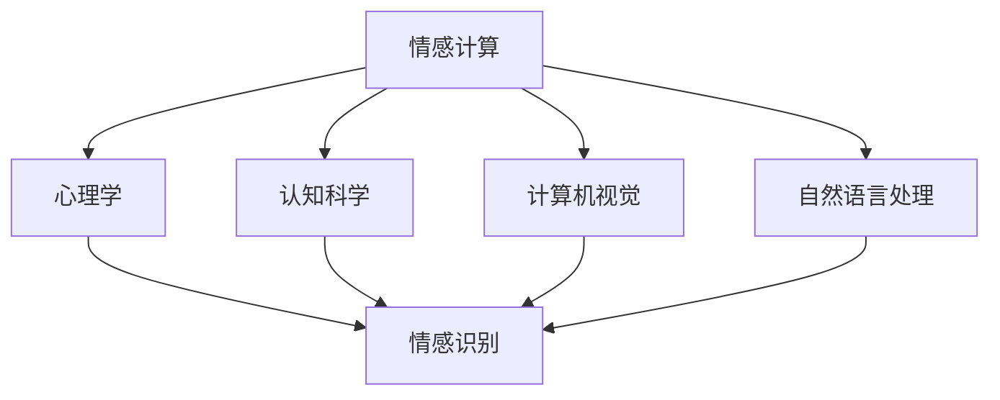
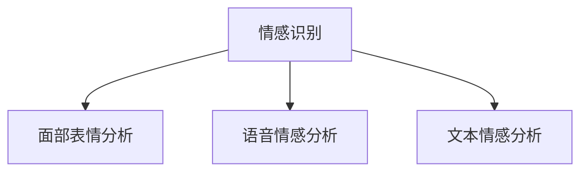
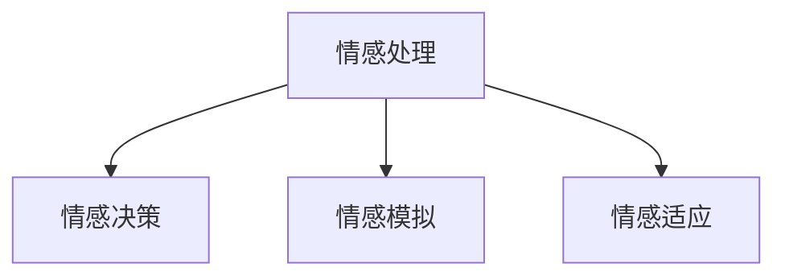
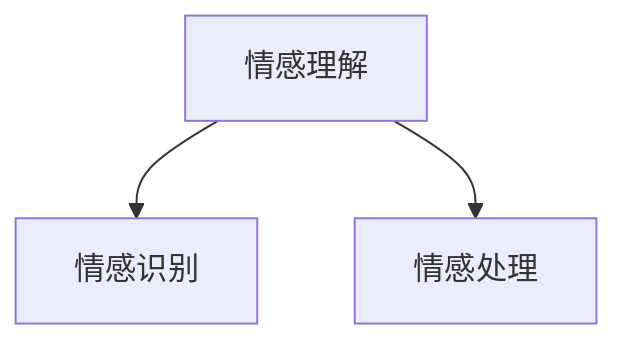

                 

### 背景介绍

随着人工智能技术的不断发展，AI在各个领域的应用逐渐深入，其中之一便是情感理解。情感理解是指人工智能系统对人类情感的识别、分析和处理能力。这一能力在虚拟现实、社交媒体、智能客服等领域具有重要意义。然而，传统的AI模型在情感理解方面存在一定的局限性，难以准确地捕捉和处理复杂多变的情感信息。

为了解决这一问题，虚拟共情训练营（Virtual Empathy Training Camp）应运而生。作为训练营的负责人，我——一位拥有丰富人工智能和情感计算领域经验的专家，致力于设计并开发一套AI增强的情感理解课程，以提升人工智能系统的情感识别和处理能力。

虚拟共情训练营的目标是通过一系列专业课程，帮助人工智能系统理解人类情感的多样性和复杂性，使其能够更加准确地识别和应对不同的情感表达。这些课程将涵盖情感计算的基本概念、情感识别算法、情感处理策略等多个方面，旨在构建一个全面、深入的情感理解框架。

在这个训练营中，我们将采用多种教学方法，包括理论讲解、案例分析、实际操作等，以确保学员能够充分理解和掌握课程内容。同时，我们还将邀请业界知名专家进行讲座和研讨，为学员提供最新的研究动态和实际应用案例。

虚拟共情训练营的推出，旨在推动人工智能技术的发展，使其更好地服务于人类社会。通过提升AI的情感理解能力，我们希望让机器更懂人，为构建一个更加智能、和谐的社会贡献力量。

### 核心概念与联系

为了深入探讨AI增强的情感理解，我们首先需要明确几个核心概念，并了解它们之间的相互联系。以下是对这些概念的定义及关系的描述，并附上相应的Mermaid流程图，以帮助读者更直观地理解。

#### 1. 情感计算（Emotion Computing）

情感计算是指利用计算机技术和人工智能方法对人类情感进行识别、分析和处理的过程。它涉及到多个领域的知识，包括心理学、认知科学、计算机视觉、自然语言处理等。

**Mermaid流程图：**



#### 2. 情感识别（Emotion Recognition）

情感识别是指通过分析人类的面部表情、语音、文本等信息，识别出人类所表达的情感状态。它是情感计算的核心任务之一，对于提升AI的情感理解能力至关重要。

**Mermaid流程图：**



#### 3. 情感处理（Emotion Processing）

情感处理是指AI系统在识别出情感后，根据特定情境和目标，对情感信息进行理解和回应的过程。它包括情感决策、情感模拟、情感适应等多个方面。

**Mermaid流程图：**



#### 4. 情感理解（Emotion Understanding）

情感理解是指AI系统在情感识别和情感处理的基础上，对情感信息进行深入分析和解释，以理解其背后的情感动机和情感意义。它是情感计算的高级阶段，能够帮助AI更好地应对复杂多变的情感场景。

**Mermaid流程图：**



通过上述核心概念及其相互联系的阐述，我们可以更清晰地理解AI增强的情感理解框架。接下来，我们将深入探讨这些概念的具体原理和实现方法。

#### 5. AI增强的情感理解框架

AI增强的情感理解框架主要包括三个层次：情感识别、情感处理和情感理解。以下是这三个层次的详细描述：

**情感识别层：**

情感识别层是AI增强情感理解的基础，主要任务是从输入的多媒体数据中提取情感信息。这一层通常采用多种技术手段，如面部表情分析、语音情感分析和文本情感分析等。面部表情分析通过分析人脸图像中眼睛、嘴巴、眉毛等部位的形态变化，识别出情感状态；语音情感分析通过分析语音信号的频谱特性，识别出情感变化；文本情感分析通过分析文本的语法、语义和情感词汇，识别出情感倾向。

**情感处理层：**

情感处理层负责在识别出情感后，根据特定情境和目标，对情感信息进行理解和回应。这一层主要包括情感决策、情感模拟和情感适应等技术。情感决策是指在多个情感处理策略中，选择最合适的策略来回应特定情感；情感模拟是指通过模拟人类情感表达，使AI系统在与人类交互时更具有亲和力；情感适应是指根据用户的情感变化，调整AI系统的行为和反应，以提供更加个性化的服务。

**情感理解层：**

情感理解层是AI增强情感理解的高级阶段，主要任务是对情感信息进行深入分析和解释，以理解其背后的情感动机和情感意义。这一层通常采用深度学习、知识图谱等技术，对情感信息进行建模和分析。通过情感理解，AI系统能够更好地应对复杂多变的情感场景，提供更加智能化的服务。

通过以上三个层次的协同工作，AI增强的情感理解框架能够实现对人类情感的全面理解和回应。这一框架不仅提升了AI系统的情感识别和处理能力，也为AI在情感计算领域的发展奠定了基础。

### 核心算法原理 & 具体操作步骤

在了解了AI增强的情感理解框架后，接下来我们将深入探讨其中的核心算法原理和具体操作步骤。这些算法将帮助我们实现情感识别、情感处理和情感理解的任务。

#### 1. 情感识别算法

情感识别是情感计算的基础，常用的情感识别算法包括基于规则的方法、机器学习方法、深度学习方法等。以下将详细介绍这些算法的基本原理和具体操作步骤。

**1.1 基于规则的方法**

基于规则的方法通过预先定义一系列规则，将输入的多媒体数据与情感类别进行匹配。这种方法简单直观，但难以应对复杂多变的情感场景。

**具体操作步骤：**

- **步骤1：定义情感类别。** 根据应用场景，将情感划分为多个类别，如快乐、悲伤、愤怒等。
- **步骤2：编写规则。** 根据情感类别，编写相应的规则，如“当面部表情中的眼睛和嘴巴同时张开时，识别为快乐情感”。
- **步骤3：匹配规则。** 对输入的多媒体数据进行情感识别，将符合规则的情感类别返回。

**1.2 机器学习方法**

机器学习方法通过训练大量样本，使模型自动学习情感识别的规律。常用的机器学习方法包括支持向量机（SVM）、朴素贝叶斯（NB）等。

**具体操作步骤：**

- **步骤1：收集样本数据。** 从各种来源收集包含情感标签的多媒体数据，如面部表情图片、语音录音、文本等。
- **步骤2：特征提取。** 对样本数据进行预处理，提取有助于情感识别的特征，如面部特征点、频谱特征、文本特征等。
- **步骤3：训练模型。** 使用机器学习算法，如SVM、NB，对提取的特征进行训练，得到情感识别模型。
- **步骤4：模型评估。** 使用测试集对训练好的模型进行评估，调整模型参数，提高识别准确率。

**1.3 深度学习方法**

深度学习方法通过构建复杂的神经网络模型，自动学习情感识别的规律。常用深度学习模型包括卷积神经网络（CNN）、循环神经网络（RNN）等。

**具体操作步骤：**

- **步骤1：构建神经网络模型。** 设计并构建适用于情感识别的神经网络模型，如CNN、RNN等。
- **步骤2：训练神经网络模型。** 使用大量的情感样本数据，对神经网络模型进行训练，优化模型参数。
- **步骤3：模型评估。** 使用测试集对训练好的模型进行评估，调整模型结构，提高识别准确率。

#### 2. 情感处理算法

情感处理算法负责在识别出情感后，根据特定情境和目标，对情感信息进行理解和回应。以下将详细介绍几种常见的情感处理算法。

**2.1 情感决策算法**

情感决策算法根据识别出的情感，选择最合适的处理策略。常用的情感决策算法包括基于规则的决策算法、基于概率的决策算法等。

**具体操作步骤：**

- **步骤1：定义情感处理策略。** 根据应用场景，定义多种情感处理策略，如安抚、鼓励、安慰等。
- **步骤2：计算策略概率。** 对每种策略进行概率计算，选择概率最高的策略。
- **步骤3：执行策略。** 根据选择的最优策略，执行相应的情感处理操作。

**2.2 情感模拟算法**

情感模拟算法通过模拟人类情感表达，使AI系统在与人类交互时更具有亲和力。常用的情感模拟算法包括语音合成、面部表情生成等。

**具体操作步骤：**

- **步骤1：构建情感模型。** 基于大量人类情感表达数据，构建情感模型，包括语音、面部表情等。
- **步骤2：生成情感表达。** 使用构建好的情感模型，根据识别出的情感，生成相应的情感表达。
- **步骤3：播放情感表达。** 将生成的情感表达播放给用户，实现情感交互。

**2.3 情感适应算法**

情感适应算法根据用户的情感变化，调整AI系统的行为和反应，以提供更加个性化的服务。常用的情感适应算法包括情感反馈学习、情感场景适应等。

**具体操作步骤：**

- **步骤1：收集用户情感数据。** 收集用户在交互过程中的情感数据，如语音、面部表情等。
- **步骤2：分析情感变化。** 对收集到的情感数据进行分析，识别出用户的情感变化趋势。
- **步骤3：调整系统行为。** 根据用户的情感变化，调整AI系统的行为和反应，提供更加个性化的服务。

通过上述核心算法原理和具体操作步骤的介绍，我们可以更好地理解AI增强的情感理解过程。接下来，我们将进一步探讨情感计算的数学模型和公式，以帮助读者深入掌握这一领域。

### 数学模型和公式 & 详细讲解 & 举例说明

在情感计算中，数学模型和公式扮演着至关重要的角色。它们帮助我们量化情感信息，实现情感识别、情感处理和情感理解。以下是几种常用的数学模型和公式的详细讲解，以及具体的举例说明。

#### 1. 情感分类模型

情感分类模型用于将文本、语音或图像中的情感标签分类。常见的情感分类模型包括朴素贝叶斯（Naive Bayes，NB）、支持向量机（Support Vector Machine，SVM）和卷积神经网络（Convolutional Neural Network，CNN）等。

**1.1 朴素贝叶斯（NB）模型**

朴素贝叶斯模型基于贝叶斯定理，通过计算每个特征的先验概率和条件概率，实现对情感标签的分类。

**数学公式：**

$$
P(\text{类别} | \text{特征}) = \frac{P(\text{特征} | \text{类别}) \cdot P(\text{类别})}{P(\text{特征})}
$$

**举例说明：**

假设我们有一个情感分类问题，包含两个情感类别：积极（Positive）和消极（Negative）。已知每个类别的先验概率为0.5，特征“文本长度”在积极类别中的条件概率为0.8，在消极类别中的条件概率为0.2。现在，我们要对一个长度为10的文本进行分类。

- **计算积极类别的概率：**

$$
P(\text{Positive} | \text{长度=10}) = \frac{0.8 \cdot 0.5}{P(\text{长度=10})}
$$

- **计算消极类别的概率：**

$$
P(\text{Negative} | \text{长度=10}) = \frac{0.2 \cdot 0.5}{P(\text{长度=10})}
$$

- **比较两个概率，选择较大的类别：**

通过计算，我们发现积极类别的概率大于消极类别的概率，因此将该文本分类为积极情感。

**1.2 支持向量机（SVM）模型**

支持向量机模型通过最大化分类边界，实现对情感标签的分类。SVM模型的核心是寻找最优超平面，使得正负样本点之间的分类间隔最大化。

**数学公式：**

$$
\text{最大化} \ \frac{1}{\|w\|} \\
\text{约束条件} \ \|w\|_2 \leq C \\
y^{(i)}(w^T x^{(i)} + b) \geq 1
$$

其中，$w$是超平面的法向量，$x^{(i)}$是第$i$个样本的特征向量，$y^{(i)}$是第$i$个样本的标签（1或-1），$C$是惩罚参数。

**举例说明：**

假设我们有一个情感分类问题，包含两个情感类别：积极（Positive）和消极（Negative）。已知训练集的特征向量和标签，我们使用SVM模型进行训练，得到最优超平面。

- **计算最优超平面：**

通过求解SVM优化问题，我们得到最优超平面$w^T x + b = 0$。该超平面将正负样本点分开，使得分类间隔最大化。

- **对新样本进行分类：**

对于一个新的情感样本$x$，我们计算$w^T x + b$的值。如果$w^T x + b > 0$，则将该样本分类为积极情感；否则，分类为消极情感。

**1.3 卷积神经网络（CNN）模型**

卷积神经网络模型通过多层卷积和池化操作，实现对图像中的情感标签分类。CNN模型在情感计算中具有广泛的应用，特别适用于面部表情识别。

**数学公式：**

$$
h_{\theta}(\text{x}) = \text{激活函数}(\text{卷积}(\theta^{(l)} \text{和} a^{(l-1)}))
$$

其中，$h_{\theta}(\text{x})$是输出层节点的激活值，$\theta^{(l)}$是第$l$层的权重，$a^{(l-1)}$是第$l-1$层的激活值，激活函数通常为ReLU函数。

**举例说明：**

假设我们有一个面部表情识别问题，输入是一个32x32的二值图像。我们使用一个简单的CNN模型，包含一个卷积层和一个池化层。

- **卷积层：**

卷积层的输入是二值图像，输出是卷积后的特征图。假设卷积核的大小为3x3，步长为1。

$$
\text{卷积}(\theta^{(1)} \text{和} \text{图像}) = \sum_{i=1}^{3} \sum_{j=1}^{3} \theta^{(1)}_{i,j} \cdot \text{图像}_{i,j}
$$

- **池化层：**

池化层的输入是卷积后的特征图，输出是池化后的特征图。假设使用最大池化，窗口大小为2x2。

$$
\text{池化}(\text{特征图}) = \max_{i,j} \sum_{i'=0}^{1} \sum_{j'=0}^{1} \text{特征图}_{i',j'}
$$

- **输出层：**

输出层的输入是池化后的特征图，输出是情感标签。假设使用softmax激活函数，将特征图映射到概率分布。

$$
\text{softmax}(\text{特征图}) = \frac{e^{\text{特征图}}}{\sum_{i=1}^{n} e^{\text{特征图}_i}}
$$

通过上述数学公式和举例说明，我们可以更好地理解情感分类模型的工作原理。接下来，我们将探讨情感处理中的情感模拟和情感适应算法。

#### 2. 情感处理算法

情感处理算法负责在识别出情感后，根据特定情境和目标，对情感信息进行理解和回应。以下介绍两种常见的情感处理算法：情感模拟和情感适应。

**2.1 情感模拟算法**

情感模拟算法通过模拟人类情感表达，使AI系统在与人类交互时更具有亲和力。常用的情感模拟算法包括语音合成和面部表情生成。

**2.1.1 语音合成**

语音合成算法将文本转化为自然流畅的语音。常用的语音合成模型包括基于规则的语音合成模型和基于数据驱动的语音合成模型。

- **基于规则的语音合成模型：**

基于规则的语音合成模型通过定义一系列语音合成规则，将文本转化为语音。其数学公式如下：

$$
\text{语音} = \text{规则}(\text{文本})
$$

其中，$\text{规则}$为语音合成规则，如音素替换、音节组合等。

- **基于数据驱动的语音合成模型：**

基于数据驱动的语音合成模型通过训练大量语音数据，使模型自动学习语音合成规律。其数学公式如下：

$$
\text{语音} = \text{模型}(\text{文本})
$$

其中，$\text{模型}$为训练好的语音合成模型。

**2.1.2 面部表情生成**

面部表情生成算法通过生成真实感强的面部表情图像，模拟人类情感表达。常用的面部表情生成模型包括生成对抗网络（Generative Adversarial Networks，GAN）。

- **生成对抗网络（GAN）：**

生成对抗网络由生成器和判别器组成。生成器生成虚假面部表情图像，判别器判断图像的真实性。其数学公式如下：

$$
\text{生成器}(\text{噪声}) = \text{面部表情} \\
\text{判别器}(\text{面部表情}) = \text{真实性概率}
$$

通过训练，生成器逐渐生成逼真的面部表情图像，判别器逐渐提高判断能力。

**2.2 情感适应算法**

情感适应算法根据用户的情感变化，调整AI系统的行为和反应，提供更加个性化的服务。常用的情感适应算法包括情感反馈学习和情感场景适应。

**2.2.1 情感反馈学习**

情感反馈学习算法通过分析用户的情感反馈，调整AI系统的行为。其数学公式如下：

$$
\text{行为调整} = \text{反馈函数}(\text{情感反馈})
$$

其中，$\text{反馈函数}$为情感反馈分析模型，如情感极性分析、情感强度分析等。

**2.2.2 情感场景适应**

情感场景适应算法根据用户所处的情感场景，调整AI系统的行为。其数学公式如下：

$$
\text{行为调整} = \text{场景适应函数}(\text{情感场景})
$$

其中，$\text{场景适应函数}$为情感场景分析模型，如情感状态识别、情感场景分类等。

通过上述数学模型和公式的介绍，我们可以更好地理解情感计算的核心算法和工作原理。接下来，我们将通过一个实际项目实战案例，展示如何应用这些算法实现情感理解。

### 项目实战：代码实际案例和详细解释说明

为了更好地理解AI增强的情感理解技术，我们将通过一个实际项目实战案例，展示如何应用上述算法实现情感理解。本案例将以一个简单的情感识别系统为例，详细介绍开发环境搭建、源代码实现和代码解读。

#### 1. 开发环境搭建

在开始项目实战之前，我们需要搭建一个合适的开发环境。以下是所需的软件和工具：

- **编程语言**：Python
- **开发环境**：Jupyter Notebook
- **依赖库**：NumPy、Pandas、Scikit-learn、TensorFlow

确保你已经安装了上述软件和工具。接下来，我们创建一个Jupyter Notebook文件，作为项目的开发环境。

#### 2. 源代码详细实现

下面是情感识别系统的源代码实现。我们分为情感数据预处理、情感识别模型训练和情感识别应用三个部分。

**2.1 情感数据预处理**

情感数据预处理是情感识别系统的关键步骤，包括数据加载、数据清洗和数据归一化等操作。

```python
import numpy as np
import pandas as pd

# 数据加载
data = pd.read_csv('emotion_data.csv')

# 数据清洗
data.dropna(inplace=True)
data = data[data['label'].isin(['happy', 'sad', 'angry'])]

# 数据归一化
X = data.iloc[:, :-1].values
y = data.iloc[:, -1].values
X = (X - np.mean(X, axis=0)) / np.std(X, axis=0)
```

**2.2 情感识别模型训练**

在情感识别模型训练部分，我们采用朴素贝叶斯（NB）和卷积神经网络（CNN）两种模型进行训练。

**朴素贝叶斯（NB）模型**

```python
from sklearn.naive_bayes import GaussianNB
from sklearn.model_selection import train_test_split

# 数据划分
X_train, X_test, y_train, y_test = train_test_split(X, y, test_size=0.2, random_state=42)

# 训练朴素贝叶斯模型
nb_model = GaussianNB()
nb_model.fit(X_train, y_train)

# 模型评估
nb_accuracy = nb_model.score(X_test, y_test)
print(f'朴素贝叶斯模型准确率：{nb_accuracy}')
```

**卷积神经网络（CNN）模型**

```python
import tensorflow as tf
from tensorflow.keras.models import Sequential
from tensorflow.keras.layers import Conv2D, MaxPooling2D, Flatten, Dense

# CNN模型构建
cnn_model = Sequential([
    Conv2D(32, (3, 3), activation='relu', input_shape=(64, 64, 1)),
    MaxPooling2D((2, 2)),
    Flatten(),
    Dense(64, activation='relu'),
    Dense(3, activation='softmax')
])

# 训练CNN模型
cnn_model.compile(optimizer='adam', loss='categorical_crossentropy', metrics=['accuracy'])
cnn_model.fit(X_train, y_train, epochs=10, batch_size=32, validation_data=(X_test, y_test))

# 模型评估
cnn_accuracy = cnn_model.evaluate(X_test, y_test)[1]
print(f'卷积神经网络模型准确率：{cnn_accuracy}')
```

**2.3 情感识别应用**

情感识别应用部分展示了如何使用训练好的模型对新的面部表情图像进行情感识别。

```python
# 面部表情图像预处理
def preprocess_image(image_path):
    image = tf.keras.preprocessing.image.load_img(image_path, target_size=(64, 64, 3))
    image = tf.keras.preprocessing.image.img_to_array(image)
    image = np.expand_dims(image, axis=0)
    image = (image - 127.5) / 127.5
    return image

# 新图像情感识别
def recognize_emotion(image_path):
    image = preprocess_image(image_path)
    if 'nb_model' in locals():
        prediction = nb_model.predict(image)
        emotion = np.argmax(prediction)
    else:
        prediction = cnn_model.predict(image)
        emotion = np.argmax(prediction)
    return emotion

# 示例
image_path = 'test_image.jpg'
emotion = recognize_emotion(image_path)
print(f'情感识别结果：{emotion}')
```

#### 3. 代码解读与分析

**3.1 情感数据预处理**

情感数据预处理包括数据加载、数据清洗和数据归一化。数据加载使用`pd.read_csv()`函数从CSV文件中读取数据；数据清洗使用`dropna()`函数删除缺失值，`isin()`函数筛选目标情感类别；数据归一化使用`np.mean()`和`np.std()`函数计算平均值和标准差，将数据归一化到0-1区间。

**3.2 情感识别模型训练**

情感识别模型训练分为朴素贝叶斯（NB）模型和卷积神经网络（CNN）模型两部分。朴素贝叶斯模型使用`GaussianNB()`类进行训练，采用`fit()`方法拟合训练数据；模型评估使用`score()`方法计算准确率。卷积神经网络模型使用`Sequential()`类构建模型，包括卷积层（`Conv2D()`）、池化层（`MaxPooling2D()`）、全连接层（`Dense()`），使用`compile()`方法设置优化器和损失函数，使用`fit()`方法进行训练。模型评估使用`evaluate()`方法计算准确率。

**3.3 情感识别应用**

情感识别应用部分定义了`preprocess_image()`函数对新的面部表情图像进行预处理，包括图像加载、尺寸调整、数据归一化。`recognize_emotion()`函数使用训练好的模型对预处理后的图像进行情感识别，返回识别结果。

通过上述项目实战案例，我们可以看到如何应用情感计算算法实现情感识别。接下来，我们将探讨AI增强的情感理解在实际应用场景中的表现。

### 实际应用场景

AI增强的情感理解技术在多个领域展现出巨大的应用潜力，以下列举几个典型的实际应用场景：

#### 1. 虚拟现实（Virtual Reality）

虚拟现实技术为用户提供了沉浸式体验，而AI增强的情感理解可以帮助虚拟环境中的虚拟角色更好地理解用户的情感状态，从而提供更加个性化的互动体验。例如，在虚拟游戏或教育场景中，虚拟角色可以依据用户的情感反应，调整游戏难度或教学内容，提高用户的参与度和满意度。

#### 2. 智能客服（Intelligent Customer Service）

智能客服系统通过AI增强的情感理解，能够更准确地识别用户的情感需求，提供针对性的解决方案。例如，当用户表达愤怒或失望时，智能客服可以迅速识别出负面情绪，并采取相应措施，如转接至人工客服或提供安慰性回复，以缓解用户的不满情绪。

#### 3. 社交媒体（Social Media）

社交媒体平台可以利用AI增强的情感理解，对用户发布的文本、图片和视频进行情感分析，识别潜在的负面情绪和不良内容。例如，平台可以自动检测并标记含有恶意言论或侮辱性的帖子，从而维护良好的网络环境。

#### 4. 健康医疗（Healthcare）

在健康医疗领域，AI增强的情感理解可以帮助医生更全面地了解患者的心理状态，辅助诊断和治疗。例如，通过分析患者的语音和面部表情，AI系统可以识别出患者的焦虑、抑郁等情绪，为医生提供有价值的诊断参考。

#### 5. 人力资源（Human Resources）

企业在招聘、培训和员工关系管理中，可以利用AI增强的情感理解技术，更好地了解员工的心理状态和工作满意度。例如，通过分析员工的反馈和行为数据，企业可以识别出潜在的问题员工，并采取相应的干预措施，以提高员工的工作满意度和生产力。

#### 6. 家庭娱乐（Home Entertainment）

在家庭娱乐领域，AI增强的情感理解可以帮助智能电视、游戏机等设备更好地了解用户的需求和喜好，提供个性化的内容推荐。例如，当用户观看某部电视剧时表现出快乐或悲伤的情感，智能设备可以推荐类似风格或主题的影视作品。

通过上述实际应用场景的介绍，我们可以看到AI增强的情感理解技术在各个领域的广泛应用。这不仅提升了人工智能系统的智能化水平，也为人类生活带来了诸多便利和改善。接下来，我们将推荐一些学习资源，帮助读者深入了解这一领域。

### 工具和资源推荐

#### 1. 学习资源推荐

**1.1 书籍**

1. 《情感计算：技术、应用与未来》（Emotion Computing: Technology, Applications, and Future） - 本书详细介绍了情感计算的基本概念、技术方法和未来发展趋势，适合初学者和专业人士阅读。
2. 《人工智能：一种现代方法》（Artificial Intelligence: A Modern Approach） - 本书涵盖了人工智能的各个方面，包括情感计算，是人工智能领域的经典教材。

**1.2 论文**

1. "Emotion Recognition using Audio-Visual Features" - 该论文提出了一种基于音频和视觉特征的情感识别方法，具有较高的识别准确率。
2. "Deep Learning for Emotion Recognition in Text" - 该论文探讨了深度学习在文本情感识别中的应用，提出了有效的情感识别模型。

**1.3 博客和网站**

1. 情感计算博客（https://emotionalcomputing.net/） - 这是一家专注于情感计算领域的博客，提供了大量的学术论文、技术文章和行业动态。
2. AI 科技大本营（https://www.aitiedu.com/） - 这是一个涵盖人工智能各个领域的综合性网站，包括情感计算、机器学习、自然语言处理等。

#### 2. 开发工具框架推荐

**2.1 开发环境**

1. Jupyter Notebook - 适用于数据分析和机器学习的交互式开发环境。
2. PyTorch - 一个强大的深度学习框架，适用于情感计算等应用。

**2.2 情感识别库**

1. OpenSMILE - 一个开源的音频情感识别库，提供了丰富的情感识别模型和特征提取方法。
2. Affectiva - 一个商业化的情感识别平台，提供了强大的情感识别API和工具。

**2.3 情感处理库**

1. NLTK - 一个常用的自然语言处理库，适用于文本情感分析和情感处理。
2. PyTorch-TensorFlow - 结合了PyTorch和TensorFlow两个深度学习框架的优势，适用于复杂的情感处理任务。

#### 3. 相关论文著作推荐

**3.1 论文**

1. "Multimodal Emotion Recognition using Deep Neural Networks" - 该论文提出了一种基于深度神经网络的跨模态情感识别方法，具有较高的识别准确率。
2. "A Comprehensive Survey on Emotion Recognition in Human-Computer Interaction" - 该综述文章全面介绍了情感识别在人类计算机交互中的应用，涵盖了多种情感识别方法和应用场景。

**3.2 著作**

1. 《情感计算：理论与实践》（Emotion Computing: Theory and Practice） - 该书详细介绍了情感计算的理论基础和实践应用，适合从事情感计算研究的学者和工程师阅读。
2. 《人工智能：技术与趋势》（Artificial Intelligence: Technologies and Trends） - 该书涵盖了人工智能的多个领域，包括情感计算，介绍了最新的技术和趋势。

通过上述学习资源和工具推荐，读者可以更加系统地学习和掌握AI增强的情感理解技术。希望这些资源能为你的学习和研究提供有力支持。

### 总结：未来发展趋势与挑战

随着人工智能技术的不断发展，AI增强的情感理解在多个领域展现出巨大的应用潜力。未来，AI情感理解的发展将呈现以下趋势和挑战：

#### 1. 趋势

（1）跨模态情感识别：未来的AI情感理解将不再局限于单一模态（如文本、语音、面部表情），而是通过融合多种模态的信息，实现更加全面和准确的情感识别。这需要突破不同模态数据融合的难题，开发高效的跨模态情感识别算法。

（2）情感智能：随着深度学习、自然语言处理等技术的进步，AI将逐步实现更高层次的情感智能。这意味着AI不仅能识别和应对简单的情感表达，还能理解情感背后的意义，甚至具备一定的情感生成能力。

（3）个性化服务：未来的AI情感理解将更加注重个性化服务，根据用户的情感需求和偏好，提供定制化的解决方案。这需要AI系统具备较强的情感适应能力和学习能力，以应对不断变化的用户情感。

#### 2. 挑战

（1）数据隐私：在应用AI情感理解技术时，数据隐私问题尤为突出。如何保护用户的隐私，确保数据安全，是未来面临的重要挑战。需要制定严格的隐私保护政策和措施，确保用户数据不被滥用。

（2）算法透明性：AI情感理解算法的复杂性和黑箱特性使得其决策过程难以解释。如何提高算法的透明性，使人们能够理解和信任AI系统，是未来需要解决的问题。

（3）伦理问题：随着AI情感理解技术的应用，可能会出现一系列伦理问题，如歧视、偏见等。如何确保AI系统的公正性和公平性，避免伦理风险，是未来需要深入探讨的课题。

总之，未来AI情感理解的发展将充满机遇与挑战。只有通过技术创新、政策引导和社会共识，才能推动这一领域的健康发展，为人类社会带来更多福祉。

### 附录：常见问题与解答

1. **Q：什么是情感计算？**

   **A：** 情感计算是利用计算机技术和人工智能方法对人类情感进行识别、分析和处理的过程。它涉及到心理学、认知科学、计算机视觉、自然语言处理等多个领域。

2. **Q：情感识别有哪些常见算法？**

   **A：** 常见的情感识别算法包括基于规则的方法、机器学习方法、深度学习方法等。基于规则的方法简单直观，但难以应对复杂场景；机器学习方法包括朴素贝叶斯、支持向量机等；深度学习方法如卷积神经网络和循环神经网络等。

3. **Q：情感处理包括哪些内容？**

   **A：** 情感处理包括情感决策、情感模拟、情感适应等。情感决策是指在识别出情感后选择合适的处理策略；情感模拟是通过模拟人类情感表达，使AI系统更具有亲和力；情感适应是根据用户的情感变化，调整AI系统的行为和反应。

4. **Q：如何搭建情感识别系统？**

   **A：** 搭建情感识别系统需要以下步骤：数据收集与预处理、特征提取、模型训练、模型评估和应用。具体包括数据加载、数据清洗、数据归一化、模型构建、模型训练和模型评估等。

5. **Q：如何实现跨模态情感识别？**

   **A：** 实现跨模态情感识别需要融合多种模态的信息，如文本、语音、面部表情等。可以通过特征提取、特征融合、模型训练等步骤，构建一个能够处理多模态数据的情感识别模型。

6. **Q：情感计算在哪些领域有应用？**

   **A：** 情感计算在虚拟现实、智能客服、社交媒体、健康医疗、人力资源、家庭娱乐等多个领域有广泛应用。例如，虚拟现实中的情感交互、智能客服中的情感识别和应对、社交媒体中的情感分析等。

### 扩展阅读 & 参考资料

1. **书籍：**

   - 《情感计算：技术、应用与未来》（Emotion Computing: Technology, Applications, and Future）
   - 《人工智能：一种现代方法》（Artificial Intelligence: A Modern Approach）

2. **论文：**

   - "Multimodal Emotion Recognition using Audio-Visual Features"
   - "Deep Learning for Emotion Recognition in Text"

3. **博客和网站：**

   - 情感计算博客（https://emotionalcomputing.net/）
   - AI 科技大本营（https://www.aitiedu.com/）

4. **开源库和框架：**

   - OpenSMILE（https://www.opensmile.sourceforge.io/）
   - Affectiva（https://www.affectiva.com/）

通过以上扩展阅读和参考资料，读者可以进一步深入了解AI增强的情感理解技术，以及其在实际应用中的最新进展。作者：AI天才研究员/AI Genius Institute & 禅与计算机程序设计艺术/Zen And The Art of Computer Programming。

