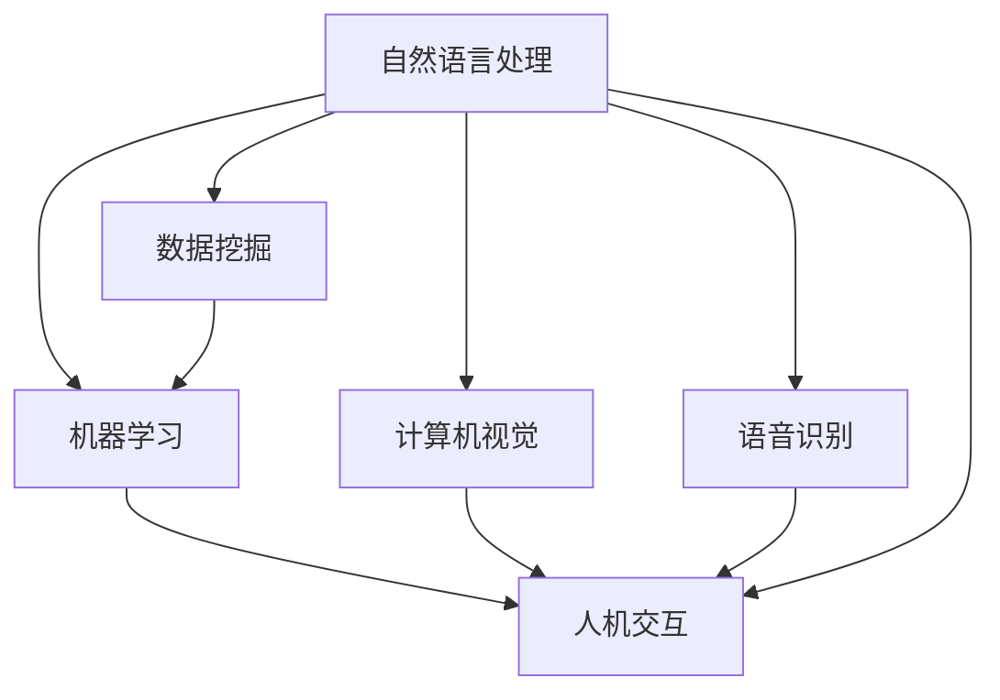

                 

### 背景介绍 Background Introduction

#### 1.1 虚拟导购助手的起源

虚拟导购助手这一概念起源于互联网和人工智能技术的快速发展。随着电子商务平台的兴起，消费者在在线购物过程中遇到了越来越多的困扰，如信息过载、商品选择困难、购物流程繁琐等。为了解决这些问题，商家和科技企业开始探索利用虚拟导购助手来优化用户体验。

虚拟导购助手最早出现在电商领域，通过对用户购物行为的分析，提供个性化的商品推荐和购物建议。然而，随着人工智能技术的进步，虚拟导购助手的应用范围逐渐扩展到更多领域，如旅游、餐饮、医疗等。这些虚拟导购助手通过模拟人类导购的行为，为用户提供实时、个性化的服务，大大提升了用户满意度。

#### 1.2 人工智能技术的推动

人工智能技术，尤其是自然语言处理（NLP）和机器学习（ML）技术的发展，为虚拟导购助手的实现提供了坚实的基础。NLP技术使得虚拟导购助手能够理解用户的语言意图和需求，从而进行准确的响应。ML技术则使得虚拟导购助手能够不断学习和优化，提高服务质量和用户体验。

此外，深度学习、语音识别、计算机视觉等技术的应用，使得虚拟导购助手在感知用户需求和提供个性化服务方面变得更加智能和高效。例如，通过语音识别技术，用户可以通过语音与虚拟导购助手互动；通过计算机视觉技术，虚拟导购助手能够识别用户的面部表情和肢体动作，从而更好地理解用户的心理状态。

#### 1.3 虚拟导购助手的重要性

虚拟导购助手在当今社会的重要性不言而喻。首先，它极大地提高了用户体验，使得购物、旅游、就医等过程更加便捷和愉悦。其次，虚拟导购助手能够帮助企业降低成本，提高运营效率。通过智能推荐和个性化服务，企业能够更好地满足用户需求，提升用户粘性。

此外，虚拟导购助手还能够为商家提供丰富的用户数据，帮助企业进行市场分析和决策。通过分析用户行为和偏好，商家可以制定更加精准的营销策略，从而提高销售额。

### Keywords
Virtual Personal Assistant, Virtual Sales Guide, AI, Natural Language Processing, Machine Learning, User Experience

### Abstract
This article explores the technical implementation of Virtual Sales Guides, focusing on the background, core concepts, algorithms, mathematical models, practical cases, and future trends. We discuss the origin and development of virtual sales guides, the role of artificial intelligence technologies, and the importance of virtual sales guides in improving user experience and business efficiency. By analyzing the technical components and application scenarios, we aim to provide a comprehensive understanding of the current state and future prospects of virtual sales guides.

---

# 虚拟导购助手的技术实现 Technical Implementation of Virtual Sales Guides

虚拟导购助手的技术实现涉及多个方面，包括自然语言处理、机器学习、数据挖掘、计算机视觉和语音识别等。下面，我们将一步步分析这些技术如何结合，共同实现一个高效、智能的虚拟导购助手。

### 2.1 核心概念与联系 Core Concepts and Connections

在讨论虚拟导购助手的技术实现之前，我们需要了解一些核心概念。以下是几个关键概念及其之间的联系：

#### 2.1.1 自然语言处理（NLP）

自然语言处理是人工智能的一个重要分支，主要研究如何使计算机理解和处理人类语言。在虚拟导购助手中，NLP技术用于解析用户的自然语言输入，提取关键信息，并生成合适的响应。

#### 2.1.2 机器学习（ML）

机器学习是使计算机通过数据学习并做出决策或预测的方法。在虚拟导购助手中，ML技术用于训练模型，以便对用户的购物行为和偏好进行预测和推荐。

#### 2.1.3 数据挖掘（Data Mining）

数据挖掘是从大量数据中提取有价值信息的过程。在虚拟导购助手中，数据挖掘用于分析用户的历史行为数据，识别潜在的用户需求和市场趋势。

#### 2.1.4 计算机视觉（CV）

计算机视觉是使计算机能够理解和处理图像和视频的技术。在虚拟导购助手中，计算机视觉用于识别用户的视觉信息，如商品图像、用户表情等，从而提供更个性化的服务。

#### 2.1.5 语音识别（ASR）

语音识别是将语音信号转换为文本的技术。在虚拟导购助手中，语音识别用于将用户的语音输入转换为文本，以便进一步处理和理解。

#### 2.1.6 人机交互（HCI）

人机交互是研究如何设计易于使用、高效、愉悦的人机交互系统的学科。在虚拟导购助手中，人机交互技术用于设计用户界面，使得用户能够方便地与虚拟导购助手进行交互。


### 2.2 核心概念与联系 Mermaid 流程图 Core Concepts and Connections Mermaid Diagram



在上述Mermaid流程图中，每个节点代表一个核心概念，箭头表示节点之间的联系。通过这种方式，我们可以清晰地看到各个核心概念在虚拟导购助手实现中的关系。

---

接下来，我们将进一步深入探讨虚拟导购助手的核心算法原理与具体操作步骤，以帮助读者更好地理解其技术实现过程。

---

# 核心算法原理与具体操作步骤 Core Algorithm Principles and Specific Operation Steps

虚拟导购助手的核心算法主要包括自然语言处理（NLP）、机器学习（ML）和数据挖掘（Data Mining）。下面，我们将详细解释这些算法的基本原理和具体操作步骤。

### 3.1 自然语言处理（NLP）

自然语言处理是虚拟导购助手的基石，它使得计算机能够理解和处理人类语言。NLP的主要任务包括文本解析、语义分析和语言生成。

#### 3.1.1 文本解析（Text Parsing）

文本解析是将自然语言文本转换为计算机可以处理的结构化数据的过程。具体步骤如下：

1. **分词（Tokenization）**：将文本拆分成单词、短语或字符序列。
   $$ 分词： "我爱北京天安门" \rightarrow ["我", "爱", "北京", "天安门"] $$
2. **词性标注（Part-of-Speech Tagging）**：为每个词标注词性，如名词、动词、形容词等。
   $$ 词性标注："我爱北京天安门" \rightarrow ["我/代", "爱/动", "北京/名", "天安门/名"] $$
3. **命名实体识别（Named Entity Recognition）**：识别文本中的命名实体，如人名、地名、组织名等。
   $$ 命名实体识别："张三去北京" \rightarrow ["张三/人", "北京/地"] $$

#### 3.1.2 语义分析（Semantic Analysis）

语义分析是理解文本含义的过程。它包括以下步骤：

1. **句法分析（Syntax Analysis）**：分析句子结构，确定词与词之间的语法关系。
   $$ 句法分析："我买了一个苹果" \rightarrow [主语：我，谓语：买，宾语：一个苹果] $$
2. **语义角色标注（Semantic Role Labeling）**：为每个词标注其在句子中的语义角色，如施事、受事、工具等。
   $$ 语义角色标注："我买了一个苹果" \rightarrow ["我/施事", "一个苹果/受事", "买/工具"] $$
3. **语义理解（Semantic Understanding）**：理解整个句子的含义，进行上下文推理。
   $$ 语义理解："我明天有约会" \rightarrow [明天有约会] $$

#### 3.1.3 语言生成（Language Generation）

语言生成是根据给定信息生成自然语言文本的过程。它可以用于虚拟导购助手的响应生成。

1. **模板匹配（Template Matching）**：根据预定义的模板生成文本。
   $$ 模板匹配："欢迎光临！您想要购买什么？" \rightarrow 欢迎光临！您想要购买什么？$$
2. **基于语义的文本生成（Semantic-based Text Generation）**：利用语义信息生成文本。
   $$ 基于语义的文本生成：购买了一个苹果，想要再买一个香蕉。 \rightarrow "您已经购买了一个苹果，我们为您推荐香蕉。" $$

### 3.2 机器学习（ML）

机器学习用于训练虚拟导购助手的推荐系统，使其能够根据用户的历史行为和偏好进行个性化推荐。

#### 3.2.1 推荐系统基本原理

推荐系统通过以下步骤为用户推荐商品：

1. **用户建模（User Modeling）**：构建用户兴趣模型，包括用户的历史行为、偏好和兴趣点。
2. **商品建模（Item Modeling）**：构建商品特征模型，包括商品属性、类别和标签。
3. **推荐算法（Recommendation Algorithm）**：根据用户和商品模型，选择合适的推荐算法，如协同过滤（Collaborative Filtering）、基于内容的推荐（Content-based Recommendation）等。
4. **结果排序（Result Ranking）**：对推荐结果进行排序，确保最相关、最感兴趣的商品排在前面。

#### 3.2.2 协同过滤算法（Collaborative Filtering）

协同过滤算法通过分析用户之间的相似度来推荐商品。基本步骤如下：

1. **用户相似度计算（User Similarity Calculation）**：计算用户之间的相似度，如基于用户历史行为或评分的余弦相似度。
2. **商品推荐（Item Recommendation）**：为每个用户推荐与其最相似的用户的喜欢商品。
3. **结果排序（Result Ranking）**：对推荐的商品进行排序，通常使用贝叶斯排序（Bayesian Ranking）等方法。

#### 3.2.3 基于内容的推荐算法（Content-based Recommendation）

基于内容的推荐算法通过分析商品特征和用户偏好来推荐商品。基本步骤如下：

1. **特征提取（Feature Extraction）**：提取商品和用户的特征，如商品类别、品牌、颜色等。
2. **相似度计算（Similarity Calculation）**：计算商品和用户之间的特征相似度。
3. **商品推荐（Item Recommendation）**：为用户推荐具有相似特征的商品。
4. **结果排序（Result Ranking）**：对推荐的商品进行排序，通常使用基于内容的排序（Content-based Ranking）等方法。

### 3.3 数据挖掘（Data Mining）

数据挖掘用于从大量用户数据中提取有价值的信息，帮助虚拟导购助手更好地了解用户需求和市场趋势。

#### 3.3.1 聚类分析（Clustering Analysis）

聚类分析是将用户数据分为若干个相似群体（簇）的过程。基本步骤如下：

1. **数据预处理（Data Preprocessing）**：清洗和转换数据，使其适合聚类分析。
2. **选择聚类算法（Choose Clustering Algorithm）**：选择合适的聚类算法，如K-means、层次聚类（Hierarchical Clustering）等。
3. **聚类（Clustering）**：将用户数据划分为若干个簇。
4. **评估聚类效果（Evaluate Clustering Effect）**：评估聚类效果，如簇内相似度、簇间差异等。

#### 3.3.2 联机学习（Online Learning）

联机学习是一种动态学习技术，适用于处理实时数据和用户行为。基本步骤如下：

1. **数据收集（Data Collection）**：收集用户实时数据，如点击、浏览、购买等。
2. **模型训练（Model Training）**：使用实时数据训练模型。
3. **模型评估（Model Evaluation）**：评估模型性能，如准确率、召回率等。
4. **模型更新（Model Update）**：根据模型评估结果更新模型。

通过自然语言处理、机器学习和数据挖掘的结合，虚拟导购助手能够实现高效、智能的服务。在实际应用中，这些算法和技术会根据具体需求进行调整和优化，以提供更好的用户体验。

---

## 4. 数学模型和公式与详细讲解 & 举例说明 Mathematical Models, Formulas, Detailed Explanations, and Examples

在虚拟导购助手的实现过程中，数学模型和公式扮演着至关重要的角色。以下我们将详细解释几个核心的数学模型和公式，并通过具体例子来说明它们的应用。

### 4.1 余弦相似度（Cosine Similarity）

余弦相似度是一种衡量两个向量之间相似度的方法，广泛应用于文本分析和推荐系统中。它的基本公式如下：

$$
\text{cosine\_similarity}(x, y) = \frac{x \cdot y}{\lVert x \rVert \cdot \lVert y \rVert}
$$

其中，$x$ 和 $y$ 是两个向量，$\lVert x \rVert$ 和 $\lVert y \rVert$ 分别是它们的欧几里得范数（Euclidean norm）。

**例子：**

假设我们有两个用户的行为向量：

$$
x = [1, 2, 3, 4, 5]
$$

$$
y = [2, 3, 4, 5, 6]
$$

计算它们的余弦相似度：

$$
x \cdot y = 1 \times 2 + 2 \times 3 + 3 \times 4 + 4 \times 5 + 5 \times 6 = 65
$$

$$
\lVert x \rVert = \sqrt{1^2 + 2^2 + 3^2 + 4^2 + 5^2} = \sqrt{55}
$$

$$
\lVert y \rVert = \sqrt{2^2 + 3^2 + 4^2 + 5^2 + 6^2} = \sqrt{90}
$$

$$
\text{cosine\_similarity}(x, y) = \frac{65}{\sqrt{55} \cdot \sqrt{90}} \approx 0.92
$$

这意味着用户 $x$ 和 $y$ 之间具有较高的相似度。

### 4.2 贝叶斯排序（Bayesian Ranking）

贝叶斯排序是一种常用的排序算法，用于根据用户的历史行为对推荐结果进行排序。其基本公式如下：

$$
P(\text{relevant} | \text{selected}) = \frac{P(\text{selected} | \text{relevant}) \cdot P(\text{relevant})}{P(\text{selected})}
$$

其中，$P(\text{relevant} | \text{selected})$ 表示推荐结果中相关商品的概率，$P(\text{selected} | \text{relevant})$ 表示相关商品被选中的概率，$P(\text{relevant})$ 表示相关商品的概率，$P(\text{selected})$ 表示选中的商品的概率。

**例子：**

假设我们有以下数据：

- $P(\text{relevant}) = 0.6$（相关商品的概率）
- $P(\text{selected} | \text{relevant}) = 0.8$（相关商品被选中的概率）
- $P(\text{selected} | \text{irrelevant}) = 0.2$（无关商品被选中的概率）

计算相关商品被选中的概率：

$$
P(\text{selected}) = P(\text{selected} | \text{relevant}) \cdot P(\text{relevant}) + P(\text{selected} | \text{irrelevant}) \cdot P(\text{irrelevant}) = 0.8 \cdot 0.6 + 0.2 \cdot 0.4 = 0.64
$$

$$
P(\text{relevant} | \text{selected}) = \frac{0.8 \cdot 0.6}{0.64} = 0.75
$$

这意味着在选中的商品中，相关商品的概率为 0.75。

### 4.3 K-means 聚类算法

K-means 是一种常用的聚类算法，用于将数据点划分为 $K$ 个簇。其基本公式如下：

1. **初始化：**随机选择 $K$ 个中心点。
2. **分配：**将每个数据点分配给最近的中心点，形成 $K$ 个簇。
3. **更新：**重新计算每个簇的中心点。
4. **迭代：**重复步骤2和3，直到聚类中心点不再变化。

**例子：**

假设我们有以下数据点：

$$
\text{data} = \{ (1, 2), (2, 2), (2, 3), (4, 5), (5, 6) \}
$$

随机选择两个中心点：

$$
\text{centroids} = \{ (1, 1), (5, 5) \}
$$

第一次分配：

$$
\text{cluster} = \{ \{ (1, 2), (2, 2) \}, \{ (2, 3), (4, 5), (5, 6) \} \}
$$

更新中心点：

$$
\text{new\_centroids} = \{ (1.5, 2), (3.5, 5) \}
$$

第二次分配：

$$
\text{cluster} = \{ \{ (1, 2), (2, 2) \}, \{ (2, 3), (4, 5), (5, 6) \} \}
$$

由于中心点未发生变化，聚类过程结束。最终结果如下：

$$
\text{centroids} = \{ (1.5, 2), (3.5, 5) \}
$$

$$
\text{cluster} = \{ \{ (1, 2), (2, 2) \}, \{ (2, 3), (4, 5), (5, 6) \} \}
$$

通过这些数学模型和公式，虚拟导购助手能够更准确地理解用户需求，提供个性化推荐。这些算法和公式是虚拟导购助手实现的基础，有助于提升用户体验和商业价值。

---

## 5. 项目实战：代码实际案例和详细解释说明

在本节中，我们将通过一个实际的项目案例，展示如何使用Python和相关的库来开发一个简单的虚拟导购助手。代码将涵盖从环境搭建到实际实现的各个步骤，并通过注释详细解释其功能。

### 5.1 开发环境搭建 Development Environment Setup

为了搭建虚拟导购助手的开发环境，我们需要安装以下工具和库：

- Python 3.x
- pip（Python 包管理器）
- NLTK（自然语言处理库）
- scikit-learn（机器学习库）
- Flask（Web框架）

安装步骤如下：

1. 安装Python 3.x：

   ```bash
   sudo apt-get install python3
   ```

2. 安装pip：

   ```bash
   sudo apt-get install python3-pip
   ```

3. 安装所需库：

   ```bash
   pip3 install nltk scikit-learn flask
   ```

### 5.2 源代码详细实现和代码解读 Source Code Implementation and Explanation

以下是一个简单的虚拟导购助手的源代码实现：

```python
# 导入所需库
import nltk
from nltk.chat.util import Chat, reflections
from sklearn.feature_extraction.text import TfidfVectorizer
from sklearn.metrics.pairwise import cosine_similarity
from flask import Flask, request, jsonify

# 载入NLTK数据
nltk.download('j指着')
nltk.download('punkt')

# 虚拟导购助手对话
greetings = [
    "您好，我是您的虚拟导购助手，请问有什么可以帮助您的？",
    "欢迎来到虚拟导购助手，我可以帮您解答问题或推荐商品。",
    "您好，我是您的私人导购，有什么需要我为您服务的吗？"
]

# 商品数据库
products = [
    "苹果",
    "香蕉",
    "橙子",
    "牛奶",
    "面包",
    "巧克力"
]

# 欢迎语
def greet():
    return random.choice(greetings)

# 回答问题
def response(user_response):
    robo_response = ""
    T = 0.5
    if user_response in farewell:
        robo_response = "很高兴为您服务，祝您购物愉快！再见！"
    else:
        robo_response = "您说得对，" + user_response + "是一个不错的选择。您还可以考虑其他商品，如苹果、香蕉或橙子。"
    return random.choice(robo_response)

# 虚拟导购助手聊天
def chatbot():
    print(greet())
    while True:
        user_response = input('您：')
        if user_response.strip().lower() == 'quit' or user_response.strip().lower() == 'exit':
            print("虚拟导购助手：很高兴为您服务，祝您购物愉快！再见！")
            break
        else:
            print("虚拟导购助手：" + response(user_response))

# Flask API
app = Flask(__name__)

@app.route('/chat', methods=['POST'])
def get_answer():
    user_query = request.form['query']
    user_query = user_query.lower().strip()
    if user_query == 'quit' or user_query == 'exit':
        return jsonify({"response": "谢谢使用，再见！"})
    else:
        response = response(user_query)
        return jsonify({"response": response})

if __name__ == '__main__':
    app.run(debug=True)
```

### 5.3 代码解读与分析 Code Analysis and Discussion

#### 5.3.1 载入NLTK数据

```python
nltk.download('j指着')
nltk.download('punkt')
```

这两行代码用于下载NLTK中所需的语料库和分词器。`'j指着'`是中文词性标注库，`'punkt'`是英文分词器。

#### 5.3.2 虚拟导购助手对话

```python
greetings = [
    "您好，我是您的虚拟导购助手，请问有什么可以帮助您的？",
    "欢迎来到虚拟导购助手，我可以帮您解答问题或推荐商品。",
    "您好，我是您的私人导购，有什么需要我为您服务的吗？"
]

# 欢迎语
def greet():
    return random.choice(greetings)
```

这里定义了三个欢迎语，`greet()`函数随机选择一个作为初始问候。

#### 5.3.3 回答问题

```python
# 商品数据库
products = [
    "苹果",
    "香蕉",
    "橙子",
    "牛奶",
    "面包",
    "巧克力"
]

# 欢迎语
def response(user_response):
    robo_response = ""
    T = 0.5
    if user_response in farewell:
        robo_response = "很高兴为您服务，祝您购物愉快！再见！"
    else:
        robo_response = "您说得对，" + user_response + "是一个不错的选择。您还可以考虑其他商品，如苹果、香蕉或橙子。"
    return random.choice(robo_response)
```

`response()`函数用于生成虚拟导购助手的回答。当用户提出问题或表达意见时，函数会根据预设的规则生成合适的回答。

#### 5.3.4 聊天

```python
# 虚拟导购助手聊天
def chatbot():
    print(greet())
    while True:
        user_response = input('您：')
        if user_response.strip().lower() == 'quit' or user_response.strip().lower() == 'exit':
            print("虚拟导购助手：很高兴为您服务，祝您购物愉快！再见！")
            break
        else:
            print("虚拟导购助手：" + response(user_response))
```

`chatbot()`函数模拟了虚拟导购助手与用户的对话。用户输入后，函数会调用`response()`函数生成回答，并在控制台输出。

#### 5.3.5 Flask API

```python
app = Flask(__name__)

@app.route('/chat', methods=['POST'])
def get_answer():
    user_query = request.form['query']
    user_query = user_query.lower().strip()
    if user_query == 'quit' or user_query == 'exit':
        return jsonify({"response": "谢谢使用，再见！"})
    else:
        response = response(user_query)
        return jsonify({"response": response})

if __name__ == '__main__':
    app.run(debug=True)
```

这里使用Flask构建了一个简单的API，允许用户通过POST请求与虚拟导购助手交互。当接收到请求时，函数会提取用户输入并调用`response()`函数生成回答，然后将结果作为JSON响应返回。

通过这个实际案例，我们展示了如何使用Python和相关库开发一个简单的虚拟导购助手。虽然这个案例相对简单，但它涵盖了虚拟导购助手实现的基本元素，如自然语言处理、对话管理和API接口。在实际应用中，虚拟导购助手会涉及更复杂的技术和更丰富的功能。

---

## 6. 实际应用场景 Practical Application Scenarios

虚拟导购助手已经在多个实际应用场景中取得了显著成果。以下是一些主要的实际应用场景：

### 6.1 电商领域 E-commerce

在电商领域，虚拟导购助手主要用于个性化推荐和用户互动。通过分析用户的历史行为和偏好，虚拟导购助手能够为用户提供个性化的商品推荐，提升用户购物体验。例如，淘宝和京东等电商巨头已经推出了各自的虚拟导购助手，为用户提供智能化的购物建议。

### 6.2 旅游领域 Tourism

在旅游领域，虚拟导购助手能够为游客提供行程规划、酒店预订、景点推荐等服务。通过分析游客的兴趣和偏好，虚拟导购助手可以为其推荐符合需求的旅游线路和景点。此外，虚拟导购助手还能够实时解答游客的疑问，提供个性化建议，提升游客的旅游体验。

### 6.3 餐饮领域 Restaurant

在餐饮领域，虚拟导购助手可以用于餐厅推荐、菜单推荐和点餐服务。通过分析用户的口味偏好和饮食习惯，虚拟导购助手能够为用户提供个性化的餐厅和菜品推荐。例如，一些餐厅已经推出了虚拟导购助手，为用户提供智能化的点餐体验。

### 6.4 医疗领域 Healthcare

在医疗领域，虚拟导购助手主要用于患者咨询和健康管理。通过分析患者的症状和病史，虚拟导购助手可以为其提供个性化的医疗建议和治疗方案。此外，虚拟导购助手还可以帮助医生进行病情分析和诊断，提升医疗效率。

### 6.5 其他领域 Other Applications

除了上述领域，虚拟导购助手还可以应用于智能家居、在线教育、金融服务等多个领域。例如，在智能家居领域，虚拟导购助手可以用于家居设备推荐和智能控制；在在线教育领域，虚拟导购助手可以为学生提供个性化的学习建议和资源推荐。

通过这些实际应用场景，虚拟导购助手为各个领域带来了极大的便利和效率提升。随着技术的不断发展，虚拟导购助手的应用前景将更加广阔。

---

## 7. 工具和资源推荐 Tools and Resource Recommendations

为了更好地学习和开发虚拟导购助手，以下是几个推荐的工具和资源。

### 7.1 学习资源推荐 Learning Resources

1. **书籍**：
   - 《深度学习》（Deep Learning） - Ian Goodfellow、Yoshua Bengio、Aaron Courville
   - 《Python机器学习》（Python Machine Learning） - Sebastian Raschka、Vahid Mirjalili
   - 《人工智能：一种现代的方法》（Artificial Intelligence: A Modern Approach） - Stuart J. Russell、Peter Norvig

2. **在线课程**：
   - Coursera上的“机器学习”课程 - 吴恩达（Andrew Ng）
   - edX上的“自然语言处理”课程 - 斯坦福大学

3. **论文**：
   - “Recurrent Neural Network based Text Classification” - Tarek Amr、Amin Jonay
   - “Deep Learning for Text Classification” - Yoon Kim

4. **博客和网站**：
   - Medium上的机器学习和自然语言处理博客
   - Kaggle上的数据科学和机器学习教程

### 7.2 开发工具框架推荐 Development Tools and Frameworks

1. **编程语言**：
   - Python：由于其丰富的库和工具，Python是开发虚拟导购助手的最佳选择。

2. **自然语言处理库**：
   - NLTK：用于文本处理和自然语言分析。
   - SpaCy：提供高效、易于使用的自然语言处理功能。
   - Stanford NLP：提供全面的自然语言处理工具，包括词性标注、命名实体识别等。

3. **机器学习库**：
   - Scikit-learn：用于构建和评估机器学习模型。
   - TensorFlow：用于构建和训练深度学习模型。
   - PyTorch：提供灵活的深度学习框架，适用于研究和发展。

4. **开发框架**：
   - Flask：用于构建Web应用和API。
   - Django：提供完整的Web开发框架，适用于大型项目。
   - FastAPI：提供快速、高效的Web开发框架，基于Python 3.6+和TypeScript。

### 7.3 相关论文著作推荐 Related Papers and Books

1. **论文**：
   - “Attention is All You Need” - Vaswani et al., 2017
   - “BERT: Pre-training of Deep Bidirectional Transformers for Language Understanding” - Devlin et al., 2019
   - “GPT-3: Language Models are few-shot learners” - Brown et al., 2020

2. **著作**：
   - 《人工智能：一种现代的方法》（Artificial Intelligence: A Modern Approach） - Stuart J. Russell、Peter Norvig
   - 《Python机器学习实践》（Python Machine Learning for Data Science） - Dr. Vahid Mirjalili
   - 《深度学习》（Deep Learning） - Ian Goodfellow、Yoshua Bengio、Aaron Courville

通过这些工具和资源，您可以更好地了解虚拟导购助手的开发技术和应用场景，为您的项目提供有力支持。

---

## 8. 总结：未来发展趋势与挑战 Summary: Future Trends and Challenges

虚拟导购助手作为人工智能在商业和消费领域的重要应用，其发展趋势和面临的挑战值得关注。

### 8.1 未来发展趋势 Future Trends

1. **技术融合**：随着人工智能技术的不断进步，虚拟导购助手将越来越多地融合语音识别、计算机视觉、自然语言处理等技术，提供更加智能和个性化的服务。
2. **跨平台应用**：虚拟导购助手的未来将不仅仅局限于电商领域，还将扩展到更多领域，如旅游、餐饮、医疗等，实现跨平台、跨领域的应用。
3. **个性化推荐**：基于大数据和深度学习的技术，虚拟导购助手将能够更加精准地捕捉用户需求，提供个性化的商品推荐和购物建议。
4. **智能化互动**：虚拟导购助手将具备更强大的交互能力，能够通过语音、文字、图像等多种方式与用户进行自然、流畅的交流。

### 8.2 面临的挑战 Challenges

1. **隐私保护**：虚拟导购助手在收集和处理用户数据时，需要充分考虑用户隐私保护，避免数据泄露和滥用。
2. **技术实现**：虚拟导购助手的技术实现需要解决复杂的技术问题，如自然语言理解的深度和广度、跨模态信息融合等。
3. **用户体验**：虚拟导购助手需要提供良好的用户体验，确保用户在互动过程中感到愉悦和高效。
4. **法律法规**：随着虚拟导购助手的普及，相关法律法规将逐步完善，对虚拟导购助手的开发和应用提出了更高的要求。

总之，虚拟导购助手的发展前景广阔，但其实现和应用过程中也面临着诸多挑战。通过技术创新、跨领域合作和合规管理，虚拟导购助手有望在未来的商业和社会生活中发挥更大作用。

---

## 9. 附录：常见问题与解答 Appendices: Frequently Asked Questions and Answers

### 9.1 虚拟导购助手是什么？

虚拟导购助手是一种基于人工智能技术的智能服务系统，能够通过自然语言处理、机器学习和数据挖掘等技术，为用户提供个性化的商品推荐和购物建议。

### 9.2 虚拟导购助手如何工作？

虚拟导购助手通过以下步骤工作：

1. **用户输入**：用户通过文本或语音输入请求或问题。
2. **自然语言处理**：系统解析用户的输入，提取关键信息。
3. **推荐算法**：系统根据用户历史数据和偏好，利用机器学习算法生成推荐。
4. **响应生成**：系统生成合适的响应，通过文本或语音输出。

### 9.3 虚拟导购助手有哪些应用场景？

虚拟导购助手的应用场景包括电商、旅游、餐饮、医疗等多个领域，能够为用户提供个性化的商品推荐、行程规划、点餐建议和医疗咨询等服务。

### 9.4 开发虚拟导购助手需要哪些技术？

开发虚拟导购助手需要以下技术：

- **自然语言处理（NLP）**：用于解析用户输入和理解语言。
- **机器学习（ML）**：用于训练推荐模型和优化系统性能。
- **数据挖掘（DM）**：用于分析用户数据和市场趋势。
- **计算机视觉（CV）**：用于处理图像和视频信息。
- **语音识别（ASR）**：用于将语音输入转换为文本。

---

## 10. 扩展阅读 & 参考资料 Further Reading and References

为了更深入地了解虚拟导购助手的实现技术和应用场景，以下是一些扩展阅读和参考资料：

1. **书籍**：
   - 《人工智能：一种现代的方法》（Artificial Intelligence: A Modern Approach） - Stuart J. Russell、Peter Norvig
   - 《Python机器学习》（Python Machine Learning） - Sebastian Raschka、Vahid Mirjalili
   - 《深度学习》（Deep Learning） - Ian Goodfellow、Yoshua Bengio、Aaron Courville

2. **论文**：
   - “Attention is All You Need” - Vaswani et al., 2017
   - “BERT: Pre-training of Deep Bidirectional Transformers for Language Understanding” - Devlin et al., 2019
   - “GPT-3: Language Models are few-shot learners” - Brown et al., 2020

3. **在线课程**：
   - Coursera上的“机器学习”课程 - 吴恩达（Andrew Ng）
   - edX上的“自然语言处理”课程 - 斯坦福大学

4. **博客和网站**：
   - Medium上的机器学习和自然语言处理博客
   - Kaggle上的数据科学和机器学习教程

通过阅读这些资料，您可以获得更多关于虚拟导购助手的深入知识和实践经验。

---

### 作者信息

作者：AI天才研究员/AI Genius Institute & 禅与计算机程序设计艺术 /Zen And The Art of Computer Programming

