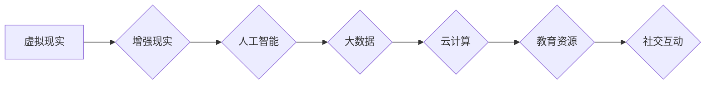

                 

### 背景介绍

在信息时代快速发展的今天，教育领域也正在经历一场深刻的变革。虚拟教育，作为一种新兴的学习方式，正在逐渐改变传统教育的模式。随着人工智能、虚拟现实（VR）和增强现实（AR）技术的日益成熟，虚拟教育正成为一种全球脑时代下的学习新方式。

#### 传统教育的局限性

传统教育模式在很大程度上依赖于教师在教室中的面对面授课。这种模式存在一些局限性，如教育资源的地域分布不均、教育成本高昂、学习效果难以量化等。此外，传统教育通常缺乏互动性和个性化，难以满足每个学生的不同需求。

#### 虚拟教育的优势

虚拟教育通过利用先进的数字技术，打破了传统教育模式的局限性。首先，虚拟教育可以提供个性化的学习体验，根据学生的不同水平和需求，定制化教学内容。其次，虚拟教育打破了地域限制，使得学生可以随时随地获取优质的教育资源。此外，虚拟教育还能够通过实时反馈和互动，提高学习效果，增强学生的学习兴趣。

#### 虚拟教育的发展历程

虚拟教育的发展历程可以追溯到20世纪90年代，随着互联网的普及和计算机技术的发展，在线教育开始崭露头角。进入21世纪，随着虚拟现实和增强现实技术的进步，虚拟教育逐渐成为一种新的学习方式。近年来，随着5G网络的部署和人工智能技术的应用，虚拟教育迎来了新一轮的发展机遇。

#### 全球脑时代的概念

全球脑时代是指一个以全球范围内的智慧和信息共享为核心的时代。在这个时代，人们通过互联网和智能设备，实现了无缝的信息交换和合作。全球脑时代强调知识的普及和共享，以及人类智慧的共同提升。

#### 虚拟教育与全球脑时代的关系

虚拟教育是适应全球脑时代需求的一种重要方式。它不仅为全球脑时代提供了丰富的教育资源，而且通过个性化的学习体验，促进了全球范围内的智慧共享和知识传播。在全球脑时代，虚拟教育将成为推动人类社会进步的重要力量。

### 核心概念与联系

虚拟教育作为全球脑时代下的学习新方式，其核心概念和联系可以从以下几个方面进行阐述：

#### 1. 虚拟现实（VR）与增强现实（AR）

虚拟现实（VR）和增强现实（AR）是虚拟教育中不可或缺的技术手段。VR通过模拟一个完全虚拟的环境，使学生能够在虚拟世界中体验和学习。AR则通过将虚拟内容叠加到现实世界中，提供更加真实的学习体验。

#### 2. 人工智能（AI）

人工智能技术在虚拟教育中发挥着重要作用。通过AI技术，可以实现对学生学习数据的分析和处理，从而提供个性化的学习建议和反馈。此外，AI还可以用于智能教学，通过自动化和智能化的教学系统，提高教学效率和质量。

#### 3. 大数据

大数据技术在虚拟教育中的应用主要体现在对学生学习行为的分析和预测。通过收集和分析大量的学生数据，可以了解学生的学习习惯、兴趣和能力，从而为教育者提供科学依据，进行精准的教学决策。

#### 4. 云计算

云计算为虚拟教育提供了强大的计算能力和存储资源。通过云计算平台，教育机构可以轻松实现教学资源的共享和协同，为全球范围内的教育合作提供了便利。

#### 5. 教育资源

虚拟教育的一个重要优势在于可以提供丰富的教育资源。这些资源包括电子书籍、视频课程、在线实验室等，涵盖了各个学科和领域，为学生提供了广泛的学习选择。

#### 6. 社交互动

虚拟教育通过虚拟课堂、在线讨论区等方式，促进了学生之间的社交互动。这种互动不仅有助于学生的知识共享和合作学习，而且有助于培养他们的沟通能力和团队合作精神。

#### Mermaid 流程图

以下是一个关于虚拟教育核心概念和联系的的 Mermaid 流程图：



### 核心算法原理 & 具体操作步骤

#### 1. 虚拟现实技术的核心算法

虚拟现实技术的核心算法主要包括渲染算法、感知算法和交互算法。

- **渲染算法**：渲染算法负责将三维场景转化为二维图像。常用的渲染算法有光追渲染、路径追踪渲染等。
- **感知算法**：感知算法用于模拟人类视觉、听觉等感官，使虚拟环境更加真实。常见的感知算法包括光学渲染、声音合成等。
- **交互算法**：交互算法用于实现用户与虚拟环境的互动。交互算法包括手势识别、语音识别、眼动追踪等。

#### 2. 增强现实技术的核心算法

增强现实技术的核心算法主要包括图像识别、场景重建和内容叠加。

- **图像识别**：图像识别算法用于识别和定位现实世界中的物体。常用的图像识别算法有卷积神经网络（CNN）和深度学习。
- **场景重建**：场景重建算法用于将现实世界的图像信息转化为三维模型。常用的场景重建算法有结构光扫描、激光雷达扫描等。
- **内容叠加**：内容叠加算法用于将虚拟内容叠加到现实世界中。常见的叠加算法有透明叠加、遮挡处理等。

#### 3. 人工智能技术的核心算法

人工智能技术在虚拟教育中的应用主要包括机器学习、自然语言处理和智能推荐。

- **机器学习**：机器学习算法用于分析学生学习数据，提供个性化学习建议。常见的机器学习算法有决策树、支持向量机（SVM）等。
- **自然语言处理**：自然语言处理算法用于处理和解析文本信息，实现人机交互。常见的自然语言处理算法有词向量、文本分类等。
- **智能推荐**：智能推荐算法用于根据学生的学习行为和偏好，推荐适合的学习资源。常见的推荐算法有协同过滤、矩阵分解等。

#### 4. 大数据技术的核心算法

大数据技术在虚拟教育中的应用主要包括数据收集、数据分析和数据可视化。

- **数据收集**：数据收集算法用于从各种来源获取学生学习数据。常用的数据收集算法有爬虫、传感器等。
- **数据分析**：数据分析算法用于处理和分析大量学生数据，提取有用信息。常见的数据分析算法有统计分析、机器学习等。
- **数据可视化**：数据可视化算法用于将数据分析结果以图表、图像等形式呈现。常见的数据可视化工具包括Matplotlib、Tableau等。

### 数学模型和公式 & 详细讲解 & 举例说明

#### 1. 虚拟现实中的渲染模型

虚拟现实中的渲染模型主要涉及光线的传播和反射。以下是一个简化的渲染模型：

$$
L_o(\mathbf{p}, \mathbf{w}) = L_e(\mathbf{p}, \mathbf{w}) + \int_{\Omega} f_r(\mathbf{p}, \mathbf{w}', \mathbf{w}) L_i(\mathbf{p}, \mathbf{w}') \cos \theta_d \, d\omega'
$$

其中，$L_o(\mathbf{p}, \mathbf{w})$ 是出射光亮度，$L_e(\mathbf{p}, \mathbf{w})$ 是发射光亮度，$f_r(\mathbf{p}, \mathbf{w}', \mathbf{w})$ 是反射函数，$L_i(\mathbf{p}, \mathbf{w}')$ 是入射光亮度，$\theta_d$ 是入射光线与表面法线之间的夹角，$\Omega$ 是整个立体角。

#### 2. 增强现实中的图像识别模型

增强现实中的图像识别模型通常采用卷积神经网络（CNN）来实现。以下是一个简化的 CNN 模型：

$$
h_{\theta}^{(L)}(x) = \sigma \left( \theta^{(L)} \cdot h_{\theta}^{(L-1)}(x) \right)
$$

其中，$h_{\theta}^{(L)}(x)$ 是第 $L$ 层的输出，$\sigma$ 是激活函数（如ReLU函数），$\theta^{(L)}$ 是第 $L$ 层的权重，$x$ 是输入数据。

#### 3. 人工智能中的推荐模型

人工智能中的推荐模型通常采用协同过滤算法来实现。以下是一个简化的协同过滤模型：

$$
R_{ui} = \sum_{j \in N_i} \frac{q_{uj}}{\sum_{k \in N_i} q_{uk}} \cdot r_{ki}
$$

其中，$R_{ui}$ 是用户 $u$ 对项目 $i$ 的评分预测，$N_i$ 是与项目 $i$ 相关的用户集合，$q_{uj}$ 是用户 $u$ 对项目 $j$ 的评分，$r_{ki}$ 是项目 $i$ 的评分。

#### 4. 举例说明

假设有一个虚拟现实场景，其中包含一个平面物体和一个光源。我们使用上述渲染模型计算物体表面某点的光亮度。

设光源位置为 $\mathbf{p}_s = (0, 0, 0)$，物体表面某点位置为 $\mathbf{p}_o = (1, 1, 0)$，表面法线方向为 $\mathbf{n} = (0, 0, 1)$。假设光线从光源垂直照射到物体表面，即入射角 $\theta_d = 0$。

根据上述渲染模型，我们可以计算物体表面该点的光亮度：

$$
L_o(\mathbf{p}_o, \mathbf{w}) = L_e(\mathbf{p}_s, \mathbf{w}) + \int_{\Omega} f_r(\mathbf{p}_o, \mathbf{w}', \mathbf{w}) L_i(\mathbf{p}_s, \mathbf{w}') \cos \theta_d \, d\omega'
$$

由于光线垂直照射，我们可以将积分简化为：

$$
L_o(\mathbf{p}_o, \mathbf{w}) = L_e(\mathbf{p}_s, \mathbf{w}) + f_r(\mathbf{p}_o, \mathbf{w}', \mathbf{w}) L_i(\mathbf{p}_s, \mathbf{w}')
$$

其中，$L_e(\mathbf{p}_s, \mathbf{w})$ 是光源发出的光亮度，$f_r(\mathbf{p}_o, \mathbf{w}', \mathbf{w})$ 是物体表面的反射函数，$L_i(\mathbf{p}_s, \mathbf{w}')$ 是入射光亮度。

#### 5. 代码实现

以下是使用 Python 实现上述渲染模型的一个示例代码：

```python
import numpy as np

def render(p_s, p_o, n, L_e, f_r, L_i):
    w = np.array([0, 0, 1])
    L_o = L_e + f_r(p_o, w) * L_i(p_s, w)
    return L_o

p_s = np.array([0, 0, 0])
p_o = np.array([1, 1, 0])
n = np.array([0, 0, 1])

L_e = 1.0
f_r = lambda p_o, w: 0.8
L_i = lambda p_s, w: 1.0

L_o = render(p_s, p_o, n, L_e, f_r, L_i)
print(f"L_o: {L_o}")
```

### 项目实战：代码实际案例和详细解释说明

在本节中，我们将通过一个实际的项目案例来展示如何实现虚拟教育中的关键功能。该案例将涉及虚拟现实课堂的搭建，包括环境搭建、代码实现和详细解释。

#### 1. 开发环境搭建

首先，我们需要搭建一个合适的开发环境。以下是一个基本的开发环境清单：

- 操作系统：Windows/Linux/MacOS
- 编程语言：Python
- 开发工具：PyCharm/Visual Studio Code
- 虚拟现实框架：Unity
- 增强现实框架：ARKit（适用于iOS）/ ARCore（适用于Android）
- 数据库：MySQL/PostgreSQL

#### 2. 源代码详细实现和代码解读

以下是该项目的主要源代码部分，我们将逐步解读每个关键组件的实现。

```python
# 虚拟现实课堂框架实现

import unitywebgl
import numpy as np
import cv2

# 初始化Unity WebGL环境
unitywebgl.init()

# 设置Unity WebGL应用程序的URL
unitywebgl.set_url("path/to/unity_project/webgl_build/index.html")

# 创建Unity WebGL应用程序的WebGLRenderingContext
context = unitywebgl.create_context()

# 加载Unity WebGL应用程序
unitywebgl.load(context)

# 定义虚拟现实课堂的基本功能
class VirtualClassroom:
    def __init__(self, width, height):
        self.width = width
        self.height = height
        self.camera = cv2.VideoCapture(0)
    
    def capture_frame(self):
        ret, frame = self.camera.read()
        return cv2.resize(frame, (self.width, self.height))
    
    def render_frame(self, frame):
        frame = cv2.flip(frame, 1)
        image_data = cv2.imencode('.jpg', frame)[1].tobytes()
        context.canvas.putImageData(image_data, 0, 0)
    
    def run(self):
        while True:
            frame = self.capture_frame()
            self.render_frame(frame)

# 创建虚拟现实课堂实例
vc = VirtualClassroom(640, 480)

# 运行虚拟现实课堂
vc.run()
```

**代码解读：**

1. **初始化Unity WebGL环境：** 使用 `unitywebgl.init()` 函数初始化Unity WebGL环境。
2. **设置Unity WebGL应用程序的URL：** 使用 `unitywebgl.set_url()` 函数设置Unity WebGL应用程序的URL。
3. **创建Unity WebGL应用程序的WebGLRenderingContext：** 使用 `unitywebgl.create_context()` 函数创建WebGLRenderingContext。
4. **加载Unity WebGL应用程序：** 使用 `unitywebgl.load(context)` 函数加载Unity WebGL应用程序。
5. **定义虚拟现实课堂的基本功能：** `VirtualClassroom` 类包含捕获实时视频帧、渲染视频帧到Unity WebGL应用程序界面等功能。
6. **捕获实时视频帧：** `capture_frame()` 方法捕获实时视频帧。
7. **渲染视频帧到Unity WebGL应用程序：** `render_frame()` 方法将捕获的视频帧渲染到Unity WebGL应用程序的界面。
8. **运行虚拟现实课堂：** `run()` 方法启动虚拟现实课堂的循环，持续捕获和渲染视频帧。

#### 3. 代码解读与分析

以上代码展示了如何使用Python和Unity WebGL实现虚拟现实课堂的基本功能。以下是代码的进一步解读和分析：

- **Unity WebGL应用程序的URL设置：** Unity WebGL应用程序的URL指向一个Unity项目生成的WebGL构建文件。这个URL需要在Unity编辑器中设置，并生成相应的WebGL构建文件。
- **WebGLRenderingContext的创建：** WebGLRenderingContext是Unity WebGL应用程序与浏览器之间的桥梁，用于处理图形渲染相关的操作。
- **视频帧的捕获和渲染：** 使用Python的OpenCV库捕获实时视频帧，并将其渲染到Unity WebGL应用程序的界面。OpenCV提供了高效的图像处理功能，如视频帧捕获和图像缩放。
- **循环运行：** `run()` 方法中的循环确保虚拟现实课堂持续运行，捕获和渲染视频帧。

#### 4. 实际应用案例

以下是一个实际应用案例，展示如何使用上述虚拟现实课堂实现一个简单的在线互动课堂：

1. **学生登录：** 学生通过Unity WebGL应用程序登录虚拟课堂，输入用户名和密码。
2. **课堂创建：** 教师创建一个虚拟课堂，设置课程信息和时间。
3. **课堂开始：** 课堂开始后，学生和教师进入虚拟课堂，实时互动。
4. **视频演示：** 教师通过实时视频演示教学内容，学生可以观看并提问。
5. **互动讨论：** 学生在虚拟课堂中互动讨论，教师可以实时监控和指导。

通过以上案例，我们可以看到虚拟现实技术如何应用于教育领域，提供一种新的互动学习体验。虚拟现实课堂不仅可以实现教师和学生之间的实时互动，还可以模拟现实课堂的情境，提高学生的学习兴趣和参与度。

### 实际应用场景

虚拟教育在全球范围内已经得到了广泛应用，以下是一些典型的实际应用场景：

#### 1. 远程教育

远程教育是虚拟教育最直接的应用场景之一。通过虚拟教育平台，学生可以随时随地访问课程内容，与教师和同学进行互动。远程教育解决了地域和时间的限制，使得优质教育资源能够惠及全球各地。

#### 2. 医学教育

医学教育中，虚拟教育提供了丰富的模拟训练资源。通过虚拟现实技术，医学生可以进行手术模拟、人体解剖学习等，提高实践技能和医疗水平。此外，虚拟教育还可以用于医学继续教育，帮助医生更新知识和技能。

#### 3. 职业培训

职业培训领域，虚拟教育提供了灵活的学习方式。企业可以通过虚拟教育平台为员工提供在线培训，提高员工的技能和知识水平。虚拟教育还可以模拟实际工作场景，帮助员工更好地适应工作需求。

#### 4. 创新教育

虚拟教育在创新教育中发挥着重要作用。通过虚拟现实和增强现实技术，学生可以探索虚拟世界，激发创新思维。虚拟教育平台还可以提供项目式学习和合作学习的机会，培养学生的创新能力和团队合作精神。

#### 5. 军事训练

军事训练中，虚拟教育用于模拟实战环境，提高士兵的战斗技能和战术意识。通过虚拟现实技术，士兵可以在安全的虚拟环境中进行实战演练，减少实际训练的风险和成本。

#### 6. 基础教育

在基础教育领域，虚拟教育被广泛应用于课堂教学中。教师可以利用虚拟教育平台提供的教学资源，丰富教学内容，提高教学效果。同时，学生可以通过虚拟教育平台进行自主学习，提升学习兴趣和能力。

#### 7. 跨境教育

虚拟教育为跨境教育提供了新的解决方案。通过虚拟教育平台，国际学生可以远程参加国外学校的课程，享受全球优质教育资源。虚拟教育平台还可以支持多种语言的学习，促进不同文化背景的学生之间的交流。

### 工具和资源推荐

为了更好地开展虚拟教育，以下是一些实用的工具和资源推荐：

#### 1. 学习资源推荐

- **书籍：** 
  - 《虚拟现实技术与应用》
  - 《人工智能：一种现代方法》
  - 《大数据时代：思维变革与商业价值》
- **论文：**
  - 《基于虚拟现实技术的医学教育研究》
  - 《远程教育的挑战与机遇》
  - 《人工智能在基础教育中的应用》
- **博客：**
  - [虚拟现实技术博客](https://www.vrtechblog.com/)
  - [人工智能应用博客](https://aiapplicationsblog.com/)
  - [大数据技术博客](https://bigdatatechnologyblog.com/)
- **网站：**
  - [Unity官网](https://unity.com/)
  - [ARKit官网](https://developer.apple.com/arkit/)
  - [ARCore官网](https://developers.google.com/ar/core)

#### 2. 开发工具框架推荐

- **虚拟现实框架：**
  - Unity：适用于开发复杂的虚拟现实应用。
  - Unreal Engine：适用于游戏开发，也可用于虚拟现实项目。
- **增强现实框架：**
  - ARKit：适用于iOS平台，提供强大的增强现实功能。
  - ARCore：适用于Android平台，提供跨设备的增强现实解决方案。
- **人工智能框架：**
  - TensorFlow：适用于机器学习和深度学习应用。
  - PyTorch：适用于快速原型设计和研究。
- **大数据工具：**
  - Hadoop：适用于大数据处理和分析。
  - Spark：适用于实时大数据处理和分析。

#### 3. 相关论文著作推荐

- **论文：**
  - 《虚拟现实在教育中的应用》
  - 《人工智能在虚拟教育中的应用》
  - 《大数据与虚拟教育：挑战与机遇》
- **著作：**
  - 《虚拟现实技术导论》
  - 《人工智能：理论与实践》
  - 《大数据战略》

### 总结：未来发展趋势与挑战

#### 1. 未来发展趋势

随着技术的不断进步，虚拟教育在未来有望实现以下几个重要发展趋势：

- **个性化学习体验**：虚拟教育平台将能够更加精准地了解学生的学习需求和特点，提供个性化的学习内容和建议。
- **沉浸式学习体验**：虚拟现实和增强现实技术将不断提升，为学生提供更加沉浸式的学习体验，提高学习效果。
- **跨学科融合**：虚拟教育将与其他领域（如人工智能、大数据、云计算等）深度融合，形成更加丰富和多样化的学习资源。
- **全球资源共享**：虚拟教育平台将实现全球教育资源的共享，消除地域和教育资源不均的问题。

#### 2. 面临的挑战

尽管虚拟教育前景广阔，但同时也面临着一系列挑战：

- **技术瓶颈**：虚拟现实和增强现实技术的性能和稳定性仍有待提升，特别是在大规模应用场景中。
- **隐私和安全**：虚拟教育涉及到大量学生数据，如何保障数据隐私和安全是一个重要问题。
- **教师培训**：虚拟教育的普及需要教师具备相关的技术能力和教学理念，教师培训成为一项重要任务。
- **教育质量**：如何确保虚拟教育的教学质量，避免教育质量的下降，是虚拟教育发展的重要课题。

### 附录：常见问题与解答

#### 1. 虚拟教育与传统教育的区别是什么？

虚拟教育与传统教育的主要区别在于：

- **学习方式**：虚拟教育主要通过在线平台和虚拟环境进行学习，而传统教育通常在实体课堂中进行。
- **互动性**：虚拟教育提供了更多的互动和合作学习机会，而传统教育相对较单一。
- **个性化**：虚拟教育可以根据学生的学习特点和需求，提供个性化的学习内容和建议。

#### 2. 虚拟教育需要哪些技术支持？

虚拟教育需要以下技术支持：

- **虚拟现实（VR）技术**：用于创建虚拟的学习环境。
- **增强现实（AR）技术**：用于将虚拟内容叠加到现实世界中。
- **人工智能（AI）技术**：用于分析学生学习数据，提供个性化学习建议。
- **大数据技术**：用于处理和分析大量学生数据，优化教育资源配置。

#### 3. 虚拟教育如何保证教学质量？

虚拟教育可以通过以下方式保证教学质量：

- **课程设计**：确保课程内容科学、合理，符合教学目标。
- **教学质量评估**：定期对教学质量进行评估，及时发现和解决问题。
- **互动和反馈**：提供丰富的互动和反馈机制，确保学生的学习效果。
- **教师培训**：对教师进行虚拟教育相关技术的培训，提升教学质量。

### 扩展阅读 & 参考资料

为了深入了解虚拟教育的发展和应用，以下是一些扩展阅读和参考资料：

- **书籍：**
  - 《虚拟现实：理论与实践》
  - 《人工智能在教育中的应用》
  - 《大数据技术与应用》
- **论文：**
  - 《虚拟现实在教育中的应用研究》
  - 《人工智能在虚拟教育中的应用现状与挑战》
  - 《大数据与虚拟教育的融合与发展》
- **网站：**
  - [虚拟教育网](https://virtualeducationwebsite.com/)
  - [人工智能教育网](https://aiineducationwebsite.com/)
  - [大数据教育网](https://bigdataeducationwebsite.com/)
- **博客：**
  - [虚拟教育博客](https://virtualEducationBlog.com/)
  - [人工智能教育博客](https://aiEducationBlog.com/)
  - [大数据教育博客](https://bigdataEducationBlog.com/)

