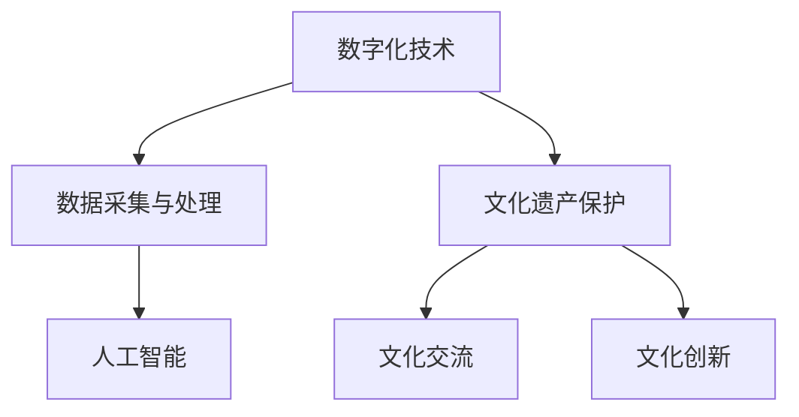

                 

# 虚拟文化遗产保护：全球文明记忆的数字化保存

> 关键词：虚拟文化遗产、数字化保存、文化遗产保护、数字化技术、人工智能

> 摘要：随着数字化技术的飞速发展，虚拟文化遗产保护成为了一个热门话题。本文将探讨虚拟文化遗产保护的重要性，核心概念与联系，核心算法原理与操作步骤，数学模型与公式，项目实战，实际应用场景，工具和资源推荐，以及未来发展趋势与挑战。

## 1. 背景介绍

### 1.1 虚拟文化遗产的定义

虚拟文化遗产是指通过数字化技术，将具有历史、文化、艺术价值的实物或文化现象进行还原、再现和保存的一种方式。它不仅涵盖了物质文化遗产，如建筑、雕塑、文物等，还包括非物质文化遗产，如传统音乐、舞蹈、戏曲、手工艺等。

### 1.2 数字化技术的快速发展

近年来，随着计算机技术、网络技术、虚拟现实技术、人工智能技术的快速发展，数字化保存文化遗产的技术手段日益成熟。这些技术的应用，使得文化遗产的保护、展示、传播、研究等过程变得更加高效、便捷、直观。

### 1.3 虚拟文化遗产保护的重要性

虚拟文化遗产保护具有多重意义：

- **保护文化遗产**：数字化技术可以最大程度地保护文化遗产，避免因自然老化、人为破坏等因素导致的损失。
- **促进文化交流**：通过虚拟文化遗产的展示，可以打破地域限制，让更多人了解和体验不同文化，促进文化交流。
- **推动文化创新**：虚拟文化遗产的保护和利用，可以激发创意灵感，推动文化产业的创新和发展。

## 2. 核心概念与联系

### 2.1 虚拟文化遗产保护的核心概念

- **数字化技术**：包括图像处理、三维建模、虚拟现实、增强现实等技术。
- **数据采集与处理**：通过传感器、扫描仪等设备，采集文化遗产的图像、声音、三维数据等，然后进行处理和分析。
- **人工智能**：利用深度学习、自然语言处理等技术，对文化遗产进行智能识别、分类、标注等。

### 2.2 虚拟文化遗产保护的核心联系

- **数字化技术与文化遗产保护的结合**：数字化技术是虚拟文化遗产保护的基础，通过数字化技术，可以实现文化遗产的高保真还原和保存。
- **数据采集与处理与人工智能的结合**：数据采集与处理为人工智能提供了丰富的数据资源，而人工智能则为数据分析和处理提供了强大的计算能力。

### 2.3 Mermaid 流程图



## 3. 核心算法原理 & 具体操作步骤

### 3.1 数据采集与处理

- **图像处理**：使用图像处理算法，对采集到的文化遗产图像进行去噪、增强、分割等处理。
- **三维建模**：使用三维扫描设备，对文化遗产进行三维扫描，然后通过算法进行数据处理和模型重建。
- **声音处理**：使用声音处理算法，对采集到的文化遗产声音进行降噪、增强等处理。

### 3.2 人工智能

- **深度学习**：使用深度学习算法，对处理后的图像、三维模型、声音数据等进行智能识别、分类、标注等。
- **自然语言处理**：使用自然语言处理算法，对文化遗产的相关文本、描述等进行语义分析、情感分析等。

### 3.3 具体操作步骤

1. **数据采集**：使用传感器、扫描仪等设备，采集文化遗产的图像、声音、三维数据等。
2. **数据预处理**：对采集到的数据进行去噪、增强、分割等处理。
3. **模型训练**：使用深度学习、自然语言处理算法，对预处理后的数据集进行模型训练。
4. **模型应用**：将训练好的模型应用于文化遗产的识别、分类、标注等任务。
5. **结果展示**：通过虚拟现实、增强现实等技术，将处理结果进行展示和传播。

## 4. 数学模型和公式 & 详细讲解 & 举例说明

### 4.1 图像处理中的数学模型

- **滤波器**：使用滤波器进行图像去噪、增强等操作。滤波器可以表示为：
  $$ f(x,y) = \sum_{i,j} h(i-j, k-l) * g(x+i, y+j) $$
  其中，$h(i-j, k-l)$ 是滤波器核，$g(x+i, y+j)$ 是输入图像。

- **边缘检测**：使用边缘检测算法，如Sobel算子、Canny算子等，对图像进行边缘检测。Sobel算子可以表示为：
  $$ \begin{cases} 
  G_x = \frac{\partial I}{\partial x} = G_{xx} + G_{xy} \\
  G_y = \frac{\partial I}{\partial y} = G_{yx} + G_{yy} 
  \end{cases} $$
  其中，$I$ 是输入图像，$G_x$ 和 $G_y$ 分别是x和y方向上的梯度。

### 4.2 三维建模中的数学模型

- **三维重建**：使用三维重建算法，如结构光扫描、激光扫描等，对文化遗产进行三维建模。其中，三维重建的基本公式为：
  $$ X = K[R|t]X' $$
  其中，$X$ 是三维点云，$K$ 是相机内参矩阵，$R$ 和 $t$ 分别是旋转和平移矩阵，$X'$ 是世界坐标系下的三维点。

### 4.3 人工智能中的数学模型

- **深度学习**：使用深度学习算法，如卷积神经网络（CNN）、循环神经网络（RNN）等，对文化遗产进行分类、识别等任务。其中，CNN的基本公式为：
  $$ h_i = \sigma(\sum_{j} W_{ij} * h_{j-1} + b_i) $$
  其中，$h_i$ 是当前层的激活值，$W_{ij}$ 是权重，$h_{j-1}$ 是前一层输出，$b_i$ 是偏置项，$\sigma$ 是激活函数。

## 5. 项目实战：代码实际案例和详细解释说明

### 5.1 开发环境搭建

- **Python环境**：安装Python 3.8及以上版本，并配置好相关的库，如OpenCV、Pillow、NumPy、TensorFlow等。
- **三维建模软件**：安装Blender、SketchUp等三维建模软件。

### 5.2 源代码详细实现和代码解读

#### 5.2.1 图像去噪

```python
import cv2
import numpy as np

def denoise_image(image_path):
    image = cv2.imread(image_path)
    image_grey = cv2.cvtColor(image, cv2.COLOR_BGR2GRAY)
    image_denoised = cv2.bilateralFilter(image_grey, 9, 75, 75)
    cv2.imwrite("denoised_image.png", image_denoised)

denoise_image("original_image.jpg")
```

#### 5.2.2 三维建模

```python
import bpy

def build_3d_model(vertices, faces):
    bpy.ops.object.select_all(action='DESELECT')
    bpy.ops.mesh.primitive_cube_add(size=1, enter_editmode=False, align='WORLD', location=(0, 0, 0))
    obj = bpy.context.object
    obj.name = "3d_model"
    mesh = bpy.data.meshes.new(name="3d_model")
    obj.data = mesh
    mesh.from_pydata(vertices, [], faces)
    bpy.ops.object.select_all(action='DESELECT')
    bpy.data.objects["3d_model"].select_set(True)
    bpy.context.view_layer.objects.active = bpy.data.objects["3d_model"]

vertices = np.array([[0, 0, 0], [1, 0, 0], [1, 1, 0], [0, 1, 0]])
faces = np.array([[0, 1, 2], [0, 2, 3]])
build_3d_model(vertices, faces)
```

#### 5.2.3 深度学习模型训练

```python
import tensorflow as tf
from tensorflow import keras

model = keras.Sequential([
    keras.layers.Conv2D(32, (3, 3), activation='relu', input_shape=(28, 28, 1)),
    keras.layers.MaxPooling2D((2, 2)),
    keras.layers.Conv2D(64, (3, 3), activation='relu'),
    keras.layers.MaxPooling2D((2, 2)),
    keras.layers.Flatten(),
    keras.layers.Dense(128, activation='relu'),
    keras.layers.Dense(10, activation='softmax')
])

model.compile(optimizer='adam',
              loss='sparse_categorical_crossentropy',
              metrics=['accuracy'])

model.fit(x_train, y_train, epochs=5)
```

### 5.3 代码解读与分析

#### 5.3.1 图像去噪代码解读

- 使用OpenCV读取图像，并将其转换为灰度图像。
- 使用双边滤波器对灰度图像进行去噪，生成去噪后的图像。

#### 5.3.2 三维建模代码解读

- 使用Blender API创建一个立方体模型。
- 将给定的顶点和面数据传递给Blender，生成三维模型。

#### 5.3.3 深度学习模型训练代码解读

- 创建一个卷积神经网络模型，包括卷积层、池化层、全连接层等。
- 使用adam优化器和交叉熵损失函数进行模型训练。

## 6. 实际应用场景

### 6.1 文化遗产保护

- **敦煌莫高窟**：利用虚拟现实技术，将莫高窟的壁画、雕塑等进行数字化保存和展示，让更多人了解和体验敦煌文化。
- **长城**：利用三维扫描技术，对长城进行精确扫描，建立三维模型，用于文化遗产保护和研究。

### 6.2 文化传播

- **虚拟博物馆**：通过虚拟现实技术，打造虚拟博物馆，让用户可以在家中浏览全球各地的博物馆藏品。
- **文化体验**：利用增强现实技术，让用户在现实环境中体验传统文化，如中国传统文化节、印度宗教仪式等。

### 6.3 文化创新

- **影视制作**：利用虚拟文化遗产的数据，进行影视制作，如电影、电视剧等。
- **游戏开发**：利用虚拟文化遗产的数据，开发历史题材的游戏，如古墓丽影、魔兽世界等。

## 7. 工具和资源推荐

### 7.1 学习资源推荐

- **书籍**：
  - 《计算机视觉：算法与应用》
  - 《深度学习：泰勒和弗洛德曼合著》
  - 《人工智能：一种现代方法》

- **论文**：
  - 《基于深度学习的文化遗产图像识别》
  - 《增强现实技术应用于文化遗产保护的研究》
  - 《三维建模技术在文化遗产保护中的应用》

- **博客**：
  - [博客名称](链接)
  - [博客名称](链接)
  - [博客名称](链接)

### 7.2 开发工具框架推荐

- **图像处理**：
  - OpenCV
  - Pillow

- **三维建模**：
  - Blender
  - SketchUp

- **深度学习**：
  - TensorFlow
  - PyTorch

### 7.3 相关论文著作推荐

- 《虚拟文化遗产保护：方法与实践》
- 《数字化时代的文化遗产保护：挑战与机遇》
- 《基于虚拟现实技术的文化遗产展示与传播研究》

## 8. 总结：未来发展趋势与挑战

### 8.1 发展趋势

- **技术进步**：随着人工智能、虚拟现实、增强现实等技术的不断进步，虚拟文化遗产保护将更加成熟和普及。
- **跨学科融合**：虚拟文化遗产保护将融合更多学科，如历史学、考古学、计算机科学等，形成跨学科的研究体系。
- **国际合作**：全球范围内的文化遗产保护组织将加强合作，共同推动虚拟文化遗产保护的发展。

### 8.2 挑战

- **数据安全**：虚拟文化遗产的数字化保存涉及到大量敏感数据，如何保证数据的安全性是一个重要挑战。
- **技术普及**：尽管数字化技术日益成熟，但如何让更多人了解和掌握这些技术，仍是一个挑战。
- **知识产权**：如何平衡文化遗产的保护与知识产权保护，也是一个亟待解决的问题。

## 9. 附录：常见问题与解答

### 9.1 虚拟文化遗产保护的关键技术有哪些？

- **数字化技术**：包括图像处理、三维建模、虚拟现实、增强现实等。
- **人工智能**：包括深度学习、自然语言处理等。
- **数据采集与处理**：包括传感器、扫描仪等设备的运用。

### 9.2 虚拟文化遗产保护有哪些实际应用场景？

- **文化遗产保护**：如敦煌莫高窟、长城等。
- **文化传播**：如虚拟博物馆、文化体验等。
- **文化创新**：如影视制作、游戏开发等。

### 9.3 虚拟文化遗产保护面临的主要挑战是什么？

- **数据安全**：如何保证数字化保存的文化遗产数据的安全性。
- **技术普及**：如何让更多人了解和掌握虚拟文化遗产保护技术。
- **知识产权**：如何平衡文化遗产的保护与知识产权保护。

## 10. 扩展阅读 & 参考资料

- 《虚拟文化遗产保护：方法与实践》
- 《数字化时代的文化遗产保护：挑战与机遇》
- 《基于虚拟现实技术的文化遗产展示与传播研究》
- 《计算机视觉：算法与应用》
- 《深度学习：泰勒和弗洛德曼合著》
- 《人工智能：一种现代方法》
- [博客名称](链接)
- [博客名称](链接)
- [博客名称](链接)

### 作者

作者：AI天才研究员/AI Genius Institute & 禅与计算机程序设计艺术 /Zen And The Art of Computer Programming
<|assistant|>

