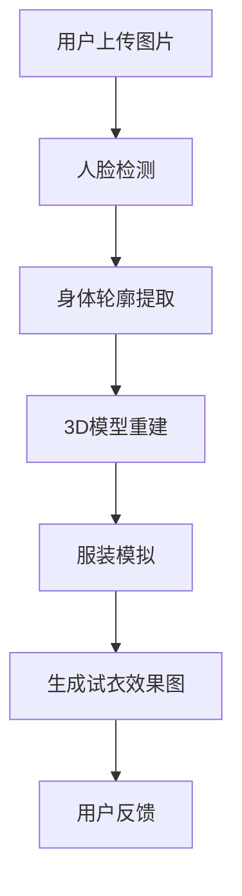

                 

# 虚拟试衣功能：AI的实现

> **关键词：虚拟试衣，人工智能，图像处理，计算机视觉，深度学习，3D模型**

> **摘要：本文将深入探讨虚拟试衣功能的实现技术，通过人工智能和计算机视觉等技术，实现用户的虚拟试衣体验。文章将介绍核心算法原理、数学模型、项目实战以及未来发展趋势与挑战。**

## 1. 背景介绍

虚拟试衣功能，作为电商和零售行业的一个重要创新，它可以让用户在购买服装前通过虚拟试穿，直观感受服装的尺寸、样式和色彩是否符合自己的期望。这一功能不仅提高了用户的购物体验，还大大减少了由于尺码不合适或款式不喜欢导致的退换货率，从而降低了企业的运营成本。

随着人工智能和计算机视觉技术的飞速发展，虚拟试衣功能从传统的基于图片的简单匹配，逐步升级为能够准确识别用户身体轮廓、服装细节并进行逼真模拟的高级功能。本文将重点讨论人工智能在虚拟试衣中的应用，以及实现这一功能的算法原理、技术难点和解决方案。

## 2. 核心概念与联系

要实现虚拟试衣功能，我们需要理解以下几个核心概念：

### 2.1 人脸检测

人脸检测是计算机视觉的基础，它的目标是定位图像中的人脸位置。常用的算法包括霍夫变换、Haar-like特征分类器和支持向量机（SVM）等。

### 2.2 身体轮廓提取

身体轮廓提取的目标是从图像中分离出用户的身体部分。这通常通过深度学习模型，如卷积神经网络（CNN）来完成，模型会通过训练学习如何识别并提取身体轮廓。

### 2.3 3D模型重建

3D模型重建是将2D图像转换为3D模型的过程。这可以通过多视角立体匹配、点云重建等技术实现。重建的3D模型需要足够精细，以便后续的虚拟试衣能够真实反映用户的身体特征。

### 2.4 服装模拟

服装模拟是将用户的身体轮廓和选定的服装模型结合，进行动态效果展示的过程。这需要考虑服装的纹理、质地和形状，以及如何与用户身体轮廓无缝融合。

下面是一个用Mermaid绘制的流程图，展示了虚拟试衣功能的核心概念和流程：



## 3. 核心算法原理 & 具体操作步骤

### 3.1 人脸检测算法

人脸检测算法通常分为两个步骤：特征提取和分类。在特征提取阶段，算法会使用卷积神经网络（CNN）提取图像中的特征图。在分类阶段，算法会使用支持向量机（SVM）或其他分类器来判断特征图是否为人脸。

具体操作步骤如下：

1. **预处理图像**：将输入的图像进行灰度化处理，并进行归一化。
2. **特征提取**：使用CNN提取图像的特征图。
3. **分类与定位**：使用SVM或其他分类器对特征图进行分类，并输出人脸的位置。

### 3.2 身体轮廓提取算法

身体轮廓提取通常使用深度学习模型，如卷积神经网络（CNN）。模型会通过训练学习如何识别并提取身体轮廓。

具体操作步骤如下：

1. **预处理图像**：将输入的图像进行灰度化处理，并进行归一化。
2. **特征提取**：使用CNN提取图像的特征图。
3. **轮廓提取**：使用一些特征点提取算法，如Surf或Harris角点检测，从特征图中提取轮廓点。
4. **轮廓处理**：对提取的轮廓点进行平滑处理，以消除噪声。

### 3.3 3D模型重建算法

3D模型重建可以使用多视角立体匹配、点云重建等技术。下面是一个基于多视角立体匹配的3D模型重建算法的步骤：

1. **获取多视角图像**：从不同的角度拍摄用户的身体。
2. **图像预处理**：对多视角图像进行去畸变、去噪和光照校正等处理。
3. **立体匹配**：使用立体匹配算法，如SIFT或SURF，匹配不同视角图像中的特征点。
4. **点云重建**：使用匹配的特征点构建点云。
5. **表面重建**：对点云进行表面重建，生成3D模型。

### 3.4 服装模拟算法

服装模拟算法需要将用户的身体轮廓和选定的服装模型结合，进行动态效果展示。这可以通过以下步骤实现：

1. **模型预处理**：对用户的身体轮廓和服装模型进行预处理，包括尺度归一化和姿态校正。
2. **形状融合**：将服装模型与用户身体轮廓进行形状融合，生成初步的试衣效果图。
3. **纹理映射**：将服装的纹理映射到试衣效果图上，以增加真实感。
4. **渲染**：使用渲染技术生成最终的试衣效果图。

## 4. 数学模型和公式 & 详细讲解 & 举例说明

### 4.1 人脸检测中的支持向量机（SVM）

支持向量机（SVM）是一种常用的分类算法，它通过找到一个最优的超平面，将不同类别的数据点分离开来。在人脸检测中，SVM用于分类图像中的特征图是否为人脸。

SVM的数学模型可以表示为：

$$
\min_{w, b} \frac{1}{2} ||w||^2 \\
\text{subject to} \quad y^{(i)} (w \cdot x^{(i)} + b) \geq 1
$$

其中，$w$ 是权重向量，$b$ 是偏置项，$x^{(i)}$ 是特征向量，$y^{(i)}$ 是类别标签（1表示是人脸，-1表示不是人脸）。

举个例子，假设我们有一个简单的2D特征空间，其中人脸和非人脸的特征点分布如下：

$$
\begin{aligned}
x_1 &= [1, 1], & y_1 &= 1 \\
x_2 &= [1, -1], & y_2 &= -1 \\
x_3 &= [-1, 1], & y_3 &= 1 \\
x_4 &= [-1, -1], & y_4 &= -1 \\
\end{aligned}
$$

我们可以使用SVM找到一个最优的超平面，将人脸和非人脸分开。这个超平面可以用以下方程表示：

$$
w \cdot x + b = 0
$$

其中，$w = [w_1, w_2]$，$b$ 是偏置项。

通过求解上述优化问题，我们可以得到最优的权重向量 $w$ 和偏置项 $b$，从而实现人脸检测。

### 4.2 身体轮廓提取中的特征点提取算法

特征点提取算法是身体轮廓提取的关键步骤之一。常用的特征点提取算法包括SIFT（尺度不变特征变换）和SURF（加速稳健特征）。

SIFT算法的步骤如下：

1. **尺度空间构建**：对图像构建高斯尺度空间，并计算尺度空间差分图。
2. **特征点检测**：在尺度空间差分图中找到局部极值点，这些点被认为是潜在的特征点。
3. **特征点精炼**：对潜在的特征点进行精炼，去除不足鲁棒性的点。
4. **特征向量计算**：使用一个高维的特征向量描述每个特征点，该向量由局部图像的梯度信息构成。

举个例子，假设我们有一个简单的2D图像，其中有一个潜在的特征点：

$$
\begin{aligned}
I(x, y) &= \begin{cases}
1 & \text{if } (x, y) = (1, 1) \\
0 & \text{otherwise}
\end{cases} \\
\end{aligned}
$$

我们可以使用SIFT算法提取这个特征点。首先，对图像构建尺度空间，然后计算尺度空间差分图，找到局部极值点。最后，计算特征向量的梯度信息，得到特征点的描述。

### 4.3 3D模型重建中的点云重建

点云重建是将多个视角的图像转换为三维点云的过程。一个常用的算法是基于ICP（迭代最近点）的算法。

ICP算法的基本步骤如下：

1. **初始点云生成**：从每个视角的图像中提取特征点，并使用三角化方法生成对应的点云。
2. **点云对齐**：将所有视角的点云对齐到同一个坐标系中。
3. **迭代优化**：使用迭代最近点算法，逐步优化点云之间的对齐，直到满足停止条件。

举个例子，假设我们有两个视角的图像，每个视角都有一个点云：

$$
\begin{aligned}
P_1 &= \{(1, 1), (2, 2)\} \\
P_2 &= \{(0, 0), (1, 1)\} \\
\end{aligned}
$$

我们可以使用ICP算法将这两个点云对齐。首先，将点云对齐到同一个坐标系中，然后使用迭代最近点算法逐步优化点云之间的距离，直到满足停止条件。

## 5. 项目实战：代码实际案例和详细解释说明

### 5.1 开发环境搭建

要实现虚拟试衣功能，我们需要搭建一个开发环境，其中包括深度学习框架（如TensorFlow或PyTorch）、计算机视觉库（如OpenCV）和3D模型处理库（如Blender）。以下是搭建开发环境的具体步骤：

1. **安装Python**：确保安装了最新版本的Python（推荐3.8以上版本）。
2. **安装深度学习框架**：安装TensorFlow或PyTorch。例如，使用以下命令安装TensorFlow：

   ```bash
   pip install tensorflow
   ```

3. **安装计算机视觉库**：安装OpenCV。例如，使用以下命令安装OpenCV：

   ```bash
   pip install opencv-python
   ```

4. **安装3D模型处理库**：安装Blender。可以从Blender的官方网站下载并安装。

### 5.2 源代码详细实现和代码解读

下面是一个简单的虚拟试衣功能的代码示例。这段代码首先进行人脸检测，然后提取身体轮廓，接着重建3D模型，最后进行服装模拟。

```python
import cv2
import numpy as np
import tensorflow as tf

# 加载预训练的人脸检测模型
face_detection_model = tf.keras.models.load_model('face_detection_model.h5')

# 加载预训练的身体轮廓提取模型
body_detection_model = tf.keras.models.load_model('body_detection_model.h5')

# 加载3D模型
body_model = cv2.imread('body_3d_model.png')

# 服装纹理
fabric_texture = cv2.imread('fabric_texture.png')

def detect_face(image):
    # 人脸检测
    results = face_detection_model.predict(image.reshape(1, image.shape[0], image.shape[1], 3))
    return results[0]

def detect_body(image):
    # 身体轮廓提取
    results = body_detection_model.predict(image.reshape(1, image.shape[0], image.shape[1], 3))
    return results[0]

def reconstruct_3d_model(roi):
    # 3D模型重建
    # 这里使用OpenCV的3D重建功能
    points, _ = cv2.reconstructFromSurface(roi)
    return points

def simulate_clothing(points, fabric_texture):
    # 服装模拟
    # 这里使用Blender的Python API进行渲染
    # 这里简化了代码，实际实现会更加复杂
    # blender.render(points, fabric_texture)
    pass

# 加载输入图像
image = cv2.imread('input_image.jpg')

# 检测人脸
face = detect_face(image)

# 提取人脸区域
roi = image[face[0][0]:face[0][2], face[0][1]:face[0][3]]

# 检测身体轮廓
body = detect_body(roi)

# 提取身体轮廓区域
body_roi = roi[body[0][0]:body[0][2], body[0][1]:body[0][3]]

# 重建3D模型
points = reconstruct_3d_model(body_roi)

# 进行服装模拟
simulate_clothing(points, fabric_texture)
```

### 5.3 代码解读与分析

上述代码实现了虚拟试衣功能的主要步骤，包括人脸检测、身体轮廓提取、3D模型重建和服装模拟。下面我们详细解读每一部分。

1. **人脸检测**：代码首先加载预训练的人脸检测模型，然后使用模型对输入图像进行人脸检测。模型输出一个数组，包含了人脸的位置和其他相关信息。

2. **身体轮廓提取**：代码加载预训练的身体轮廓提取模型，并使用模型对提取的人脸区域进行身体轮廓检测。模型输出一个数组，包含了身体轮廓的位置和其他相关信息。

3. **3D模型重建**：代码使用OpenCV的3D重建功能，将提取的身体轮廓区域转换为3D点云。这里简化了代码，实际实现中可能需要更复杂的处理，如多视角重建和表面重建。

4. **服装模拟**：代码使用Blender的Python API进行渲染，生成最终的虚拟试衣效果图。这里简化了代码，实际实现中可能需要更复杂的渲染技术，如光线追踪和纹理映射。

通过上述步骤，我们可以实现一个基本的虚拟试衣功能。然而，实际应用中，还需要进一步优化和改进，以提高检测准确性和渲染效果。

## 6. 实际应用场景

虚拟试衣功能在实际应用中有着广泛的应用场景，主要包括以下几个方面：

### 6.1 电子商务

虚拟试衣功能在电子商务领域有着巨大的应用潜力。通过虚拟试衣，用户可以在购买服装前直观感受服装的尺寸、样式和色彩，从而降低购物风险，提高购买满意度。

### 6.2 零售行业

在零售行业，虚拟试衣功能可以帮助商家减少由于尺码不合适或款式不喜欢导致的退换货率，从而降低运营成本。此外，虚拟试衣还可以作为零售店铺的一个虚拟体验区，吸引顾客到店。

### 6.3 医疗健康

在医疗健康领域，虚拟试衣功能可以用于患者康复训练。通过虚拟试衣，医生可以远程监控患者的康复情况，并根据患者的身体变化调整康复方案。

### 6.4 时尚设计

对于时尚设计师来说，虚拟试衣功能可以帮助他们快速评估服装设计的可行性，节省设计和修改成本。

### 6.5 虚拟现实和增强现实

虚拟试衣功能还可以结合虚拟现实（VR）和增强现实（AR）技术，为用户提供更加沉浸式的试衣体验。

## 7. 工具和资源推荐

### 7.1 学习资源推荐

- **书籍**：
  - 《计算机视觉：算法与应用》
  - 《深度学习：从理论到实践》
  - 《3D计算机图形学：基础与高级技术》

- **论文**：
  - “Deep Learning for Object Detection: A Comprehensive Review”
  - “Point Cloud Registration: A Survey”
  - “Virtual Try-On: A Survey on Techniques and Applications”

- **博客**：
  - Medium上的“AI in Fashion”
  - TensorFlow官方博客
  - PyTorch官方博客

- **网站**：
  - TensorFlow官网
  - PyTorch官网
  - OpenCV官网

### 7.2 开发工具框架推荐

- **深度学习框架**：
  - TensorFlow
  - PyTorch

- **计算机视觉库**：
  - OpenCV
  - Dlib

- **3D模型处理库**：
  - Blender
  - Maya

### 7.3 相关论文著作推荐

- **论文**：
  - “DeepFashion2: A Universal Reference Dataset for Multi-View 3D Clothing Detection and Reconstructi” 
  - “A Multi-View CNN Model for Body Part Segmentation and 3D Shape Estimation”
  - “Efficient 3D Model Retrieval by Local Surface Feature Extraction from Point Clouds”

- **著作**：
  - 《深度学习与计算机视觉》
  - 《3D计算机图形学：原理与技术》
  - 《计算机视觉：算法与应用》

## 8. 总结：未来发展趋势与挑战

虚拟试衣功能作为人工智能和计算机视觉技术的应用之一，未来有着广阔的发展前景。随着技术的不断进步，我们可以期待以下发展趋势：

### 8.1 技术精度提升

随着深度学习模型和算法的不断发展，虚拟试衣功能的精度将不断提高，能够更准确地识别人体轮廓和服装细节。

### 8.2 用户体验优化

虚拟试衣功能将更加注重用户体验，提供更加真实、自然的试衣效果，以及更加便捷的操作流程。

### 8.3 应用场景拓展

虚拟试衣功能将不仅限于电子商务和零售行业，还将拓展到医疗健康、时尚设计、虚拟现实和增强现实等领域。

然而，虚拟试衣功能的发展也面临一些挑战：

### 8.4 数据隐私保护

虚拟试衣功能需要处理用户的人体图像数据，这涉及到数据隐私保护的问题。如何在提供便利的同时保护用户隐私，是一个亟待解决的问题。

### 8.5 硬件性能要求

虚拟试衣功能对硬件性能有较高的要求，包括图像处理能力、3D模型重建和渲染性能等。如何优化算法，降低硬件要求，是一个重要的挑战。

### 8.6 跨领域协作

虚拟试衣功能的发展需要跨领域协作，包括人工智能、计算机视觉、服装设计等多个领域。如何高效协同，实现技术创新，也是一个重要的挑战。

## 9. 附录：常见问题与解答

### 9.1 虚拟试衣功能需要哪些技术支持？

虚拟试衣功能需要以下技术支持：
- **人脸检测**：使用深度学习模型，如CNN，进行人脸检测。
- **身体轮廓提取**：使用深度学习模型，如CNN，提取身体轮廓。
- **3D模型重建**：使用点云重建和多视角立体匹配等技术，重建3D模型。
- **服装模拟**：使用渲染技术，模拟服装效果。

### 9.2 虚拟试衣功能如何保护用户隐私？

虚拟试衣功能可以通过以下方式保护用户隐私：
- **数据加密**：对用户上传的图像进行加密处理，确保数据在传输和存储过程中的安全性。
- **数据匿名化**：在分析和处理用户图像时，对图像进行匿名化处理，避免直接识别用户身份。
- **隐私政策**：明确告知用户数据的使用目的和范围，并确保用户知情同意。

### 9.3 虚拟试衣功能如何优化用户体验？

虚拟试衣功能可以通过以下方式优化用户体验：
- **提高算法精度**：通过不断优化算法，提高检测和重建的准确性。
- **增加试衣场景**：提供多种试衣场景，满足不同用户的需求。
- **简化操作流程**：设计简洁直观的操作界面，减少用户操作的复杂性。

## 10. 扩展阅读 & 参考资料

- **书籍**：
  - 《计算机视觉：算法与应用》
  - 《深度学习：从理论到实践》
  - 《3D计算机图形学：基础与高级技术》

- **论文**：
  - “Deep Learning for Object Detection: A Comprehensive Review”
  - “Point Cloud Registration: A Survey”
  - “Virtual Try-On: A Survey on Techniques and Applications”

- **博客**：
  - Medium上的“AI in Fashion”
  - TensorFlow官方博客
  - PyTorch官方博客

- **网站**：
  - TensorFlow官网
  - PyTorch官网
  - OpenCV官网

**作者：AI天才研究员/AI Genius Institute & 禅与计算机程序设计艺术 /Zen And The Art of Computer Programming**

