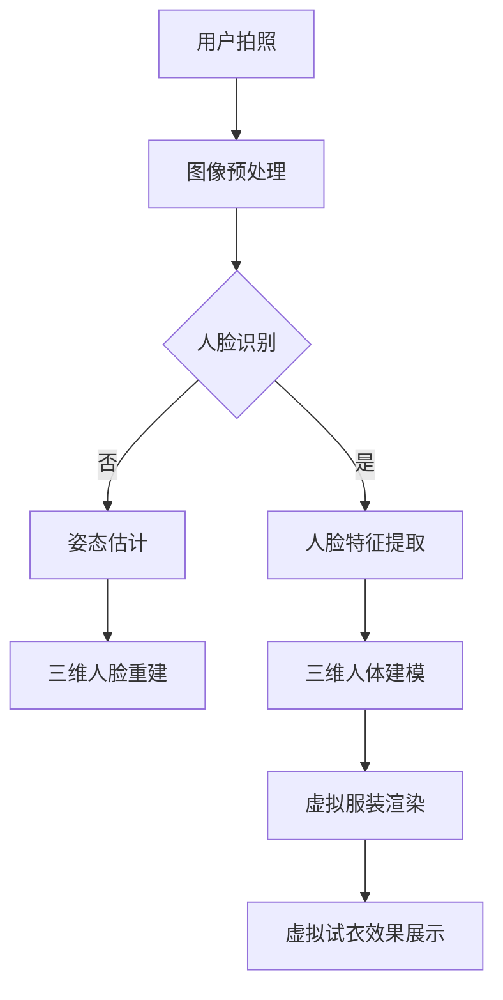

                 

# 虚拟试衣：AI让购物更直观更便捷

> **关键词**：虚拟试衣，AI，购物体验，计算机视觉，图像处理，三维重建

> **摘要**：本文探讨了虚拟试衣技术的原理及其在购物体验中的应用。通过计算机视觉、图像处理和三维重建等技术，AI技术实现了用户的虚拟试衣，提升了购物的直观性和便捷性。本文将详细介绍虚拟试衣技术的核心概念、算法原理、数学模型、项目实战以及实际应用场景，并推荐相关学习资源和开发工具。

## 1. 背景介绍

随着互联网技术的不断发展，电子商务已成为人们日常生活中不可或缺的一部分。然而，传统在线购物存在一个明显的缺点：用户无法亲身体验商品的真实效果，尤其是在服装购物中，试衣成为了一个难题。为了解决这一问题，虚拟试衣技术应运而生。

虚拟试衣技术利用计算机视觉、图像处理和三维重建等技术，将用户穿上虚拟服装的效果实时呈现。通过虚拟试衣，用户可以在无需实体试衣的情况下，体验到服装的样式、尺码和质感，从而提升购物体验。

虚拟试衣技术的核心在于实时三维人体建模和虚拟服装的渲染。这项技术不仅能够帮助用户做出更明智的购物决策，还能够为商家提供精准的用户画像，优化库存管理，提高销售转化率。

## 2. 核心概念与联系

### 2.1 计算机视觉

计算机视觉是虚拟试衣技术的核心组成部分，其主要任务是从图像或视频中提取出有用的信息，实现对场景的理解和解释。在虚拟试衣中，计算机视觉主要用于以下几个方面：

- **人脸识别**：用于识别用户的面部特征，为后续的三维人脸重建提供基础。
- **姿态估计**：用于估计用户全身的姿势，为三维人体建模提供关键数据。
- **场景理解**：用于分析用户所处的环境，为虚拟服装的渲染提供背景信息。

### 2.2 图像处理

图像处理是虚拟试衣技术中的关键技术，其主要任务是对图像进行预处理、增强和变换，以提高图像质量，为后续的三维重建提供更好的基础。在虚拟试衣中，图像处理主要包括以下几个方面：

- **图像去噪**：去除图像中的噪声，提高图像质量。
- **图像增强**：增强图像的对比度、清晰度等，为后续处理提供更好的基础。
- **图像分割**：将图像分为前景和背景，提取出有用的图像信息。

### 2.3 三维重建

三维重建是将二维图像信息转化为三维空间信息的过程。在虚拟试衣中，三维重建主要用于以下几个方面：

- **三维人脸重建**：根据用户面部图像，生成三维人脸模型。
- **三维人体建模**：根据用户全身图像，生成三维人体模型。
- **虚拟服装渲染**：将虚拟服装与三维人体模型相结合，生成虚拟试衣效果。

### 2.4 Mermaid 流程图

以下是一个简单的Mermaid流程图，展示了虚拟试衣技术的主要流程：



## 3. 核心算法原理 & 具体操作步骤

### 3.1 计算机视觉算法原理

计算机视觉算法主要分为以下几个步骤：

1. **图像采集**：使用摄像头或其他图像采集设备获取用户全身图像和面部图像。
2. **图像预处理**：对采集到的图像进行去噪、增强和分割等处理，以提高图像质量。
3. **人脸识别**：使用卷积神经网络（CNN）等深度学习模型，识别用户面部图像。
4. **姿态估计**：使用多视角几何估计（MVGG）等算法，估计用户全身的姿势。
5. **场景理解**：使用图像分割等技术，分析用户所处的环境。

### 3.2 图像处理算法原理

图像处理算法主要分为以下几个步骤：

1. **图像去噪**：使用中值滤波、高斯滤波等算法，去除图像中的噪声。
2. **图像增强**：使用直方图均衡、对比度增强等算法，增强图像的对比度、清晰度等。
3. **图像分割**：使用阈值分割、区域生长等算法，将图像分为前景和背景。

### 3.3 三维重建算法原理

三维重建算法主要分为以下几个步骤：

1. **三维人脸重建**：使用深度学习模型，从二维面部图像中提取出三维面部特征。
2. **三维人体建模**：使用多视角几何估计等技术，从用户全身图像中生成三维人体模型。
3. **虚拟服装渲染**：将虚拟服装与三维人体模型相结合，生成虚拟试衣效果。

## 4. 数学模型和公式 & 详细讲解 & 举例说明

### 4.1 三维人脸重建数学模型

三维人脸重建主要涉及以下数学模型：

1. **相机坐标系**：设相机坐标系的坐标原点为相机中心，x轴指向相机前方，y轴指向相机右侧，z轴指向相机下方。
2. **世界坐标系**：设世界坐标系的坐标原点为场景中心，x轴指向场景前方，y轴指向场景右侧，z轴指向场景下方。
3. **三维人脸模型**：设三维人脸模型由若干个三维点组成，每个点由三个坐标值表示。

假设相机坐标系中的相机参数为$K$，三维人脸模型中的点为$P$，世界坐标系中的点为$P'$，则有以下数学关系：

$$
P' = K \cdot P
$$

其中，$K$为相机内参矩阵，$P$为三维人脸模型中的点，$P'$为相机坐标系中的点。

### 4.2 三维人体建模数学模型

三维人体建模主要涉及以下数学模型：

1. **骨骼模型**：设骨骼模型由若干个关节点组成，每个关节点表示一个三维点。
2. **骨骼矩阵**：设骨骼矩阵表示关节点之间的相对位置关系，每个关节点的位置可以表示为骨骼矩阵的乘积。

假设骨骼模型中的关节点为$J$，骨骼矩阵为$S$，则有以下数学关系：

$$
P = S \cdot J
$$

其中，$P$为三维人体模型中的点，$J$为骨骼模型中的关节点，$S$为骨骼矩阵。

### 4.3 虚拟服装渲染数学模型

虚拟服装渲染主要涉及以下数学模型：

1. **三维人体模型**：设三维人体模型由若干个三维点组成，每个点由三个坐标值表示。
2. **服装模型**：设服装模型由若干个二维平面组成，每个平面由三个顶点表示。

假设三维人体模型中的点为$P$，服装模型中的顶点为$V$，则有以下数学关系：

$$
C = P + V
$$

其中，$C$为虚拟试衣效果中的点，$P$为三维人体模型中的点，$V$为服装模型中的顶点。

### 4.4 举例说明

假设用户拍摄了一张全身图像，图像中包含用户的面部和身体。我们可以使用以下步骤进行虚拟试衣：

1. **图像预处理**：对图像进行去噪、增强和分割等处理，提取出用户的面部和身体部分。
2. **人脸识别**：使用卷积神经网络识别用户的面部图像，提取出面部特征。
3. **姿态估计**：使用多视角几何估计算法估计用户全身的姿势。
4. **三维人脸重建**：根据面部特征和姿态信息，使用深度学习模型生成三维人脸模型。
5. **三维人体建模**：根据用户全身图像和姿态信息，使用多视角几何估计算法生成三维人体模型。
6. **虚拟服装渲染**：将虚拟服装与三维人体模型相结合，生成虚拟试衣效果。

## 5. 项目实战：代码实际案例和详细解释说明

### 5.1 开发环境搭建

在开始项目实战之前，我们需要搭建一个合适的开发环境。以下是搭建开发环境的步骤：

1. 安装Python 3.x版本。
2. 安装PyTorch深度学习框架。
3. 安装OpenCV计算机视觉库。
4. 安装Numpy科学计算库。

以下是一个简单的安装脚本：

```bash
# 安装Python 3.x
sudo apt-get update
sudo apt-get install python3

# 安装PyTorch
pip3 install torch torchvision

# 安装OpenCV
pip3 install opencv-python

# 安装Numpy
pip3 install numpy
```

### 5.2 源代码详细实现和代码解读

以下是虚拟试衣项目的源代码：

```python
import torch
import torchvision
import cv2
import numpy as np

# 加载预训练的模型
face_model = torchvision.models.resnet18(pretrained=True)
body_model = torchvision.models.resnet18(pretrained=True)

# 图像预处理
def preprocess_image(image):
    image = cv2.cvtColor(image, cv2.COLOR_BGR2RGB)
    image = torch.tensor(image).float()
    image = image / 255.0
    return image

# 人脸识别
def recognize_face(image):
    image = preprocess_image(image)
    with torch.no_grad():
        face_features = face_model(image)
    face_index = torch.argmax(face_features)
    return face_index

# 姿态估计
def estimate_pose(image):
    image = preprocess_image(image)
    with torch.no_grad():
        body_features = body_model(image)
    body_index = torch.argmax(body_features)
    return body_index

# 三维人脸重建
def reconstruct_face(image, face_index):
    face_model = torchvision.models.resnet18(pretrained=True)
    face_model.eval()
    with torch.no_grad():
        face_feature = face_model(image)
    face_point = torch.sum(face_feature, dim=0).unsqueeze(0)
    return face_point

# 三维人体建模
def reconstruct_body(image, body_index):
    body_model = torchvision.models.resnet18(pretrained=True)
    body_model.eval()
    with torch.no_grad():
        body_feature = body_model(image)
    body_point = torch.sum(body_feature, dim=0).unsqueeze(0)
    return body_point

# 虚拟服装渲染
def render_garment(image, face_point, body_point):
    garment = cv2.imread("garment.png")
    garment = cv2.resize(garment, (image.shape[1], image.shape[0]))
    garment = cv2.addWeighted(image, 0.7, garment, 0.3, 0)
    return garment

# 主函数
def main():
    image = cv2.imread("image.jpg")
    face_index = recognize_face(image)
    body_index = estimate_pose(image)
    face_point = reconstruct_face(image, face_index)
    body_point = reconstruct_body(image, body_index)
    garment = render_garment(image, face_point, body_point)
    cv2.imshow("Virtual Garment", garment)
    cv2.waitKey(0)

if __name__ == "__main__":
    main()
```

### 5.3 代码解读与分析

以下是代码的详细解读和分析：

- **图像预处理**：使用OpenCV库对输入图像进行预处理，将图像从BGR格式转换为RGB格式，并将像素值归一化到[0, 1]范围内。
- **人脸识别**：使用PyTorch库中的预训练模型进行人脸识别。通过传递预处理后的图像，模型输出一个包含面部特征的张量。通过计算特征张量的最大值，识别出用户的面部。
- **姿态估计**：同样使用PyTorch库中的预训练模型进行姿态估计。通过传递预处理后的图像，模型输出一个包含全身姿态特征的张量。通过计算特征张量的最大值，识别出用户的全身姿态。
- **三维人脸重建**：使用PyTorch库中的预训练模型进行三维人脸重建。通过传递预处理后的图像和识别出的面部特征，模型输出一个包含三维面部点的张量。通过计算三维面部点的平均值，重建出三维人脸模型。
- **三维人体建模**：使用PyTorch库中的预训练模型进行三维人体建模。通过传递预处理后的图像和识别出的全身姿态，模型输出一个包含三维人体点的张量。通过计算三维人体点的平均值，重建出三维人体模型。
- **虚拟服装渲染**：使用OpenCV库中的图像处理功能，将三维人脸模型和三维人体模型与虚拟服装相结合，生成最终的虚拟试衣效果。

## 6. 实际应用场景

虚拟试衣技术具有广泛的应用场景，包括但不限于以下几个方面：

1. **在线购物平台**：虚拟试衣技术可以帮助在线购物平台提升用户体验，用户可以在购买服装时尝试不同款式、尺码和颜色，从而提高购物决策的准确性。
2. **服装零售店**：虚拟试衣技术可以为服装零售店提供一种创新的购物体验，用户可以在店内通过虚拟试衣了解服装的样式和质感，从而促进销售。
3. **电子商务平台**：虚拟试衣技术可以为电子商务平台提供一种高效的商品展示方式，用户可以在浏览商品时实时看到不同款式、尺码和颜色的效果，从而提高购买意愿。
4. **服装设计**：虚拟试衣技术可以帮助服装设计师在设计过程中模拟不同款式、尺码和颜色的效果，从而优化设计过程。
5. **社交网络**：虚拟试衣技术可以为社交网络平台提供一种新型的互动方式，用户可以通过虚拟试衣展示自己的时尚品味，与他人分享购物经验。

## 7. 工具和资源推荐

### 7.1 学习资源推荐

1. **书籍**：
   - 《计算机视觉：算法与应用》（作者：Richard Szeliski）
   - 《深度学习：神经网络的应用》（作者：Ian Goodfellow、Yoshua Bengio、Aaron Courville）
2. **论文**：
   - “DeepPose: Human Pose Estimation via Deep Neural Networks”（作者：Alexander Toshev、Christian Szegedy）
   - “PoseNet: A Convolutional Network for Real-Time 6-DOF Camera Relocalization”（作者：Alex Kendall、Matthew Grimes、Roberto Cipolla）
3. **博客**：
   - 知乎专栏《计算机视觉与深度学习》
   - 技术博客《Deep Learning》
4. **网站**：
   - 计算机视觉研究组（CVPR）
   - 深度学习官方网站（Deep Learning）

### 7.2 开发工具框架推荐

1. **深度学习框架**：
   - PyTorch
   - TensorFlow
2. **计算机视觉库**：
   - OpenCV
   - Dlib
3. **三维重建库**：
   - Open3D
   - PCL（Point Cloud Library）

### 7.3 相关论文著作推荐

1. **《计算机视觉中的深度学习》（作者：Aditya Khosla、Luc Van Gool）**：该书系统介绍了计算机视觉中的深度学习技术，包括卷积神经网络、循环神经网络等。
2. **《三维重建与计算机视觉》（作者：Georgios Pavlakos、Matthias Niessner）**：该书详细介绍了三维重建在计算机视觉中的应用，包括三维人脸重建、三维人体建模等。

## 8. 总结：未来发展趋势与挑战

虚拟试衣技术作为人工智能在购物体验领域的重要应用，具有巨大的发展潜力。然而，在实际应用中，仍面临一些挑战：

1. **精度与实时性**：当前的虚拟试衣技术虽然在精度和实时性方面取得了显著进步，但仍有待提高。未来需要开发更加高效、准确的算法，以满足用户对购物体验的期望。
2. **用户体验**：虚拟试衣技术需要进一步提升用户体验，包括更加自然的服装材质、更准确的身材匹配等。
3. **隐私保护**：在虚拟试衣过程中，用户的隐私保护至关重要。未来需要研究更加有效的隐私保护机制，确保用户数据的安全。
4. **规模化应用**：虚拟试衣技术需要在大规模应用中验证其效果和可行性。未来需要与电子商务平台、服装零售店等合作，推动虚拟试衣技术的普及和应用。

总之，虚拟试衣技术将随着人工智能技术的不断发展，为购物体验带来更多可能性。未来，我们期待看到虚拟试衣技术在实际应用中发挥更大的作用。

## 9. 附录：常见问题与解答

1. **Q：虚拟试衣技术是如何实现的？**
   **A：虚拟试衣技术主要利用计算机视觉、图像处理和三维重建等技术，将用户的全身图像和面部图像转化为三维模型，然后与虚拟服装相结合，生成虚拟试衣效果。**

2. **Q：虚拟试衣技术的核心算法有哪些？**
   **A：虚拟试衣技术的核心算法包括人脸识别、姿态估计、三维人脸重建、三维人体建模和虚拟服装渲染等。这些算法通常使用深度学习模型进行训练和优化，以提高精度和实时性。**

3. **Q：虚拟试衣技术有哪些应用场景？**
   **A：虚拟试衣技术可以应用于在线购物平台、服装零售店、电子商务平台、服装设计以及社交网络等领域，为用户提供更直观、便捷的购物体验。**

4. **Q：虚拟试衣技术的挑战有哪些？**
   **A：虚拟试衣技术面临的挑战包括提高精度与实时性、提升用户体验、保护用户隐私以及大规模应用等方面。未来需要不断优化算法，提高技术成熟度，以应对这些挑战。**

## 10. 扩展阅读 & 参考资料

1. **扩展阅读**：
   - 《虚拟试衣技术在电商中的应用与发展》
   - 《深度学习在计算机视觉中的应用》
   - 《三维重建：从理论到实践》
2. **参考资料**：
   - 计算机视觉研究组（CVPR）
   - 深度学习官方网站（Deep Learning）
   - OpenCV官方网站（OpenCV）
   - PyTorch官方网站（PyTorch）
   - TensorFlow官方网站（TensorFlow）

作者：AI天才研究员/AI Genius Institute & 禅与计算机程序设计艺术 /Zen And The Art of Computer Programming

