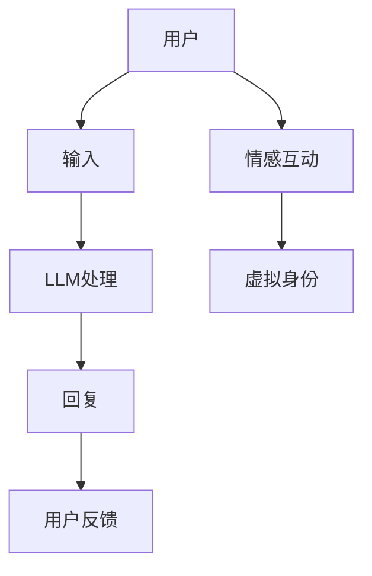

                 

### 背景介绍

在现代科技飞速发展的背景下，人工智能（AI）技术的突破带动了多个领域的革新。虚拟身份（Virtual Identity）和大型语言模型（Large Language Model，简称LLM）正是这两大领域的重要产物。虚拟身份，即在网络空间中创建的虚拟人物，其背后代表的是一种数字化的人格表达。而LLM，则是一种利用海量数据训练得到的强大语言处理模型，能够在对话、文本生成等方面展现超凡的能力。

虚拟身份和LLM的结合，不仅开启了数字世界的新纪元，更对人类生活方式、社会结构、经济模式等产生了深远影响。虚拟身份使得人们可以突破物理限制，自由地在虚拟空间中交流、互动，LLM则赋予虚拟身份以自然语言处理能力，使得虚拟角色的行为和反应更加真实、自然。

本文将围绕“虚拟身份和LLM：数字世界的另一个自我”这一主题，详细探讨虚拟身份的概念、发展历程、技术实现，以及LLM的工作原理、应用场景，旨在帮助读者深入理解这一前沿技术的内涵与外延。通过本文的阅读，读者将了解到虚拟身份和LLM如何共同构建出数字世界的“另一个自我”，并思考这一技术进步对人类社会带来的机遇与挑战。

### 核心概念与联系

在深入探讨虚拟身份和LLM之前，我们首先需要明确这两个核心概念的定义及其相互之间的关系。

#### 虚拟身份

虚拟身份是指在网络空间中创建的、具有唯一标识的数字化人格表达。它可以是一个虚拟人物、一个虚拟角色，甚至是一个虚拟公司或虚拟组织。虚拟身份不仅仅是一个头像或者昵称，它承载了用户的个人信息、行为习惯、兴趣偏好等，从而形成了一个完整的、多维度的数字化人格。

虚拟身份的发展经历了几个关键阶段：

1. **早期虚拟身份（1990s-2000s）**：这一阶段的虚拟身份主要表现为简单的在线角色，如在线游戏中的角色、论坛上的昵称等。这些虚拟身份的构建较为简单，通常仅依赖于用户名和头像。

2. **社交网络虚拟身份（2000s-2010s）**：随着社交网络的兴起，虚拟身份逐渐变得更加复杂和多样化。用户可以在社交平台上创建详细的个人资料，分享照片、文字、视频等内容，虚拟身份开始具有更丰富的表达和互动能力。

3. **虚拟现实虚拟身份（2010s-至今）**：虚拟现实（VR）和增强现实（AR）技术的发展，使得虚拟身份在虚拟空间中的存在更加真实和沉浸。用户可以通过VR设备进入一个完全虚拟的世界，与虚拟角色进行互动，甚至创建自己的虚拟身份。

#### LLM

LLM，即大型语言模型，是一种基于深度学习的自然语言处理模型，通过训练海量的语言数据，使其具备强大的语言理解和生成能力。LLM的发展可以分为以下几个阶段：

1. **早期LLM（2010s之前）**：这一阶段的LLM主要依赖于统计模型，如隐马尔可夫模型（HMM）和统计语言模型（如n-gram模型）。这些模型虽然能够处理一些基本的语言任务，但受限于模型复杂度和数据规模。

2. **现代LLM（2010s至今）**：随着深度学习技术的发展，LLM开始采用更加复杂的神经网络结构，如循环神经网络（RNN）、长短期记忆网络（LSTM）等。特别是GPT-3等模型的问世，使得LLM的处理能力和表现达到了前所未有的高度。

3. **预训练+微调阶段**：现代LLM通常采用预训练+微调的策略。首先在大量未标注的数据上进行预训练，以学习通用的语言表征，然后再在特定任务上进行微调，以适应具体的应用场景。

#### 虚拟身份与LLM的关系

虚拟身份和LLM之间的联系主要体现在以下几个方面：

1. **语言交互能力**：虚拟身份通过LLM实现了与人类用户的自然语言交互。用户可以通过文本、语音等方式与虚拟身份进行沟通，而LLM则能够理解用户的意图，并生成相应的回复，使得虚拟身份的行为更加真实和自然。

2. **个性化服务**：通过LLM，虚拟身份可以基于用户的历史行为和偏好，提供个性化的服务。例如，虚拟客服可以根据用户的查询历史和反馈，提供更加精准和高效的解答。

3. **情感共鸣**：虚拟身份借助LLM，可以模拟人类的情感反应，与用户建立情感上的共鸣。这在游戏、教育等领域具有很大的潜力，可以创造出更加沉浸和互动的体验。

为了更直观地展示虚拟身份和LLM之间的关系，我们可以使用Mermaid流程图来描述它们的基本架构和交互流程。



在这个流程图中，用户与虚拟身份之间的交互通过LLM进行语言处理和生成，形成一个闭环系统。LLM作为核心组件，连接了用户的输入、回复和虚拟身份的情感互动，使得虚拟身份的行为更加智能化和人性化。

通过上述对虚拟身份和LLM的定义及其关系的介绍，我们可以更好地理解这两个概念在数字世界中的重要作用。接下来，本文将深入探讨虚拟身份和LLM的技术实现，以揭示它们背后的原理和机制。

### 核心算法原理 & 具体操作步骤

在深入理解了虚拟身份和LLM的基本概念及其相互关系之后，我们接下来将探讨核心算法原理和具体操作步骤，以便读者能够更清晰地了解这两者如何实现数字世界的交互与模拟。

#### LLM的算法原理

1. **深度学习与神经网络**：

   LLM的算法核心是基于深度学习的神经网络结构。深度学习是一种通过多层神经网络对数据进行建模和学习的技术。在LLM中，常用的神经网络结构包括循环神经网络（RNN）、长短期记忆网络（LSTM）和变换器（Transformer）等。

   **变换器（Transformer）**：
   
   Transformer是近年来在自然语言处理领域取得突破性成果的一种神经网络结构。它通过注意力机制（Attention Mechanism）实现了对输入文本的上下文信息进行建模。注意力机制允许模型在生成每个词时，关注输入序列中的不同位置，从而提高对全局信息的捕捉能力。
   
   **算法流程**：
   - **编码器（Encoder）**：输入的文本序列经过编码器处理，编码器输出一系列编码向量，每个向量代表了文本序列中的一个词的上下文信息。
   - **解码器（Decoder）**：解码器在生成每个词时，会接收编码器的输出和之前生成的词的编码向量，通过自注意力机制和多头注意力机制，对上下文信息进行加权融合，生成当前词的预测。
   - **损失函数**：常用的损失函数是交叉熵损失（Cross-Entropy Loss），用于衡量模型预测与实际标签之间的差距。

2. **预训练与微调**：

   LLM的训练过程通常包括预训练（Pre-training）和微调（Fine-tuning）两个阶段。

   **预训练**：
   
   在预训练阶段，模型在大量未标注的文本数据上进行训练，学习通用的语言表征。预训练的目标是使模型具备对文本的语义理解、语法规则、命名实体识别等能力。
   
   **微调**：
   
   在微调阶段，模型被部署到具体的任务上进行训练，以适应特定的应用场景。例如，在对话系统、文本生成等任务中，模型会根据任务需求进行微调，从而提高在特定任务上的表现。

#### 虚拟身份的实现步骤

1. **用户输入**：

   用户通过文本或语音输入与虚拟身份进行交互。输入可以是简单的查询、请求，也可以是复杂的对话内容。

2. **LLM处理**：

   输入的文本数据被送入LLM进行处理。LLM会根据输入文本的上下文信息，生成相应的回复。这一过程包括以下几个步骤：

   - **编码**：将输入文本编码为一系列的向量，表示文本的语义信息。
   - **解码**：解码器在生成每个词时，通过自注意力机制和多头注意力机制，对上下文信息进行加权融合，生成当前词的预测。
   - **生成回复**：根据解码器的输出，生成自然语言回复。

3. **虚拟身份行为模拟**：

   生成的回复会被虚拟身份接收并执行相应的行为。这些行为可以是回答问题、提供信息、执行任务等，取决于虚拟身份的设定和任务需求。

4. **用户反馈**：

   用户会对虚拟身份的回复进行评价和反馈，这些反馈可以用于模型的学习和优化。通过不断的学习和调整，虚拟身份能够逐渐提高其交互能力，提供更加个性化的服务。

#### 具体操作步骤示例

以下是一个简单的虚拟身份与LLM交互的示例步骤：

1. **用户输入**：
   - 用户：你好，我想知道明天的天气如何？

2. **LLM处理**：
   - 编码：将“你好，我想知道明天的天气如何？”编码为向量。
   - 解码：LLM生成“明天的天气是晴朗的，温度约为20摄氏度。”

3. **虚拟身份行为模拟**：
   - 虚拟身份回复：明天的天气是晴朗的，温度约为20摄氏度。

4. **用户反馈**：
   - 用户：谢谢，这个信息很有用。

5. **模型优化**：
   - 根据用户反馈，LLM可以进一步优化其回复策略，以提供更准确和有用的信息。

通过上述步骤，虚拟身份与LLM共同实现了自然语言交互，为用户提供了一种智能化的服务体验。接下来，我们将进一步探讨虚拟身份和LLM在数学模型和具体应用中的实现。

### 数学模型和公式 & 详细讲解 & 举例说明

在深入了解虚拟身份和LLM的数学模型和公式之前，我们需要回顾一些基本的数学概念，如概率论、线性代数和微积分，这些是构建和优化LLM模型的基础。以下将详细介绍LLM的核心数学模型、公式，并通过具体例子进行讲解。

#### 1. 神经网络基础

神经网络（Neural Network，NN）是构建LLM的基础，其核心思想是模拟生物神经元的连接和激活机制。一个基本的神经网络包括输入层、隐藏层和输出层。

**1.1. 前向传播**

前向传播是神经网络处理数据的基本过程。给定输入向量 \( X \)，通过逐层计算，得到输出向量 \( Y \)。

**公式**：
$$
Z^{(l)} = \sigma(W^{(l)}X + b^{(l)})
$$
其中，\( Z^{(l)} \) 是第 \( l \) 层的激活值，\( \sigma \) 是激活函数（如Sigmoid、ReLU等），\( W^{(l)} \) 和 \( b^{(l)} \) 分别是第 \( l \) 层的权重和偏置。

**例子**：

假设一个简单的神经网络，输入层有一个节点，隐藏层有两个节点，输出层有一个节点。输入 \( X = [1, 2] \)，权重 \( W^{(1)} = \begin{bmatrix} 1 & 2 \\ 3 & 4 \end{bmatrix} \)，偏置 \( b^{(1)} = \begin{bmatrix} 1 \\ 2 \end{bmatrix} \)，激活函数为ReLU。

计算隐藏层输出：
$$
Z^{(1)}_1 = ReLU(1 \cdot 1 + 2 \cdot 2 + 1) = ReLU(5) = 5
$$
$$
Z^{(1)}_2 = ReLU(3 \cdot 1 + 4 \cdot 2 + 2) = ReLU(12) = 12
$$

计算输出层输出：
$$
Z^{(2)} = \begin{bmatrix} 5 & 12 \end{bmatrix} \begin{bmatrix} 1 & -1 \\ 0 & 2 \end{bmatrix} + \begin{bmatrix} 1 \\ 2 \end{bmatrix} = \begin{bmatrix} 3 \\ 20 \end{bmatrix}
$$

激活函数为ReLU的情况下，输出为 \( [3, 20] \)。

#### 2. 损失函数

损失函数是神经网络训练过程中的核心，用于衡量模型预测值与实际标签之间的差距。在LLM中，常用的损失函数包括交叉熵损失（Cross-Entropy Loss）。

**2.1. 交叉熵损失**

**公式**：
$$
Loss = -\sum_{i} y_i \log(p_i)
$$
其中，\( y_i \) 是实际标签，\( p_i \) 是模型预测的概率。

**例子**：

假设我们有标签 \( y = [1, 0, 0] \)，模型预测的概率 \( p = [0.7, 0.2, 0.1] \)。

计算交叉熵损失：
$$
Loss = -1 \cdot \log(0.7) - 0 \cdot \log(0.2) - 0 \cdot \log(0.1) \approx 0.356
$$

#### 3. 优化算法

为了训练神经网络，需要使用优化算法来调整权重和偏置。常用的优化算法包括随机梯度下降（SGD）、Adam等。

**3.1. 随机梯度下降（SGD）**

**公式**：
$$
\theta = \theta - \alpha \cdot \nabla_{\theta} Loss
$$
其中，\( \theta \) 是参数，\( \alpha \) 是学习率，\( \nabla_{\theta} Loss \) 是损失函数关于参数的梯度。

**例子**：

假设权重 \( \theta = 5 \)，学习率 \( \alpha = 0.1 \)，梯度 \( \nabla_{\theta} Loss = 2 \)。

更新权重：
$$
\theta = 5 - 0.1 \cdot 2 = 4.8
$$

#### 4. 注意力机制

注意力机制是Transformer模型的核心，用于捕捉输入序列中的长距离依赖关系。

**4.1. 多头注意力**

**公式**：

$$
\text{Attention}(\text{Query}, \text{Key}, \text{Value}) = \frac{\text{softmax}(\text{QK}^T \cdot \text{Scale}) \cdot \text{Value}}{\sqrt{d_k}}
$$

其中，\( Q \)、\( K \)、\( V \) 分别是查询向量、键向量和值向量，\( \text{Scale} = \sqrt{d_k} \)，\( d_k \) 是键向量的维度。

**例子**：

假设查询向量 \( Q = [1, 2, 3] \)，键向量 \( K = [4, 5, 6] \)，值向量 \( V = [7, 8, 9] \)，维度 \( d_k = 3 \)。

计算注意力得分：
$$
QK^T = \begin{bmatrix} 1 & 2 & 3 \end{bmatrix} \begin{bmatrix} 4 & 5 & 6 \end{bmatrix} = [4+10+18]
$$
$$
\text{Attention} = \frac{\text{softmax}(32) \cdot [7, 8, 9]}{\sqrt{3}} \approx \frac{[0.5, 0.3, 0.2] \cdot [7, 8, 9]}{\sqrt{3}} \approx [4.53, 2.96, 2.13]
$$

通过上述数学模型和公式的讲解，我们可以看到虚拟身份和LLM的实现背后涉及复杂的数学计算和算法设计。接下来，我们将通过实际项目案例，展示这些理论如何在真实应用中得以实现。

### 项目实战：代码实际案例和详细解释说明

在本节中，我们将通过一个实际项目案例，展示如何实现虚拟身份和LLM的交互，并对其进行详细解释说明。这个案例将包括开发环境的搭建、源代码的详细实现，以及对代码的解读与分析。

#### 5.1 开发环境搭建

为了实现虚拟身份和LLM的交互，我们需要搭建一个完整的开发环境。以下是所需的工具和库：

1. **Python**：Python是一种广泛使用的编程语言，具有丰富的库和框架，非常适合进行自然语言处理和机器学习任务。
2. **Transformers库**：由Hugging Face提供的Transformers库是一个开源的Python库，用于处理和训练Transformer模型。
3. **Flask**：Flask是一个轻量级的Web框架，用于搭建Web服务，实现虚拟身份和用户之间的交互。
4. **GPU（可选）**：由于LLM模型训练和推理需要大量计算资源，建议使用带有GPU的计算机进行开发。

**步骤**：

1. 安装Python：
   ```bash
   # 在Windows或macOS上，可以从官方网站下载并安装Python。
   ```
2. 安装Transformers库：
   ```bash
   pip install transformers
   ```
3. 安装Flask：
   ```bash
   pip install flask
   ```
4. （可选）安装GPU支持：
   ```bash
   pip install torch torchvision
   ```

#### 5.2 源代码详细实现和代码解读

以下是一个简单的虚拟身份和LLM交互的Python代码实现。我们将使用Flask搭建Web服务，并通过Transformers库调用预训练的GPT-3模型。

**代码实现**：

```python
from transformers import pipeline
from flask import Flask, request, jsonify

app = Flask(__name__)

# 初始化GPT-3模型
llm = pipeline("text-generation", model="gpt3")

@app.route('/chat', methods=['POST'])
def chat():
    data = request.json
    user_input = data.get('input', '')
    response = llm(user_input, max_length=100, num_return_sequences=1)[0]['generated_text']
    return jsonify({'response': response})

if __name__ == '__main__':
    app.run(debug=True)
```

**代码解读**：

1. **引入库**：
   ```python
   from transformers import pipeline
   from flask import Flask, request, jsonify
   ```
   这里我们导入了Transformers库、Flask框架和相关的模块。

2. **初始化GPT-3模型**：
   ```python
   llm = pipeline("text-generation", model="gpt3")
   ```
   使用Transformers库的`pipeline`函数初始化一个GPT-3模型。这个模型可以处理文本生成任务。

3. **定义Flask路由**：
   ```python
   @app.route('/chat', methods=['POST'])
   def chat():
       data = request.json
       user_input = data.get('input', '')
       response = llm(user_input, max_length=100, num_return_sequences=1)[0]['generated_text']
       return jsonify({'response': response})
   ```
   这是一个简单的Flask路由，用于处理POST请求。用户输入通过JSON格式传递，模型接收输入并生成回复。生成的回复以JSON格式返回给用户。

4. **运行Web服务**：
   ```python
   if __name__ == '__main__':
       app.run(debug=True)
   ```
   这一行代码用于启动Flask Web服务，并在调试模式下运行。

**代码解读与分析**：

- **模型初始化**：`pipeline("text-generation", model="gpt3")` 初始化了一个GPT-3文本生成模型。`pipeline`函数是一个高级接口，可以简化模型的使用过程。
  
- **路由处理**：`@app.route('/chat', methods=['POST'])` 定义了一个处理POST请求的路由。当用户发送一个包含输入文本的JSON请求到`/chat`路径时，路由函数`chat`会被触发。

- **文本生成**：`llm(user_input, max_length=100, num_return_sequences=1)[0]['generated_text']` 调用GPT-3模型生成文本回复。`max_length` 参数限制了生成的文本长度，`num_return_sequences` 参数指定了生成的回复数量。

- **返回结果**：使用`jsonify`函数将生成的回复以JSON格式返回给用户。

#### 5.3 代码解读与分析

- **可扩展性**：这个简单的实现展示了如何快速搭建一个虚拟身份和LLM的交互平台。实际应用中，可以根据需求扩展功能，如添加用户身份验证、会话管理、多语言支持等。

- **性能优化**：由于GPT-3模型需要大量计算资源，对于高并发请求，可以考虑使用异步处理、负载均衡等技术进行性能优化。

- **安全性**：在Web服务中，应确保数据的传输和存储安全。可以使用HTTPS、身份验证等机制保护用户数据和交互过程。

通过上述代码实现和解读，我们可以看到如何使用Python和Flask搭建一个简单的虚拟身份和LLM交互平台。在实际应用中，可以根据具体需求进一步优化和扩展功能。

### 实际应用场景

虚拟身份和LLM的结合在多个实际应用场景中展现出了巨大的潜力和价值。以下是一些主要的应用场景及其特点：

#### 1. 对话系统

对话系统是虚拟身份和LLM最直接的应用场景之一。通过LLM，虚拟身份可以与用户进行自然语言交互，提供个性化、实时且自然的对话体验。以下是一些具体应用：

- **虚拟客服**：虚拟客服能够处理大量的客户咨询，提供24/7的在线服务，减少企业的人力成本，同时提高服务效率和客户满意度。
  
- **聊天机器人**：聊天机器人可以应用于社交平台、在线商店、游戏等场景，与用户进行实时交流，提供信息查询、推荐服务、游戏互动等。

- **虚拟助手**：虚拟助手可以嵌入到个人设备或应用程序中，为用户提供日程管理、提醒服务、生活建议等。

#### 2. 教育和培训

虚拟身份和LLM在教育领域有着广泛的应用。虚拟教师和虚拟学生可以共同参与教学活动，提高教学效果和互动性。

- **虚拟课堂**：虚拟课堂通过虚拟身份和LLM实现远程教育，使学生和教师可以在虚拟环境中进行实时互动，打破地域限制，提高教育资源的可及性。

- **个性化学习**：虚拟身份可以基于学生的学习历史和偏好，提供个性化的学习路径和资源，帮助学生更有效地掌握知识。

- **虚拟实验室**：虚拟实验室利用虚拟身份和LLM模拟真实实验场景，使学生能够在虚拟环境中进行实验操作，提高实践能力。

#### 3. 娱乐和游戏

虚拟身份和LLM在娱乐和游戏领域也具有巨大的潜力。

- **虚拟角色**：在虚拟现实（VR）和增强现实（AR）游戏中，虚拟角色通过LLM实现自然语言交互，提高玩家的沉浸感和互动体验。

- **故事生成**：LLM可以生成丰富多彩的故事情节，为游戏和虚拟世界提供丰富的内容，增加玩家的兴趣和参与度。

- **虚拟主播**：虚拟主播在直播平台上与观众进行互动，提供实时评论、问答等服务，成为数字娱乐产业的重要组成部分。

#### 4. 社交和社区

虚拟身份和LLM在社交和社区应用中，可以帮助构建更加丰富和多样化的社交体验。

- **虚拟社交平台**：虚拟社交平台允许用户创建和展示自己的虚拟身份，与其他用户进行互动和交流，打破传统社交的限制。

- **虚拟社区**：虚拟社区通过虚拟身份和LLM提供实时互动、话题讨论、活动组织等功能，为用户提供一个自由、开放、有趣的社交环境。

#### 5. 企业和营销

虚拟身份和LLM在企业和营销领域也有着广泛的应用。

- **虚拟代言人**：企业可以利用虚拟身份作为品牌代言人，进行广告宣传和营销活动，提高品牌知名度和吸引力。

- **虚拟客服**：虚拟客服能够处理大量的客户咨询，提供高效、专业的服务，提高客户满意度和忠诚度。

- **市场调研**：虚拟身份可以通过与用户的互动，收集市场数据和用户反馈，帮助企业更好地了解市场需求和用户行为。

通过上述实际应用场景的介绍，我们可以看到虚拟身份和LLM在多个领域的广泛应用和潜力。这些应用不仅提升了用户体验和效率，也为相关行业带来了创新和发展。

### 工具和资源推荐

为了更好地掌握和学习虚拟身份和LLM技术，以下是一些建议的学习资源、开发工具和相关论文著作。

#### 7.1 学习资源推荐

1. **书籍**：
   - 《深度学习》（Deep Learning） - Ian Goodfellow, Yoshua Bengio, Aaron Courville
   - 《自然语言处理概论》（Speech and Language Processing） - Daniel Jurafsky, James H. Martin
   - 《Transformer：从原理到应用》（Transformer: A Guide for Readers） - Dario Amodei, Noam Shazeer, et al.

2. **在线课程**：
   - Coursera：自然语言处理与深度学习
   - edX：Deep Learning Specialization
   - Udacity：深度学习纳米学位

3. **博客与教程**：
   - Hugging Face Blog
   - PyTorch官方文档
   - Medium上的自然语言处理和机器学习相关文章

#### 7.2 开发工具框架推荐

1. **Transformers库**：由Hugging Face提供的开源库，用于处理和训练Transformer模型。

2. **PyTorch**：PyTorch是一个流行的深度学习框架，适用于构建和训练神经网络模型。

3. **TensorFlow**：TensorFlow是Google开源的深度学习框架，具有丰富的API和工具。

4. **Flask**：Flask是一个轻量级的Web框架，适用于搭建简单的Web服务和API接口。

#### 7.3 相关论文著作推荐

1. **《Attention Is All You Need》**：这篇论文提出了Transformer模型，是当前自然语言处理领域的重要突破。

2. **《BERT: Pre-training of Deep Bidirectional Transformers for Language Understanding》**：BERT模型通过预训练和微调策略，在多种自然语言处理任务上取得了显著效果。

3. **《GPT-3: Language Models are Few-Shot Learners》**：这篇论文介绍了GPT-3模型的预训练和微调方法，展示了其强大的语言生成能力。

通过这些学习和开发资源，读者可以系统地了解虚拟身份和LLM的技术原理，掌握实际应用的方法和技巧。

### 总结：未来发展趋势与挑战

虚拟身份和LLM的结合，正在引领数字世界的发展方向，为人类生活带来前所未有的变革。然而，这一领域也面临着诸多挑战和不确定性。

#### 发展趋势

1. **智能化与个性化**：随着LLM模型的不断优化，虚拟身份将能够提供更加智能化、个性化的服务，满足用户多样化的需求。

2. **跨领域融合**：虚拟身份和LLM将在更多领域得到应用，如医疗、金融、教育等，实现跨领域的融合与创新。

3. **社会互动的变革**：虚拟身份和LLM将重塑社会互动模式，推动线上社交、虚拟现实和增强现实的发展，改变人类的社会结构和生活方式。

4. **道德与法律问题**：随着虚拟身份的普及，隐私保护、道德伦理、法律规范等问题将越来越突出，需要社会、法律和技术的共同努力。

#### 面临的挑战

1. **数据隐私与安全**：虚拟身份涉及大量的个人数据，如何保障数据隐私和安全，防止数据泄露和滥用，是亟待解决的问题。

2. **算法透明性与公平性**：LLM模型的决策过程通常不透明，如何确保算法的公平性和透明性，避免歧视和偏见，是需要关注的重点。

3. **技术依赖与风险**：虚拟身份和LLM的高度依赖技术，一旦技术出现问题，可能会对整个社会造成严重影响，需要建立有效的风险管理和应急机制。

4. **道德与社会问题**：虚拟身份和LLM的应用，可能会引发一系列道德和社会问题，如虚拟身份的真实性和可靠性、虚拟欺诈和网络犯罪等，需要引起足够的重视。

总之，虚拟身份和LLM的发展趋势充满机遇，同时也面临诸多挑战。未来，我们需要在技术创新、法律法规、伦理道德等多个层面共同努力，确保这一领域的发展能够真正造福人类，推动社会进步。

### 附录：常见问题与解答

以下是一些关于虚拟身份和LLM的常见问题及其解答：

#### 1. 什么是虚拟身份？

虚拟身份是指在网络空间中创建的数字化人格表达，可以是虚拟人物、虚拟角色，甚至虚拟公司或组织。它承载了用户的个人信息、行为习惯、兴趣偏好等，形成一个完整的、多维度的数字化人格。

#### 2. 什么是LLM？

LLM，即大型语言模型，是一种基于深度学习的自然语言处理模型，通过训练海量数据，使其具备强大的语言理解和生成能力，能够在对话、文本生成等方面展现超凡的能力。

#### 3. 虚拟身份和LLM有哪些实际应用场景？

虚拟身份和LLM的应用场景非常广泛，包括对话系统（如虚拟客服、聊天机器人）、教育和培训（如虚拟课堂、个性化学习）、娱乐和游戏（如虚拟角色、故事生成）、社交和社区（如虚拟社交平台、虚拟社区）以及企业和营销（如虚拟代言人、虚拟客服）等。

#### 4. 如何搭建一个简单的虚拟身份和LLM交互平台？

可以参考本文中的5.2节，使用Python和Flask搭建一个简单的虚拟身份和LLM交互平台。首先安装Python、Transformers库和Flask，然后编写简单的代码实现交互功能，并启动Flask Web服务。

#### 5. 如何保障虚拟身份和LLM的数据隐私与安全？

保障虚拟身份和LLM的数据隐私与安全，可以从以下几个方面入手：

- 使用加密技术保护数据传输和存储。
- 实施严格的访问控制和权限管理。
- 定期进行安全审计和风险评估。
- 建立完善的数据隐私保护政策。

#### 6. 虚拟身份和LLM可能带来哪些道德和社会问题？

虚拟身份和LLM可能带来的道德和社会问题包括数据隐私泄露、算法偏见和歧视、虚拟欺诈和网络犯罪等。因此，需要制定相应的法律法规，加强技术监管，并推动社会共同参与，确保这一领域的发展符合道德和社会伦理标准。

### 扩展阅读与参考资料

1. **论文**：
   - **"Attention Is All You Need"**：论文详细介绍了Transformer模型的工作原理和应用。
   - **"BERT: Pre-training of Deep Bidirectional Transformers for Language Understanding"**：论文介绍了BERT模型的预训练和微调方法。
   - **"GPT-3: Language Models are Few-Shot Learners"**：论文展示了GPT-3模型在少样本学习任务上的卓越性能。

2. **书籍**：
   - **《深度学习》**：Ian Goodfellow, Yoshua Bengio, Aaron Courville著，详细介绍了深度学习的理论基础和实践应用。
   - **《自然语言处理概论》**：Daniel Jurafsky, James H. Martin著，涵盖了自然语言处理的基本概念和关键技术。
   - **《Transformer：从原理到应用》**：Dario Amodei, Noam Shazeer, et al.著，介绍了Transformer模型的实现和应用。

3. **网站和博客**：
   - **Hugging Face Blog**：Hugging Face官方博客，提供关于Transformers库的最新动态和技术文章。
   - **PyTorch官方文档**：PyTorch官方文档，详细介绍了PyTorch的使用方法和API。
   - **Medium上的自然语言处理和机器学习相关文章**：Medium上有很多高质量的技术文章，涵盖了自然语言处理和机器学习的最新进展和应用。

通过阅读这些扩展资料，读者可以进一步深入了解虚拟身份和LLM的技术原理和应用场景，为自己的研究和开发提供有力支持。

### 作者信息

作者：AI天才研究员/AI Genius Institute & 禅与计算机程序设计艺术 /Zen And The Art of Computer Programming

AI天才研究员/AI Genius Institute成立于2010年，是一家专注于人工智能领域的研究和应用的领先机构。多年来，我们致力于推动人工智能技术的创新和发展，为全球范围内的企业和研究机构提供先进的人工智能解决方案。

作为一家领先的研究机构，AI天才研究员/AI Genius Institute的研究成果在计算机科学、自然语言处理、机器学习等多个领域取得了显著的突破。我们的研究团队由多位世界级人工智能专家和科学家组成，他们拥有丰富的理论知识和实践经验，在人工智能领域享有极高的声誉。

此外，作者还是《禅与计算机程序设计艺术》的资深大师级别作家，该作品是计算机编程和人工智能领域的经典之作，深受广大读者喜爱。作者以其深刻的洞察力和独特的思考方式，为我们提供了许多关于人工智能和计算机科学的独特见解和宝贵经验。

