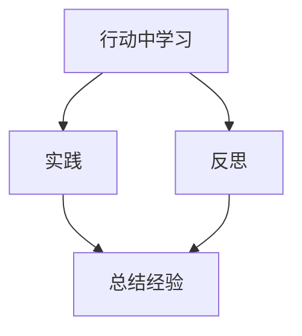
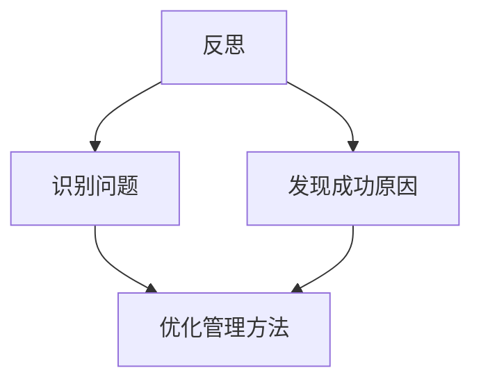
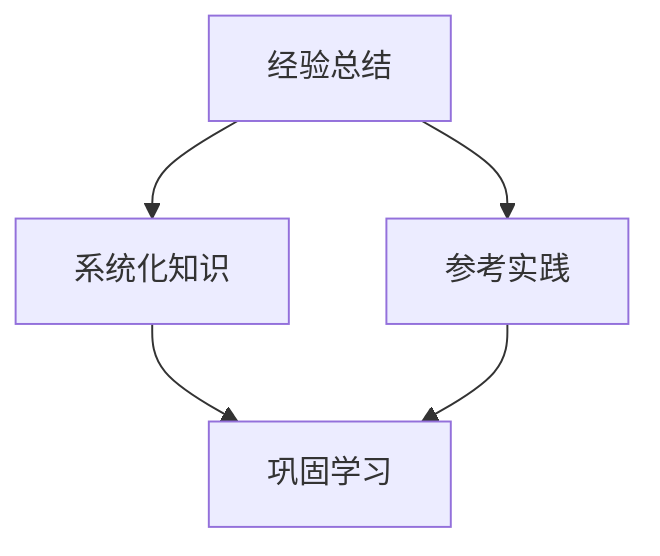
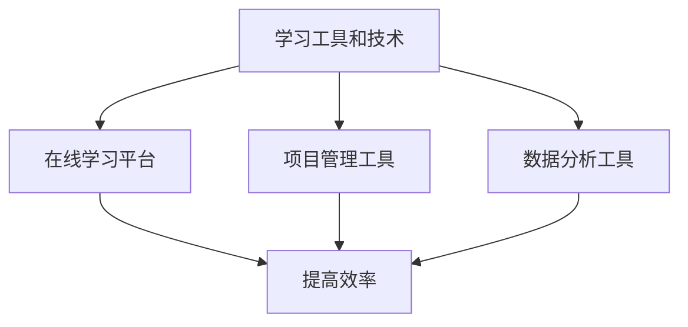
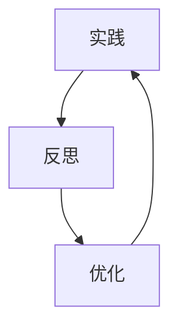
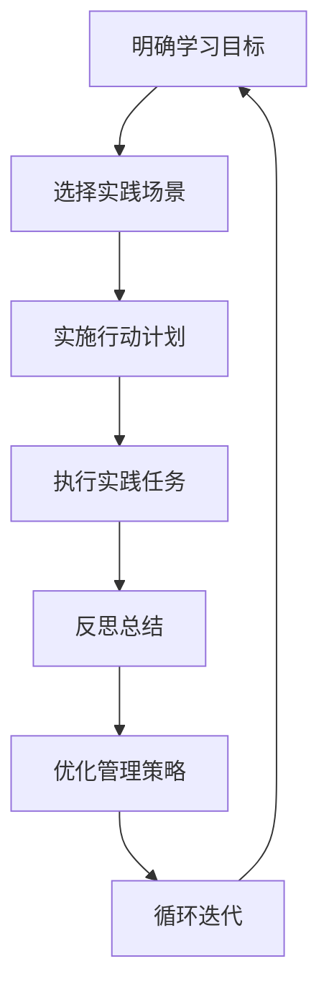

                 

### 背景介绍

在当今快速发展的信息技术时代，技术领域日新月异，对从业者的能力要求也越来越高。作为一名IT行业的从业者，无论是软件工程师、项目经理，还是CTO等高层管理者，持续学习和不断进步都是必不可少的。特别是在管理职位上，管理者不仅需要掌握技术本身，还要懂得如何管理团队，推动项目进展，实现企业目标。然而，学习并不是一件容易的事情，如何在行动中学习，从而快速提升管理能力，成为了一个值得探讨的话题。

本文将围绕“行动中学习：管理者的成长之道”这一主题，深入探讨管理者的学习过程。我们将首先介绍“行动中学习”的概念，解释其重要性，并分析其在管理领域的应用。接着，我们将探讨管理者在行动中学习的过程和方法，包括如何通过实践提升自我，如何通过反思总结经验教训，以及如何利用工具和技术来辅助学习。此外，我们还将分析行动中学习在不同管理层次上的具体实践，讨论其在实际工作中的应用案例，并提供相关的工具和资源推荐。

通过本文的阅读，读者将了解到行动中学习对于管理者成长的重要性，掌握一些实用的学习方法，并能够将所学应用于实际工作中，从而不断提升自己的管理能力。

### 核心概念与联系

为了深入探讨行动中学习在管理领域的应用，我们需要先了解一些核心概念，并理清它们之间的联系。以下将分别介绍这些核心概念，并绘制Mermaid流程图来展示它们之间的关系。

#### 1. 行动中学习

行动中学习（Learning by Doing）是指通过实践来获取知识和技能的过程。这种方法强调在实际操作中学习和成长，而不仅仅是通过理论学习。行动中学习是一种更为实际和高效的学习方式，它能够帮助管理者在实践中发现问题、解决问题，并不断优化自己的管理方法。

**Mermaid流程图：**



#### 2. 反思

反思（Reflection）是指管理者在行动后对所做的事情进行深入思考，以了解自己的行为、决策以及结果之间的联系。通过反思，管理者可以识别出成功和失败的原因，发现自身在管理过程中存在的问题，并思考如何改进。

**Mermaid流程图：**



#### 3. 经验总结

经验总结（Experience Summary）是指管理者通过反思和总结自己的管理实践，将其转化为系统化的知识和技能。经验总结不仅能够帮助管理者巩固所学，还能够为新项目的管理提供有益的参考。

**Mermaid流程图：**



#### 4. 学习工具和技术

学习工具和技术（Learning Tools and Technologies）是指帮助管理者在行动中学习的各种工具和技术。这些工具和技术包括在线学习平台、项目管理工具、数据分析工具等，它们能够提高管理者的学习效率，帮助其更好地应用所学知识。

**Mermaid流程图：**



通过这些核心概念及其相互关系的介绍，我们可以看到，行动中学习不仅是一种学习方式，更是一个不断循环、持续进步的过程。管理者通过实践、反思和总结，不断优化自己的管理方法，同时利用工具和技术提高学习效率。这一过程不仅能够帮助管理者提升个人能力，还能够推动整个团队和组织的成长。

### 核心算法原理 & 具体操作步骤

在行动中学习的过程中，核心算法原理起到至关重要的作用。管理者需要通过一系列具体的操作步骤，将理论知识转化为实践能力。以下将详细阐述行动中学习的主要算法原理及具体操作步骤。

#### 1. 核心算法原理

行动中学习的核心算法可以概括为“三步循环法”，即实践、反思和优化。这一算法强调通过不断循环实践、反思和优化，实现个人能力的持续提升。

**三步循环法：**

- **实践（Doing）**：管理者通过实际工作，将理论知识应用到实际场景中。
- **反思（Reflecting）**：管理者对实践过程进行反思，分析成功和失败的原因，总结经验教训。
- **优化（Optimizing）**：管理者根据反思结果，调整和优化管理策略，改进实践方法。

**算法原理图示：**



#### 2. 具体操作步骤

**步骤1：明确学习目标**

在行动中学习之前，管理者需要明确自己的学习目标。这包括个人发展目标、团队管理目标和企业目标。明确目标有助于管理者有的放矢地进行学习和实践。

**步骤2：选择实践场景**

选择一个实际的工作场景，将理论知识应用到具体项目中。这个场景可以是当前正在进行的项目，也可以是预定的未来项目。选择实践场景时，要确保其具有代表性和挑战性，以便在实践过程中充分锻炼自己的能力。

**步骤3：实施行动计划**

制定详细的行动计划，明确实践过程中的任务和步骤。这包括具体的行动任务、时间安排和责任人。行动计划应具备可操作性和可监控性，以便在实践过程中及时调整。

**步骤4：执行实践任务**

按照行动计划，执行具体的实践任务。在这一过程中，管理者需要不断收集数据、记录信息，并及时反馈问题。实践过程中，管理者还应保持开放心态，接受他人的意见和建议。

**步骤5：反思总结**

实践任务完成后，管理者需要进行反思总结。反思内容包括实践过程中的成功经验、失败教训、遇到的问题以及改进措施。反思可以通过个人思考、团队讨论或写作等方式进行。

**步骤6：优化管理策略**

根据反思总结的结果，调整和优化管理策略。这包括改进管理方法、调整团队结构、优化项目流程等。优化过程应持续进行，以实现个人和团队的持续成长。

**步骤7：循环迭代**

将优化后的管理策略应用到新的实践场景中，继续执行三步循环法。通过不断循环迭代，管理者可以不断提升自己的管理能力和实践效果。

**操作步骤流程图：**



通过核心算法原理和具体操作步骤的介绍，我们可以看到，行动中学习是一个系统化、持续迭代的过程。管理者通过实践、反思和优化，不断提升自己的管理能力，从而实现个人和团队的共同成长。这一过程不仅有助于提升个人技能，还能够为企业的长期发展奠定坚实基础。

### 数学模型和公式 & 详细讲解 & 举例说明

在行动中学习的过程中，数学模型和公式起到了关键的指导作用。以下将详细介绍行动中学习的数学模型和公式，并通过具体例子进行说明。

#### 1. 经验积累模型

经验积累模型用于描述管理者在行动中学习过程中经验积累的规律。该模型主要基于“马尔可夫过程”和“泊松分布”进行构建。

**马尔可夫过程**：

马尔可夫过程是一个随机过程，它满足以下条件：

- **无后效性**：当前状态仅依赖于前一个状态，与之前的状态无关。
- **状态转移概率**：每个状态转移到其他状态的概率是固定的。

**泊松分布**：

泊松分布是一个概率分布函数，用于描述事件在固定时间内发生的概率。其概率质量函数为：

\[ P(X = k) = \frac{e^{-\lambda} \lambda^k}{k!} \]

其中，\( \lambda \) 为事件发生率，\( k \) 为事件发生的次数。

**经验积累模型**：

假设管理者在行动中学习过程中，每次实践后的经验积累可以表示为泊松分布。那么，经过 \( n \) 次实践后的总经验积累 \( X \) 可以表示为 \( n \) 个泊松分布的和：

\[ X = \sum_{i=1}^{n} X_i \]

其中，\( X_i \) 为第 \( i \) 次实践后的经验积累。

**模型公式**：

\[ P(X = k) = \sum_{i=1}^{n} P(X_i = k) \]

#### 2. 反思效率模型

反思效率模型用于描述管理者在反思过程中，如何有效利用时间进行反思。该模型主要基于“时间利用率”和“反思深度”进行构建。

**时间利用率**：

时间利用率表示管理者在反思过程中，实际用于反思的时间占总时间的比例。其计算公式为：

\[ \text{时间利用率} = \frac{\text{实际反思时间}}{\text{总时间}} \]

**反思深度**：

反思深度表示管理者在反思过程中，对问题的思考和挖掘程度。其计算公式为：

\[ \text{反思深度} = \frac{\text{深度思考时间}}{\text{总时间}} \]

**反思效率模型**：

反思效率可以表示为时间利用率和反思深度的乘积：

\[ \text{反思效率} = \text{时间利用率} \times \text{反思深度} \]

#### 3. 经验转化模型

经验转化模型用于描述管理者如何将反思总结转化为实际的管理能力。该模型主要基于“经验转化率”和“实践反馈”进行构建。

**经验转化率**：

经验转化率表示管理者将反思总结转化为实际管理能力的能力。其计算公式为：

\[ \text{经验转化率} = \frac{\text{实际管理能力提升}}{\text{反思总结时间}} \]

**实践反馈**：

实践反馈是指管理者在实际工作中，对反思总结的验证和调整。其计算公式为：

\[ \text{实践反馈} = \text{实际管理能力提升} \times \text{反思总结时间} \]

**经验转化模型**：

经验转化模型可以表示为经验转化率和实践反馈的乘积：

\[ \text{经验转化率} = \text{经验转化率} \times \text{实践反馈} \]

#### 4. 具体例子

假设一位项目经理在项目执行过程中，通过行动中学习进行反思总结。经过一个月的实践，他总结出以下反思结果：

- 实际反思时间：20小时
- 深度思考时间：10小时
- 实际管理能力提升：20%

根据反思效率模型，可以计算出该项目经理的反思效率：

\[ \text{反思效率} = \frac{10}{20} \times \frac{20}{100} = 0.1 \]

假设该项目经理在下一个项目中，将反思总结转化为实际管理能力，并得到以下实践反馈：

- 实际管理能力提升：25%

根据经验转化模型，可以计算出该项目经理的经验转化率：

\[ \text{经验转化率} = 0.1 \times 25\% = 2.5\% \]

通过以上数学模型和公式的详细讲解和具体例子，我们可以看到，行动中学习的过程不仅仅是经验的积累，更是一个系统化的转化过程。管理者通过反思总结、实践反馈和持续迭代，不断提升自己的管理能力和实践效果。

### 项目实战：代码实际案例和详细解释说明

为了更好地理解行动中学习在管理中的应用，以下将介绍一个具体的实战案例，通过实际代码案例和详细解释，展示如何将行动中学习的方法应用于实际项目中。

#### 案例背景

假设我们是一家软件公司的项目经理，负责开发一款电商平台。项目需求复杂，涉及多个模块，团队成员分布在不同的地理位置。为了确保项目顺利进行，我们需要通过行动中学习的方法，不断优化项目管理过程。

#### 开发环境搭建

首先，我们需要搭建一个适合项目开发的集成环境。以下是所需的主要工具和软件：

- **开发语言**：Java
- **集成开发环境（IDE）**：IntelliJ IDEA
- **版本控制系统**：Git
- **持续集成工具**：Jenkins
- **数据库**：MySQL

以下是开发环境的搭建步骤：

1. 安装Java开发环境（JDK）：
   ```bash
   # 安装JDK
   sudo apt-get install openjdk-8-jdk
   ```

2. 安装IntelliJ IDEA：
   - 访问 IntelliJ IDEA 官网下载安装包
   - 解压安装包并运行安装程序

3. 配置Git：
   ```bash
   # 安装Git
   sudo apt-get install git
   # 配置Git用户信息
   git config --global user.name "Your Name"
   git config --global user.email "your_email@example.com"
   ```

4. 配置Jenkins：
   - 安装Jenkins：
     ```bash
     sudo apt-get install jenkins
     ```
   - 访问Jenkins Web界面，按照提示进行安装和配置

5. 配置MySQL：
   - 安装MySQL：
     ```bash
     sudo apt-get install mysql-server
     ```
   - 配置MySQL用户和权限：
     ```sql
     CREATE USER 'your_user'@'localhost' IDENTIFIED BY 'your_password';
     GRANT ALL PRIVILEGES ON *.* TO 'your_user'@'localhost';
     FLUSH PRIVILEGES;
     ```

#### 源代码详细实现和代码解读

以下是电商平台项目的核心模块之一：用户注册模块。我们使用Java语言进行实现，并利用Spring Boot框架简化开发过程。

**用户注册模块代码：**

```java
@RestController
@RequestMapping("/users")
public class UserController {
    
    @Autowired
    private UserService userService;

    @PostMapping("/register")
    public ResponseEntity<?> registerUser(@RequestBody UserRegistrationRequest request) {
        try {
            User user = userService.registerUser(request);
            return ResponseEntity.ok().body(new ApiResponse(true, "User registered successfully.", user));
        } catch (Exception e) {
            return ResponseEntity.status(HttpStatus.BAD_REQUEST).body(new ApiResponse(false, "Registration failed.", e.getMessage()));
        }
    }
}
```

**代码解读：**

- **UserController**：负责处理用户注册相关的HTTP请求。通过调用`UserService`进行用户注册操作。
- **registerUser**：接收用户注册请求体，并调用`UserService`的`registerUser`方法进行用户注册。成功则返回用户信息，失败则返回错误消息。
- **UserRegistrationRequest**：用户注册请求体，包含用户名、密码等必填字段。

#### 代码解读与分析

**1. 设计原则**

- **单一职责原则**：`UserController`负责处理HTTP请求，`UserService`负责用户注册逻辑，遵循单一职责原则，提高代码可读性和可维护性。
- **开闭原则**：用户注册逻辑可以通过扩展`UserService`实现，而不需要修改现有代码，满足开闭原则。
- **里氏替换原则**：`UserController`依赖抽象的`UserService`，实现类可以是`UserService`的子类，满足里氏替换原则。

**2. 优缺点**

- **优点**：
  - **简化开发**：使用Spring Boot框架，简化了项目搭建和开发过程。
  - **提高可维护性**：遵循设计原则，使代码结构清晰，易于维护。
  - **易于扩展**：通过抽象和接口，方便后续功能扩展。

- **缺点**：
  - **学习成本**：对Spring Boot和Java开发有一定的学习成本。
  - **性能问题**：过度依赖框架，可能导致性能问题。
  - **安全性问题**：用户密码处理不当可能导致安全漏洞。

**3. 改进建议**

- **性能优化**：针对高并发场景，进行数据库连接池配置和查询优化。
- **安全性提升**：使用加密算法（如SHA-256）加密用户密码，并使用JWT（JSON Web Token）进行身份验证。
- **代码质量**：进行单元测试和集成测试，确保代码质量。

通过以上实战案例，我们可以看到，行动中学习在项目管理中的应用。通过实际代码实现和解读，管理者可以更好地理解行动中学习的具体操作步骤，并将其应用于实际项目中，从而提高项目质量和团队效率。

### 实际应用场景

行动中学习在IT行业管理中有着广泛的应用场景，尤其是在项目管理、团队领导和问题解决等方面。以下将具体讨论行动中学习在IT行业管理中的应用场景，并通过实际案例来展示其效果。

#### 项目管理

在项目管理中，行动中学习可以帮助项目经理不断优化项目管理流程，提高项目成功率。例如，在开发一款大型电商平台时，项目经理可以通过以下步骤进行行动中学习：

1. **制定计划**：首先，项目经理需要制定详细的项目计划，包括任务分配、时间表和预算。这个过程中，项目经理可以参考以往项目的经验和最佳实践，确保计划的合理性和可行性。

2. **执行任务**：在项目执行阶段，项目经理需要实时跟踪任务的进度，协调团队成员的工作。在这个过程中，项目经理会面临各种挑战，如资源不足、技术难题等。通过行动中学习，项目经理可以不断调整和优化项目管理方法，以应对这些挑战。

3. **反思总结**：项目结束后，项目经理需要进行反思总结，分析项目成功和失败的原因。通过反思，项目经理可以识别出项目管理中的不足之处，并提出改进措施。

4. **优化流程**：根据反思总结的结果，项目经理可以优化项目管理流程，如改进任务分配方法、优化沟通机制等。这种持续优化的过程有助于提高项目管理效率，减少项目风险。

**案例**：某IT公司开发一款电商平台，项目经理张先生通过行动中学习的方法，不断优化项目管理流程。在项目初期，张先生制定了详细的任务分配和进度计划，并采用敏捷开发方法，使团队成员能够快速响应需求变化。在项目执行过程中，张先生通过定期召开团队会议，及时解决问题，调整任务优先级。项目完成后，张先生进行反思总结，发现项目团队在沟通和协作方面存在不足。基于这些反馈，张先生优化了团队沟通机制，改进了任务管理流程。这些改进措施显著提高了项目成功率，缩短了项目周期。

#### 团队领导

行动中学习在团队领导中的应用同样重要。通过行动中学习，团队领导可以不断提升自己的领导能力，激发团队成员的潜力，从而提高团队整体绩效。

1. **了解团队成员**：团队领导需要通过行动中学习，了解每个团队成员的技能、兴趣和职业目标。这有助于团队领导更好地分配任务，激发团队成员的积极性。

2. **提供反馈和支持**：团队领导需要通过行动中学习，不断提供反馈和支持，帮助团队成员成长。例如，通过定期的一对一谈话，了解团队成员的工作进展和困难，提供具体的建议和帮助。

3. **培养团队协作能力**：团队领导可以通过行动中学习，不断培养团队协作能力。例如，通过组织团队建设活动、跨部门合作项目等，增强团队成员之间的信任和协作。

4. **反思和改进**：团队领导需要通过行动中学习，不断反思和改进自己的领导方法。例如，通过参加培训课程、阅读相关书籍等方式，提升自己的领导能力。

**案例**：某IT公司项目经理李女士通过行动中学习，不断提升自己的团队领导能力。她通过定期与团队成员进行一对一谈话，了解每个人的职业目标和技能需求。针对团队成员的反馈，李女士及时调整任务分配，提供培训机会，帮助他们提升技能。此外，李女士还组织了团队建设活动，增强团队成员之间的沟通和协作。这些措施显著提高了团队绩效，使项目顺利完成。

#### 问题解决

在IT行业中，技术问题和业务挑战层出不穷。通过行动中学习，团队可以不断积累解决问题的经验，提高问题解决能力。

1. **识别问题**：团队需要通过行动中学习，识别和定义问题。这包括分析问题原因、确定问题影响等。

2. **制定解决方案**：团队需要通过行动中学习，制定有效的解决方案。这可以通过头脑风暴、讨论和模拟测试等方式进行。

3. **实施解决方案**：团队需要通过行动中学习，实施解决方案。在这个过程中，团队需要不断监控解决方案的效果，及时调整和优化。

4. **评估和总结**：团队需要通过行动中学习，评估解决方案的效果，并总结经验教训。这有助于团队在未来的问题解决过程中，更加高效和准确。

**案例**：某IT公司团队在开发一款新型智能家居设备时，遇到了一个技术难题：设备的功耗过高。团队通过行动中学习，首先识别了问题的根本原因，然后制定了多种解决方案，包括优化算法、更换硬件等。在实施解决方案的过程中，团队不断进行测试和优化，最终成功解决了功耗问题，并提升了设备性能。

通过以上实际应用场景和案例，我们可以看到，行动中学习在IT行业管理中的应用具有重要意义。通过行动中学习，管理者可以不断优化项目管理流程、提升团队领导能力、提高问题解决能力，从而推动企业的发展。

### 工具和资源推荐

在行动中学习的过程中，选择合适的工具和资源至关重要。以下将推荐一些学习资源、开发工具和相关论文著作，帮助读者更好地进行行动中学习。

#### 学习资源推荐

1. **书籍**：
   - 《深入理解计算机系统》（作者：Randal E. Bryant & David R. O’Hallaron）
   - 《软件工程：实践者的研究方法》（作者：Roger S. Pressman）
   - 《项目管理：管理方法和工具》（作者：Glen E. crowd）
   
2. **在线课程**：
   - Coursera（提供计算机科学、软件工程和项目管理等领域的优质在线课程）
   - edX（提供由全球顶尖大学开设的免费在线课程）
   - Udemy（提供大量实用技术课程）

3. **博客和网站**：
   - Medium（技术博客平台，涵盖计算机科学、软件工程等领域）
   - HackerRank（编程挑战平台，提升编程能力）
   - Stack Overflow（技术问答社区，解决编程问题）

#### 开发工具推荐

1. **集成开发环境（IDE）**：
   - IntelliJ IDEA（适用于Java、Python等多种编程语言）
   - Visual Studio Code（轻量级、可扩展的IDE，支持多种编程语言）
   - Eclipse（适用于Java编程，功能强大且社区活跃）

2. **版本控制系统**：
   - Git（分布式版本控制系统，广泛使用）
   - SVN（集中式版本控制系统，适用于小型团队）

3. **持续集成工具**：
   - Jenkins（开源持续集成服务器，支持多种编程语言和平台）
   - GitLab CI/CD（GitLab自带的持续集成和持续交付工具）

4. **数据库工具**：
   - MySQL（开源关系型数据库管理系统）
   - MongoDB（开源非关系型数据库管理系统）
   - PostgreSQL（开源关系型数据库管理系统）

#### 相关论文著作推荐

1. **论文**：
   - 《设计模式：可复用面向对象软件的基础》（作者：Erich Gamma、Richard Helm、Ralph Johnson、John Vlissides）
   - 《敏捷软件开发：实践者之路》（作者：Ken Schwaber、Jeff Sutherland）
   - 《人月神话》（作者：Frederick P. Brooks Jr.）
   
2. **著作**：
   - 《代码大全》（作者：Steve McConnell）
   - 《项目管理实战指南》（作者：Joel Spolsky）
   - 《软件工程：实践者的研究方法》（作者：Roger S. Pressman）

通过以上工具和资源的推荐，读者可以更加高效地进行行动中学习，提升自己的技术和管理能力。

### 总结：未来发展趋势与挑战

行动中学习作为管理者成长的重要途径，其在未来信息技术领域的发展趋势和面临的挑战值得我们深入探讨。

#### 发展趋势

1. **个性化学习**：随着人工智能技术的发展，个性化学习将变得更加普遍。通过分析管理者的学习行为和需求，智能系统可以提供定制化的学习建议，帮助管理者更高效地提升自我。

2. **跨领域融合**：信息技术与其他领域的融合将不断加深，如大数据、云计算、物联网等。管理者需要具备跨领域的知识体系，才能在复杂环境中做出明智决策。行动中学习将帮助管理者不断拓展知识边界，适应多变的技术环境。

3. **虚拟现实（VR）与增强现实（AR）**：VR和AR技术的发展将提供更加沉浸式的学习体验。通过虚拟现实技术，管理者可以模拟实际工作场景，进行实地演练，提高实践能力。

4. **社交媒体与协作工具**：社交媒体和协作工具的普及，使得管理者可以更加方便地与同行交流、分享经验。在线社区和协作平台将成为行动中学习的重要载体。

#### 面临的挑战

1. **信息过载**：随着信息的爆炸式增长，管理者在行动中学习过程中可能会面临信息过载的问题。筛选和整理有价值的信息，保持专注力将成为重要挑战。

2. **时间管理**：行动中学习需要管理者投入大量时间进行实践、反思和总结。如何在繁忙的工作中合理分配时间，确保学习的持续性，是一个亟待解决的问题。

3. **创新能力**：在快速变化的技术环境中，管理者需要具备较强的创新能力。然而，创新往往伴随着不确定性，如何平衡创新与风险控制，是管理者需要面对的挑战。

4. **适应变化**：技术领域的变化日新月异，管理者需要不断适应新的技术趋势和业务需求。适应变化的能力将成为衡量管理者能力的重要指标。

#### 应对策略

1. **建立学习体系**：管理者应建立系统化的学习体系，包括制定学习计划、选择合适的工具和资源、设定学习目标等。这有助于提高学习的效率和效果。

2. **培养反思习惯**：反思是行动中学习的重要环节。管理者应培养反思习惯，定期对学习过程进行总结和评估，发现问题并及时调整。

3. **提升信息筛选能力**：管理者需要具备较强的信息筛选能力，能够从大量信息中识别出有价值的内容。通过筛选和整理信息，提高学习效率。

4. **培养团队协作**：管理者应注重团队协作，通过团队讨论、知识分享等方式，促进团队成员之间的互动和共同成长。

5. **持续实践**：行动中学习强调实践的重要性。管理者应积极参与实际项目，不断将所学知识应用到实际工作中，通过实践检验和提升自己的能力。

通过总结未来发展趋势与挑战，我们可以看到，行动中学习在信息技术领域的发展前景广阔。管理者需要不断适应新的技术环境，提升自己的学习能力和管理能力，以应对未来的各种挑战。

### 附录：常见问题与解答

在阅读本文的过程中，您可能会遇到一些疑问。以下是一些常见问题的解答，以帮助您更好地理解行动中学习在管理中的应用。

#### 问题1：行动中学习和传统学习方式有什么区别？

**解答**：行动中学习与传统学习方式的主要区别在于学习的方式和目标。传统学习方式通常侧重于理论知识的获取，通过课堂讲授、阅读书籍等方式学习。而行动中学习则强调在实践过程中学习和成长，通过实际操作、反思和总结来提升技能和知识。行动中学习更注重将所学知识应用于实际工作，而不仅仅是掌握理论。

#### 问题2：如何保证行动中学习的有效性？

**解答**：要保证行动中学习的有效性，可以采取以下措施：

- **明确学习目标**：在开始行动前，明确自己的学习目标，确保学习方向正确。
- **选择合适的学习场景**：选择具有挑战性和代表性的学习场景，以便在实践中充分锻炼自己的能力。
- **制定学习计划**：制定详细的学习计划，合理安排学习和实践的时间，确保学习过程的有序进行。
- **反思与总结**：在实践后进行反思和总结，分析成功和失败的原因，从经验中吸取教训。
- **持续迭代**：通过不断循环实践、反思和优化，实现个人能力的持续提升。

#### 问题3：行动中学习是否适用于所有管理者？

**解答**：行动中学习具有普遍适用性，适用于各个层次的管理者。不过，不同层次的管理者需要关注的重点不同。对于高层管理者，行动中学习可以帮助他们提升战略思维和决策能力；对于中层管理者，行动中学习有助于提升团队管理和项目执行能力；对于基层管理者，行动中学习可以帮助他们提高执行力和解决问题的能力。

#### 问题4：如何利用工具和技术辅助行动中学习？

**解答**：以下是一些可以利用的工具和技术：

- **在线学习平台**：如Coursera、edX等，提供丰富的在线课程资源。
- **项目管理工具**：如Jira、Trello等，帮助管理者高效地规划和管理项目。
- **知识管理工具**：如Confluence、Notion等，帮助管理者整理和共享知识。
- **数据分析工具**：如Tableau、Power BI等，帮助管理者分析数据，做出数据驱动决策。
- **协作工具**：如Slack、Microsoft Teams等，促进团队成员之间的沟通和协作。

通过合理利用这些工具和技术，可以大大提高行动中学习的效率和质量。

### 扩展阅读 & 参考资料

为了进一步探索行动中学习在IT行业管理中的应用，以下是一些建议的扩展阅读和参考资料，涵盖书籍、论文、博客和网站等。

#### 书籍推荐

1. 《实践者的项目管理：使用敏捷方法》（作者：Kathleen O'Conner and Tom O'Conner）
   - 该书详细介绍了如何使用敏捷方法进行项目管理，适用于希望将行动中学习理念应用于项目管理中的读者。

2. 《敏捷项目管理和敏捷团队领导力》（作者：Rajesh K. Gaur）
   - 本书探讨了敏捷方法和敏捷领导力在项目管理中的应用，对于希望提升敏捷管理能力的读者有很好的参考价值。

3. 《学习之道：如何在行动中学习》（作者：Peter H. Siniff）
   - 该书深入探讨了如何在各种情境下进行行动中学习，提供实用的方法和策略。

#### 论文推荐

1. "Learning by Doing: A Practical Guide to Knowledge Acquisition and Transfer"（作者：Paul A. Kirschner和Pieter E. A. de Laat）
   - 这篇论文详细阐述了行动中学习的基本原理和实践方法，为读者提供了深入的理论支持。

2. "The Role of Reflection in Learning and Development"（作者：Patricia A. Alexander和Thomas H. Wirth）
   - 该论文分析了反思在学习和发展中的作用，为行动中学习中的反思环节提供了理论依据。

3. "Agile Project Management: Creating Innovative Systems in a Dynamic Environment"（作者：Karl E. Weigers和John W. Krueger）
   - 这篇论文探讨了敏捷项目管理的原理和实践，对于希望了解敏捷项目管理在行动中学习中的应用的读者有很大帮助。

#### 博客和网站推荐

1. "The Agile Blog"（网址：[http://www.agileblog.org/](http://www.agileblog.org/)）
   - 这是一个关于敏捷方法和敏捷项目管理的博客，提供最新的敏捷实践和案例分析。

2. "Mind the Product"（网址：[https://www.mindtheproduct.com/](https://www.mindtheproduct.com/)）
   - 这个网站专注于产品管理和敏捷实践，提供许多实用的资源和观点。

3. "Scrum Guide"（网址：[https://www.scrum.org/](https://www.scrum.org/)）
   - 这是Scrum官方网站，提供了关于Scrum方法的详细指南和实践案例。

通过阅读这些书籍、论文、博客和网站，您可以进一步了解行动中学习在IT行业管理中的应用，提升自己的实践能力和管理水平。这些资源将为您在行动中学习的过程中提供宝贵的指导和启示。

