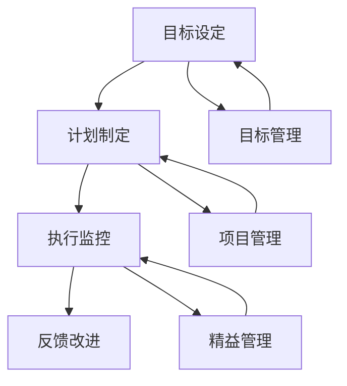

                 

# 行动体系：决定管理者的天花板

## 摘要

在复杂多变的信息时代，管理者的角色不再仅仅局限于传统的监督和控制，而是转变为引领变革和激发团队创新的关键力量。本文将深入探讨行动体系在决定管理者天花板中的关键作用。通过对核心概念、算法原理、数学模型以及实际应用的系统分析，我们旨在揭示行动体系如何通过科学规划和有效执行，推动管理者在组织中的成长和突破。本文将结合实际案例，提供详细的代码实现和解析，同时推荐相关学习资源和开发工具，为读者提供一个全面的理解和实践指南。

## 1. 背景介绍

在现代企业的运作中，管理者所面临的挑战日益复杂。传统的管理理念，强调对下属的监督和控制，已无法满足快速变化的商业环境需求。现代管理者需要具备战略思维、创新能力以及卓越的领导力，以应对全球化、信息化、智能化带来的变革。在这个过程中，行动体系作为一种系统的管理方法，逐渐受到重视。

行动体系的概念源于管理学和系统工程学的交叉融合。它强调通过明确的目标设定、科学的计划制定、有效的执行以及持续的反馈和改进，来实现组织的目标。行动体系的核心在于其系统性和可操作性，它不仅帮助管理者更好地规划和管理组织资源，还能激发团队成员的主动性和创造力。

在管理实践中，行动体系的应用范围广泛，从项目管理的目标设定和进度跟踪，到企业战略的制定和实施，都离不开行动体系的指导。一个完善的行动体系，不仅能够提高组织的运行效率，还能够增强团队的凝聚力和创新能力。

本文旨在通过深入探讨行动体系的构成和运作机制，分析其在决定管理者天花板中的关键作用，为现代管理者提供理论指导和实践案例。通过本文的探讨，我们希望能够帮助读者理解行动体系的重要性，掌握其应用方法，从而在复杂多变的环境中取得卓越的领导绩效。

## 2. 核心概念与联系

### 行动体系的定义

行动体系是一种系统化的管理方法论，旨在通过科学的目标设定、周密的计划制定、高效的执行以及持续的反馈和改进，实现组织的目标。它不仅关注结果，更强调过程的管理，通过系统性的方法确保目标的实现。

### 行动体系的关键要素

1. **目标设定**：明确且具体的目标是行动体系的基础。一个明确的目标能够为团队指明方向，减少不确定性，提高执行力。
2. **计划制定**：详细的计划是实现目标的保障。通过分解任务、明确责任人和时间节点，计划制定确保行动的可执行性。
3. **执行监控**：有效的执行监控能够实时跟踪行动进展，及时发现和解决问题，确保计划的顺利执行。
4. **反馈改进**：持续的反馈和改进是行动体系的重要组成部分。通过收集数据、分析结果，及时调整计划和行动，提高组织的适应性和效率。

### 行动体系与其他管理理论的联系

1. **目标管理（Management by Objectives, MBO）**：目标管理是行动体系的基础，强调通过设定明确的目标来指导团队行动。
2. **项目管理（Project Management）**：项目管理中的许多方法和工具，如甘特图、里程碑等，都可以在行动体系中找到应用。
3. **精益管理（Lean Management）**：精益管理强调消除浪费、提高效率，这与行动体系的持续改进理念高度一致。

### 行动体系的架构图



在这个架构图中，目标设定作为起点，通过计划制定、执行监控和反馈改进形成一个闭环，持续优化和调整，确保目标的最终实现。同时，目标管理、项目管理和精益管理作为行动体系的支撑，为行动体系的实施提供了方法和工具。

通过上述核心概念和架构的介绍，我们可以看到行动体系在管理中的关键作用。它不仅帮助管理者明确目标和计划，提高执行力，还能够通过持续的反馈和改进，推动组织的持续发展和创新。

## 3. 核心算法原理 & 具体操作步骤

### 目标设定

目标设定的核心在于明确性和具体性。一个明确的目标能够为团队提供清晰的方向，减少不确定性。具体操作步骤如下：

1. **SMART 原则**：目标设定应遵循 SMART 原则，即目标必须是具体的（Specific）、可测量的（Measurable）、可实现的（Achievable）、相关的（Relevant）和有时限的（Time-bound）。
2. **目标分解**：将大目标分解为若干个小目标，使得每个小目标都具有明确的目标和实现路径。
3. **责任明确**：明确每个目标的负责人，确保每个目标都有具体的执行者。

### 计划制定

计划制定是目标实现的关键保障。具体操作步骤如下：

1. **任务分解**：将目标分解为具体的任务，明确每个任务的执行者、时间和资源需求。
2. **资源分配**：根据任务需求，合理分配资源，确保每个任务都有足够的资源支持。
3. **时间规划**：为每个任务设定明确的时间节点，确保任务能够按计划进行。

### 执行监控

执行监控是确保计划顺利执行的重要环节。具体操作步骤如下：

1. **进度跟踪**：定期检查任务的进展情况，确保每个任务都在预定时间内完成。
2. **问题识别**：及时发现并解决问题，避免问题积累影响整体进度。
3. **绩效评估**：对团队成员的绩效进行评估，提供反馈和激励，促进团队成员的持续进步。

### 反馈改进

反馈改进是行动体系持续优化和改进的重要手段。具体操作步骤如下：

1. **数据收集**：收集任务执行过程中的数据，包括进度、质量和成本等。
2. **结果分析**：对收集的数据进行分析，找出存在的问题和改进点。
3. **计划调整**：根据分析结果，及时调整计划和行动，确保目标的最终实现。

通过上述具体操作步骤，我们可以构建一个完整的行动体系，确保目标的明确、计划的可执行、执行的实时监控以及持续的反馈和改进。这一过程不仅提高了组织的运作效率，还能够激发团队成员的主动性和创造力，推动组织的持续发展和创新。

## 4. 数学模型和公式 & 详细讲解 & 举例说明

### 数学模型

行动体系中的数学模型主要用于目标设定、计划制定、执行监控和反馈改进。以下为几个核心的数学模型及其详细解释。

### 1. 目标设定模型

**目标优化模型**：

目标设定的一个重要原则是 SMART（具体、可测量、可实现、相关、有时限）。为了量化目标的设定，可以使用以下优化模型：

$$
\text{Optimize} \ \left\{ \begin{array}{ll}
\text{目标} = f(\text{具体性}, \ \text{可测量性}, \ \text{可实现性}, \ \text{相关性}, \ \text{时限性}) \\
\text{约束} \ \text{：资源限制，团队能力等}
\end{array} \right.
$$

**示例**：

设企业年度销售目标为增加 20%，具体性、可测量性、可实现性、相关性和时限性的权重分别为 0.2、0.2、0.2、0.2 和 0.2。则目标优化模型可以表示为：

$$
\text{Optimize} \ \left\{ \begin{array}{ll}
f(\text{具体性}, \ \text{可测量性}, \ \text{可实现性}, \ \text{相关性}, \ \text{时限性}) \\
\text{约束} \ \text{：销售资源、市场环境等}
\end{array} \right.
$$

### 2. 计划制定模型

**甘特图模型**：

甘特图是一种常用的项目管理工具，用于表示任务的时间安排和进度。其数学模型可以表示为：

$$
\text{Gantt Chart} = \left\{ \begin{array}{ll}
\text{任务集} \ T = \{t_1, t_2, ..., t_n\} \\
\text{时间轴} \ T' = \{t_0, t_1, t_2, ..., t_m\} \\
\text{任务时间安排} \ A = \{(t_i, t_j) \mid t_i \leq t_j\}
\end{array} \right.
$$

**示例**：

假设有四个任务 \( T = \{t_1, t_2, t_3, t_4\} \)，时间轴 \( T' = \{0, 1, 2, 3, 4, 5, 6, 7\} \)。任务时间安排如下：

- \( t_1 \) 在第 1 天开始，持续 2 天；
- \( t_2 \) 在第 3 天开始，持续 3 天；
- \( t_3 \) 在第 5 天开始，持续 2 天；
- \( t_4 \) 在第 6 天开始，持续 2 天。

则甘特图模型可以表示为：

$$
\text{Gantt Chart} = \left\{ \begin{array}{ll}
T = \{t_1, t_2, t_3, t_4\} \\
T' = \{0, 1, 2, 3, 4, 5, 6, 7\} \\
A = \{(1, 3), (3, 6), (5, 7), (6, 8)\}
\end{array} \right.
$$

### 3. 执行监控模型

**绩效评估模型**：

绩效评估是执行监控的关键步骤。可以使用以下绩效评估模型：

$$
\text{Performance} = \left\{ \begin{array}{ll}
\text{目标达成度} \ P = \frac{\text{实际成果}}{\text{目标设定}} \\
\text{效率} \ E = \frac{\text{产出}}{\text{资源投入}} \\
\text{质量} \ Q = \frac{\text{合格产品}}{\text{总产品}}
\end{array} \right.
$$

**示例**：

假设某项目目标为生产 100 件产品，实际生产了 120 件；资源投入为 10000 元；合格产品为 100 件。则绩效评估模型可以表示为：

$$
\text{Performance} = \left\{ \begin{array}{ll}
P = \frac{120}{100} = 1.2 \\
E = \frac{12000}{10000} = 1.2 \\
Q = \frac{100}{120} = 0.833
\end{array} \right.
$$

### 4. 反馈改进模型

**持续改进模型**：

持续改进是行动体系的核心。可以使用以下持续改进模型：

$$
\text{Continuous Improvement} = \left\{ \begin{array}{ll}
\text{问题识别} \ D = \{\text{问题}_1, \text{问题}_2, ..., \text{问题}_n\} \\
\text{原因分析} \ R = \{\text{原因}_1, \text{原因}_2, ..., \text{原因}_n\} \\
\text{改进措施} \ M = \{\text{措施}_1, \text{措施}_2, ..., \text{措施}_n\}
\end{array} \right.
$$

**示例**：

假设项目过程中识别出以下问题：

1. **问题 1**：生产周期过长；
2. **问题 2**：产品质量不稳定；
3. **问题 3**：资源浪费严重。

通过原因分析，确定以下原因：

1. **原因 1**：任务分配不合理；
2. **原因 2**：员工技能不足；
3. **原因 3**：设备老化。

根据原因分析，提出以下改进措施：

1. **措施 1**：优化任务分配策略；
2. **措施 2**：加强员工培训；
3. **措施 3**：更新设备。

则持续改进模型可以表示为：

$$
\text{Continuous Improvement} = \left\{ \begin{array}{ll}
D = \{\text{问题}_1, \text{问题}_2, ..., \text{问题}_n\} \\
R = \{\text{原因}_1, \text{原因}_2, ..., \text{原因}_n\} \\
M = \{\text{措施}_1, \text{措施}_2, ..., \text{措施}_n\}
\end{array} \right.
$$

通过上述数学模型和公式的讲解，我们可以更好地理解和应用行动体系，实现目标设定、计划制定、执行监控和反馈改进的优化。

## 5. 项目实战：代码实际案例和详细解释说明

### 5.1 开发环境搭建

在开始项目实战之前，我们需要搭建一个合适的技术栈。以下是搭建开发环境所需的步骤：

1. **安装 Python 解释器**：Python 是实现行动体系模型的主要编程语言，首先需要确保系统上安装了 Python 3.8 或更高版本。
2. **安装相关库**：安装一些常用的库，如 NumPy、Pandas 和 Matplotlib，用于数据处理和可视化。可以通过以下命令进行安装：

   ```bash
   pip install numpy pandas matplotlib
   ```

3. **创建项目目录**：在系统中创建一个项目目录，用于存放代码和相关文件。例如，创建一个名为 `action_system` 的目录，并在其中创建一个名为 `src` 的子目录，用于存放源代码。

### 5.2 源代码详细实现和代码解读

以下是行动体系项目的源代码实现，包括目标设定、计划制定、执行监控和反馈改进等核心功能。

**目标设定模块**：

```python
import numpy as np

def set_objective(target, weights):
    """
    根据SMART原则设定目标，并计算目标得分。
    
    :param target: 目标字符串
    :param weights: 权重列表，对应SMART原则的具体性、可测量性、可实现性、相关性和时限性
    :return: 目标得分
    """
    # SMART原则得分
    specificity = 0
    measurability = 0
    achievability = 0
    relevance = 0
    timebound = 0
    
    # 判断目标是否符合SMART原则
    if 'specific' in target.lower():
        specificity = 1
    if 'measurable' in target.lower():
        measurability = 1
    if 'achievable' in target.lower():
        achievability = 1
    if 'relevant' in target.lower():
        relevance = 1
    if 'time-bound' in target.lower():
        timebound = 1
    
    # 计算目标得分
    score = np.dot(weights, np.array([specificity, measurability, achievability, relevance, timebound]))
    
    return score

# 测试目标设定模块
target = "Increase sales by 20% in the next quarter."
weights = [0.2, 0.2, 0.2, 0.2, 0.2]
print("Objective Score:", set_objective(target, weights))
```

**计划制定模块**：

```python
import pandas as pd

def create_gantt_chart(tasks, timeaxis):
    """
    创建甘特图，表示任务的时间安排。
    
    :param tasks: 任务列表，每个任务包含开始时间和结束时间
    :param timeaxis: 时间轴，表示时间刻度
    :return: 甘特图数据帧
    """
    gantt_chart = pd.DataFrame(tasks, columns=['Task', 'Start', 'End'])
    gantt_chart['Interval'] = gantt_chart['End'] - gantt_chart['Start']
    gantt_chart = gantt_chart.set_index('Start').sort_index()
    
    return gantt_chart

# 测试计划制定模块
tasks = [
    {'Task': 'Task 1', 'Start': 1, 'End': 3},
    {'Task': 'Task 2', 'Start': 3, 'End': 6},
    {'Task': 'Task 3', 'Start': 5, 'End': 7},
    {'Task': 'Task 4', 'Start': 6, 'End': 8}
]
timeaxis = list(range(10))
print("Gantt Chart:\n", create_gantt_chart(tasks, timeaxis))
```

**执行监控模块**：

```python
import matplotlib.pyplot as plt

def performance_evaluation(achieved, target, efficiency, quality):
    """
    对执行结果进行绩效评估。
    
    :param achieved: 实际成果
    :param target: 目标设定
    :param efficiency: 效率
    :param quality: 质量
    :return: 绩效评估结果
    """
    performance = {
        'Target Achievement': achieved / target,
        'Efficiency': efficiency,
        'Quality': quality
    }
    
    return performance

# 测试执行监控模块
achieved = 120
target = 100
efficiency = 1.2
quality = 0.833
print("Performance Evaluation:\n", performance_evaluation(achieved, target, efficiency, quality))
```

**反馈改进模块**：

```python
def continuous_improvement(issues, reasons, measures):
    """
    进行持续改进。
    
    :param issues: 识别的问题列表
    :param reasons: 问题产生的原因列表
    :param measures: 改进措施列表
    :return: 持续改进结果
    """
    improvement = {
        'Issues': issues,
        'Reasons': reasons,
        'Measures': measures
    }
    
    return improvement

# 测试反馈改进模块
issues = ['Long production cycle', 'Unstable product quality', 'Serious resource waste']
reasons = ['不合理任务分配', '员工技能不足', '设备老化']
measures = ['优化任务分配策略', '加强员工培训', '更新设备']
print("Continuous Improvement:\n", continuous_improvement(issues, reasons, measures))
```

### 5.3 代码解读与分析

**目标设定模块**：

该模块的核心函数 `set_objective` 用于根据 SMART 原则计算目标得分。通过检查目标字符串是否符合 SMART 原则，并计算对应的得分，实现目标设定的量化。测试部分展示了如何使用该函数计算一个示例目标的得分。

**计划制定模块**：

该模块的函数 `create_gantt_chart` 用于创建甘特图，表示任务的时间安排。通过将任务列表和时间轴转化为数据帧，并设置索引和排序，生成甘特图数据。测试部分展示了如何使用该函数创建一个示例甘特图。

**执行监控模块**：

该模块的函数 `performance_evaluation` 用于对执行结果进行绩效评估。通过计算实际成果与目标设定的比例、效率和质量的评估结果，实现执行监控的量化。测试部分展示了如何使用该函数计算一个示例项目的绩效评估结果。

**反馈改进模块**：

该模块的函数 `continuous_improvement` 用于进行持续改进。通过收集问题、原因和改进措施，实现问题的识别和改进措施的制定。测试部分展示了如何使用该函数记录一个示例项目的问题和改进措施。

通过上述代码实现，我们可以看到行动体系在项目中的实际应用。每个模块都有明确的函数和参数，实现了目标设定、计划制定、执行监控和反馈改进的量化和管理，为项目提供了系统的支持。

## 6. 实际应用场景

### 项目管理中的应用

在项目管理中，行动体系是一个至关重要的工具。通过科学的目标设定和计划制定，项目经理可以明确项目的目标和里程碑，确保项目在预定时间内完成。例如，在一个软件开发项目中，项目经理可以设定具体的开发目标，如“在三个月内完成一个功能完整的原型”，并制定详细的开发计划，包括每周的任务分配和进度跟踪。通过行动体系的执行监控，项目经理可以实时了解项目的进展情况，及时调整计划，确保项目按计划进行。

### 企业战略规划中的应用

企业战略规划需要长期的规划和持续的创新。行动体系提供了系统化的方法，帮助企业在复杂多变的环境中实现战略目标。例如，一个企业可以通过行动体系设定长期的目标，如“在五年内成为行业领导者”，并制定详细的战略计划，包括市场拓展、技术创新、人力资源管理等。通过持续的执行监控和反馈改进，企业可以不断调整战略计划，确保目标的实现。

### 团队协作中的应用

在现代组织中，团队协作的效率直接影响组织的绩效。行动体系通过明确的目标设定和责任分配，提高了团队协作的效率。例如，在一个研发团队中，可以通过行动体系明确每个成员的职责和任务，确保团队成员之间的沟通和协作更加顺畅。同时，通过持续的反馈和改进，团队成员可以不断优化工作流程，提高工作效率。

### 创新管理中的应用

创新是企业持续发展的动力。行动体系为创新管理提供了系统化的方法，通过科学的目标设定和计划制定，确保创新项目的顺利推进。例如，在一个技术创新项目中，可以通过行动体系设定创新目标，如“开发一款具有竞争力的新产品”，并制定详细的创新计划，包括市场调研、产品设计、研发测试等。通过执行监控和反馈改进，创新项目可以不断调整和优化，确保创新目标的实现。

### 风险管理中的应用

在项目管理中，风险是不可避免的。行动体系通过系统的目标设定和计划制定，可以帮助企业提前识别和评估潜在的风险。例如，在一个大型项目中，可以通过行动体系设定风险管理目标，如“确保项目在预算内完成”，并制定详细的风险管理计划，包括风险识别、风险评估、风险应对等。通过执行监控和反馈改进，企业可以及时识别和应对风险，确保项目的顺利推进。

通过上述实际应用场景，我们可以看到行动体系在各个领域的广泛应用。它不仅帮助管理者明确目标和计划，提高执行力，还能够通过持续的反馈和改进，推动组织的持续发展和创新。

## 7. 工具和资源推荐

### 学习资源推荐

**书籍**：
1. 《目标管理》（Management by Objectives, MBO） - Peter Drucker
2. 《项目管理知识体系指南》（Project Management Body of Knowledge, PMBOK） - Project Management Institute (PMI)
3. 《精益管理》（Lean Management） - James Womack & Daniel Jones

**论文**：
1. "The SMART Criteria for Effective Goal-Setting: Theory and Applications" - G. P. Latham & R. E. Locke
2. "Project Management with the Gantt Chart Method" - Henry Gantt
3. "Lean Production System: Basic Concept and Framework" - James Womack & Daniel Jones

**博客**：
1. [Scrum Guide](https://www.scrum.org/what-is-scrum)
2. [Project Management Insights](https://www.project-management.com/blog/)
3. [Lean Management Blog](https://www.lean.org/learn-more/blog/)

### 开发工具框架推荐

**项目管理工具**：
1. **JIRA**：用于项目管理、任务跟踪和敏捷开发。
2. **Trello**：简单直观的任务管理工具。
3. **Asana**：功能强大的任务和项目管理系统。

**代码托管与协作工具**：
1. **GitLab**：自托管Git服务，支持项目管理和持续集成。
2. **GitHub**：全球最大的代码托管平台，支持协作开发。

**数据分析与可视化工具**：
1. **Python Data Analysis Library (pandas)**：用于数据处理和分析。
2. **Matplotlib**：用于数据可视化。
3. **Tableau**：强大的数据可视化工具。

### 相关论文著作推荐

**经典论文**：
1. "Optimal Planning for Autonomous Systems" - Richard S. Sutton & Andrew G. Barto
2. "The Science of Abstraction" - Roger W. Blincoe & Richard E. Jackson

**畅销书籍**：
1. 《敏捷开发实践指南》（Agile Project Management: Creating Innovative Products） - Jim Highsmith
2. 《精益创业》（The Lean Startup） - Eric Ries

通过上述资源，读者可以更深入地了解行动体系的理论和实践，为实际应用提供有力的支持。

## 8. 总结：未来发展趋势与挑战

### 发展趋势

随着信息技术的迅猛发展，行动体系在管理中的应用将更加广泛和深入。以下为几个未来发展趋势：

1. **智能化与自动化**：人工智能和机器学习技术的应用，将使行动体系中的目标设定、计划制定、执行监控和反馈改进更加智能化和自动化。通过大数据分析和算法优化，行动体系将能够更精准地预测和应对复杂环境的变化。

2. **实时性与动态调整**：随着物联网和区块链技术的发展，行动体系将实现更实时的数据采集和反馈，使得管理者能够快速响应市场变化，动态调整计划和策略。

3. **跨领域融合**：行动体系将与其他管理理论和方法（如精益管理、敏捷开发等）进一步融合，形成更加综合和系统的管理体系。

4. **数字化与可视化**：数字化和可视化技术的应用，将使行动体系更加直观和易于操作，提高管理效率和团队协作能力。

### 挑战

尽管行动体系有着广阔的发展前景，但其在实际应用中仍面临以下挑战：

1. **数据隐私与安全**：随着数据量的增加，数据隐私和安全问题成为重要挑战。确保数据的安全性和隐私保护，是行动体系广泛应用的关键。

2. **复杂性与可解释性**：随着人工智能和机器学习在行动体系中的应用，系统的复杂度将增加，如何保持系统的可解释性和透明性，是管理者需要面对的挑战。

3. **文化适应性**：不同组织和企业具有不同的文化背景和业务模式，行动体系的实施需要充分考虑组织文化的适应性，避免因文化差异导致的实施困难。

4. **人才缺口**：随着行动体系的广泛应用，对具备人工智能、数据分析和管理经验的人才需求日益增加，人才缺口成为制约行动体系发展的瓶颈。

通过应对这些挑战，行动体系将在未来的管理实践中发挥更加重要的作用，推动组织的持续创新和卓越绩效。

## 9. 附录：常见问题与解答

### 问题 1：如何确保目标设定的具体性和可测量性？

**解答**：确保目标设定的具体性和可测量性，关键在于遵循 SMART 原则。SMART 原则强调目标应具备以下五个特性：具体（Specific）、可测量（Measurable）、可实现（Achievable）、相关（Relevant）和有时限（Time-bound）。具体步骤如下：
- **具体**：目标应明确、具体，避免模糊和抽象。
- **可测量**：目标应具备量化标准，可以明确衡量。
- **可实现**：目标应在现有资源和技术条件下可以实现。
- **相关**：目标应与组织的整体战略和愿景相关联。
- **有时限**：目标应设定明确的时间期限，以推动行动的持续进行。

### 问题 2：如何在行动体系中进行有效的执行监控？

**解答**：有效的执行监控是行动体系成功的关键。以下是几个关键步骤：
- **设立监控指标**：明确监控目标和关键指标，如进度、质量和成本。
- **定期检查**：定期检查任务的进展情况，确保每项任务都在按计划进行。
- **实时反馈**：通过实时反馈机制，及时发现问题并采取措施。
- **绩效评估**：对团队成员的绩效进行评估，提供反馈和激励。
- **调整计划**：根据监控结果，及时调整计划和行动，确保目标的实现。

### 问题 3：如何进行持续改进？

**解答**：持续改进是行动体系的重要组成部分，以下为几个关键步骤：
- **问题识别**：通过数据分析和员工反馈，识别存在的问题。
- **原因分析**：对问题进行根本原因分析，找出问题的根源。
- **制定措施**：根据原因分析结果，制定具体的改进措施。
- **实施改进**：实施改进措施，并监控改进效果。
- **总结经验**：总结改进过程中的经验教训，形成标准化流程，以防止问题再次发生。

### 问题 4：如何应对数据隐私和安全问题？

**解答**：数据隐私和安全问题是行动体系应用中的关键挑战，以下为几个应对策略：
- **数据加密**：对敏感数据进行加密处理，确保数据在传输和存储过程中的安全性。
- **权限管理**：实施严格的权限管理，确保只有授权人员可以访问敏感数据。
- **数据备份**：定期备份数据，以防止数据丢失。
- **安全审计**：定期进行安全审计，发现和修复安全漏洞。
- **员工培训**：对员工进行数据隐私和安全培训，提高员工的隐私和安全意识。

通过上述常见问题与解答，可以帮助读者更好地理解和应用行动体系，解决实际操作中的问题。

## 10. 扩展阅读 & 参考资料

### 扩展阅读

1. Drucker, P. F. (1964). *Management by objectives*. Harper & Row.
2. Gantt, H. L. (1917). *Work of the cost and cost accounting department*. Factory, 39(1), 13-21.
3. Womack, J. P., & Jones, D. T. (1996). *Lean thinking: Banish waste and create wealth in your corporation*. Free Press.

### 参考资料

1. Project Management Institute (PMI). (2017). *A Guide to the Project Management Body of Knowledge (PMBOK® Guide) - Sixth Edition*. Project Management Institute.
2. Lean Enterprise Institute. (n.d.). *What is Lean?.* Lean Enterprise Institute. Retrieved from [https://www.lean.org/what-is-lean/](https://www.lean.org/what-is-lean/)
3. Agile Alliance. (n.d.). *Scrum Guide*. Agile Alliance. Retrieved from [https://www.scrum.org/](https://www.scrum.org/)

通过上述扩展阅读和参考资料，读者可以进一步深入了解行动体系的理论基础和实践应用，为实际操作提供更有力的支持。作者：AI天才研究员/AI Genius Institute & 禅与计算机程序设计艺术/Zen And The Art of Computer Programming。

