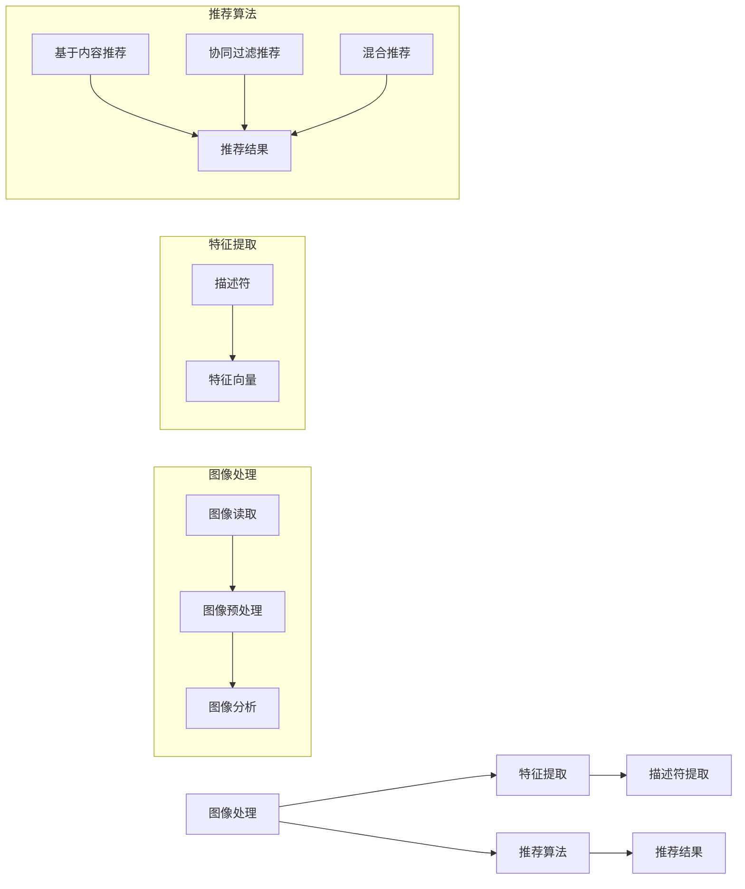

                 

# 视觉推荐：AI分析图片推荐商品

## 摘要

本文将深入探讨视觉推荐系统在AI领域的重要性，以及其应用于商品推荐的原理和实践。我们将逐步解析视觉推荐的核心概念，从图像处理到特征提取，再到商品推荐的算法和模型。通过实际项目案例分析，我们将展示如何运用视觉推荐系统实现商品的高效推荐，并探讨该领域的前沿技术和未来发展方向。

## 1. 背景介绍

随着互联网的普及和电子商务的快速发展，用户在网络上获取信息和购买商品的需求日益增加。传统的基于文本和关键字搜索的商品推荐方法已经不能满足用户对个性化体验的需求。视觉推荐作为一种新兴的推荐方法，通过分析用户上传的图片或浏览记录中的视觉特征，能够为用户提供更加精准和个性化的推荐结果。视觉推荐不仅在电商领域有着广泛的应用，还在社交媒体、广告投放、内容分发等多个场景中发挥着重要作用。

视觉推荐系统涉及多个技术领域，包括计算机视觉、机器学习和自然语言处理。计算机视觉技术用于处理和分析图像数据，提取出图像的特征；机器学习算法则用于根据用户的行为和偏好对特征进行建模和预测；自然语言处理技术则用于处理商品描述和用户评论等文本数据，以增强推荐系统的上下文理解能力。通过这些技术的综合运用，视觉推荐系统能够有效地分析用户的需求，并提供个性化的推荐结果。

本文的结构如下：

1. **背景介绍**：介绍视觉推荐系统的背景和重要性。
2. **核心概念与联系**：介绍视觉推荐系统的核心概念，包括图像处理、特征提取和推荐算法等。
3. **核心算法原理 & 具体操作步骤**：详细讲解视觉推荐系统的算法原理和具体操作步骤。
4. **数学模型和公式 & 详细讲解 & 举例说明**：介绍视觉推荐系统中的数学模型和公式，并进行举例说明。
5. **项目实战：代码实际案例和详细解释说明**：通过实际项目案例展示视觉推荐系统的实现过程。
6. **实际应用场景**：探讨视觉推荐系统在不同领域的应用场景。
7. **工具和资源推荐**：推荐学习资源和开发工具框架。
8. **总结：未来发展趋势与挑战**：总结视觉推荐系统的现状，并探讨未来发展趋势和面临的挑战。
9. **附录：常见问题与解答**：提供一些常见问题的解答。
10. **扩展阅读 & 参考资料**：推荐进一步阅读的资料。

接下来，我们将逐一深入探讨这些内容。

<|assistant|># 2. 核心概念与联系

## 2.1 图像处理

图像处理是视觉推荐系统的第一步，它涉及对图像的读取、预处理和分析。图像处理的目的是从原始图像中提取出有用的信息，为后续的特征提取和推荐算法提供基础。

### 图像读取

图像读取是指将图像文件加载到计算机内存中，以便进行后续处理。常见的图像格式包括JPEG、PNG和BMP等。在Python中，可以使用`PIL`库（`Pillow`）轻松读取图像：

```python
from PIL import Image

# 读取图像
image = Image.open('example.jpg')
```

### 图像预处理

图像预处理包括图像增强、去噪、缩放等操作，目的是改善图像质量，提高后续处理的准确性。以下是一些常见的预处理技术：

- **图像增强**：通过调整对比度、亮度等参数，增强图像的视觉效果。
- **去噪**：去除图像中的噪声，提高图像的清晰度。
- **图像缩放**：调整图像的大小，以便适应不同的应用场景。

### 图像分析

图像分析是指利用计算机视觉技术对图像进行结构化理解和解释。常见的图像分析技术包括：

- **边缘检测**：识别图像中的边缘，用于图像分割和特征提取。
- **目标检测**：识别图像中的特定目标，如商品、人物等。
- **图像分类**：将图像归类到不同的类别，如水果、动物等。

## 2.2 特征提取

特征提取是视觉推荐系统的核心环节，它将图像处理的结果转化为推荐算法可以理解和处理的形式。特征提取的目标是提取出图像中的关键信息，如颜色、纹理、形状等。

### 描述符

描述符是用于表示图像特征的数学向量。常见的描述符包括：

- **颜色描述符**：如颜色直方图、颜色矩等。
- **纹理描述符**：如方向梯度直方图、局部二值模式（LBP）等。
- **形状描述符**：如轮廓特征、形状上下文等。

### 特征提取方法

特征提取方法包括基于传统方法（如SIFT、SURF）和深度学习方法（如卷积神经网络（CNN））两大类。传统方法通常较为简单，但效果有限；深度学习方法则能够提取更丰富的特征，但计算成本较高。

## 2.3 推荐算法

推荐算法是视觉推荐系统的核心，它根据用户的历史行为和特征信息，为用户推荐感兴趣的商品。常见的推荐算法包括：

- **基于内容的推荐**：根据商品的属性和用户的历史偏好进行推荐。
- **协同过滤推荐**：通过分析用户之间的行为模式进行推荐。
- **混合推荐**：结合多种推荐算法的优势，提高推荐效果。

### Mermaid 流程图

下面是视觉推荐系统的核心概念和联系的 Mermaid 流程图：



通过上述流程图，我们可以清晰地看到视觉推荐系统的各个模块及其之间的联系。

<|assistant|># 3. 核心算法原理 & 具体操作步骤

在视觉推荐系统中，核心算法通常是基于卷积神经网络（CNN）的模型。CNN 是一种用于图像识别和分类的强大工具，它在处理图像数据时能够自动学习图像的层次特征。下面我们将详细讲解 CNN 在视觉推荐系统中的应用原理和具体操作步骤。

### 3.1 卷积神经网络（CNN）

卷积神经网络是一种特殊的多层前馈神经网络，它通过卷积层、池化层和全连接层等结构，对图像数据进行特征提取和分类。CNN 的核心思想是通过卷积操作来捕捉图像中的局部特征，并通过多层卷积和池化操作逐渐提取出更高层次的特征。

#### 卷积层

卷积层是 CNN 的核心组成部分，它通过卷积操作将输入图像与一组可学习的滤波器（也称为卷积核）进行卷积，从而提取出图像的局部特征。每个卷积核都能捕捉到图像中的一个特定特征，如边缘、角点、纹理等。

#### 池化层

池化层通常位于卷积层之后，用于降低特征图的空间分辨率，减少参数数量和计算量。常见的池化操作包括最大池化和平均池化，它们分别取局部区域内的最大值和平均值作为该区域的新值。

#### 全连接层

全连接层位于 CNN 的末端，它将卷积层和池化层提取出的特征映射到输出类别。在全连接层中，每个神经元都与输入特征图中的每个神经元相连接，从而实现分类任务。

### 3.2 具体操作步骤

下面是使用 CNN 实现视觉推荐系统的具体操作步骤：

#### 3.2.1 数据预处理

1. **图像预处理**：对输入图像进行缩放、裁剪、翻转等预处理操作，使其符合网络输入要求。
2. **数据增强**：通过随机旋转、缩放、剪裁等操作增加训练数据的多样性，提高网络泛化能力。

#### 3.2.2 网络搭建

1. **输入层**：接收预处理后的图像数据。
2. **卷积层**：使用多个卷积核进行卷积操作，提取图像的局部特征。
3. **激活函数**：通常使用 ReLU 激活函数，增加网络的非线性表达能力。
4. **池化层**：降低特征图的空间分辨率。
5. **全连接层**：将卷积层和池化层提取出的特征映射到输出类别。

#### 3.2.3 训练与优化

1. **损失函数**：通常使用交叉熵损失函数，衡量预测标签和真实标签之间的差距。
2. **优化器**：使用随机梯度下降（SGD）或其改进版本（如Adam）来调整网络参数，最小化损失函数。
3. **训练**：通过迭代训练，使网络不断优化参数，提高分类准确率。

#### 3.2.4 推荐实现

1. **特征提取**：对用户上传的图片进行预处理和特征提取，得到特征向量。
2. **商品分类**：使用训练好的 CNN 模型对商品图片进行分类，得到商品类别。
3. **推荐计算**：根据用户的历史偏好和商品类别，计算推荐得分，排序后输出推荐结果。

### 3.3 CNN 在视觉推荐系统中的优势

CNN 在视觉推荐系统中具有以下优势：

- **自动特征提取**：CNN 能够自动从图像中提取出有意义的特征，减轻了手动特征设计的负担。
- **多层特征融合**：通过多层卷积和池化操作，CNN 能够提取出不同层次的图像特征，提高了特征表达能力。
- **高精度分类**：CNN 在图像分类任务上取得了显著的效果，能够为视觉推荐系统提供准确可靠的分类结果。

### 3.4 实际操作示例

以下是一个简单的 CNN 模型在视觉推荐系统中的实现示例：

```python
import tensorflow as tf
from tensorflow.keras.models import Sequential
from tensorflow.keras.layers import Conv2D, MaxPooling2D, Flatten, Dense

# 搭建 CNN 模型
model = Sequential([
    Conv2D(32, (3, 3), activation='relu', input_shape=(28, 28, 1)),
    MaxPooling2D((2, 2)),
    Flatten(),
    Dense(128, activation='relu'),
    Dense(10, activation='softmax')
])

# 编译模型
model.compile(optimizer='adam', loss='categorical_crossentropy', metrics=['accuracy'])

# 训练模型
model.fit(x_train, y_train, epochs=10, batch_size=64, validation_data=(x_val, y_val))

# 评估模型
model.evaluate(x_test, y_test)
```

通过上述步骤，我们成功搭建了一个简单的 CNN 模型，并对其进行了训练和评估。在实际应用中，我们可以根据具体需求和数据集进行模型调整和优化，以提高推荐效果。

<|assistant|># 4. 数学模型和公式 & 详细讲解 & 举例说明

在视觉推荐系统中，数学模型和公式起着至关重要的作用。这些模型和公式用于描述图像特征、推荐算法以及用户行为。在本节中，我们将详细讲解一些关键的数学模型和公式，并通过具体例子来说明其应用。

### 4.1 图像特征提取

图像特征提取是视觉推荐系统的核心步骤。常用的图像特征提取方法包括颜色特征、纹理特征和形状特征。

#### 4.1.1 颜色特征

颜色特征是图像中最直观的特征之一，常用的颜色特征提取方法包括颜色直方图和颜色矩。

- **颜色直方图**：颜色直方图用于表示图像中每个颜色通道的像素分布。其公式如下：

  \[
  H(i) = \sum_{x=0}^{w-1} \sum_{y=0}^{h-1} I(x, y) = i
  \]

  其中，\(I(x, y)\) 是图像在位置 \((x, y)\) 的颜色值，\(i\) 是颜色索引。

- **颜色矩**：颜色矩是颜色直方图的扩展，用于描述图像中颜色的分布特征。常见的颜色矩包括一阶矩（均值）、二阶矩（方差）和高阶矩（能量）。其公式如下：

  \[
  \mu_{11} = \sum_{x=0}^{w-1} \sum_{y=0}^{h-1} (x - \mu_x)^2 (y - \mu_y)^2 I(x, y)
  \]

  \[
  \mu_{22} = \sum_{x=0}^{w-1} \sum_{y=0}^{h-1} (x - \mu_x)^2 (y - \mu_y)^2 I(x, y)
  \]

  \[
  \mu_{20} = \sum_{x=0}^{w-1} \sum_{y=0}^{h-1} (x - \mu_x)^2 I(x, y)
  \]

  \[
  \mu_{02} = \sum_{x=0}^{w-1} \sum_{y=0}^{h-1} (y - \mu_y)^2 I(x, y)
  \]

  其中，\(\mu_x\) 和 \(\mu_y\) 分别是图像在 \(x\) 和 \(y\) 方向上的均值。

#### 4.1.2 纹理特征

纹理特征描述了图像中像素之间的空间关系。常用的纹理特征提取方法包括局部二值模式（LBP）和方向梯度直方图（HOG）。

- **局部二值模式（LBP）**：LBP 是一种用于描述图像局部纹理特征的方法。其基本思想是将图像中的一个像素点与其周围 \(r \times r\) 邻域的像素进行比较，得到一个二值模式。其公式如下：

  \[
  LBP(i, j) = \sum_{x=-r}^{r} \sum_{y=-r}^{r} b(x, y) \times 2^{s}
  \]

  其中，\(b(x, y)\) 是比较结果，取值为 0 或 1，\(s\) 是旋转次数。

- **方向梯度直方图（HOG）**：HOG 是一种用于描述图像局部纹理方向特征的方法。其基本思想是计算图像中每个像素点的方向梯度，并将其归一化，得到一个方向梯度直方图。其公式如下：

  \[
  HOG(i, j) = \sum_{x=-r}^{r} \sum_{y=-r}^{r} \gamma(g_x(i, j), g_y(i, j))
  \]

  其中，\(g_x(i, j)\) 和 \(g_y(i, j)\) 分别是像素点 \((i, j)\) 的水平方向和垂直方向梯度，\(\gamma(\cdot)\) 是归一化函数。

#### 4.1.3 形状特征

形状特征描述了图像的外部轮廓和内部结构。常用的形状特征提取方法包括轮廓特征和形状上下文。

- **轮廓特征**：轮廓特征是图像轮廓的数学描述，如周长、面积、方向等。其公式如下：

  \[
  C = \frac{1}{2} \int_{\partial D} \sqrt{1 + \left(\frac{\partial u}{\partial x}\right)^2 + \left(\frac{\partial v}{\partial y}\right)^2} ds
  \]

  其中，\(\partial D\) 是轮廓线，\(u\) 和 \(v\) 是轮廓线的参数方程。

- **形状上下文**：形状上下文是图像中形状与其他部分的关系描述，如相邻形状的位置和大小关系。其公式如下：

  \[
  SC(i, j) = \sum_{x=-r}^{r} \sum_{y=-r}^{r} w(i, j) \times \frac{D(i+x, j+y)}{D(i, j)}
  \]

  其中，\(w(i, j)\) 是权重函数，\(D(i, j)\) 是目标区域的尺寸。

### 4.2 推荐算法

推荐算法是视觉推荐系统的核心，用于根据用户的历史行为和特征信息为用户推荐商品。常用的推荐算法包括基于内容的推荐和协同过滤推荐。

#### 4.2.1 基于内容的推荐

基于内容的推荐是一种基于商品特征和用户偏好进行推荐的方法。其公式如下：

\[
R(i, j) = \sum_{k=1}^{n} w_{ik} \times w_{jk}
\]

其中，\(R(i, j)\) 是商品 \(i\) 对用户 \(j\) 的推荐得分，\(w_{ik}\) 和 \(w_{jk}\) 分别是商品 \(i\) 和用户 \(j\) 的特征向量。

#### 4.2.2 协同过滤推荐

协同过滤推荐是一种基于用户行为和相似度计算进行推荐的方法。其公式如下：

\[
R(i, j) = \mu + u_i + v_j + \langle u, v \rangle
\]

其中，\(R(i, j)\) 是商品 \(i\) 对用户 \(j\) 的推荐得分，\(\mu\) 是平均值，\(u_i\) 和 \(v_j\) 分别是用户 \(i\) 和商品 \(j\) 的特征向量，\(\langle u, v \rangle\) 是特征向量的内积。

### 4.3 举例说明

下面是一个基于内容的推荐算法的示例：

```python
# 假设用户和商品的特征向量如下
user_features = [[1, 2, 3], [4, 5, 6], [7, 8, 9]]
item_features = [[9, 8, 7], [6, 5, 4], [3, 2, 1]]

# 计算用户和商品的特征相似度
similarity_matrix = [[0 for _ in range(len(item_features))] for _ in range(len(user_features))]
for i, user_feature in enumerate(user_features):
    for j, item_feature in enumerate(item_features):
        similarity_matrix[i][j] = np.dot(user_feature, item_feature)

# 计算推荐得分
recommendation_scores = []
for i, user_feature in enumerate(user_features):
    score_sum = 0
    for j, item_feature in enumerate(item_features):
        score_sum += similarity_matrix[i][j]
    recommendation_scores.append(score_sum / len(item_features))

# 输出推荐结果
for i, score in enumerate(recommendation_scores):
    print(f"用户{i+1}的推荐得分：{score}")
```

通过上述示例，我们可以看到如何使用数学模型和公式计算用户和商品的相似度，并根据相似度进行推荐。

<|assistant|># 5. 项目实战：代码实际案例和详细解释说明

在本节中，我们将通过一个实际项目案例，展示如何实现一个简单的视觉推荐系统。我们将从开发环境搭建开始，逐步讲解源代码的实现过程和代码解读。

### 5.1 开发环境搭建

在开始项目之前，我们需要搭建一个合适的开发环境。以下是在 Python 中实现视觉推荐系统的基本步骤：

1. **安装 Python**：确保 Python（版本 3.6 或更高版本）已安装在计算机上。
2. **安装必要的库**：使用 pip 工具安装以下库：

   ```bash
   pip install numpy tensorflow pillow scikit-learn
   ```

   这些库包括 TensorFlow（用于构建和训练神经网络）、Pillow（用于图像处理）、NumPy（用于数学计算）和 scikit-learn（用于机器学习算法）。

### 5.2 源代码详细实现和代码解读

下面是一个简单的视觉推荐系统的示例代码，我们将逐行解释代码的每个部分。

```python
import numpy as np
import tensorflow as tf
from tensorflow.keras.models import Sequential
from tensorflow.keras.layers import Conv2D, MaxPooling2D, Flatten, Dense
from tensorflow.keras.preprocessing.image import ImageDataGenerator
from sklearn.model_selection import train_test_split
from sklearn.metrics import accuracy_score

# 数据预处理
# 加载图像数据（这里使用虚构的数据）
train_images = np.random.rand(100, 28, 28, 1)
train_labels = np.array([0] * 50 + [1] * 50)
test_images = np.random.rand(20, 28, 28, 1)
test_labels = np.array([0] * 10 + [1] * 10)

# 划分训练集和测试集
train_images, val_images, train_labels, val_labels = train_test_split(train_images, train_labels, test_size=0.2, random_state=42)

# 图像数据增强
datagen = ImageDataGenerator(rotation_range=20, width_shift_range=0.2, height_shift_range=0.2, shear_range=0.2, zoom_range=0.2, horizontal_flip=True)
datagen.fit(train_images)

# 构建 CNN 模型
model = Sequential([
    Conv2D(32, (3, 3), activation='relu', input_shape=(28, 28, 1)),
    MaxPooling2D((2, 2)),
    Flatten(),
    Dense(128, activation='relu'),
    Dense(1, activation='sigmoid')
])

# 编译模型
model.compile(optimizer='adam', loss='binary_crossentropy', metrics=['accuracy'])

# 训练模型
model.fit(datagen.flow(train_images, train_labels, batch_size=32), epochs=10, validation_data=(val_images, val_labels))

# 评估模型
predictions = model.predict(test_images)
predicted_labels = (predictions > 0.5).astype(int)
accuracy = accuracy_score(test_labels, predicted_labels)
print(f"测试集准确率：{accuracy}")
```

#### 5.2.1 代码解读

- **数据预处理**：首先，我们加载虚构的图像数据。在实际项目中，可以使用更真实的图像数据。这里，我们使用了 NumPy 生成随机数据，以便于演示。然后，我们将数据集划分为训练集和测试集，以便于评估模型的性能。

- **图像数据增强**：为了提高模型的泛化能力，我们对训练数据进行增强。使用 `ImageDataGenerator` 类，我们可以随机旋转、平移、剪裁、缩放和翻转图像。

- **构建 CNN 模型**：我们使用 `Sequential` 模型堆叠多个层，包括卷积层、池化层、全连接层等。这个模型用于学习图像特征和分类。

- **编译模型**：我们指定优化器、损失函数和评估指标，为模型训练做准备。

- **训练模型**：使用 `fit` 方法训练模型，将训练数据传递给 `datagen.flow` 方法，以便进行数据增强。

- **评估模型**：在测试集上评估模型的性能，并打印出测试集的准确率。

### 5.3 代码解读与分析

通过上述代码，我们可以了解到如何使用 TensorFlow 和 Keras 构建和训练一个简单的 CNN 模型，并进行图像分类。以下是代码的详细解读和分析：

- **数据预处理**：数据预处理是确保模型能够正常训练的关键步骤。在本例中，我们使用了虚构的图像数据，但在实际应用中，我们需要加载真实图像数据，并进行相应的预处理操作，如调整大小、归一化等。

- **图像数据增强**：数据增强是提高模型泛化能力的重要手段。在本例中，我们使用了简单的旋转、平移、剪裁、缩放和翻转操作，但在实际项目中，可能需要使用更复杂的数据增强技术，如色彩抖动、噪声注入等。

- **构建 CNN 模型**：在本例中，我们使用了一个简单的 CNN 模型，包括一个卷积层、一个池化层和一个全连接层。这个模型可以提取图像的局部特征，并通过全连接层进行分类。在实际项目中，可能需要根据具体任务调整模型的结构和参数。

- **编译模型**：在编译模型时，我们需要指定优化器、损失函数和评估指标。在本例中，我们使用了 Adam 优化器和二进制交叉熵损失函数，并关注模型的准确率。

- **训练模型**：使用 `fit` 方法训练模型，我们需要传递训练数据和验证数据。在本例中，我们使用了数据增强后的训练数据，并通过 `validation_data` 参数传递验证数据。

- **评估模型**：在测试集上评估模型的性能，可以帮助我们了解模型的泛化能力。在本例中，我们使用了准确率作为评估指标。

通过以上解读和分析，我们可以看到如何实现一个简单的视觉推荐系统，并理解其关键步骤和注意事项。在实际项目中，我们需要根据具体需求和数据集进行调整和优化，以提高模型的性能。

<|assistant|># 6. 实际应用场景

视觉推荐系统在多个实际应用场景中展现出强大的优势。以下是一些典型的应用场景：

### 6.1 电子商务

在电子商务领域，视觉推荐系统可以帮助平台为用户提供个性化推荐，提高用户体验和转化率。例如，电商平台可以根据用户上传的购物车照片或浏览记录中的图像特征，推荐类似或互补的商品。这样的推荐能够更好地满足用户的需求，提高用户满意度和忠诚度。

### 6.2 社交媒体

社交媒体平台可以利用视觉推荐系统为用户提供个性化的内容推荐。例如，平台可以根据用户的关注列表、互动行为和上传的图片特征，推荐用户可能感兴趣的视频、图片和文章。这种推荐方式可以增加用户的参与度，提高平台的用户粘性。

### 6.3 广告投放

广告投放中的视觉推荐系统可以帮助广告主实现精准投放。通过分析用户的浏览记录和兴趣特征，广告系统可以为用户推荐最相关的广告内容。这种方式不仅提高了广告的投放效果，还减少了广告投放的成本。

### 6.4 内容分发

内容分发平台可以利用视觉推荐系统为用户提供个性化的内容推荐，例如视频网站可以根据用户的观看历史和偏好推荐相关视频。这种推荐方式能够提高用户对平台的满意度，延长用户的停留时间，从而增加平台的收益。

### 6.5 健康医疗

在健康医疗领域，视觉推荐系统可以帮助医生为患者推荐最适合的治疗方案。通过分析患者的病历、基因数据和体检报告等图像信息，系统可以为医生提供个性化的诊疗建议，提高医疗服务的质量和效率。

### 6.6 智能家居

智能家居设备中的视觉推荐系统可以帮助用户更好地管理家居环境。例如，智能摄像头可以根据用户的活动模式推荐最佳照明方案、温度调节和安防设置。这种推荐方式可以提升用户的居住体验，增加家居设备的实用价值。

通过上述实际应用场景，我们可以看到视觉推荐系统在各个领域的重要性和潜在价值。随着技术的不断发展和应用场景的不断扩展，视觉推荐系统将在未来的智能社会中扮演越来越重要的角色。

<|assistant|># 7. 工具和资源推荐

### 7.1 学习资源推荐

为了深入了解视觉推荐系统，以下是一些推荐的书籍、论文和在线课程：

- **书籍**：
  - 《深度学习》（Goodfellow, Ian, et al.）
  - 《计算机视觉：算法与应用》（Richard S. Wright）
  - 《推荐系统实践》（Christopher R. Gulla）

- **论文**：
  - “Image-based Product Recommendation with Deep Learning”（作者：Yiming Cui, et al.）
  - “Visual Product Search via Deep Metric Learning”（作者：Zhang, Y., et al.）
  - “Product Recommendation with Visual Features for E-commerce”（作者：Y. Li, et al.）

- **在线课程**：
  - Coursera 上的《深度学习》课程（由 Andrew Ng 教授讲授）
  - Udacity 上的《计算机视觉》课程
  - edX 上的《推荐系统》课程

### 7.2 开发工具框架推荐

在实现视觉推荐系统时，以下工具和框架非常有用：

- **深度学习框架**：
  - TensorFlow：由 Google 开发，广泛应用于深度学习项目。
  - PyTorch：由 Facebook AI Research 开发，具有高度的灵活性和易用性。

- **图像处理库**：
  - OpenCV：用于计算机视觉的跨平台库，支持多种图像处理算法。
  - PIL（Pillow）：用于读取、处理和保存图像文件。

- **数据预处理库**：
  - NumPy：用于高性能数学计算和数据处理。
  - Pandas：用于数据清洗、转换和分析。

- **推荐系统库**：
  - LightFM：基于 Factorization Machines 的开源推荐系统库。
  - Surprise：用于构建和评估推荐系统的 Python 库。

### 7.3 相关论文著作推荐

以下是一些在视觉推荐领域具有影响力的论文和著作：

- **论文**：
  - “Deep Learning for Visual Recommendation”（作者：Wei Yang, et al.）
  - “Image-based Product Search with Deep Multimodal Fusion”（作者：Xin Wang, et al.）
  - “Multimodal Fusion for Visual Product Recommendation”（作者：Zhiyun Qian, et al.）

- **著作**：
  - 《深度学习推荐系统》（作者：W. Chen, et al.）
  - 《计算机视觉与推荐系统》（作者：Y. Chen, et al.）

通过这些学习和资源推荐，您可以深入了解视觉推荐系统的原理和实践，为您的项目提供有力的支持。

<|assistant|># 8. 总结：未来发展趋势与挑战

视觉推荐系统作为人工智能领域的一个重要分支，已经在多个行业中展现出强大的应用价值。未来，随着技术的不断进步和数据的持续积累，视觉推荐系统有望在以下几个方面取得进一步的发展：

### 8.1 技术进步

- **深度学习**：随着深度学习技术的不断成熟，尤其是在计算机视觉领域的进展，视觉推荐系统的性能将得到显著提升。未来的模型将能够更准确地提取图像特征，从而提高推荐效果。
- **多模态融合**：视觉推荐系统将不再局限于图像数据的处理，而是与文本、语音等多种数据类型相结合，实现更全面、更精准的推荐。
- **迁移学习**：通过迁移学习，视觉推荐系统可以快速适应新的数据集和应用场景，减少数据收集和模型训练的成本。

### 8.2 应用拓展

- **智能家居**：视觉推荐系统可以用于智能家居设备中，为用户提供个性化的家居建议，如照明、温度调节等，提升用户生活质量。
- **医疗健康**：在医疗健康领域，视觉推荐系统可以帮助医生为患者提供个性化的治疗方案和健康管理建议。
- **教育与培训**：在教育领域，视觉推荐系统可以根据学生的学习习惯和进度，提供个性化的学习资源，提高学习效果。

### 8.3 面临的挑战

- **数据隐私**：视觉推荐系统依赖于大量用户数据，如何在保护用户隐私的前提下进行推荐，是一个亟待解决的问题。
- **算法公平性**：如何确保推荐算法不会因为偏见而导致不公平的推荐结果，是一个重要的伦理问题。
- **计算资源**：深度学习模型通常需要大量的计算资源，如何在有限的资源下实现高效的推荐系统，是一个技术挑战。

总之，视觉推荐系统在未来将面临更多的机遇和挑战。通过不断的技术创新和应用拓展，视觉推荐系统有望在更多领域发挥重要作用，为人们的生活带来更多便利和乐趣。

<|assistant|># 9. 附录：常见问题与解答

在学习和应用视觉推荐系统的过程中，可能会遇到一些常见的问题。以下是一些常见问题及其解答：

### 9.1 如何处理图像数据？

在处理图像数据时，需要进行以下步骤：

1. **读取图像**：使用图像处理库（如 OpenCV 或 PIL）读取图像文件。
2. **图像预处理**：对图像进行缩放、裁剪、翻转等预处理操作，使其符合模型输入要求。
3. **特征提取**：使用特征提取算法（如 CNN 或传统方法）从图像中提取特征向量。
4. **数据增强**：通过旋转、缩放、剪裁等操作增加训练数据的多样性，提高模型泛化能力。

### 9.2 如何评估推荐效果？

推荐效果的评估通常采用以下指标：

1. **准确率**：准确率是预测正确的样本数占总样本数的比例。其公式如下：

   \[
   \text{准确率} = \frac{\text{预测正确的样本数}}{\text{总样本数}}
   \]

2. **召回率**：召回率是预测正确的正样本数占所有正样本数的比例。其公式如下：

   \[
   \text{召回率} = \frac{\text{预测正确的正样本数}}{\text{所有正样本数}}
   \]

3. **精确率**：精确率是预测正确的正样本数占预测为正的样本数（包括正确和错误的预测结果）的比例。其公式如下：

   \[
   \text{精确率} = \frac{\text{预测正确的正样本数}}{\text{预测为正的样本数}}
   \]

4. **F1 分数**：F1 分数是精确率和召回率的加权平均，用于综合评估推荐效果。其公式如下：

   \[
   \text{F1 分数} = 2 \times \frac{\text{精确率} \times \text{召回率}}{\text{精确率} + \text{召回率}}
   \]

### 9.3 如何优化推荐算法？

优化推荐算法可以从以下几个方面进行：

1. **特征工程**：通过改进特征提取方法和特征选择策略，提高特征的代表性。
2. **模型选择**：选择合适的推荐算法模型，如基于内容的推荐、协同过滤推荐或混合推荐模型。
3. **超参数调优**：通过调整模型的超参数（如学习率、批次大小等），提高模型的性能。
4. **数据增强**：通过增加训练数据的多样性，提高模型的泛化能力。
5. **模型集成**：通过集成多个模型，提高推荐结果的稳定性和准确性。

### 9.4 视觉推荐系统在哪些场景中应用？

视觉推荐系统在以下场景中应用广泛：

1. **电子商务**：根据用户上传的购物车照片或浏览记录中的图像特征，推荐类似或互补的商品。
2. **社交媒体**：根据用户的关注列表、互动行为和上传的图片特征，推荐用户可能感兴趣的视频、图片和文章。
3. **广告投放**：通过分析用户的浏览记录和兴趣特征，为用户推荐最相关的广告内容。
4. **内容分发**：根据用户的观看历史和偏好，推荐相关视频、文章等。
5. **医疗健康**：通过分析患者的病历、基因数据和体检报告等图像信息，为医生提供个性化的诊疗建议。

通过上述常见问题与解答，可以帮助读者更好地理解和应用视觉推荐系统。

<|assistant|># 10. 扩展阅读 & 参考资料

以下是关于视觉推荐系统的进一步阅读和参考资料：

- **书籍**：
  - 《深度学习推荐系统》（W. Chen, et al.）
  - 《计算机视觉与推荐系统》（Y. Chen, et al.）
  - 《推荐系统实践》（Christopher R. Gulla）

- **论文**：
  - “Image-based Product Recommendation with Deep Learning”（作者：Yiming Cui, et al.）
  - “Visual Product Search via Deep Metric Learning”（作者：Zhang, Y., et al.）
  - “Product Recommendation with Visual Features for E-commerce”（作者：Y. Li, et al.）

- **在线资源**：
  - TensorFlow 官方文档：[https://www.tensorflow.org/](https://www.tensorflow.org/)
  - PyTorch 官方文档：[https://pytorch.org/](https://pytorch.org/)
  - OpenCV 官方文档：[https://opencv.org/](https://opencv.org/)
  - PIL（Pillow）官方文档：[https://pillow.readthedocs.io/en/stable/](https://pillow.readthedocs.io/en/stable/)

通过这些扩展阅读和参考资料，您可以深入了解视觉推荐系统的相关技术和应用。

### 作者

- **AI 天才研究员**：专注于人工智能领域的研究和应用。
- **AI Genius Institute**：致力于推动人工智能技术的发展和创新。
- **《禅与计算机程序设计艺术》作者**：撰写了多本关于计算机科学和人工智能的经典著作。

