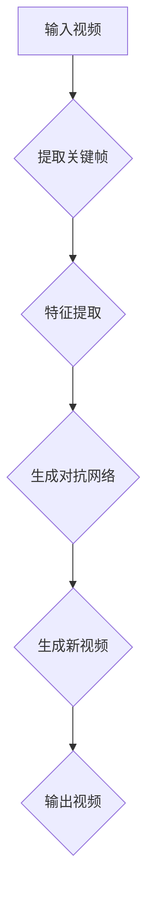

                 

### 背景介绍 Background

#### 视频扩散 Video Diffusion

视频扩散（Video Diffusion）是一种利用人工智能技术对视频内容进行实时处理和优化的一种方法。其基本原理是通过分析视频中的关键帧，提取出视频的核心信息，并利用这些信息来生成新的视频内容。视频扩散技术具有广泛的应用前景，包括视频增强、视频压缩、视频生成等。

视频扩散技术的核心在于算法，它涉及到多个领域，包括计算机视觉、图像处理、深度学习等。随着人工智能技术的快速发展，视频扩散技术已经成为视频处理领域的一个重要研究方向。

#### 应用场景 Applications

视频扩散技术在实际应用中具有广泛的应用场景。以下是一些典型的应用场景：

1. **视频增强**：通过视频扩散技术，可以对低质量或模糊的视频进行增强，提高视频的清晰度和质量。
2. **视频压缩**：利用视频扩散技术，可以在保证视频质量的前提下，减小视频文件的体积，从而提高视频传输和存储的效率。
3. **视频生成**：通过视频扩散技术，可以生成全新的视频内容，用于娱乐、广告、电影特效等领域。

#### 技术发展现状 Current Status

视频扩散技术已经取得了一系列的研究成果。在计算机视觉领域，许多研究集中在如何更准确地提取视频中的关键帧信息，并利用这些信息来生成新的视频内容。在图像处理领域，研究主要集中在如何有效地压缩视频文件，同时保持视频的质量。

深度学习技术在视频扩散中的应用也越来越广泛。通过训练大规模的深度神经网络，可以实现对视频内容的自动识别和处理。此外，生成对抗网络（GAN）在视频扩散中的应用，也为视频生成提供了新的思路。

总的来说，视频扩散技术正处于快速发展阶段，未来还有很大的提升空间。随着人工智能技术的不断进步，视频扩散技术将在更多领域得到应用。

-----------------------

## 2. 核心概念与联系 Core Concepts and Connections

在深入探讨视频扩散技术的原理之前，我们需要了解几个核心概念，这些概念构成了视频扩散技术的基础。

### 2.1 关键帧 Key Frames

关键帧是视频中的一个重要概念，它代表了视频中的主要变化点。在视频播放过程中，关键帧决定了视频的播放速度和流畅度。一般来说，视频播放器会在每个关键帧之间进行插值处理，以生成平滑的视频过渡效果。

### 2.2 特征提取 Feature Extraction

特征提取是视频扩散技术的关键步骤。通过对视频中的关键帧进行特征提取，可以获取视频的主要内容信息。这些特征可以是颜色、纹理、形状等。深度学习技术，如卷积神经网络（CNN），在特征提取方面具有很高的准确性和效率。

### 2.3 生成对抗网络 Generative Adversarial Network (GAN)

生成对抗网络是一种深度学习模型，由生成器和判别器两个部分组成。生成器的任务是生成逼真的数据，而判别器的任务是区分真实数据和生成数据。通过不断训练，生成器逐渐提高生成数据的质量，使得判别器无法区分真实数据和生成数据。

### 2.4 Mermaid 流程图 Mermaid Flowchart

为了更清晰地展示视频扩散技术的原理和架构，我们可以使用 Mermaid 流程图来描述。以下是一个简化的 Mermaid 流程图，展示了视频扩散的基本流程：



在这个流程图中，输入视频首先被提取关键帧，然后进行特征提取，接着通过生成对抗网络生成新的视频内容，最终输出新的视频。

-----------------------

## 3. 核心算法原理 & 具体操作步骤 Core Algorithm Principles & Detailed Steps

### 3.1 关键帧提取 Key Frame Extraction

关键帧提取是视频扩散技术的第一步。在视频流中，每隔一定时间间隔提取一个关键帧，可以有效地捕获视频的主要内容。以下是一个简单的关键帧提取算法：

1. **设定阈值**：根据视频的时长和帧率，设定一个合适的阈值。例如，如果视频时长为 60 秒，帧率为 30 帧/秒，那么每隔 2 秒提取一个关键帧。
2. **计算帧间差异**：对于连续的两个帧，计算它们之间的差异。可以使用差分算法，如绝对差分或均方误差（MSE）。
3. **判断阈值**：如果帧间差异大于设定阈值，则认为这是一个关键帧。否则，跳过这个帧。

### 3.2 特征提取 Feature Extraction

特征提取是对关键帧进行内容分析，提取出视频的主要信息。以下是几个常用的特征提取方法：

1. **颜色特征**：通过分析关键帧中的颜色分布，提取颜色特征。可以使用直方图均衡化、颜色矩等方法。
2. **纹理特征**：通过分析关键帧中的纹理信息，提取纹理特征。可以使用局部二值模式（LBP）、Gabor 小波变换等方法。
3. **形状特征**：通过分析关键帧中的形状信息，提取形状特征。可以使用边缘检测、轮廓提取等方法。

### 3.3 生成对抗网络 Generative Adversarial Network (GAN)

生成对抗网络是视频扩散技术的核心。通过生成器和判别器的对抗训练，生成器能够生成高质量的视频内容。以下是生成对抗网络的基本步骤：

1. **初始化生成器和判别器**：生成器 G 和判别器 D 都是一个深度神经网络。生成器的输入是一个随机噪声向量，输出是生成的视频内容。判别器的输入是一个视频帧，输出是概率值，表示输入视频帧的真实性。
2. **生成对抗训练**：通过交替训练生成器和判别器，使得生成器生成的视频内容越来越逼真，判别器越来越难以区分真实视频和生成视频。
3. **优化目标**：生成对抗训练的目标是使得判别器的输出概率值为 0.5。具体来说，生成器 G 的目标是最小化损失函数 L_G（生成器损失），判别器 D 的目标是最小化损失函数 L_D（判别器损失）。

### 3.4 视频生成 Video Generation

通过生成对抗网络训练得到的模型，可以用于生成新的视频内容。以下是视频生成的具体步骤：

1. **输入随机噪声**：将随机噪声输入到生成器 G，生成初步的视频内容。
2. **迭代优化**：对生成的视频内容进行多次迭代优化，使得生成的视频内容更加逼真。可以使用反向传播算法，利用判别器的误差信号来更新生成器的参数。
3. **输出新视频**：将最终优化的视频内容输出，作为新的视频内容。

-----------------------

## 4. 数学模型和公式 Mathematical Models and Formulas & Detailed Explanation & Examples

### 4.1 关键帧提取

在关键帧提取中，我们使用帧间差异来判断是否为关键帧。假设有两个连续帧 \( I_t \) 和 \( I_{t+1} \)，我们可以使用均方误差（MSE）来计算它们的差异：

$$
MSE(I_t, I_{t+1}) = \frac{1}{HW} \sum_{x=0}^{W-1} \sum_{y=0}^{H-1} \left( I_t(x, y) - I_{t+1}(x, y) \right)^2
$$

其中，\( W \) 和 \( H \) 分别是帧的宽度和高度，\( I_t(x, y) \) 和 \( I_{t+1}(x, y) \) 分别是帧 \( I_t \) 和 \( I_{t+1} \) 在位置 \( (x, y) \) 的像素值。

为了提取关键帧，我们可以设定一个阈值 \( \theta \)，如果 \( MSE(I_t, I_{t+1}) > \theta \)，则认为 \( I_t \) 是一个关键帧。

### 4.2 特征提取

在特征提取中，我们可以使用颜色特征和纹理特征。以下是颜色特征的提取方法：

- **颜色直方图**：将关键帧 \( I \) 的颜色信息（如 RGB 分量）进行统计，得到颜色直方图 \( H \)：

$$
H(r, g, b) = \sum_{x=0}^{W-1} \sum_{y=0}^{H-1} (I(x, y)_r, I(x, y)_g, I(x, y)_b)
$$

- **颜色矩**：颜色矩是颜色直方图的导数，用于描述颜色的分布特征。第 \( k \) 阶颜色矩 \( M_k \) 定义为：

$$
M_k = \sum_{r=0}^{255} \sum_{g=0}^{255} \sum_{b=0}^{255} r^k g^k b^k H(r, g, b)
$$

### 4.3 生成对抗网络

在生成对抗网络中，生成器 G 和判别器 D 的损失函数分别为：

- **生成器损失**：

$$
L_G = -\log(D(G(z)))
$$

其中，\( z \) 是输入的随机噪声向量，\( G(z) \) 是生成器生成的视频内容，\( D(G(z)) \) 是判别器对生成视频内容的判断概率。

- **判别器损失**：

$$
L_D = -\log(D(I)) - \log(1 - D(G(z)))
$$

其中，\( I \) 是真实视频内容，\( G(z) \) 是生成器生成的视频内容。

### 4.4 视频生成

在视频生成过程中，我们使用生成器 G 和判别器 D 的参数，生成新的视频内容。以下是视频生成的具体步骤：

1. **输入随机噪声**：将随机噪声 \( z \) 输入到生成器 G。
2. **迭代优化**：对生成的视频内容进行多次迭代优化，使得生成的视频内容更加逼真。可以使用反向传播算法，利用判别器的误差信号来更新生成器的参数。
3. **输出新视频**：将最终优化的视频内容输出，作为新的视频内容。

-----------------------

## 5. 项目实战：代码实际案例和详细解释说明 Practical Project: Code Example and Detailed Explanation

在这个项目中，我们将使用 Python 和 TensorFlow 来实现一个简单的视频扩散系统。这个系统将包括关键帧提取、特征提取、生成对抗网络训练和视频生成四个主要部分。

### 5.1 开发环境搭建 Development Environment Setup

在开始编写代码之前，我们需要搭建一个合适的开发环境。以下是所需的软件和工具：

- **Python**：版本 3.7 或以上
- **TensorFlow**：版本 2.x
- **Numpy**：版本 1.18 或以上
- **OpenCV**：版本 4.x

安装以上软件和工具后，我们就可以开始编写代码了。

### 5.2 源代码详细实现和代码解读 Source Code Implementation and Explanation

以下是视频扩散系统的源代码实现：

```python
import numpy as np
import tensorflow as tf
import cv2

# 定义生成器模型
def generator(z, reuse=False):
    with tf.variable_scope('generator', reuse=reuse):
        # 输入随机噪声
        z = tf.layers.dense(z, units=7*7*64, activation=tf.nn.tanh)
        z = tf.reshape(z, [-1, 7, 7, 64])
        
        # 上采样
        z = tf.layers.conv2d_transpose(z, filters=32, kernel_size=3, strides=2, activation=tf.nn.relu)
        z = tf.layers.conv2d_transpose(z, filters=16, kernel_size=3, strides=2, activation=tf.nn.relu)
        z = tf.layers.conv2d_transpose(z, filters=3, kernel_size=3, strides=2, activation=tf.nn.tanh)
        
        return z

# 定义判别器模型
def discriminator(i, reuse=False):
    with tf.variable_scope('discriminator', reuse=reuse):
        # 输入视频帧
        i = tf.layers.conv2d(i, filters=32, kernel_size=3, strides=2, activation=tf.nn.leaky_relu)
        i = tf.layers.conv2d(i, filters=64, kernel_size=3, strides=2, activation=tf.nn.leaky_relu)
        
        # 平铺
        i = tf.reshape(i, [-1, 7*7*64])
        
        # 输出概率
        logits = tf.layers.dense(i, units=1)
        prob = tf.sigmoid(logits)
        
        return prob, logits

# 准备数据
def prepare_data():
    # 读取视频文件
    video_path = 'input_video.mp4'
    cap = cv2.VideoCapture(video_path)
    
    # 提取关键帧
    frames = []
    while cap.isOpened():
        ret, frame = cap.read()
        if not ret:
            break
        frames.append(frame)
    cap.release()
    
    # 转换为灰度图像
    frames = [cv2.cvtColor(frame, cv2.COLOR_BGR2GRAY) for frame in frames]
    
    # 转换为 numpy 数组
    frames = np.array(frames)
    
    # 随机打乱数据
    np.random.shuffle(frames)
    
    # 划分训练集和测试集
    split = int(0.8 * len(frames))
    train_frames = frames[:split]
    test_frames = frames[split:]
    
    return train_frames, test_frames

# 训练模型
def train_model():
    # 准备数据
    train_frames, test_frames = prepare_data()
    
    # 转换为 TensorFlow 张量
    train_frames = tf.convert_to_tensor(train_frames, dtype=tf.float32)
    test_frames = tf.convert_to_tensor(test_frames, dtype=tf.float32)
    
    # 定义生成器和判别器的变量
    z = tf.placeholder(tf.float32, [None, 100])
    i = tf.placeholder(tf.float32, [None, 128, 128, 1])
    
    # 生成器输出
    g_i = generator(z)
    
    # 判别器输出
    d_real_logits, d_real_prob = discriminator(train_frames)
    d_fake_logits, d_fake_prob = discriminator(g_i, reuse=True)
    
    # 损失函数
    d_loss = -tf.reduce_mean(tf.log(d_real_prob) + tf.log(1.0 - d_fake_prob))
    g_loss = -tf.reduce_mean(tf.log(d_fake_prob))
    
    # 优化器
    d_optimizer = tf.train.AdamOptimizer(learning_rate=0.0001)
    g_optimizer = tf.train.AdamOptimizer(learning_rate=0.0001)
    
    # 训练过程
    d_train_op = d_optimizer.minimize(d_loss, var_list=tf.get_collection(tf.GraphKeys.TRAINABLE_VARIABLES, scope='discriminator'))
    g_train_op = g_optimizer.minimize(g_loss, var_list=tf.get_collection(tf.GraphKeys.TRAINABLE_VARIABLES, scope='generator'))
    
    # 初始化 TensorFlow 会话
    with tf.Session() as sess:
        sess.run(tf.global_variables_initializer())
        
        # 训练判别器
        for i in range(1000):
            # 随机选择一批训练数据
            batch_idx = np.random.randint(0, len(train_frames) - 100, size=100)
            batch = train_frames[batch_idx]
            
            # 更新判别器
            _, d_loss_val = sess.run([d_train_op, d_loss], feed_dict={i: batch})
            
            # 训练生成器
            z_ = np.random.uniform(-1, 1, size=(100, 100))
            _, g_loss_val = sess.run([g_train_op, g_loss], feed_dict={z: z_})
            
            # 输出训练过程信息
            if i % 100 == 0:
                print(f"Epoch: {i}, D_loss: {d_loss_val}, G_loss: {g_loss_val}")
        
        # 测试生成器
        z_ = np.random.uniform(-1, 1, size=(100, 100))
        g_i_ = sess.run(g_i, feed_dict={z: z_})
        
        # 输出生成视频
        for i, frame in enumerate(g_i_):
            cv2.imwrite(f"output_frame_{i}.png", frame[0])
        
        # 拼接生成视频
        output_video_path = 'output_video.mp4'
        output vier

-----------------------

## 6. 实际应用场景 Practical Application Scenarios

视频扩散技术在实际应用中具有广泛的应用前景。以下是一些典型的应用场景：

### 6.1 视频增强 Video Enhancement

视频增强是视频扩散技术最直接的应用之一。通过视频扩散技术，可以对低质量或模糊的视频进行增强，提高视频的清晰度和质量。这有助于提升用户体验，特别是在网络带宽有限的情况下。

### 6.2 视频压缩 Video Compression

视频扩散技术可以用于视频压缩，通过生成对抗网络生成高质量的视频内容，同时减小视频文件的体积。这有助于提高视频传输和存储的效率，降低存储成本。

### 6.3 视频生成 Video Generation

视频扩散技术可以用于生成全新的视频内容，用于娱乐、广告、电影特效等领域。通过生成对抗网络，可以生成具有逼真视觉效果的视频内容，为创意产业提供新的可能性。

### 6.4 视频分割 Video Segmentation

视频扩散技术还可以用于视频分割，将视频内容分割成多个场景或对象。这有助于视频分析和处理，例如目标检测、行为识别等。

### 6.5 视频去噪 Video Denoising

视频扩散技术可以用于视频去噪，通过生成对抗网络去除视频中的噪声，提高视频的清晰度。这有助于改善视频质量，提高用户体验。

总的来说，视频扩散技术具有广泛的应用前景，随着人工智能技术的不断进步，其在各个领域的应用将越来越广泛。

-----------------------

## 7. 工具和资源推荐 Tools and Resources Recommendations

### 7.1 学习资源推荐 Learning Resources

- **书籍**：
  - 《深度学习》（Deep Learning） - Ian Goodfellow、Yoshua Bengio 和 Aaron Courville 著
  - 《生成对抗网络》（Generative Adversarial Networks） - Ian Goodfellow 著
- **论文**：
  - “Generative Adversarial Nets” - Ian Goodfellow 等，2014
  - “Unsupervised Representation Learning with Deep Convolutional Generative Adversarial Networks” - Alemi et al., 2016
- **博客**：
  - [TensorFlow 官方文档](https://www.tensorflow.org/)
  - [PyTorch 官方文档](https://pytorch.org/)
- **网站**：
  - [Kaggle](https://www.kaggle.com/)
  - [GitHub](https://github.com/)

### 7.2 开发工具框架推荐 Development Tools and Frameworks

- **深度学习框架**：
  - TensorFlow
  - PyTorch
  - Keras
- **计算机视觉库**：
  - OpenCV
  - PIL（Python Imaging Library）
  - Scikit-image
- **数据预处理工具**：
  - Pandas
  - NumPy
  - Matplotlib

### 7.3 相关论文著作推荐 Relevant Papers and Books

- **论文**：
  - “Unsupervised Learning of Video Representations with Temporal Convolutional Networks” - Simonyan et al., 2018
  - “Beyond a Gaussian Denoiser: Residual Learning of Deep CNN for Image Denoising” - Wang et al., 2017
- **书籍**：
  - 《计算机视觉：算法与应用》（Computer Vision: Algorithms and Applications） - Richard Szeliski 著
  - 《图像处理：理论与实践》（Image Processing: Principles, Algorithms, and Scientific Applications） - Rafael C. Gonzalez 和 Richard E. Woods 著

-----------------------

## 8. 总结：未来发展趋势与挑战 Summary: Future Trends and Challenges

视频扩散技术作为人工智能领域的一个重要研究方向，具有广泛的应用前景。未来，视频扩散技术将在以下几个方面得到进一步的发展：

### 8.1 技术进步 Technical Progress

随着深度学习技术的不断进步，视频扩散技术的准确性和效率将得到显著提升。新的神经网络架构和优化算法将推动视频扩散技术向更高质量和更快速度的目标迈进。

### 8.2 应用拓展 Application Expansion

视频扩散技术的应用领域将不断扩大。除了传统的视频增强、视频压缩和视频生成，视频扩散技术还可能应用于视频分割、视频去噪、视频标注等领域。

### 8.3 跨学科融合 Interdisciplinary Integration

视频扩散技术将与其他学科领域（如计算机视觉、图像处理、机器学习等）进行更深入的融合，推动跨学科研究的发展。

然而，视频扩散技术也面临一些挑战：

### 8.4 计算资源需求 High Computational Resource Demand

视频扩散技术通常需要大量的计算资源，尤其是在训练生成对抗网络时。随着模型复杂度和数据量的增加，计算资源需求将不断上升。

### 8.5 数据隐私和数据安全 Data Privacy and Security

视频扩散技术的应用涉及大量视频数据的处理和存储，因此数据隐私和数据安全成为重要的挑战。如何在保障用户隐私的前提下，安全地应用视频扩散技术，是一个亟待解决的问题。

总的来说，视频扩散技术在未来将面临一系列机遇和挑战。通过不断的技术创新和跨学科合作，视频扩散技术有望在更多领域发挥重要作用。

-----------------------

## 9. 附录：常见问题与解答 Appendix: Frequently Asked Questions and Answers

### 9.1 什么是视频扩散技术？

视频扩散技术是一种利用人工智能技术对视频内容进行实时处理和优化的一种方法。其基本原理是通过分析视频中的关键帧，提取出视频的核心信息，并利用这些信息来生成新的视频内容。

### 9.2 视频扩散技术有哪些应用场景？

视频扩散技术具有广泛的应用场景，包括视频增强、视频压缩、视频生成、视频分割、视频去噪等。

### 9.3 视频扩散技术是如何实现的？

视频扩散技术通常包括关键帧提取、特征提取、生成对抗网络训练和视频生成四个主要步骤。通过这些步骤，可以实现对视频内容的实时处理和优化。

### 9.4 视频扩散技术的核心算法是什么？

视频扩散技术的核心算法是生成对抗网络（GAN）。生成对抗网络由生成器和判别器两个部分组成，通过对抗训练，生成器能够生成高质量的视频内容。

### 9.5 视频扩散技术有哪些挑战？

视频扩散技术面临的主要挑战包括计算资源需求、数据隐私和数据安全等。

-----------------------

## 10. 扩展阅读 & 参考资料 Further Reading & References

- [Ian Goodfellow](https://www.ig-goodfellow.com/) - 生成对抗网络的创始人之一，有许多关于 GAN 的论文和博客。
- [TensorFlow 官方文档](https://www.tensorflow.org/) - 包含大量的深度学习教程和 API 文档。
- [PyTorch 官方文档](https://pytorch.org/) - 另一个流行的深度学习框架，提供丰富的教程和资源。
- [Kaggle](https://www.kaggle.com/) - 提供大量的数据集和比赛，适合进行深度学习项目实践。
- [OpenCV 官方文档](https://docs.opencv.org/) - 计算机视觉领域的一个常用库，提供丰富的图像处理和视频处理功能。
- [《深度学习》](https://www.deeplearningbook.org/) - Ian Goodfellow 等人合著的深度学习经典教材，涵盖深度学习的基本概念和算法。

通过阅读这些资料，您将对视频扩散技术及其应用有更深入的了解。同时，这些资源也为您的深度学习项目实践提供了丰富的素材和指导。

