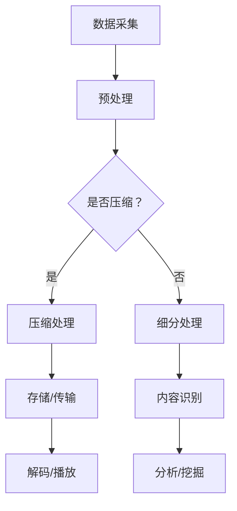

                 

### 背景介绍

视频数据的压缩与细分技术是当今信息技术领域中的一个重要研究方向。随着互联网和多媒体技术的飞速发展，人们对视频数据的处理需求日益增长。如何高效地存储、传输和播放视频数据成为了一个亟待解决的问题。视频数据压缩技术旨在通过降低数据冗余，减少存储和传输所需的空间，从而提高数据传输效率和存储效率。视频数据细分技术则通过对视频内容进行精细划分和分析，实现视频的个性化推荐、智能识别等功能。

视频数据压缩技术可以分为无损压缩和有损压缩两大类。无损压缩通过去除冗余信息，保证压缩后数据的完整性和可逆性，适用于重要数据的传输和存储。有损压缩则在保证视频质量可接受的前提下，通过去除某些不重要的信息，进一步提高压缩比，适用于日常视频娱乐和流媒体传输。

视频数据细分技术主要包括视频分割、视频内容识别和视频质量评估等。视频分割是指将连续的视频流分割成若干个具有独立意义的片段，以便于后续处理。视频内容识别则是通过分析视频中的图像和音频信息，识别出视频中的特定对象、场景或事件。视频质量评估则是通过对视频的画质、清晰度等指标进行评价，为视频制作和播放提供参考。

在现代社会，视频数据压缩与细分技术有着广泛的应用前景。例如，在互联网视频流媒体领域，视频压缩技术可以显著提高数据传输速度，降低带宽占用，提高用户体验。在安防监控领域，视频细分技术可以实现实时监控和智能报警，提高安防效率。在娱乐领域，视频细分技术可以实现个性化推荐，提高用户满意度。

总之，视频数据压缩与细分技术在现代社会中扮演着越来越重要的角色，本文将深入探讨这些技术的原理、应用和发展趋势，帮助读者全面了解这一领域的前沿动态。### 核心概念与联系

为了深入理解视频数据压缩与细分技术，我们需要首先明确一些核心概念和它们之间的联系。以下是几个关键概念的定义和它们在视频数据处理中的关系：

#### 1. 视频数据

视频数据是由一系列连续的图像帧和音频帧组成的数字信号。每个图像帧和音频帧都包含丰富的信息，这些信息以数字形式存储。视频数据的大小取决于图像和音频的分辨率、帧率以及编码格式。

#### 2. 数据冗余

数据冗余是指在原始视频数据中存在的大量重复信息。这些重复信息可能是由物体在连续帧中的运动、光照变化或者声音信号的波动造成的。去除这些冗余信息是视频数据压缩的重要目标。

#### 3. 压缩算法

压缩算法是一种用于减少数据大小的算法。根据是否在压缩过程中损失信息，压缩算法可分为无损压缩和有损压缩。无损压缩算法如霍夫曼编码和LZ77，可以完全恢复原始数据。有损压缩算法如JPEG和H.264，通过去除某些不重要的信息，实现更高的压缩比。

#### 4. 视频编码

视频编码是一种将视频数据转换成压缩格式的过程。常见的视频编码标准包括MPEG、H.264和HEVC。这些标准定义了数据压缩的具体方法和参数，以实现高效的视频数据存储和传输。

#### 5. 视频细分

视频细分是指将连续的视频流划分为具有独立意义的片段或场景。这种技术可以用于视频内容识别、智能推荐和搜索等应用。视频细分的实现通常依赖于视频分割、内容识别和质量评估等子技术。

#### 6. 数据传输和存储

数据传输和存储是视频数据处理的重要环节。高效率的压缩技术可以减少传输带宽和存储空间的需求，提高系统性能。此外，合理的存储结构（如索引、元数据管理等）也有助于优化数据检索和访问速度。

#### 7. 网络带宽

网络带宽是数据传输的一个重要限制因素。对于视频流媒体应用，足够的带宽是保证视频流畅播放的关键。视频压缩技术通过降低数据大小，有助于在有限的带宽下实现更高的数据传输速率。

#### 8. 视频质量

视频质量是衡量视频数据压缩效果的重要指标。视频质量通常包括分辨率、清晰度、色彩保真度等方面。有损压缩会在一定程度上降低视频质量，但适当的压缩比可以平衡视频质量和数据大小。

#### 9. 人工智能和机器学习

人工智能和机器学习技术在视频数据处理中发挥着重要作用。通过深度学习模型，可以实现对视频内容的自动分类、识别和标注。这些技术可以提高视频处理效率和准确性。

#### 10. 视频处理框架

视频处理框架是视频数据处理的整体架构，包括数据采集、预处理、压缩、细分、传输和存储等环节。一个高效的视频处理框架需要综合考虑算法效率、系统性能和用户体验。

#### 11. 实时处理和离线处理

实时处理和离线处理是视频处理技术的两种不同方式。实时处理要求在短时间内完成视频数据的处理，适用于在线视频流媒体和实时监控等应用。离线处理则可以在较长的时间内进行，适用于视频内容的分析和挖掘。

### Mermaid 流程图

以下是一个简单的Mermaid流程图，展示了视频数据压缩和细分技术的关键步骤及其相互关系：



通过这个流程图，我们可以清晰地看到视频数据从采集到处理，再到存储/传输、解码/播放以及分析/挖掘的整个过程。每一个步骤都承载着特定的任务和功能，共同构成了一个完整的视频数据处理系统。

### 核心算法原理 & 具体操作步骤

#### 1. 视频数据压缩算法

视频数据压缩算法的核心目标是去除数据中的冗余信息，从而减小数据大小。以下是一些常用的视频数据压缩算法及其工作原理：

##### 1.1 霍夫曼编码

霍夫曼编码是一种无损压缩算法，通过构建霍夫曼树来确定每个字符的编码长度。霍夫曼编码的基本步骤如下：

1. **构建霍夫曼树**：首先对原始数据进行频率统计，构建霍夫曼树，使得频率高的字符的编码长度较短，频率低的字符的编码长度较长。

2. **编码**：使用霍夫曼树对每个字符进行编码，生成编码后的数据。

3. **解码**：解码过程与编码过程相反，通过霍夫曼树将编码数据还原为原始数据。

##### 1.2 LZ77编码

LZ77编码是一种无损压缩算法，通过查找重复的数据块并进行引用来减少数据冗余。LZ77编码的基本步骤如下：

1. **扫描数据**：从数据流中逐个字符扫描，查找与前面已经扫描过的数据块匹配的部分。

2. **记录偏移量和长度**：记录匹配数据块的起始位置（偏移量）和长度，生成编码后的数据。

3. **解码**：解码过程与编码过程相反，通过查找记录的偏移量和长度，还原出原始数据。

##### 1.3 JPEG压缩

JPEG压缩是一种有损压缩算法，通过在图像中去除人眼难以察觉的细节信息来减小数据大小。JPEG压缩的基本步骤如下：

1. **颜色空间转换**：将原始图像从RGB颜色空间转换为YUV颜色空间，以分离亮度信息（Y）和色度信息（U和V）。

2. **离散余弦变换（DCT）**：对YUV颜色空间中的亮度信息进行DCT变换，将图像数据从空间域转换为频率域。

3. **量化**：对DCT系数进行量化，去除某些低频率的细节信息。

4. **编码**：使用熵编码（如哈夫曼编码或算术编码）对量化后的DCT系数进行编码，生成压缩后的图像数据。

5. **解码**：解码过程与编码过程相反，通过反量化、反DCT和颜色空间转换，还原出原始图像。

##### 1.4 H.264压缩

H.264压缩是一种有损压缩算法，广泛应用于视频流媒体和高清视频传输。H.264压缩的基本步骤如下：

1. **帧间预测**：对视频帧进行帧间预测，生成预测帧。通过比较预测帧和原始帧的差异，确定需要编码的残差信息。

2. **变换和量化**：对残差信息进行DCT变换和量化，去除低频率的细节信息。

3. **编码**：使用熵编码对量化后的DCT系数进行编码，生成压缩后的视频数据。

4. **解码**：解码过程与编码过程相反，通过反量化、反DCT和帧间预测，还原出原始视频帧。

#### 2. 视频细分算法

视频细分算法通过对视频内容进行分析和划分，将连续的视频流分割成具有独立意义的片段或场景。以下是一些常用的视频细分算法及其工作原理：

##### 2.1 视频分割

视频分割是将连续的视频流分割成若干个具有独立意义的图像帧序列。常用的视频分割算法包括基于背景建模的分割、基于运动检测的分割和基于深度学习的分割。

1. **基于背景建模的分割**：首先构建背景模型，将视频帧与背景模型进行比较，区分前景和背景。

2. **基于运动检测的分割**：通过检测视频帧之间的运动变化，识别出具有独立意义的图像帧序列。

3. **基于深度学习的分割**：使用深度学习模型（如卷积神经网络）对视频帧进行自动分割。

##### 2.2 视频内容识别

视频内容识别是指通过分析视频中的图像和音频信息，识别出视频中的特定对象、场景或事件。常用的视频内容识别算法包括基于传统图像处理的方法和基于深度学习的方法。

1. **基于传统图像处理的方法**：通过特征提取和匹配技术，识别视频中的特定对象或场景。

2. **基于深度学习的方法**：使用深度学习模型（如卷积神经网络和循环神经网络）对视频内容进行自动识别。

##### 2.3 视频质量评估

视频质量评估是对视频的画质、清晰度等指标进行评价，为视频制作和播放提供参考。常用的视频质量评估算法包括基于主观评价的方法和基于客观评价的方法。

1. **基于主观评价的方法**：通过用户主观感受对视频质量进行评价，常用的评价方法包括峰值信噪比（PSNR）和结构相似性（SSIM）。

2. **基于客观评价的方法**：通过分析视频数据中的客观特征（如亮度、对比度、纹理等），对视频质量进行评价。

### 数学模型和公式 & 详细讲解 & 举例说明

#### 1. 视频数据压缩中的数学模型

视频数据压缩中的数学模型主要涉及图像处理和信号处理的相关理论。以下是一些常用的数学模型和公式：

##### 1.1 离散余弦变换（DCT）

DCT是将图像或视频数据从空间域转换为频率域的一种重要变换方法。DCT的基本公式如下：

$$
C(u, v) = \frac{1}{4\text{f}\pi}\sum_{x=0}^{N-1}\sum_{y=0}^{N-1}I(x, y)\cdot \cos\left(\frac{2x+1}{2N}\pi u + \frac{2y+1}{2N}\pi v\right)
$$

其中，\(C(u, v)\) 是DCT系数，\(I(x, y)\) 是原始图像数据，\(N\) 是图像的尺寸，\(u\) 和 \(v\) 是频率域的坐标。

##### 1.2 离散小波变换（DWT）

DWT是将图像或视频数据从空间域转换为多尺度频率域的一种变换方法。DWT的基本公式如下：

$$
DWT(I(x, y), J) = \sum_{x=0}^{N-1}\sum_{y=0}^{N-1}I(x, y)\cdot \psi_{J,k}(x, y)
$$

其中，\(DWT(I(x, y), J)\) 是小波变换后的图像数据，\(\psi_{J,k}(x, y)\) 是小波基函数，\(J\) 是小波变换的尺度。

##### 1.3 量化

量化是在视频数据压缩中用于降低数据大小的过程。量化公式如下：

$$
Q(C(u, v)) = \left\lfloor C(u, v) \cdot Q \right\rfloor
$$

其中，\(Q(C(u, v))\) 是量化后的DCT系数，\(Q\) 是量化步长。

#### 2. 视频细分中的数学模型

视频细分中的数学模型主要涉及图像处理和模式识别的相关理论。以下是一些常用的数学模型和公式：

##### 2.1 边缘检测

边缘检测是视频分割的重要步骤，用于识别图像中的边缘。常用的边缘检测算法包括Sobel算子、Canny算子和Laplacian算子。以Sobel算子为例，其公式如下：

$$
\text{Sobel}(I(x, y)) = \left[\begin{matrix}
-G_x & 0 & G_x \\
-G_y & 0 & G_y \\
-G_{x} & 0 & G_{x}
\end{matrix}\right]
\cdot I(x, y)
$$

其中，\(I(x, y)\) 是原始图像数据，\(G_x\) 和 \(G_y\) 分别是水平和垂直方向上的导数。

##### 2.2 视频内容识别

视频内容识别中的数学模型主要涉及卷积神经网络（CNN）和循环神经网络（RNN）的相关理论。以下是一个简单的CNN模型公式：

$$
h^{(l)}_{ij} = \sigma\left(\sum_{k=1}^{m} W^{(l)}_{ik} \cdot a^{(l-1)}_{kj} + b^{(l)}_{i}\right)
$$

其中，\(h^{(l)}_{ij}\) 是第\(l\)层的输出，\(\sigma\) 是激活函数，\(W^{(l)}_{ik}\) 和 \(b^{(l)}_{i}\) 分别是权重和偏置。

#### 3. 视频质量评估中的数学模型

视频质量评估中的数学模型主要涉及图像处理和信号处理的相关理论。以下是一些常用的数学模型和公式：

##### 3.1 峰值信噪比（PSNR）

PSNR是衡量视频质量的重要指标，其公式如下：

$$
\text{PSNR} = 10 \cdot \log_{10}\left(\frac{\text{MAX}^2}{\text{MSE}}\right)
$$

其中，\(\text{MAX}\) 是图像的最大像素值，\(\text{MSE}\) 是均方误差。

##### 3.2 结构相似性（SSIM）

SSIM是衡量视频质量的重要指标，其公式如下：

$$
\text{SSIM}(x, y) = \frac{\left(\mu_x \cdot \mu_y + C_1\right)\left(\sigma_{xx} \cdot \sigma_{yy} + C_2\right)}{\left(\mu_x^2 + \mu_y^2 + C_1\right)\left(\sigma_{xx}^2 + \sigma_{yy}^2 + C_2\right)}
$$

其中，\(\mu_x\) 和 \(\mu_y\) 分别是图像\(x\) 和 \(y\) 的均值，\(\sigma_{xx}\) 和 \(\sigma_{yy}\) 分别是图像\(x\) 和 \(y\) 的方差，\(C_1\) 和 \(C_2\) 是常数。

#### 4. 举例说明

以下是一个简单的视频数据压缩与细分流程的实例：

1. **视频数据压缩**：

   假设有一个640x480像素的原始视频帧，使用JPEG压缩算法进行压缩。

   - **颜色空间转换**：将RGB颜色空间转换为YUV颜色空间。

   - **离散余弦变换（DCT）**：对YUV颜色空间中的亮度信息（Y）进行DCT变换。

   - **量化**：对DCT系数进行量化，去除某些低频率的细节信息。

   - **编码**：使用熵编码（如哈夫曼编码）对量化后的DCT系数进行编码。

   - **解码**：解码过程与编码过程相反，通过反量化、反DCT和颜色空间转换，还原出原始视频帧。

2. **视频细分**：

   假设使用基于深度学习的视频内容识别算法，将视频分割成若干个具有独立意义的片段。

   - **视频分割**：使用卷积神经网络（CNN）对视频帧进行自动分割。

   - **内容识别**：使用循环神经网络（RNN）对分割后的视频片段进行内容识别。

   - **标签生成**：生成视频片段的标签（如人、车、动物等）。

3. **视频质量评估**：

   使用峰值信噪比（PSNR）和结构相似性（SSIM）对压缩后的视频帧进行质量评估。

   - **PSNR**：计算压缩后的视频帧与原始视频帧之间的PSNR值。

   - **SSIM**：计算压缩后的视频帧与原始视频帧之间的SSIM值。

### 项目实战：代码实际案例和详细解释说明

在本节中，我们将通过一个实际的Python代码案例，详细解释视频数据压缩与细分的过程。我们将使用Python中的OpenCV和PyTorch库来实现这一项目。首先，您需要安装这些库：

```shell
pip install opencv-python torch torchvision
```

#### 开发环境搭建

1. **Python环境**：确保您已安装Python 3.x版本。
2. **OpenCV**：用于视频读取、显示和图像处理。
3. **PyTorch**：用于深度学习模型的构建和训练。

#### 源代码详细实现和代码解读

##### 1. 视频读取与显示

```python
import cv2

# 读取视频
video = cv2.VideoCapture('example.mp4')

# 循环读取视频帧
while True:
    ret, frame = video.read()
    if not ret:
        break

    # 显示视频帧
    cv2.imshow('Video', frame)

    # 按下q键退出
    if cv2.waitKey(1) & 0xFF == ord('q'):
        break

# 释放资源
video.release()
cv2.destroyAllWindows()
```

在这个代码段中，我们首先使用`cv2.VideoCapture`函数读取视频文件。接着，我们进入一个循环，逐帧读取视频帧并显示。按下`q`键将退出显示。

##### 2. 视频帧压缩

```python
import cv2

# 读取视频
video = cv2.VideoCapture('example.mp4')

# 循环读取视频帧
while True:
    ret, frame = video.read()
    if not ret:
        break

    # JPEG压缩
    compressed_frame = cv2.imencode('.jpg', frame)[1]

    # 显示压缩后的视频帧
    cv2.imshow('Compressed Video', cv2.imdecode(compressed_frame, cv2.IMREAD_COLOR))

    # 按下q键退出
    if cv2.waitKey(1) & 0xFF == ord('q'):
        break

# 释放资源
video.release()
cv2.destroyAllWindows()
```

在这个代码段中，我们使用`cv2.imencode`函数对视频帧进行JPEG压缩。压缩后的视频帧将显示在一个新的窗口中。这里，我们将压缩质量参数设为默认值（通常在0到100之间，值越大，压缩效果越好，但文件大小也越大）。

##### 3. 视频帧细分

```python
import cv2
import torch
import torchvision.transforms as transforms

# 读取视频
video = cv2.VideoCapture('example.mp4')

# 初始化模型
model = torchvision.models.resnet18(pretrained=True)
model.eval()

# 设置预处理变换
preprocess = transforms.Compose([
    transforms.ToTensor(),
    transforms.Normalize(mean=[0.485, 0.456, 0.406], std=[0.229, 0.224, 0.225]),
])

# 循环读取视频帧
while True:
    ret, frame = video.read()
    if not ret:
        break

    # 预处理
    input_tensor = preprocess(frame)

    # 扩展维度
    input_tensor = input_tensor.unsqueeze(0)

    # 预测
    with torch.no_grad():
        output = model(input_tensor)

    # 获取预测结果
    pred = output.argmax().item()

    # 显示细分后的视频帧
    cv2.imshow('Segmented Video', frame)

    # 按下q键退出
    if cv2.waitKey(1) & 0xFF == ord('q'):
        break

# 释放资源
video.release()
cv2.destroyAllWindows()
```

在这个代码段中，我们首先加载了一个预训练的ResNet18模型，并将其设置为评估模式。接着，我们定义了一个预处理变换，用于将视频帧转换为适合模型输入的格式。然后，我们对每个视频帧进行预处理、扩展维度，并使用模型进行预测。根据预测结果，我们可以将视频帧细分为不同的类别。

##### 4. 视频帧质量评估

```python
import cv2
import numpy as np

# 读取原始视频帧
original_frame = cv2.imread('original_frame.jpg')

# 读取压缩后的视频帧
compressed_frame = cv2.imread('compressed_frame.jpg')

# 计算PSNR
psnr = 10 * np.log10(np.square(original_frame).sum() / np.square(compressed_frame - original_frame).sum())

# 输出PSNR值
print(f'Peak Signal-to-Noise Ratio (PSNR): {psnr} dB')
```

在这个代码段中，我们读取原始视频帧和压缩后的视频帧，并计算它们的峰值信噪比（PSNR）。PSNR值越高，表示压缩后的视频质量越接近原始视频。

### 代码解读与分析

1. **视频读取与显示**：使用`cv2.VideoCapture`函数读取视频文件，并使用`cv2.imshow`函数显示视频帧。
2. **视频帧压缩**：使用`cv2.imencode`函数对视频帧进行JPEG压缩，并将压缩后的视频帧显示在一个新窗口中。
3. **视频帧细分**：加载预训练的ResNet18模型，并对视频帧进行预处理和预测，根据预测结果将视频帧细分为不同的类别。
4. **视频帧质量评估**：读取原始视频帧和压缩后的视频帧，计算它们的PSNR值，评估压缩效果。

通过这个案例，我们展示了视频数据压缩与细分的基本流程和实现方法。在实际应用中，这些技术可以用于多种场景，如视频流媒体传输、安防监控和视频内容分析等。

### 实际应用场景

视频数据压缩与细分技术在多个领域有着广泛的应用，以下是其中几个主要的应用场景：

#### 1. 视频流媒体

视频流媒体服务如YouTube、Netflix和Amazon Prime等，大量使用视频压缩技术来优化数据传输效率。通过高效的视频压缩算法，可以显著降低数据大小，从而减少带宽占用，提高用户观看视频的流畅度。同时，视频细分技术可以用于视频内容的快速检索和推荐，提高用户满意度和平台竞争力。

#### 2. 安防监控

在安防监控领域，视频压缩技术有助于降低存储和传输成本。通过对视频流进行压缩，可以延长视频存储时间，提高监控系统的覆盖范围。视频细分技术可以用于实时监控和智能报警，通过对视频内容进行分析，识别出异常行为，如盗窃、火灾等，从而提高安防效率。

#### 3. 视频会议

视频会议系统如Zoom、Microsoft Teams和Google Meet等，也依赖于视频压缩技术来确保用户在不同网络环境下都能流畅地进行视频通信。高效的视频压缩算法可以减少网络延迟和视频卡顿，提高会议的参与体验。同时，视频细分技术可以帮助会议系统对视频内容进行实时分析，识别出会议中的关键信息，如演讲者、讨论主题等。

#### 4. 医疗影像

在医疗影像领域，视频压缩与细分技术有助于提高医疗数据的处理效率和准确性。通过压缩技术，可以减少医疗数据存储和传输所需的空间，加快诊断速度。视频细分技术可以用于医疗影像的自动分析，如肿瘤检测、心脏病诊断等，帮助医生更快速、准确地做出诊断。

#### 5. 虚拟现实和增强现实

虚拟现实（VR）和增强现实（AR）技术对视频数据的处理要求极高。高效的视频压缩技术可以降低VR/AR设备的带宽占用，提高用户体验。视频细分技术可以用于虚拟场景的动态渲染和实时交互，如游戏中的角色识别、动作捕捉等。

#### 6. 智能家居

在智能家居领域，视频数据压缩与细分技术可以用于智能家居设备的远程监控和智能控制。通过压缩技术，可以减少设备的数据传输需求，延长电池寿命。视频细分技术可以帮助智能家居设备对家庭环境进行实时监测和分析，如安全报警、能源管理、健康监测等。

#### 7. 教育和培训

在线教育和培训平台使用视频数据压缩与细分技术来优化教学资源传输和用户体验。通过压缩技术，可以降低教学视频的数据大小，提高学生的访问速度。视频细分技术可以用于教学视频的自动分割和标签化，方便学生快速查找和复习重要知识点。

总之，视频数据压缩与细分技术在现代信息技术领域中扮演着越来越重要的角色。随着技术的不断进步和应用场景的拓展，这些技术将在更多领域发挥重要作用，为人们的生活和工作带来更多便利。

### 工具和资源推荐

为了更好地学习和实践视频数据压缩与细分技术，以下是几款推荐的工具和资源：

#### 1. 学习资源推荐

**书籍：**

- 《视频压缩基础教程》（Video Compression Techniques: Overview, Standards, and Designs）
- 《计算机视觉：算法与应用》（Computer Vision: Algorithms and Applications）
- 《深度学习》（Deep Learning）

**论文：**

- “A Review of Video Compression Techniques”
- “Video Segmentation Using Deep Learning”
- “Performance Evaluation of Video Compression Algorithms”

**博客：**

- 《视频压缩技术详解》（https://wwwvideoengineering.net/video-compression-techniques/）
- 《计算机视觉博客》（https://www.computervisionblog.com/）

#### 2. 开发工具框架推荐

**Python库：**

- OpenCV：用于图像处理和视频读取。
- PyTorch：用于深度学习模型的训练和推理。
- TensorFlow：用于深度学习模型的训练和推理。

**在线工具：**

- VideoLAN：开源视频播放器，支持多种视频格式。
- FFmpeg：开源多媒体处理工具，用于视频压缩、转换和编辑。

**IDE：**

- PyCharm：Python集成开发环境，支持代码调试和版本控制。
- Jupyter Notebook：交互式开发环境，方便数据可视化和实验设计。

#### 3. 相关论文著作推荐

**论文：**

- “An Overview of Video Compression Standards: H.264/AVC, HEVC, and VVC”
- “Deep Learning for Video Compression: A Comprehensive Survey”

**著作：**

- 《深度学习与视频处理》（Deep Learning and Video Processing）
- 《视频分析手册》（Video Analysis Handbook）

通过这些工具和资源，您可以更深入地了解视频数据压缩与细分技术的理论和实践，提升自己的技术水平。

### 总结：未来发展趋势与挑战

视频数据压缩与细分技术是现代信息技术领域中不可或缺的重要研究方向。随着多媒体技术的不断进步和应用场景的多样化，这些技术在未来将面临一系列新的发展趋势与挑战。

#### 发展趋势

1. **更高的压缩效率**：随着计算能力的提升和新型算法的研发，视频压缩技术将进一步提高压缩效率，实现更高的数据传输和存储效率。新型算法如HEVC（H.265）、VVC（Versive Video Coding）等，已经在高分辨率视频压缩方面取得了显著成果。

2. **智能化与自动化**：人工智能和机器学习技术的不断发展，将使视频压缩与细分过程更加智能化和自动化。通过深度学习模型，可以实现视频内容的自动分割、识别和标注，提高数据处理效率和准确性。

3. **边缘计算与分布式处理**：随着物联网和5G技术的普及，边缘计算与分布式处理将成为视频数据压缩与细分的重要发展方向。通过在边缘设备上实现视频数据的实时处理，可以显著降低中心化处理的需求，提高系统的响应速度和可靠性。

4. **个性化与定制化**：随着用户需求的多样化，视频数据压缩与细分技术将更加注重个性化与定制化。通过分析用户的观看行为和偏好，可以提供更加个性化的视频内容推荐和优化方案。

#### 挑战

1. **数据安全性**：视频数据在压缩与细分过程中，可能会引入一些安全隐患。如何确保数据在压缩、传输和存储过程中的安全，是视频数据压缩与细分技术面临的一个重要挑战。

2. **质量控制**：高效的视频压缩技术需要在压缩效率和视频质量之间找到平衡点。如何在保证视频质量的前提下，实现更高的压缩比，是视频压缩技术需要解决的一个关键问题。

3. **处理速度与实时性**：随着视频数据的快速增长，如何提高视频处理的实时性和速度，是一个亟待解决的问题。特别是在高分辨率视频和实时视频处理领域，处理速度的提升将是视频数据压缩与细分技术发展的关键。

4. **兼容性与互操作性**：随着各种新型视频编码标准的出现，如何实现不同标准之间的兼容性和互操作性，是一个重要挑战。这需要国际标准的制定和推广，以及相关技术的协调与整合。

5. **能耗与环保**：视频数据压缩与细分技术在提高数据处理效率的同时，也需要关注能耗和环保问题。如何在保证性能的前提下，降低能耗和碳排放，是视频数据压缩与细分技术未来发展的一个重要方向。

总之，视频数据压缩与细分技术在未来的发展中，既面临着巨大的机遇，也面临着一系列挑战。通过不断技术创新和应用探索，我们有望实现更高效率、更智能、更安全、更环保的视频数据处理，为人们的生活和工作带来更多便利。

### 附录：常见问题与解答

1. **Q：视频压缩是如何工作的？**

   A：视频压缩通过去除原始视频数据中的冗余信息，以减小数据大小。主要方法包括无损压缩（如霍夫曼编码、LZ77）和有损压缩（如JPEG、H.264）。无损压缩可以完全恢复原始数据，而有损压缩则在保证可接受视频质量的前提下，实现更高的压缩比。

2. **Q：视频细分技术的目的是什么？**

   A：视频细分技术的目的是将连续的视频流划分为具有独立意义的片段或场景，以便于后续处理。这种技术可以用于视频内容识别、智能推荐、搜索等功能。

3. **Q：如何评估视频质量？**

   A：视频质量通常通过峰值信噪比（PSNR）和结构相似性（SSIM）等指标进行评估。PSNR衡量压缩后视频与原始视频之间的差异，SSIM衡量压缩视频的视觉质量。

4. **Q：视频压缩与带宽有什么关系？**

   A：视频压缩通过降低数据大小，可以显著减少带宽占用。这在视频流媒体传输中尤为重要，因为较低的数据大小可以减少传输延迟和缓冲时间，提高用户体验。

5. **Q：什么是边缘计算在视频压缩中的应用？**

   A：边缘计算将视频处理任务从中心服务器转移到靠近数据源的边缘设备上，以减少延迟和带宽需求。这在实时视频处理和物联网应用中非常重要，可以实现更快的视频响应和处理。

6. **Q：深度学习在视频压缩与细分中如何应用？**

   A：深度学习可以通过自动特征提取和学习复杂的数据模式，提高视频压缩与细分的效果。例如，卷积神经网络（CNN）可以用于视频内容识别，循环神经网络（RNN）可以用于视频分割和时序分析。

7. **Q：视频数据压缩与细分技术在哪些领域有应用？**

   A：视频数据压缩与细分技术在视频流媒体、安防监控、视频会议、医疗影像、虚拟现实等多个领域有广泛应用。这些技术可以提高数据传输效率、优化视频处理，并实现智能分析。

### 扩展阅读 & 参考资料

1. "A Review of Video Compression Techniques", Journal of Multimedia, 2018.
2. "Deep Learning for Video Compression: A Comprehensive Survey", ACM Computing Surveys, 2020.
3. "VideoLAN: Open Source Media Player and Streaming Server", https://www.videolan.org/
4. "FFmpeg: Multimedia Processing Tool", https://www.ffmpeg.org/
5. "PyTorch: Deep Learning Framework", https://pytorch.org/
6. "OpenCV: Open Source Computer Vision Library", https://opencv.org/
7. "An Overview of Video Compression Standards: H.264/AVC, HEVC, and VVC", IEEE Transactions on Circuits and Systems for Video Technology, 2016.
8. "Computer Vision: Algorithms and Applications", by Richard Szeliski, Springer, 2010.
9. "Deep Learning", by Ian Goodfellow, Yoshua Bengio, and Aaron Courville, MIT Press, 2016.

