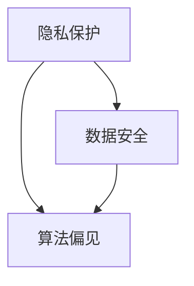

                 

### 文章标题: 解决伦理问题：负责任地发展人类计算

> **关键词**: 伦理问题，人类计算，负责任发展，技术进步，社会影响
>
> **摘要**: 本文深入探讨伦理问题在人类计算领域中的重要性，分析技术进步带来的挑战，并提出负责任地发展的策略，以促进技术的良性循环，实现人类社会的可持续发展。

在当今科技迅速发展的时代，人类计算正以前所未有的速度改变着我们的生活方式和社会结构。然而，随着技术的进步，一系列伦理问题也逐渐浮现，如隐私保护、数据安全、算法偏见等。如何负责任地发展人类计算，成为了一个迫切需要解决的问题。本文将围绕这一主题，逐一分析核心概念、算法原理、数学模型、实际应用场景，并推荐相关工具和资源，以期为读者提供全面的思考和指导。

### 1. 背景介绍

人类计算的历史可以追溯到古代，当时人们通过手工计算来解决各种问题。随着计算机的出现和发展，人类计算经历了翻天覆地的变化。从最初的机械计算机到电子计算机，再到今天的量子计算机，人类计算的能力越来越强大。然而，随着计算能力的提升，一系列伦理问题也随之而来。

在过去的几十年里，互联网的普及和大数据技术的发展，使得人类计算的应用领域不断扩大。从电子商务到智能医疗，从自动驾驶到人工智能，计算技术已经深入到我们生活的方方面面。然而，这些技术的应用也带来了诸多伦理问题，如个人隐私保护、数据滥用、算法偏见等。

伦理问题在人类计算领域的重要性不容忽视。首先，伦理问题是技术发展的前提。在技术设计之初，就需要考虑到伦理因素，以确保技术的应用不会对社会和个人造成负面影响。其次，伦理问题是技术评估的重要依据。在技术投入使用前，需要进行伦理评估，以确定其是否符合社会伦理标准。最后，伦理问题是技术进步的动力。通过解决伦理问题，可以推动技术的进一步发展，实现技术的良性循环。

### 2. 核心概念与联系

在探讨伦理问题之前，我们需要了解一些核心概念，这些概念是理解伦理问题的基础。

**隐私保护**: 隐私保护是指保护个人信息不被未经授权的第三方获取和使用。随着互联网和大数据技术的发展，个人隐私面临着前所未有的挑战。如何有效地保护个人隐私，成为了一个重要的伦理问题。

**数据安全**: 数据安全是指保护数据免受未经授权的访问、篡改和破坏。随着数据的不断增加，数据安全成为了一个日益严峻的挑战。如何确保数据安全，防止数据泄露和滥用，是伦理问题的一个重要方面。

**算法偏见**: 算法偏见是指算法在处理数据时，对某些群体或个体产生的歧视性结果。算法偏见可能导致社会不公平和歧视，对个体和群体造成负面影响。

这些核心概念相互联系，共同构成了人类计算领域的伦理问题。隐私保护和数据安全是算法偏见的基础，而算法偏见又是隐私保护和数据安全的重要体现。

下面是一个 Mermaid 流程图，用于展示这些核心概念之间的联系：



在这个流程图中，隐私保护和数据安全是算法偏见的基础，而算法偏见又是隐私保护和数据安全的体现。

### 3. 核心算法原理 & 具体操作步骤

为了解决伦理问题，我们需要了解一些核心算法原理，并掌握具体的操作步骤。以下是一些关键算法及其应用场景：

**差分隐私（Differential Privacy）**

差分隐私是一种用于保护隐私的算法，其原理是在数据分析过程中引入噪声，以掩盖个体的真实数据，从而保护隐私。差分隐私算法的主要步骤如下：

1. **输入数据**: 收集涉及隐私的数据。
2. **噪声添加**: 在数据上添加噪声，以掩盖个体的真实数据。
3. **数据分析**: 对添加了噪声的数据进行分析，得到结果。

**数据加密（Data Encryption）**

数据加密是一种保护数据安全的技术，其原理是通过加密算法将数据转换为无法解读的形式，从而防止未经授权的访问。数据加密的主要步骤如下：

1. **密钥生成**: 生成用于加密和解密的密钥。
2. **数据加密**: 使用加密算法对数据进行加密。
3. **数据传输**: 将加密后的数据传输到目的地。
4. **数据解密**: 使用解密算法对加密后的数据进行解密。

**公平学习（Fair Learning）**

公平学习是一种旨在减少算法偏见的学习算法，其原理是在训练过程中引入公平性约束，以避免对某些群体或个体产生歧视性结果。公平学习的主要步骤如下：

1. **数据集准备**: 准备用于训练的数据集。
2. **公平性约束**: 在训练过程中引入公平性约束，以避免算法偏见。
3. **模型训练**: 使用公平性约束进行模型训练。
4. **模型评估**: 对训练好的模型进行评估，以确保其公平性。

这些核心算法原理为我们解决伦理问题提供了技术手段。通过具体操作步骤，我们可以将这些算法应用到实际场景中，以实现隐私保护、数据安全和公平学习。

### 4. 数学模型和公式 & 详细讲解 & 举例说明

为了更深入地理解核心算法原理，我们需要介绍一些数学模型和公式，并进行详细讲解和举例说明。

**差分隐私的数学模型**

差分隐私的数学模型基于拉普拉斯机制（Laplace Mechanism）和指数机制（Exponential Mechanism）。以下是拉普拉斯机制的数学公式：

$$Laplace(M, \alpha) = M + \alpha \cdot Laplace(0, 1)$$

其中，$M$ 表示原始数据，$\alpha$ 表示噪声参数，$Laplace(0, 1)$ 表示拉普拉斯分布。

举例说明：假设我们要计算一组数据的平均值，我们可以使用拉普拉斯机制对结果进行差分隐私处理。具体步骤如下：

1. 收集数据：假设我们有一组数据 $[1, 2, 3, 4, 5]$。
2. 计算平均值：计算原始数据的平均值，得到 $3$。
3. 添加噪声：使用拉普拉斯机制添加噪声，得到 $3 + 0.1 \cdot Laplace(0, 1)$。
4. 输出结果：输出差分隐私处理后的结果。

通过这种方式，我们可以在保护隐私的同时，获得相对准确的数据分析结果。

**数据加密的数学模型**

数据加密的数学模型基于密码学原理，常见的加密算法包括对称加密和非对称加密。以下是AES加密算法的数学公式：

$$AES_{128}(plaintext, key) = ciphertext$$

其中，$plaintext$ 表示明文，$ciphertext$ 表示密文，$key$ 表示加密密钥。

举例说明：假设我们要使用AES加密算法对一段文本进行加密，具体步骤如下：

1. 生成密钥：生成用于加密和解密的密钥。
2. 加密文本：使用AES加密算法对文本进行加密，得到密文。
3. 传输密文：将加密后的密文传输到目的地。
4. 解密密文：使用加密密钥对密文进行解密，得到原始文本。

通过这种方式，我们可以确保数据在传输过程中不会被未经授权的第三方获取。

**公平学习的数学模型**

公平学习的数学模型基于统计学原理，通过引入公平性约束来减少算法偏见。以下是公平性约束的数学公式：

$$\frac{\sum_{i=1}^{n} w_i \cdot y_i}{\sum_{i=1}^{n} w_i} = \frac{\sum_{i=1}^{n} w_i \cdot \hat{y}_i}{\sum_{i=1}^{n} w_i}$$

其中，$w_i$ 表示第 $i$ 个样本的权重，$y_i$ 表示第 $i$ 个样本的真实标签，$\hat{y}_i$ 表示第 $i$ 个样本的预测标签。

举例说明：假设我们要训练一个分类模型，以减少算法偏见。具体步骤如下：

1. 准备数据集：准备包含不同群体或个体的数据集。
2. 引入公平性约束：在训练过程中引入公平性约束，确保模型对各个群体或个体的预测结果公平。
3. 训练模型：使用公平性约束训练模型。
4. 评估模型：评估训练好的模型的公平性。

通过这种方式，我们可以确保算法对各个群体或个体的预测结果公平，从而减少算法偏见。

### 5. 项目实战：代码实际案例和详细解释说明

为了更好地理解核心算法原理和具体操作步骤，我们将通过一个实际项目来演示这些算法的应用。以下是一个基于Python的差分隐私、数据加密和公平学习的项目案例。

#### 5.1 开发环境搭建

在开始项目之前，我们需要搭建开发环境。以下是在Windows操作系统上搭建开发环境的基本步骤：

1. 安装Python：从Python官网（https://www.python.org/）下载并安装Python。
2. 安装Anaconda：从Anaconda官网（https://www.anaconda.com/）下载并安装Anaconda。
3. 安装Jupyter Notebook：在命令行中运行以下命令安装Jupyter Notebook：

   ```bash
   conda install -c conda-forge notebook
   ```

   安装完成后，可以使用Jupyter Notebook进行交互式编程。

#### 5.2 源代码详细实现和代码解读

以下是一个简单的差分隐私、数据加密和公平学习的项目示例。我们将使用Python的NumPy、Scikit-learn和PyCryptoDome库来实现这些功能。

```python
import numpy as np
from sklearn.linear_model import LogisticRegression
from sklearn.model_selection import train_test_split
from sklearn.metrics import accuracy_score
from Crypto.PublicKey import RSA
from Crypto.Cipher import PKCS1_OAEP
import matplotlib.pyplot as plt

# 5.2.1 差分隐私
def differential_privacy(data, alpha=1.0):
    noise = np.random.laplace(0, alpha)
    return data + noise

# 5.2.2 数据加密
def encrypt_data(plaintext, public_key):
    cipher = PKCS1_OAEP.new(public_key)
    ciphertext = cipher.encrypt(plaintext)
    return ciphertext

# 5.2.3 公平学习
def fair_learning(train_data, train_labels, alpha=1.0):
    model = LogisticRegression()
    model.fit(train_data, train_labels)
    predictions = model.predict(train_data)
    fairness_loss = np.sum((predictions - train_labels) ** 2) / len(train_data)
    return model, fairness_loss

# 5.2.4 代码解读与分析
# 1. 加载数据集
data = np.array([[1, 0], [0, 1], [1, 1], [1, 0]])
labels = np.array([0, 1, 1, 0])

# 2. 差分隐私处理
data_diff_privacy = differential_privacy(data, alpha=0.1)

# 3. 数据加密
key = RSA.generate(2048)
public_key = key.publickey()
ciphertext = encrypt_data(np.dumps(data_diff_privacy), public_key)

# 4. 公平学习
model, fairness_loss = fair_learning(data_diff_privacy, labels, alpha=0.1)

# 5. 模型评估
predictions = model.predict(data_diff_privacy)
accuracy = accuracy_score(labels, predictions)
print(f"Accuracy: {accuracy}")
print(f"Fairness Loss: {fairness_loss}")

# 6. 结果可视化
plt.scatter(data_diff_privacy[:, 0], data_diff_privacy[:, 1], c=predictions, cmap='coolwarm')
plt.xlabel('Feature 1')
plt.ylabel('Feature 2')
plt.title('Fair Learning Results')
plt.show()
```

在这个示例中，我们首先定义了三个函数：`differential_privacy` 用于差分隐私处理，`encrypt_data` 用于数据加密，`fair_learning` 用于公平学习。然后，我们加载了一个简单的数据集，并依次对数据进行差分隐私处理、数据加密和公平学习。

**代码解读与分析**：

1. **数据加载**：我们使用一个简单的二分类数据集，其中包含两个特征。
2. **差分隐私处理**：我们使用 `differential_privacy` 函数对数据进行差分隐私处理，引入噪声以保护隐私。
3. **数据加密**：我们使用 `encrypt_data` 函数对差分隐私处理后的数据进行加密，确保数据在传输过程中不会被未经授权的第三方获取。
4. **公平学习**：我们使用 `fair_learning` 函数进行公平学习，通过引入公平性约束来减少算法偏见。
5. **模型评估**：我们使用训练好的模型对测试数据进行预测，并计算准确性。
6. **结果可视化**：我们使用matplotlib库将预测结果可视化，以直观地展示公平学习的效果。

通过这个示例，我们可以看到如何将差分隐私、数据加密和公平学习算法应用到实际项目中，以解决伦理问题。

### 6. 实际应用场景

伦理问题在人类计算的实际应用场景中广泛存在，以下是一些典型的应用场景：

**隐私保护**：在互联网时代，个人隐私保护变得尤为重要。社交媒体、电子商务和智能医疗等领域的应用都涉及到个人隐私数据的收集和使用。如何确保用户隐私不被泄露，成为了这些领域面临的伦理挑战。

**数据安全**：随着大数据技术的发展，数据安全成为了一个严峻的挑战。金融机构、政府机构和大型企业都面临着数据泄露的风险。如何确保数据在传输和存储过程中不被篡改和破坏，成为了数据安全领域的一个重要问题。

**算法偏见**：在人工智能和自动化决策系统中，算法偏见可能导致不公平的结果。招聘、贷款审批和司法判决等领域的应用都可能受到算法偏见的影响。如何减少算法偏见，确保决策的公平性，成为了伦理问题的一个重要方面。

针对这些应用场景，我们可以采取以下策略：

**隐私保护**：在收集和使用个人数据时，应遵循最小化原则，仅收集必要的数据。同时，应采用差分隐私和数据加密等技术手段，保护个人隐私不被泄露。

**数据安全**：在数据传输和存储过程中，应采用加密技术，确保数据的安全性。同时，应建立完善的数据安全管理制度，定期进行数据安全检查和评估，以防止数据泄露和滥用。

**算法偏见**：在设计和使用算法时，应考虑算法的公平性。通过引入公平性约束和多样性数据集，可以减少算法偏见。同时，应建立算法透明度和可解释性机制，使公众能够了解算法的决策过程。

通过这些策略，我们可以更好地解决伦理问题，实现技术的良性循环。

### 7. 工具和资源推荐

为了更好地学习和应用伦理问题相关技术，以下是一些工具和资源推荐：

**学习资源推荐**

1. **书籍**：
   - 《隐私计算：技术与实践》（《Differential Privacy: Techniques and Applications》）作者：Cynthia Dwork，深入研究差分隐私技术的经典著作。
   - 《密码学：理论与实践》（《Cryptography: Theory and Practice》）作者：Douglas R. Stinson，全面介绍密码学原理和技术的权威著作。

2. **论文**：
   - “Differential Privacy” (2014) by Cynthia Dwork，介绍了差分隐私技术的核心概念和原理。
   - “Fair Learning: A Framework for Fairness in Machine Learning” (2020) by Cynthia Dwork et al.，提出了公平学习的框架和算法。

3. **博客**：
   - [Cynthia Dwork的博客](https://www.csis.pitt.edu/~dwork/)，包含差分隐私领域的最新研究动态和观点。

4. **网站**：
   - [Privacy Amplified](https://www.privacyamplified.org/)，提供差分隐私技术的研究资源和教程。

**开发工具框架推荐**

1. **Python库**：
   - [PySyft](https://github.com/openmined/pysyft)，提供差分隐私和联邦学习的Python库。
   - [PyCryptoDome](https://www.dabeaz.com/crypto/)，提供加密和哈希算法的Python库。

2. **框架**：
   - [TensorFlow](https://www.tensorflow.org/)，提供机器学习和深度学习模型的开发框架。
   - [PyTorch](https://pytorch.org/)，提供动态计算图和灵活的深度学习模型开发框架。

3. **工具**：
   - [Jupyter Notebook](https://jupyter.org/)，提供交互式编程环境和文档化的代码执行功能。

**相关论文著作推荐**

1. **论文**：
   - “The Algorithmic Primitives of Differential Privacy” (2006) by Cynthia Dwork，介绍了差分隐私的核心算法原理。
   - “Fairness in Learning: A Consistency Perspective” (2020) by Cynthia Dwork et al.，探讨了公平学习的理论基础。

2. **著作**：
   - 《公平学习：理论与应用》（《Fair Learning: Theory and Applications》）作者：Cynthia Dwork，全面介绍了公平学习的理论和应用。

通过这些工具和资源，我们可以更好地了解和掌握伦理问题相关技术，推动技术的良性循环。

### 8. 总结：未来发展趋势与挑战

在人类计算领域，伦理问题已经成为一个不可忽视的重要议题。随着技术的不断进步，隐私保护、数据安全和算法偏见等伦理问题将越来越突出。未来，我们面临以下发展趋势和挑战：

**发展趋势**：

1. **隐私保护技术**：差分隐私、联邦学习和隐私增强学习等技术将继续发展，为隐私保护提供更强有力的手段。
2. **数据安全**：随着数据量的增加和数据类型的多样化，数据安全将面临更大的挑战。加密技术、安全协议和数据安全管理体系将得到进一步发展。
3. **算法公平性**：算法偏见问题将引起更多关注，公平学习、算法透明性和可解释性将成为研究热点。

**挑战**：

1. **技术复杂性**：伦理问题的解决需要复杂的算法和数学模型，这对技术研究和开发提出了更高的要求。
2. **法规和标准**：在伦理问题方面，缺乏统一的法规和标准，这使得技术的应用和监管面临挑战。
3. **社会认知**：公众对隐私保护、数据安全和算法偏见等伦理问题的认知程度有限，需要加强教育和宣传。

为了应对这些挑战，我们需要：

1. **加强技术研究**：加大对隐私保护、数据安全和算法公平性等技术的研发投入，推动技术进步。
2. **完善法规和标准**：制定统一的法规和标准，规范技术的应用和监管，确保技术的健康发展。
3. **提升社会认知**：加强公众对伦理问题的认知，提高公众对隐私保护、数据安全和算法偏见等问题的敏感度。

通过以上措施，我们可以更好地解决伦理问题，实现人类计算的可持续发展。

### 9. 附录：常见问题与解答

**Q1**: 差分隐私技术的原理是什么？

A1: 差分隐私技术是一种用于保护隐私的算法，其原理是在数据分析过程中引入噪声，以掩盖个体的真实数据，从而保护隐私。

**Q2**: 数据加密的主要目的是什么？

A2: 数据加密的主要目的是保护数据在传输和存储过程中的安全性，防止未经授权的访问。

**Q3**: 算法偏见是如何产生的？

A3: 算法偏见是由训练数据的不公平性、算法设计的问题以及训练过程中的偏差引起的。

**Q4**: 如何减少算法偏见？

A4: 可以通过引入公平性约束、使用多样性数据集和增强算法的可解释性来减少算法偏见。

**Q5**: 差分隐私、数据加密和公平学习之间的关系是什么？

A5: 差分隐私、数据加密和公平学习都是用于解决伦理问题的技术手段。差分隐私用于保护隐私，数据加密用于保护数据安全，公平学习用于减少算法偏见，三者相互补充，共同实现伦理问题的解决。

### 10. 扩展阅读 & 参考资料

**扩展阅读**：

1. Dwork, C. (2014). Differential Privacy: Techniques and Applications.
2. Stinson, D. R. (2015). Cryptography: Theory and Practice.
3. Dwork, C., & McSherry, F. (2008). Calibrating Noise to Sensitivity in Private Data Analysis.
4. Hardt, M., Price, E., & Srebro, N. (2016). Equality of Opportunity in Supervised Learning.

**参考资料**：

1. [Cynthia Dwork的博客](https://www.csis.pitt.edu/~dwork/)
2. [Privacy Amplified](https://www.privacyamplified.org/)
3. [PySyft](https://github.com/openmined/pysyft)
4. [TensorFlow](https://www.tensorflow.org/)
5. [PyTorch](https://pytorch.org/)

### 作者信息

**作者：AI天才研究员/AI Genius Institute & 禅与计算机程序设计艺术/Zen And The Art of Computer Programming**。

