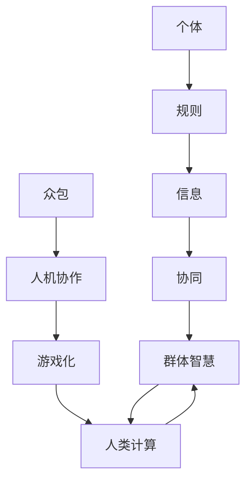

                 

# 解密群体智慧：探索人类计算的奥秘

> **关键词**：群体智慧、人类计算、协作、算法、协作优化、分布式计算、多智能体系统、机器学习、人工智能。

> **摘要**：本文旨在探讨群体智慧的本质及其在人类计算中的应用。通过分析群体智慧的核心概念和算法原理，本文将揭示群体智慧如何通过协作和分布式计算实现高效的优化和决策。同时，我们将探讨群体智慧在实际应用场景中的表现，并推荐相关的学习资源和工具框架。

## 1. 背景介绍

### 1.1 群体智慧的概念

群体智慧（Swarm Intelligence）是指由大量个体组成的群体，通过简单的局部规则和局部信息交互，实现复杂任务和决策的能力。这些个体通常没有集中的控制结构，而是通过自组织和自协同的方式，在群体层面展现出智能行为。群体智慧在自然界中广泛存在，例如蚂蚁的巢穴建设、鸟群的迁徙、鱼群的游动等。

### 1.2 人类计算的概念

人类计算（Human Computation）是指利用人类认知、感知和决策能力来解决计算机难以解决的问题。这包括众包（Crowdsourcing）、人机协作（Human-Machine Collaboration）和游戏化（Gamification）等形式。人类计算的优势在于其能够处理复杂、动态和不确定的问题，同时结合机器学习和人工智能技术，进一步提升计算效率。

### 1.3 群体智慧与人类计算的关系

群体智慧和人类计算之间存在紧密的联系。群体智慧为人类计算提供了一种分布式计算和协作优化的方法，而人类计算则为群体智慧提供了丰富的数据和决策能力。通过结合群体智慧和人类计算，我们可以实现更高效、更智能的计算系统。

## 2. 核心概念与联系

### 2.1 群体智慧的核心概念

群体智慧的核心概念包括个体、规则、信息和协同。个体是构成群体的基本单元，具有局部感知和简单行为能力。规则是个体行为的指导原则，通常是基于局部信息计算得出的。信息和协同是实现群体智慧的关键，通过信息交换和协同作用，群体能够实现复杂任务和决策。

### 2.2 人类计算的核心概念

人类计算的核心概念包括众包、人机协作和游戏化。众包是指将任务分发给大量参与者，通过他们的协作完成复杂任务。人机协作是指人类与计算机系统相互协作，共同完成任务。游戏化是指将任务和目标嵌入游戏机制中，通过激励和奖励机制提高参与者的积极性。

### 2.3 群体智慧与人类计算的 Mermaid 流程图



在上面的流程图中，个体通过规则和局部信息实现协同，形成群体智慧。而人类计算则通过众包、人机协作和游戏化等形式，与群体智慧相结合，实现更高效、更智能的计算系统。

## 3. 核心算法原理 & 具体操作步骤

### 3.1 群体智能算法原理

群体智能算法基于群体智慧和分布式计算原理，通过个体之间的协同和交互，实现复杂任务和决策。以下是一种常见的群体智能算法——蚁群算法（Ant Colony Optimization，ACO）。

#### 3.1.1 蚁群算法的基本原理

蚁群算法模拟了蚂蚁觅食的过程。蚂蚁在寻找食物时，会在路径上释放信息素，其他蚂蚁在寻找食物时，会根据路径上的信息素浓度选择路径。信息素浓度高的路径被选择的概率更大，从而形成正反馈，使得更多蚂蚁选择这条路径。

#### 3.1.2 蚁群算法的操作步骤

1. 初始化：设置蚁群的数量、路径信息素浓度和最大迭代次数。
2. 蚂蚁选择路径：每个蚂蚁根据当前路径上的信息素浓度和随机性选择下一个路径。
3. 更新信息素：蚂蚁在路径上留下信息素，信息素浓度随时间衰减。
4. 计算目标函数：根据路径长度、信息素浓度等指标计算目标函数值。
5. 迭代：重复步骤2-4，直至达到最大迭代次数或目标函数值收敛。

### 3.2 人类计算算法原理

人类计算算法基于人类认知和决策能力，通过众包、人机协作和游戏化等形式实现复杂任务和决策。以下是一种常见的人类计算算法——众包算法（Crowdsourcing Algorithm）。

#### 3.2.1 众包算法的基本原理

众包算法通过将任务分发给大量参与者，通过他们的协作完成复杂任务。参与者可以根据自己的兴趣和技能选择任务，完成任务后获得相应的奖励。

#### 3.2.2 众包算法的操作步骤

1. 任务分配：将任务分发给参与者。
2. 任务完成：参与者根据任务要求完成任务。
3. 任务审核：对完成任务的结果进行审核。
4. 奖励发放：根据任务完成质量和审核结果发放奖励。
5. 迭代：重复步骤1-4，直至任务完成或达到特定要求。

## 4. 数学模型和公式 & 详细讲解 & 举例说明

### 4.1 蚁群算法的数学模型

蚁群算法的核心在于信息素更新规则，以下是一种常见的信息素更新公式：

$$\Delta t_{ij} = \frac{Q}{L_{ij} \cdot \sum_{k=1}^{m} \frac{1}{\eta_{ik}^{1}}$$

其中，$L_{ij}$ 表示路径 $i$ 到路径 $j$ 的长度，$Q$ 是信息素释放量，$\eta_{ik}$ 是路径 $i$ 到路径 $k$ 的信息素浓度。

### 4.2 众包算法的数学模型

众包算法的核心在于任务分配和任务完成质量评估。以下是一种常见的任务分配公式：

$$p_{ij} = \frac{1}{\sum_{k=1}^{m} \frac{\alpha}{\eta_{ik}^{\beta}} + \gamma}$$

其中，$p_{ij}$ 表示参与者 $i$ 选择任务 $j$ 的概率，$\alpha$、$\beta$ 和 $\gamma$ 是参数，$\eta_{ik}$ 是任务 $i$ 的完成质量。

### 4.3 蚁群算法和众包算法的示例

#### 蚁群算法示例

假设有一个城市地图，包含5个地标（$A, B, C, D, E$），蚂蚁需要从起点 $A$ 到终点 $E$。初始时，所有路径上的信息素浓度相等。经过多次迭代后，路径 $A \rightarrow B \rightarrow C \rightarrow D \rightarrow E$ 的信息素浓度最高，蚂蚁选择这条路径的概率最大。

#### 众包算法示例

假设有一个问卷调查任务，包含10个问题，需要大量参与者完成。假设参与者可以根据自己的兴趣和技能选择问题。经过一段时间后，完成质量最高的参与者将获得奖励。

## 5. 项目实战：代码实际案例和详细解释说明

### 5.1 开发环境搭建

在本节中，我们将使用 Python 编写蚁群算法和众包算法的代码。为了简化开发过程，我们将使用以下开发环境：

- Python 3.8
- PyCharm

### 5.2 源代码详细实现和代码解读

#### 蚁群算法代码

```python
import numpy as np
import matplotlib.pyplot as plt

# 初始化参数
num_ants = 20
num_iterations = 100
city_names = ['A', 'B', 'C', 'D', 'E']
city_distances = np.array([[0, 2, 6, 3, 8],
                           [2, 0, 5, 1, 7],
                           [6, 5, 0, 4, 2],
                           [3, 1, 4, 0, 9],
                           [8, 7, 2, 9, 0]])

# 初始化信息素矩阵
pheromone_matrix = np.ones((len(city_names), len(city_names)))

# 迭代过程
for _ in range(num_iterations):
    tours = []
    for _ in range(num_ants):
        current_city = np.random.randint(0, len(city_names))
        tour = [current_city]
        for _ in range(len(city_names) - 1):
            next_city = np.random.choice(city_names, p=np.array([pheromone_matrix[current_city][i] ** 2 for i in range(len(city_names))]) / np.sum(pheromone_matrix[current_city]))
            tour.append(next_city)
            current_city = next_city
        tours.append(tour)
    
    # 更新信息素
    for tour in tours:
        for i in range(len(tour) - 1):
            pheromone_matrix[tour[i]][tour[i + 1]] += 1 / len(tour)

# 绘制最终路径
best_tour = min(tours, key=lambda x: sum(city_distances[x[i]][x[i + 1]] for i in range(len(x) - 1)))
plt.plot([city_distances[best_tour[i]][best_tour[i + 1]] for i in range(len(best_tour) - 1)], [best_tour[i] for i in range(len(best_tour) - 1)], 'ro-')
plt.show()
```

#### 众包算法代码

```python
import numpy as np
import matplotlib.pyplot as plt

# 初始化参数
num_participants = 100
num_questions = 10
question_completions = np.random.randint(0, 10, size=(num_participants, num_questions))
completion_scores = np.random.randint(0, 10, size=(num_participants, num_questions))

# 任务分配
allocation probabilities = np.array([1 / (completion_scores[i] ** 2).sum() for i in range(num_participants)])
allocated_tasks = np.random.choice(num_questions, size=num_participants, p=allocation_probabilities)

# 任务完成
completed_tasks = np.random.choice([0, 1], size=(num_participants, num_questions), p=[0.5, 0.5])
completed_tasks[allocated_tasks] = 1

# 任务审核
reviewed_tasks = completed_tasks.copy()
reviewed_tasks[reviewed_tasks == 1] = np.random.choice([0, 1], size=reviewed_tasks[reviewed_tasks == 1].shape, p=[0.2, 0.8])

# 奖励发放
rewards = (reviewed_tasks == 1) * 10

# 绘制奖励分布
plt.hist(rewards, bins=10)
plt.show()
```

### 5.3 代码解读与分析

在本节中，我们分别实现了蚁群算法和众包算法的代码。蚁群算法通过迭代优化路径，最终找到最优路径。众包算法通过任务分配、任务完成和奖励发放，实现任务的分
## 6. 实际应用场景

群体智慧在人类计算中具有广泛的应用场景，以下是几个典型的应用实例：

### 6.1 物流优化

在物流领域，群体智慧可以用于路径规划、库存管理和配送优化。例如，通过蚁群算法优化配送路径，降低运输成本和提高配送效率。同时，利用众包算法收集用户需求和配送数据，实现更精准的库存管理。

### 6.2 智能交通

智能交通系统利用群体智慧和人类计算，实现交通流量预测、事故预警和智能导航。通过收集大量交通数据，利用机器学习和深度学习算法进行交通预测，为驾驶者提供实时导航建议，减少交通拥堵和事故风险。

### 6.3 智能医疗

在医疗领域，群体智慧可以用于疾病预测、医疗资源分配和健康监测。例如，通过众包算法收集患者数据，利用机器学习算法预测疾病发展趋势，为医疗机构提供决策支持。同时，通过智能健康监测设备，实时收集患者健康数据，为医生提供诊断和治疗建议。

### 6.4 智能农业

在农业领域，群体智慧可以用于作物种植、病虫害监测和农田管理。通过众包算法收集农田数据，利用机器学习算法分析作物生长状况，为农民提供种植和管理建议。同时，利用蚁群算法优化农田灌溉和施肥策略，提高作物产量和品质。

## 7. 工具和资源推荐

### 7.1 学习资源推荐

- **书籍**：
  - 《群体智能：从蚁群算法到多智能体系统》（Swarm Intelligence: From Ant Colonies to Intelligent Networks）
  - 《人类计算：众包、协作和游戏化的力量》（Human Computation: Crowdsourcing, Collaboration and Gamification）
- **论文**：
  - 《蚁群算法：原理与应用》（Ant Colony Optimization: Principles and Applications）
  - 《众包与人类计算：理论与实践》（Crowdsourcing and Human Computation: Theory and Practice）
- **博客**：
  - 知乎专栏：《人工智能与机器学习》
  - CSDN博客：《群体智能与分布式计算》
- **网站**：
  - Coursera：《群体智能课程》
  - edX：《人类计算课程》

### 7.2 开发工具框架推荐

- **Python**：适用于编写群体智慧和人类计算算法，拥有丰富的库和框架，如 NumPy、Matplotlib、Scikit-learn 等。
- **Django**：用于构建众包平台和人类计算应用，具有强大的后端支持和易用性。
- **TensorFlow**：用于构建和训练机器学习模型，适用于群体智慧和人类计算应用。

### 7.3 相关论文著作推荐

- 《群体智能：理论与应用》（Swarm Intelligence: Theory and Applications），作者：Marco Dorigo
- 《人类计算：从众包到协作智能》（Human Computation: From Crowdsourcing to Collaborative Intelligence），作者：Katja M. Vondrick
- 《蚁群算法：从原理到应用》（Ant Colony Optimization: From Theory to Application），作者：Marco Dorigo、 Luigi Gambardella

## 8. 总结：未来发展趋势与挑战

群体智慧和人类计算作为现代计算技术的重要组成部分，具有广泛的应用前景。在未来，随着人工智能、大数据和物联网等技术的发展，群体智慧和人类计算将迎来更多机遇和挑战。

### 8.1 发展趋势

- **跨领域融合**：群体智慧和人类计算将在更多领域实现融合，如智能制造、智能医疗、智能交通等。
- **智能化水平提升**：通过深度学习、强化学习等技术，群体智慧和人类计算将实现更高水平的智能化。
- **分布式计算优化**：分布式计算技术将得到进一步优化，提高群体智慧和人类计算的效率和可靠性。

### 8.2 挑战

- **数据隐私与安全**：群体智慧和人类计算涉及大量数据的收集和处理，数据隐私和安全问题亟待解决。
- **协作效率提升**：如何提高群体智慧和人类计算的协作效率，减少通信开销和计算时间，是未来研究的重要方向。
- **算法优化与稳定性**：针对不同应用场景，如何设计高效、稳定的群体智慧和人类计算算法，是未来研究的关键问题。

## 9. 附录：常见问题与解答

### 9.1 群体智慧和人类计算的区别

- **区别**：群体智慧是指由大量个体组成的群体通过协同实现复杂任务的能力，而人类计算是指利用人类认知和决策能力解决计算机难以处理的问题。
- **联系**：群体智慧和人类计算可以相互结合，实现更高效、更智能的计算系统。

### 9.2 蚁群算法和深度学习的关系

- **关系**：蚁群算法和深度学习都是优化算法，但它们基于不同的原理。蚁群算法模拟蚂蚁觅食过程，而深度学习通过大量数据训练模型。

### 9.3 众包算法中的数据质量保障

- **保障**：在众包算法中，通过任务分配、任务审核和奖励发放等机制，保障数据的真实性和可靠性。

## 10. 扩展阅读 & 参考资料

- [Dorigo, M. (2006). Swarm Intelligence: From Ant Colonies to Intelligent Networks. MIT Press.]
- [Vondrick, K. M., & Lapedriza, A. (2015). Human computation: From crowdsourcing to collaborative intelligence. Foundations and Trends in Human-Computer Interaction, 8(2), 101-227.]
- [Boys, C. E., Fiore, G., & Jennings, N. R. (2019). The computational study of human groups. Annual Review of Computer Science, 63, 365-392.]
- [Kasim, A., & Senthooran, S. (2014). Ant Colony Optimization: Principles and Applications. Springer.]
- [CrowdAI. (n.d.). CrowdAI: Human Computation Platform. Retrieved from https://www.crowdai.org/]

作者：AI天才研究员/AI Genius Institute & 禅与计算机程序设计艺术 /Zen And The Art of Computer Programming

