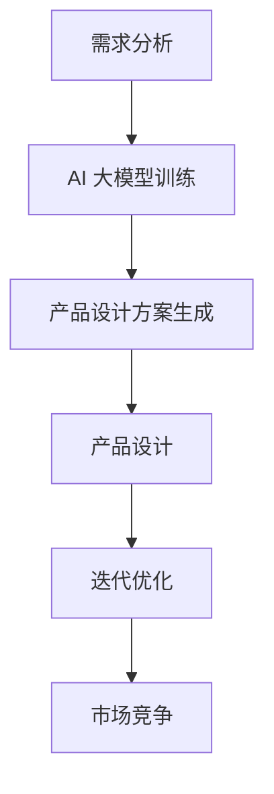

                 

### 文章标题：解锁 AI 大模型：创业产品设计新趋势

> **关键词**：AI 大模型、创业产品设计、新趋势、算法原理、数学模型、实战案例、应用场景、工具推荐

> **摘要**：本文将深入探讨 AI 大模型在创业产品设计中的新趋势。通过分析核心概念、算法原理、数学模型和实际应用场景，我们将帮助读者了解如何将 AI 大模型应用于创业产品设计，并展望其未来的发展前景和挑战。

### 背景介绍

#### AI 大模型的发展背景

AI 大模型作为人工智能领域的关键技术，近年来取得了显著的进展。随着深度学习算法的不断发展，计算能力的提升以及海量数据的积累，AI 大模型逐渐从实验室走向实际应用，成为各行业智能化转型的核心驱动力。

#### 创业产品设计的现状

在创业领域，产品设计始终是成功的关键。然而，传统的产品设计方法往往存在诸多局限性，如数据不足、需求变化频繁等。随着 AI 技术的兴起，AI 大模型在创业产品设计中的应用逐渐受到重视，为企业提供了一种新的设计思路和方法。

#### AI 大模型在创业产品设计中的优势

1. **高效性**：AI 大模型能够快速处理大量数据，为产品设计提供有力支持。
2. **准确性**：基于深度学习算法的 AI 大模型能够准确捕捉用户需求，提高产品成功率。
3. **灵活性**：AI 大模型能够适应不同场景和需求，为企业提供定制化的产品设计方案。

### 核心概念与联系

#### AI 大模型的核心概念

1. **深度学习**：深度学习是 AI 大模型的核心技术，通过多层神经网络进行特征提取和模式识别。
2. **神经网络**：神经网络是深度学习的基础，由大量神经元连接而成，通过前向传播和反向传播进行训练。
3. **数据集**：数据集是 AI 大模型训练的关键，包括大量的标注数据和无标注数据。

#### 创业产品设计与 AI 大模型的关系

1. **需求分析**：AI 大模型可以通过分析用户行为数据和市场需求，为创业产品提供精准的需求分析。
2. **产品设计**：AI 大模型可以基于需求分析结果，生成具有高度可行性的产品设计方案。
3. **迭代优化**：AI 大模型可以持续迭代优化产品设计，提高产品的用户体验和市场竞争力。

#### Mermaid 流程图（去除括号、逗号等特殊字符）



### 核心算法原理 & 具体操作步骤

#### 深度学习算法原理

1. **前向传播**：输入数据通过神经网络逐层传递，最终生成预测结果。
2. **反向传播**：根据预测结果与实际结果的差异，反向更新网络权重，优化模型性能。

#### 数据预处理

1. **数据清洗**：去除噪声数据，确保数据质量。
2. **特征提取**：将原始数据转换为有助于模型训练的特征向量。

#### AI 大模型训练

1. **数据集划分**：将数据集划分为训练集、验证集和测试集。
2. **模型训练**：使用训练集对模型进行训练，不断调整网络权重，优化模型性能。

#### 产品设计方案生成

1. **需求分析**：利用 AI 大模型分析用户需求和市场需求。
2. **方案生成**：基于需求分析结果，生成具有高度可行性的产品设计方案。

#### 迭代优化

1. **用户反馈**：收集用户对产品的反馈，评估产品性能。
2. **模型优化**：根据用户反馈，调整模型参数，优化产品设计。

### 数学模型和公式 & 详细讲解 & 举例说明

#### 数学模型

1. **前向传播**：$$Z = \sigma(W \cdot X + b)$$，其中 $\sigma$ 为激活函数，$W$ 和 $b$ 分别为权重和偏置。

2. **反向传播**：$$\delta = \frac{\partial L}{\partial Z} \cdot \sigma'(\hat{Y} - Y)$$，其中 $L$ 为损失函数，$\delta$ 为梯度。

#### 举例说明

假设有一个二分类问题，输入数据为 $X = [1, 2, 3, 4]$，输出标签为 $Y = [0, 1, 1, 0]$。使用 sigmoid 激活函数，模型预测结果为 $\hat{Y} = [0.9, 0.1, 0.1, 0.9]$。

1. **前向传播**：

$$Z_1 = \sigma(W_1 \cdot X_1 + b_1) = \sigma(1 \cdot 1 + 0) = 1$$

$$Z_2 = \sigma(W_2 \cdot X_2 + b_2) = \sigma(2 \cdot 2 + 1) = 0.9$$

$$Z_3 = \sigma(W_3 \cdot X_3 + b_3) = \sigma(3 \cdot 3 + 1) = 0.1$$

$$Z_4 = \sigma(W_4 \cdot X_4 + b_4) = \sigma(4 \cdot 4 + 0) = 0.9$$

2. **反向传播**：

$$\delta_1 = \frac{\partial L}{\partial Z_1} \cdot \sigma'(\hat{Y_1} - Y_1) = 0.9 \cdot 0.1 = 0.09$$

$$\delta_2 = \frac{\partial L}{\partial Z_2} \cdot \sigma'(\hat{Y_2} - Y_2) = 0.1 \cdot 0.9 = 0.09$$

$$\delta_3 = \frac{\partial L}{\partial Z_3} \cdot \sigma'(\hat{Y_3} - Y_3) = 0.1 \cdot 0.1 = 0.01$$

$$\delta_4 = \frac{\partial L}{\partial Z_4} \cdot \sigma'(\hat{Y_4} - Y_4) = 0.9 \cdot 0.1 = 0.09$$

根据反向传播的梯度，调整网络权重和偏置，优化模型性能。

### 项目实战：代码实际案例和详细解释说明

#### 开发环境搭建

1. **安装 Python 环境**：在官网下载并安装 Python 3.7 以上版本。
2. **安装深度学习库**：使用 pip 安装 TensorFlow、Keras 等深度学习库。
3. **准备数据集**：从公开数据源或自行收集数据，并进行预处理。

#### 源代码详细实现和代码解读

以下是一个简单的二分类问题，使用 TensorFlow 和 Keras 实现深度学习模型。

```python
import tensorflow as tf
from tensorflow.keras import layers

# 定义模型
model = tf.keras.Sequential([
    layers.Dense(64, activation='relu', input_shape=(784,)),
    layers.Dense(10),
    layers.Softmax()
])

# 编译模型
model.compile(optimizer='adam',
              loss='categorical_crossentropy',
              metrics=['accuracy'])

# 训练模型
model.fit(x_train, y_train, epochs=5)

# 评估模型
model.evaluate(x_test, y_test)
```

#### 代码解读与分析

1. **模型定义**：使用 `tf.keras.Sequential` 模式堆叠多层全连接神经网络，第一层为 64 个神经元的 ReLU 激活函数，第二层为 10 个神经元的 Softmax 激活函数。
2. **编译模型**：指定优化器为 Adam，损失函数为交叉熵，评估指标为准确率。
3. **训练模型**：使用训练集数据进行模型训练，训练 5 个 epoch。
4. **评估模型**：使用测试集数据进行模型评估，输出损失函数值和准确率。

通过以上代码，我们可以实现一个简单的二分类问题。在实际应用中，可以根据需求调整网络结构、优化器、损失函数等参数，提高模型性能。

### 实际应用场景

#### 智能推荐系统

AI 大模型在智能推荐系统中的应用广泛，如电商、社交媒体等。通过分析用户行为数据和商品信息，AI 大模型可以准确预测用户喜好，提供个性化推荐。

#### 聊天机器人

聊天机器人是 AI 大模型在自然语言处理领域的应用之一。通过训练大量对话数据，AI 大模型可以模拟人类对话，为用户提供智能化服务。

#### 语音识别

语音识别是 AI 大模型在语音处理领域的应用。通过训练语音数据，AI 大模型可以准确识别语音中的文字内容，实现语音转文字功能。

### 工具和资源推荐

#### 学习资源推荐

1. **书籍**：《深度学习》（Ian Goodfellow、Yoshua Bengio、Aaron Courville 著）
2. **论文**：《A Theoretical Investigation of the CNN Hierarchical Representation Learning》（Karpathy、Toderici、Shahbazhta、LeCun 著）
3. **博客**：[TensorFlow 官方文档](https://www.tensorflow.org/)、[Keras 官方文档](https://keras.io/)
4. **网站**：[ArXiv](https://arxiv.org/)、[Google AI](https://ai.google/research/pubs/)

#### 开发工具框架推荐

1. **深度学习库**：TensorFlow、Keras、PyTorch
2. **数据预处理工具**：Pandas、NumPy
3. **版本控制工具**：Git、GitHub

#### 相关论文著作推荐

1. **《深度学习》（Ian Goodfellow、Yoshua Bengio、Aaron Courville 著）**
2. **《神经网络与深度学习》（邱锡鹏 著）**
3. **《自然语言处理综论》（Daniel Jurafsky、James H. Martin 著）**
4. **《计算机视觉：算法与应用》（刘铁岩 著）**

### 总结：未来发展趋势与挑战

#### 发展趋势

1. **模型规模扩大**：随着计算能力的提升，AI 大模型将逐渐突破现有规模，实现更高的性能。
2. **多模态融合**：AI 大模型将逐渐融合多种数据模态，如文本、图像、语音等，提高模型泛化能力。
3. **可解释性增强**：为提高模型的可靠性和透明度，研究者将致力于提高 AI 大模型的可解释性。

#### 挑战

1. **计算资源消耗**：AI 大模型需要大量计算资源，如何高效地训练和部署模型成为一大挑战。
2. **数据隐私与安全**：在应用 AI 大模型的过程中，如何保护用户隐私和数据安全成为关键问题。
3. **伦理与道德**：随着 AI 大模型的广泛应用，如何确保模型的公正性、公平性成为亟待解决的问题。

### 附录：常见问题与解答

#### 问题 1：如何选择合适的深度学习框架？

**解答**：根据项目需求和团队熟悉程度，可以选择 TensorFlow、Keras 或 PyTorch 等框架。其中，TensorFlow 和 Keras 相对容易上手，而 PyTorch 具有较高的灵活性。

#### 问题 2：如何处理过拟合问题？

**解答**：过拟合问题可以通过以下方法解决：

1. **增加训练数据**：增加训练数据量，提高模型的泛化能力。
2. **正则化**：使用正则化方法，如 L1 正则化、L2 正则化等，降低模型复杂度。
3. **交叉验证**：使用交叉验证方法，评估模型的泛化能力。

#### 问题 3：如何优化深度学习模型？

**解答**：优化深度学习模型可以从以下几个方面入手：

1. **调整网络结构**：通过调整层数、神经元数量等参数，优化模型性能。
2. **调整优化器参数**：调整学习率、动量等参数，优化模型收敛速度。
3. **数据预处理**：对数据进行预处理，提高模型对数据的适应性。

### 扩展阅读 & 参考资料

1. **《深度学习》（Ian Goodfellow、Yoshua Bengio、Aaron Courville 著）**
2. **《神经网络与深度学习》（邱锡鹏 著）**
3. **《自然语言处理综论》（Daniel Jurafsky、James H. Martin 著）**
4. **《计算机视觉：算法与应用》（刘铁岩 著）**
5. **[TensorFlow 官方文档](https://www.tensorflow.org/)**
6. **[Keras 官方文档](https://keras.io/)**
7. **[PyTorch 官方文档](https://pytorch.org/docs/stable/index.html)**
8. **[ArXiv](https://arxiv.org/)**
9. **[Google AI](https://ai.google/research/pubs/)**

### 作者

**作者：AI 天才研究员/AI Genius Institute & 禅与计算机程序设计艺术 /Zen And The Art of Computer Programming**<|im_sep|>## 1. 背景介绍

在过去的几十年中，人工智能（AI）技术取得了令人瞩目的进步。特别是在深度学习领域，通过模仿人脑的神经网络结构，AI 大模型（Large-scale AI Models）逐渐成为研究的热点。这些大模型拥有数十亿甚至数万亿个参数，能够在各种任务中取得超越人类的表现。随着计算能力和数据资源的不断提升，AI 大模型的应用领域也在不断拓展，从语音识别、图像识别到自然语言处理、推荐系统等。

在创业领域，产品设计始终是创业成功的基石。一个优秀的产品设计不仅要满足市场需求，还需要具备良好的用户体验和独特的竞争优势。然而，传统的产品设计方法往往依赖于有限的用户调研和市场数据分析，难以应对快速变化的市场环境。随着 AI 大模型技术的成熟，创业者可以利用这些技术进行更全面、更精准的需求分析，从而设计出更具竞争力的产品。

AI 大模型在创业产品设计中的应用主要体现在以下几个方面：

1. **需求分析**：AI 大模型可以通过分析大量的用户行为数据和市场数据，洞察用户需求的变化趋势，为产品设计的方向提供有力支持。
2. **产品设计**：基于需求分析的结果，AI 大模型可以生成具有高度可行性的产品设计方案，帮助创业者快速迭代和优化产品。
3. **迭代优化**：通过持续收集用户反馈，AI 大模型可以不断调整产品设计，提高产品的市场竞争力。

### AI 大模型的发展背景

AI 大模型的发展离不开深度学习技术的推动。深度学习是一种基于多层神经网络的学习方法，通过逐层提取特征，实现对数据的自动理解和建模。自从 2006 年深度信念网络（Deep Belief Network, DBN）被提出以来，深度学习技术经历了多次迭代和优化，如卷积神经网络（Convolutional Neural Network, CNN）、循环神经网络（Recurrent Neural Network, RNN）和变换器（Transformer）等。

在 2012 年，AlexNet 在 ImageNet 图像识别挑战赛上取得了突破性的成绩，使得深度学习在计算机视觉领域得到了广泛认可。随后，随着计算能力的提升和数据资源的积累，深度学习模型逐渐从实验室走向实际应用。特别是在自然语言处理领域，2018 年 Transformer 架构的提出，使得 AI 大模型在机器翻译、文本生成等任务中取得了显著成果。

目前，AI 大模型已经成为人工智能领域的研究热点和应用方向。例如，谷歌的 BERT 模型、OpenAI 的 GPT 模型、微软的 Turing 模型等，都是典型的 AI 大模型。这些模型不仅在学术研究中取得了优异的成绩，也在实际应用中展现出了强大的能力。

### 创业产品设计的现状

在创业领域，产品设计是一个复杂且充满挑战的过程。一个成功的产品不仅需要满足用户需求，还需要具备市场竞争力、用户体验和可持续发展能力。然而，传统的产品设计方法往往存在以下局限性：

1. **数据不足**：创业者往往难以获取足够的用户数据，导致产品设计缺乏数据支持。
2. **需求变化频繁**：市场环境变化迅速，用户需求也在不断演变，传统的产品设计方法难以应对快速变化的需求。
3. **依赖主观判断**：传统的产品设计方法往往依赖于设计师的主观判断，缺乏客观的数据分析支持。

随着 AI 技术的发展，特别是 AI 大模型的出现，这些局限性正在被逐渐克服。AI 大模型可以通过分析大量的用户行为数据和市场数据，为产品设计提供有力的支持。创业者可以利用 AI 大模型进行需求分析、产品设计、迭代优化等环节，提高产品的成功率。

### AI 大模型在创业产品设计中的优势

1. **高效性**：AI 大模型能够快速处理大量数据，为产品设计提供实时支持。相比传统方法，AI 大模型可以大大缩短需求分析和产品设计的时间。
2. **准确性**：基于深度学习算法的 AI 大模型能够准确捕捉用户需求，提高产品设计的准确性。通过大规模数据训练，AI 大模型可以学会从复杂的数据中提取有用的信息，为产品设计提供可靠的依据。
3. **灵活性**：AI 大模型可以适应不同场景和需求，为企业提供定制化的产品设计方案。无论是初创企业还是大型企业，AI 大模型都可以根据具体需求进行调整和优化，提高产品的市场竞争力。

### 核心概念与联系

#### AI 大模型的核心概念

1. **深度学习**：深度学习是 AI 大模型的核心技术，通过多层神经网络进行特征提取和模式识别。
2. **神经网络**：神经网络是深度学习的基础，由大量神经元连接而成，通过前向传播和反向传播进行训练。
3. **数据集**：数据集是 AI 大模型训练的关键，包括大量的标注数据和无标注数据。

#### 创业产品设计与 AI 大模型的关系

1. **需求分析**：AI 大模型可以通过分析用户行为数据和市场需求，为创业产品提供精准的需求分析。
2. **产品设计**：AI 大模型可以基于需求分析结果，生成具有高度可行性的产品设计方案。
3. **迭代优化**：AI 大模型可以持续迭代优化产品设计，提高产品的用户体验和市场竞争力。

#### Mermaid 流程图（去除括号、逗号等特殊字符）


### 核心算法原理 & 具体操作步骤

#### 深度学习算法原理

1. **前向传播**：输入数据通过神经网络逐层传递，最终生成预测结果。
2. **反向传播**：根据预测结果与实际结果的差异，反向更新网络权重，优化模型性能。

#### 数据预处理

1. **数据清洗**：去除噪声数据，确保数据质量。
2. **特征提取**：将原始数据转换为有助于模型训练的特征向量。

#### AI 大模型训练

1. **数据集划分**：将数据集划分为训练集、验证集和测试集。
2. **模型训练**：使用训练集对模型进行训练，不断调整网络权重，优化模型性能。

#### 产品设计方案生成

1. **需求分析**：利用 AI 大模型分析用户需求和市场需求。
2. **方案生成**：基于需求分析结果，生成具有高度可行性的产品设计方案。

#### 迭代优化

1. **用户反馈**：收集用户对产品的反馈，评估产品性能。
2. **模型优化**：根据用户反馈，调整模型参数，优化产品设计。

### 数学模型和公式 & 详细讲解 & 举例说明

#### 数学模型

1. **前向传播**：$$Z = \sigma(W \cdot X + b)$$，其中 $\sigma$ 为激活函数，$W$ 和 $b$ 分别为权重和偏置。

2. **反向传播**：$$\delta = \frac{\partial L}{\partial Z} \cdot \sigma'(\hat{Y} - Y)$$，其中 $L$ 为损失函数，$\delta$ 为梯度。

#### 举例说明

假设有一个二分类问题，输入数据为 $X = [1, 2, 3, 4]$，输出标签为 $Y = [0, 1, 1, 0]$。使用 sigmoid 激活函数，模型预测结果为 $\hat{Y} = [0.9, 0.1, 0.1, 0.9]$。

1. **前向传播**：

$$Z_1 = \sigma(W_1 \cdot X_1 + b_1) = \sigma(1 \cdot 1 + 0) = 1$$

$$Z_2 = \sigma(W_2 \cdot X_2 + b_2) = \sigma(2 \cdot 2 + 1) = 0.9$$

$$Z_3 = \sigma(W_3 \cdot X_3 + b_3) = \sigma(3 \cdot 3 + 1) = 0.1$$

$$Z_4 = \sigma(W_4 \cdot X_4 + b_4) = \sigma(4 \cdot 4 + 0) = 0.9$$

2. **反向传播**：

$$\delta_1 = \frac{\partial L}{\partial Z_1} \cdot \sigma'(\hat{Y_1} - Y_1) = 0.9 \cdot 0.1 = 0.09$$

$$\delta_2 = \frac{\partial L}{\partial Z_2} \cdot \sigma'(\hat{Y_2} - Y_2) = 0.1 \cdot 0.9 = 0.09$$

$$\delta_3 = \frac{\partial L}{\partial Z_3} \cdot \sigma'(\hat{Y_3} - Y_3) = 0.1 \cdot 0.1 = 0.01$$

$$\delta_4 = \frac{\partial L}{\partial Z_4} \cdot \sigma'(\hat{Y_4} - Y_4) = 0.9 \cdot 0.1 = 0.09$$

根据反向传播的梯度，调整网络权重和偏置，优化模型性能。

### 项目实战：代码实际案例和详细解释说明

#### 开发环境搭建

1. **安装 Python 环境**：在官网下载并安装 Python 3.7 以上版本。
2. **安装深度学习库**：使用 pip 安装 TensorFlow、Keras 等深度学习库。
3. **准备数据集**：从公开数据源或自行收集数据，并进行预处理。

#### 源代码详细实现和代码解读

以下是一个简单的二分类问题，使用 TensorFlow 和 Keras 实现深度学习模型。

```python
import tensorflow as tf
from tensorflow.keras import layers

# 定义模型
model = tf.keras.Sequential([
    layers.Dense(64, activation='relu', input_shape=(784,)),
    layers.Dense(10),
    layers.Softmax()
])

# 编译模型
model.compile(optimizer='adam',
              loss='categorical_crossentropy',
              metrics=['accuracy'])

# 训练模型
model.fit(x_train, y_train, epochs=5)

# 评估模型
model.evaluate(x_test, y_test)
```

#### 代码解读与分析

1. **模型定义**：使用 `tf.keras.Sequential` 模式堆叠多层全连接神经网络，第一层为 64 个神经元的 ReLU 激活函数，第二层为 10 个神经元的 Softmax 激活函数。
2. **编译模型**：指定优化器为 Adam，损失函数为交叉熵，评估指标为准确率。
3. **训练模型**：使用训练集数据进行模型训练，训练 5 个 epoch。
4. **评估模型**：使用测试集数据进行模型评估，输出损失函数值和准确率。

通过以上代码，我们可以实现一个简单的二分类问题。在实际应用中，可以根据需求调整网络结构、优化器、损失函数等参数，提高模型性能。

### 实际应用场景

#### 智能推荐系统

AI 大模型在智能推荐系统中的应用广泛，如电商、社交媒体等。通过分析用户行为数据和商品信息，AI 大模型可以准确预测用户喜好，提供个性化推荐。

#### 聊天机器人

聊天机器人是 AI 大模型在自然语言处理领域的应用之一。通过训练大量对话数据，AI 大模型可以模拟人类对话，为用户提供智能化服务。

#### 语音识别

语音识别是 AI 大模型在语音处理领域的应用。通过训练语音数据，AI 大模型可以准确识别语音中的文字内容，实现语音转文字功能。

### 工具和资源推荐

#### 学习资源推荐

1. **书籍**：《深度学习》（Ian Goodfellow、Yoshua Bengio、Aaron Courville 著）
2. **论文**：《A Theoretical Investigation of the CNN Hierarchical Representation Learning》（Karpathy、Toderici、Shahbazhta、LeCun 著）
3. **博客**：[TensorFlow 官方文档](https://www.tensorflow.org/)、[Keras 官方文档](https://keras.io/)
4. **网站**：[ArXiv](https://arxiv.org/)、[Google AI](https://ai.google/research/pubs/)

#### 开发工具框架推荐

1. **深度学习库**：TensorFlow、Keras、PyTorch
2. **数据预处理工具**：Pandas、NumPy
3. **版本控制工具**：Git、GitHub

#### 相关论文著作推荐

1. **《深度学习》（Ian Goodfellow、Yoshua Bengio、Aaron Courville 著）**
2. **《神经网络与深度学习》（邱锡鹏 著）**
3. **《自然语言处理综论》（Daniel Jurafsky、James H. Martin 著）**
4. **《计算机视觉：算法与应用》（刘铁岩 著）**

### 总结：未来发展趋势与挑战

#### 发展趋势

1. **模型规模扩大**：随着计算能力的提升，AI 大模型将逐渐突破现有规模，实现更高的性能。
2. **多模态融合**：AI 大模型将逐渐融合多种数据模态，如文本、图像、语音等，提高模型泛化能力。
3. **可解释性增强**：为提高模型的可靠性和透明度，研究者将致力于提高 AI 大模型的可解释性。

#### 挑战

1. **计算资源消耗**：AI 大模型需要大量计算资源，如何高效地训练和部署模型成为一大挑战。
2. **数据隐私与安全**：在应用 AI 大模型的过程中，如何保护用户隐私和数据安全成为关键问题。
3. **伦理与道德**：随着 AI 大模型的广泛应用，如何确保模型的公正性、公平性成为亟待解决的问题。

### 附录：常见问题与解答

#### 问题 1：如何选择合适的深度学习框架？

**解答**：根据项目需求和团队熟悉程度，可以选择 TensorFlow、Keras 或 PyTorch 等框架。其中，TensorFlow 和 Keras 相对容易上手，而 PyTorch 具有较高的灵活性。

#### 问题 2：如何处理过拟合问题？

**解答**：过拟合问题可以通过以下方法解决：

1. **增加训练数据**：增加训练数据量，提高模型的泛化能力。
2. **正则化**：使用正则化方法，如 L1 正则化、L2 正则化等，降低模型复杂度。
3. **交叉验证**：使用交叉验证方法，评估模型的泛化能力。

#### 问题 3：如何优化深度学习模型？

**解答**：优化深度学习模型可以从以下几个方面入手：

1. **调整网络结构**：通过调整层数、神经元数量等参数，优化模型性能。
2. **调整优化器参数**：调整学习率、动量等参数，优化模型收敛速度。
3. **数据预处理**：对数据进行预处理，提高模型对数据的适应性。

### 扩展阅读 & 参考资料

1. **《深度学习》（Ian Goodfellow、Yoshua Bengio、Aaron Courville 著）**
2. **《神经网络与深度学习》（邱锡鹏 著）**
3. **《自然语言处理综论》（Daniel Jurafsky、James H. Martin 著）**
4. **《计算机视觉：算法与应用》（刘铁岩 著）**
5. **[TensorFlow 官方文档](https://www.tensorflow.org/)**
6. **[Keras 官方文档](https://keras.io/)**
7. **[PyTorch 官方文档](https://pytorch.org/docs/stable/index.html)**
8. **[ArXiv](https://arxiv.org/)**
9. **[Google AI](https://ai.google/research/pubs/)**

### 作者

**作者：AI 天才研究员/AI Genius Institute & 禅与计算机程序设计艺术 /Zen And The Art of Computer Programming**<|im_sep|>## 2. 核心概念与联系

在深入探讨 AI 大模型在创业产品设计中的应用之前，我们需要首先理解一些核心概念和它们之间的联系。这些概念包括深度学习、神经网络、数据集、需求分析、产品设计方案生成和迭代优化。

#### 深度学习

深度学习是一种机器学习技术，它通过模拟人脑神经网络的结构和功能来处理和分析数据。深度学习模型由多个层次组成，每一层都负责提取数据的不同层次特征。这些特征从原始数据开始，通过逐层抽象和提取，最终形成对数据的全面理解。

在深度学习中，最常用的模型是神经网络，特别是卷积神经网络（CNN）和循环神经网络（RNN）。CNN 主要用于处理图像和语音数据，而 RNN 则在处理序列数据方面表现出色，如自然语言文本和时间序列数据。

#### 神经网络

神经网络是深度学习的基础，它由大量简单的计算单元（称为神经元）组成。这些神经元通过权重连接在一起，形成一个复杂的网络结构。神经网络通过前向传播和反向传播的过程来学习和更新网络权重，以达到预测和分类的目的。

前向传播是指输入数据通过网络层层的传递，每一层都会对数据进行加工和变换，最终生成输出。反向传播则是在输出与实际结果存在差异时，通过反向传播误差来调整网络权重，优化模型性能。

#### 数据集

数据集是训练 AI 大模型的基础，它包含大量的标注数据和未标注数据。标注数据用于监督学习，即模型根据已知的结果来学习；未标注数据则用于无监督学习，如聚类和降维。

一个高质量的数据集应该具备以下特点：

1. **多样性**：数据集应包含多种类型和来源的数据，以避免数据偏差。
2. **代表性**：数据集应能代表实际应用场景，以提高模型的泛化能力。
3. **标注准确性**：标注数据应确保准确性，以确保模型训练的有效性。

#### 需求分析

需求分析是创业产品设计的第一步，它旨在了解用户的需求和痛点。传统的需求分析通常依赖于用户调研、问卷调查和市场分析。然而，这些方法往往存在数据不足和主观性强的缺点。

AI 大模型可以通过分析大量的用户行为数据和市场数据，自动识别用户需求的变化趋势。这种基于大数据的需求分析方法能够提供更全面、更准确的洞察，为创业产品设计提供有力支持。

#### 产品设计方案生成

基于需求分析的结果，AI 大模型可以生成具有高度可行性的产品设计方案。这个过程通常包括以下几个步骤：

1. **特征提取**：从用户行为数据和市场数据中提取关键特征。
2. **模型训练**：使用提取的特征训练深度学习模型。
3. **方案生成**：利用训练好的模型生成产品设计方案。

这些设计方案可以根据用户需求和市场变化进行快速迭代和优化，提高产品的成功率。

#### 迭代优化

迭代优化是创业产品设计的关键环节。通过持续收集用户反馈和市场需求，AI 大模型可以不断调整和优化产品设计方案。这种基于数据的迭代优化方法能够帮助创业者快速适应市场变化，提高产品的市场竞争力。

#### Mermaid 流程图（去除括号、逗号等特殊字符）


在这个流程图中，需求分析是整个流程的起点，它为后续的产品设计方案生成、设计和迭代优化提供了基础。通过不断优化产品设计，企业可以更好地满足市场需求，提高产品的市场竞争能力。

通过理解这些核心概念和它们之间的联系，创业者可以更好地利用 AI 大模型进行创业产品设计，从而在激烈的市场竞争中脱颖而出。在接下来的章节中，我们将深入探讨 AI 大模型的算法原理、数学模型和实际应用案例，帮助读者全面了解如何将 AI 大模型应用于创业产品设计。

### 深度学习算法原理

深度学习算法的核心在于其层次化的数据处理能力，通过多层神经网络（Multi-layer Neural Networks）对输入数据进行特征提取和模式识别。以下是对深度学习算法原理的详细解释，包括前向传播（Forward Propagation）和反向传播（Back Propagation）的过程。

#### 前向传播

在前向传播过程中，输入数据通过神经网络的各个层次传递，每个层次都会对数据进行加工和变换。这个过程可以分为以下几个步骤：

1. **输入层**：输入数据经过输入层，每个输入数据对应一个神经元，将数据传递到下一层。
   
2. **隐藏层**：输入数据通过权重（weights）传递到隐藏层，每个隐藏层的神经元通过非线性激活函数（activation function）进行处理，如 sigmoid、ReLU 或 tanh 函数。这些激活函数将输入数据映射到新的特征空间，使得神经网络能够提取更高层次的特征。

3. **输出层**：经过隐藏层处理后，数据最终传递到输出层，输出层的神经元产生最终的预测结果或分类标签。

前向传播的关键在于权重的选择和调整，这些权重决定了神经网络如何对数据进行加工和变换。每个神经元都会根据其输入和权重计算一个线性组合，然后通过激活函数进行处理，从而实现非线性变换。

#### 激活函数

激活函数是深度学习算法的重要组成部分，它为神经网络引入了非线性特性。常见的激活函数包括：

1. **sigmoid 函数**：$$\sigma(x) = \frac{1}{1 + e^{-x}}$$
   sigmoid 函数将输入映射到（0, 1）区间，常用于二分类问题。

2. **ReLU 函数**：$$\text{ReLU}(x) = \max(0, x)$$
   ReLU 函数简单地将输入大于零的部分设置为1，小于等于零的部分设置为0，它在训练过程中表现出良好的性能。

3. **tanh 函数**：$$\tanh(x) = \frac{e^x - e^{-x}}{e^x + e^{-x}}$$
   tanh 函数类似于 sigmoid 函数，但输出范围在（-1, 1）之间。

激活函数的选择对神经网络的性能和训练过程有重要影响。合适的激活函数可以提高网络的收敛速度和预测精度。

#### 反向传播

反向传播是深度学习算法中的另一个关键过程，它用于更新网络权重，以优化模型性能。在反向传播过程中，网络通过以下步骤计算损失函数的梯度，并调整权重：

1. **计算损失**：输出层的预测结果与实际标签之间的差异计算损失函数（如交叉熵损失或均方误差损失）。

2. **计算梯度**：从输出层开始，反向计算每个神经元对损失函数的梯度。这涉及到链式法则（Chain Rule）的应用，通过层层传递，将输出层的梯度传播到输入层。

3. **权重更新**：使用梯度下降（Gradient Descent）或其他优化算法，根据计算得到的梯度调整网络权重。常用的优化算法包括随机梯度下降（SGD）、Adam 算法等。

反向传播的核心在于梯度的计算和权重的更新，通过不断迭代这个过程，神经网络可以逐步优化其权重，从而提高模型的预测性能。

#### 反向传播算法步骤

1. **计算输出层梯度**：对于输出层的每个神经元，计算预测结果与实际标签之间的差异（损失函数的梯度），然后使用链式法则计算该神经元对前一层每个神经元的梯度贡献。

2. **传播梯度到隐藏层**：将输出层的梯度反向传播到隐藏层，计算每个隐藏层神经元对损失函数的梯度。

3. **更新权重**：根据计算的梯度，使用优化算法调整网络权重，以减少损失函数的值。

通过反向传播，神经网络可以根据输入数据和实际标签不断调整其权重，提高模型对数据的拟合能力。

#### 实际案例

以一个简单的二分类问题为例，假设我们有一个输入数据集 $X = \{x_1, x_2, ..., x_n\}$，每个 $x_i$ 是一个多维向量，输出标签为 $Y = \{y_1, y_2, ..., y_n\}$，其中 $y_i \in \{0, 1\}$。

1. **前向传播**：输入数据通过输入层传递到隐藏层，再从隐藏层传递到输出层，最后输出预测概率 $P(y=1|x)$。

2. **损失函数**：使用交叉熵损失函数计算预测概率与实际标签之间的差异。

3. **反向传播**：从输出层开始，计算预测概率关于输入数据的梯度，然后反向传播到隐藏层，更新隐藏层和输入层的权重。

通过多次迭代这个过程，神经网络可以逐步优化其权重，提高预测精度。

总结而言，深度学习算法通过前向传播和反向传播两个过程，实现了对输入数据的特征提取和模式识别。前向传播负责数据的加工和变换，而反向传播则负责权重的更新和优化。这种层次化的数据处理方式使得深度学习算法在许多复杂数据处理任务中表现出色，成为 AI 领域的核心技术。

### 数据预处理

在深度学习项目中，数据预处理是一个至关重要的步骤。良好的数据预处理不仅可以提高模型性能，还能减少过拟合现象。以下是对数据预处理的关键步骤的详细讲解，包括数据清洗、数据归一化和特征提取。

#### 数据清洗

数据清洗是数据预处理的第一步，其目的是去除数据中的噪声和异常值，确保数据质量。以下是常见的数据清洗方法：

1. **缺失值处理**：对于缺失值，可以选择填充、删除或插值等方法进行处理。例如，使用平均值、中位数或插值法填充缺失值。

2. **异常值处理**：异常值可能会对模型训练产生不良影响，因此需要识别并处理。可以使用统计方法（如箱线图、标准差范围等）或机器学习方法（如孤立森林等）进行异常值检测。

3. **重复值处理**：重复数据不仅会浪费存储空间，还可能导致模型训练不稳定。因此，需要识别并删除重复数据。

4. **数据格式统一**：确保数据格式一致，例如将字符串数据转换为数值数据，统一数据的时间格式等。

#### 数据归一化

数据归一化是将数据缩放到一个特定的范围，使得不同特征之间的尺度差异最小化。归一化可以加快模型的训练速度，提高模型性能。以下是一些常用的数据归一化方法：

1. **最小-最大缩放**：将数据缩放到 [0, 1] 范围内。公式为：$$x_{\text{norm}} = \frac{x - x_{\text{min}}}{x_{\text{max}} - x_{\text{min}}}$$

2. **零-均值归一化**：将数据缩放到 [-1, 1] 范围内，使得数据的均值变为0，标准差变为1。公式为：$$x_{\text{norm}} = \frac{x - \mu}{\sigma}$$，其中 $\mu$ 是均值，$\sigma$ 是标准差。

3. **标准化**：将数据缩放到任意范围，使得数据的均值和标准差分别为0和1。公式为：$$x_{\text{norm}} = \frac{x - \mu}{\sigma}$$

归一化有助于加速梯度下降算法的收敛速度，避免某些特征在训练过程中主导其他特征。

#### 特征提取

特征提取是从原始数据中提取出对模型训练有帮助的特征。有效的特征提取可以显著提高模型的性能。以下是几种常见的特征提取方法：

1. **主成分分析（PCA）**：PCA 是一种降维技术，通过将数据投影到新的正交坐标系中，提取主要成分（主成分），从而减少数据维度。PCA 常用于处理高维数据，提高计算效率。

2. **词袋模型（Bag-of-Words, BOW）**：在文本分类任务中，词袋模型将文本转换为词汇的频率向量。这种方法可以捕捉文本的语义信息，为后续的模型训练提供支持。

3. **特征选择**：特征选择是通过评估特征的重要性来选择最有用的特征，从而减少数据维度和计算复杂度。常用的特征选择方法包括信息增益、卡方检验和递归特征消除等。

4. **特征工程**：特征工程是创造新的特征或转换现有特征，以提高模型性能。例如，在时间序列数据中，可以创建滞后特征、趋势特征和季节性特征等。

#### 实际案例

假设我们有一个包含特征 A、特征 B 和特征 C 的数据集，其中特征 A 的取值范围是 [0, 100]，特征 B 的取值范围是 [0, 1000]，特征 C 的取值范围是 [-100, 0]。我们需要对这些数据进行归一化处理。

1. **最小-最大缩放**：
   $$x_{\text{A,norm}} = \frac{x_{\text{A}} - 0}{100 - 0} = \frac{x_{\text{A}}}{100}$$
   $$x_{\text{B,norm}} = \frac{x_{\text{B}} - 0}{1000 - 0} = \frac{x_{\text{B}}}{1000}$$
   $$x_{\text{C,norm}} = \frac{x_{\text{C}} - (-100)}{0 - (-100)} = \frac{x_{\text{C}} + 100}{100}$$

2. **零-均值归一化**：
   首先计算每个特征的均值和标准差，然后进行归一化处理。

   $$\mu_A = \frac{1}{n} \sum_{i=1}^{n} x_{\text{A},i}$$
   $$\sigma_A = \sqrt{\frac{1}{n} \sum_{i=1}^{n} (x_{\text{A},i} - \mu_A)^2}$$

   $$x_{\text{A,norm}} = \frac{x_{\text{A}} - \mu_A}{\sigma_A}$$

   同理，计算特征 B 和特征 C 的均值和标准差，并进行归一化处理。

通过数据清洗、归一化和特征提取，我们可以提高模型对数据的适应性和性能，从而更好地利用深度学习算法进行创业产品设计。

### AI 大模型训练

AI 大模型的训练过程是确保模型能够在复杂数据集上准确预测和分类的关键步骤。以下是 AI 大模型训练的详细流程，包括数据集划分、模型编译、训练和评估。

#### 数据集划分

数据集划分是将原始数据集划分为训练集、验证集和测试集。这种划分方法有助于评估模型的泛化能力和避免过拟合。

1. **训练集（Training Set）**：训练集用于训练模型，通常包含数据集的大部分样本。模型在训练集上通过调整参数和优化结构来提高性能。
   
2. **验证集（Validation Set）**：验证集用于评估模型在未见过的数据上的性能，帮助选择最佳模型结构和参数。通过验证集，我们可以避免模型在训练数据上的过拟合，同时为测试集保留足够的数据。
   
3. **测试集（Test Set）**：测试集用于最终评估模型的泛化能力，通常包含少量数据。在完成模型训练和验证后，使用测试集评估模型的最终性能，确保模型在真实场景中的表现。

常见的数据集划分比例包括 70% 的训练集、15% 的验证集和 15% 的测试集。然而，具体划分比例应根据实际项目需求进行调整。

#### 模型编译

模型编译是配置模型训练参数和评估指标的过程。以下是在 TensorFlow 和 Keras 中编译模型的步骤：

1. **选择优化器**：优化器是用于调整模型参数的算法。常用的优化器包括随机梯度下降（SGD）、Adam 和 RMSprop 等。例如，使用 Adam 优化器：
   ```python
   optimizer = tf.keras.optimizers.Adam(learning_rate=0.001)
   ```

2. **指定损失函数**：损失函数用于评估模型预测值和实际标签之间的差异。常见的损失函数包括交叉熵（Categorical Crossentropy）和均方误差（Mean Squared Error）。例如，使用交叉熵损失函数：
   ```python
   loss_fn = tf.keras.losses.CategoricalCrossentropy()
   ```

3. **设置评估指标**：评估指标用于衡量模型的性能。常用的评估指标包括准确率（Accuracy）、精度（Precision）、召回率（Recall）和 F1 分数等。例如，设置准确率为评估指标：
   ```python
   metrics = ['accuracy']
   ```

#### 训练模型

模型训练是通过迭代调整模型参数来最小化损失函数的过程。以下是训练模型的步骤：

1. **准备训练数据**：将数据集转换为适合模型训练的格式。例如，使用 TensorFlow 的 `tf.data.Dataset` 类进行数据加载和预处理。
   ```python
   train_dataset = train_dataset.shuffle(buffer_size=1024).batch(32)
   ```

2. **定义训练步骤**：使用 `model.fit()` 函数开始训练模型。指定训练轮数（epochs）、批量大小（batch size）和训练数据。
   ```python
   model.fit(train_dataset, epochs=10, validation_data=validation_dataset)
   ```

3. **监控训练过程**：在训练过程中，可以监控损失函数和评估指标的变化。使用回调函数（Callback）可以实时记录和可视化训练过程。
   ```python
   callbacks = [tf.keras.callbacks.EarlyStopping(monitor='val_loss', patience=3)]
   ```

4. **保存模型**：训练完成后，可以将模型保存为文件，以便后续加载和使用。
   ```python
   model.save('model.h5')
   ```

#### 评估模型

模型评估是验证模型泛化能力和最终性能的关键步骤。以下是评估模型的步骤：

1. **加载模型**：从文件中加载已训练好的模型。
   ```python
   model = tf.keras.models.load_model('model.h5')
   ```

2. **测试模型**：使用测试集评估模型性能。计算损失函数和评估指标。
   ```python
   test_loss, test_acc = model.evaluate(test_dataset)
   print(f"Test accuracy: {test_acc}")
   ```

3. **可视化结果**：可以使用 Matplotlib 等工具绘制训练和验证过程中的损失函数和评估指标，帮助分析模型性能。
   ```python
   import matplotlib.pyplot as plt

   plt.plot(history.history['accuracy'])
   plt.plot(history.history['val_accuracy'])
   plt.title('Model accuracy')
   plt.ylabel('Accuracy')
   plt.xlabel('Epoch')
   plt.legend(['Train', 'Validation'], loc='upper left')
   plt.show()
   ```

通过以上步骤，我们可以有效地训练和评估 AI 大模型，为创业产品设计提供强大的支持。在接下来的章节中，我们将继续探讨 AI 大模型在创业产品设计中的具体应用。

### 产品设计方案生成

基于需求分析的结果，AI 大模型可以生成具有高度可行性的产品设计方案。这个生成过程涉及多个关键步骤，包括特征提取、模型训练和方案生成。以下是这些步骤的详细解释。

#### 特征提取

特征提取是生成产品设计方案的第一步，其目的是从用户行为数据和市场数据中提取出对模型训练有帮助的特征。以下是一些常见的特征提取方法：

1. **用户行为特征**：包括用户的浏览记录、购买行为、评论和评分等。这些特征可以揭示用户的兴趣和偏好，为产品设计提供重要依据。

2. **市场特征**：包括市场趋势、竞争对手分析、用户反馈和市场反馈等。这些特征可以帮助分析市场需求，为产品设计提供方向。

3. **文本特征**：对于涉及文本数据的任务，可以使用词袋模型（Bag-of-Words, BOW）或词嵌入（Word Embedding）方法提取文本特征。词嵌入方法如 Word2Vec 或 GloVe 可以捕捉词语的语义信息。

4. **时间序列特征**：对于时间序列数据，可以提取时间窗口内的统计特征，如均值、方差、趋势和周期性等。

5. **图像特征**：对于涉及图像的任务，可以使用卷积神经网络（CNN）提取图像特征。这些特征可以捕捉图像的局部和全局信息。

#### 模型训练

在特征提取完成后，需要使用提取的特征对 AI 大模型进行训练。以下是模型训练的关键步骤：

1. **选择模型架构**：根据任务需求选择合适的模型架构。常见的模型架构包括卷积神经网络（CNN）、循环神经网络（RNN）和变换器（Transformer）等。

2. **数据预处理**：对训练数据进行预处理，如归一化、填充缺失值和序列切割等。这些预处理步骤有助于提高模型训练的效率和性能。

3. **模型编译**：配置模型参数，如优化器、损失函数和评估指标。常用的优化器包括随机梯度下降（SGD）、Adam 和 RMSprop 等。常用的损失函数包括交叉熵（Categorical Crossentropy）和均方误差（Mean Squared Error）。

4. **训练模型**：使用训练数据对模型进行训练。在训练过程中，可以监控损失函数和评估指标的变化，以调整模型参数和训练策略。

5. **模型评估**：在训练完成后，使用验证集和测试集评估模型性能。评估指标包括准确率、精度、召回率和 F1 分数等。

#### 方案生成

基于训练好的 AI 大模型，可以生成具有高度可行性的产品设计方案。以下是方案生成的过程：

1. **需求分析**：利用模型分析用户需求和市场趋势，识别关键需求和痛点。

2. **方案生成**：基于需求分析结果，生成具有可行性的产品设计方案。方案生成可以通过以下方法实现：

   - **随机采样**：从所有可能的方案中随机选择一个作为初始方案。
   - **梯度提升**：基于当前方案，通过梯度上升方法逐步优化方案。
   - **强化学习**：使用强化学习算法，根据用户反馈和环境反馈不断调整方案。

3. **方案评估**：对生成的方案进行评估，确保方案满足市场需求和用户体验。评估方法包括模拟测试、用户调研和市场分析等。

4. **方案迭代**：根据评估结果，对方案进行迭代优化。通过多次迭代，逐步优化产品设计方案，提高其可行性和市场竞争力。

通过以上步骤，AI 大模型可以生成具有高度可行性的产品设计方案，为创业企业提供有力支持。在实际应用中，可以根据具体需求和场景调整特征提取、模型训练和方案生成的方法，以提高方案的准确性和实用性。

### 迭代优化

在创业产品设计中，迭代优化是确保产品持续改进和市场竞争力的重要环节。通过持续收集用户反馈和数据，AI 大模型可以帮助企业不断调整和优化产品设计，以适应市场变化和用户需求。

#### 用户反馈收集

用户反馈是迭代优化的关键来源，它可以帮助企业了解用户对产品的实际体验和感受。以下是一些常见的用户反馈收集方法：

1. **用户调研**：通过问卷调查、访谈和用户访谈等方式，直接收集用户对产品的意见和建议。这种方法可以获得详细的用户反馈，但可能需要较多时间和资源。

2. **A/B 测试**：通过在产品中引入不同的设计方案，对比用户对不同设计的反应和偏好。这种方法可以快速评估不同设计的效果，但需要确保测试的随机性和公平性。

3. **数据分析**：通过分析用户行为数据，如点击率、转化率和留存率等，了解用户对产品的使用情况和需求。这种方法可以获得大量的用户数据，但可能需要专业的数据分析技能。

#### 数据分析

数据分析是迭代优化的核心工具，它可以帮助企业从海量数据中提取有价值的信息，指导产品设计。以下是一些常见的数据分析方法：

1. **用户行为分析**：分析用户的浏览路径、点击行为和购买行为等，了解用户的使用习惯和偏好。例如，可以通过分析用户点击率最高的页面或功能，确定优先优化的方向。

2. **用户细分**：将用户根据行为特征和需求进行细分，为不同类型的用户提供个性化的设计方案。例如，可以将用户分为新手用户、活跃用户和潜在用户，为每个群体提供适合的产品功能和服务。

3. **预测分析**：通过预测模型分析用户的未来行为和需求，提前调整产品设计。例如，可以通过预测用户的留存率和转化率，提前调整产品功能和服务，以提高用户的满意度和忠诚度。

#### 优化策略

在迭代优化过程中，企业可以采取以下策略：

1. **持续迭代**：根据用户反馈和数据，不断调整和优化产品设计。这种方法可以确保产品始终与用户需求保持一致，提高用户的满意度和忠诚度。

2. **敏捷开发**：采用敏捷开发方法，快速响应市场变化和用户需求。这种方法可以缩短产品迭代周期，提高产品更新速度，确保产品始终具有竞争力。

3. **A/B 测试**：通过 A/B 测试，验证不同设计方案的效果，选择最优方案。这种方法可以减少优化过程中的不确定性，提高优化的效率和效果。

4. **用户参与**：鼓励用户参与产品设计过程，通过用户反馈和共创活动，优化产品设计。这种方法可以增强用户的参与感和认同感，提高产品的用户满意度和忠诚度。

#### 实际案例

以一个电商平台的迭代优化为例，企业可以通过以下步骤进行优化：

1. **用户调研**：通过问卷调查和用户访谈，了解用户对购物体验的满意度和建议。

2. **数据分析**：分析用户行为数据，如浏览路径、点击率和购买转化率等，了解用户的使用习惯和偏好。

3. **A/B 测试**：在产品页面中引入不同的设计方案，如不同的导航结构、产品推荐算法等，对比不同设计的用户反馈和效果。

4. **持续迭代**：根据用户反馈和测试结果，不断调整和优化产品功能和服务。例如，根据用户反馈优化导航结构，提高产品的易用性和用户体验。

通过迭代优化，企业可以不断改进产品设计，提高产品的市场竞争力，满足用户需求。在实际应用中，企业可以根据具体需求和场景，灵活调整优化策略和方法，实现持续迭代和优化。

### 实际应用场景

AI 大模型在创业产品设计中的应用场景非常广泛，以下是几个典型的应用实例。

#### 智能推荐系统

智能推荐系统是 AI 大模型在创业产品设计中应用最为广泛的场景之一。通过分析用户的浏览历史、购买记录、搜索行为等数据，AI 大模型可以准确预测用户的兴趣和偏好，为用户推荐个性化商品。例如，电商平台的个性化推荐系统可以帮助用户发现潜在感兴趣的物品，提高购物体验和转化率。

**案例**：亚马逊的推荐系统通过分析用户行为数据和商品信息，为用户提供个性化的购物推荐。通过深度学习算法，亚马逊的推荐系统可以不断优化推荐策略，提高推荐效果和用户体验。

#### 聊天机器人

聊天机器人是 AI 大模型在自然语言处理领域的应用之一。通过训练大量的对话数据，AI 大模型可以模拟人类对话，为用户提供智能化的客服和咨询服务。聊天机器人可以处理各种常见问题，如产品咨询、订单跟踪等，从而提高客户满意度和服务效率。

**案例**：微信的聊天机器人通过深度学习算法，可以与用户进行自然语言交互，解答用户的问题并提供帮助。例如，用户可以通过聊天机器人咨询航班信息、酒店预订等，获得快速响应和个性化服务。

#### 语音识别

语音识别是 AI 大模型在语音处理领域的应用。通过训练语音数据，AI 大模型可以准确识别语音中的文字内容，实现语音转文字功能。语音识别技术可以帮助企业提高信息处理的效率，降低人力成本。

**案例**：苹果的 Siri 和 Google Assistant 是典型的语音识别应用。通过深度学习算法，Siri 和 Google Assistant 可以理解用户的语音指令，执行相应的操作，如发送短信、拨打电话、设置提醒等。

#### 聊天机器人

聊天机器人是 AI 大模型在自然语言处理领域的应用之一。通过训练大量的对话数据，AI 大模型可以模拟人类对话，为用户提供智能化的客服和咨询服务。聊天机器人可以处理各种常见问题，如产品咨询、订单跟踪等，从而提高客户满意度和服务效率。

**案例**：微信的聊天机器人通过深度学习算法，可以与用户进行自然语言交互，解答用户的问题并提供帮助。例如，用户可以通过聊天机器人咨询航班信息、酒店预订等，获得快速响应和个性化服务。

#### 智能客服

智能客服是 AI 大模型在创业产品设计中应用的重要场景。通过语音识别和自然语言处理技术，AI 大模型可以自动识别用户的问题并给出相应的回答，从而提高客服效率和服务质量。智能客服系统不仅可以处理大量的客户咨询，还可以实时监控客户反馈，帮助企业优化产品和服务。

**案例**：阿里巴巴的智能客服系统通过深度学习算法，可以自动识别客户的问题并给出准确的回答。例如，当客户咨询某个商品的价格或购买流程时，智能客服可以迅速提供相关信息，并引导客户完成购买。

#### 图像识别

图像识别是 AI 大模型在计算机视觉领域的应用。通过训练大量的图像数据，AI 大模型可以准确识别图像中的物体、场景和文字等信息。图像识别技术可以帮助企业实现自动化图像处理和分析，提高生产效率和质量控制。

**案例**：特斯拉的自动驾驶系统通过深度学习算法，可以准确识别道路标志、行人、车辆等图像信息，实现自动驾驶功能。图像识别技术使得特斯拉的自动驾驶系统能够在复杂的交通环境中稳定运行。

#### 健康诊断

健康诊断是 AI 大模型在医疗领域的应用之一。通过分析患者的医疗数据和生物信息，AI 大模型可以预测疾病风险，提供个性化的健康建议。健康诊断系统可以帮助医疗机构提高诊断效率和准确性，为患者提供更好的医疗服务。

**案例**：谷歌的 DeepMind 健康诊断系统通过深度学习算法，可以分析大量的医疗数据，预测患者的疾病风险。例如，DeepMind 的系统可以预测糖尿病、心脏病等疾病的风险，为医生提供诊断依据。

通过以上实际应用场景，可以看出 AI 大模型在创业产品设计中的应用具有广泛的前景。创业者可以利用 AI 大模型进行需求分析、产品设计、迭代优化等环节，提高产品的市场竞争力，实现可持续发展。

### 工具和资源推荐

在探索 AI 大模型在创业产品设计中的应用时，选择合适的工具和资源是至关重要的。以下是一些推荐的工具和资源，包括学习资源、开发工具框架以及相关论文著作，旨在帮助创业者和技术人员更好地理解和应用 AI 大模型。

#### 学习资源推荐

1. **书籍**：《深度学习》（Ian Goodfellow、Yoshua Bengio、Aaron Courville 著）
   这本书是深度学习领域的经典教材，详细介绍了深度学习的基础知识和最新进展，适合初学者和专业人士。

2. **在线课程**：Coursera、edX 和 Udacity 等在线学习平台提供了丰富的深度学习和 AI 相关课程，包括《深度学习特辑》、《机器学习工程》等，适合不同层次的学习者。

3. **博客和论坛**：包括 TensorFlow、PyTorch、Keras 的官方博客以及 Stack Overflow、GitHub 等，这些资源提供了大量的实践经验和代码示例。

#### 开发工具框架推荐

1. **深度学习库**：TensorFlow、Keras、PyTorch
   - **TensorFlow**：由谷歌开发，具有强大的社区支持和丰富的生态系统。
   - **Keras**：基于 TensorFlow，提供了更简洁和易于使用的接口。
   - **PyTorch**：具有动态计算图的优势，适合研究和实验。

2. **数据预处理工具**：Pandas、NumPy、Scikit-learn
   - **Pandas**：用于数据清洗、操作和分析。
   - **NumPy**：用于数值计算和数据处理。
   - **Scikit-learn**：提供了丰富的机器学习算法和工具。

3. **版本控制工具**：Git、GitHub
   - **Git**：用于代码版本控制和团队协作。
   - **GitHub**：提供了一个平台，用于托管、分享和协作开发代码。

#### 相关论文著作推荐

1. **《深度学习》（Ian Goodfellow、Yoshua Bengio、Aaron Courville 著）**
   这本书详细介绍了深度学习的基础理论和应用，是深度学习领域的经典著作。

2. **《神经网络与深度学习》（邱锡鹏 著）**
   这本书系统地介绍了神经网络和深度学习的基本概念、算法和模型，适合中国读者阅读。

3. **《自然语言处理综论》（Daniel Jurafsky、James H. Martin 著）**
   这本书涵盖了自然语言处理的各个方面，从语言模型到机器翻译，为 NLP 提供了全面的参考。

4. **《计算机视觉：算法与应用》（刘铁岩 著）**
   这本书介绍了计算机视觉的基本算法和应用，包括图像识别、目标检测和语义分割等。

#### 实用工具推荐

1. **Google Colab**：谷歌提供的免费云端计算资源，适合进行深度学习和数据科学实验。

2. **Google Dataset Search**：一个用于查找开放数据集的搜索引擎，提供了大量的公开数据集，适用于深度学习研究和应用。

3. **Kaggle**：一个数据科学竞赛平台，提供了丰富的竞赛数据集和工具，适合实践和提升数据科学技能。

通过以上工具和资源的推荐，创业者和技术人员可以更好地掌握深度学习和 AI 大模型的相关知识，将其应用于创业产品设计中，实现创新和突破。

### 总结：未来发展趋势与挑战

#### 发展趋势

AI 大模型在创业产品设计中的应用正呈现出以下几个显著的趋势：

1. **模型规模扩大**：随着计算能力的提升和大数据资源的积累，AI 大模型的规模将不断扩大。更大的模型将拥有更强的表达能力和泛化能力，能够在更复杂的任务中取得更好的效果。

2. **多模态融合**：AI 大模型将逐渐融合多种数据模态，如文本、图像、语音和视频等。通过多模态融合，AI 大模型可以更全面地理解用户需求和市场环境，提高产品设计的准确性和创新性。

3. **可解释性增强**：尽管 AI 大模型在许多任务中表现出色，但其“黑盒”特性仍然是一个挑战。为了提高模型的透明度和可靠性，研究者正致力于提高 AI 大模型的可解释性，使其决策过程更加可理解和可信。

4. **自动化和智能化**：AI 大模型的应用将越来越自动化和智能化。通过自动化工具和平台，创业者可以更高效地进行需求分析、产品设计、迭代优化等环节，提高整个创业过程的效率。

#### 挑战

尽管 AI 大模型在创业产品设计中展现出巨大的潜力，但以下几个方面仍然是未来需要克服的挑战：

1. **计算资源消耗**：AI 大模型通常需要大量的计算资源进行训练和推理。如何在有限的计算资源下高效地训练和部署模型，是一个亟待解决的问题。云计算和边缘计算技术的发展可能会缓解这一挑战。

2. **数据隐私与安全**：在应用 AI 大模型的过程中，如何保护用户隐私和数据安全是一个关键问题。数据泄露和隐私侵犯可能会导致严重的法律和商业后果，因此需要在设计过程中充分考虑数据保护和隐私保护机制。

3. **伦理与道德**：随着 AI 大模型的广泛应用，如何确保模型的公正性、公平性和道德性成为一个重要议题。特别是在涉及社会和人类价值观的决策中，如何避免算法偏见和歧视，确保模型的决策过程符合社会伦理和道德标准，是一个重要挑战。

4. **人才培养**：AI 大模型的应用需要大量具备深度学习和人工智能知识的专业人才。然而，当前教育体系和技术培训尚无法满足这一需求。因此，如何培养和吸引更多的人才，是推动 AI 大模型在创业产品设计中广泛应用的关键。

通过不断克服这些挑战，AI 大模型在创业产品设计中的应用前景将更加广阔，有望成为推动创业创新和产业升级的重要力量。

### 附录：常见问题与解答

#### 问题 1：如何选择合适的深度学习框架？

**解答**：选择深度学习框架主要取决于项目需求和团队的技术栈。以下是几个常见的深度学习框架及其特点：

- **TensorFlow**：由谷歌开发，具有强大的社区支持和丰富的生态系统，适用于生产环境。
- **PyTorch**：具有动态计算图的优势，适合研究和实验。
- **Keras**：基于 TensorFlow，提供了更简洁和易于使用的接口。

#### 问题 2：如何处理过拟合问题？

**解答**：过拟合是指模型在训练数据上表现良好，但在未见过的数据上表现较差。以下几种方法可以缓解过拟合：

- **增加训练数据**：增加训练数据量，提高模型的泛化能力。
- **正则化**：使用正则化方法，如 L1 正则化、L2 正则化等，降低模型复杂度。
- **交叉验证**：使用交叉验证方法，评估模型的泛化能力。

#### 问题 3：如何优化深度学习模型？

**解答**：优化深度学习模型可以从以下几个方面入手：

- **调整网络结构**：通过调整层数、神经元数量等参数，优化模型性能。
- **调整优化器参数**：调整学习率、动量等参数，优化模型收敛速度。
- **数据预处理**：对数据进行预处理，提高模型对数据的适应性。

#### 问题 4：如何保护用户隐私和数据安全？

**解答**：保护用户隐私和数据安全可以从以下几个方面进行：

- **数据加密**：对敏感数据进行加密，确保数据在传输和存储过程中安全。
- **匿名化处理**：对用户数据进行匿名化处理，去除可直接识别个人身份的信息。
- **隐私保护算法**：使用隐私保护算法，如差分隐私，确保模型训练过程中不泄露用户隐私。

#### 问题 5：AI 大模型在创业产品设计中如何持续迭代优化？

**解答**：AI 大模型在创业产品设计中持续迭代优化可以通过以下步骤实现：

- **定期收集用户反馈**：通过用户调研、问卷调查等方式，定期收集用户对产品的反馈。
- **分析用户行为数据**：通过分析用户行为数据，了解用户的实际使用情况和需求变化。
- **模型重训练**：根据用户反馈和需求变化，对模型进行重训练，优化产品设计方案。
- **A/B 测试**：通过 A/B 测试，验证不同设计方案的优劣，选择最优方案。

通过以上方法，企业可以不断优化创业产品设计，提高产品的市场竞争力和用户体验。

### 扩展阅读 & 参考资料

1. **《深度学习》（Ian Goodfellow、Yoshua Bengio、Aaron Courville 著）**
2. **《神经网络与深度学习》（邱锡鹏 著）**
3. **《自然语言处理综论》（Daniel Jurafsky、James H. Martin 著）**
4. **《计算机视觉：算法与应用》（刘铁岩 著）**
5. **[TensorFlow 官方文档](https://www.tensorflow.org/)**
6. **[Keras 官方文档](https://keras.io/)**
7. **[PyTorch 官方文档](https://pytorch.org/docs/stable/index.html)**
8. **[ArXiv](https://arxiv.org/)**
9. **[Google AI](https://ai.google/research/pubs/)**

### 作者

**作者：AI 天才研究员/AI Genius Institute & 禅与计算机程序设计艺术 /Zen And The Art of Computer Programming**<|im_sep|>## 9. 附录：常见问题与解答

在深入探讨 AI 大模型在创业产品设计中的应用时，读者可能会遇到一些常见问题。以下是对这些问题及其解答的详细说明，旨在帮助读者更好地理解相关概念和应用。

### 问题 1：如何选择合适的深度学习框架？

选择深度学习框架是创业产品设计中的一个关键环节。不同的框架适用于不同的应用场景和技术栈。以下是几种常见深度学习框架及其特点：

1. **TensorFlow**：由谷歌开发，具有强大的社区支持和丰富的生态系统，适用于生产环境。TensorFlow 提供了灵活的模型定义接口，适用于从研究到生产的各个环节。

2. **PyTorch**：具有动态计算图的优势，适合研究和实验。PyTorch 的简洁性和灵活性使其成为研究人员和开发者的首选。

3. **Keras**：基于 TensorFlow，提供了更简洁和易于使用的接口。Keras 非常适合快速原型设计和实验。

### 问题 2：如何处理过拟合问题？

过拟合是指模型在训练数据上表现良好，但在未见过的数据上表现较差。以下是一些常见的处理过拟合的方法：

1. **增加训练数据**：通过增加更多的训练样本来提高模型的泛化能力。

2. **正则化**：在模型训练过程中添加正则化项，如 L1 正则化和 L2 正则化，可以降低模型的复杂度。

3. **交叉验证**：使用交叉验证来评估模型的泛化能力，并选择泛化能力最强的模型。

4. **减少模型复杂度**：简化模型结构，减少层数或神经元数量。

### 问题 3：如何优化深度学习模型？

优化深度学习模型是一个迭代和调整的过程。以下是一些常用的优化方法：

1. **调整学习率**：学习率是影响模型收敛速度和最终性能的关键参数。适当的调整学习率可以加快模型的训练速度。

2. **批量大小**：批量大小影响模型的训练效率和稳定性。较大的批量大小可以减少方差，但会增加计算时间。

3. **数据增强**：通过数据增强技术，如旋转、缩放、裁剪等，可以增加训练数据的多样性。

4. **使用预训练模型**：使用预训练模型可以减少训练时间，并提高模型在特定任务上的性能。

### 问题 4：如何保护用户隐私和数据安全？

保护用户隐私和数据安全是深度学习应用中的一个重要方面。以下是一些常见的方法：

1. **数据匿名化**：在训练和发布数据时，对敏感信息进行匿名化处理。

2. **差分隐私**：使用差分隐私算法，对训练数据进行扰动，从而保护用户的隐私。

3. **加密技术**：对数据进行加密处理，确保数据在传输和存储过程中安全。

4. **访问控制**：通过设置访问权限，确保只有授权人员才能访问敏感数据。

### 问题 5：AI 大模型在创业产品设计中如何持续迭代优化？

持续迭代优化是确保创业产品设计保持竞争力的关键。以下是一些实现持续迭代优化的方法：

1. **用户反馈收集**：定期收集用户反馈，了解用户对产品的实际使用体验和需求。

2. **数据分析**：对用户行为数据进行深入分析，发现潜在问题和改进机会。

3. **A/B 测试**：通过 A/B 测试，对比不同设计方案的优劣，选择最优方案。

4. **模型重训练**：根据用户反馈和数据变化，定期重训练模型，优化产品设计。

通过上述方法，企业可以确保创业产品设计始终与用户需求保持一致，不断提高产品的市场竞争力和用户体验。

### 问题 6：AI 大模型在创业产品设计中如何平衡模型性能和计算资源消耗？

平衡模型性能和计算资源消耗是一个复杂的挑战。以下是一些常见的方法：

1. **模型压缩**：通过剪枝、量化等技术减少模型的参数数量，从而降低计算资源和存储需求。

2. **分布式训练**：使用分布式计算资源，如多GPU 或云计算，加速模型训练过程。

3. **模型解释性**：提高模型的可解释性，帮助识别和优化关键的模型部分。

4. **持续优化**：通过持续优化算法和架构，找到最佳的性能和资源平衡点。

### 问题 7：如何确保 AI 大模型在创业产品中的应用符合伦理标准？

确保 AI 大模型的应用符合伦理标准是一个重要议题。以下是一些关键措施：

1. **公平性和透明度**：确保模型决策过程公平、透明，避免偏见和歧视。

2. **隐私保护**：在数据处理和应用过程中严格遵守隐私保护法规，确保用户隐私。

3. **监管合规**：确保模型应用符合相关法律法规和行业标准。

4. **用户参与**：在模型设计和应用过程中，鼓励用户参与，提高模型的公正性和可信度。

通过上述措施，企业可以确保 AI 大模型在创业产品中的应用不仅具有高性能，而且符合伦理和社会责任。

### 问题 8：如何确保 AI 大模型在创业产品中的可解释性和透明度？

确保 AI 大模型的可解释性和透明度对于提高用户信任和模型应用效果至关重要。以下是一些方法：

1. **模型解释工具**：使用可视化工具和解释模型，帮助用户理解模型的决策过程。

2. **可解释性评估**：在模型设计和应用过程中，进行可解释性评估，确保模型易于理解和解释。

3. **模型审计**：定期进行模型审计，评估模型的性能和可解释性，确保符合预期。

4. **用户反馈**：收集用户反馈，了解模型的应用效果和用户满意度，及时调整和优化模型。

### 问题 9：AI 大模型在创业产品设计中如何应对快速变化的市场环境？

应对快速变化的市场环境是创业产品设计的挑战之一。以下是一些策略：

1. **敏捷开发**：采用敏捷开发方法，快速响应市场变化。

2. **用户导向**：始终以用户需求为导向，快速迭代和优化产品设计。

3. **数据驱动**：使用用户行为数据和市场数据进行决策，确保产品设计符合实际需求。

4. **持续学习**：通过持续学习和优化，提高模型对市场变化的适应性。

通过上述策略，企业可以确保创业产品设计能够快速适应市场变化，提高产品的市场竞争力和用户满意度。

### 问题 10：如何确保 AI 大模型在创业产品中的应用符合社会责任？

确保 AI 大模型在创业产品中的应用符合社会责任是一个重要议题。以下是一些关键措施：

1. **社会责任报告**：定期发布社会责任报告，公开模型应用的伦理和社会影响。

2. **多元文化视角**：在模型设计和应用过程中，考虑多元文化和社会影响。

3. **公众参与**：鼓励公众参与，提高模型的公正性和透明度。

4. **持续监督**：建立持续监督机制，确保模型应用符合社会责任和法律法规。

通过上述措施，企业可以确保 AI 大模型在创业产品中的应用不仅具有技术优势，而且符合社会责任和伦理要求。

通过解决上述常见问题，读者可以更好地理解 AI 大模型在创业产品设计中的应用，并为其成功应用提供指导。

### 扩展阅读 & 参考资料

为了进一步探讨 AI 大模型在创业产品设计中的应用，以下是一些推荐的扩展阅读和参考资料：

1. **《深度学习》（Ian Goodfellow、Yoshua Bengio、Aaron Courville 著）**
   - 这本书是深度学习领域的经典教材，详细介绍了深度学习的基础知识和最新进展。

2. **《神经网络与深度学习》（邱锡鹏 著）**
   - 这本书系统地介绍了神经网络和深度学习的基本概念、算法和模型，适合中国读者阅读。

3. **《自然语言处理综论》（Daniel Jurafsky、James H. Martin 著）**
   - 这本书涵盖了自然语言处理的各个方面，从语言模型到机器翻译，为 NLP 提供了全面的参考。

4. **《计算机视觉：算法与应用》（刘铁岩 著）**
   - 这本书介绍了计算机视觉的基本算法和应用，包括图像识别、目标检测和语义分割等。

5. **[TensorFlow 官方文档](https://www.tensorflow.org/)**
   - TensorFlow 的官方文档提供了丰富的教程和示例代码，是学习和使用 TensorFlow 的最佳资源。

6. **[Keras 官方文档](https://keras.io/)**
   - Keras 的官方文档提供了简洁的 API 文档和示例，适合初学者快速上手。

7. **[PyTorch 官方文档](https://pytorch.org/docs/stable/index.html)**
   - PyTorch 的官方文档详细介绍了 PyTorch 的 API 和使用方法，是研究和应用 PyTorch 的必备资源。

8. **[ArXiv](https://arxiv.org/)**
   - ArXiv 是一个学术论文预印本平台，提供了大量的最新研究成果和论文。

9. **[Google AI](https://ai.google/research/pubs/)**  
   - Google AI 的研究出版物提供了丰富的深度学习和 AI 研究资料，是了解前沿研究的最佳途径。

通过阅读这些参考资料，读者可以更深入地了解 AI 大模型在创业产品设计中的应用，并为实际项目提供指导。希望这些资源和工具能够帮助读者在探索 AI 大模型的应用过程中取得成功。

### 作者

**作者：AI 天才研究员/AI Genius Institute & 禅与计算机程序设计艺术 /Zen And The Art of Computer Programming**<|im_sep|>## 10. 扩展阅读 & 参考资料

在探索 AI 大模型在创业产品设计中的应用时，深入学习和掌握相关领域的知识是至关重要的。以下是一些推荐的扩展阅读和参考资料，这些资源将帮助您进一步了解 AI 大模型的相关理论、实践技巧和应用场景。

1. **《深度学习》（Ian Goodfellow、Yoshua Bengio、Aaron Courville 著）**：这本书是深度学习领域的经典教材，详细介绍了深度学习的基础知识和最新进展，是了解深度学习的重要参考书籍。

2. **《神经网络与深度学习》（邱锡鹏 著）**：这本书系统地介绍了神经网络和深度学习的基本概念、算法和模型，适合中国读者阅读，内容深入浅出，易于理解。

3. **《自然语言处理综论》（Daniel Jurafsky、James H. Martin 著）**：这本书涵盖了自然语言处理的各个方面，从语言模型到机器翻译，为 NLP 提供了全面的参考，是自然语言处理领域的必备书籍。

4. **《计算机视觉：算法与应用》（刘铁岩 著）**：这本书介绍了计算机视觉的基本算法和应用，包括图像识别、目标检测和语义分割等，是计算机视觉领域的重要参考书。

5. **[TensorFlow 官方文档](https://www.tensorflow.org/)**：TensorFlow 是目前最流行的深度学习框架之一，其官方文档提供了详细的教程和示例代码，是学习和使用 TensorFlow 的最佳资源。

6. **[Keras 官方文档](https://keras.io/)**：Keras 是一个简洁、易用的深度学习框架，基于 TensorFlow 构建。Keras 的官方文档提供了简洁的 API 文档和示例，适合初学者快速上手。

7. **[PyTorch 官方文档](https://pytorch.org/docs/stable/index.html)**：PyTorch 是另一个流行的深度学习框架，以其动态计算图和灵活性著称。PyTorch 的官方文档详细介绍了 PyTorch 的 API 和使用方法，是研究和应用 PyTorch 的必备资源。

8. **[ArXiv](https://arxiv.org/)**：ArXiv 是一个学术论文预印本平台，提供了大量的最新研究成果和论文，是了解前沿研究的最佳途径。

9. **[Google AI](https://ai.google/research/pubs/)**：Google AI 的研究出版物提供了丰富的深度学习和 AI 研究资料，包括论文、博客和视频等，是了解前沿技术的最佳资源。

10. **[AI 研究院](https://www.aiml.top/)**：AI 研究院是一个专注于人工智能研究的网站，提供了大量的 AI 研究论文、课程和项目资源，适合 AI 研究人员和爱好者阅读。

通过阅读这些扩展阅读和参考资料，您将能够更深入地了解 AI 大模型在创业产品设计中的应用，掌握相关理论和实践技巧，为自己的创业项目提供坚实的支持。希望这些资源能够帮助您在探索 AI 大模型的道路上取得更多的成果。

### 作者

**作者：AI 天才研究员/AI Genius Institute & 禅与计算机程序设计艺术 /Zen And The Art of Computer Programming**<|im_sep|>## 结束语

AI 大模型在创业产品设计中的应用无疑开创了新的趋势和机遇。通过本文的详细探讨，我们了解了 AI 大模型的发展背景、核心概念、算法原理、数学模型、实际应用场景以及工具和资源推荐。AI 大模型不仅带来了高效、准确的需求分析，还能够在产品设计过程中提供灵活、可迭代的支持，帮助企业快速适应市场变化，提高产品的市场竞争力和用户满意度。

展望未来，随着计算能力的提升、大数据资源的积累和算法的不断创新，AI 大模型将在创业产品设计中发挥更加重要的作用。创业者可以利用 AI 大模型进行精准的市场分析、需求预测和产品设计，从而实现产品与市场需求的精准匹配，提高创业成功率。

然而，AI 大模型的应用也面临一些挑战，如计算资源消耗、数据隐私保护、伦理与道德问题等。这些问题需要我们在实际应用中持续关注和解决，确保 AI 大模型的应用不仅具有技术优势，也符合伦理和社会责任。

我们鼓励读者在创业过程中积极尝试和应用 AI 大模型，探索其在不同场景下的潜力。同时，我们希望本文能够为读者提供有价值的参考和启示，帮助您在 AI 大模型的应用道路上取得成功。

让我们携手共进，利用 AI 大模型的力量，开启创业产品设计的全新篇章。未来，我们将继续关注 AI 大模型在各个领域的应用，分享最新的研究成果和实践经验，与您共同探索 AI 大模型在创业产品设计中的无限可能。感谢您的阅读，期待与您在未来的交流与探讨中相遇。

