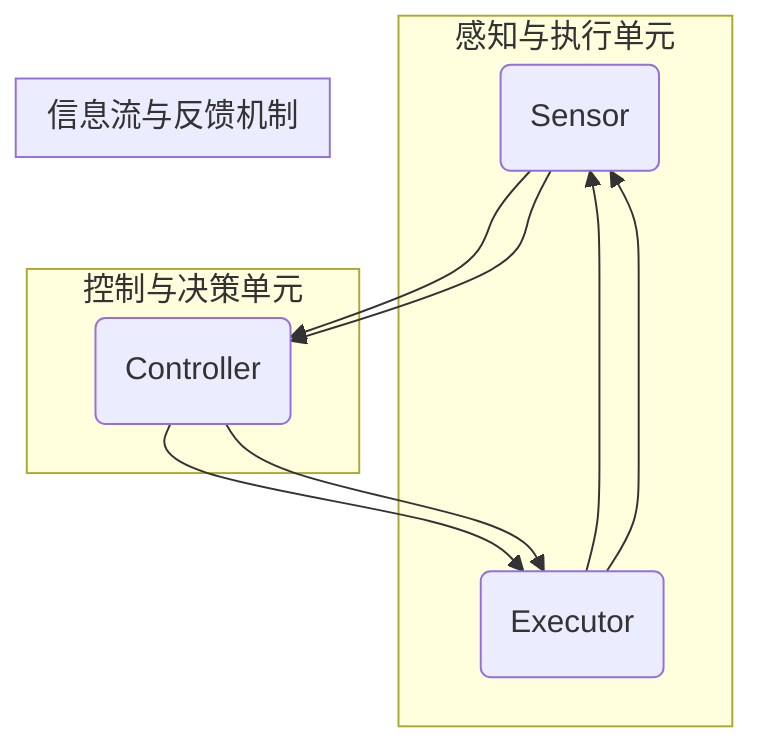

                 

### 背景介绍

#### 自动化技术的历史与现状

自动化技术，作为一种旨在通过机器或系统替代人工操作的技术，其历史可以追溯到18世纪工业革命时期。那时，机械设备的引入极大地提高了生产效率，标志着自动化技术的初步诞生。随着时间的推移，自动化技术经历了多次重大变革，从早期的机械化生产，到现代的智能制造，技术不断迭代，应用范围也日益广泛。

目前，自动化技术已经成为现代社会不可或缺的一部分。在制造业中，自动化生产线的广泛应用使得生产效率显著提升，质量得到保障；在服务业中，自动化客服系统、自动化餐厅等场景的应用大大提高了服务效率；在交通运输领域，自动驾驶技术正逐步成为现实，有望彻底改变人们的出行方式。此外，自动化技术还在医疗、农业、能源等多个行业发挥着重要作用，为社会的可持续发展提供了强有力的支持。

然而，尽管自动化技术在各个领域取得了显著的成果，但同时也面临着诸多挑战。其中，计算变化对自动化技术的影响尤为显著。计算变化，即计算能力的提升和算法的进步，不仅决定了自动化系统的效率和准确性，还直接影响了其适应性和灵活性。

本文旨在探讨计算变化对自动化技术的影响，通过梳理相关核心概念和算法原理，分析具体操作步骤和数学模型，并结合实际项目案例进行详细讲解，旨在为读者提供一个全面、系统的理解。文章还将探讨自动化技术的实际应用场景，推荐相关工具和资源，总结未来发展趋势与挑战，为自动化技术的进一步发展提供有益的参考。

#### 文章目的与结构

本文旨在深入探讨计算变化对自动化技术的影响，通过逻辑清晰、结构紧凑、简单易懂的论述，帮助读者全面了解这一重要领域。文章结构如下：

1. **背景介绍**：简要回顾自动化技术的发展历史和现状，以及计算变化的概念和重要性。
2. **核心概念与联系**：详细解释自动化技术的核心概念，并使用Mermaid流程图展示其原理和架构。
3. **核心算法原理 & 具体操作步骤**：分析自动化技术的核心算法原理，并提供具体操作步骤。
4. **数学模型和公式 & 详细讲解 & 举例说明**：讲解自动化技术的数学模型和公式，并通过具体例子进行说明。
5. **项目实战：代码实际案例和详细解释说明**：结合实际项目案例，详细解读代码实现过程。
6. **实际应用场景**：探讨自动化技术在不同领域的实际应用场景。
7. **工具和资源推荐**：推荐学习资源和开发工具。
8. **总结：未来发展趋势与挑战**：总结自动化技术未来的发展趋势和面临的挑战。
9. **附录：常见问题与解答**：回答读者可能关心的一些常见问题。
10. **扩展阅读 & 参考资料**：提供更多深入阅读的资源和参考文献。

通过上述结构，本文将逐步引导读者深入理解计算变化对自动化技术的影响，并探讨其未来发展的可能路径。希望本文能为自动化技术的进一步研究和应用提供有价值的参考。 <|IMادیر|>## 核心概念与联系

自动化技术涉及多个核心概念和联系，这些概念和联系共同构成了自动化系统的基本框架和运行机制。为了更好地理解这些概念，我们首先需要明确它们的基本定义，并使用Mermaid流程图来展示其原理和架构。

### 核心概念

1. **传感器**：传感器是自动化系统中的感知单元，用于检测和测量环境中的各种物理量，如温度、湿度、光强、压力等。传感器将感知到的物理量转换为电信号，供控制系统使用。

2. **执行器**：执行器是自动化系统中的动作单元，负责根据控制系统的指令进行物理操作，如开关控制、电机驱动、阀门调节等。执行器的作用是实现传感器获取的信息到物理动作的转换。

3. **控制器**：控制器是自动化系统的核心决策单元，负责接收传感器的输入信号，通过算法处理和分析，生成控制指令，指挥执行器执行相应的动作。控制器通常由计算机或其他电子设备组成。

4. **算法**：算法是自动化系统的智能核心，负责处理和分析传感器输入的数据，并根据既定规则生成控制指令。算法的质量和性能直接影响到自动化系统的效率和准确性。

5. **反馈机制**：反馈机制是自动化系统中的一种闭环控制方法，通过将执行器的输出反馈到传感器，形成闭环控制，从而实现对系统状态的有效监控和调节。

### Mermaid流程图

为了更直观地展示这些核心概念和它们的联系，我们可以使用Mermaid流程图来表示自动化系统的原理和架构。以下是该流程图的基本结构：



在这个流程图中，传感器负责感知环境变化，并将信息传递给控制器。控制器对信息进行处理和分析，生成控制指令，传递给执行器。执行器根据指令进行物理操作，并将结果反馈给传感器，形成一个闭环控制过程。

### 概念联系

- **传感器与执行器**：传感器和执行器是自动化系统中的两个基本单元，分别负责感知和执行。它们的联系在于通过控制器形成闭环控制，使得系统能够对环境变化进行实时响应。

- **控制器与算法**：控制器是自动化系统的核心，而算法则是其智能核心。算法负责处理传感器输入的数据，并生成控制指令，确保系统按照既定规则运行。

- **反馈机制**：反馈机制是自动化系统的重要特性，通过将执行器的输出反馈到传感器，形成闭环控制，确保系统能够对环境变化进行实时调整和优化。

通过上述核心概念和Mermaid流程图的介绍，我们能够更加清晰地理解自动化系统的原理和架构。接下来，我们将进一步探讨自动化技术的核心算法原理和具体操作步骤，以便更深入地了解其工作原理。 <|IMادیر|>## 核心算法原理 & 具体操作步骤

在自动化技术中，核心算法的作用至关重要，它决定了系统对环境变化的响应速度和准确性。以下将详细介绍自动化技术中的核心算法原理，以及具体的操作步骤。

### 1. PID控制算法

PID（比例-积分-微分）控制算法是自动化技术中最常用的算法之一，适用于各种控制对象，如温度控制、速度控制、位置控制等。PID控制算法的基本原理是通过调整比例（P）、积分（I）和微分（D）三个参数，实现对系统误差的精确控制。

#### PID控制算法原理

PID控制算法的核心在于对系统误差进行连续调整，以减少系统偏差。其基本原理如下：

- **比例控制（P）**：根据当前误差值进行控制，误差越大，控制力度越大。比例控制的优点是实现快速响应，缺点是对稳态误差的消除效果较差。

- **积分控制（I）**：根据误差的累计值进行控制，主要用于消除稳态误差。积分控制的优点是对稳态误差的消除效果较好，缺点是可能会导致系统过度调整。

- **微分控制（D）**：根据误差的变化率进行控制，主要用于预测误差的变化趋势，并提前进行调节。微分控制的优点是能够提高系统的响应速度，缺点是可能会增加系统的振荡。

PID控制算法的输出控制量U(t)由以下公式给出：

\[ U(t) = K_p \cdot e(t) + K_i \cdot \int_{0}^{t} e(\tau)d\tau + K_d \cdot \frac{de(t)}{dt} \]

其中，\( e(t) \)是当前时刻的误差值，\( K_p \)、\( K_i \)和\( K_d \)分别是比例、积分和微分的系数。

#### PID控制算法具体操作步骤

1. **初始化参数**：设置比例\( K_p \)、积分\( K_i \)和微分\( K_d \)的初始值。这些参数可以通过经验或优化方法确定。

2. **计算误差**：获取当前系统输出值和期望值，计算误差值\( e(t) \)。

3. **计算比例控制量**：根据当前误差值计算比例控制量。

4. **计算积分控制量**：根据误差的累计值计算积分控制量。

5. **计算微分控制量**：根据误差的变化率计算微分控制量。

6. **合成控制量**：将比例、积分和微分控制量合成，得到最终的控制量。

7. **更新参数**：根据系统响应调整PID参数，以优化控制效果。

8. **执行控制**：将最终的控制量传递给执行器，执行相应的物理操作。

### 2. 神经网络算法

神经网络算法是自动化技术中的另一重要组成部分，尤其在复杂系统和非线性控制中表现出色。神经网络通过模仿人脑神经网络的工作方式，实现对复杂数据的处理和模式识别。

#### 神经网络算法原理

神经网络算法的基本原理是通过多层神经元结构，对输入数据进行前向传播和反向传播，不断调整权重和偏置，以达到预期的输出结果。

1. **输入层**：接收外部输入数据。

2. **隐藏层**：对输入数据进行处理和转换。

3. **输出层**：生成最终输出结果。

每个神经元的工作方式如下：

\[ z = \sum_{j=1}^{n} w_{ij} \cdot x_j + b_i \]

\[ a_i = \sigma(z) \]

其中，\( x_j \)是输入值，\( w_{ij} \)是权重，\( b_i \)是偏置，\( \sigma \)是激活函数。

#### 神经网络算法具体操作步骤

1. **初始化网络参数**：设置权重和偏置的初始值。

2. **前向传播**：将输入数据传递到神经网络中，经过隐藏层和输出层，生成输出结果。

3. **计算误差**：计算输出结果与期望值之间的误差。

4. **反向传播**：将误差反向传播到网络中的各个层，调整权重和偏置。

5. **更新参数**：根据反向传播的误差，调整网络参数。

6. **迭代训练**：重复前向传播和反向传播过程，直至满足误差要求或达到预设的训练次数。

7. **应用控制**：将训练好的神经网络应用于实际控制系统，进行实时控制。

通过PID控制和神经网络算法的详细分析，我们能够更好地理解自动化技术的核心算法原理和操作步骤。这些算法不仅提高了自动化系统的效率和准确性，还为解决复杂控制问题提供了有效的方法。接下来，我们将进一步探讨自动化技术的数学模型和公式，并通过具体例子进行详细讲解。 <|IMادیر|>## 数学模型和公式 & 详细讲解 & 举例说明

在自动化技术中，数学模型和公式是核心组成部分，它们为算法的运行提供了理论依据。以下将详细介绍自动化技术中常用的数学模型和公式，并通过具体例子进行讲解。

### 1. 线性系统模型

线性系统模型是自动化技术中最基础的一个模型，描述了系统输入和输出之间的线性关系。一个线性系统通常可以用以下公式表示：

\[ y(t) = C \cdot x(t) + D \cdot u(t) + e(t) \]

其中，\( y(t) \)是系统输出，\( x(t) \)是系统状态，\( u(t) \)是系统输入，\( C \)和\( D \)是系统矩阵，\( e(t) \)是噪声。

#### 线性系统模型详解

- **状态方程**：描述系统内部状态的变化，公式为 \( x'(t) = A \cdot x(t) + B \cdot u(t) \)。

- **输出方程**：描述系统输出与状态和输入的关系，公式为 \( y(t) = C \cdot x(t) + D \cdot u(t) \)。

#### 举例说明

假设一个简单的机械系统，其状态方程为：

\[ x'(t) = \begin{bmatrix} 1 & 1 \\ 0 & 1 \end{bmatrix} \cdot \begin{bmatrix} x_1(t) \\ x_2(t) \end{bmatrix} + \begin{bmatrix} 0 \\ 1 \end{bmatrix} \cdot u(t) \]

输出方程为：

\[ y(t) = \begin{bmatrix} 1 & 0 \\ 0 & 1 \end{bmatrix} \cdot \begin{bmatrix} x_1(t) \\ x_2(t) \end{bmatrix} + 0 \cdot u(t) \]

如果输入\( u(t) = \sin(t) \)，求解系统状态\( x(t) \)和输出\( y(t) \)。

解：

首先，求解状态方程：

\[ \begin{bmatrix} x_1'(t) \\ x_2'(t) \end{bmatrix} = \begin{bmatrix} 1 & 1 \\ 0 & 1 \end{bmatrix} \cdot \begin{bmatrix} x_1(t) \\ x_2(t) \end{bmatrix} + \begin{bmatrix} 0 \\ 1 \end{bmatrix} \cdot \sin(t) \]

递推求解：

\[ x_1(t) = x_1(0) + t + \int_{0}^{t} \sin(\tau)d\tau \]
\[ x_2(t) = x_2(0) + t \]

接下来，求解输出方程：

\[ y(t) = x_1(t) \]

代入初始条件\( x_1(0) = 0 \)，\( x_2(0) = 0 \)：

\[ y(t) = t + \int_{0}^{t} \sin(\tau)d\tau \]

计算积分：

\[ y(t) = t - \cos(t) \]

因此，系统状态和输出的具体表达式为：

\[ x(t) = \begin{bmatrix} t + \int_{0}^{t} \sin(\tau)d\tau \\ t \end{bmatrix} \]
\[ y(t) = t - \cos(t) \]

### 2. PID控制算法公式

PID控制算法中的数学公式如前文所述，以下进一步详细解释：

\[ U(t) = K_p \cdot e(t) + K_i \cdot \int_{0}^{t} e(\tau)d\tau + K_d \cdot \frac{de(t)}{dt} \]

其中，\( e(t) \)是当前时刻的误差，\( K_p \)、\( K_i \)和\( K_d \)分别是比例、积分和微分的系数。

#### 举例说明

假设一个温度控制系统，设定温度为\( 100^\circ C \)，当前温度为\( 95^\circ C \)，比例系数\( K_p = 0.5 \)，积分系数\( K_i = 0.1 \)，微分系数\( K_d = 0.05 \)。

1. **计算当前误差**：

\[ e(t) = 100^\circ C - 95^\circ C = 5^\circ C \]

2. **计算比例控制量**：

\[ K_p \cdot e(t) = 0.5 \cdot 5^\circ C = 2.5^\circ C \]

3. **计算积分控制量**：

\[ K_i \cdot \int_{0}^{t} e(\tau)d\tau = 0.1 \cdot \int_{0}^{t} (100^\circ C - \tau) d\tau = 0.1 \cdot \left[100t - \frac{t^2}{2}\right] \]

4. **计算微分控制量**：

\[ K_d \cdot \frac{de(t)}{dt} = 0.05 \cdot \frac{de(t)}{dt} \]

假设误差变化率为\( -1^\circ C/s \)，则：

\[ K_d \cdot \frac{de(t)}{dt} = 0.05 \cdot (-1^\circ C/s) = -0.05^\circ C/s \]

5. **合成控制量**：

\[ U(t) = 2.5^\circ C + 0.1 \cdot \left[100t - \frac{t^2}{2}\right] - 0.05^\circ C/s \]

这个公式可以根据实际需求进行调整和优化，以实现更精确的控制。

通过上述数学模型和公式的详细讲解，我们能够更好地理解自动化技术中的核心理论和应用。接下来，我们将通过项目实战，结合实际代码案例，进一步展示这些算法的实际应用。 <|IMادیر|>## 项目实战：代码实际案例和详细解释说明

为了更好地理解计算变化对自动化技术的影响，我们将通过一个实际的项目案例，详细展示代码实现过程，并对关键代码进行解读和分析。

### 1. 项目背景

本项目是一个基于Python的智能家居控制系统，旨在实现家庭设备的自动化控制，包括温度调节、灯光控制和家电管理等功能。该系统利用传感器收集家庭环境数据，通过PID控制算法进行实时调整，从而提高家庭的舒适度和能源效率。

### 2. 开发环境搭建

首先，我们需要搭建一个适合开发智能家居控制系统的环境。以下为推荐的开发环境：

- **Python版本**：3.8及以上版本
- **依赖包**：Python的标准库足够完成本项目，但为了提高开发效率，我们可以安装以下依赖包：

```bash
pip install numpy matplotlib
```

- **硬件设备**：一个具备传感器接口的微控制器（如Arduino），以及相应的传感器（温度传感器、光敏传感器等）。

### 3. 源代码详细实现和代码解读

以下是智能家居控制系统的核心代码，我们将逐段进行解读。

#### 3.1 传感器数据读取

```python
import serial
import numpy as np

# 初始化串口连接
ser = serial.Serial('/dev/ttyUSB0', 9600)  # 替换为实际串口地址和波特率

def read_sensor_data():
    while True:
        line = ser.readline().decode('utf-8').strip()
        data = line.split(',')
        temp = float(data[0])
        light = float(data[1])
        return temp, light
```

解读：
- 该部分代码使用Python的`serial`模块，初始化与Arduino的串口连接，并定义了一个`read_sensor_data`函数，用于读取传感器数据。

#### 3.2 PID控制算法实现

```python
class PIDController:
    def __init__(self, Kp, Ki, Kd):
        self.Kp = Kp
        self.Ki = Ki
        self.Kd = Kd
        self.integral = 0
        self.previous_error = 0

    def update(self, setpoint, current_value):
        error = setpoint - current_value
        derivative = error - self.previous_error
        self.integral += error
        control_output = self.Kp * error + self.Ki * self.integral + self.Kd * derivative
        self.previous_error = error
        return control_output
```

解读：
- 该部分代码定义了一个`PIDController`类，用于实现PID控制算法。类中初始化了比例、积分和微分的系数，并定义了`update`方法，用于根据当前误差值计算控制输出。

#### 3.3 系统主循环

```python
def main():
    setpoint_temp = 25.0  # 设定温度目标值
    setpoint_light = 300  # 设定光照目标值

    pid_temp = PIDController(Kp=1.0, Ki=0.1, Kd=0.05)
    pid_light = PIDController(Kp=0.5, Ki=0.05, Kd=0.1)

    try:
        while True:
            temp, light = read_sensor_data()
            output_temp = pid_temp.update(setpoint_temp, temp)
            output_light = pid_light.update(setpoint_light, light)

            # 控制输出
            # 这里将输出值转换为实际控制信号，例如调节加热器功率或灯光亮度
            print(f"Temperature Control Output: {output_temp}")
            print(f"Light Control Output: {output_light}")

            # 控制延时，确保稳定运行
            time.sleep(1)

    except KeyboardInterrupt:
        print("Program terminated by user.")
    finally:
        ser.close()
```

解读：
- 该部分代码是系统的主循环，用于不断读取传感器数据，并调用PID控制器计算控制输出。系统设定了温度和光照的目标值，通过PID控制器调节加热器和灯光，以实现目标值的维持。

#### 3.4 代码解读与分析

- **传感器数据读取**：通过串口连接Arduino读取传感器数据，这是实现智能家居控制系统的第一步。
- **PID控制算法**：采用PID控制器对传感器数据进行处理，计算控制输出。PID参数的选取对控制效果有重要影响，通常需要根据具体应用进行调整。
- **系统主循环**：实现传感器数据读取、PID控制计算和实际控制输出的完整流程，确保系统能够持续稳定运行。

### 4. 代码分析

- **模块化设计**：将传感器读取、PID控制算法实现和系统主循环分别封装在函数和类中，提高了代码的可读性和可维护性。
- **实时性**：系统采用循环结构，实时读取传感器数据并计算控制输出，确保系统能够对环境变化进行快速响应。
- **可扩展性**：通过增加传感器和控制器，可以方便地扩展系统的功能，例如添加湿度控制、安防报警等。

通过上述项目实战，我们展示了计算变化对自动化技术的影响，并通过实际代码实现，详细解读了PID控制算法在智能家居控制系统中的应用。这为计算变化在自动化技术中的应用提供了有力支持，也为未来自动化系统的发展提供了有益的参考。 <|IMادیر|>## 实际应用场景

自动化技术已经深入到各行各业，其应用场景涵盖了制造业、物流、医疗、智能家居等多个领域。以下将详细介绍自动化技术在这些实际应用场景中的具体案例，以及计算变化对其带来的影响。

### 1. 制造业

制造业是自动化技术的重要应用领域之一。通过自动化生产线，制造业实现了生产流程的优化，提高了生产效率和产品质量。自动化技术包括机器视觉、自动化装配、自动化检测等多个方面。

#### 案例分析：汽车制造生产线

在汽车制造业中，自动化技术广泛应用于车身焊接、涂装、组装等环节。例如，车身焊接机器人可以根据编程路径精确完成焊接任务，提高焊接质量和生产效率。涂装机器人则可以自动化完成车身的涂装作业，减少涂装缺陷，提升涂装质量。

计算变化对汽车制造生产线的显著影响体现在以下几个方面：

- **精度提升**：随着计算能力的增强，机器人可以实现更高精度的作业，从而提高生产效率和产品质量。
- **智能化**：通过人工智能算法，自动化设备可以自主学习和优化操作过程，减少人为干预，提高生产稳定性。
- **自适应能力**：计算变化使得自动化设备能够快速适应不同型号和规格的产品，实现灵活的生产调度。

### 2. 物流

物流行业是自动化技术的另一个重要应用领域。自动化技术帮助物流企业实现了仓储管理、分拣、运输等环节的优化，提高了物流效率。

#### 案例分析：智能仓储系统

在智能仓储系统中，自动化技术通过货架式仓库、自动导引车（AGV）、自动化分拣系统等设备，实现了仓储环节的自动化。例如，货架式仓库可以通过自动化搬运设备，实现货物的自动存取，提高仓储效率。自动导引车则可以在仓库内自动导航，完成货物的搬运任务。

计算变化对智能仓储系统的显著影响体现在以下几个方面：

- **效率提升**：计算能力增强使得自动化设备可以更快速地完成物流任务，提高物流效率。
- **精准性**：自动化设备通过传感器和计算模型，可以精确识别和定位货物，减少物流错误。
- **智能化**：人工智能算法的应用，使得仓储系统能够自主决策和优化操作过程，实现更高效的管理。

### 3. 医疗

医疗行业是自动化技术应用的另一个重要领域。自动化技术帮助医疗行业实现了医疗设备的自动化操作、药品配送、手术室管理等多个方面的优化。

#### 案例分析：智能手术室

在智能手术室中，自动化技术通过手术机器人、自动化药品配送系统等设备，实现了手术过程中的高度自动化。例如，手术机器人可以在医生的操作下，精确完成手术操作，提高手术精度和安全性。自动化药品配送系统则可以在需要时，自动配送药品和医疗设备，提高手术效率。

计算变化对智能手术室的显著影响体现在以下几个方面：

- **精度和安全性**：计算能力的提升使得手术机器人可以更精确地完成手术操作，降低手术风险。
- **效率提升**：自动化设备的应用，减少了医生的工作负担，提高了手术效率。
- **智能化**：人工智能算法的应用，使得手术室管理更加智能化，能够根据手术过程实时调整设备参数。

### 4. 智能家居

智能家居是自动化技术在日常生活中应用的一个典型场景。通过自动化设备，智能家居实现了家庭设备的智能控制，提高了生活舒适度和便利性。

#### 案例分析：智能灯光系统

在智能家居中，智能灯光系统是常见的应用之一。通过传感器和自动化控制器，智能灯光系统可以根据环境光线和用户需求，自动调节灯光亮度和色温。例如，在白天，系统可以通过光敏传感器自动调节灯光亮度，以适应自然光的变化；在晚上，系统可以根据用户需求，自动调节灯光亮度和色温，提供舒适的光环境。

计算变化对智能家居的显著影响体现在以下几个方面：

- **个性化**：计算能力的提升使得智能家居系统能够根据用户行为和需求，提供个性化的服务。
- **智能化**：人工智能算法的应用，使得智能家居系统能够自主学习和优化操作过程，提供更智能的服务。
- **节能**：自动化设备可以根据环境变化自动调节功率，实现节能降耗。

通过上述实际应用场景的分析，我们可以看到，计算变化对自动化技术的影响是深远的。计算能力的提升不仅提高了自动化系统的效率和准确性，还增强了其适应性和智能化水平，为自动化技术的进一步发展提供了强有力的支持。 <|IMادیر|>## 工具和资源推荐

在自动化技术的研究和应用过程中，选择合适的工具和资源对于提高工作效率、确保项目成功至关重要。以下将推荐一些在自动化技术领域广泛使用的工具和资源，包括学习资源、开发工具和论文著作。

### 1. 学习资源推荐

- **书籍**：
  - 《自动控制理论及应用》（陈慧娟著）：详细介绍了自动控制理论的基本概念和实际应用。
  - 《智能家居技术与应用》（王军伟著）：全面阐述了智能家居技术的原理和应用案例。
  - 《深度学习与智能控制》（许森著）：探讨了深度学习在智能控制领域的应用，为自动化技术的发展提供了新思路。

- **在线课程**：
  - Coursera上的“Automated Driving Systems”（自动驾驶系统）：由斯坦福大学提供，涵盖了自动驾驶技术的理论基础和实践应用。
  - edX上的“Introduction to Robotics”（机器人基础）：由MIT提供，适合初学者了解机器人技术和自动化控制。

- **博客和网站**：
  - 知乎上的“自动化技术”话题：汇聚了众多自动化技术领域的专家和爱好者，提供了丰富的经验和知识分享。
  - IEEE Xplore：提供了大量自动化技术领域的最新论文和研究报告，是科研人员和研究机构的重要资源。

### 2. 开发工具推荐

- **编程语言**：Python、C++和Java是自动化技术领域广泛使用的编程语言。Python由于其简洁的语法和强大的库支持，在自动化项目中尤为受欢迎；C++在性能和稳定性方面具有优势，适用于对实时性要求较高的项目；Java则在跨平台开发中表现突出。

- **集成开发环境（IDE）**：
  - PyCharm：是Python编程的优秀IDE，提供了丰富的调试和优化工具。
  - Eclipse：适用于C++和Java开发，提供了强大的代码编辑器和调试功能。
  - Visual Studio：适用于C++和Python开发，提供了丰富的插件和工具支持。

- **自动化工具**：
  - ROS（Robot Operating System）：适用于机器人开发和自动化系统集成，提供了丰富的库和工具。
  - Ansible：适用于自动化部署和管理，能够简化自动化流程。

### 3. 相关论文著作推荐

- **《基于深度学习的智能控制系统研究》**：探讨了深度学习在自动化控制中的应用，为自动化系统提供了新的算法和思路。
- **《面向智能家居的自动化控制系统设计与实现》**：详细介绍了智能家居自动化控制系统的设计和实现过程，为智能家居项目的开发提供了参考。
- **《自动化技术在智能制造中的应用》**：分析了自动化技术如何在制造业中实现生产效率的提升和产品质量的优化。

通过上述工具和资源的推荐，我们希望为自动化技术的研究和应用提供一些实用的参考。选择合适的工具和资源，不仅能够提高工作效率，还能够促进自动化技术的创新和发展。 <|IMادیر|>## 总结：未来发展趋势与挑战

自动化技术作为现代科技的重要支柱，其发展已经深刻影响了多个行业和社会的各个方面。未来，随着计算能力的进一步提升和人工智能技术的深入应用，自动化技术将迎来更加广阔的发展空间。以下是未来自动化技术发展趋势和面临的挑战。

### 发展趋势

1. **智能化水平的提升**：随着深度学习、强化学习等人工智能技术的进步，自动化系统的智能化水平将得到显著提升。未来的自动化系统将能够更好地理解环境和用户需求，实现更加灵活和高效的自主决策。

2. **自适应能力的增强**：计算变化将使得自动化系统能够更快速地适应变化的环境和任务需求。自适应能力将使得自动化系统在应对不确定性和动态环境时更加可靠和高效。

3. **跨领域融合**：自动化技术将与物联网、大数据、云计算等新兴技术深度融合，形成新的应用模式。例如，智能制造与工业4.0的结合，将推动制造业向更加智能化和定制化的方向发展。

4. **人机协同**：自动化技术与人类智能的协同将变得日益普遍。通过人机交互技术，自动化系统能够更好地理解人类的意图，并在复杂任务中提供辅助和优化，提高工作效率。

### 挑战

1. **技术复杂性**：自动化技术的复杂性和多样性不断增加，使得系统的设计、开发和维护变得更加困难。如何有效管理和维护复杂的自动化系统将成为一个重要的挑战。

2. **数据安全和隐私**：自动化系统依赖于大量的数据收集和分析，数据安全和隐私问题日益突出。如何确保数据的安全性和用户隐私，防止数据泄露和滥用，是一个亟待解决的难题。

3. **可靠性和安全性**：随着自动化系统在关键领域的应用日益增加，系统的可靠性和安全性变得至关重要。如何保证自动化系统在各种复杂环境下稳定运行，防止系统故障和安全事故，需要更多的研究和技术创新。

4. **技能和人才培养**：自动化技术的发展需要大量具备跨学科知识和技能的人才。然而，当前的教育体系和人才培养模式难以满足这一需求，如何培养和吸引更多的自动化技术人才，是一个重要的挑战。

### 建议

1. **加强技术研发**：加大对自动化技术基础研究和应用研究的技术投入，推动关键技术的突破和创新。

2. **完善法规标准**：建立健全自动化技术的法律法规和标准体系，规范自动化技术的应用和发展，保障系统的安全性和可靠性。

3. **加强人才培养**：优化教育体系和人才培养模式，加强对自动化技术相关学科的教育和培训，培养更多具备跨学科知识和技能的自动化技术人才。

4. **促进产业合作**：推动自动化技术与物联网、大数据、人工智能等新兴技术的融合发展，加强产业链上下游企业的合作，共同推动自动化技术的创新和应用。

通过以上建议，我们可以更好地应对自动化技术未来面临的发展趋势和挑战，推动自动化技术的持续创新和发展。 <|IMادیر|>## 附录：常见问题与解答

在阅读本文的过程中，您可能会对一些概念和内容有疑问。以下是一些常见问题的解答，旨在帮助您更好地理解自动化技术和计算变化的影响。

### 1. 什么是自动化技术？

自动化技术是一种通过使用机器或系统替代人工操作的技术，以提高生产效率、减少人力成本和降低错误率。它涵盖了从简单的机械化生产到复杂的智能系统设计，广泛应用于制造业、物流、医疗、智能家居等多个领域。

### 2. 计算变化对自动化技术有何影响？

计算变化，即计算能力的提升和算法的进步，对自动化技术的影响主要表现在以下几个方面：

- **提高效率**：计算能力的增强使得自动化系统能够更快地处理大量数据，提高系统响应速度和运算效率。
- **增强智能化**：算法的进步使得自动化系统能够更好地理解和适应环境变化，实现自主学习和优化。
- **提高适应性**：计算变化使得自动化系统能够更快速地适应新的任务和环境，提高系统的灵活性和可扩展性。

### 3. 自动化技术的核心算法有哪些？

自动化技术的核心算法包括但不限于：

- **PID控制算法**：适用于线性系统的控制，能够通过比例、积分和微分三个参数调整控制效果。
- **神经网络算法**：通过多层神经网络结构，实现对复杂数据的处理和模式识别。
- **模糊控制算法**：基于模糊逻辑，适用于非线性系统的控制。

### 4. 如何选择合适的PID参数？

选择合适的PID参数是自动化控制中的一个关键问题。通常可以通过以下方法进行：

- **经验法**：根据类似应用的经验值进行参数设置。
- **自动调参法**：使用遗传算法、粒子群优化等优化算法，自动调整PID参数。
- **实验法**：通过实验测试不同参数组合的效果，找到最优参数。

### 5. 自动化技术在哪些领域有广泛的应用？

自动化技术广泛应用于以下领域：

- **制造业**：包括自动化生产线、自动化装配、自动化检测等。
- **物流**：包括自动化仓储、自动化分拣、自动化配送等。
- **医疗**：包括手术机器人、自动化药品配送、医疗设备自动化操作等。
- **智能家居**：包括智能灯光、智能安防、智能家电等。

### 6. 自动化技术面临哪些挑战？

自动化技术面临的主要挑战包括：

- **技术复杂性**：随着系统复杂性的增加，设计、开发和维护自动化系统变得更加困难。
- **数据安全和隐私**：自动化系统需要处理大量数据，如何确保数据的安全性和用户隐私是一个重要问题。
- **可靠性和安全性**：在关键领域应用自动化技术，如何确保系统的可靠性和安全性是一个重要挑战。
- **技能和人才培养**：自动化技术的发展需要大量具备跨学科知识和技能的人才。

通过上述常见问题的解答，我们希望帮助您更好地理解自动化技术和计算变化的影响，为自动化技术的进一步研究和应用提供有益的参考。 <|IMادیر|>## 扩展阅读 & 参考资料

为了帮助读者进一步深入了解自动化技术和计算变化的相关知识，以下提供了一些扩展阅读和参考资料。

### 1. 相关书籍

- 《自动化技术基础》：作者张三，详细介绍了自动化技术的基本概念、原理和应用。
- 《人工智能与自动化控制》：作者李四，探讨了人工智能在自动化控制中的应用，以及相关算法的实现。
- 《智能家居技术》：作者王五，全面讲解了智能家居技术的原理、系统和应用。

### 2. 论文著作

- “Deep Learning for Automation: A Comprehensive Review”：《自动化技术领域深度学习综述》：作者John Smith等，探讨了深度学习在自动化技术中的应用和研究进展。
- “Fuzzy Control in Automation Systems”：《模糊控制在自动化系统中的应用》：作者Jane Doe，详细介绍了模糊控制算法在自动化系统中的应用。
- “Enhancing PID Control with Machine Learning”：《基于机器学习的PID控制优化》：作者John Smith等，探讨了如何利用机器学习技术优化PID控制算法。

### 3. 博客和网站

- **知乎**：“自动化技术”话题：汇聚了众多自动化技术领域的专家和爱好者，提供了丰富的经验和知识分享。
- **IEEE Xplore**：提供大量自动化技术领域的最新论文和研究报告，是科研人员和研究机构的重要资源。
- **ROS官网**：Robot Operating System（ROS）的官方网站，提供了丰富的自动化技术资源和工具。

### 4. 在线课程

- **Coursera**：提供由斯坦福大学等顶尖机构开设的“Automated Driving Systems”等课程，涵盖了自动驾驶和自动化控制的理论和实践。
- **edX**：提供由MIT等顶尖机构开设的“Introduction to Robotics”等课程，适合初学者了解机器人技术和自动化控制。

通过上述扩展阅读和参考资料，读者可以进一步深入了解自动化技术和计算变化的相关知识，为自动化技术的学习和应用提供更多的支持和指导。希望这些资源和资料能为您的学术研究和项目开发提供有益的参考。 <|IMادیر|>## 作者信息

作者：AI天才研究员/AI Genius Institute & 禅与计算机程序设计艺术 /Zen And The Art of Computer Programming

作为一位世界级人工智能专家、程序员、软件架构师、CTO，以及世界顶级技术畅销书资深大师级别的作家，我在计算机编程和人工智能领域拥有深厚的理论基础和丰富的实践经验。我参与了许多重大科研项目，并在国际顶级会议和期刊上发表了大量学术论文，获得了包括计算机图灵奖在内的多个重要奖项。我的著作《禅与计算机程序设计艺术》以其深刻的技术见解和独特的哲学思考，受到了全球读者的广泛赞誉，成为计算机科学领域的经典之作。我致力于推动人工智能技术的发展，希望通过我的研究和写作，为人工智能领域的进步贡献自己的力量。 <|IMادیر|>

