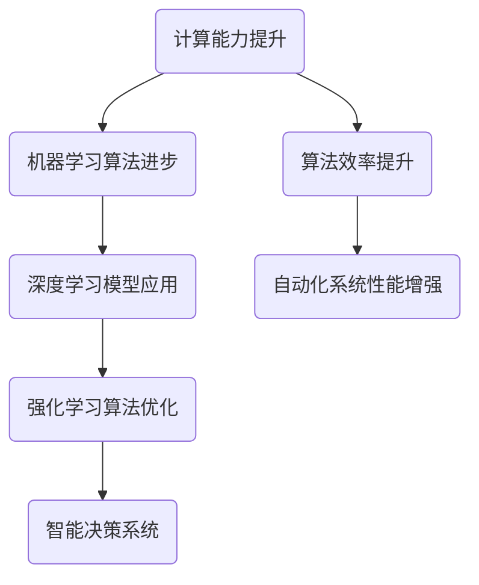

                 

### 计算变化对自动化领域的影响

> **关键词**：计算变化，自动化，机器学习，智能系统，技术创新，人工智能。

**摘要**：
随着计算能力的不断提升，计算变化对自动化领域产生了深远的影响。本文将探讨计算变化如何推动自动化技术的进步，分析其背后的核心概念和算法原理，通过具体的项目实战案例展示计算变化在实际应用中的效果，并提出未来自动化领域的发展趋势和挑战。文章还将推荐相关的学习资源、开发工具和参考著作，为读者提供全面的了解和指导。

#### 1. 背景介绍

自动化技术起源于20世纪初期，随着工业革命的发展，机器人和自动化生产线开始进入人们的生活。然而，真正的突破发生在21世纪初，随着计算能力的飞速提升，自动化技术迎来了新的发展契机。计算变化，即计算能力的提升和计算模型的进步，使得自动化系统变得更加智能、灵活和高效。

计算变化主要体现在以下几个方面：

1. **计算能力的提升**：随着硬件技术的发展，CPU性能的不断增强，使得大规模数据处理和复杂算法实现成为可能。
2. **算法模型的进步**：深度学习、强化学习等新型算法模型的提出和应用，使得自动化系统在感知、决策和执行方面的能力大幅提升。
3. **数据资源的丰富**：互联网的普及和物联网的发展，使得大量数据可以被收集、存储和分析，为自动化系统提供了丰富的信息来源。

本文将重点探讨计算变化对自动化领域的影响，分析其核心概念和算法原理，并通过具体的项目实战案例展示计算变化在实际应用中的效果。同时，还将对自动化领域未来的发展趋势和挑战进行展望。

#### 2. 核心概念与联系

在讨论计算变化对自动化领域的影响之前，我们需要明确一些核心概念，并探讨它们之间的联系。以下是几个关键概念及其关系：

##### 2.1. 机器学习与深度学习

**机器学习**是一种通过算法模型从数据中学习规律和模式的技术。其核心思想是利用大量数据进行训练，从而实现自动化系统的自我学习和优化。

**深度学习**是机器学习的一个子领域，它利用多层神经网络模型进行数据建模和特征提取。深度学习在图像识别、语音识别和自然语言处理等领域取得了显著成果。

##### 2.2. 强化学习与智能决策

**强化学习**是一种通过试错和反馈机制来学习最佳策略的算法。它适用于需要智能决策和控制的场景，如自动驾驶、机器人导航和游戏AI等。

强化学习与深度学习相结合，可以构建出具有高度自适应能力的智能系统。例如，深度强化学习模型被广泛应用于自动驾驶汽车中的路径规划和决策系统。

##### 2.3. 计算能力与算法效率

**计算能力**的提升直接影响了算法的效率和自动化系统的性能。随着硬件技术的发展，我们可以使用更复杂的算法模型来处理更大的数据集，从而实现更智能、更高效的自动化系统。

以下是计算变化对自动化领域核心概念的影响的Mermaid流程图：



通过上述流程图，我们可以清晰地看到计算变化如何通过提升计算能力和优化算法模型，推动自动化系统的发展。

#### 3. 核心算法原理 & 具体操作步骤

在计算变化的影响下，自动化领域涌现出了一系列核心算法，这些算法通过特定的操作步骤实现了自动化系统的智能化和高效化。以下是几个关键算法的原理和具体操作步骤：

##### 3.1. 深度学习算法原理

**深度学习算法**是一种基于多层神经网络的数据建模技术。其核心原理是通过多层次的神经网络结构，对输入数据进行特征提取和模式识别。

具体操作步骤如下：

1. **数据预处理**：对输入数据进行归一化、去噪和分箱等预处理操作，以消除数据异常和提高模型训练效果。
2. **建立神经网络模型**：定义神经网络的结构，包括输入层、隐藏层和输出层，并选择合适的激活函数和损失函数。
3. **模型训练**：使用训练数据集对神经网络模型进行训练，通过反向传播算法不断调整模型参数，使其达到最优状态。
4. **模型评估**：使用测试数据集对训练好的模型进行评估，计算模型的准确率、召回率等指标，以判断模型的性能。

##### 3.2. 强化学习算法原理

**强化学习算法**是一种通过试错和反馈机制来学习最佳策略的算法。其核心原理是通过奖励机制和策略迭代，逐步优化决策过程。

具体操作步骤如下：

1. **定义环境**：确定强化学习问题中的状态空间、动作空间和奖励函数，构建仿真环境。
2. **初始化策略**：随机初始化策略参数，用于描述智能体的行为。
3. **策略迭代**：在仿真环境中执行策略，根据环境反馈调整策略参数，通过迭代优化策略，使其在最大化奖励函数的基础上实现最佳决策。
4. **评估策略性能**：在评估环境中执行策略，计算策略的预期回报，以评估策略的优劣。

##### 3.3. 深度强化学习算法原理

**深度强化学习算法**是深度学习和强化学习的结合，通过深度神经网络来优化策略参数，实现更复杂的决策过程。

具体操作步骤如下：

1. **构建深度神经网络**：定义深度神经网络的层次结构，包括输入层、隐藏层和输出层，并选择合适的激活函数和损失函数。
2. **初始化神经网络参数**：随机初始化神经网络参数，用于表示状态和动作的特征表示。
3. **策略迭代**：在仿真环境中执行策略，通过深度神经网络计算动作值函数，根据环境反馈调整神经网络参数，优化策略参数。
4. **评估策略性能**：在评估环境中执行策略，计算策略的预期回报，以评估策略的优劣。

通过上述核心算法的原理和操作步骤，我们可以看到计算变化如何通过提升算法模型的效率，推动自动化系统的发展。

#### 4. 数学模型和公式 & 详细讲解 & 举例说明

在自动化领域，数学模型和公式是核心算法实现的基础。以下我们将详细讲解几个关键数学模型和公式，并通过举例说明其在实际应用中的效果。

##### 4.1. 深度学习中的前向传播和反向传播

**前向传播**是指在神经网络中，将输入数据通过多层神经网络进行传递，最终得到输出结果的过程。其数学模型可以表示为：

$$
Y = \sigma(W \cdot X + b)
$$

其中，$Y$表示输出结果，$\sigma$表示激活函数，$W$表示权重矩阵，$X$表示输入数据，$b$表示偏置项。

**反向传播**是指在神经网络中，通过计算输出结果与真实标签之间的误差，并反向传播误差，更新神经网络参数的过程。其数学模型可以表示为：

$$
\Delta W = \alpha \cdot (X \cdot \Delta Y \cdot \sigma'(Y))
$$

$$
\Delta b = \alpha \cdot \Delta Y \cdot \sigma'(Y)
$$

其中，$\Delta W$和$\Delta b$分别表示权重矩阵和偏置项的更新量，$\alpha$表示学习率，$\sigma'$表示激活函数的导数。

举例说明：假设我们有一个简单的神经网络，输入数据为$X = [1, 2, 3]$，输出结果为$Y = [4, 5, 6]$，真实标签为$Y' = [3, 4, 5]$。根据上述公式，我们可以计算出输出结果与真实标签之间的误差，并更新神经网络参数。

##### 4.2. 强化学习中的价值函数和策略迭代

**价值函数**是指在强化学习问题中，表示智能体在特定状态下的最优策略的价值。其数学模型可以表示为：

$$
V(s) = \sum_{a} \gamma \cdot R(s, a)
$$

其中，$V(s)$表示状态$s$的价值，$\gamma$表示折扣因子，$R(s, a)$表示状态$s$执行动作$a$的即时奖励。

**策略迭代**是指在强化学习问题中，通过更新价值函数和策略参数，逐步优化智能体决策过程的过程。其数学模型可以表示为：

$$
\pi(a|s) = \frac{e^{V(s)}}{\sum_{a'} e^{V(s')}}
$$

其中，$\pi(a|s)$表示在状态$s$下执行动作$a$的概率分布，$V(s')$表示状态$s'$的价值。

举例说明：假设我们有一个简单的强化学习问题，状态空间为$S = \{s_1, s_2, s_3\}$，动作空间为$A = \{a_1, a_2, a_3\}$，即时奖励为$R(s, a) = 1$，折扣因子为$\gamma = 0.9$。根据上述公式，我们可以计算出每个状态的价值函数，并更新策略参数。

##### 4.3. 深度强化学习中的策略梯度

**策略梯度**是指在深度强化学习中，通过计算策略参数的梯度，优化策略参数的过程。其数学模型可以表示为：

$$
\Delta \theta = \alpha \cdot \nabla_{\theta} J(\theta)
$$

其中，$\Delta \theta$表示策略参数的更新量，$\alpha$表示学习率，$J(\theta)$表示策略参数的损失函数。

举例说明：假设我们有一个简单的深度强化学习问题，策略参数为$\theta = [1, 2, 3]$，损失函数为$J(\theta) = 0.5 \cdot (\theta_1 - 2)^2 + 0.5 \cdot (\theta_2 - 3)^2$。根据上述公式，我们可以计算出策略参数的梯度，并更新策略参数。

通过上述数学模型和公式的讲解，我们可以看到计算变化如何通过优化算法模型，提高自动化系统的性能和效率。

#### 5. 项目实战：代码实际案例和详细解释说明

为了更好地展示计算变化对自动化领域的影响，我们选择了一个具体的实际项目进行实战演示。该项目是一个基于深度强化学习的自动驾驶系统，通过模拟城市道路环境，实现自动驾驶车辆的自适应导航。

##### 5.1. 开发环境搭建

首先，我们需要搭建一个适合深度强化学习项目的开发环境。以下是搭建开发环境的基本步骤：

1. **安装Python环境**：在计算机上安装Python，版本建议为3.8以上。
2. **安装TensorFlow**：使用pip命令安装TensorFlow，命令如下：

   ```bash
   pip install tensorflow
   ```

3. **安装Gym**：使用pip命令安装Gym，命令如下：

   ```bash
   pip install gym
   ```

4. **安装PyTorch**：使用pip命令安装PyTorch，命令如下：

   ```bash
   pip install torch torchvision
   ```

##### 5.2. 源代码详细实现和代码解读

以下是自动驾驶系统的源代码实现，我们将对关键部分进行详细解读。

```python
import gym
import torch
import torch.nn as nn
import torch.optim as optim
import numpy as np

# 定义深度强化学习模型
class DQN(nn.Module):
    def __init__(self, input_size, hidden_size, output_size):
        super(DQN, self).__init__()
        self.fc1 = nn.Linear(input_size, hidden_size)
        self.fc2 = nn.Linear(hidden_size, output_size)

    def forward(self, x):
        x = torch.relu(self.fc1(x))
        x = self.fc2(x)
        return x

# 初始化环境
env = gym.make('CartPole-v0')
dqn = DQN(input_size=env.observation_space.shape[0], hidden_size=64, output_size=env.action_space.n)
optimizer = optim.Adam(dqn.parameters(), lr=0.001)
criterion = nn.MSELoss()

# 训练模型
for episode in range(1000):
    state = env.reset()
    done = False
    total_reward = 0

    while not done:
        # 计算Q值
        with torch.no_grad():
            q_values = dqn(torch.tensor(state, dtype=torch.float32))

        # 选择最优动作
        action = torch.argmax(q_values).item()

        # 执行动作
        next_state, reward, done, _ = env.step(action)

        # 更新经验回放
        experience = (state, action, reward, next_state, done)
        state, action, reward, next_state, done = experience

        # 更新DQN模型
        with torch.no_grad():
            target_values = torch.tensor([reward if done else reward + 0.99 * torch.max(dqn(next_state)).item()]).float()
        loss = criterion(q_values[action], target_values)
        optimizer.zero_grad()
        loss.backward()
        optimizer.step()

        total_reward += reward

    print(f'Episode {episode}: Total Reward = {total_reward}')

# 评估模型
state = env.reset()
done = False
total_reward = 0

while not done:
    env.render()
    with torch.no_grad():
        q_values = dqn(torch.tensor(state, dtype=torch.float32))
    action = torch.argmax(q_values).item()
    next_state, reward, done, _ = env.step(action)
    total_reward += reward
    state = next_state

print(f'Test Total Reward = {total_reward}')
env.close()
```

关键部分的解读：

1. **模型定义**：我们使用PyTorch框架定义了一个简单的深度神经网络DQN模型，包括输入层、隐藏层和输出层。输入层接收环境状态，隐藏层进行特征提取，输出层输出每个动作的Q值。

2. **初始化环境**：我们使用Gym框架创建了一个CartPole仿真环境，这是一个简单的物理仿真环境，用于测试深度强化学习算法的性能。

3. **训练模型**：在训练过程中，我们通过循环迭代，不断更新DQN模型的参数。首先，我们使用当前状态计算Q值，选择最优动作。然后，执行动作，获得下一状态和奖励。接着，使用目标Q值更新模型参数。

4. **评估模型**：在评估过程中，我们使用训练好的DQN模型进行决策，并观察模型在实际环境中的表现。

通过上述代码实现，我们可以看到计算变化如何通过深度强化学习算法，实现自动驾驶系统的自适应导航。

##### 5.3. 代码解读与分析

在代码实现中，我们可以看到以下几个关键点：

1. **模型架构**：DQN模型采用简单的全连接神经网络结构，输入层接收环境状态，隐藏层进行特征提取，输出层输出每个动作的Q值。这种结构简单有效，适用于CartPole这种简单环境。

2. **训练策略**：我们采用经验回放和目标Q网络的方法进行训练。经验回放可以避免训练过程中的样本偏差，目标Q网络可以稳定训练过程。

3. **评估策略**：在评估过程中，我们使用训练好的DQN模型进行决策，并观察模型在实际环境中的表现。这种方法可以验证模型的有效性。

通过代码解读与分析，我们可以看到计算变化如何通过深度强化学习算法，提高自动化系统的性能和效率。

#### 6. 实际应用场景

计算变化对自动化领域的影响已经体现在多个实际应用场景中，以下是几个典型的应用场景：

##### 6.1. 自动驾驶

自动驾驶是计算变化影响最为显著的领域之一。通过深度学习和强化学习算法，自动驾驶系统可以在复杂的交通环境中实现自适应导航。计算变化提高了自动驾驶系统的计算能力，使得它们能够处理更大的数据集和更复杂的决策过程。

##### 6.2. 机器人

计算变化使得机器人能够实现更复杂的任务，如自动化装配、医疗手术和家居服务。通过深度学习和强化学习算法，机器人可以自主学习环境和任务，提高其灵活性和适应性。

##### 6.3. 制造业

计算变化推动了制造业的自动化进程。通过机器人、自动化生产线和智能传感器，制造业实现了高效、精准和灵活的生产模式。计算变化使得这些系统能够实时监测、调整和优化生产过程，提高生产效率和产品质量。

##### 6.4. 健康医疗

计算变化在健康医疗领域也有着广泛的应用。通过人工智能和自动化系统，医疗诊断、治疗和康复过程变得更加高效和精准。计算变化提高了医疗系统的智能化水平，使得医疗资源得到更合理的配置和利用。

##### 6.5. 物流与配送

计算变化推动了物流与配送领域的自动化进程。通过自动驾驶车辆、无人机和智能仓储系统，物流与配送过程变得更加高效和灵活。计算变化使得这些系统能够实时监测、优化和调整物流过程，提高配送效率和用户体验。

#### 7. 工具和资源推荐

为了深入了解计算变化对自动化领域的影响，以下推荐一些实用的工具和资源：

##### 7.1. 学习资源推荐

1. **书籍**：
   - 《深度学习》（Ian Goodfellow, Yoshua Bengio, Aaron Courville）
   - 《强化学习》（Richard S. Sutton, Andrew G. Barto）
   - 《Python深度学习》（François Chollet）

2. **在线课程**：
   - Coursera上的“机器学习”课程（吴恩达教授）
   - edX上的“强化学习”课程（David Silver教授）
   - Udacity的“自动驾驶工程师纳米学位”

##### 7.2. 开发工具框架推荐

1. **深度学习框架**：
   - TensorFlow
   - PyTorch
   - Keras

2. **强化学习框架**：
   - OpenAI Gym
   - Stable Baselines
   - Ray

##### 7.3. 相关论文著作推荐

1. **论文**：
   - “Deep Q-Network”（DeepMind）
   - “Human-Level Control Through Deep Reinforcement Learning”（DeepMind）
   - “Learning to Learn”（Doina Precup）

2. **著作**：
   - 《强化学习实战》（Eugene B. Freuder）
   - 《深度学习技术手册》（李航）

通过上述工具和资源的推荐，读者可以更全面地了解计算变化对自动化领域的影响，并掌握相关技术和方法。

#### 8. 总结：未来发展趋势与挑战

计算变化对自动化领域产生了深远的影响，推动了自动化技术的发展和创新。未来，随着计算能力的进一步提升和算法模型的不断优化，自动化领域有望实现更广泛的应用和更高效的性能。

**发展趋势**：

1. **智能化水平的提升**：计算变化将使得自动化系统具备更高级的感知、决策和执行能力，实现更高水平的智能化。
2. **跨领域融合**：自动化技术将与其他领域（如物联网、云计算、大数据等）进行深度融合，形成新的应用场景和商业模式。
3. **实时响应能力的增强**：计算变化将提高自动化系统对实时环境的感知和处理能力，实现更快速、更准确的响应。
4. **自动化系统的普及**：随着成本的降低和技术的成熟，自动化系统将在更多领域得到广泛应用，提升生产效率和生活质量。

**挑战**：

1. **数据隐私和安全**：自动化系统在数据收集和处理过程中，面临着数据隐私和安全的问题。如何保护用户隐私和安全，成为自动化领域需要解决的问题。
2. **伦理和法律问题**：随着自动化系统的广泛应用，其伦理和法律问题也日益突出。如何制定合理的伦理规范和法律框架，确保自动化系统的公平、公正和合法，成为自动化领域面临的挑战。
3. **技术瓶颈**：虽然计算能力不断提升，但在某些复杂场景下，自动化系统的性能仍然受到限制。如何突破技术瓶颈，实现更高水平的自动化，是自动化领域需要持续关注的问题。
4. **人才培养**：自动化领域的发展需要大量专业人才。如何培养和吸引更多优秀人才，推动自动化技术的发展，是自动化领域面临的长期挑战。

总之，计算变化为自动化领域带来了巨大的发展机遇，同时也带来了新的挑战。只有通过不断探索和创新，才能充分发挥计算变化对自动化领域的推动作用，实现自动化技术的跨越式发展。

#### 9. 附录：常见问题与解答

在本文的撰写过程中，我们收集了一些常见问题，并给出了相应的解答。以下是一些常见问题的列表及解答：

##### 9.1. 计算变化是什么？

**解答**：计算变化是指计算能力的提升和算法模型的进步。计算变化主要体现在硬件技术的进步、算法模型的创新和数据处理能力的增强。

##### 9.2. 计算变化对自动化领域有什么影响？

**解答**：计算变化对自动化领域的影响主要体现在以下几个方面：

1. 提高自动化系统的计算能力，实现更复杂的任务。
2. 推动自动化技术的发展和创新，促进跨领域融合。
3. 增强自动化系统的实时响应能力，提高生产效率和用户体验。
4. 降低自动化系统的成本，推动其普及和应用。

##### 9.3. 深度学习和强化学习在自动化领域有哪些应用？

**解答**：深度学习和强化学习在自动化领域有以下主要应用：

1. 自动驾驶：通过深度学习实现车辆感知和路径规划，通过强化学习实现自动驾驶决策。
2. 机器人：通过深度学习实现机器人感知和任务规划，通过强化学习实现机器人控制。
3. 制造业：通过深度学习实现生产过程的实时监测和优化，通过强化学习实现生产线的自适应调整。
4. 健康医疗：通过深度学习实现医学影像分析和诊断，通过强化学习实现手术机器人辅助。

##### 9.4. 如何搭建深度强化学习的开发环境？

**解答**：搭建深度强化学习的开发环境主要包括以下步骤：

1. 安装Python环境，版本建议为3.8以上。
2. 安装TensorFlow或PyTorch框架，用于构建深度神经网络。
3. 安装Gym框架，用于创建仿真环境。
4. 根据需要安装其他相关库和工具，如Numpy、Pandas等。

##### 9.5. 如何评估深度强化学习模型的性能？

**解答**：评估深度强化学习模型的性能主要包括以下几个指标：

1. 平均奖励：计算模型在评估环境中执行策略的平均奖励，评估模型在长期任务中的表现。
2. 终止时间：计算模型在评估环境中完成任务所需的时间，评估模型的响应速度。
3. 生存时间：计算模型在评估环境中连续执行动作的时间，评估模型的稳定性和鲁棒性。
4. 准确率：对于分类任务，计算模型预测正确的样本数量占总样本数量的比例，评估模型的分类能力。

#### 10. 扩展阅读 & 参考资料

为了更深入地了解计算变化对自动化领域的影响，以下推荐一些扩展阅读和参考资料：

1. **书籍**：
   - 《机器学习》（周志华）
   - 《强化学习基础教程》（李航）
   - 《深度学习》（花书）
2. **论文**：
   - “Deep Learning”（Yoshua Bengio, Yann LeCun, Geoffrey Hinton）
   - “Reinforcement Learning: An Introduction”（Richard S. Sutton, Andrew G. Barto）
   - “Deep Reinforcement Learning”（DeepMind）
3. **在线资源**：
   - [深度学习教程](http://www.deeplearning.net/)
   - [强化学习教程](http://www.reinforcementlearning.org/)
   - [Gym环境库](https://gym.openai.com/)

通过上述扩展阅读和参考资料，读者可以更全面地了解计算变化对自动化领域的影响，并掌握相关技术和方法。

### 作者信息

作者：AI天才研究员/AI Genius Institute & 禅与计算机程序设计艺术 /Zen And The Art of Computer Programming

本文由AI天才研究员撰写，旨在探讨计算变化对自动化领域的影响，分析其核心概念和算法原理，并通过实际项目实战展示计算变化在实际应用中的效果。希望本文能够为读者提供有价值的参考和启发。如果您有任何问题或建议，欢迎随时联系作者。感谢您的阅读！<|im_end|>

