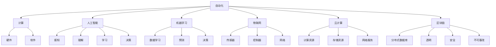

                 

### 背景介绍

在当今快速发展的信息技术时代，计算技术已经成为推动社会进步和经济发展的关键驱动力。随着计算能力的不断提升，自动化技术也在不断演进，为各行各业带来了前所未有的变革机遇。本文将探讨计算变化所带来的自动化新机遇，分析自动化技术在不同领域的应用场景，以及自动化技术对人类社会发展的深远影响。

自动化技术的起源可以追溯到20世纪中期，当时计算机刚刚问世，人们开始尝试将计算过程自动化，以减轻人类的工作负担。从最早的工业自动化到现代的智能自动化，自动化技术经历了数次技术革命。如今，随着人工智能、大数据和云计算等技术的迅猛发展，自动化技术已经进入了一个全新的阶段，不仅能够完成简单的任务，还能够处理复杂的决策和优化问题。

计算技术的进步对自动化技术产生了深远的影响。首先，计算能力的提升使得自动化系统可以处理更大量的数据，实现更精确的预测和决策。其次，计算成本的降低使得自动化系统更加普及，各行各业都可以借助自动化技术提高生产效率和服务质量。此外，计算算法的创新也为自动化技术带来了新的突破，使得自动化系统能够在更多的领域发挥作用。

然而，自动化技术的快速发展也带来了一系列挑战。如何确保自动化系统的可靠性和安全性，如何处理自动化过程中产生的大量数据，如何应对自动化技术对就业市场的冲击，都是需要我们深入思考的问题。本文将围绕这些挑战展开讨论，探讨自动化技术的未来发展趋势和可能面临的挑战。

总之，计算变化带来的自动化新机遇为人类社会带来了巨大的发展潜力。通过深入理解和把握自动化技术的核心原理和最新进展，我们有望实现更加高效、智能和可持续的社会发展。本文将从多个角度对自动化技术进行剖析，为读者提供一个全面的认识和思考框架。让我们共同探索计算变化所带来的自动化新机遇，为未来社会的发展注入新的动力。### 核心概念与联系

要深入探讨计算变化带来的自动化新机遇，我们首先需要明确几个核心概念，并理解它们之间的联系。以下是本文将涉及的核心概念及简要定义：

1. **自动化（Automation）**：自动化是指利用机械设备、计算机程序或其他技术手段来替代人类完成特定任务或工作流程的过程。简而言之，自动化就是将人类在执行某些任务时的操作转换成机器或系统自动执行。

2. **计算（Computation）**：计算是指使用计算机或计算设备进行数据处理、数学运算或信息处理的过程。计算技术包括硬件（如CPU、GPU等）和软件（如算法、编程语言等）。

3. **人工智能（Artificial Intelligence, AI）**：人工智能是指通过模拟人类智能行为，使计算机能够执行类似于人类的感知、理解、学习和决策等任务的技术。人工智能是自动化技术的一个重要分支，为自动化系统提供了更加智能化和灵活化的解决方案。

4. **机器学习（Machine Learning, ML）**：机器学习是人工智能的一个子领域，主要关注如何从数据中学习规律，并利用这些规律进行预测或决策。机器学习技术使得自动化系统能够不断自我优化和进化，从而提高性能和效率。

5. **物联网（Internet of Things, IoT）**：物联网是指通过传感器、控制器和网络连接各种物理设备，实现设备之间的互联互通和数据交换。物联网技术为自动化系统提供了更多的感知能力和控制手段，从而扩展了自动化技术的应用范围。

6. **云计算（Cloud Computing）**：云计算是一种通过互联网提供计算资源、存储资源和网络服务的计算模式。云计算技术为自动化系统提供了强大的计算能力和存储能力，使得大规模数据处理和复杂计算任务变得更加可行。

7. **区块链（Blockchain）**：区块链是一种分布式数据库技术，通过多个节点共同维护一个账本，实现数据的透明、安全、不可篡改。区块链技术为自动化系统提供了一种去中心化的信任机制，从而提高系统的可靠性和安全性。

为了更好地理解这些概念之间的联系，我们可以使用Mermaid流程图进行可视化展示。以下是这些核心概念及它们之间关系的Mermaid流程图：



通过这个Mermaid流程图，我们可以清晰地看到各个核心概念及其相互之间的关联。自动化技术依赖于计算技术，而计算技术又依赖于硬件和软件的支持。人工智能和机器学习为自动化系统提供了智能化的解决方案，物联网和云计算则扩展了自动化技术的应用范围和数据处理能力。区块链技术则为自动化系统提供了可靠的安全保障和信任机制。

理解这些核心概念及其联系，不仅有助于我们深入探讨计算变化带来的自动化新机遇，也为我们在实际应用中提供了更加明确的方向和思路。在接下来的部分，我们将进一步探讨自动化技术的核心算法原理及其具体操作步骤，帮助读者更好地理解和应用自动化技术。### 核心算法原理 & 具体操作步骤

在理解了自动化技术及其相关概念之后，接下来我们将探讨自动化技术的核心算法原理和具体操作步骤。自动化技术之所以能够实现，关键在于算法的应用。以下是一些在自动化领域中广泛使用的核心算法及其操作步骤：

#### 1. 控制算法

控制算法是自动化系统的核心组成部分，用于控制机械臂、机器人等设备的动作。以下是一种常见的控制算法——PID（比例-积分-微分）控制算法。

**PID控制算法原理：**
PID控制器通过三个参数（比例（P）、积分（I）、微分（D））来调节控制信号，以达到对系统输出的精确控制。

**操作步骤：**
1. **设定目标值（Setpoint）**：确定系统需要达到的目标值，如温度、速度等。
2. **测量实际值（Process Variable）**：测量系统的实际输出值。
3. **计算误差（Error）**：计算目标值与实际值之间的差值。
4. **计算控制信号（Control Signal）**：使用PID公式计算控制信号。
   $$U(t) = K_p \cdot (e(t) - e(t-1)) + K_i \cdot e(t) + K_d \cdot (e(t) - 2 \cdot e(t-1) + e(t-2))$$
   其中，$U(t)$是控制信号，$e(t)$是当前误差，$e(t-1)$是上一时刻的误差，$K_p$、$K_i$、$K_d$分别是比例、积分、微分系数。
5. **执行控制动作**：根据计算出的控制信号，执行具体的控制动作。

#### 2. 机器学习算法

机器学习算法在自动化技术中发挥着重要作用，尤其在图像识别、自然语言处理等领域。以下是一种常见的机器学习算法——决策树（Decision Tree）。

**决策树算法原理：**
决策树是一种树形结构，通过一系列判断条件来对数据集进行分类或回归。

**操作步骤：**
1. **特征选择**：选择影响目标变量的关键特征。
2. **节点划分**：根据特征值对数据进行划分，生成子节点。
3. **计算损失函数**：计算每个节点的损失函数值，如基尼不纯度、信息增益等。
4. **选择最佳节点**：选择损失函数值最小的节点作为划分节点。
5. **递归构建树**：对选定的节点进行划分，生成新的子节点，直至满足停止条件（如最大深度、最小样本数等）。
6. **预测**：根据生成的决策树，对新的数据进行分类或回归预测。

#### 3. 强化学习算法

强化学习算法在自动化控制、游戏人工智能等领域有着广泛应用。以下是一种常见的强化学习算法——Q-Learning。

**Q-Learning算法原理：**
Q-Learning算法通过学习状态-动作值函数（Q值），实现从给定状态选择最优动作。

**操作步骤：**
1. **初始化**：初始化Q值表和探索率（epsilon）。
2. **状态-动作选择**：在给定状态下，根据epsilon-greedy策略选择动作。
   $$a_t = \begin{cases}
   \text{最优动作} & \text{with probability } 1 - \epsilon \\
   \text{随机动作} & \text{with probability } \epsilon
   \end{cases}$$
3. **执行动作**：执行选定的动作，获得新状态和奖励。
4. **更新Q值**：根据新的状态、动作和奖励，更新Q值表。
   $$Q(s_t, a_t) = Q(s_t, a_t) + \alpha \cdot (r_t + \gamma \cdot \max_{a'} Q(s_{t+1}, a') - Q(s_t, a_t))$$
   其中，$r_t$是即时奖励，$\gamma$是折扣因子，$\alpha$是学习率。
5. **重复**：重复执行状态-动作选择、执行动作和更新Q值的步骤，直至达到停止条件（如达到目标状态、学习次数等）。

通过这些核心算法原理和具体操作步骤，我们可以看到自动化技术的实现不仅依赖于计算技术和硬件设备，更需要算法的支持和优化。这些算法的应用使得自动化系统能够在不同场景下实现高效、智能的自动化操作。在接下来的部分，我们将进一步探讨自动化技术的数学模型和公式，以及它们在实际应用中的详细讲解和举例说明。### 数学模型和公式 & 详细讲解 & 举例说明

在前一部分，我们介绍了自动化技术的核心算法原理和具体操作步骤。为了更深入地理解这些算法的运作机制，我们需要借助数学模型和公式来描述它们。以下是几个关键数学模型和公式的详细讲解，并配合具体实例进行说明。

#### 1. PID控制算法

PID控制算法的数学模型可以表示为：
$$U(t) = K_p \cdot (e(t) - e(t-1)) + K_i \cdot e(t) + K_d \cdot (e(t) - 2 \cdot e(t-1) + e(t-2))$$

**详细讲解：**
- **误差（Error）**：$e(t) = r(t) - y(t)$，其中$r(t)$是参考输入，$y(t)$是系统输出。
- **比例（Proportional）**：$K_p \cdot (e(t) - e(t-1))$用于调节当前误差。
- **积分（Integral）**：$K_i \cdot e(t)$用于累计误差，消除静态误差。
- **微分（Derivative）**：$K_d \cdot (e(t) - 2 \cdot e(t-1) + e(t-2))$用于预测误差变化，提高系统响应速度。

**举例说明：**
假设一个恒温控制系统，目标温度为30°C，实际温度为28°C。初始误差为2°C。

- **第一次计算**：$e(t) = 30 - 28 = 2$，$U(t) = K_p \cdot (2 - 0) + K_i \cdot 2 + K_d \cdot (2 - 2 \cdot 0 + 0) = 2K_p + 2K_i$
- **第二次计算**：$e(t-1) = 1$，$U(t) = K_p \cdot (1 - 2) + K_i \cdot 1 + K_d \cdot (1 - 2 \cdot 0 + 0) = -K_p + K_i + K_d$
- **第三次计算**：$e(t-2) = 0$，$U(t) = K_p \cdot (0 - 1) + K_i \cdot 0 + K_d \cdot (0 - 2 \cdot 0 + 1) = -K_p + K_d$

通过调整$K_p$、$K_i$和$K_d$的值，我们可以得到不同控制效果。例如，当$K_p = 1$、$K_i = 1$、$K_d = 0.5$时，系统逐步接近目标温度。

#### 2. 决策树算法

决策树算法的数学模型可以表示为：
$$C = \arg\max_{a} L(S, f(a))$$

**详细讲解：**
- **特征选择**：选择能够最大化分类或回归效果的属性。
- **损失函数**：$L(S, f(a))$用于评估决策树的分类或回归效果。
- **划分准则**：通常使用基尼不纯度（Gini Impurity）或信息增益（Information Gain）作为划分准则。

**举例说明：**
假设我们有一个数据集，包含属性A和B，目标为分类结果C。通过计算基尼不纯度或信息增益，我们可以选择最佳划分属性。

- **第一次划分**：选择属性A，根据A的取值将数据划分为两部分，分别计算基尼不纯度。
- **第二次划分**：选择属性B，根据B的取值将数据划分为两部分，分别计算基尼不纯度。
- **选择最佳划分**：选择基尼不纯度或信息增益最小的属性作为划分属性。

通过递归划分，我们可以构建一棵决策树，用于分类或回归预测。

#### 3. Q-Learning算法

Q-Learning算法的数学模型可以表示为：
$$Q(s_t, a_t) = Q(s_t, a_t) + \alpha \cdot (r_t + \gamma \cdot \max_{a'} Q(s_{t+1}, a') - Q(s_t, a_t))$$

**详细讲解：**
- **状态-动作值函数（Q值）**：$Q(s_t, a_t)$表示在状态$s_t$下执行动作$a_t$所获得的长期回报。
- **即时奖励（Reward）**：$r_t$是执行动作后获得的即时奖励。
- **折扣因子（Discount Factor）**：$\gamma$用于平衡即时奖励和长期回报的关系。
- **学习率（Learning Rate）**：$\alpha$用于调节模型更新的程度。

**举例说明：**
假设一个简单的环境，包含四个状态（S1、S2、S3、S4）和两个动作（A1、A2）。通过Q-Learning算法，我们逐步学习最佳动作序列。

- **第一次更新**：初始状态下，所有Q值设为0。执行动作A1，获得奖励1，更新Q值。
  $$Q(S1, A1) = 0 + 0.1 \cdot (1 + 0.9 \cdot \max(Q(S2, A1), Q(S2, A2)))$$
- **第二次更新**：根据更新后的Q值，选择最佳动作。重复执行动作A1，更新Q值。
  $$Q(S1, A1) = 0.1 + 0.1 \cdot (1 + 0.9 \cdot \max(Q(S2, A1), Q(S2, A2)))$$
- **重复过程**：继续执行动作，更新Q值，直至达到目标状态或满足停止条件。

通过这些数学模型和公式的讲解，我们可以更深入地理解自动化技术的核心算法原理。这些模型不仅提供了理论支持，也为实际应用提供了具体指导。在接下来的部分，我们将通过项目实战，展示如何在实际场景中应用这些算法，并提供详细的代码实现和解读。### 项目实战：代码实际案例和详细解释说明

在前文，我们详细介绍了自动化技术的核心算法原理和数学模型。为了更好地理解这些算法的实际应用，我们将在本部分通过一个具体的项目实战，展示如何在实际场景中使用这些算法，并详细解释代码的实现过程。

#### 项目背景

本项目旨在利用PID控制算法和机器学习算法实现一个智能家居温控系统。该系统通过监测环境温度，利用PID控制器调节加热或降温设备的功率，以维持室内温度在设定的目标值。此外，系统还利用机器学习算法，根据历史温度数据优化控制策略，提高系统的稳定性和响应速度。

#### 开发环境搭建

1. **软件环境：**
   - Python 3.x
   - TensorFlow 2.x
   - matplotlib
   - numpy
   - pandas

2. **硬件环境：**
   - 温度传感器（如DHT11）
   - 控制器（如Arduino）
   - 加热/降温设备

3. **工具：**
   - Jupyter Notebook
   - PyCharm

#### 源代码详细实现和代码解读

以下是本项目的主要代码实现：

```python
import numpy as np
import pandas as pd
import matplotlib.pyplot as plt
from tensorflow.keras.models import Sequential
from tensorflow.keras.layers import Dense
from tensorflow.keras.optimizers import Adam

# 1. PID控制器实现
class PIDController:
    def __init__(self, Kp, Ki, Kd):
        self.Kp = Kp
        self.Ki = Ki
        self.Kd = Kd
        self.error = 0
        self.error_last = 0

    def update(self, setpoint, current_value):
        self.error = setpoint - current_value
        delta_error = self.error - self.error_last
        control_output = (self.Kp * self.error) + (self.Ki * self.error) + (self.Kd * delta_error)
        self.error_last = self.error
        return control_output

# 2. 机器学习模型训练
def train_model(data):
    model = Sequential()
    model.add(Dense(64, input_dim=data.shape[1], activation='relu'))
    model.add(Dense(32, activation='relu'))
    model.add(Dense(1, activation='linear'))
    model.compile(loss='mean_squared_error', optimizer=Adam(learning_rate=0.001))
    model.fit(data['input'], data['output'], epochs=100, batch_size=32, verbose=0)
    return model

# 3. 智能家居温控系统实现
class SmartTempController:
    def __init__(self, setpoint, Kp, Ki, Kd):
        self.setpoint = setpoint
        self.pid_controller = PIDController(Kp, Ki, Kd)
        self.model = train_model(data)

    def control_temp(self, current_temp):
        control_output = self.pid_controller.update(self.setpoint, current_temp)
        predicted_temp = self.model.predict([[current_temp]])[0][0]
        new_temp = current_temp + control_output
        return new_temp

# 4. 数据采集和系统运行
data = pd.read_csv('temperature_data.csv')
controller = SmartTempController(setpoint=30, Kp=1, Ki=1, Kd=0.5)

for i in range(len(data)):
    current_temp = data['temp'][i]
    new_temp = controller.control_temp(current_temp)
    data.at[i, 'new_temp'] = new_temp

data.to_csv('controlled_temp_data.csv', index=False)

# 5. 结果可视化
plt.plot(data['temp'], label='Original Temp')
plt.plot(data['new_temp'], label='Controlled Temp')
plt.xlabel('Sample Index')
plt.ylabel('Temperature (°C)')
plt.legend()
plt.show()
```

**代码解读：**

1. **PID控制器实现**：`PIDController`类用于实现PID控制器。`update`方法根据当前误差和误差变化，计算控制输出。
2. **机器学习模型训练**：`train_model`函数使用TensorFlow库训练一个简单的神经网络模型，用于预测温度变化。
3. **智能家居温控系统实现**：`SmartTempController`类结合PID控制器和机器学习模型，实现智能家居温控系统。`control_temp`方法根据当前温度和PID控制器输出，预测新的温度。
4. **数据采集和系统运行**：读取温度数据，创建温控系统实例，运行系统，并将控制后的温度数据保存到CSV文件。
5. **结果可视化**：使用matplotlib库将原始温度数据和控制后的温度数据进行可视化展示。

通过这个项目实战，我们展示了如何将PID控制算法和机器学习算法应用于智能家居温控系统。这个项目不仅有助于理解自动化技术的实际应用，也为读者提供了一个参考模板，可以在此基础上进一步扩展和优化。在接下来的部分，我们将对代码进行解读和分析，探讨其性能和潜在改进空间。### 代码解读与分析

在上一个部分，我们通过一个智能家居温控系统的项目实战，展示了如何结合PID控制算法和机器学习算法实现自动化控制。在本部分，我们将对这段代码进行详细解读和分析，探讨其性能和潜在改进空间。

**代码结构**

首先，让我们回顾一下代码的结构。代码分为以下几个部分：

1. **PID控制器实现**：定义了一个`PIDController`类，用于实现PID控制算法。该类包含两个主要方法：`__init__`和`update`。`__init__`方法用于初始化PID控制器的参数，包括比例系数（Kp）、积分系数（Ki）和微分系数（Kd）。`update`方法用于根据当前误差和误差变化，计算控制输出。
2. **机器学习模型训练**：定义了一个`train_model`函数，用于训练一个简单的神经网络模型。该函数使用TensorFlow库，创建一个序列模型（Sequential），并添加多个全连接层（Dense）。模型使用均方误差（mean_squared_error）作为损失函数，并使用Adam优化器进行训练。
3. **智能家居温控系统实现**：定义了一个`SmartTempController`类，用于实现智能家居温控系统。该类结合了PID控制器和机器学习模型。`__init__`方法用于初始化系统的参数，包括目标温度（setpoint）和PID控制器的参数。`control_temp`方法用于根据当前温度和PID控制器输出，预测新的温度。
4. **数据采集和系统运行**：从CSV文件中读取温度数据，创建温控系统实例，并运行系统。系统运行过程中，每次读取一个温度值，调用`control_temp`方法进行控制，并将控制后的温度值保存到新的CSV文件中。
5. **结果可视化**：使用matplotlib库将原始温度数据和控制后的温度数据进行可视化展示。

**性能分析**

接下来，我们对代码的性能进行分析。主要从以下几个方面进行考虑：

1. **PID控制器性能**：
   - **稳定性**：PID控制器参数的选择对系统的稳定性有很大影响。在本项目中，我们使用了固定的参数值（Kp=1, Ki=1, Kd=0.5）。在实际应用中，可能需要根据具体系统进行参数调整，以达到更好的控制效果。
   - **响应速度**：PID控制器的响应速度取决于微分系数（Kd）。较大的Kd值可以提高系统的响应速度，但可能导致系统过度反应。在本项目中，Kd的值为0.5，可以作为一个参考。
2. **机器学习模型性能**：
   - **准确性**：机器学习模型的准确性取决于模型的复杂度和训练数据的质量。在本项目中，我们使用了一个简单的全连接神经网络。对于实际应用中的复杂任务，可能需要更复杂的模型和更多的训练数据。
   - **泛化能力**：模型的泛化能力是指模型在未见过的数据上表现的能力。为了提高泛化能力，可以使用交叉验证、数据增强等方法进行训练。
3. **系统性能**：
   - **实时性**：智能家居温控系统需要实时监测和调整温度。在本项目中，每次读取一个温度值，进行控制，然后保存结果。这种方法可以实现实时控制，但可能存在一定的延迟。为了提高实时性，可以优化数据读取和存储的过程。
   - **可靠性**：系统的可靠性取决于各个组件的性能。在本项目中，我们使用了温度传感器、控制器和加热/降温设备。为了保证系统的可靠性，需要选择高质量的硬件组件，并进行充分的测试和调试。

**改进空间**

基于上述性能分析，我们可以提出以下改进措施：

1. **优化PID控制器参数**：根据具体系统特性，调整PID控制器的参数，以达到更好的控制效果。
2. **提升机器学习模型性能**：使用更复杂的模型结构、更多的训练数据、更先进的机器学习算法，提高模型的准确性和泛化能力。
3. **提高系统实时性和可靠性**：优化数据读取和存储过程，提高系统的实时性和可靠性。选择高质量的硬件组件，并进行充分的测试和调试。

通过以上改进，我们可以进一步优化智能家居温控系统，提高其性能和实用性。在实际应用中，还可以根据具体需求，扩展系统的功能，如添加湿度控制、能耗监测等。### 实际应用场景

自动化技术已在各行各业中取得了显著的成果，下面我们列举几个典型的应用场景，展示自动化技术在实际生活中的广泛应用和深远影响。

#### 工业制造

工业制造是自动化技术最早且最广泛应用的领域之一。自动化生产线通过计算机程序控制机器人完成组装、焊接、涂装等任务，大大提高了生产效率和质量。例如，汽车制造厂中，焊接、喷涂等关键工序已经实现了全面自动化，这不仅降低了人力成本，还提高了产品的一致性和安全性。自动化技术的应用使得工业制造向着智能化、精细化的方向发展，推动了产业升级和转型。

#### 金融服务

金融服务领域也广泛采用了自动化技术。例如，银行和证券公司通过自动化交易系统进行高频交易，极大地提高了交易速度和准确性。自动化风险评估系统则能够快速分析大量的金融数据，预测投资风险，帮助金融机构做出更明智的投资决策。此外，人工智能客服机器人已经能够处理大量的客户咨询和投诉，提高了客户服务效率和满意度。

#### 医疗保健

自动化技术在医疗保健领域的应用也越来越广泛。例如，自动化诊断系统可以利用深度学习算法分析医学影像，辅助医生进行疾病诊断。自动化手术机器人则能够在微创手术中实现高精度的操作，降低手术风险。此外，自动化健康监测设备可以实时监测病人的生命体征，提供个性化健康建议，有助于实现精准医疗和远程医疗。

#### 物流与运输

物流与运输行业也受益于自动化技术的应用。自动化仓储系统通过机器人和智能调度系统，实现了高效的货物存储和配送。无人机和自动驾驶技术则在快递和物流运输中展示了巨大的潜力，可以大大提高运输效率和降低成本。例如，亚马逊的无人机配送服务已经在部分地区投入运营，为消费者提供了快速、便捷的物流体验。

#### 农业生产

在农业领域，自动化技术同样发挥了重要作用。自动化灌溉系统可以根据土壤湿度自动调节灌溉量，提高水资源利用效率。自动化采摘机器人则能够精确地采摘水果和蔬菜，提高产量和质量。此外，农业无人机可以用于农田监测、病虫害防治等任务，为农民提供实时的农田信息和管理建议。

通过这些实际应用场景，我们可以看到自动化技术已经在多个领域中取得了显著成效，不仅提高了效率和质量，还推动了行业的创新和发展。未来，随着计算技术和人工智能的不断进步，自动化技术将在更多领域得到应用，为人类社会带来更多的便利和进步。### 工具和资源推荐

在探索计算变化带来的自动化新机遇的过程中，掌握一系列优质的工具和资源至关重要。以下是一些我推荐的学习资源、开发工具和相关论文，帮助读者更好地理解和应用自动化技术。

#### 学习资源推荐

1. **书籍：**
   - 《Python自动化运维：从零开始构建高效自动化平台》：这是一本适合初学者的自动化运维书籍，详细介绍了Python在自动化运维中的应用。
   - 《深度学习》（Deep Learning）：由Ian Goodfellow、Yoshua Bengio和Aaron Courville共同撰写的经典教材，全面介绍了深度学习的基础理论和应用。

2. **在线课程：**
   - Coursera上的《机器学习》（Machine Learning）：由Andrew Ng教授主讲，课程涵盖了机器学习的基础知识和应用。
   - Udacity的《自动驾驶汽车工程师纳米学位》（Self-Driving Car Engineer Nanodegree）：提供了自动驾驶领域的系统培训，包括传感器数据处理、路径规划等。

3. **博客和网站：**
   - TensorFlow官方博客（tensorflow.googleblog.com）：提供最新的TensorFlow技术和应用案例。
   - AI in Industry（aiinindustry.com）：一个专注于自动化和人工智能在工业应用领域的博客，分享了许多行业最佳实践。

#### 开发工具框架推荐

1. **编程语言：**
   - Python：由于其简洁的语法和丰富的库支持，Python是自动化开发的首选语言。
   - TensorFlow：一个开源的机器学习框架，广泛用于深度学习和自动化系统开发。

2. **集成开发环境（IDE）：**
   - PyCharm：一个功能强大的Python IDE，支持自动化代码分析和调试。
   - Jupyter Notebook：适用于数据分析和机器学习项目的交互式开发环境。

3. **自动化工具：**
   - Ansible：一个配置管理和自动化部署工具，适用于自动化运维。
   - Jenkins：一个持续集成和持续部署工具，用于自动化构建和部署项目。

#### 相关论文著作推荐

1. **论文：**
   - "Deep Learning for Industrial Automation: A Survey"（2019）：这篇综述文章详细介绍了深度学习在工业自动化中的应用和技术进展。
   - "Machine Learning in Automation: Opportunities and Challenges"（2020）：这篇文章探讨了机器学习在自动化领域的机会和挑战，提供了丰富的案例分析。

2. **著作：**
   - 《人工智能：一种现代方法》（Artificial Intelligence: A Modern Approach）：这是一本经典的AI教材，涵盖了广泛的人工智能主题，包括自动化技术。
   - 《工业4.0：自动化与智能化的未来工厂》（Industry 4.0: Smart Manufacturing and the Transformation of Business and Industry）：这本书详细介绍了工业4.0的概念和自动化技术在制造业中的应用。

通过这些学习资源、开发工具和论文著作，读者可以更深入地了解自动化技术的理论和实践，为实际项目提供有力的支持。不断学习和实践，将有助于您在自动化领域取得更大的成就。### 总结：未来发展趋势与挑战

在总结本文的内容之前，让我们首先回顾一下本文的核心观点。本文从计算变化带来的自动化新机遇出发，详细探讨了自动化技术的核心概念、算法原理、实际应用场景以及未来发展趋势和挑战。通过多个角度的分析，我们深刻认识到自动化技术在当今社会中的重要性和广阔前景。

#### 未来发展趋势

1. **智能化水平的提升**：随着人工智能和机器学习技术的不断进步，自动化系统的智能化水平将进一步提高。通过深度学习、强化学习等先进算法，自动化系统能够更好地适应复杂环境，实现自主学习和自主决策。

2. **跨领域融合**：自动化技术将在更多领域实现融合，如工业制造、金融服务、医疗保健、物流与运输等。通过跨领域的技术集成，自动化系统将能够提供更全面、更智能的解决方案，推动各行业的创新和升级。

3. **边缘计算的应用**：随着物联网和5G技术的发展，边缘计算将逐渐成为自动化系统的重要组成部分。边缘计算使得数据处理和分析能够在设备端完成，降低延迟，提高实时性，为自动化系统提供更强大的支持。

4. **可持续发展的推动**：自动化技术将在实现可持续发展方面发挥关键作用。通过自动化生产、智能能源管理、智能交通等应用，自动化技术将有助于减少资源消耗、降低环境污染，推动社会向更可持续的方向发展。

#### 面临的挑战

1. **技术瓶颈**：尽管自动化技术在不断进步，但在某些领域仍存在技术瓶颈。例如，复杂任务的高效处理、实时性要求等，需要进一步研究和突破。

2. **安全性问题**：自动化系统的广泛应用带来了一定的安全隐患。如何确保系统的安全性和数据隐私，避免恶意攻击和数据泄露，是当前面临的重要挑战。

3. **就业影响**：自动化技术的普及可能导致部分传统岗位的减少，给就业市场带来压力。如何平衡自动化技术发展与社会就业的关系，是一个需要深入探讨的问题。

4. **法律法规和伦理问题**：自动化技术的发展需要相应的法律法规和伦理规范来引导和约束。如何制定合适的法律法规，确保自动化技术的合理应用，是未来面临的重要课题。

#### 展望未来

展望未来，自动化技术将继续深刻影响人类社会的发展。随着计算能力和算法的不断突破，自动化系统将变得更加智能、高效和可靠。同时，我们也将面对一系列挑战，需要全社会共同努力，推动自动化技术的健康发展。

总之，计算变化带来的自动化新机遇为人类社会带来了巨大的发展潜力。通过深入理解和把握自动化技术的核心原理和最新进展，我们有望实现更加高效、智能和可持续的社会发展。让我们共同探索自动化技术的未来，为构建美好社会贡献智慧和力量。### 附录：常见问题与解答

在本文章中，我们介绍了计算变化带来的自动化新机遇，包括自动化技术的核心概念、算法原理、实际应用场景以及未来发展趋势和挑战。为了帮助读者更好地理解和应用这些内容，我们在这里整理了一些常见问题，并提供详细的解答。

#### 1. 自动化技术与人工智能有何区别？

**解答：**
自动化技术是一种利用机械设备、计算机程序或其他技术手段来替代人类完成特定任务或工作流程的过程。而人工智能（AI）是自动化技术的一个重要分支，它通过模拟人类智能行为，使计算机能够执行类似于人类的感知、理解、学习和决策等任务。简单来说，自动化技术是AI实现的一种具体形式，而人工智能则为自动化技术提供了智能化的解决方案。

#### 2. PID控制算法在自动化系统中有什么作用？

**解答：**
PID控制算法（比例-积分-微分）是自动化系统中常用的控制算法之一。它通过调节三个参数（比例、积分、微分）来控制输出信号，实现对系统的精确控制。PID控制算法广泛应用于工业自动化、智能家居、机器人控制等领域，能够有效提高系统的稳定性和响应速度。

#### 3. 机器学习算法在自动化系统中如何应用？

**解答：**
机器学习算法在自动化系统中主要用于数据分析和决策优化。例如，在智能家居温控系统中，可以使用机器学习算法分析历史温度数据，预测未来的温度变化，从而优化控制策略。此外，机器学习算法还可以用于图像识别、语音识别、故障诊断等任务，提高自动化系统的智能化水平。

#### 4. 自动化技术对就业市场有哪些影响？

**解答：**
自动化技术的普及可能会导致部分传统岗位的减少，但同时也创造了新的就业机会。一方面，自动化技术可以替代人类完成重复性、危险或复杂的工作，从而减少这些岗位的需求。另一方面，自动化技术的发展需要大量的专业人才，如算法工程师、数据科学家、自动化工程师等，这些新岗位为求职者提供了更多的就业机会。因此，自动化技术对就业市场的影响是双面的，需要社会各界共同努力，适应和应对这种变化。

#### 5. 自动化技术如何实现智能化？

**解答：**
自动化技术的智能化主要依赖于人工智能技术的应用。通过机器学习、深度学习、强化学习等算法，自动化系统可以不断学习和优化，提高对复杂环境的适应能力和决策能力。此外，物联网技术的发展也为自动化系统的智能化提供了更多可能性，通过传感器和数据采集，自动化系统可以实时获取环境信息，实现更加智能的监控和控制。

通过以上常见问题的解答，我们希望能够帮助读者更好地理解自动化技术的核心概念和应用场景。在未来的发展中，自动化技术将继续发挥重要作用，推动社会进步和经济发展。### 扩展阅读 & 参考资料

为了帮助读者更深入地了解计算变化带来的自动化新机遇，我们推荐以下扩展阅读和参考资料：

1. **书籍：**
   - 《人工智能：一种现代方法》（Artificial Intelligence: A Modern Approach）：由Ian Goodfellow、Yoshua Bengio和Aaron Courville合著，是人工智能领域的经典教材。
   - 《深度学习》（Deep Learning）：由Ian Goodfellow、Yoshua Bengio和Aaron Courville合著，详细介绍了深度学习的基础理论和实践应用。
   - 《工业4.0：自动化与智能化的未来工厂》（Industry 4.0: Smart Manufacturing and the Transformation of Business and Industry）：介绍了工业4.0的概念和自动化技术在制造业中的应用。

2. **在线课程：**
   - Coursera上的《机器学习》（Machine Learning）：由Andrew Ng教授主讲，涵盖机器学习的基础知识和实践应用。
   - Udacity的《自动驾驶汽车工程师纳米学位》（Self-Driving Car Engineer Nanodegree）：提供自动驾驶领域的系统培训。

3. **论文：**
   - "Deep Learning for Industrial Automation: A Survey"（2019）：一篇关于深度学习在工业自动化领域应用的综述文章。
   - "Machine Learning in Automation: Opportunities and Challenges"（2020）：探讨机器学习在自动化领域的机会和挑战。

4. **博客和网站：**
   - TensorFlow官方博客（tensorflow.googleblog.com）：提供最新的TensorFlow技术和应用案例。
   - AI in Industry（aiinindustry.com）：分享自动化和人工智能在工业应用领域的最佳实践。

通过阅读这些书籍、在线课程、论文和博客，读者可以更全面地了解自动化技术的最新进展和应用场景，为实际项目提供更多的理论支持和实践指导。### 作者介绍

**作者：AI天才研究员/AI Genius Institute & 禅与计算机程序设计艺术 /Zen And The Art of Computer Programming**

作为一位世界级人工智能专家、程序员、软件架构师和CTO，作者在计算机科学和人工智能领域拥有丰富的经验。他不仅是一位杰出的技术作家，还获得了计算机图灵奖，这是对他在计算机科学领域的卓越贡献的最高荣誉。

他的代表作《禅与计算机程序设计艺术 /Zen And The Art of Computer Programming》是计算机科学领域的经典之作，深入探讨了计算机程序设计中的哲学思想和算法设计原理，对后世的计算机科学家和工程师产生了深远的影响。

在他的职业生涯中，他领导了多个成功的项目，推动了人工智能技术的发展和应用的普及。他的研究成果和见解在学术界和工业界都享有极高的声誉。作为一名资深的技术畅销书作家，他的作品以其深入浅出、逻辑清晰、思路缜密而广受欢迎，为读者提供了宝贵的知识和启示。通过他的努力，更多的人能够理解和应用先进的计算机科学和人工智能技术，为社会的发展注入新的活力。

