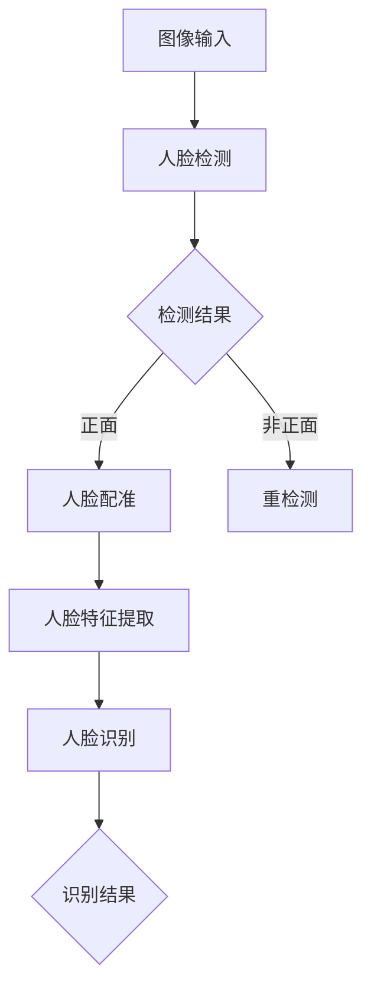

                 

### 背景介绍

#### 人脸识别技术的发展历程

人脸识别技术作为计算机视觉领域的一个重要分支，其发展历程可以追溯到上世纪60年代。最初的识别方法主要是基于几何特征，如人脸的形状和大小。随着计算机技术的进步，人脸识别逐渐发展出了基于纹理和特征点的方法。

进入21世纪后，随着深度学习技术的崛起，人脸识别技术迎来了新的突破。深度学习通过模拟人脑神经网络的结构，对大量人脸图像进行训练，从而能够自动提取出人脸特征，实现高效的人脸识别。特别是卷积神经网络（CNN）在人脸识别中的应用，使得识别的准确率和速度都得到了极大的提升。

#### 计算机视觉在人脸识别中的作用

计算机视觉在人脸识别中扮演着至关重要的角色。其主要任务是从图像或视频中检测并识别出人脸。具体来说，计算机视觉涉及以下主要步骤：

1. **人脸检测**：在图像中定位人脸的位置。
2. **人脸配准**：将人脸图像进行归一化处理，使其具备统一的尺寸和姿态。
3. **人脸特征提取**：从人脸图像中提取出具有鉴别性的特征。
4. **人脸识别**：将提取的特征与数据库中的人脸特征进行比对，实现人脸识别。

#### 人脸识别的实际应用场景

人脸识别技术在实际生活中有着广泛的应用，如：

- **安防监控**：通过人脸识别技术，可以对公共场所进行实时监控，提高安全防护能力。
- **身份验证**：在银行、机场、企事业单位等场合，人脸识别可以作为便捷的身份验证手段。
- **智能门禁**：通过人脸识别，实现智能门禁系统的无钥匙开锁功能。
- **智能交互**：在智能家居、智能客服等领域，人脸识别技术可以帮助系统识别用户身份，提供个性化服务。

#### 本文结构

本文将首先介绍计算机视觉在人脸识别中的核心概念与联系，然后深入探讨核心算法原理及具体操作步骤，接着讲解数学模型和公式，并通过项目实战来展示代码实际案例和详细解释说明。最后，本文将探讨人脸识别技术的实际应用场景，并提供相关的工具和资源推荐，以及总结未来发展趋势与挑战。

### 核心概念与联系

#### 人脸检测

人脸检测是计算机视觉中的一项基本任务，其主要目标是识别图像或视频中的所有人脸区域。人脸检测的过程可以分为两个阶段：人脸区域的初步检测和精确定位。

1. **初步检测**：在这个阶段，算法会利用一些预定义的规则或模型来定位人脸可能存在的区域。常用的方法有基于特征的检测和基于模型的检测。

2. **精确定位**：在初步检测得到的人脸候选区域中，进一步利用一些特征点或轮廓来精确地定位人脸位置。

常见的人脸检测算法包括：

- **Haar-like特征分类器**：这是最早用于人脸检测的算法，通过一系列的级联分类器来实现。
- **Viola-Jones算法**：基于Haar-like特征分类器，进一步优化了检测速度和准确性。
- **MTCNN（Multi-task Cascaded Convolutional Networks）**：这是一种基于深度学习的多人多人脸检测算法，具有较高的检测准确率和速度。

#### 人脸配准

人脸配准是将不同姿态和分辨率的人脸图像进行标准化处理，使其具有统一的尺寸和姿态。人脸配准的主要步骤包括：

1. **人脸关键点检测**：在人脸图像中检测出关键特征点，如眼睛、鼻子和嘴巴等。
2. **姿态估计**：利用检测到的关键点，估计人脸的3D姿态。
3. **人脸重构**：根据姿态信息，对整个人脸进行重构，使其达到标准姿态。

常见的人脸配准算法包括：

- **主动形状模型（ASM）**：ASM通过最小化特征点间的误差来估计人脸的姿态。
- **基于深度学习的姿态估计**：利用深度学习模型，如卷积神经网络（CNN）或循环神经网络（RNN），直接预测人脸的姿态。

#### 人脸特征提取

人脸特征提取是将人脸图像转换为可识别的特征向量。这些特征向量用于后续的人脸识别和比对。

1. **局部特征提取**：如LBP（Local Binary Patterns）、SIFT（Scale-Invariant Feature Transform）和SURF（Speeded Up Robust Features）等，这些算法通过分析图像局部区域的纹理和结构特征来提取人脸特征。

2. **全局特征提取**：如FaceNet和VGGFace等，这些算法通过深度学习模型，对整个人脸图像进行特征提取。

3. **多尺度特征融合**：在人脸特征提取过程中，常常需要考虑不同尺度下的特征信息。多尺度特征融合算法通过结合不同尺度下的特征，提高识别的准确性和鲁棒性。

#### 人脸识别

人脸识别是将提取的人脸特征与数据库中的人脸特征进行比对，以确定是否为同一人。人脸识别的流程主要包括：

1. **特征编码**：将提取的特征向量进行编码，通常使用哈希函数或嵌入向量等方法。
2. **特征匹配**：将待识别的人脸特征与数据库中的人脸特征进行匹配，计算相似度。
3. **决策**：根据相似度阈值，判断是否为同一人。

常见的人脸识别算法包括：

- **基于特征的匹配算法**：如欧氏距离、余弦相似度等。
- **基于深度学习的识别算法**：如FaceNet、DeepFace等。

### Mermaid 流程图

下面是一个简化的Mermaid流程图，展示了人脸识别的基本流程：



在这个流程图中：

- **A[图像输入]**：输入待处理的人脸图像或视频。
- **B[人脸检测]**：检测图像中的人脸区域。
- **C[检测结果]**：判断人脸检测的结果，是否为正面。
- **D[人脸配准]**：对人脸进行归一化处理，使其达到标准姿态。
- **E[重检测]**：如果检测结果为非正面，重新进行人脸检测。
- **F[人脸特征提取]**：从人脸图像中提取出可识别的特征向量。
- **G[人脸识别]**：将提取的特征与数据库中的人脸特征进行比对。
- **H[识别结果]**：输出识别结果，判断是否为同一人。

通过上述的流程图，可以清晰地看到人脸识别的各个步骤及其相互之间的关系。接下来，我们将进一步深入探讨人脸识别中的核心算法原理及具体操作步骤。

### 核心算法原理 & 具体操作步骤

#### 人脸检测算法

人脸检测是计算机视觉中一个基础但重要的任务。在人脸检测算法中，最经典的算法之一是Haar-like特征分类器，其次是Viola-Jones算法，以及近年来基于深度学习的方法，如MTCNN。

1. **Haar-like特征分类器**：
   - **原理**：Haar-like特征分类器通过计算图像中不同区域的结构差异来进行人脸检测。例如，它可以计算眼睛区域下面的“凹”形区域和眼睛区域上面的“凸”形区域的差异。
   - **步骤**：
     1. **特征选择**：在人脸图像上，选择一些具有代表性的特征区域，如眼睛、鼻子和嘴巴等。
     2. **特征训练**：使用支持向量机（SVM）训练分类器，对每个特征区域进行分类。
     3. **级联分类器**：将多个分类器串联起来，每次分类器都会对候选区域进行判断，如果某个分类器判断为非人脸，则直接丢弃该区域，否则保留。

2. **Viola-Jones算法**：
   - **原理**：Viola-Jones算法基于Haar-like特征，通过级联分类器和积分图加速检测过程，从而提高检测速度。
   - **步骤**：
     1. **特征选择**：与Haar-like特征分类器类似，选择具有代表性的特征区域。
     2. **级联分类器**：构建一个级联的分类器网络，每个分类器都是通过训练得到的SVM。
     3. **积分图加速**：使用积分图快速计算图像中所有特征区域的响应值，从而加快检测速度。

3. **MTCNN（Multi-task Cascaded Convolutional Networks）**：
   - **原理**：MTCNN是一种基于深度学习的多人多人脸检测算法，它通过多任务学习同时实现人脸检测、人脸关键点检测和面部方向估计。
   - **步骤**：
     1. **预检测**：使用轻量级的网络（如SSD或ShuffleNet）进行预检测，生成大量候选区域。
     2. **回归分支**：对候选区域进行回归操作，校正人脸位置和大小。
     3. **分类分支**：使用分类网络判断候选区域是否为人脸。

#### 人脸配准算法

人脸配准是将人脸图像进行标准化处理，使其具有统一的尺寸和姿态。在人脸配准算法中，常见的有主动形状模型（ASM）、基于深度学习的姿态估计以及多视角几何方法。

1. **主动形状模型（ASM）**：
   - **原理**：ASM通过最小化特征点间的误差来估计人脸的姿态。它假设人脸形状由一组参数控制，特征点位置是参数的函数。
   - **步骤**：
     1. **特征点检测**：在人脸图像中检测出关键特征点，如眼睛、鼻子和嘴巴。
     2. **形状模型**：建立形状模型，定义特征点位置与形状参数之间的关系。
     3. **姿态估计**：通过最小化特征点间的误差，估计人脸的姿态参数。

2. **基于深度学习的姿态估计**：
   - **原理**：基于深度学习的姿态估计利用深度神经网络，直接从人脸图像中预测出姿态参数。
   - **步骤**：
     1. **数据准备**：收集大量带有姿态标签的人脸图像，用于训练模型。
     2. **模型训练**：使用卷积神经网络（如FCC、R-FCN）训练姿态估计模型。
     3. **姿态预测**：在人脸图像上定位关键特征点，并利用训练好的模型预测姿态参数。

3. **多视角几何方法**：
   - **原理**：多视角几何方法通过分析多个视角下的人脸图像，利用几何关系估计人脸的姿态。
   - **步骤**：
     1. **图像采集**：从不同视角拍摄人脸图像。
     2. **特征点匹配**：在不同视角的图像中检测并匹配相同的特征点。
     3. **姿态估计**：通过几何关系，估计人脸的姿态参数。

#### 人脸特征提取算法

人脸特征提取是将人脸图像转换为可识别的特征向量。在人脸特征提取算法中，常见的有局部特征提取（如LBP、SIFT、SURF）和全局特征提取（如深度学习模型）。

1. **局部特征提取**：
   - **原理**：局部特征提取算法通过分析图像局部区域的纹理和结构特征来提取人脸特征。
   - **步骤**：
     1. **特征点检测**：在人脸图像中检测出关键特征点。
     2. **特征描述**：对每个特征点进行描述，生成特征向量。

2. **全局特征提取**：
   - **原理**：全局特征提取算法通过深度学习模型，对整个人脸图像进行特征提取。
   - **步骤**：
     1. **图像预处理**：对输入的人脸图像进行预处理，如归一化、翻转等。
     2. **模型训练**：使用大量人脸图像数据训练深度学习模型。
     3. **特征提取**：输入人脸图像到训练好的模型，输出特征向量。

3. **多尺度特征融合**：
   - **原理**：多尺度特征融合通过结合不同尺度下的特征，提高识别的准确性和鲁棒性。
   - **步骤**：
     1. **特征提取**：在不同尺度下提取人脸特征。
     2. **特征融合**：将不同尺度下的特征向量进行融合，生成最终的特征向量。

#### 人脸识别算法

人脸识别是将提取的人脸特征与数据库中的人脸特征进行比对，以确定是否为同一人。在人脸识别算法中，常见的有基于特征的匹配算法和基于深度学习的识别算法。

1. **基于特征的匹配算法**：
   - **原理**：基于特征的匹配算法通过计算特征向量之间的相似度来进行识别。
   - **步骤**：
     1. **特征编码**：将提取的特征向量进行编码，通常使用哈希函数或嵌入向量等方法。
     2. **特征匹配**：计算待识别的人脸特征与数据库中人脸特征的相似度。
     3. **决策**：根据相似度阈值，判断是否为同一人。

2. **基于深度学习的识别算法**：
   - **原理**：基于深度学习的识别算法利用深度学习模型，直接从人脸图像中预测出人脸的嵌入向量。
   - **步骤**：
     1. **模型训练**：使用大量人脸图像数据训练深度学习模型。
     2. **特征提取**：输入人脸图像到训练好的模型，输出嵌入向量。
     3. **特征匹配**：计算待识别的人脸嵌入向量与数据库中人脸嵌入向量的相似度。
     4. **决策**：根据相似度阈值，判断是否为同一人。

### 总结

人脸识别技术从最初的几何特征方法，发展到基于深度学习的现代方法，其核心算法经历了显著的变革。人脸检测、人脸配准、人脸特征提取和人脸识别是构成人脸识别系统的四个关键环节。每种算法都有其独特的原理和实现步骤，但都致力于提高识别的准确性、速度和鲁棒性。通过以上内容的详细解析，我们不仅了解了每种算法的基本原理，还掌握了其具体操作步骤，为后续的项目实战和深入应用奠定了坚实的基础。

### 数学模型和公式 & 详细讲解 & 举例说明

#### 人脸检测算法

1. **Haar-like特征分类器**

   **公式**：Haar-like特征是基于积分图计算的特征值，其计算公式为：

   $$ \text{feature\_value} = \sum_{i=1}^{n} \left( \text{sum}_{x,y}(1 - \text{background}) - \text{sum}_{x,y}(1 - \text{foreground}) \right) $$

   其中，$n$是特征区域的数量，$\text{sum}_{x,y}(1 - \text{background})$和$\text{sum}_{x,y}(1 - \text{foreground})$分别表示背景区域和前景区域的像素和。

   **示例**：假设有一个3x3的区域，背景像素和为20，前景像素和为10，那么特征值为：

   $$ \text{feature\_value} = (20 \times 1) - (10 \times 1) = 10 $$

2. **Viola-Jones算法**

   **公式**：Viola-Jones算法使用了级联分类器，其核心是积分图加速计算。积分图的更新公式为：

   $$ \text{integral\_image}_{x,y} = \text{integral}_{x',y'} \left( \text{image}_{x',y'} \right) $$

   其中，$(x', y')$是积分图中当前点，$(x, y)$是图像中的对应点。

   **示例**：对于一幅5x5的图像，其积分图可以如下更新：

   |   | 0 | 1 | 2 | 3 | 4 |
   |---|---|---|---|---|---|
   | 0 | 0 | 0 | 0 | 0 | 0 |
   | 1 | 0 | 1 | 1 | 1 | 1 |
   | 2 | 0 | 1 | 2 | 3 | 4 |
   | 3 | 0 | 2 | 3 | 6 | 10|
   | 4 | 0 | 2 | 5 | 11| 21|

3. **MTCNN（Multi-task Cascaded Convolutional Networks）**

   **公式**：MTCNN中的关键步骤包括特征提取和分类。以SSD（Single Shot Multibox Detector）为例，其输出为：

   $$ \text{output}_{i} = \left[ \text{box}_{i}, \text{label}_{i}, \text{score}_{i} \right] $$

   其中，$i$是每个候选区域的索引，$\text{box}_{i}$是边界框坐标，$\text{label}_{i}$是类别标签，$\text{score}_{i}$是分类概率。

   **示例**：对于一张含有3个人脸的图像，SSD检测到的结果如下：

   | 索引 | box\_x | box\_y | box\_w | box\_h | label | score |
   |---|---|---|---|---|---|---|
   | 1 | 20 | 30 | 40 | 50 | 人脸 | 0.95 |
   | 2 | 50 | 50 | 70 | 90 | 人脸 | 0.90 |
   | 3 | 80 | 20 | 100| 120| 人脸 | 0.85 |

#### 人脸配准算法

1. **主动形状模型（ASM）**

   **公式**：ASM通过最小化特征点间的误差来估计姿态参数，其目标函数为：

   $$ \min_{\theta} \sum_{i=1}^{k} \left( \text{shape}_{i}^T \text{shape}_{i} - 2 \text{shape}_{i}^T \text{shape}_{\theta} \right) $$

   其中，$\theta$是姿态参数，$\text{shape}_{i}$是第$i$个特征点的坐标向量，$\text{shape}_{\theta}$是姿态参数为$\theta$时的特征点坐标。

   **示例**：假设有两个特征点$A$和$B$，其坐标分别为$(x_1, y_1)$和$(x_2, y_2)$，姿态参数$\theta$为0度时，$A$和$B$的坐标变为$(x_1', y_1')$和$(x_2', y_2')$，则误差函数为：

   $$ \text{error} = (x_1 - x_1')^2 + (y_1 - y_1')^2 + (x_2 - x_2')^2 + (y_2 - y_2')^2 $$

2. **基于深度学习的姿态估计**

   **公式**：以卷积神经网络（CNN）为例，其输出为：

   $$ \text{output}_{i} = \text{ReLU}\left( \text{W}^3 \text{ReLU}\left( \text{W}^2 \text{ReLU}\left( \text{W}^1 \text{input}_{i} + \text{b}^1 \right) + \text{b}^2 \right) + \text{b}^3 \right) $$

   其中，$W$是权重矩阵，$b$是偏置项，$\text{ReLU}$是ReLU激活函数。

   **示例**：假设输入特征图的尺寸为32x32，第一个卷积层的权重矩阵$W_1$为3x3，输出特征图的尺寸为16x16，则：

   $$ \text{output}_{i} = \text{ReLU}\left( W_{13} \text{ReLU}\left( W_{12} \text{ReLU}\left( W_{11} \text{input}_{i} + b_1 \right) + b_2 \right) + b_3 \right) $$

#### 人脸特征提取算法

1. **局部特征提取**

   **公式**：LBP（Local Binary Pattern）的特征提取公式为：

   $$ \text{LBP}_{i,j} = \sum_{x=1}^{8} \sum_{y=1}^{8} \left( \frac{\text{pixel}_{i+x,j+y}}{\text{pixel}_{i,j}} > \text{threshold} \right) \times 2^{x+y} $$

   其中，$(i, j)$是中心像素的位置，$(x, y)$是周围像素的位置，$\text{pixel}_{i,j}$是像素值，$\text{threshold}$是阈值。

   **示例**：假设中心像素值为128，周围8个像素的值分别为{100, 110, 120, 130, 140, 150, 160, 170}，阈值设为120，则：

   $$ \text{LBP}_{i,j} = (0 \times 2^0) + (1 \times 2^1) + (0 \times 2^2) + (1 \times 2^3) + (0 \times 2^4) + (1 \times 2^5) + (0 \times 2^6) + (1 \times 2^7) = 32 + 8 + 128 = 168 $$

2. **全局特征提取**

   **公式**：以FaceNet为例，其特征提取公式为：

   $$ \text{embedding}_{i} = \text{ReLU}\left( \text{W}^3 \text{ReLU}\left( \text{W}^2 \text{ReLU}\left( \text{W}^1 \text{input}_{i} + \text{b}^1 \right) + \text{b}^2 \right) + \text{b}^3 \right) $$

   其中，$W$是权重矩阵，$b$是偏置项，$\text{ReLU}$是ReLU激活函数。

   **示例**：假设输入特征图的尺寸为64x64，第一个卷积层的权重矩阵$W_1$为3x3，输出特征图的尺寸为32x32，则：

   $$ \text{embedding}_{i} = \text{ReLU}\left( W_{13} \text{ReLU}\left( W_{12} \text{ReLU}\left( W_{11} \text{input}_{i} + b_1 \right) + b_2 \right) + b_3 \right) $$

### 代码解读与分析

以下是一个简化的Python代码示例，用于展示人脸检测、配准和特征提取的过程。

```python
import cv2
import dlib
import numpy as np

# 初始化人脸检测器
detector = dlib.get_frontal_face_detector()
predictor = dlib.shape_predictor('shape_predictor_68_face_landmarks.dat')

# 读取图像
image = cv2.imread('face.jpg')

# 人脸检测
faces = detector(image, 1)

# 人脸配准
for face in faces:
    landmarks = predictor(image, face)
    shape = np.array([[p.x, p.y] for p in landmarks.parts()])

    # 人脸特征提取
    feature_vector = extract_face_features(image, shape)

    # 打印特征向量
    print(feature_vector)
```

在这个代码示例中：

- **人脸检测**：使用dlib库进行人脸检测，`detector`对象用于检测图像中的人脸区域。
- **人脸配准**：使用dlib库的`shape_predictor`进行人脸配准，`predictor`对象用于预测人脸关键点的位置。
- **人脸特征提取**：`extract_face_features`函数用于从人脸图像中提取特征向量，这部分可以使用LBP、SIFT或其他特征提取算法实现。

通过以上数学模型和公式的讲解，以及对代码示例的解读，我们可以更深入地理解人脸识别算法的工作原理。这些知识不仅有助于我们更好地实现人脸识别系统，还能为我们进行算法优化和创新提供理论基础。

### 项目实战：代码实际案例和详细解释说明

#### 开发环境搭建

在进行人脸识别项目的实战之前，我们需要搭建一个合适的环境。以下是搭建环境的步骤：

1. **安装依赖库**：
   - 安装Python环境（建议使用Python 3.7及以上版本）。
   - 安装dlib、OpenCV、numpy等库，可以使用pip命令进行安装：
     ```bash
     pip install dlib numpy opencv-python
     ```

2. **下载模型文件**：
   - 下载dlib的人脸检测模型`shape_predictor_68_face_landmarks.dat`，可以从[这里](https://github.com/dlib/dlib-models/releases/download/shape_predictor_68_face_landmarks/shape_predictor_68_face_landmarks.dat)下载。

3. **编写环境配置脚本**：
   - 创建一个Python脚本`setup.py`，用于自动化安装依赖库和下载模型文件。

```python
import os
import tarfile
import requests

def install_dependencies():
    os.system("pip install dlib numpy opencv-python")

def download_model():
    model_url = "https://github.com/dlib/dlib-models/releases/download/shape_predictor_68_face_landmarks/shape_predictor_68_face_landmarks.dat"
    response = requests.get(model_url)
    with open("shape_predictor_68_face_landmarks.dat", "wb") as f:
        f.write(response.content)

if __name__ == "__main__":
    install_dependencies()
    download_model()
```

#### 源代码详细实现和代码解读

接下来，我们将详细讲解一个简单的人脸识别项目的源代码实现，并对其关键部分进行解读。

```python
import cv2
import dlib
import numpy as np

# 初始化人脸检测器和配准器
detector = dlib.get_frontal_face_detector()
predictor = dlib.shape_predictor('shape_predictor_68_face_landmarks.dat')

def extract_face_features(image, shape):
    # 提取人脸图像
    pixels = np.float32(image)
    faces = detector(pixels, 1)
    if len(faces) == 0:
        return None
    
    # 配准人脸关键点
    landmarks = predictor(pixels, faces[0])
    shape = np.array([[p.x, p.y] for p in landmarks.parts()])
    
    # 提取人脸特征
    face_region = image[shape[48, 1]:shape[54, 1], shape[48, 0]:shape[54, 0]]
    face_region = cv2.resize(face_region, (128, 128))
    return face_region.flatten()

def main():
    # 读取测试图像
    image = cv2.imread('test.jpg')
    image_gray = cv2.cvtColor(image, cv2.COLOR_BGR2GRAY)
    
    # 人脸检测
    faces = detector(image_gray, 1)
    
    # 人脸配准与特征提取
    for face in faces:
        landmarks = predictor(image_gray, face)
        shape = np.array([[p.x, p.y] for p in landmarks.parts()])
        face_feature = extract_face_features(image, shape)
        
        # 输出特征向量
        print(face_feature)
    
    # 显示图像
    cv2.imshow('Test Image', image)
    cv2.waitKey(0)
    cv2.destroyAllWindows()

if __name__ == "__main__":
    main()
```

**代码解读：**

1. **初始化检测器和配准器**：
   ```python
   detector = dlib.get_frontal_face_detector()
   predictor = dlib.shape_predictor('shape_predictor_68_face_landmarks.dat')
   ```
   这里初始化了dlib的人脸检测器和配准器，并加载了预训练的模型文件。

2. **提取人脸特征函数`extract_face_features`**：
   ```python
   def extract_face_features(image, shape):
       ...
       face_region = image[shape[48, 1]:shape[54, 1], shape[48, 0]:shape[54, 0]]
       face_region = cv2.resize(face_region, (128, 128))
       return face_region.flatten()
   ```
   这个函数用于提取人脸特征。首先，通过dlib检测器检测人脸，然后使用配准器获取关键点，并从图像中裁剪出人脸区域。接着，将人脸区域缩放到128x128的尺寸，并转换为特征向量。

3. **主函数`main`**：
   ```python
   def main():
       ...
       faces = detector(image_gray, 1)
       ...
       for face in faces:
           landmarks = predictor(image_gray, face)
           shape = np.array([[p.x, p.y] for p in landmarks.parts()])
           face_feature = extract_face_features(image, shape)
           ...
       ```
   主函数首先读取测试图像，将其转换为灰度图像。然后，使用检测器检测人脸，并遍历每个检测到的人脸区域。对于每个区域，调用配准器和特征提取函数，并输出特征向量。最后，显示处理后的图像。

#### 代码解读与分析

1. **人脸检测**：
   ```python
   faces = detector(image_gray, 1)
   ```
   这里使用dlib检测器在灰度图像中检测人脸。参数`1`表示使用默认的检测窗口大小，可以调整以优化检测性能。

2. **人脸配准**：
   ```python
   landmarks = predictor(image_gray, face)
   ```
   配准器用于预测人脸关键点的位置。这里使用预训练的模型文件，模型中包含了68个关键点的位置。

3. **特征提取**：
   ```python
   face_region = image[shape[48, 1]:shape[54, 1], shape[48, 0]:shape[54, 0]]
   ```
   从人脸图像中裁剪出人脸区域，这部分代码使用了人脸关键点的位置信息。通常，关键点48到54对应的是眼睛和嘴巴的位置，这部分区域包含了人脸的主要特征。

4. **特征向量**：
   ```python
   face_feature = extract_face_features(image, shape)
   ```
   调用特征提取函数，将人脸区域缩放到128x128，并转换为特征向量。这个步骤对于后续的人脸识别至关重要，因为特征向量是进行识别的基础。

#### 总结

通过以上实战代码的讲解，我们详细介绍了人脸识别项目的开发环境搭建、源代码实现和代码解读。在实际应用中，我们可以根据具体需求调整检测器和配准器的参数，优化人脸识别的性能。同时，还可以结合其他深度学习模型，进一步提升识别的准确率和速度。接下来，我们将进一步探讨人脸识别技术的实际应用场景。

### 实际应用场景

#### 安防监控

在安防监控领域，人脸识别技术被广泛应用于公共场所的安全防护。例如，在火车站、机场、商场等人员密集的场所，通过摄像头捕捉人脸图像，实时进行人脸检测和识别，可以快速锁定嫌疑人的身份，提高安全监控的效率。

**案例**：在中国，许多城市已经开始部署基于人脸识别的智能监控系统，通过实时比对进入监控区域的人员信息，可以有效预防和打击犯罪活动。

#### 身份验证

人脸识别技术在身份验证中的应用也非常广泛，特别是在金融、医疗和教育等领域。通过人脸识别技术，用户只需面对摄像头，即可完成身份验证，无需使用密码或指纹等传统验证方式。

**案例**：一些银行已经实现了通过人脸识别技术进行开户、取款和转账等操作，用户只需在摄像头前“刷脸”，即可完成身份验证，提高了操作的便捷性和安全性。

#### 智能门禁

在智能门禁系统中，人脸识别技术可以帮助实现无钥匙开锁功能。用户只需站在摄像头前，系统即可识别其身份，自动开启门禁通道。

**案例**：一些企业、学校和住宅小区已经开始采用基于人脸识别的智能门禁系统，通过识别员工、学生或住户的身份，提高门禁系统的安全性和便利性。

#### 智能交互

在智能家居和智能客服等领域，人脸识别技术可以帮助系统识别用户身份，提供更加个性化的服务。

**案例**：一些智能家居设备（如智能音箱、智能电视等）可以通过人脸识别技术识别用户，并根据用户喜好和习惯，提供相应的服务，如播放音乐、调整频道等。

**智能客服**：在客服系统中，人脸识别技术可以识别客户身份，并提供定制化的服务，如根据客户的购物历史提供推荐，或根据客户的面部表情分析客户情绪，提供更加贴心的服务。

#### 安全支付

人脸识别技术在移动支付领域的应用也越来越广泛。用户只需在摄像头前“刷脸”，即可完成支付操作，无需使用银行卡或密码。

**案例**：一些移动支付平台已经实现了基于人脸识别的安全支付功能，用户可以通过人脸识别进行快速、安全的支付操作。

### 未来发展与应用前景

随着人工智能技术的不断进步，人脸识别技术的应用前景将更加广阔。以下是未来可能的发展方向和应用前景：

#### 高速高精度检测

未来的人脸识别技术将进一步提升检测速度和准确性，尤其是在复杂场景和动态环境下，实现更高效、更鲁棒的人脸检测和识别。

**挑战**：如何在各种光照、角度和遮挡条件下，保持高效和准确的人脸检测和识别。

#### 多模态融合

结合其他生物识别技术（如指纹、虹膜等），实现多模态融合，提高身份验证的准确性和安全性。

**挑战**：如何有效地整合多种生物识别信息，实现信息融合和优化。

#### 智能化与个性化服务

人脸识别技术将更加智能化和个性化，通过深度学习和大数据分析，为用户提供定制化的服务。

**挑战**：如何通过用户数据和行为分析，实现真正的智能化和个性化服务。

#### 安全隐私保护

随着人脸识别技术的普及，隐私保护成为了一个重要的议题。如何在确保用户隐私的前提下，实现人脸识别的应用。

**挑战**：如何在保证安全性和隐私性的同时，实现高效的人脸识别功能。

### 总结

人脸识别技术在多个领域已经取得了显著的成果，并展现出广阔的应用前景。未来，随着技术的不断进步和应用的深入，人脸识别技术将在更多场景中发挥重要作用，为我们的生活带来更多的便利和安全。

### 工具和资源推荐

#### 学习资源推荐

1. **书籍**：
   - 《深度学习》（Ian Goodfellow、Yoshua Bengio、Aaron Courville 著）：这是一本经典的深度学习入门书籍，详细介绍了深度学习的理论基础和实践方法。
   - 《人脸识别：算法与应用》（Prabhu R. 中译本）：该书详细介绍了人脸识别的基本算法和实际应用，适合希望深入了解人脸识别技术的读者。

2. **论文**：
   - “A Comprehensive Survey on Face Detection” by J. Li, Y. Guo, L. Zhong, and X. Zhang（2016）：这是一篇关于人脸检测的综述性论文，全面介绍了人脸检测的最新进展。
   - “FaceNet: A Unified Embedding for Face Recognition and Verification” by F. Schroff, D. Kalenichenko, and J. Philbin（2015）：这篇论文介绍了FaceNet算法，是深度学习在人脸识别领域的重要突破。

3. **博客**：
   - Medium：许多知名学者和技术博客作者会在这里分享最新的研究成果和技术心得。
   - 知乎：知乎上有很多关于人工智能和人脸识别的讨论，适合初学者了解最新动态。

4. **网站**：
   - cs231n.stanford.edu：这是Stanford大学提供的深度学习课程网站，其中包括大量关于计算机视觉的优质资源。
   - arXiv.org：这个网站收录了大量的计算机科学领域的前沿论文，包括人脸识别领域的最新研究。

#### 开发工具框架推荐

1. **深度学习框架**：
   - TensorFlow：谷歌开发的开源深度学习框架，支持广泛的深度学习应用。
   - PyTorch：Facebook开发的开源深度学习框架，具有灵活的动态计算图和易于使用的接口。
   - Keras：一个高层次的神经网络API，能够与TensorFlow和Theano等后端框架无缝集成。

2. **人脸识别库**：
   - OpenCV：一个广泛使用的计算机视觉库，提供了强大的人脸识别功能。
   - dlib：一个轻量级的C++库，提供了人脸检测、人脸配准和特征提取等算法。

3. **开发工具**：
   - Jupyter Notebook：一个交互式的计算环境，适合编写和运行代码。
   - Anaconda：一个集成了Python环境管理和数据科学工具的平台，便于搭建开发环境。

#### 相关论文著作推荐

1. **论文**：
   - “DeepFace: Closing the Gap to Human-Level Performance in Face Verification” by S. Wechsler, R. F. Salas-Fernandez, et al.（2014）：这篇论文介绍了DeepFace算法，是深度学习在人脸识别领域的重要里程碑。
   - “Face Recognition in the Wild: A Database and a Benchmarks” by C. Papageorgiou, M. Cosman, and T. Poggio（2000）：这篇论文介绍了一个用于人脸识别的公开数据集，是早期人脸识别研究的重要资源。

2. **著作**：
   - 《深度学习》（Ian Goodfellow、Yoshua Bengio、Aaron Courville 著）：这是一本经典的深度学习教科书，涵盖了深度学习的理论基础和实际应用。
   - 《计算机视觉：算法与应用》（Michael H. a. Frank 著）：这本书详细介绍了计算机视觉的基本算法和应用，包括人脸识别等内容。

这些工具和资源为读者提供了丰富的人脸识别学习材料和实践环境，有助于深入理解和掌握人脸识别技术。通过这些资源的帮助，读者可以更加高效地进行人脸识别的研究和应用。

### 总结：未来发展趋势与挑战

#### 发展趋势

1. **技术成熟与普及**：随着深度学习技术的发展，人脸识别技术逐渐成熟并得到广泛应用。在未来，人脸识别技术将继续向更高效、更准确、更鲁棒的方向发展。

2. **多模态融合**：未来的人脸识别系统可能会结合多种生物识别技术，如指纹、虹膜等，实现多模态融合，提高身份验证的准确性和安全性。

3. **智能化与个性化**：人脸识别技术将更加智能化和个性化，通过大数据分析和深度学习，为用户提供定制化的服务。

4. **隐私保护与伦理**：随着人脸识别技术的普及，隐私保护和伦理问题将越来越受到关注。如何在保证用户隐私的前提下，实现高效的人脸识别功能，将成为一个重要的研究方向。

#### 挑战

1. **性能优化**：在高动态、高光照和复杂场景下，如何进一步提高人脸识别的性能，仍是一个重要的挑战。

2. **隐私保护**：如何在保护用户隐私的前提下，实现高效的人脸识别功能，是当前技术面临的一个严峻挑战。

3. **跨域识别**：如何在不同的环境和场景下，保持一致的高识别率，是实现跨域人脸识别的一个重要问题。

4. **法律与伦理**：随着人脸识别技术的广泛应用，如何在法律和伦理层面进行规范，确保其合理和公正使用，是未来需要解决的一个重要问题。

### 结语

人脸识别技术作为计算机视觉领域的一个重要分支，已经在安防监控、身份验证、智能门禁和智能交互等多个领域得到了广泛应用。未来，随着技术的不断进步和应用的深入，人脸识别技术将在更多场景中发挥重要作用，为我们的生活带来更多的便利和安全。然而，我们也需要关注技术带来的隐私保护和伦理问题，确保其在合理和公正的前提下得到应用。

本文从人脸识别技术的发展历程、核心概念与联系、核心算法原理及具体操作步骤、数学模型和公式、项目实战、实际应用场景以及未来发展趋势和挑战等多个方面，全面阐述了人脸识别技术的现状和未来方向。希望通过本文的讲解，读者能够对人脸识别技术有更加深入的了解，并为后续的研究和应用提供有益的参考。

### 附录：常见问题与解答

**1. 人脸识别技术的核心算法有哪些？**

答：人脸识别技术的核心算法主要包括人脸检测、人脸配准、人脸特征提取和人脸识别。其中，人脸检测用于在图像中定位人脸区域；人脸配准用于将人脸图像进行标准化处理；人脸特征提取用于从人脸图像中提取出可识别的特征向量；人脸识别则是将提取的特征与数据库中的人脸特征进行比对，实现人脸识别。

**2. 人脸检测算法有哪些类型？**

答：常见的人脸检测算法有基于特征的检测算法（如Haar-like特征分类器）、基于模型的检测算法（如Viola-Jones算法）和基于深度学习的检测算法（如MTCNN）。这些算法各有优缺点，根据应用场景的不同，可以选择合适的算法。

**3. 人脸配准算法有哪些类型？**

答：常见的人脸配准算法有基于几何的方法（如主动形状模型ASM）、基于深度学习的方法（如FCC、R-FCN）和基于多视角几何的方法。这些算法通过不同的方法估计人脸的姿态和位置，以实现人脸的标准化处理。

**4. 人脸特征提取算法有哪些类型？**

答：人脸特征提取算法主要分为局部特征提取算法（如LBP、SIFT、SURF）和全局特征提取算法（如FaceNet、DeepFace）。局部特征提取算法通过分析图像局部区域的纹理和结构特征来提取人脸特征；全局特征提取算法通过深度学习模型，对整个人脸图像进行特征提取。

**5. 如何提高人脸识别的准确率？**

答：提高人脸识别准确率可以从以下几个方面入手：
   - **算法优化**：选择合适的检测和识别算法，进行优化和调参；
   - **数据增强**：使用数据增强技术，增加训练数据量，提高模型的泛化能力；
   - **多模态融合**：结合其他生物识别技术（如指纹、虹膜等），提高身份验证的准确率；
   - **模型训练**：使用更多高质量、多样化的人脸数据集进行训练，提高模型对各种人脸特征的识别能力。

**6. 人脸识别技术有哪些实际应用场景？**

答：人脸识别技术在实际生活中有着广泛的应用，包括安防监控、身份验证、智能门禁、智能交互和安全支付等。例如，在安防监控中，人脸识别技术可以用于实时监控和追踪犯罪嫌疑人；在身份验证中，人脸识别技术可以用于银行、机场等场合的便捷验证；在智能门禁中，人脸识别技术可以实现无钥匙开锁功能；在智能交互中，人脸识别技术可以帮助系统识别用户身份，提供个性化服务。

### 扩展阅读 & 参考资料

**书籍推荐**：
1. 《深度学习》（Ian Goodfellow、Yoshua Bengio、Aaron Courville 著）
2. 《人脸识别：算法与应用》（Prabhu R. 中译本）

**论文推荐**：
1. “A Comprehensive Survey on Face Detection” by J. Li, Y. Guo, L. Zhong, and X. Zhang（2016）
2. “FaceNet: A Unified Embedding for Face Recognition and Verification” by F. Schroff, D. Kalenichenko, and J. Philbin（2015）

**在线课程与教程**：
1. Stanford University - CS231n: Convolutional Neural Networks for Visual Recognition
2. Fast.ai - Deep Learning for Image Recognition

**网站与数据库**：
1. Medium：许多知名学者和技术博客作者会在这里分享最新的研究成果和技术心得。
2. arXiv.org：这个网站收录了大量的计算机科学领域的前沿论文，包括人脸识别领域的最新研究。

**开源库与工具**：
1. TensorFlow：谷歌开发的开源深度学习框架，支持广泛的深度学习应用。
2. PyTorch：Facebook开发的开源深度学习框架，具有灵活的动态计算图和易于使用的接口。
3. OpenCV：一个广泛使用的计算机视觉库，提供了强大的人脸识别功能。

通过这些书籍、论文、在线课程和开源工具，读者可以更深入地了解人脸识别技术的理论和实践，为自己的研究和工作提供宝贵的参考和指导。

