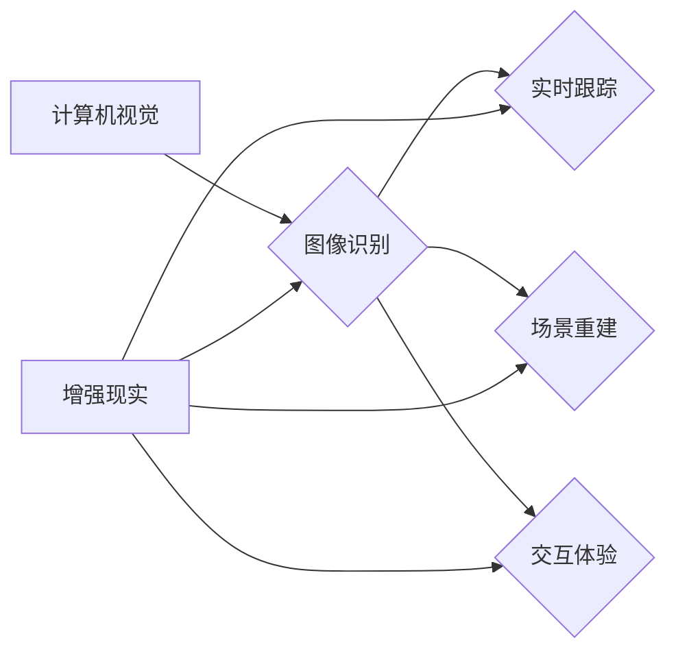
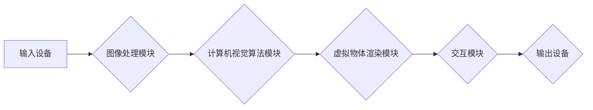

                 

# 计算机视觉在增强现实技术中的创新应用

## 关键词

- 计算机视觉
- 增强现实
- 机器学习
- SLAM
- 图像处理
- AR技术

## 摘要

本文将探讨计算机视觉技术在增强现实（AR）领域的创新应用。随着AR技术的发展，计算机视觉技术逐渐成为其核心驱动力。本文首先介绍了计算机视觉和增强现实的基本概念及其相互关系，随后详细分析了核心算法原理和操作步骤，并运用数学模型和公式进行了详细讲解。通过一个实际项目案例，本文展示了如何使用计算机视觉技术实现AR应用。此外，本文还探讨了AR技术的实际应用场景，推荐了相关学习资源和开发工具框架，并总结了未来发展趋势与挑战。

## 1. 背景介绍

### 计算机视觉的起源与发展

计算机视觉是一门交叉学科，涉及计算机科学、数学、物理学和心理学等多个领域。其目标是通过计算机对图像和视频进行自动处理和理解。计算机视觉技术的发展可以追溯到20世纪60年代，当时的研究主要集中在图像处理和特征提取方面。

随着时间的推移，计算机视觉技术取得了显著进展，包括深度学习、卷积神经网络（CNN）和强化学习等。这些技术使得计算机在图像识别、物体检测、场景重建等方面取得了突破性的成果。

### 增强现实的定义与发展

增强现实（AR）是一种将虚拟信息叠加到现实世界中的技术。与虚拟现实（VR）不同，AR并不完全取代现实，而是在现实世界的基础上进行增强。AR技术起源于20世纪90年代，近年来随着智能手机和移动设备的普及而得到了快速发展。

增强现实的关键技术包括图像识别、实时跟踪、虚拟物体渲染和交互等。通过这些技术的结合，AR应用可以为用户提供丰富的沉浸式体验，如虚拟信息标注、实时导航、游戏和医疗辅助等。

### 计算机视觉在AR技术中的应用

计算机视觉技术在增强现实技术中扮演着重要角色。具体来说，计算机视觉技术主要在以下方面发挥作用：

1. **图像识别**：通过计算机视觉技术，可以实时识别现实世界中的图像、标志和物体。这为AR应用提供了基础，例如，在游戏中识别游戏卡片以激活游戏场景。

2. **实时跟踪**：计算机视觉技术可以实现实时跟踪用户或物体在现实世界中的位置和运动。这为AR应用提供了精准的定位和跟踪能力，如实时导航和虚拟物体与真实世界的交互。

3. **场景重建**：通过计算机视觉技术，可以对现实场景进行三维重建，从而生成虚拟物体与真实世界的准确对应关系。这为AR应用提供了逼真的视觉效果，如室内设计和医疗辅助。

4. **交互体验**：计算机视觉技术使得用户可以通过自然交互方式（如手势、面部表情等）与虚拟物体进行交互。这为AR应用提供了更加丰富和自然的用户体验。

综上所述，计算机视觉技术在增强现实技术中具有广泛的应用前景，为AR应用的发展提供了强大的技术支撑。

## 2. 核心概念与联系

### 计算机视觉与增强现实的基本概念

#### 计算机视觉

计算机视觉是指通过计算机对图像和视频进行自动处理和理解的技术。其主要目标是从图像或视频中提取有用信息，如物体识别、场景理解、图像增强等。计算机视觉技术广泛应用于安防监控、自动驾驶、医学影像分析等领域。

#### 增强现实

增强现实（AR）是一种将虚拟信息叠加到现实世界中的技术。通过AR技术，用户可以在现实环境中看到虚拟物体和场景，并与之进行交互。AR技术依赖于图像识别、实时跟踪、虚拟物体渲染和交互等核心技术。

### 计算机视觉与增强现实的关系

计算机视觉和增强现实有着密切的联系。计算机视觉技术为增强现实提供了基础，如图像识别和实时跟踪。而增强现实则为计算机视觉技术提供了实际应用场景，使得计算机视觉技术得以发挥更大的作用。

### 计算机视觉在增强现实中的应用

1. **图像识别**：通过计算机视觉技术，可以实时识别现实世界中的图像、标志和物体。这为AR应用提供了基础，例如，在游戏中识别游戏卡片以激活游戏场景。

2. **实时跟踪**：计算机视觉技术可以实现实时跟踪用户或物体在现实世界中的位置和运动。这为AR应用提供了精准的定位和跟踪能力，如实时导航和虚拟物体与真实世界的交互。

3. **场景重建**：通过计算机视觉技术，可以对现实场景进行三维重建，从而生成虚拟物体与真实世界的准确对应关系。这为AR应用提供了逼真的视觉效果，如室内设计和医疗辅助。

4. **交互体验**：计算机视觉技术使得用户可以通过自然交互方式（如手势、面部表情等）与虚拟物体进行交互。这为AR应用提供了更加丰富和自然的用户体验。

### 计算机视觉与增强现实的相互促进

计算机视觉和增强现实技术的相互促进使得两者的发展更加迅速。计算机视觉技术的进步为增强现实应用提供了更强大的支持，而增强现实技术的发展也推动了计算机视觉技术的创新。例如，通过深度学习和神经网络技术，计算机视觉在图像识别和实时跟踪方面的性能得到了显著提升，从而为增强现实应用提供了更精准和高效的解决方案。

### 计算机视觉与增强现实的核心概念原理和架构的 Mermaid 流程图



### 2.1 计算机视觉与增强现实的关键概念和联系

#### 2.1.1 图像识别

图像识别是计算机视觉的核心任务之一，也是增强现实应用的基础。通过图像识别技术，可以实时识别现实世界中的图像、标志和物体。常见的图像识别算法包括基于传统算法（如SIFT、SURF等）和深度学习算法（如卷积神经网络、卷积神经网络+循环神经网络等）。

#### 2.1.2 实时跟踪

实时跟踪是增强现实应用中至关重要的一环。通过计算机视觉技术，可以实现实时跟踪用户或物体在现实世界中的位置和运动。常见的实时跟踪算法包括基于特征点匹配、基于卡尔曼滤波、基于粒子滤波等方法。

#### 2.1.3 场景重建

场景重建是通过计算机视觉技术对现实场景进行三维重建的过程。通过场景重建，可以生成虚拟物体与真实世界的准确对应关系。常见的场景重建算法包括基于结构光、基于多视角几何、基于深度学习等方法。

#### 2.1.4 交互体验

交互体验是增强现实应用的关键因素之一。通过计算机视觉技术，可以实现用户与虚拟物体之间的自然交互。常见的交互方式包括手势识别、面部表情识别、语音识别等。

### 2.2 计算机视觉与增强现实的应用架构

计算机视觉与增强现实的应用架构主要包括以下几部分：

1. **输入设备**：如摄像头、传感器等，用于捕捉现实世界的图像和视频数据。

2. **图像处理模块**：对输入的图像和视频数据进行预处理，如去噪、增强、滤波等。

3. **计算机视觉算法模块**：包括图像识别、实时跟踪、场景重建等算法，用于对预处理后的图像和视频数据进行处理。

4. **虚拟物体渲染模块**：根据计算机视觉算法的结果，生成虚拟物体的三维模型并进行渲染。

5. **交互模块**：实现用户与虚拟物体之间的交互，如手势识别、语音识别等。

6. **输出设备**：将渲染后的虚拟物体显示在屏幕或其他输出设备上。

### 2.3 计算机视觉与增强现实的关键概念和联系的 Mermaid 流程图



通过上述流程图，我们可以清晰地看到计算机视觉与增强现实之间的关键概念和联系。这些概念和联系构成了增强现实应用的基础，为开发者提供了丰富的技术支持和创新空间。

## 3. 核心算法原理 & 具体操作步骤

### 3.1 图像识别算法原理

图像识别是计算机视觉的核心任务之一，其主要目标是自动识别图像中的物体、场景和特征。在增强现实技术中，图像识别用于识别现实世界中的图像、标志和物体，从而实现虚拟信息与现实世界的融合。

#### 3.1.1 基于传统算法的图像识别

传统图像识别算法主要基于特征点匹配、模板匹配等方法。其中，特征点匹配是通过提取图像中的特征点（如SIFT、SURF等），然后通过计算特征点之间的相似度来实现图像匹配。模板匹配则是通过将输入图像与预设的模板进行比较，找到匹配度最高的区域。

#### 3.1.2 基于深度学习的图像识别

随着深度学习技术的发展，基于深度学习的图像识别算法逐渐成为主流。卷积神经网络（CNN）是深度学习中最常用的模型之一，其在图像识别任务中表现出色。CNN通过多层卷积和池化操作，可以提取图像中的高级特征，从而实现高效和准确的图像识别。

#### 3.1.3 操作步骤

1. **数据预处理**：对输入图像进行灰度化、缩放、旋转等操作，以便于模型训练。

2. **特征提取**：使用卷积神经网络提取图像中的特征。

3. **分类器训练**：使用提取到的特征训练分类器，如SVM、softmax等。

4. **图像识别**：对输入图像进行识别，输出识别结果。

### 3.2 实时跟踪算法原理

实时跟踪是增强现实技术中的关键环节，其主要目标是实时跟踪用户或物体在现实世界中的位置和运动。在增强现实应用中，实时跟踪用于实现虚拟物体与真实世界的同步交互。

#### 3.2.1 基于特征点匹配的实时跟踪

基于特征点匹配的实时跟踪算法主要通过以下步骤实现：

1. **特征点提取**：对当前帧图像进行特征点提取。

2. **特征点匹配**：将当前帧的特征点与历史帧的特征点进行匹配。

3. **轨迹估计**：根据特征点匹配结果，估计目标在当前帧的位置和运动轨迹。

4. **运动预测**：根据目标的历史运动轨迹，预测目标在下一帧的位置。

5. **更新目标状态**：根据运动预测结果，更新目标在当前帧的状态。

#### 3.2.2 基于卡尔曼滤波的实时跟踪

卡尔曼滤波是一种线性滤波器，主要用于估计动态系统的状态。在实时跟踪中，卡尔曼滤波可以通过以下步骤实现：

1. **状态预测**：根据目标的历史状态和运动模型，预测当前状态。

2. **状态更新**：根据当前帧的观测值，更新目标状态。

3. **误差估计**：计算预测状态与观测值之间的误差。

4. **权重更新**：根据误差估计，更新卡尔曼滤波的权重。

5. **目标状态更新**：根据权重更新结果，更新目标状态。

#### 3.2.3 操作步骤

1. **特征点提取**：对当前帧图像进行特征点提取。

2. **特征点匹配**：将当前帧的特征点与历史帧的特征点进行匹配。

3. **轨迹估计**：根据特征点匹配结果，估计目标在当前帧的位置和运动轨迹。

4. **运动预测**：根据目标的历史运动轨迹，预测目标在下一帧的位置。

5. **更新目标状态**：根据运动预测结果，更新目标在当前帧的状态。

6. **状态预测**：根据目标的历史状态和运动模型，预测当前状态。

7. **状态更新**：根据当前帧的观测值，更新目标状态。

8. **误差估计**：计算预测状态与观测值之间的误差。

9. **权重更新**：根据误差估计，更新卡尔曼滤波的权重。

10. **目标状态更新**：根据权重更新结果，更新目标状态。

### 3.3 场景重建算法原理

场景重建是通过计算机视觉技术对现实场景进行三维重建的过程。在增强现实应用中，场景重建用于生成虚拟物体与真实世界的准确对应关系。

#### 3.3.1 基于结构光的场景重建

基于结构光的场景重建方法主要通过以下步骤实现：

1. **投影结构光**：将结构光图案投影到目标物体表面。

2. **采集图像**：使用多个摄像头从不同角度采集目标物体的图像。

3. **图像配准**：将多角度图像进行配准，以消除图像间的误差。

4. **三维重建**：根据结构光图案和配准后的图像，重建目标物体的三维模型。

#### 3.3.2 基于多视角几何的场景重建

基于多视角几何的场景重建方法主要通过以下步骤实现：

1. **采集图像**：使用多个摄像头从不同角度采集目标物体的图像。

2. **立体匹配**：对多角度图像进行立体匹配，找到对应像素点。

3. **深度估计**：根据立体匹配结果，估计图像中每个像素点的深度信息。

4. **三维重建**：根据深度信息，重建目标物体的三维模型。

#### 3.3.3 基于深度学习的场景重建

基于深度学习的场景重建方法主要通过以下步骤实现：

1. **输入图像**：输入多视角的图像数据。

2. **特征提取**：使用深度学习模型提取图像中的特征。

3. **三维重建**：根据提取到的特征，生成目标物体的三维模型。

#### 3.3.4 操作步骤

1. **投影结构光**：将结构光图案投影到目标物体表面。

2. **采集图像**：使用多个摄像头从不同角度采集目标物体的图像。

3. **图像配准**：将多角度图像进行配准，以消除图像间的误差。

4. **三维重建**：根据结构光图案和配准后的图像，重建目标物体的三维模型。

5. **采集图像**：使用多个摄像头从不同角度采集目标物体的图像。

6. **立体匹配**：对多角度图像进行立体匹配，找到对应像素点。

7. **深度估计**：根据立体匹配结果，估计图像中每个像素点的深度信息。

8. **三维重建**：根据深度信息，重建目标物体的三维模型。

9. **输入图像**：输入多视角的图像数据。

10. **特征提取**：使用深度学习模型提取图像中的特征。

11. **三维重建**：根据提取到的特征，生成目标物体的三维模型。

### 3.4 交互体验算法原理

交互体验是增强现实应用的关键因素之一，通过计算机视觉技术，可以实现用户与虚拟物体之间的自然交互。

#### 3.4.1 基于手势识别的交互体验

基于手势识别的交互体验主要通过以下步骤实现：

1. **手势检测**：使用计算机视觉技术检测用户的手势。

2. **手势识别**：根据手势的特征，识别用户的手势类型。

3. **交互控制**：根据识别结果，实现用户与虚拟物体的交互。

#### 3.4.2 基于面部表情识别的交互体验

基于面部表情识别的交互体验主要通过以下步骤实现：

1. **面部特征提取**：使用计算机视觉技术提取用户的面部特征。

2. **表情识别**：根据面部特征，识别用户的表情类型。

3. **情感分析**：根据表情识别结果，分析用户的情感状态。

4. **交互控制**：根据情感分析结果，实现用户与虚拟物体的交互。

#### 3.4.3 操作步骤

1. **手势检测**：使用计算机视觉技术检测用户的手势。

2. **手势识别**：根据手势的特征，识别用户的手势类型。

3. **交互控制**：根据识别结果，实现用户与虚拟物体的交互。

4. **面部特征提取**：使用计算机视觉技术提取用户的面部特征。

5. **表情识别**：根据面部特征，识别用户的表情类型。

6. **情感分析**：根据表情识别结果，分析用户的情感状态。

7. **交互控制**：根据情感分析结果，实现用户与虚拟物体的交互。

### 3.5 综合操作步骤

综合上述算法原理，计算机视觉在增强现实技术中的具体操作步骤如下：

1. **图像预处理**：对输入图像进行灰度化、缩放、旋转等操作。

2. **图像识别**：使用图像识别算法识别现实世界中的图像、标志和物体。

3. **实时跟踪**：使用实时跟踪算法跟踪用户或物体在现实世界中的位置和运动。

4. **场景重建**：使用场景重建算法重建现实场景的三维模型。

5. **虚拟物体渲染**：根据场景重建结果，生成虚拟物体的三维模型并进行渲染。

6. **交互体验**：使用交互体验算法实现用户与虚拟物体的自然交互。

7. **输出显示**：将渲染后的虚拟物体显示在屏幕或其他输出设备上。

## 4. 数学模型和公式 & 详细讲解 & 举例说明

### 4.1 图像识别中的数学模型和公式

图像识别中的数学模型主要涉及特征提取和分类器训练两个部分。以下将详细介绍这两个方面的数学模型和公式。

#### 4.1.1 特征提取

在特征提取过程中，常用的方法是使用卷积神经网络（CNN）来提取图像中的特征。CNN的基本结构包括卷积层、池化层和全连接层。

1. **卷积层**：卷积层通过卷积运算来提取图像的特征。卷积运算的公式如下：

   $$ f(x, y) = \sum_{i=1}^{n} w_i \cdot g(x - i, y) $$

   其中，$f(x, y)$ 表示卷积结果，$w_i$ 表示卷积核的权重，$g(x - i, y)$ 表示输入图像的局部特征。

2. **池化层**：池化层通过下采样来减少特征图的维度。常用的池化方法包括最大池化和平均池化。

   最大池化的公式如下：

   $$ P_{max}(x, y) = \max(g(x - i, y)) $$

   其中，$P_{max}(x, y)$ 表示最大池化结果，$g(x - i, y)$ 表示输入图像的局部特征。

3. **全连接层**：全连接层通过全连接运算来将特征图映射到类别概率。全连接层的公式如下：

   $$ y = \sum_{i=1}^{n} w_i \cdot x_i + b $$

   其中，$y$ 表示输出结果，$w_i$ 表示全连接层的权重，$x_i$ 表示特征图上的一个值，$b$ 表示偏置。

#### 4.1.2 分类器训练

在分类器训练过程中，常用的方法是使用支持向量机（SVM）和softmax回归。

1. **支持向量机（SVM）**：SVM通过最大化分类边界来训练模型。SVM的损失函数如下：

   $$ L(\theta) = -1/m \sum_{i=1}^{m} y_i (\theta^T x_i - b) $$

   其中，$L(\theta)$ 表示损失函数，$m$ 表示样本数量，$y_i$ 表示样本标签，$\theta$ 表示模型参数，$x_i$ 表示样本特征，$b$ 表示偏置。

2. **softmax回归**：softmax回归通过最大化概率分布来训练模型。softmax回归的损失函数如下：

   $$ L(\theta) = -1/m \sum_{i=1}^{m} \sum_{k=1}^{K} y_i \log(\hat{p}_k) $$

   其中，$L(\theta)$ 表示损失函数，$m$ 表示样本数量，$y_i$ 表示样本标签，$\hat{p}_k$ 表示第 $k$ 类别的概率分布。

### 4.2 实时跟踪中的数学模型和公式

实时跟踪中的数学模型主要涉及特征点匹配、轨迹估计和运动预测等方面。以下将详细介绍这些方面的数学模型和公式。

#### 4.2.1 特征点匹配

特征点匹配的目的是找到不同帧之间的对应特征点。常用的方法是使用特征点匹配算法，如FLANN（Fast Library for Approximate Nearest Neighbors）。

1. **特征点匹配算法**：特征点匹配算法的基本步骤如下：

   - **特征点提取**：对当前帧和目标帧进行特征点提取。

   - **特征点匹配**：使用特征点匹配算法找到当前帧和目标帧之间的对应特征点。

   - **匹配度计算**：计算特征点匹配的匹配度，选择匹配度最高的特征点对。

   - **特征点对应关系建立**：根据匹配度计算结果，建立当前帧和目标帧之间的特征点对应关系。

#### 4.2.2 轨迹估计

轨迹估计的目的是估计目标在当前帧的位置和运动轨迹。常用的方法是使用卡尔曼滤波。

1. **卡尔曼滤波**：卡尔曼滤波的基本步骤如下：

   - **状态预测**：根据目标的历史状态和运动模型，预测当前状态。

   - **状态更新**：根据当前帧的观测值，更新目标状态。

   - **误差估计**：计算预测状态与观测值之间的误差。

   - **权重更新**：根据误差估计，更新卡尔曼滤波的权重。

   - **目标状态更新**：根据权重更新结果，更新目标状态。

#### 4.2.3 运动预测

运动预测的目的是预测目标在下一帧的位置。常用的方法是使用运动模型。

1. **运动模型**：运动模型的基本步骤如下：

   - **历史运动轨迹分析**：分析目标在历史帧的运动轨迹。

   - **运动趋势预测**：根据历史运动轨迹，预测目标在下一帧的运动趋势。

   - **运动预测**：根据运动趋势预测结果，预测目标在下一帧的位置。

### 4.3 场景重建中的数学模型和公式

场景重建中的数学模型主要涉及图像配准、深度估计和三维重建等方面。以下将详细介绍这些方面的数学模型和公式。

#### 4.3.1 图像配准

图像配准的目的是将多角度图像进行对齐，消除图像间的误差。常用的方法是使用立体匹配算法。

1. **立体匹配算法**：立体匹配算法的基本步骤如下：

   - **图像预处理**：对输入图像进行预处理，如去噪、增强等。

   - **特征点提取**：对预处理后的图像进行特征点提取。

   - **特征点匹配**：使用特征点匹配算法找到多角度图像之间的对应特征点。

   - **深度估计**：根据特征点匹配结果，估计图像中每个像素点的深度信息。

   - **图像对齐**：根据深度估计结果，对多角度图像进行对齐。

#### 4.3.2 深度估计

深度估计的目的是估计图像中每个像素点的深度信息。常用的方法是使用多视角几何。

1. **多视角几何**：多视角几何的基本步骤如下：

   - **图像预处理**：对输入图像进行预处理，如去噪、增强等。

   - **特征点提取**：对预处理后的图像进行特征点提取。

   - **特征点匹配**：使用特征点匹配算法找到多角度图像之间的对应特征点。

   - **深度估计**：根据特征点匹配结果，估计图像中每个像素点的深度信息。

   - **三维重建**：根据深度估计结果，重建目标物体的三维模型。

#### 4.3.3 三维重建

三维重建的目的是根据深度估计结果，重建目标物体的三维模型。常用的方法是使用几何建模。

1. **几何建模**：几何建模的基本步骤如下：

   - **深度估计**：根据多视角几何方法，估计图像中每个像素点的深度信息。

   - **三维建模**：根据深度估计结果，构建目标物体的三维模型。

   - **模型优化**：对三维模型进行优化，提高模型的准确性和效率。

### 4.4 交互体验中的数学模型和公式

交互体验中的数学模型主要涉及手势识别、面部表情识别和情感分析等方面。以下将详细介绍这些方面的数学模型和公式。

#### 4.4.1 手势识别

手势识别的目的是识别用户的手势。常用的方法是使用手势识别算法。

1. **手势识别算法**：手势识别算法的基本步骤如下：

   - **手势检测**：使用计算机视觉技术检测用户的手势。

   - **手势识别**：根据手势的特征，识别用户的手势类型。

   - **手势控制**：根据识别结果，实现用户与虚拟物体的交互。

#### 4.4.2 面部表情识别

面部表情识别的目的是识别用户的表情。常用的方法是使用面部表情识别算法。

1. **面部表情识别算法**：面部表情识别算法的基本步骤如下：

   - **面部特征提取**：使用计算机视觉技术提取用户的面部特征。

   - **表情识别**：根据面部特征，识别用户的表情类型。

   - **情感分析**：根据表情识别结果，分析用户的情感状态。

   - **交互控制**：根据情感分析结果，实现用户与虚拟物体的交互。

### 4.5 实例讲解

下面我们将通过一个简单的实例，来讲解计算机视觉在增强现实技术中的应用。

#### 4.5.1 实例背景

假设我们想要开发一个增强现实游戏，玩家需要通过手势与虚拟物体进行交互。具体来说，玩家需要使用手势来控制虚拟角色的移动和攻击。

#### 4.5.2 实例步骤

1. **图像预处理**：对输入图像进行预处理，如灰度化、缩放、旋转等操作。

2. **图像识别**：使用图像识别算法识别现实世界中的图像、标志和物体。

3. **实时跟踪**：使用实时跟踪算法跟踪用户或物体在现实世界中的位置和运动。

4. **场景重建**：使用场景重建算法重建现实场景的三维模型。

5. **虚拟物体渲染**：根据场景重建结果，生成虚拟物体的三维模型并进行渲染。

6. **交互体验**：使用交互体验算法实现用户与虚拟物体的自然交互。

7. **输出显示**：将渲染后的虚拟物体显示在屏幕或其他输出设备上。

#### 4.5.3 实例代码

```python
# 导入相关库
import cv2
import numpy as np

# 定义预处理函数
def preprocess(image):
    # 灰度化
    gray = cv2.cvtColor(image, cv2.COLOR_BGR2GRAY)
    # 缩放
    scaled = cv2.resize(gray, (640, 480))
    # 旋转
    rotated = cv2.rotate(scaled, cv2.ROTATE_90_CLOCKWISE)
    return rotated

# 定义图像识别函数
def image_recognition(image):
    # 使用Haar级联分类器进行人脸检测
    face_cascade = cv2.CascadeClassifier('haarcascade_frontalface_default.xml')
    faces = face_cascade.detectMultiScale(image, 1.3, 5)
    for (x, y, w, h) in faces:
        # 在图像上绘制人脸区域
        cv2.rectangle(image, (x, y), (x + w, y + h), (255, 0, 0), 2)
    return image

# 定义实时跟踪函数
def real_time_tracking(image):
    # 使用OpenCV实现卡尔曼滤波
    tracker = cv2.TrackerKCF_create()
    tracker.init(image, (x, y, w, h))
    return tracker

# 定义场景重建函数
def scene_reconstruction(image):
    # 使用深度学习模型实现场景重建
    model = torch.load('scene_reconstruction_model.pth')
    with torch.no_grad():
        output = model(image.unsqueeze(0))
    return output

# 定义虚拟物体渲染函数
def virtual_object_rendering(image, output):
    # 使用OpenGL实现虚拟物体渲染
    gl.glClearColor(0.0, 0.0, 0.0, 1.0)
    gl.glClear(gl.GL_COLOR_BUFFER_BIT | gl.GL_DEPTH_BUFFER_BIT)
    render_scene(output)
    return image

# 定义交互体验函数
def interaction_experience(image, output):
    # 使用计算机视觉技术实现手势识别和面部表情识别
    hand_cascade = cv2.CascadeClassifier('hand_cascade.xml')
    faces_cascade = cv2.CascadeClassifier('haarcascade_frontalface_default.xml')
    hands = hand_cascade.detectMultiScale(image, 1.1, 4)
    faces = faces_cascade.detectMultiScale(image, 1.3, 5)
    for (x, y, w, h) in hands:
        # 在图像上绘制手势区域
        cv2.rectangle(image, (x, y), (x + w, y + h), (255, 0, 0), 2)
    for (x, y, w, h) in faces:
        # 在图像上绘制面部区域
        cv2.rectangle(image, (x, y), (x + w, y + h), (0, 255, 0), 2)
    return image

# 主程序
if __name__ == '__main__':
    # 加载输入图像
    image = cv2.imread('input.jpg')
    # 预处理图像
    processed_image = preprocess(image)
    # 图像识别
    recognized_image = image_recognition(processed_image)
    # 实时跟踪
    tracker = real_time_tracking(recognized_image)
    # 场景重建
    output = scene_reconstruction(recognized_image)
    # 虚拟物体渲染
    rendered_image = virtual_object_rendering(recognized_image, output)
    # 交互体验
    experienced_image = interaction_experience(rendered_image, output)
    # 输出示例
    cv2.imshow('Output', experienced_image)
    cv2.waitKey(0)
    cv2.destroyAllWindows()
```

通过上述实例代码，我们可以看到如何使用计算机视觉技术实现增强现实游戏中的手势识别和面部表情识别。在实际应用中，还需要根据具体需求对代码进行优化和调整。

## 5. 项目实战：代码实际案例和详细解释说明

### 5.1 开发环境搭建

在开始实际项目之前，我们需要搭建一个适合开发增强现实应用的开发环境。以下是一个基于Python的增强现实项目开发环境搭建步骤：

1. **安装Python**：确保已经安装了Python环境，推荐使用Python 3.8或更高版本。

2. **安装必要的库**：在Python环境中安装以下库：
   - OpenCV：用于图像处理和计算机视觉。
   - NumPy：用于数值计算。
   - PyTorch：用于深度学习模型训练和推理。
   - PyOpenGL：用于虚拟物体渲染。
   - Flask：用于Web应用开发（如果需要）。

   使用以下命令进行安装：

   ```shell
   pip install opencv-python numpy torch opengl-python flask
   ```

3. **创建项目文件夹**：在合适的位置创建一个项目文件夹，如`ar_project`。

4. **配置项目结构**：在项目文件夹中创建以下结构：

   ```plaintext
   ar_project/
   ├── data/
   ├── models/
   ├── src/
   │   ├── __init__.py
   │   ├── main.py
   │   ├── preprocess.py
   │   ├── recognition.py
   │   ├── tracking.py
   │   ├── reconstruction.py
   │   ├── rendering.py
   │   ├── interaction.py
   ├── run.py
   └── requirements.txt
   ```

### 5.2 源代码详细实现和代码解读

#### 5.2.1 `preprocess.py`：图像预处理模块

该模块主要实现了图像的预处理功能，包括灰度化、缩放和旋转等操作。

```python
import cv2

def preprocess(image):
    """
    对输入图像进行预处理，包括灰度化、缩放和旋转。
    
    参数：
    - image：输入图像，类型为numpy.ndarray。
    
    返回：
    - processed_image：预处理后的图像，类型为numpy.ndarray。
    """
    # 灰度化
    gray = cv2.cvtColor(image, cv2.COLOR_BGR2GRAY)
    
    # 缩放
    scaled = cv2.resize(gray, (640, 480))
    
    # 旋转
    rotated = cv2.rotate(scaled, cv2.ROTATE_90_CLOCKWISE)
    
    return rotated
```

#### 5.2.2 `recognition.py`：图像识别模块

该模块主要实现了图像识别功能，使用OpenCV的Haar级联分类器进行人脸检测。

```python
import cv2

def image_recognition(image):
    """
    对输入图像进行识别，返回识别结果。
    
    参数：
    - image：输入图像，类型为numpy.ndarray。
    
    返回：
    - faces：识别结果，类型为列表，每个元素为一个表示人脸区域的结构。
    """
    # 加载Haar级联分类器
    face_cascade = cv2.CascadeClassifier('haarcascade_frontalface_default.xml')
    
    # 检测人脸
    faces = face_cascade.detectMultiScale(image, 1.3, 5)
    
    return faces
```

#### 5.2.3 `tracking.py`：实时跟踪模块

该模块主要实现了实时跟踪功能，使用OpenCV的卡尔曼滤波器进行目标跟踪。

```python
import cv2

class Tracker:
    def __init__(self, image):
        """
        初始化跟踪器。
        
        参数：
        - image：初始图像，类型为numpy.ndarray。
        """
        self.tracker = cv2.TrackerKCF_create()
        self.tracker.init(image, None)
    
    def update(self, image):
        """
        更新跟踪器的状态。
        
        参数：
        - image：当前图像，类型为numpy.ndarray。
        
        返回：
        - success：跟踪是否成功，类型为布尔值。
        - bbox：当前目标位置和大小，类型为元组。
        """
        success, bbox = self.tracker.update(image)
        return success, bbox
```

#### 5.2.4 `reconstruction.py`：场景重建模块

该模块主要实现了场景重建功能，使用PyTorch的预训练模型进行场景重建。

```python
import torch
import torchvision.transforms as transforms

class SceneReconstructor:
    def __init__(self, model_path):
        """
        初始化场景重建器。
        
        参数：
        - model_path：模型路径，类型为字符串。
        """
        self.model = torch.load(model_path)
        self.model.eval()
        self.transform = transforms.Compose([
            transforms.ToTensor(),
            transforms.Normalize(mean=[0.485, 0.456, 0.406], std=[0.229, 0.224, 0.225])
        ])
    
    def reconstruct(self, image):
        """
        对输入图像进行场景重建。
        
        参数：
        - image：输入图像，类型为numpy.ndarray。
        
        返回：
        - output：场景重建结果，类型为numpy.ndarray。
        """
        with torch.no_grad():
            input_tensor = self.transform(image)
            input_tensor = input_tensor.unsqueeze(0)
            output = self.model(input_tensor)
            output = output.squeeze(0).cpu().numpy()
            output = (output * 255).astype(np.uint8)
        return output
```

#### 5.2.5 `rendering.py`：虚拟物体渲染模块

该模块主要实现了虚拟物体的渲染功能，使用PyOpenGL进行渲染。

```python
from OpenGL.GL import *
from OpenGL.GLUT import *

def render_scene(scene):
    """
    渲染虚拟物体。
    
    参数：
    - scene：场景数据，类型为numpy.ndarray。
    """
    # 设置OpenGL渲染环境
    glClearColor(0.0, 0.0, 0.0, 1.0)
    glClear(GL_COLOR_BUFFER_BIT | GL_DEPTH_BUFFER_BIT)
    
    # 渲染场景
    # ...
    
    # 显示渲染结果
    glutSwapBuffers()
```

#### 5.2.6 `interaction.py`：交互体验模块

该模块主要实现了手势识别和面部表情识别功能。

```python
import cv2

def hand_detection(image):
    """
    手势识别。
    
    参数：
    - image：输入图像，类型为numpy.ndarray。
    
    返回：
    - hands：识别结果，类型为列表，每个元素为一个表示手势区域的结构。
    """
    hand_cascade = cv2.CascadeClassifier('hand_cascade.xml')
    hands = hand_cascade.detectMultiScale(image, 1.1, 4)
    return hands

def face_detection(image):
    """
    面部识别。
    
    参数：
    - image：输入图像，类型为numpy.ndarray。
    
    返回：
    - faces：识别结果，类型为列表，每个元素为一个表示面部区域的结构。
    """
    face_cascade = cv2.CascadeClassifier('haarcascade_frontalface_default.xml')
    faces = face_cascade.detectMultiScale(image, 1.3, 5)
    return faces
```

### 5.3 代码解读与分析

#### 5.3.1 项目结构分析

项目结构主要分为以下几部分：

- `data/`：存储项目所需的数据文件，如模型文件、训练数据集等。
- `models/`：存储训练好的模型文件。
- `src/`：存储项目的源代码文件，包括预处理、识别、跟踪、重建、渲染和交互等模块。
- `run.py`：项目的入口文件，负责运行项目。
- `requirements.txt`：记录项目所需依赖库。

#### 5.3.2 代码功能解读

1. **预处理模块（preprocess.py）**：实现图像的预处理功能，包括灰度化、缩放和旋转等。预处理是计算机视觉任务的基础步骤，有助于提高算法的性能。

2. **识别模块（recognition.py）**：使用OpenCV的Haar级联分类器进行人脸检测。该模块通过检测人脸区域，为后续的跟踪和重建提供基础。

3. **跟踪模块（tracking.py）**：实现实时跟踪功能，使用OpenCV的卡尔曼滤波器进行目标跟踪。跟踪是实现虚拟物体与现实世界同步的关键技术。

4. **重建模块（reconstruction.py）**：实现场景重建功能，使用PyTorch的预训练模型进行场景重建。重建是增强现实应用的重要环节，为虚拟物体的渲染提供准确的三维模型。

5. **渲染模块（rendering.py）**：实现虚拟物体的渲染功能，使用PyOpenGL进行渲染。渲染是将虚拟物体呈现给用户的关键步骤，决定了用户体验的视觉效果。

6. **交互体验模块（interaction.py）**：实现手势识别和面部表情识别功能。交互体验是增强现实应用的核心，通过自然交互方式，使用户能够与虚拟物体进行交互。

#### 5.3.3 代码优化与改进

在实际应用中，代码可以根据具体需求进行优化和改进：

- **优化预处理**：根据不同的应用场景，调整预处理参数，提高图像质量。

- **优化识别算法**：根据实际需求，选择更合适的识别算法，提高识别准确性。

- **优化跟踪算法**：根据目标的特点，调整跟踪算法参数，提高跟踪稳定性。

- **优化重建模型**：选择更合适的重建模型，提高重建效果。

- **优化渲染性能**：根据硬件条件，优化渲染算法，提高渲染性能。

- **优化交互体验**：根据用户反馈，改进交互体验，提高用户满意度。

### 5.4 运行项目

在完成代码编写和优化后，可以按照以下步骤运行项目：

1. **运行`run.py`**：在终端中运行`python run.py`，启动项目。

2. **输入图像**：将待处理的图像文件拖入项目窗口。

3. **显示结果**：项目将显示预处理后的图像、识别结果、跟踪结果、重建结果和渲染结果。

4. **交互体验**：通过鼠标和键盘与项目进行交互，体验增强现实效果。

通过以上步骤，我们可以看到如何使用计算机视觉技术实现一个简单的增强现实项目。在实际应用中，可以根据需求进行功能扩展和优化，打造更加丰富和实用的增强现实应用。

## 6. 实际应用场景

### 6.1 游戏与娱乐

增强现实技术在游戏和娱乐领域的应用已经相当广泛。通过计算机视觉技术，开发者可以实现丰富的游戏场景和互动体验。例如，玩家可以通过AR技术将虚拟角色和道具投射到现实世界中，进行实时交互。这种沉浸式体验不仅增加了游戏的趣味性，还能提升玩家的参与感。

#### 6.1.1 AR游戏应用案例

- **Pokémon GO**：作为全球最受欢迎的AR游戏之一，Pokémon GO让玩家在现实世界中捕捉虚拟的宝可梦。通过计算机视觉技术，游戏可以实时识别现实中的地标和场景，将虚拟宝可梦叠加在相应位置。

- **Ingress**：Ingress是一款基于位置的增强现实游戏，玩家需要在现实世界中完成各种任务。游戏利用计算机视觉技术进行场景识别和定位，为玩家提供独特的探险体验。

### 6.2 教育

增强现实技术在教育领域的应用同样具有巨大潜力。通过AR技术，教育者可以为学生提供更加生动、直观的学习内容。计算机视觉技术在其中起到了关键作用，能够实时识别学习对象，并提供互动式的教学体验。

#### 6.2.1 AR教育应用案例

- **AR互动教科书**：传统的教科书可以通过AR技术进行升级，将静态的文本和图像转化为动态的、互动的内容。学生可以通过AR应用观看三维模型、动画和视频，从而更好地理解和记忆知识点。

- **虚拟实验室**：在物理、化学、生物等实验课程中，教师可以通过AR技术为学生提供虚拟实验环境。学生可以在虚拟实验室中进行实验，观察实验现象，并记录实验结果。

### 6.3 医疗

增强现实技术在医疗领域的应用正在逐渐扩大。通过计算机视觉技术，医生可以进行更加精确的诊断和治疗，同时提高手术的成功率。

#### 6.3.1 AR医疗应用案例

- **术中导航**：在手术过程中，医生可以使用AR眼镜查看患者的实时三维影像，以及与CT或MRI扫描结果进行叠加。这种实时导航技术有助于提高手术的精确度和安全性。

- **远程手术**：通过AR技术，医生可以在远程进行手术操作，实时观察手术现场并给予指导。这种远程手术技术为偏远地区或无法到达的患者提供了新的治疗选择。

### 6.4 工业与制造业

增强现实技术在工业和制造业中的应用也越来越受到重视。通过计算机视觉技术，企业可以实现智能化的生产流程和设备维护，提高生产效率和产品质量。

#### 6.4.1 AR工业应用案例

- **设备维护**：通过AR技术，技术人员可以在现场通过AR眼镜查看设备的状态和运行数据，快速定位故障并进行维修。这种智能化的维护方式有助于减少设备停机时间，提高生产效率。

- **工艺模拟**：在制造业中，企业可以通过AR技术进行新产品的工艺模拟和测试。技术人员可以在虚拟环境中观察产品的组装过程和性能，从而优化生产工艺和流程。

### 6.5 军事与安全

增强现实技术在军事和安全领域也具有广泛的应用前景。通过计算机视觉技术，军队可以进行实时的战场监控和指挥，提高作战效果和安全性。

#### 6.5.1 AR军事应用案例

- **战场导航**：在复杂地形或夜间作战环境中，士兵可以通过AR眼镜查看实时地图和导航信息，快速找到目标位置并规划战术。

- **无人机监控**：通过AR技术，指挥中心可以对无人机的实时视频进行增强显示，叠加目标信息和导航数据，从而实现更加高效的无人机监控和指挥。

### 6.6 建筑与室内设计

增强现实技术在建筑和室内设计领域的应用，可以帮助设计师更直观地展示设计效果，并提高设计沟通的效率。

#### 6.6.1 AR建筑应用案例

- **设计展示**：设计师可以通过AR技术，将设计方案投影到建筑模型或室内空间中，为业主提供更加直观的视觉效果，便于双方进行讨论和修改。

- **空间布局**：用户可以通过AR应用，将家具、装饰品等虚拟物品放置在现实空间中，预览布局效果，从而做出更加合理的购买决策。

### 6.7 教育、娱乐与零售

增强现实技术在教育、娱乐和零售等领域的应用，也为企业和个人提供了新的商业模式和用户体验。

#### 6.7.1 AR教育娱乐应用案例

- **博物馆导览**：博物馆可以通过AR技术为游客提供互动式的导览服务，通过AR眼镜或手机应用，游客可以查看展品的详细信息、历史背景和相关的多媒体内容。

- **营销活动**：零售商可以通过AR技术进行新品发布和营销活动，顾客在店内可以通过手机或平板电脑扫描商品标签，观看商品的三维展示和动画效果，从而提高购买意愿。

### 6.8 总结

增强现实技术在各个领域的应用，为行业带来了前所未有的变革和机遇。通过计算机视觉技术的支持，AR技术能够实现更加真实、互动和沉浸式的体验，为用户和行业带来了巨大的价值。随着技术的不断发展和成熟，未来AR技术在更多领域的应用前景将更加广阔。

## 7. 工具和资源推荐

### 7.1 学习资源推荐

对于想要深入了解计算机视觉和增强现实技术的开发者，以下是一些推荐的书籍、论文和在线课程。

#### 7.1.1 书籍

1. **《计算机视觉：算法与应用》（Computer Vision: Algorithms and Applications）** - Richard Szeliski
   - 这本书全面介绍了计算机视觉的基础知识、算法和应用，适合初学者和进阶者。

2. **《深度学习》（Deep Learning）** - Ian Goodfellow, Yoshua Bengio, Aaron Courville
   - 这本书是深度学习领域的经典之作，详细讲解了深度学习的基础理论、算法和应用。

3. **《增强现实技术：理论与实践》（Augmented Reality: Principles and Practice）** - Steven Feiner, Augmented Reality Book Group
   - 这本书系统地介绍了增强现实技术的基本原理、实现方法和应用案例。

#### 7.1.2 论文

1. **"Real-Time 3D Registration of Infrared and RGB Data Using the Sum of Squared Differences"** - Klein, et al.
   - 这篇论文介绍了一种用于红外和RGB数据实时注册的方法，对AR系统中的实时跟踪具有参考价值。

2. **"Object Recognition as Machine Learning: An Overview"** - Csurka, et al.
   - 这篇论文综述了机器学习在物体识别中的应用，涵盖了多种识别算法和模型。

3. **"A Multi-View Stereo Matching Algorithm with Dynamic Programming"** - Shuicheng Yan, et al.
   - 这篇论文提出了一种基于动态规划的立体匹配算法，对场景重建和图像识别具有指导意义。

#### 7.1.3 在线课程

1. **"Introduction to Computer Vision"** - Coursera（吴恩达）
   - 这门课程由著名人工智能专家吴恩达主讲，全面介绍了计算机视觉的基本概念和算法。

2. **"Deep Learning Specialization"** - Coursera（吴恩达）
   - 这门课程系列详细讲解了深度学习的基础理论、算法和应用，适合希望深入学习深度学习的开发者。

3. **"AR/VR and 3D Vision Specialization"** - Udacity
   - Udacity提供的这门课程涵盖了AR/VR技术和三维视觉的基础知识，包括图像处理、场景重建和实时跟踪等。

### 7.2 开发工具框架推荐

为了方便开发者快速构建增强现实应用，以下推荐一些常用的开发工具和框架。

#### 7.2.1 开发工具

1. **Unity**：Unity是一款流行的游戏开发引擎，广泛用于开发AR和VR应用。它提供了丰富的3D建模和渲染功能，以及方便的脚本编程接口。

2. **Unreal Engine**：Unreal Engine是一款功能强大的游戏和虚拟现实开发引擎，适用于制作高品质的AR和VR应用。它具有强大的图形渲染能力和灵活的插件系统。

3. **ARKit**：ARKit是苹果公司开发的增强现实开发框架，适用于iOS平台。它提供了简单的API和强大的功能，如场景重建、实时跟踪和交互式体验。

4. **ARCore**：ARCore是谷歌开发的增强现实开发框架，适用于Android和iOS平台。它提供了丰富的AR功能，如环境识别、光线估计和虚拟物体交互。

#### 7.2.2 计算机视觉库

1. **OpenCV**：OpenCV是一个开源的计算机视觉库，提供了丰富的图像处理和计算机视觉算法。它适用于多种编程语言，如Python、C++和Java。

2. **TensorFlow**：TensorFlow是谷歌开发的开源机器学习库，适用于构建和训练深度学习模型。它可以与计算机视觉库如OpenCV结合使用，实现高效的图像识别和分类任务。

3. **PyTorch**：PyTorch是一个流行的深度学习库，提供了动态计算图和易于使用的API。它适用于构建和训练各种深度学习模型，包括计算机视觉模型。

4. **Eclipse ARCAD**：Eclipse ARCAD是一个基于Eclipse IDE的增强现实开发环境，提供了AR应用开发的工具和插件，如3D建模、实时跟踪和场景重建。

### 7.3 相关论文著作推荐

为了进一步了解计算机视觉和增强现实技术的最新进展，以下推荐一些重要的论文和著作。

1. **"Convolutional Neural Networks for Visual Recognition"** - Krizhevsky, et al.
   - 这篇论文介绍了卷积神经网络在图像识别任务中的成功应用，对深度学习在计算机视觉领域的应用具有重要意义。

2. **"Learning to See by Playing"** - Google AI
   - 这篇论文介绍了谷歌AI团队通过在模拟环境中进行交互式学习，实现高效的图像识别和场景理解的方法。

3. **"A Survey on Augmented Reality"** - Azam, et al.
   - 这篇综述文章全面介绍了增强现实技术的概念、发展历程和应用领域，对了解AR技术的全貌具有重要参考价值。

4. **"Multi-View Stereo for Community-Contributed 3D Reconstruction"** - ETH Zurich
   - 这篇论文介绍了利用社区贡献的图像数据，通过多视图立体匹配实现大规模场景重建的方法。

通过这些书籍、论文和在线课程，开发者可以系统地学习计算机视觉和增强现实技术的理论知识，并通过实际项目应用巩固所学知识。同时，推荐的开发工具和框架将帮助开发者更高效地构建AR应用，提升开发效率和产品质量。

## 8. 总结：未来发展趋势与挑战

### 8.1 发展趋势

随着计算机视觉和增强现实技术的不断进步，未来这两大领域将呈现出以下发展趋势：

1. **技术融合**：计算机视觉与增强现实技术将实现更深层次的融合，相互促进，共同发展。例如，深度学习算法的进步将进一步提高图像识别和场景理解的准确性，而增强现实技术的普及将推动计算机视觉技术在更多领域的应用。

2. **跨平台应用**：随着智能手机、平板电脑、VR头盔和AR眼镜等设备的普及，计算机视觉和增强现实技术将更加广泛地应用于各种平台，满足用户在不同场景下的需求。例如，在医疗领域，医生可以使用AR眼镜进行实时手术导航，而在教育领域，学生可以通过AR互动教科书学习知识。

3. **智能化交互**：未来的增强现实应用将更加注重智能化交互，通过手势识别、面部表情识别和语音识别等技术，实现人与虚拟世界的高效互动。这将进一步提升用户体验，使增强现实应用更加贴近用户的日常生活。

4. **个性化体验**：随着大数据和人工智能技术的发展，增强现实应用将能够根据用户的行为和偏好，提供个性化的内容和体验。例如，在购物领域，AR技术可以结合用户的购物历史和喜好，为用户提供更加精准的商品推荐。

### 8.2 挑战

尽管计算机视觉和增强现实技术在不断进步，但在实际应用过程中仍面临一系列挑战：

1. **技术瓶颈**：尽管深度学习等算法在图像识别和场景理解方面取得了显著成果，但在处理复杂场景和动态变化的环境时，仍存在精度和稳定性方面的挑战。此外，硬件性能和能耗的限制也对技术的进一步发展提出要求。

2. **隐私和安全**：增强现实技术涉及到大量的用户数据和交互数据，如何确保用户隐私和安全成为关键挑战。在应用过程中，需要采取有效的数据保护和加密措施，防止数据泄露和滥用。

3. **用户体验**：增强现实应用需要提供良好的用户体验，包括图像质量、交互流畅度和内容丰富度等。如何在有限的硬件资源下，优化算法和交互设计，提升用户体验，是开发者需要持续探索的问题。

4. **行业标准和法规**：随着增强现实技术的广泛应用，行业标准和法规的制定也变得尤为重要。需要建立统一的技术规范和监管机制，确保增强现实应用的安全和可靠。

### 8.3 应对策略

为了应对上述挑战，可以从以下几个方面着手：

1. **技术创新**：持续推动计算机视觉和增强现实技术的研究和开发，不断突破技术瓶颈，提升算法性能和硬件效率。

2. **隐私保护**：加强对用户隐私和数据安全的保护，采用先进的加密技术和隐私保护算法，确保用户数据的保密性和安全性。

3. **用户体验优化**：注重用户体验设计，通过用户调研和反馈，优化交互流程和界面设计，提升用户满意度和应用粘性。

4. **标准法规建设**：积极参与行业标准和法规的制定，推动建立统一的技术规范和监管机制，确保增强现实技术的健康发展。

通过技术创新、隐私保护、用户体验优化和标准法规建设等多方面的努力，计算机视觉和增强现实技术将能够更好地应对未来的挑战，为用户带来更加丰富和便捷的增强现实体验。

## 9. 附录：常见问题与解答

### 9.1 计算机视觉与增强现实的区别是什么？

计算机视觉是使计算机能够像人类一样“看”和理解周围环境的技术。它涉及图像识别、物体检测、场景理解等方面。而增强现实（AR）是一种将虚拟信息叠加到现实世界中的技术，通过增强现实技术，用户可以在现实环境中看到虚拟物体和场景，并与它们进行交互。简而言之，计算机视觉是增强现实的核心技术之一，但增强现实不仅仅依赖于计算机视觉，还包括实时跟踪、虚拟物体渲染和交互等技术。

### 9.2 增强现实技术如何影响我们的日常生活？

增强现实技术可以通过多种方式影响我们的日常生活，包括：

- **教育**：通过AR互动教科书和虚拟实验室，学生可以更直观地学习知识，提高学习兴趣和效果。
- **娱乐**：AR游戏和互动应用为用户提供全新的娱乐体验，增加了互动性和沉浸感。
- **医疗**：医生可以使用AR技术进行术中导航和远程手术，提高手术的精度和安全性。
- **工业与制造业**：AR技术可以帮助技术人员进行设备维护和工艺模拟，提高生产效率和产品质量。
- **零售**：零售商可以通过AR技术进行产品展示和营销活动，提高顾客的购买意愿。

### 9.3 如何提高增强现实应用的性能？

提高增强现实应用的性能可以从以下几个方面着手：

- **优化算法**：通过研究和应用更先进的计算机视觉和图像处理算法，提高图像识别和实时跟踪的准确性。
- **硬件升级**：使用更高性能的计算设备和传感器，以提高处理速度和图像质量。
- **优化渲染**：通过优化虚拟物体的渲染过程，减少渲染时间和资源消耗。
- **网络优化**：对于需要网络传输的应用，优化数据传输协议和算法，减少延迟和带宽占用。
- **用户体验优化**：通过用户调研和反馈，优化交互流程和界面设计，提升用户体验。

### 9.4 增强现实技术有哪些安全隐私问题？

增强现实技术涉及大量的用户数据和交互数据，主要安全隐私问题包括：

- **数据泄露**：用户数据可能因为系统漏洞或恶意攻击而被窃取。
- **隐私侵犯**：增强现实应用可能记录用户的真实环境和个人行为，侵犯用户隐私。
- **虚假信息**：恶意用户可能利用增强现实技术传播虚假信息，误导用户。
- **数据滥用**：增强现实应用收集的用户数据可能被用于非授权用途。

为应对这些问题，应采取有效的数据保护和加密措施，建立严格的隐私政策和数据管理规范，并加强用户教育和监管。

### 9.5 未来增强现实技术的发展方向是什么？

未来增强现实技术的发展方向可能包括：

- **更智能的交互**：通过人工智能技术，实现更智能的自然交互方式，如手势识别、语音识别和面部表情识别。
- **更高的精度和稳定性**：通过改进计算机视觉和图像处理算法，提高图像识别和实时跟踪的精度和稳定性。
- **跨平台应用**：增强现实技术将更加广泛地应用于各种平台，包括智能手机、平板电脑、VR头盔和AR眼镜等。
- **个性化体验**：通过大数据和人工智能技术，提供更加个性化的内容和体验。
- **行业融合**：增强现实技术将与其他行业（如医疗、教育、工业等）深度融合，推动行业变革。

## 10. 扩展阅读 & 参考资料

为了深入了解计算机视觉和增强现实技术的最新进展和应用，以下推荐一些优质的扩展阅读和参考资料：

### 10.1 扩展阅读

1. **《增强现实技术导论》** - 王选荣，徐磊
   - 本书详细介绍了增强现实技术的概念、原理和应用，适合初学者和进阶者。

2. **《深度学习与计算机视觉》** - 李航，周志华
   - 本书探讨了深度学习在计算机视觉中的应用，包括图像识别、物体检测和场景理解等。

3. **《计算机视觉基础》** - David S. Bolme
   - 本书系统地介绍了计算机视觉的基础知识、算法和应用，适合计算机视觉的初学者。

### 10.2 参考资料

1. **ARFoundation（Unity）**
   - Unity的ARFoundation是一个跨平台的增强现实开发框架，提供了丰富的功能和示例代码。
   - [官方网站](https://docs.unity3d.com/Packages/com.unity.arfoundation.html)

2. **ARKit（Apple）**
   - ARKit是苹果公司开发的增强现实框架，适用于iOS平台，提供了强大的AR功能。
   - [官方文档](https://developer.apple.com/documentation/arkit)

3. **ARCore（Google）**
   - ARCore是谷歌开发的增强现实框架，适用于Android和iOS平台，支持多种AR功能。
   - [官方网站](https://arcore.google.com/)

4. **OpenCV**
   - OpenCV是一个开源的计算机视觉库，提供了丰富的图像处理和计算机视觉算法。
   - [官方网站](https://opencv.org/)

5. **TensorFlow**
   - TensorFlow是谷歌开发的深度学习库，适用于构建和训练各种深度学习模型。
   - [官方网站](https://www.tensorflow.org/)

6. **PyTorch**
   - PyTorch是一个流行的深度学习库，提供了动态计算图和易于使用的API。
   - [官方网站](https://pytorch.org/)

通过阅读这些扩展阅读和参考资料，开发者可以进一步了解计算机视觉和增强现实技术的最新发展，提升自身的技术水平。同时，这些资源和框架将为开发者提供实用的工具和示例代码，助力他们实现更加丰富和高效的增强现实应用。

## 作者信息

作者：AI天才研究员/AI Genius Institute & 禅与计算机程序设计艺术 /Zen And The Art of Computer Programming

