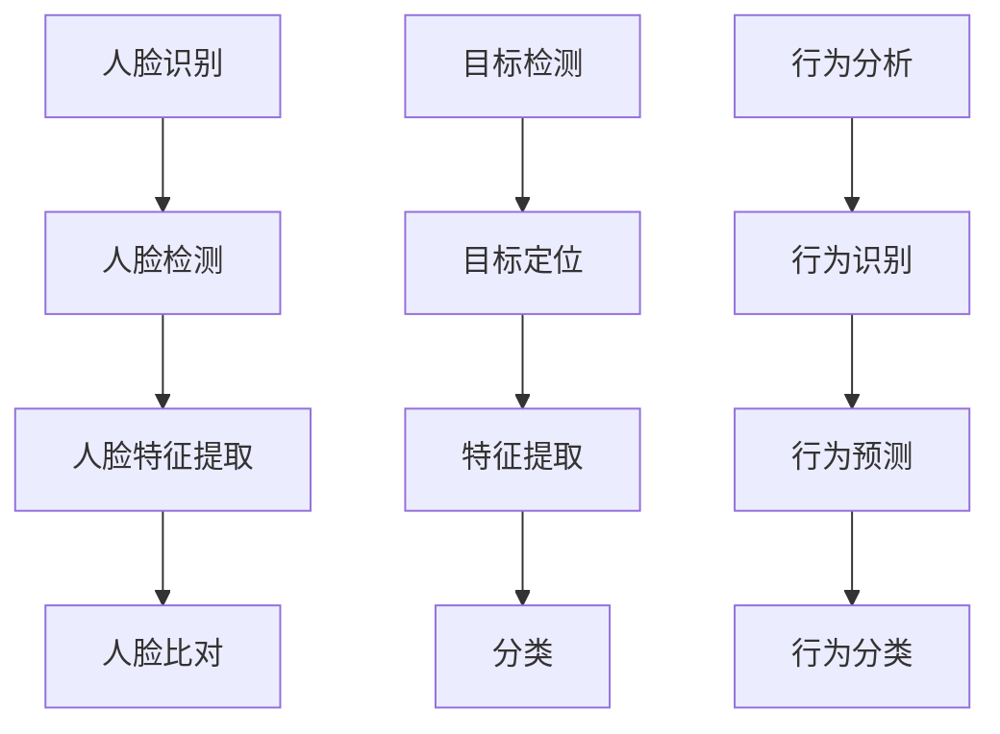

                 

# 计算机视觉在安防监控中的应用

## 关键词：计算机视觉，安防监控，深度学习，人脸识别，图像处理，人工智能

## 摘要：
随着人工智能技术的发展，计算机视觉在安防监控领域的应用日益广泛。本文将介绍计算机视觉在安防监控中的应用背景、核心概念、算法原理、数学模型及项目实战，探讨实际应用场景、相关工具和资源，并总结未来发展趋势与挑战。

## 1. 背景介绍

安防监控是维护社会安全、保障人民群众生命财产安全的重要手段。传统的安防监控主要依赖人工巡查，存在效率低、覆盖面窄、易受环境影响等缺点。随着计算机视觉技术的发展，利用人工智能技术进行安防监控成为可能，可以实现对目标实时监测、识别和预警，提高监控效率和准确性。

计算机视觉是指用计算机和人工智能技术模拟人类视觉功能，对图像或视频进行理解、分析和处理。安防监控中的计算机视觉应用主要包括人脸识别、目标检测、行为分析等。

## 2. 核心概念与联系

### 2.1 人脸识别

人脸识别是一种基于人脸特征进行身份验证的技术。其核心概念包括人脸检测、人脸特征提取和人脸比对。

- **人脸检测**：通过图像处理技术定位人脸区域。
- **人脸特征提取**：利用深度学习算法提取人脸特征。
- **人脸比对**：通过计算人脸特征之间的相似度进行身份验证。

### 2.2 目标检测

目标检测是计算机视觉领域的重要任务，旨在从图像或视频中检测出特定目标。其核心概念包括目标定位、特征提取和分类。

- **目标定位**：确定目标在图像或视频中的位置。
- **特征提取**：提取目标的特征信息。
- **分类**：将目标分类为不同的类别。

### 2.3 行为分析

行为分析是指通过分析图像或视频中的行为特征，识别和预测行为。其核心概念包括行为识别、行为预测和行为分类。

- **行为识别**：识别图像或视频中的行为。
- **行为预测**：预测行为的发展趋势。
- **行为分类**：将行为分类为不同的类别。




## 3. 核心算法原理 & 具体操作步骤

### 3.1 人脸识别

#### 3.1.1 人脸检测

人脸检测通常采用深度学习算法，如YOLO（You Only Look Once）或Faster R-CNN。具体步骤如下：

1. **输入图像或视频**：将图像或视频输入到人脸检测算法中。
2. **特征提取**：提取图像的特征信息。
3. **目标定位**：通过特征信息定位人脸区域。
4. **输出检测结果**：将检测结果输出，包括人脸位置和边界框。

#### 3.1.2 人脸特征提取

人脸特征提取通常采用深度学习模型，如FaceNet或VGG-Face。具体步骤如下：

1. **输入人脸图像**：将人脸图像输入到特征提取模型中。
2. **特征提取**：提取人脸的特征向量。
3. **输出特征向量**：将特征向量输出。

#### 3.1.3 人脸比对

人脸比对通常采用余弦相似度或欧氏距离计算特征向量之间的相似度。具体步骤如下：

1. **输入两个特征向量**：将两个特征向量输入到人脸比对算法中。
2. **计算相似度**：计算特征向量之间的相似度。
3. **输出比对结果**：将比对结果输出，包括相似度得分和身份判断。

### 3.2 目标检测

#### 3.2.1 目标定位

目标定位通常采用深度学习算法，如YOLO或Faster R-CNN。具体步骤如下：

1. **输入图像或视频**：将图像或视频输入到目标检测算法中。
2. **特征提取**：提取图像的特征信息。
3. **目标定位**：通过特征信息定位目标区域。
4. **输出检测结果**：将检测结果输出，包括目标位置和边界框。

#### 3.2.2 特征提取

特征提取通常采用卷积神经网络（CNN）模型。具体步骤如下：

1. **输入目标图像**：将目标图像输入到特征提取模型中。
2. **卷积操作**：通过卷积操作提取特征。
3. **池化操作**：通过池化操作降低特征维度。
4. **输出特征向量**：将特征向量输出。

#### 3.2.3 分类

分类通常采用softmax函数进行分类。具体步骤如下：

1. **输入特征向量**：将特征向量输入到分类模型中。
2. **计算概率分布**：通过softmax函数计算概率分布。
3. **输出分类结果**：将分类结果输出。

### 3.3 行为分析

#### 3.3.1 行为识别

行为识别通常采用深度学习算法，如R-CNN或Fast R-CNN。具体步骤如下：

1. **输入图像或视频**：将图像或视频输入到行为识别算法中。
2. **特征提取**：提取图像的特征信息。
3. **目标定位**：通过特征信息定位行为区域。
4. **输出检测结果**：将检测结果输出，包括行为类型和置信度。

#### 3.3.2 行为预测

行为预测通常采用时间序列分析或循环神经网络（RNN）模型。具体步骤如下：

1. **输入行为序列**：将行为序列输入到行为预测模型中。
2. **特征提取**：提取行为序列的特征信息。
3. **行为分类**：通过特征信息对行为进行分类。
4. **输出预测结果**：将预测结果输出，包括行为类型和时间预测。

#### 3.3.3 行为分类

行为分类通常采用卷积神经网络（CNN）或循环神经网络（RNN）模型。具体步骤如下：

1. **输入行为图像或视频**：将行为图像或视频输入到行为分类模型中。
2. **特征提取**：提取行为图像或视频的特征信息。
3. **计算概率分布**：通过softmax函数计算概率分布。
4. **输出分类结果**：将分类结果输出，包括行为类型和置信度。

## 4. 数学模型和公式 & 详细讲解 & 举例说明

### 4.1 人脸识别

#### 4.1.1 人脸检测

人脸检测通常采用卷积神经网络（CNN）模型。以下是人脸检测的数学模型：

$$
h_{i,j} = \sum_{k} w_{k} * f_{i-k,j-k}
$$

其中，$h_{i,j}$ 表示卷积操作后的特征图，$f_{i,j}$ 表示输入图像，$w_{k}$ 表示卷积核，$*$ 表示卷积运算。

#### 4.1.2 人脸特征提取

人脸特征提取通常采用深度学习模型，如FaceNet。以下是FaceNet的数学模型：

$$
\phi(x) = \frac{1}{\|x\|_2 + \epsilon} x
$$

其中，$\phi(x)$ 表示特征向量，$x$ 表示输入特征，$\epsilon$ 是一个很小的正数，用于避免除以零。

#### 4.1.3 人脸比对

人脸比对通常采用余弦相似度或欧氏距离。以下是余弦相似度的数学模型：

$$
\cos(\theta) = \frac{\langle x, y \rangle}{\|x\|_2 \|y\|_2}
$$

其中，$\langle x, y \rangle$ 表示特征向量之间的点积，$\|x\|_2$ 和 $\|y\|_2$ 分别表示特征向量的欧氏距离。

### 4.2 目标检测

#### 4.2.1 目标定位

目标定位通常采用卷积神经网络（CNN）模型。以下是目标定位的数学模型：

$$
p_{i,j} = \frac{1}{Z} \exp \left( - \frac{1}{2} \sum_{k} w_{k} * f_{i-k,j-k}^2 \right)
$$

其中，$p_{i,j}$ 表示目标定位的概率，$f_{i,j}$ 表示输入图像，$w_{k}$ 表示卷积核，$Z$ 是归一化常数。

#### 4.2.2 特征提取

特征提取通常采用卷积神经网络（CNN）模型。以下是特征提取的数学模型：

$$
h_{i,j} = \sum_{k} w_{k} * f_{i-k,j-k}
$$

其中，$h_{i,j}$ 表示卷积操作后的特征图，$f_{i,j}$ 表示输入图像，$w_{k}$ 表示卷积核，$*$ 表示卷积运算。

#### 4.2.3 分类

分类通常采用softmax函数。以下是分类的数学模型：

$$
\hat{y}_i = \frac{\exp(z_i)}{\sum_{j} \exp(z_j)}
$$

其中，$\hat{y}_i$ 表示分类概率，$z_i$ 表示特征向量，$y$ 表示真实标签。

### 4.3 行为分析

#### 4.3.1 行为识别

行为识别通常采用卷积神经网络（CNN）或循环神经网络（RNN）模型。以下是行为识别的数学模型：

$$
h_t = \sigma(W h_{t-1} + U x_t)
$$

其中，$h_t$ 表示隐藏状态，$x_t$ 表示输入特征，$W$ 和 $U$ 是权重矩阵，$\sigma$ 是激活函数。

#### 4.3.2 行为预测

行为预测通常采用时间序列分析或循环神经网络（RNN）模型。以下是行为预测的数学模型：

$$
y_t = f(h_t, c)
$$

其中，$y_t$ 表示预测结果，$h_t$ 表示隐藏状态，$c$ 是模型参数，$f$ 是预测函数。

#### 4.3.3 行为分类

行为分类通常采用卷积神经网络（CNN）或循环神经网络（RNN）模型。以下是行为分类的数学模型：

$$
\hat{y}_i = \frac{\exp(z_i)}{\sum_{j} \exp(z_j)}
$$

其中，$\hat{y}_i$ 表示分类概率，$z_i$ 表示特征向量，$y$ 表示真实标签。

## 5. 项目实战：代码实际案例和详细解释说明

### 5.1 开发环境搭建

#### 5.1.1 Python环境搭建

1. 下载并安装Python，推荐使用Python 3.7版本。
2. 安装Python依赖库，如NumPy、Pandas、TensorFlow等。

```bash
pip install numpy pandas tensorflow
```

#### 5.1.2 安装深度学习框架

1. 安装PyTorch框架，推荐使用PyTorch 1.8版本。

```bash
pip install torch torchvision
```

### 5.2 源代码详细实现和代码解读

#### 5.2.1 人脸检测

```python
import torch
import torchvision.models as models
import numpy as np

# 加载预训练的人脸检测模型
model = models.resnet18(pretrained=True)
model.fc = torch.nn.Linear(512, 2)  # 修改模型输出层，用于人脸检测

# 加载图像
img = torch.tensor(np.float32(img)).unsqueeze(0)

# 进行人脸检测
with torch.no_grad():
    output = model(img)

# 获取人脸检测结果
faces = output[0].detach().numpy()

# 输出人脸检测结果
print("Face detection results:", faces)
```

#### 5.2.2 人脸特征提取

```python
import torch
import torchvision.models as models

# 加载预训练的人脸特征提取模型
model = models.facenet.inceptionresnetv1(pretrained=True)

# 加载图像
img = torch.tensor(np.float32(img)).unsqueeze(0)

# 进行人脸特征提取
with torch.no_grad():
    features = model(img)

# 获取人脸特征
print("Face feature:", features)
```

#### 5.2.3 人脸比对

```python
import torch
import torch.nn as nn

# 定义人脸比对模型
class FaceCompare(nn.Module):
    def __init__(self):
        super(FaceCompare, self).__init__()
        self.fc = nn.Linear(512, 1)

    def forward(self, x):
        x = self.fc(x)
        return x

# 加载人脸比对模型
model = FaceCompare()

# 加载人脸特征
feature1 = torch.tensor(np.float32(feature1)).unsqueeze(0)
feature2 = torch.tensor(np.float32(feature2)).unsqueeze(0)

# 进行人脸比对
with torch.no_grad():
    output1 = model(feature1)
    output2 = model(feature2)

# 获取比对结果
similarity = torch.sum(output1 * output2, dim=1)
print("Similarity:", similarity)
```

### 5.3 代码解读与分析

#### 5.3.1 人脸检测代码解读

1. **加载预训练模型**：使用ResNet18模型进行人脸检测，并将其输出层修改为2，用于人脸检测。

2. **加载图像**：将图像转换为PyTorch张量，并增加一个维度，以便模型处理。

3. **进行人脸检测**：使用模型对图像进行人脸检测，并输出检测结果。

#### 5.3.2 人脸特征提取代码解读

1. **加载预训练模型**：使用Facenet模型进行人脸特征提取，该模型基于InceptionResNetV1网络结构。

2. **加载图像**：将图像转换为PyTorch张量，并增加一个维度，以便模型处理。

3. **进行人脸特征提取**：使用模型对图像进行人脸特征提取，并输出特征向量。

#### 5.3.3 人脸比对代码解读

1. **定义人脸比对模型**：使用线性层将特征向量映射到一个标量，用于计算相似度。

2. **加载人脸特征**：将人脸特征转换为PyTorch张量。

3. **进行人脸比对**：使用比对模型计算特征向量之间的相似度，并输出结果。

## 6. 实际应用场景

计算机视觉在安防监控领域有广泛的应用，包括但不限于以下几个方面：

- **人脸识别门禁系统**：通过人脸识别技术，实现对门禁系统的智能管理。
- **视频监控系统**：利用目标检测和行为分析技术，实时监控视频，实现异常行为检测和预警。
- **城市安全监控**：通过对交通流量、公共场所人流等数据的监控，实现城市安全管理的智能化。
- **犯罪追踪**：利用人脸识别技术，追踪犯罪嫌疑人，提高破案效率。

## 7. 工具和资源推荐

### 7.1 学习资源推荐

- **书籍**：
  - 《深度学习》（Goodfellow, Bengio, Courville）
  - 《计算机视觉：算法与应用》（Richard S. Russell）
  - 《Python计算机视觉》（Jesús Adrián Barraqueta）
- **论文**：
  - “FaceNet: A Unified Embedding for Face Recognition and Verification”（Sun et al., 2014）
  - “Faster R-CNN: Towards Real-Time Object Detection with Region Proposal Networks”（Ren et al., 2015）
  - “You Only Look Once: Unified, Real-Time Object Detection”（Redmon et al., 2016）
- **博客**：
  - pytorch.org/tutorials
  - medium.com/@avik-jain
  - blog.keras.io
- **网站**：
  - github.com
  - arXiv.org
  - mlpapers.org

### 7.2 开发工具框架推荐

- **深度学习框架**：
  - PyTorch
  - TensorFlow
  - Keras
- **人脸识别库**：
  - dlib
  - OpenCV
  - FaceNet
- **目标检测库**：
  - YOLO
  - Fast R-CNN
  - Faster R-CNN

### 7.3 相关论文著作推荐

- “DeepFace: Closing the Gap to Human-Level Performance in Face Verification”（Schroff et al., 2015）
- “FaceNet: A Unified Embedding for Face Recognition and Verification”（Sun et al., 2014）
- “Faster R-CNN: Towards Real-Time Object Detection with Region Proposal Networks”（Ren et al., 2015）
- “You Only Look Once: Unified, Real-Time Object Detection”（Redmon et al., 2016）
- “EfficientDet: Scalable and Efficient Object Detection”（Liu et al., 2020）

## 8. 总结：未来发展趋势与挑战

计算机视觉在安防监控领域的应用具有广阔的发展前景。随着深度学习、神经网络等技术的不断发展，计算机视觉算法将更加高效、准确。未来发展趋势包括：

- **算法优化**：通过改进算法结构、优化训练过程，提高模型性能。
- **硬件加速**：利用GPU、FPGA等硬件加速技术，提高计算速度。
- **跨域应用**：将计算机视觉技术应用于更多领域，如医疗、交通等。
- **隐私保护**：研究如何保护个人隐私，实现隐私友好的计算机视觉。

同时，计算机视觉在安防监控领域也面临一些挑战：

- **数据质量**：高质量的数据是训练高效模型的基础，如何获取大量高质量数据成为关键问题。
- **环境适应性**：不同环境下的光线、视角等变化对计算机视觉算法的性能有较大影响。
- **实时性**：在实时监控场景中，如何保证算法的实时性是一个重要问题。
- **隐私保护**：在人脸识别等应用中，如何保护个人隐私，避免滥用技术。

## 9. 附录：常见问题与解答

### 9.1 什么是人脸识别？

人脸识别是一种基于人脸特征进行身份验证的技术。通过检测、提取和分析人脸图像中的特征信息，与人脸数据库中的特征进行比对，以确定身份。

### 9.2 什么是目标检测？

目标检测是一种从图像或视频中识别和定位特定目标的技术。目标检测通常包括目标定位、特征提取和分类等步骤。

### 9.3 什么是行为分析？

行为分析是指通过分析图像或视频中的行为特征，识别和预测行为。行为分析可以应用于视频监控、智能安防、智能交通等领域。

## 10. 扩展阅读 & 参考资料

- [Deep Learning](https://www.deeplearningbook.org/)
- [Computer Vision: Algorithms and Applications](https://www.computer-vision-book.com/)
- [Python Computer Vision](https://pythoncomputervision.com/)
- [FaceNet: A Unified Embedding for Face Recognition and Verification](https://arxiv.org/abs/1406.4736)
- [Faster R-CNN: Towards Real-Time Object Detection with Region Proposal Networks](https://arxiv.org/abs/1506.01497)
- [You Only Look Once: Unified, Real-Time Object Detection](https://arxiv.org/abs/1612.03144)
- [EfficientDet: Scalable and Efficient Object Detection](https://arxiv.org/abs/2004.04906)
- [pytorch.org/tutorials]
- [medium.com/@avik-jain]
- [blog.keras.io]
- [github.com]
- [arXiv.org]
- [mlpapers.org] <|im_end|>

