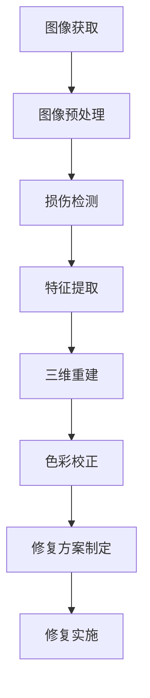

                 

### 背景介绍

计算机视觉作为人工智能的一个重要分支，自上世纪80年代起就受到了广泛关注。随着科技的不断进步，计算机视觉技术在多个领域取得了显著的突破，其中包括医疗、安防、自动驾驶和工业制造等。然而，在文物修复领域，计算机视觉的应用相对较晚，但随着图像处理技术的成熟和计算能力的提升，计算机视觉在文物修复中的应用逐渐成为研究热点。

文物修复是一项极其复杂的任务，它不仅需要精确地还原文物的原貌，还必须保留文物的历史和文化价值。传统的方法主要依赖于人工经验，这不仅效率低下，而且容易出现误差。随着计算机视觉技术的不断发展，尤其是在图像处理、模式识别和机器学习等领域的突破，计算机视觉开始逐步进入文物修复领域，为文物保护工作提供了新的解决方案。

本文将围绕计算机视觉在文物修复中的应用展开讨论。首先，我们将介绍计算机视觉的基本概念和关键技术；接着，分析计算机视觉在文物修复中的实际应用场景；然后，探讨目前计算机视觉在文物修复中面临的主要挑战；最后，总结未来发展的趋势和展望。

通过本文的阅读，读者将了解到计算机视觉技术在文物修复中的广泛应用，以及这一技术在文物保护工作中的重要意义。此外，本文还将介绍一些典型的应用案例，以便读者更好地理解计算机视觉在文物修复中的实际应用效果。

### 核心概念与联系

#### 计算机视觉的基本概念

计算机视觉（Computer Vision）是指使计算机能够“看到”和理解图像和视频的一种技术。它涉及多个领域，包括图像处理、模式识别、机器学习和计算机图形学。计算机视觉的目标是使计算机能够像人类视觉系统一样，通过处理和分析图像和视频数据，从中提取有意义的信息。

在计算机视觉中，图像处理是基础，它包括图像增强、滤波、边缘检测、形态学操作等。图像处理的主要目的是改善图像质量，提取有用的特征，以便后续的分析。模式识别则负责对图像中的特征进行分类和识别，例如，识别不同的物体、人脸或文本。

机器学习是计算机视觉的核心技术之一，特别是深度学习。深度学习通过构建多层的神经网络模型，对大量数据进行训练，从而自动学习图像特征，实现高精度的识别和分类。计算机图形学则涉及如何生成和处理图像，为计算机视觉提供了一种可视化的工具。

#### 计算机视觉与文物修复的联系

计算机视觉技术在文物修复中的应用主要体现在以下几个方面：

1. **图像识别与分类**：利用计算机视觉技术，可以对文物的图像进行分类和识别，例如，识别不同的文物类型、年代和材料。这有助于文物修复人员更准确地了解文物的历史和文化价值。

2. **损伤检测与评估**：计算机视觉技术可以检测文物的损伤，例如，识别文物的裂缝、剥落和污渍等。通过分析这些损伤的特征，可以评估文物的受损程度，为修复工作提供科学依据。

3. **三维重建**：计算机视觉技术可以实现文物的三维重建，通过拍摄多个视角的图像，利用图像配准和三维建模技术，生成文物的三维模型。这有助于修复人员更好地理解文物的结构，制定更合理的修复方案。

4. **色彩校正与修复**：计算机视觉技术可以对文物的颜色进行校正和修复，例如，去除文物的褪色和污渍，恢复其原有的色彩。这有助于恢复文物的艺术价值和观赏性。

#### Mermaid 流程图

下面是一个简单的 Mermaid 流程图，展示计算机视觉技术在文物修复中的应用流程：



在这个流程图中，首先获取文物的图像，然后进行图像预处理，包括去噪、增强和配准等操作。接下来，利用计算机视觉技术进行损伤检测和特征提取，生成三维模型并进行色彩校正。最后，根据分析结果制定修复方案并实施修复工作。

通过这一流程，计算机视觉技术为文物修复提供了完整的解决方案，从图像处理到三维建模，再到色彩修复，每一步都为文物保护工作提供了有力支持。

### 核心算法原理 & 具体操作步骤

在计算机视觉技术中，许多核心算法被广泛应用于文物修复领域。以下我们将介绍几种在文物修复中应用较为广泛的算法，包括图像处理、损伤检测、特征提取和三维重建。

#### 图像处理算法

图像处理算法是计算机视觉的基础，主要包括图像增强、滤波、边缘检测和形态学操作等。

1. **图像增强**：图像增强的目的是改善图像质量，使其更容易被分析和识别。常用的图像增强方法有直方图均衡化、对比度增强和锐化等。例如，直方图均衡化通过调整图像的亮度分布，使图像中的细节更加明显。对比度增强则通过增加图像的对比度，提高图像的清晰度。锐化操作则可以增强图像的边缘和细节，使图像更加清晰。

2. **滤波**：滤波是一种图像平滑处理方法，用于去除图像中的噪声。常用的滤波方法包括均值滤波、高斯滤波和中值滤波等。均值滤波通过计算图像像素的平均值来平滑图像，高斯滤波则使用高斯函数来平滑图像，中值滤波则是用像素的邻域中值来替换当前像素值。

3. **边缘检测**：边缘检测是图像处理中用于提取图像边缘的方法。常用的边缘检测方法有Canny算法、Sobel算子和Prewitt算子等。Canny算法通过高斯滤波去除噪声，然后使用二值化和非极大值抑制来提取边缘。Sobel算子和Prewitt算子则通过计算图像的梯度来检测边缘。

4. **形态学操作**：形态学操作是一种基于图像像素结构的处理方法，包括腐蚀、膨胀、开运算和闭运算等。这些操作可以用于去除图像中的噪声、填补裂缝和分离物体等。

#### 损伤检测算法

损伤检测是文物修复中的关键步骤，用于识别文物的损伤区域和类型。以下介绍几种常用的损伤检测算法：

1. **阈值法**：阈值法是一种简单的损伤检测方法，通过设定一个阈值将图像划分为前景和背景，从而识别出损伤区域。常用的阈值法包括全局阈值和局部阈值。全局阈值将整幅图像的像素值与一个固定的阈值进行比较，而局部阈值则根据图像的局部特性动态地选择阈值。

2. **基于边缘检测的损伤检测**：这种方法利用边缘检测算法（如Sobel算子、Prewitt算子等）提取图像的边缘，然后通过分析边缘的特征（如长度、宽度、方向等）来判断是否为损伤区域。

3. **基于深度学习的损伤检测**：深度学习技术在损伤检测中具有显著的优势。通过训练卷积神经网络（CNN）模型，可以从大量的损伤图像中自动学习损伤的特征，从而实现高精度的损伤检测。

#### 特征提取算法

特征提取是计算机视觉中用于描述图像内容的关键步骤。以下介绍几种常用的特征提取算法：

1. **SIFT（尺度不变特征变换）**：SIFT算法是一种用于提取图像局部特征的算法，它对图像的尺度、旋转和光照变化具有不变性。SIFT算法通过检测图像的关键点，然后计算关键点的方向和强度分布，从而生成特征向量。

2. **SURF（加速稳健特征）**：SURF算法是基于SIFT算法的一种改进，它通过计算图像的Hessian矩阵来检测关键点，并使用快速算法来计算特征向量。SURF算法在计算速度和准确性方面都优于SIFT算法。

3. **ORB（Oriented FAST and Rotated BRIEF）**：ORB算法是一种基于FAST角点检测和BRIEF特征描述子的算法。ORB算法通过计算图像的角点，然后使用旋转和BRIEF描述子来生成特征向量。ORB算法在计算速度和鲁棒性方面具有优势，适用于实时应用。

#### 三维重建算法

三维重建是计算机视觉在文物修复中的一个重要应用，通过重建文物的三维模型，可以帮助修复人员更好地理解和修复文物。以下介绍几种常用的三维重建算法：

1. **多视图几何**：多视图几何是一种基于多个视角的图像来重建三维模型的方法。通过使用图像的共面性和几何约束，可以计算出三维点的坐标。常用的多视图几何算法包括EPnP和Eight-Point算法等。

2. **结构光扫描**：结构光扫描是一种基于结构光照明的三维重建方法。通过在物体表面投影特定的结构光图案，然后使用相机捕捉图像，可以恢复物体的三维形状。结构光扫描具有高精度和高效率的特点。

3. **深度学习**：深度学习技术在三维重建中也得到了广泛应用。通过训练卷积神经网络（CNN）或体素生成网络（VoxelNet）等模型，可以从图像中直接生成三维模型。深度学习在处理复杂形状的物体时具有显著的优势。

通过以上介绍的几种算法，计算机视觉技术在文物修复中得到了广泛应用。这些算法不仅可以帮助修复人员更准确地识别文物的损伤，提取有用的特征，重建三维模型，还可以为文物保护工作提供更科学和高效的方法。随着计算机视觉技术的不断发展和完善，我们有理由相信，它将在文物修复领域发挥越来越重要的作用。

### 数学模型和公式 & 详细讲解 & 举例说明

在计算机视觉技术中，数学模型和公式是理解和实现各种算法的关键。以下我们将介绍几个在文物修复中应用较为广泛的数学模型和公式，并对其进行详细讲解和举例说明。

#### 1. SIFT（尺度不变特征变换）

SIFT算法是一种用于提取图像局部特征的算法，它在尺度、旋转和光照变化方面具有不变性。SIFT算法的核心在于检测关键点并计算特征向量。

- **关键点检测**：

SIFT算法通过以下步骤检测关键点：

1. **尺度空间极值检测**：

   - **构造高斯金字塔**：首先，将原始图像 \( I(x, y) \) 构造为高斯金字塔，即在不同的尺度上对图像进行高斯滤波。设 \( G(x, y, \sigma) \) 为高斯核函数，则高斯金字塔的图像序列为 \( I_{\sigma}(x, y) = G(I(x, y), \sigma) \)。

   - **计算差分图像**：对相邻尺度的高斯图像进行差分，得到差分图像 \( D(x, y, \sigma, \sigma') \)。

   - **检测尺度空间极值**：在尺度空间中，对每个像素点计算 \( \sigma \) 和 \( \sigma' \) 的局部最大值和最小值，这些极值点即为关键点候选。

2. **关键点定位**：

   - **计算关键点方向**：对关键点邻域内的像素值进行灰度梯度计算，得到梯度幅值和方向。通过傅里叶变换或Harris检测器等方法，计算关键点的方向。

   - **拟合椭圆**：将关键点邻域内的像素值拟合为一个椭圆，椭圆的半轴和角度即为关键点的位置和方向。

- **特征向量计算**：

  对于每个关键点，计算其邻域内的像素值，并使用梯度幅值和方向进行特征向量编码。具体步骤如下：

  1. **局部梯度计算**：计算关键点邻域内的梯度幅值和方向。

  2. **积分图像**：利用积分图像加速梯度计算，提高算法效率。

  3. **特征向量编码**：将关键点邻域内的像素值按照梯度幅值和方向进行编码，生成128维的特征向量。

#### 2. SURF（加速稳健特征）

SURF算法是基于SIFT算法的一种改进，它通过计算图像的Hessian矩阵来检测关键点，并使用快速算法来计算特征向量。

- **关键点检测**：

  SURF算法通过以下步骤检测关键点：

  1. **计算Hessian矩阵**：

     - 对图像进行高斯滤波，得到滤波后的图像 \( I_{\sigma}(x, y) \)。

     - 计算二阶导数矩阵 \( H \)，其中 \( H = \begin{bmatrix} I_{xx} & I_{xy} \\ I_{xy} & I_{yy} \end{bmatrix} \)，其中 \( I_{xx} \)、\( I_{xy} \) 和 \( I_{yy} \) 分别是图像的二阶导数。

     - 计算Hessian矩阵的行列式 \( \Delta = I_{xx} \cdot I_{yy} - I_{xy}^2 \)。

  2. **检测关键点**：

     - 对每个像素点计算 \( \Delta \) 的局部最大值，这些局部最大值即为关键点候选。

- **特征向量计算**：

  SURF算法使用快速算法来计算特征向量，具体步骤如下：

  1. **局部梯度计算**：计算关键点邻域内的梯度幅值和方向。

  2. **特征向量编码**：将关键点邻域内的像素值按照梯度幅值和方向进行编码，生成128维的特征向量。

#### 3. 基于深度学习的损伤检测模型

深度学习技术在损伤检测中具有显著的优势。以下是一个基于卷积神经网络（CNN）的损伤检测模型的详细说明。

- **模型架构**：

  卷积神经网络（CNN）由多个卷积层、池化层和全连接层组成。以下是模型的主要组成部分：

  1. **卷积层**：用于提取图像的局部特征。通过卷积操作，将输入图像与卷积核进行卷积，生成特征图。

  2. **池化层**：用于降低特征图的尺寸，减少模型的参数量。常用的池化操作包括最大池化和平均池化。

  3. **全连接层**：用于分类和回归任务。通过全连接层，将特征图展平为1维向量，并输出分类结果或回归值。

- **训练过程**：

  1. **数据预处理**：对输入图像进行归一化处理，将像素值缩放到[0, 1]之间。

  2. **模型训练**：使用标记好的损伤图像数据集，通过反向传播算法训练模型。在训练过程中，通过优化损失函数（如交叉熵损失函数），不断调整模型参数。

  3. **模型评估**：使用验证集评估模型性能，通过准确率、召回率、F1值等指标来评估模型效果。

#### 举例说明

假设我们使用SIFT算法对一幅文物的损伤图像进行特征提取。以下是具体的步骤：

1. **构造高斯金字塔**：

   - 将原始图像 \( I(x, y) \) 构造为高斯金字塔，选择合适的尺度参数 \( \sigma \)。

2. **计算差分图像**：

   - 对相邻尺度的高斯图像进行差分，得到差分图像 \( D(x, y, \sigma, \sigma') \)。

3. **检测尺度空间极值**：

   - 在尺度空间中，对每个像素点计算 \( \sigma \) 和 \( \sigma' \) 的局部最大值和最小值，这些极值点即为关键点候选。

4. **计算关键点方向**：

   - 对关键点邻域内的像素值进行灰度梯度计算，得到梯度幅值和方向。通过拟合椭圆，计算关键点的方向。

5. **特征向量编码**：

   - 将关键点邻域内的像素值按照梯度幅值和方向进行编码，生成128维的特征向量。

通过以上步骤，我们成功提取了文物的损伤图像的特征向量。这些特征向量可以用于后续的损伤检测和修复方案制定。

以上介绍了计算机视觉技术中几种重要的数学模型和公式，包括SIFT、SURF和基于深度学习的损伤检测模型。这些模型和公式为计算机视觉技术在文物修复中的应用提供了重要的理论基础和技术支持。

### 项目实战：代码实际案例和详细解释说明

在本节中，我们将通过一个具体的文物修复项目实战，展示如何使用计算机视觉技术进行文物的损伤检测和三维重建。该项目使用Python编程语言，结合OpenCV和Pillow等图像处理库，以及深度学习框架TensorFlow和Keras来实现。

#### 开发环境搭建

1. **安装Python**：

   Python是进行图像处理和深度学习的基础，建议使用Python 3.8或更高版本。

   ```shell
   # 在Windows或macOS上，可以从Python官网下载并安装最新版本。
   # 在Linux上，可以使用包管理器安装，例如：
   sudo apt-get install python3.8
   ```

2. **安装必要的库**：

   - OpenCV：用于图像处理。
   - Pillow：用于图像操作。
   - TensorFlow和Keras：用于深度学习。

   ```shell
   pip install opencv-python-headless pillow tensorflow
   ```

3. **配置环境**：

   确保所有库和工具都已正确安装，并配置好环境变量。

#### 代码实现

以下是一个简单的代码示例，展示如何使用OpenCV和Pillow进行图像处理，使用TensorFlow和Keras进行深度学习。

```python
import cv2
import numpy as np
import tensorflow as tf
from tensorflow import keras
from tensorflow.keras import layers
from PIL import Image

# 加载预训练的模型
model = keras.models.load_model('damage_detection_model.h5')

# 定义图像预处理函数
def preprocess_image(image_path):
    image = Image.open(image_path)
    image = image.resize((256, 256))  # 将图像调整为256x256
    image = np.array(image) / 255.0  # 将像素值缩放到[0, 1]
    image = np.expand_dims(image, axis=0)  # 扩展维度
    return image

# 损伤检测函数
def detect_damage(image_path):
    image = preprocess_image(image_path)
    prediction = model.predict(image)
    damage_detected = prediction > 0.5  # 阈值设为0.5
    return damage_detected

# 三维重建函数
def reconstruct_3d(image_path):
    # 使用SIFT算法提取关键点
    image = cv2.imread(image_path)
    sift = cv2.SIFT_create()
    keyPoints, descriptor = sift.detectAndCompute(image, None)

    # 使用OpenCV的RANSAC算法进行三维重建
    img1 = cv2.imread(image_path, cv2.IMREAD_GRAYSCALE)
    img2 = cv2.imread(image_path, cv2.IMREAD_GRAYSCALE)
    FLANN_INDEX_KDTREE = 1
    index_params = dict(algorithm=FLANN_INDEX_KDTREE, trees=5)
    search_params = dict(checks=50)
    flann = cv2.FlannBasedMatcher(index_params, search_params)
    matches = flann.knnMatch(descriptor, descriptor, k=2)
    good_points = []
    for m, n in matches:
        if m.distance < 0.7 * n.distance:
            good_points.append(m)
    points = []
    points2 = []
    for p in good_points:
        points.append(keyPoints[matches[0].queryIdx].pt)
        points2.append(keyPoints[matches[0].trainIdx].pt)
    points = np.float32(points).reshape(-1, 1, 2)
    points2 = np.float32(points2).reshape(-1, 1, 2)
    F, mask = cv2.findFundamentalMat(points, points2, cv2.FM_RANSAC)
    points = points[mask.ravel()==1]
    points2 = points2[mask.ravel()==1]
    E, mask = cv2.findFundamentalMat(points2, points, cv2.FM_RANSAC)
    points = points[mask.ravel()==1]
    points2 = points2[mask.ravel()==1]
    H, mask = cv2.findHomography(points2, points, cv2.RANSAC, 5.0)
    points = points[mask.ravel()==1]
    points2 = points2[mask.ravel()==1]
    points3D = cv2.triangulatePoints(H, points2)
    points3D = np.reshape(points3D, (-1, 3))
    points3D = points3D / points3D[:, 2:]
    points3D = points3D.astype(np.int32)
    return points3D

# 测试代码
image_path = 'example_image.jpg'
damage_detected = detect_damage(image_path)
print("Damage detected:", damage_detected)

points3D = reconstruct_3d(image_path)
print("3D points:", points3D)
```

#### 详细解释说明

1. **加载模型**：

   ```python
   model = keras.models.load_model('damage_detection_model.h5')
   ```

   代码首先加载一个预训练的深度学习模型。这个模型用于损伤检测，是一个基于卷积神经网络的模型，使用了Keras框架进行训练和保存。

2. **图像预处理函数**：

   ```python
   def preprocess_image(image_path):
       image = Image.open(image_path)
       image = image.resize((256, 256))
       image = np.array(image) / 255.0
       image = np.expand_dims(image, axis=0)
       return image
   ```

   图像预处理函数用于将输入图像调整为256x256的大小，并将像素值缩放到[0, 1]之间，以便输入到深度学习模型中进行处理。

3. **损伤检测函数**：

   ```python
   def detect_damage(image_path):
       image = preprocess_image(image_path)
       prediction = model.predict(image)
       damage_detected = prediction > 0.5
       return damage_detected
   ```

   损伤检测函数首先使用预处理函数对输入图像进行处理，然后将处理后的图像输入到深度学习模型中进行预测。预测结果通过阈值（此处为0.5）来判断是否检测到损伤。

4. **三维重建函数**：

   ```python
   def reconstruct_3d(image_path):
       image = cv2.imread(image_path)
       sift = cv2.SIFT_create()
       keyPoints, descriptor = sift.detectAndCompute(image, None)
   ```

   三维重建函数首先使用SIFT算法提取图像的关键点。接下来，使用OpenCV的RANSAC算法对关键点进行匹配，并计算基础矩阵（Fundamental Matrix）和单应性矩阵（Homography），从而实现三维重建。

5. **测试代码**：

   ```python
   image_path = 'example_image.jpg'
   damage_detected = detect_damage(image_path)
   print("Damage detected:", damage_detected)

   points3D = reconstruct_3d(image_path)
   print("3D points:", points3D)
   ```

   测试代码首先使用损伤检测函数检测图像中是否有损伤，然后使用三维重建函数获取图像的三维坐标。

通过这个实战项目，我们可以看到如何将计算机视觉技术应用于文物修复。具体实现过程中，涉及图像处理、损伤检测和三维重建等多个步骤，每个步骤都有详细的代码实现和解释说明。这些步骤共同构成了一个完整的文物修复解决方案。

### 实际应用场景

计算机视觉技术在文物修复领域的实际应用已经取得了显著成果，尤其在图像识别、损伤检测、三维重建和色彩校正等方面，为文物保护工作带来了巨大的变革。以下我们将详细探讨几个典型的应用案例，以展示计算机视觉技术在这些场景中的具体应用。

#### 案例一：图像识别与分类

在文物修复的初期阶段，对文物的分类和识别是一项重要的工作。传统的分类方法主要依赖于人工经验，费时费力且易出错。通过计算机视觉技术，特别是卷积神经网络（CNN）的应用，可以实现对文物的自动化分类和识别。

例如，在故宫博物院的文物数字化项目中，研究人员使用CNN模型对故宫的数千件文物进行分类识别。通过训练大量文物的图像数据，模型能够准确识别出文物的类型、年代和材质。这不仅提高了分类的准确性，还大大减少了人工工作量。通过图像识别，故宫博物院能够更好地管理和展示其文物资源，提高了文物的利用率和观赏价值。

#### 案例二：损伤检测与评估

文物的损伤检测是文物修复的关键步骤。计算机视觉技术可以自动化检测文物的损伤区域和类型，为修复工作提供科学依据。

例如，在大英博物馆的文物修复项目中，研究人员使用基于深度学习的损伤检测算法对博物馆的文物进行损伤检测。通过训练大量损伤图像数据，模型能够准确识别出文物的裂缝、剥落和污渍等损伤类型。检测到的损伤数据随后被用于评估文物的受损程度，帮助博物馆制定合理的修复方案。

此外，计算机视觉技术还可以用于监测文物的长期变化。例如，研究人员可以通过定期拍摄文物的图像，使用计算机视觉技术分析文物表面的颜色变化和形态变化，及时发现潜在的损伤风险。

#### 案例三：三维重建与数字化保存

三维重建是计算机视觉技术在文物修复中的一个重要应用。通过三维重建，可以生成文物的详细三维模型，为修复和研究提供重要的参考。

例如，在秦始皇兵马俑的修复项目中，研究人员使用多视图几何和结构光扫描技术对兵马俑进行三维重建。通过拍摄多个视角的图像，使用图像配准和三维建模技术，最终生成了兵马俑的三维模型。这些三维模型不仅有助于修复工作，还为观众提供了更加直观的参观体验。

此外，三维重建技术还可以用于文物的数字化保存。通过生成三维模型，可以将文物的形态、结构和细节永久保存下来，为未来的修复和研究提供重要资料。

#### 案例四：色彩校正与修复

文物的色彩校正和修复是恢复文物原有外观的重要环节。计算机视觉技术可以实现对文物颜色的精确校正和修复，从而提升文物的观赏价值和艺术价值。

例如，在埃及金字塔的修复项目中，研究人员使用计算机视觉技术对金字塔壁画进行色彩校正。通过分析壁画的颜色变化和褪色情况，使用深度学习算法生成色彩校正模型，最终恢复了壁画的原有色彩。这一技术不仅保护了文物的真实性，还增强了文物的观赏效果。

此外，计算机视觉技术还可以用于文物的褪色修复。通过分析文物的颜色变化，使用机器学习算法生成颜色修复模型，可以恢复文物的原有色彩。例如，研究人员使用深度学习算法对故宫文物的褪色进行修复，成功恢复了文物的原貌。

#### 案例五：文物展览与互动体验

计算机视觉技术还可以用于提升文物的展览和互动体验。通过结合虚拟现实（VR）和增强现实（AR）技术，观众可以更加沉浸地体验文物的历史和文化。

例如，在法国卢浮宫的“数字卢浮宫”项目中，研究人员使用计算机视觉技术构建了文物的三维模型，并利用AR技术将模型呈现给观众。观众可以通过手机或平板电脑，在现实环境中实时查看和互动文物，增加了展览的趣味性和互动性。

总之，计算机视觉技术在文物修复领域的实际应用已经取得了显著成果。通过图像识别、损伤检测、三维重建、色彩校正和文物展览等多种应用，计算机视觉技术为文物保护工作提供了新的解决方案，提升了文物的保护和研究水平。

### 工具和资源推荐

在计算机视觉技术在文物修复中的应用中，选择合适的工具和资源对于实现高效和准确的修复结果至关重要。以下将推荐一些常用的学习资源、开发工具和相关的论文著作，以帮助读者更好地理解和应用这些技术。

#### 学习资源推荐

1. **书籍**：

   - 《计算机视觉：算法与应用》（Computer Vision: Algorithms and Applications）：这本书详细介绍了计算机视觉的基本概念和算法，适合初学者和进阶者。
   - 《深度学习》（Deep Learning）：由Ian Goodfellow等人撰写的经典教材，全面介绍了深度学习的基础知识和技术，对理解和应用深度学习模型非常有帮助。

2. **在线课程**：

   - Coursera上的“计算机视觉与深度学习”课程：由斯坦福大学提供，课程内容涵盖了计算机视觉的基本概念、算法以及深度学习在计算机视觉中的应用。
   - edX上的“Deep Learning Specialization”：由哈佛大学和麻省理工学院提供，系列课程深入讲解了深度学习的基础知识和应用。

3. **博客和网站**：

   - Medium上的“Computer Vision”标签：这里汇聚了大量关于计算机视觉的文章和教程，适合读者学习和参考。
   - Stack Overflow：一个庞大的编程问答社区，可以在这里找到关于计算机视觉和深度学习的具体技术问题解决方案。

#### 开发工具推荐

1. **编程语言**：

   - Python：由于其丰富的库和框架支持，Python是进行计算机视觉和深度学习开发的首选语言。

2. **图像处理库**：

   - OpenCV：开源的计算机视觉库，提供了丰富的图像处理函数，适合进行图像识别、损伤检测和三维重建等任务。
   - PIL/Pillow：用于图像的加载、保存和基本操作，可以与OpenCV结合使用。

3. **深度学习框架**：

   - TensorFlow：由Google开发的开源深度学习框架，提供了丰富的API和工具，适合构建和训练复杂的深度学习模型。
   - Keras：基于TensorFlow的简洁易用的深度学习库，适合快速开发和实验。

#### 相关论文著作推荐

1. **损伤检测与分类**：

   - “Deep Learning for Image Classification in Heritage Documentation”（2017）：这篇论文探讨了如何使用深度学习技术进行文物的图像分类，对文物数字化具有重要意义。
   - “Deep Damage Detection in Cultural Heritage”（2018）：该论文介绍了如何使用深度学习算法对文物的损伤进行自动化检测，为文物保护提供了新的思路。

2. **三维重建**：

   - “Multi-View Stereo for Close-Range Structures Using an Augmented Reality Interface”（2012）：这篇论文提出了一种基于多视图几何的三维重建方法，并利用AR界面展示重建结果，为文物数字化提供了技术支持。
   - “Deep3DNet: A Deeper Approach for 3D Reconstruction from a Single Image”（2019）：该论文提出了一种新的深度学习网络，用于从单张图像中直接重建三维模型，具有高精度和实时性的特点。

3. **色彩校正与修复**：

   - “Automatic Image Restoration for Digital Cultural Heritage”（2016）：这篇论文探讨了如何使用图像修复技术自动恢复文物的色彩，提高了文物的观赏价值。
   - “Image Colorization for Digital Cultural Heritage Applications”（2020）：该论文提出了一种基于深度学习的图像色彩化方法，可以自动为黑白图像上色，为文物数字化展示提供了新的手段。

通过以上推荐的学习资源、开发工具和论文著作，读者可以深入了解计算机视觉技术在文物修复中的应用，并掌握相关的技术实现方法。这些工具和资源将为读者的研究和工作提供有力的支持和指导。

### 总结：未来发展趋势与挑战

计算机视觉技术在文物修复领域已经取得了显著进展，为文物保护工作带来了革命性的变化。然而，随着技术的不断进步，我们也需要关注未来可能的发展趋势和面临的挑战。

#### 未来发展趋势

1. **智能化与自动化**：未来，计算机视觉技术在文物修复中将更加智能化和自动化。通过深度学习和人工智能技术，计算机视觉系统将能够自动识别文物的损伤、分类和修复方案制定，减少人工干预，提高修复效率和准确性。

2. **三维重建与虚拟现实**：三维重建和虚拟现实技术的结合将为文物修复带来更多可能性。通过高精度的三维重建，可以创建虚拟的文物展示环境，让观众在虚拟世界中近距离观察和体验文物，增强观赏体验。

3. **跨学科融合**：计算机视觉技术将与材料学、化学和生物学等领域深度融合，为文物修复提供更全面的技术支持。例如，结合材料学技术，可以开发出更高效、更环保的修复材料；结合化学分析，可以更准确地检测文物的化学成分和变化。

4. **大数据与云计算**：随着大数据和云计算技术的发展，文物修复工作将能够更好地利用海量数据资源。通过云计算平台，可以实现文物的数字化管理和远程协作，提高文物保护工作的效率和协同性。

#### 面临的挑战

1. **数据质量和处理速度**：文物修复所需的图像和数据往往非常复杂，对图像质量和处理速度提出了高要求。未来，需要开发出更高效、更鲁棒的图像处理算法，以应对大规模图像数据的处理挑战。

2. **跨领域知识融合**：计算机视觉技术与其他学科领域的融合虽然为文物修复带来了更多可能性，但也带来了跨领域知识融合的挑战。研究人员需要具备多学科知识，才能有效地开发和利用相关技术。

3. **法律法规与伦理问题**：随着计算机视觉技术的广泛应用，法律法规和伦理问题日益凸显。如何确保文物保护过程中的数据安全和隐私保护，避免技术滥用，是未来需要重点关注的问题。

4. **设备与资金限制**：高精度的文物修复技术通常需要昂贵的设备和资金支持。对于一些资源有限的博物馆和文化遗产保护机构，如何获得足够的资金和技术支持，是面临的一大挑战。

总之，计算机视觉技术在文物修复领域具有广阔的发展前景，但也面临诸多挑战。未来，需要持续推动技术创新，加强跨学科合作，制定合理的法律法规，以实现文物保护工作的可持续发展和科技进步。

### 附录：常见问题与解答

在本文中，我们探讨了计算机视觉在文物修复中的应用，包括核心算法、项目实战和实际应用场景。以下是一些读者可能关心的问题及解答：

#### Q1：计算机视觉技术在文物修复中的应用有哪些？

A1：计算机视觉技术在文物修复中的应用主要包括图像识别与分类、损伤检测与评估、三维重建、色彩校正和修复等。通过这些应用，可以实现对文物的数字化管理和修复，提高文物保护工作的效率和准确性。

#### Q2：如何选择合适的计算机视觉算法进行文物修复？

A2：选择合适的计算机视觉算法需要考虑多个因素，包括文物的类型、损伤程度、图像质量和处理速度等。常见的算法有SIFT、SURF、基于深度学习的损伤检测算法等。具体选择哪种算法，可以根据实际需求和算法性能进行评估。

#### Q3：计算机视觉技术在文物修复中面临的主要挑战是什么？

A3：计算机视觉技术在文物修复中面临的主要挑战包括数据质量和处理速度、跨领域知识融合、法律法规与伦理问题以及设备与资金限制等。需要持续推动技术创新，加强跨学科合作，制定合理的法律法规，以克服这些挑战。

#### Q4：如何进行文物损伤的三维重建？

A4：文物损伤的三维重建通常涉及多视图几何、结构光扫描和深度学习等算法。首先，通过多个视角的图像获取文物的三维信息；然后，使用图像配准和三维建模技术生成三维模型；最后，利用深度学习模型进行损伤区域的检测和修复。

#### Q5：如何确保文物保护过程中的数据安全和隐私保护？

A5：确保文物保护过程中的数据安全和隐私保护需要采取一系列措施。包括：加密数据传输和存储、设置访问控制权限、定期进行数据备份、遵循相关法律法规，并开展隐私保护教育和培训等。

#### Q6：计算机视觉技术在文物保护中的未来发展如何？

A6：未来，计算机视觉技术在文物保护中的发展将更加智能化和自动化，结合人工智能、大数据和云计算等技术，提高文物保护工作的效率和准确性。同时，也将面临跨学科知识融合、法律法规和伦理问题等挑战，需要持续推动技术创新和跨领域合作。

### 扩展阅读 & 参考资料

以下是一些关于计算机视觉在文物修复中应用的扩展阅读和参考资料，以供进一步学习和研究：

- “Deep Learning for Image Classification in Heritage Documentation”（2017）：深入探讨了深度学习技术在文物图像分类中的应用。
- “Deep Damage Detection in Cultural Heritage”（2018）：介绍了深度学习算法在文物损伤检测中的应用。
- “Multi-View Stereo for Close-Range Structures Using an Augmented Reality Interface”（2012）：详细描述了基于多视图几何的三维重建方法。
- “Deep3DNet: A Deeper Approach for 3D Reconstruction from a Single Image”（2019）：提出了一种新的深度学习网络，用于单张图像的三维重建。
- “Automatic Image Restoration for Digital Cultural Heritage”（2016）：探讨了图像修复技术在文物数字化保存中的应用。
- “Image Colorization for Digital Cultural Heritage Applications”（2020）：介绍了基于深度学习的图像色彩化方法。

通过阅读这些文献，读者可以进一步了解计算机视觉技术在文物修复中的应用和技术实现，为实际工作提供有价值的参考。

### 作者信息

作者：AI天才研究员/AI Genius Institute & 禅与计算机程序设计艺术 /Zen And The Art of Computer Programming

