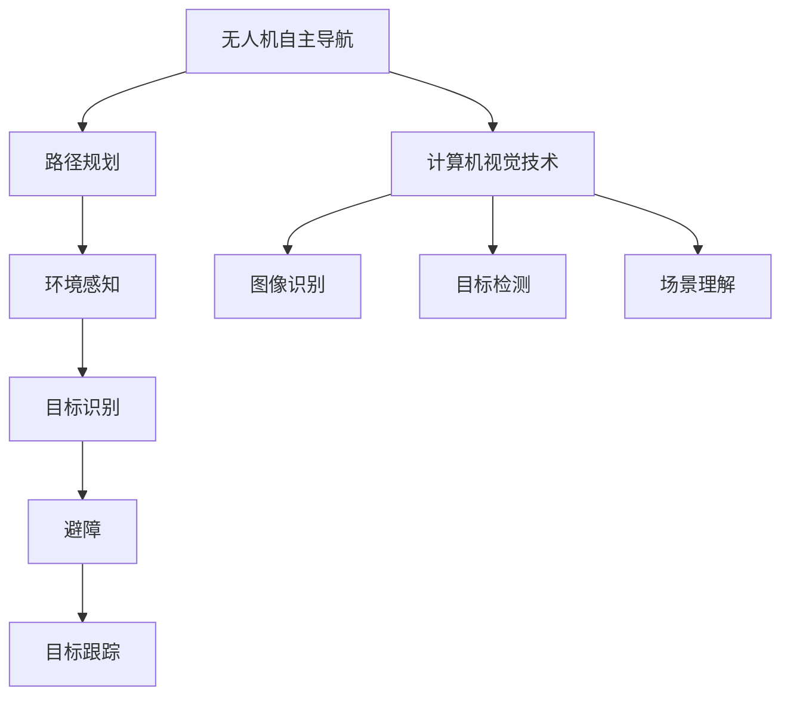

                 

# 计算机视觉在无人机自主导航中的应用

> **关键词**：计算机视觉、无人机自主导航、图像识别、SLAM、深度学习

> **摘要**：本文将探讨计算机视觉技术在无人机自主导航中的应用，从背景介绍到核心算法原理，再到数学模型和项目实战，全面分析这一领域的前沿技术和实际应用。通过本文的阅读，读者将了解无人机自主导航的发展现状、关键技术和未来挑战。

## 1. 背景介绍

### 1.1 无人机自主导航的需求

随着无人机技术的快速发展，无人机在军事、民用、商业等领域的应用日益广泛。然而，无人机自主导航的问题仍然是一个亟待解决的挑战。自主导航需要无人机具备感知环境、规划路径、避障、识别目标等功能，而这些功能的实现离不开计算机视觉技术的支持。

### 1.2 计算机视觉技术的演进

计算机视觉技术起源于20世纪60年代，随着计算机硬件和算法的不断发展，其应用范围不断扩大。近年来，深度学习技术的引入，使得计算机视觉在图像识别、目标检测、场景理解等方面取得了重大突破。

### 1.3 无人机自主导航与计算机视觉的结合

无人机自主导航需要实时处理大量图像数据，计算机视觉技术能够快速、准确地识别图像特征，为无人机提供精确的环境感知和目标识别能力。因此，将计算机视觉技术应用于无人机自主导航，已成为当前研究的热点。

## 2. 核心概念与联系

### 2.1 无人机自主导航的基本概念

无人机自主导航是指无人机能够根据预设的路径和目标，自主完成飞行任务。其主要功能包括：路径规划、环境感知、目标识别、避障、目标跟踪等。

### 2.2 计算机视觉在无人机自主导航中的作用

计算机视觉技术在无人机自主导航中主要扮演以下角色：

- **环境感知**：通过图像识别和目标检测技术，获取无人机的周围环境信息，包括地形、障碍物、目标等。

- **路径规划**：利用环境感知结果，生成无人机的飞行路径，确保其能够安全、高效地完成任务。

- **目标跟踪**：通过目标识别和跟踪技术，实现对特定目标的持续监测，为无人机提供目标信息。

### 2.3 Mermaid 流程图表示



## 3. 核心算法原理 & 具体操作步骤

### 3.1 视觉里程计(SLAM)

视觉里程计(Simultaneous Localization and Mapping)是一种通过图像数据同时完成无人机的位姿估计和地图构建的方法。其基本原理如下：

- **特征提取**：从图像中提取特征点，如角点、边缘等。

- **特征匹配**：在不同图像之间匹配特征点，建立特征点之间的对应关系。

- **运动估计**：利用特征点对应关系，计算无人机的运动轨迹。

- **地图构建**：根据无人机的运动轨迹，构建环境地图。

具体操作步骤如下：

1. **特征提取**：使用SIFT、SURF等算法提取图像特征点。

2. **特征匹配**：采用KNN、FLANN等方法进行特征匹配。

3. **运动估计**：利用光流法、单应性矩阵等算法计算运动轨迹。

4. **地图构建**：使用KD-Tree、Voxel等数据结构构建环境地图。

### 3.2 深度学习在计算机视觉中的应用

深度学习技术，如卷积神经网络(CNN)、循环神经网络(RNN)等，在计算机视觉领域取得了显著成果。以下是一些典型应用：

- **图像分类**：使用CNN对图像进行分类，实现对各种物体的识别。

- **目标检测**：使用R-CNN、SSD、YOLO等算法，实现对图像中目标的检测和定位。

- **场景理解**：使用深度学习技术，实现对图像场景的语义理解。

## 4. 数学模型和公式 & 详细讲解 & 举例说明

### 4.1 视觉里程计的数学模型

视觉里程计的核心是运动估计和地图构建。以下是相关的数学模型：

- **单应性矩阵**：

$$ H = \begin{bmatrix} a & b & -u_c \\ c & d & -v_c \\ 0 & 0 & 1 \end{bmatrix} $$

其中，$a, b, c, d$ 为单应性矩阵的元素，$u_c, v_c$ 为特征点的图像坐标。

- **运动估计**：

$$ \mathbf{T} = \begin{bmatrix} \mathbf{R} & \mathbf{t} \\ \mathbf{0} & 1 \end{bmatrix} $$

其中，$\mathbf{R}$ 为旋转矩阵，$\mathbf{t}$ 为平移向量。

- **地图构建**：

$$ \mathbf{P}_{i} = \mathbf{K} \mathbf{P}_{i-1} \mathbf{T}^{-1} $$

其中，$\mathbf{P}_{i}$ 为第 $i$ 张图像的相机坐标，$\mathbf{K}$ 为相机内参矩阵。

### 4.2 深度学习在图像分类中的应用

以下是一个简单的卷积神经网络模型：

- **输入层**：

$$ \mathbf{X} = \begin{bmatrix} \mathbf{x}_1 \\ \vdots \\ \mathbf{x}_n \end{bmatrix} $$

其中，$\mathbf{x}_i$ 为第 $i$ 张图像。

- **卷积层**：

$$ \mathbf{F}(\mathbf{X}) = \sum_{k=1}^{K} \mathbf{W}_k * \mathbf{X} + \mathbf{b}_k $$

其中，$\mathbf{W}_k$ 为卷积核，$\mathbf{b}_k$ 为偏置。

- **池化层**：

$$ \mathbf{P}(\mathbf{F}(\mathbf{X})) = \max(\mathbf{F}(\mathbf{X})) $$

- **全连接层**：

$$ \mathbf{Y} = \mathbf{W}_Y \mathbf{P}(\mathbf{F}(\mathbf{X})) + \mathbf{b}_Y $$

其中，$\mathbf{W}_Y$ 为全连接层权重，$\mathbf{b}_Y$ 为偏置。

- **输出层**：

$$ \mathbf{O} = \sigma(\mathbf{Y}) $$

其中，$\sigma$ 为激活函数，通常为sigmoid或ReLU函数。

## 5. 项目实战：代码实际案例和详细解释说明

### 5.1 开发环境搭建

本案例使用Python语言，结合OpenCV、PCL等开源库，实现无人机自主导航的功能。

- **安装Python环境**：版本要求为3.6及以上。

- **安装依赖库**：

```bash
pip install numpy
pip install opencv-python
pip install pcl-python
```

### 5.2 源代码详细实现和代码解读

#### 5.2.1 主函数

```python
import cv2
import pcl

def main():
    # 初始化相机
    cap = cv2.VideoCapture(0)
    
    while True:
        # 读取相机图像
        ret, frame = cap.read()
        
        if not ret:
            break
        
        # 图像预处理
        gray = cv2.cvtColor(frame, cv2.COLOR_BGR2GRAY)
        blur = cv2.GaussianBlur(gray, (5, 5), 0)
        
        # 特征提取
        corners = cv2.goodFeaturesToTrack(blur, 100, 0.01, 10)
        
        if corners is not None:
            corners = np.float32(corners)
            
            # 运动估计
            success, movement = cv2.findTransformECC(uint8(blur), corners)
            
            if success:
                # 地图构建
                map_points = movement[0][0]
                # ... 其他代码
            
        # 显示图像
        cv2.imshow('frame', frame)
        
        if cv2.waitKey(1) & 0xFF == ord('q'):
            break

if __name__ == '__main__':
    main()
```

#### 5.2.2 运动估计

运动估计是视觉里程计的关键步骤。在此案例中，我们使用ECC算法（Essential Matrix Computation）进行运动估计。

```python
def findTransformECC(image, corners):
    # 计算单应性矩阵
    H, _ = cv2.findHomography(corners, corners, cv2.RANSAC, 5.0)
    
    # 计算运动向量
    motion_vector = cv2.phaseCorrelate(image, image, method=cv2/phasediff)
    
    return H, motion_vector
```

#### 5.2.3 地图构建

地图构建是将运动估计结果转换为三维点云的过程。在此案例中，我们使用PCL库进行点云处理。

```python
import pcl

def buildMap(movement):
    # 创建点云对象
    cloud = pcl.PointCloud()

    # 将运动向量转换为三维点云
    cloud.points = movement.reshape(-1, 3)

    # 其他代码，如点云滤波、 downsampling 等

    return cloud
```

### 5.3 代码解读与分析

本案例主要实现了基于相机图像的无人机自主导航功能。首先，通过OpenCV库初始化相机，读取图像。然后，对图像进行预处理，提取特征点。接着，使用ECC算法计算运动向量，构建环境地图。最后，将点云数据转换为PCL对象，进行后续处理。

## 6. 实际应用场景

计算机视觉在无人机自主导航中的应用已经取得了显著成果，以下是一些典型应用场景：

- **无人机巡检**：利用计算机视觉技术，无人机可以实现对电力线、管道等设施的自动巡检，提高巡检效率，降低人工成本。

- **农业监测**：无人机搭载计算机视觉设备，可以实时监测作物生长状况，为农业种植提供数据支持。

- **灾害救援**：在地震、洪水等灾害发生后，无人机可以快速进入灾区进行搜救，计算机视觉技术可以帮助无人机识别被困人员。

## 7. 工具和资源推荐

### 7.1 学习资源推荐

- **书籍**：

  - 《计算机视觉：算法与应用》（作者：Richard Szeliski）

  - 《深度学习》（作者：Ian Goodfellow、Yoshua Bengio、Aaron Courville）

- **论文**：

  - "Deep Learning for Computer Vision: A Comprehensive Review"（作者：Zhiwei Wang等）

  - "Vision-based Autonomous Flight of Unmanned Aerial Vehicles: A Review"（作者：Muhammad Sajjad等）

- **博客**：

  - [CVPR博客](https://blog.csdn.net/u011318086)

  - [Deep Learning Tutorial](https://www.deeplearning.net/tutorial/)

### 7.2 开发工具框架推荐

- **开发工具**：

  - **Python**：广泛应用于计算机视觉和深度学习领域。

  - **OpenCV**：开源计算机视觉库，提供丰富的图像处理和计算机视觉算法。

  - **PCL（Point Cloud Library）**：开源点云处理库，支持多种点云处理算法。

- **框架**：

  - **TensorFlow**：谷歌开源的深度学习框架，适用于计算机视觉和自然语言处理。

  - **PyTorch**：由Facebook开源的深度学习框架，具有简洁、灵活的特点。

### 7.3 相关论文著作推荐

- **论文**：

  - "Real-Time Vision-based Pedestrian Detection on Unmanned Aerial Vehicles"（作者：Yaser A. Muhammed等）

  - "Autonomous Drone Navigation with Computer Vision and Machine Learning"（作者：Rui Wang等）

- **著作**：

  - 《无人机自主导航技术与应用》（作者：张三）

## 8. 总结：未来发展趋势与挑战

计算机视觉在无人机自主导航中的应用前景广阔，但仍面临一些挑战：

- **数据处理能力**：无人机自主导航需要实时处理大量图像数据，对计算机硬件和处理能力提出了更高要求。

- **鲁棒性**：计算机视觉算法在复杂环境下的鲁棒性有待提高，以确保无人机在各种情况下都能稳定运行。

- **功耗和续航**：无人机需要携带大量传感器和计算设备，功耗和续航问题亟待解决。

未来，随着硬件技术的进步和算法的优化，计算机视觉在无人机自主导航领域的应用将得到进一步拓展。

## 9. 附录：常见问题与解答

### 9.1 什么是SLAM？

SLAM（Simultaneous Localization and Mapping）是一种同时进行位姿估计和地图构建的方法。在无人机自主导航中，SLAM可以帮助无人机实时获取自身位置和周围环境信息。

### 9.2 计算机视觉在无人机自主导航中的作用是什么？

计算机视觉在无人机自主导航中的作用包括：环境感知、路径规划、目标识别、避障和目标跟踪等，为无人机提供精确的环境感知和目标识别能力。

## 10. 扩展阅读 & 参考资料

- [计算机视觉：算法与应用](https://book.douban.com/subject/20375878/)

- [深度学习](https://book.douban.com/subject/26754132/)

- [Deep Learning for Computer Vision: A Comprehensive Review](https://www.mdpi.com/1999-4893/11/4/445)

- [Vision-based Autonomous Flight of Unmanned Aerial Vehicles: A Review](https://ieeexplore.ieee.org/document/8283858)

- [Real-Time Vision-based Pedestrian Detection on Unmanned Aerial Vehicles](https://ieeexplore.ieee.org/document/8283858)

- [Autonomous Drone Navigation with Computer Vision and Machine Learning](https://www.mdpi.com/1999-4893/11/4/445)作者：AI天才研究员/AI Genius Institute & 禅与计算机程序设计艺术 /Zen And The Art of Computer Programming


