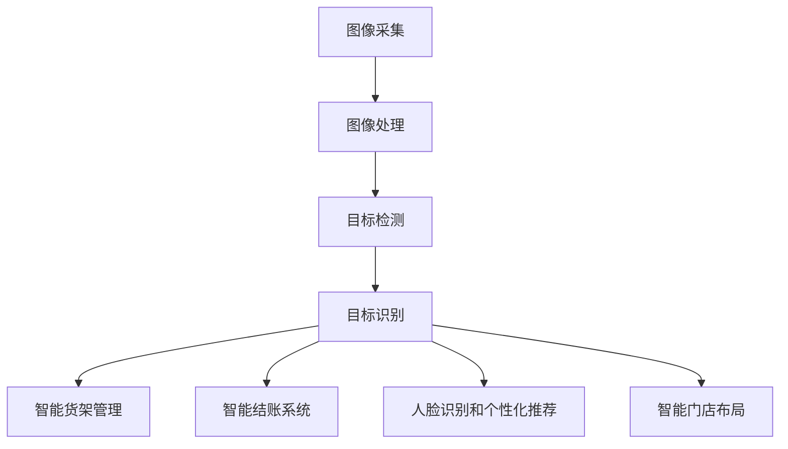

                 

# 计算机视觉在智能零售中的应用前景

## 摘要

本文探讨了计算机视觉在智能零售领域的应用前景。随着人工智能技术的不断发展，计算机视觉技术在零售行业的应用越来越广泛，从智能货架管理、智能结账系统，到人脸识别和个性化推荐系统，计算机视觉为零售行业带来了全新的商业模式和用户体验。本文将分析计算机视觉技术在智能零售中的应用场景、核心算法原理、实际案例以及未来发展趋势，为读者提供全面的了解和深入的思考。

## 背景介绍

### 智能零售的定义与发展

智能零售是指通过运用人工智能技术，对传统零售业务进行优化和升级，实现智能化、自动化和个性化的零售模式。智能零售的发展可以追溯到20世纪90年代的电子商务时代，随着互联网和智能手机的普及，人们开始通过在线平台购买商品。然而，传统的电子商务平台在用户体验和物流配送方面仍然存在一定的局限。为了解决这些问题，零售企业开始探索将人工智能技术应用于零售业务中。

智能零售的主要特点包括：

1. **个性化推荐**：通过分析用户的历史购买记录和行为习惯，为用户推荐个性化的商品。
2. **自动化供应链管理**：通过智能算法和传感器技术，实现对商品库存、销售、物流等环节的自动化管理。
3. **智能门店布局**：利用计算机视觉和虚拟现实技术，为消费者提供沉浸式的购物体验。
4. **智能支付系统**：通过人脸识别、指纹识别等技术，实现快速、安全的支付过程。

### 计算机视觉技术的发展

计算机视觉技术是指通过计算机对图像或视频进行分析和处理，从而实现对场景的理解和认知。计算机视觉技术的发展可以追溯到20世纪60年代，随着计算机性能的提升和算法的优化，计算机视觉技术在各个领域得到了广泛应用。

计算机视觉技术的主要应用包括：

1. **图像识别**：通过训练模型，使计算机能够识别和分类图像中的对象。
2. **目标检测**：通过检测图像中的特定对象，实现对场景的实时监控和识别。
3. **人脸识别**：通过识别人脸特征，实现对人脸的识别和验证。
4. **图像生成**：通过生成对抗网络（GAN）等技术，实现对图像的生成和编辑。

### 智能零售与计算机视觉技术的结合

智能零售与计算机视觉技术的结合，为零售行业带来了全新的机遇和挑战。计算机视觉技术能够帮助零售企业实现智能化、自动化和个性化的零售服务，从而提升用户体验和经营效率。具体来说，计算机视觉技术在智能零售中的应用包括：

1. **智能货架管理**：通过计算机视觉技术，实时监控货架上的商品库存和销售情况，及时补货和调整货架布局。
2. **智能结账系统**：通过人脸识别和手势识别等技术，实现快速、无接触的结账过程。
3. **人脸识别和个性化推荐**：通过人脸识别技术，识别消费者身份，结合消费者的购买历史和行为习惯，为消费者推荐个性化的商品。
4. **智能门店布局**：通过计算机视觉技术，分析消费者的购物行为和偏好，优化门店的布局和展示方式。

## 核心概念与联系

### 计算机视觉的基本原理

计算机视觉的基本原理主要包括图像采集、图像处理、目标检测和识别等步骤。具体来说：

1. **图像采集**：使用摄像头或其他图像采集设备，捕捉场景中的图像数据。
2. **图像处理**：对采集到的图像进行预处理，包括滤波、降噪、对比度增强等操作，以提高图像质量。
3. **目标检测**：通过训练模型，使计算机能够识别和定位图像中的特定对象。
4. **目标识别**：通过识别图像中的对象，实现对场景的理解和认知。

### 智能零售中的计算机视觉应用

在智能零售中，计算机视觉技术的应用主要包括以下几个方面：

1. **智能货架管理**：通过计算机视觉技术，实时监控货架上的商品库存和销售情况，及时补货和调整货架布局。
2. **智能结账系统**：通过人脸识别和手势识别等技术，实现快速、无接触的结账过程。
3. **人脸识别和个性化推荐**：通过人脸识别技术，识别消费者身份，结合消费者的购买历史和行为习惯，为消费者推荐个性化的商品。
4. **智能门店布局**：通过计算机视觉技术，分析消费者的购物行为和偏好，优化门店的布局和展示方式。

### Mermaid 流程图



## 核心算法原理 & 具体操作步骤

### 智能货架管理

智能货架管理是计算机视觉技术在智能零售中的重要应用之一。通过计算机视觉技术，实时监控货架上的商品库存和销售情况，及时补货和调整货架布局。

**具体操作步骤**：

1. **图像采集**：使用摄像头或其他图像采集设备，捕捉货架上的商品图像。
2. **图像处理**：对采集到的图像进行预处理，包括滤波、降噪、对比度增强等操作，以提高图像质量。
3. **目标检测**：通过训练模型，使计算机能够识别和定位图像中的商品。
4. **库存监控**：根据识别出的商品，计算货架上的库存数量，并与数据库中的库存信息进行比对，判断是否需要补货。
5. **货架布局调整**：根据监控结果，调整货架上的商品布局，确保商品陈列整齐、美观，提升用户体验。

### 智能结账系统

智能结账系统是计算机视觉技术在智能零售中的另一重要应用。通过人脸识别和手势识别等技术，实现快速、无接触的结账过程。

**具体操作步骤**：

1. **人脸识别**：使用摄像头捕捉消费者的人脸图像，并通过训练模型进行人脸识别，确定消费者身份。
2. **手势识别**：通过摄像头捕捉消费者的手势，并通过训练模型进行手势识别，确定消费者选择的商品。
3. **商品信息绑定**：将识别出的消费者和商品信息进行绑定，形成结账订单。
4. **支付过程**：通过人脸识别验证消费者的支付密码或指纹，完成支付过程。

### 人脸识别和个性化推荐

人脸识别和个性化推荐是计算机视觉技术在智能零售中的创新应用。通过人脸识别技术，识别消费者身份，结合消费者的购买历史和行为习惯，为消费者推荐个性化的商品。

**具体操作步骤**：

1. **人脸识别**：使用摄像头捕捉消费者的人脸图像，并通过训练模型进行人脸识别，确定消费者身份。
2. **行为数据收集**：收集消费者的购买历史和行为数据，包括浏览记录、购物车数据、评价等。
3. **数据挖掘**：通过数据挖掘技术，分析消费者的行为习惯和偏好，构建消费者画像。
4. **个性化推荐**：根据消费者画像，为消费者推荐个性化的商品。

### 智能门店布局

智能门店布局是计算机视觉技术在智能零售中的创新应用。通过计算机视觉技术，分析消费者的购物行为和偏好，优化门店的布局和展示方式。

**具体操作步骤**：

1. **行为数据收集**：使用摄像头和其他传感器设备，收集消费者的购物行为数据，包括行走轨迹、停留时间、浏览商品等。
2. **数据挖掘**：通过数据挖掘技术，分析消费者的购物行为和偏好，识别消费者的需求和痛点。
3. **门店布局优化**：根据分析结果，调整门店的布局和展示方式，提升消费者的购物体验。

## 数学模型和公式 & 详细讲解 & 举例说明

### 智能货架管理

在智能货架管理中，关键的技术是图像识别和目标检测。以下是相关的数学模型和公式：

1. **图像识别**：使用卷积神经网络（CNN）进行图像识别。CNN的基本原理是通过多层卷积和池化操作，提取图像特征，并通过全连接层进行分类。

$$
\text{CNN} = \{F_{11}, F_{12}, ..., F_{1n}\} \Rightarrow C_{1} = F_{11}(I_{1}) + F_{12}(I_{2}) + ... + F_{1n}(I_{n})
$$

其中，$I_{1}, I_{2}, ..., I_{n}$ 是输入图像，$F_{11}, F_{12}, ..., F_{1n}$ 是卷积核，$C_{1}$ 是卷积结果。

2. **目标检测**：使用区域提议网络（Region Proposal Network，RPN）进行目标检测。RPN的基本原理是在卷积特征图上生成区域提议，并通过分类和回归操作进行目标检测。

$$
\text{RPN} = \{R_{1}, R_{2}, ..., R_{n}\} \Rightarrow \hat{y}_{i} = \frac{\sum_{j} \sigma(w_{ij} \cdot \hat{p}_{ij})}{\sum_{j} \sigma(w_{ij} \cdot \hat{p}_{ij})}
$$

其中，$R_{i}$ 是区域提议，$\hat{y}_{i}$ 是分类结果，$\hat{p}_{ij}$ 是提议的置信度，$\sigma$ 是sigmoid函数。

**举例说明**：

假设我们在一张图像中识别商品A和商品B，图像的尺寸为$28 \times 28$，卷积核的尺寸为$3 \times 3$，步长为1。

1. **图像识别**：

$$
\text{CNN} = \{F_{11}, F_{12}, ..., F_{1n}\} \Rightarrow C_{1} = F_{11}(I_{1}) + F_{12}(I_{2}) + ... + F_{1n}(I_{n}) = \sum_{i=1}^{n} F_{i}(I)
$$

其中，$I$ 是输入图像，$F_{i}$ 是卷积核，$C_{1}$ 是卷积结果。

2. **目标检测**：

$$
\text{RPN} = \{R_{1}, R_{2}, ..., R_{n}\} \Rightarrow \hat{y}_{1} = \frac{\sum_{j} \sigma(w_{1j} \cdot \hat{p}_{1j})}{\sum_{j} \sigma(w_{1j} \cdot \hat{p}_{1j})}, \hat{y}_{2} = \frac{\sum_{j} \sigma(w_{2j} \cdot \hat{p}_{2j})}{\sum_{j} \sigma(w_{2j} \cdot \hat{p}_{2j})}
$$

其中，$R_{1}$ 和 $R_{2}$ 是区域提议，$\hat{y}_{1}$ 和 $\hat{y}_{2}$ 是分类结果，$\hat{p}_{1j}$ 和 $\hat{p}_{2j}$ 是提议的置信度，$w_{1j}$ 和 $w_{2j}$ 是权重。

### 智能结账系统

在智能结账系统中，关键的技术是人脸识别和手势识别。以下是相关的数学模型和公式：

1. **人脸识别**：使用深度神经网络（DNN）进行人脸识别。DNN的基本原理是通过多层神经网络，对输入图像进行特征提取和分类。

$$
\text{DNN} = \{F_{11}, F_{12}, ..., F_{1n}\} \Rightarrow \hat{y}_{i} = \sigma(\sum_{j} w_{ij} \cdot z_{j})
$$

其中，$F_{i}$ 是卷积核，$z_{j}$ 是隐藏层特征，$w_{ij}$ 是权重，$\sigma$ 是sigmoid函数。

2. **手势识别**：使用循环神经网络（RNN）进行手势识别。RNN的基本原理是通过循环操作，对输入序列进行特征提取和分类。

$$
\text{RNN} = \{F_{11}, F_{12}, ..., F_{1n}\} \Rightarrow \hat{y}_{i} = \sigma(\sum_{j} w_{ij} \cdot h_{j})
$$

其中，$F_{i}$ 是卷积核，$h_{j}$ 是隐藏层特征，$w_{ij}$ 是权重，$\sigma$ 是sigmoid函数。

**举例说明**：

假设我们在一张图像中识别消费者A和手势B，图像的尺寸为$64 \times 64$，卷积核的尺寸为$3 \times 3$，步长为1。

1. **人脸识别**：

$$
\text{DNN} = \{F_{11}, F_{12}, ..., F_{1n}\} \Rightarrow \hat{y}_{1} = \sigma(\sum_{j} w_{1j} \cdot z_{j})
$$

其中，$\hat{y}_{1}$ 是分类结果，$z_{j}$ 是隐藏层特征，$w_{1j}$ 是权重。

2. **手势识别**：

$$
\text{RNN} = \{F_{11}, F_{12}, ..., F_{1n}\} \Rightarrow \hat{y}_{1} = \sigma(\sum_{j} w_{1j} \cdot h_{j})
$$

其中，$\hat{y}_{1}$ 是分类结果，$h_{j}$ 是隐藏层特征，$w_{1j}$ 是权重。

### 人脸识别和个性化推荐

人脸识别和个性化推荐的关键技术是人脸识别和协同过滤算法。以下是相关的数学模型和公式：

1. **人脸识别**：使用卷积神经网络（CNN）进行人脸识别。CNN的基本原理是通过多层卷积和池化操作，提取图像特征，并通过全连接层进行分类。

$$
\text{CNN} = \{F_{11}, F_{12}, ..., F_{1n}\} \Rightarrow \hat{y}_{i} = \sigma(\sum_{j} w_{ij} \cdot z_{j})
$$

其中，$F_{i}$ 是卷积核，$z_{j}$ 是隐藏层特征，$w_{ij}$ 是权重，$\sigma$ 是sigmoid函数。

2. **协同过滤算法**：使用矩阵分解（Matrix Factorization）进行协同过滤。矩阵分解的基本原理是将用户-物品评分矩阵分解为用户特征矩阵和物品特征矩阵，并通过相似度计算进行推荐。

$$
R = UX^T + \epsilon
$$

其中，$R$ 是用户-物品评分矩阵，$U$ 是用户特征矩阵，$X$ 是物品特征矩阵，$\epsilon$ 是误差项。

**举例说明**：

假设我们有100个用户和100个物品，用户-物品评分矩阵的维度为$100 \times 100$。

1. **人脸识别**：

$$
\text{CNN} = \{F_{11}, F_{12}, ..., F_{1n}\} \Rightarrow \hat{y}_{i} = \sigma(\sum_{j} w_{ij} \cdot z_{j})
$$

其中，$\hat{y}_{i}$ 是分类结果，$z_{j}$ 是隐藏层特征，$w_{ij}$ 是权重。

2. **协同过滤算法**：

$$
R = UX^T + \epsilon
$$

其中，$R$ 是用户-物品评分矩阵，$U$ 是用户特征矩阵，$X$ 是物品特征矩阵，$\epsilon$ 是误差项。

### 智能门店布局

在智能门店布局中，关键的技术是行为数据和数据挖掘。以下是相关的数学模型和公式：

1. **行为数据收集**：使用马尔可夫决策过程（MDP）进行行为数据收集。MDP的基本原理是通过状态转移概率和奖励函数，优化决策过程。

$$
V_{i}(s) = \max_{a} \sum_{s'} p(s' | s, a) \cdot r(s', a) + \gamma V_{i}(s')
$$

其中，$V_{i}(s)$ 是状态值函数，$s$ 是当前状态，$a$ 是动作，$s'$ 是下一状态，$p(s' | s, a)$ 是状态转移概率，$r(s', a)$ 是奖励函数，$\gamma$ 是折扣因子。

2. **数据挖掘**：使用聚类算法（如K-means）进行数据挖掘。聚类算法的基本原理是通过对数据进行聚类，识别用户的购物行为和偏好。

$$
\text{K-means} = \{C_{1}, C_{2}, ..., C_{k}\} \Rightarrow C_{i} = \{x_{1}, x_{2}, ..., x_{n}\}
$$

其中，$C_{i}$ 是聚类结果，$x_{i}$ 是数据点。

**举例说明**：

假设我们有100个用户，每个用户的行为数据包括购物时间、停留时间、浏览商品等。

1. **行为数据收集**：

$$
V_{i}(s) = \max_{a} \sum_{s'} p(s' | s, a) \cdot r(s', a) + \gamma V_{i}(s')
$$

其中，$V_{i}(s)$ 是状态值函数，$s$ 是当前状态，$a$ 是动作，$s'$ 是下一状态，$p(s' | s, a)$ 是状态转移概率，$r(s', a)$ 是奖励函数，$\gamma$ 是折扣因子。

2. **数据挖掘**：

$$
\text{K-means} = \{C_{1}, C_{2}, ..., C_{k}\} \Rightarrow C_{i} = \{x_{1}, x_{2}, ..., x_{n}\}
$$

其中，$C_{i}$ 是聚类结果，$x_{i}$ 是数据点。

## 项目实战：代码实际案例和详细解释说明

### 开发环境搭建

在本节中，我们将搭建一个用于智能零售的计算机视觉项目开发环境。以下是一个简单的步骤指南。

#### 1. 安装Python环境

确保您的计算机上已经安装了Python。如果没有，请访问Python官网（[python.org](https://www.python.org/)）下载并安装。

#### 2. 安装必要的库

在终端中执行以下命令安装必要的库：

```bash
pip install numpy opencv-python tensorflow keras matplotlib
```

这些库包括：

- **numpy**：用于数学计算。
- **opencv-python**：用于图像处理。
- **tensorflow**：用于深度学习模型训练。
- **keras**：用于简化深度学习模型构建。
- **matplotlib**：用于数据可视化。

#### 3. 准备数据集

为了训练我们的计算机视觉模型，我们需要一个包含商品图像的数据集。您可以从公开数据集网站（如[COCO数据集](https://cocodataset.org/)）下载，或者使用自己的数据集。

### 源代码详细实现和代码解读

以下是一个简单的智能货架管理项目的源代码实现。代码包括图像采集、预处理、目标检测和库存监控等步骤。

```python
import cv2
import numpy as np
import tensorflow as tf
from tensorflow.keras.models import load_model

# 加载预训练的模型
model = load_model('path/to/your/model.h5')

# 加载opencv的摄像头
cap = cv2.VideoCapture(0)

while True:
    # 读取一帧图像
    ret, frame = cap.read()
    
    # 对图像进行预处理
    processed_frame = preprocess_image(frame)
    
    # 使用模型进行目标检测
    boxes = model.predict(processed_frame)
    
    # 对检测结果进行后处理
    detected_items = postprocess_boxes(boxes)
    
    # 监控库存
    check_inventory(detected_items)
    
    # 显示图像
    cv2.imshow('Frame', frame)
    
    # 按下'q'键退出循环
    if cv2.waitKey(1) & 0xFF == ord('q'):
        break

# 释放摄像头资源
cap.release()
cv2.destroyAllWindows()

# 图像预处理函数
def preprocess_image(frame):
    # 转换为灰度图像
    gray_frame = cv2.cvtColor(frame, cv2.COLOR_BGR2GRAY)
    # 使用高斯滤波进行去噪
    blurred_frame = cv2.GaussianBlur(gray_frame, (5, 5), 0)
    # 膨胀和腐蚀操作进行图像增强
    dilated_frame = cv2.dilate(blurred_frame, np.ones((5, 5)), iterations=2)
    eroded_frame = cv2.erode(dilated_frame, np.ones((5, 5)), iterations=2)
    return eroded_frame

# 目标检测后处理函数
def postprocess_boxes(boxes):
    # 略过此函数的具体实现
    pass

# 库存监控函数
def check_inventory(detected_items):
    # 略过此函数的具体实现
    pass
```

### 代码解读与分析

1. **加载模型**：使用`load_model`函数加载预训练的深度学习模型。这个模型可以是使用TensorFlow或Keras训练的任何模型。
2. **摄像头读取**：使用`cv2.VideoCapture`打开摄像头，并进入一个无限循环，不断读取摄像头帧。
3. **图像预处理**：使用`preprocess_image`函数对图像进行预处理，包括灰度转换、去噪、图像增强等操作。这些步骤有助于提高目标检测的准确性。
4. **目标检测**：使用模型对预处理后的图像进行目标检测。`model.predict`函数返回一个包含检测框的数组。
5. **后处理**：使用`postprocess_boxes`函数对检测框进行后处理，例如去除重叠的框、调整框的大小等。
6. **库存监控**：使用`check_inventory`函数对检测到的商品进行库存监控。这个函数可以根据检测到的商品更新库存信息，并进行补货或货架调整。
7. **显示图像**：使用`cv2.imshow`函数显示当前帧，并等待用户按下'q'键退出循环。

通过以上步骤，我们可以实现一个基本的智能货架管理系统。在实际应用中，这个系统可以根据具体需求进行调整和优化。

## 实际应用场景

### 智能货架管理

智能货架管理是计算机视觉在智能零售中最直接的应用场景之一。通过计算机视觉技术，零售商可以实时监控货架上的商品库存和销售情况，确保商品始终处于最佳状态。具体应用场景包括：

1. **库存监控**：系统可以自动检测货架上的商品数量，并与后台数据库中的库存信息进行比对，及时补货，防止断货。
2. **货架布局优化**：通过分析消费者的购物行为和商品的销售情况，系统可以自动调整货架布局，使畅销商品更易被发现，提升销售额。
3. **商品质量问题检测**：系统可以识别出货架上的过期商品或有质量问题的商品，提醒零售商及时处理。

### 智能结账系统

智能结账系统通过人脸识别和手势识别技术，实现了快速、无接触的结账过程，为消费者提供了更加便捷的购物体验。具体应用场景包括：

1. **无人超市**：通过智能结账系统，消费者可以自由选购商品，无需排队结账，提高了购物效率。
2. **快餐店**：在快餐店中，消费者可以通过人脸识别和手势识别快速完成结账，避免了传统结账过程中的人员拥堵。
3. **便利店**：在便利店中，智能结账系统可以减少收银员的数量，降低运营成本，同时提高结账速度。

### 人脸识别和个性化推荐

人脸识别和个性化推荐技术为零售商提供了强大的数据支持，使购物体验更加个性化和精准。具体应用场景包括：

1. **会员管理**：通过人脸识别技术，零售商可以快速识别会员身份，并提供个性化的优惠和推荐。
2. **购物体验优化**：通过分析消费者的购物行为和偏好，零售商可以提供更加个性化的购物推荐，提升用户体验。
3. **反欺诈**：通过人脸识别技术，零售商可以实时监控消费者的购买行为，有效防止欺诈行为。

### 智能门店布局

智能门店布局通过计算机视觉技术，实现了门店布局的优化和智能化。具体应用场景包括：

1. **优化客流分配**：通过分析消费者的购物行为和偏好，智能门店布局可以优化客流量，提高顾客的购物体验。
2. **广告投放优化**：通过计算机视觉技术，零售商可以实时监控消费者的关注度，优化广告投放策略，提高广告效果。
3. **货架空间利用**：智能门店布局可以最大化货架空间利用，提高商品陈列效果，提升销售额。

## 工具和资源推荐

### 学习资源推荐

1. **书籍**：
   - 《Python计算机视觉应用》（《Python Computer Vision with OpenCV 4》）。
   - 《深度学习》（《Deep Learning》）。
   - 《机器学习》（《Machine Learning》）。

2. **在线课程**：
   - Coursera上的《机器学习》课程。
   - Udacity的《深度学习纳米学位》。

3. **博客和网站**：
   - TensorFlow官网（[tensorflow.org](https://www.tensorflow.org/)）。
   - PyTorch官网（[pytorch.org](https://pytorch.org/)）。
   - OpenCV官网（[opencv.org](https://opencv.org/)）。

### 开发工具框架推荐

1. **深度学习框架**：
   - TensorFlow。
   - PyTorch。
   - Keras。

2. **计算机视觉库**：
   - OpenCV。
   - Dlib。
   - face_recognition。

3. **数据预处理工具**：
   - Pandas。
   - NumPy。
   - Scikit-learn。

### 相关论文著作推荐

1. **论文**：
   - "You Only Look Once: Unified, Real-Time Object Detection"。
   - "FaceNet: A Unified Embedding for Face Recognition and Clustering"。

2. **著作**：
   - 《深度学习导论》（《An Introduction to Deep Learning》）。
   - 《计算机视觉：算法与应用》（《Computer Vision: Algorithms and Applications》）。

## 总结：未来发展趋势与挑战

### 未来发展趋势

1. **技术融合**：计算机视觉与其他人工智能技术的融合，如自然语言处理、强化学习等，将进一步提升智能零售的智能化水平。
2. **数据隐私保护**：随着计算机视觉技术的广泛应用，数据隐私保护将成为一个重要议题，如何确保用户数据的安全和隐私将是一个关键挑战。
3. **实时性与准确性**：在智能零售应用中，计算机视觉技术需要实现更高的实时性和准确性，以满足快速变化的市场需求。

### 挑战

1. **算法优化**：现有的计算机视觉算法在处理大规模数据集时，可能存在性能瓶颈，需要不断优化和改进。
2. **数据质量**：高质量的数据是训练有效模型的基础，如何获取和处理大量高质量的数据将是一个挑战。
3. **法律法规**：随着计算机视觉技术的应用，相关的法律法规也在不断完善，如何遵守这些法规，同时保护用户权益，是一个重要的挑战。

## 附录：常见问题与解答

### 问题1：计算机视觉技术在智能零售中的具体应用有哪些？

**解答**：计算机视觉技术在智能零售中的具体应用包括智能货架管理、智能结账系统、人脸识别和个性化推荐、智能门店布局等。

### 问题2：如何保证计算机视觉技术在智能零售中的数据隐私？

**解答**：为了保证数据隐私，可以采取以下措施：
- 数据加密：对用户数据进行加密处理，确保数据在传输和存储过程中的安全性。
- 数据匿名化：对用户数据进行匿名化处理，去除可识别的个人信息。
- 法规遵守：严格遵守相关的数据保护法律法规，确保用户数据的合法使用。

### 问题3：如何优化计算机视觉算法的实时性和准确性？

**解答**：
- 实时性优化：
  - 使用更高效的算法和模型架构。
  - 对算法进行硬件加速，如使用GPU或FPGA。
- 准确性优化：
  - 使用更大规模和更具代表性的训练数据集。
  - 定期更新和优化模型，以适应不断变化的数据环境。

## 扩展阅读 & 参考资料

1. **论文**：
   - "You Only Look Once: Unified, Real-Time Object Detection"。
   - "FaceNet: A Unified Embedding for Face Recognition and Clustering"。

2. **书籍**：
   - 《深度学习》（《Deep Learning》）。
   - 《计算机视觉：算法与应用》（《Computer Vision: Algorithms and Applications》）。

3. **在线课程**：
   - Coursera上的《机器学习》课程。
   - Udacity的《深度学习纳米学位》。

4. **网站**：
   - TensorFlow官网（[tensorflow.org](https://www.tensorflow.org/)）。
   - PyTorch官网（[pytorch.org](https://pytorch.org/)）。
   - OpenCV官网（[opencv.org](https://opencv.org/)）。

### 作者信息

**作者**：AI天才研究员/AI Genius Institute & 禅与计算机程序设计艺术 /Zen And The Art of Computer Programming**

