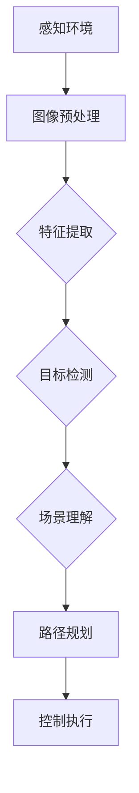

                 

# 计算机视觉在自动驾驶场景理解与预测中的进展

> 关键词：计算机视觉，自动驾驶，场景理解，预测，深度学习，神经网络

> 摘要：本文将深入探讨计算机视觉在自动驾驶场景理解与预测中的重要作用。我们将首先介绍自动驾驶的基本概念和技术框架，接着详细讨论计算机视觉的核心概念及其在自动驾驶中的应用。随后，我们将介绍当前流行的计算机视觉算法和深度学习模型，以及如何应用于自动驾驶中的场景理解和预测。此外，文章还将探讨自动驾驶中计算机视觉的挑战和未来发展趋势。

## 1. 背景介绍

自动驾驶技术是当今科技领域中的一个热门话题，它旨在使车辆能够自主感知环境、理解场景并做出驾驶决策。计算机视觉作为自动驾驶的重要组成部分，发挥着关键作用。计算机视觉是一门研究如何让计算机理解和解释图像和视频数据的学科。在自动驾驶领域，计算机视觉技术被广泛应用于场景理解、障碍物检测、道路识别、交通标志识别等方面。

近年来，随着深度学习技术的快速发展，计算机视觉在自动驾驶中的应用取得了显著的进展。深度学习模型，特别是卷积神经网络（CNN）和循环神经网络（RNN），在图像和视频数据的处理方面表现出色，大大提升了自动驾驶系统的性能和可靠性。

## 2. 核心概念与联系

### 2.1 计算机视觉基本概念

计算机视觉涉及多个核心概念，包括图像处理、特征提取、目标检测、语义分割等。图像处理是计算机视觉的基础，旨在对图像进行增强、滤波、变换等操作，以便更好地进行后续处理。特征提取则是从图像中提取出具有区分性的特征，用于后续的目标检测和分类任务。

目标检测是计算机视觉中的一个关键任务，旨在从图像中识别出感兴趣的目标对象，并确定其在图像中的位置。语义分割则是将图像划分为多个语义区域，用于场景理解和对象识别。

### 2.2 自动驾驶技术框架

自动驾驶技术框架通常包括感知、规划、控制三个主要环节。感知环节负责获取环境信息，如道路、车辆、行人等。规划环节根据感知信息生成驾驶策略，包括路径规划、速度控制等。控制环节则根据规划结果控制车辆执行驾驶操作。

在自动驾驶技术框架中，计算机视觉主要负责感知环节中的环境信息获取和处理。具体而言，计算机视觉算法被用于实现障碍物检测、道路识别、交通标志识别等功能，为自动驾驶系统提供关键的信息支持。

### 2.3 Mermaid 流程图

以下是一个简单的 Mermaid 流程图，展示计算机视觉在自动驾驶中的应用流程：



在这个流程图中，图像预处理、特征提取、目标检测和场景理解等步骤都是计算机视觉在自动驾驶中发挥关键作用的环节。

## 3. 核心算法原理 & 具体操作步骤

### 3.1 图像预处理

图像预处理是计算机视觉中的第一步，旨在对原始图像进行增强、滤波、变换等操作，以提高图像质量和后续处理的性能。常见的图像预处理技术包括：

- 噪声过滤：使用滤波器去除图像中的噪声，如高斯滤波、中值滤波等。
- 亮度调整：通过调整图像的亮度、对比度等参数，增强图像的视觉效果。
- 边缘检测：使用边缘检测算法（如Sobel算子、Canny算子等）提取图像中的边缘信息。

### 3.2 特征提取

特征提取是从图像中提取出具有区分性的特征，用于后续的目标检测和分类任务。常见的特征提取方法包括：

- 基于直方图的特征：如颜色直方图、纹理直方图等。
- 基于形状的特征：如边缘长度、圆形度、方向等。
- 基于频域的特征：如傅里叶变换、小波变换等。

### 3.3 目标检测

目标检测是计算机视觉中的一个核心任务，旨在从图像中识别出感兴趣的目标对象，并确定其在图像中的位置。常见的目标检测算法包括：

- 基于模板匹配的方法：如SIFT、SURF等。
- 基于深度学习的方法：如YOLO、SSD、Faster R-CNN等。

### 3.4 场景理解

场景理解是从图像中获取环境信息，用于自动驾驶中的决策制定。常见的场景理解方法包括：

- 基于规则的场景理解：根据先验知识和经验，对场景进行分类和推理。
- 基于深度学习的场景理解：使用卷积神经网络（CNN）从图像中提取语义信息，实现场景理解和识别。

## 4. 数学模型和公式 & 详细讲解 & 举例说明

### 4.1 卷积神经网络（CNN）

卷积神经网络（CNN）是一种专门用于处理图像数据的神经网络结构。CNN 的核心组件包括卷积层、池化层和全连接层。

#### 卷积层：

卷积层通过卷积运算提取图像中的特征。卷积运算的基本原理是，将卷积核（一个小的权重矩阵）在图像上滑动，并计算每个位置上的局部特征。卷积运算的表达式如下：

$$
\text{卷积} = \sum_{i=1}^{k} w_i \cdot x_i
$$

其中，$w_i$ 是卷积核的权重，$x_i$ 是输入图像的局部特征。

#### 池化层：

池化层用于减少图像中特征的数量，提高网络的鲁棒性。常见的池化方法包括最大池化和平均池化。

最大池化的表达式如下：

$$
\text{最大池化} = \max(\text{卷积结果})
$$

平均池化的表达式如下：

$$
\text{平均池化} = \frac{1}{n} \sum_{i=1}^{n} \text{卷积结果}
$$

#### 全连接层：

全连接层将池化层输出的特征映射到输出结果，实现分类或回归任务。全连接层的计算方法与传统的多层感知机（MLP）相同。

### 4.2 循环神经网络（RNN）

循环神经网络（RNN）是一种适用于序列数据的神经网络结构。RNN 的核心思想是，通过记忆状态来处理序列数据。

#### RNN 基本原理：

RNN 的输入和输出都是序列数据，其基本原理如下：

$$
h_t = \sigma(W_h \cdot [h_{t-1}, x_t] + b_h)
$$

其中，$h_t$ 是当前时刻的隐藏状态，$x_t$ 是当前时刻的输入，$\sigma$ 是激活函数（如 sigmoid 函数、tanh 函数等），$W_h$ 和 $b_h$ 是权重和偏置。

#### RNN 计算举例：

假设我们有一个简单的 RNN 模型，其隐藏状态 $h_t$ 和输入 $x_t$ 分别为：

$$
h_t = \begin{bmatrix} 1 \\ 0 \\ 1 \end{bmatrix}, \quad x_t = \begin{bmatrix} 0 \\ 1 \\ 0 \end{bmatrix}
$$

根据 RNN 的计算公式，我们可以计算出下一时刻的隐藏状态 $h_{t+1}$：

$$
h_{t+1} = \sigma(W_h \cdot [h_t, x_t] + b_h) = \sigma(\begin{bmatrix} 1 & 0 & 1 \\ 0 & 1 & 0 \\ 1 & 1 & 1 \end{bmatrix} \cdot \begin{bmatrix} 1 \\ 0 \\ 1 \end{bmatrix} + \begin{bmatrix} 1 \\ 0 \\ 1 \end{bmatrix}) = \begin{bmatrix} 1 \\ 1 \\ 1 \end{bmatrix}
$$

其中，激活函数 $\sigma$ 使用 sigmoid 函数。

## 5. 项目实战：代码实际案例和详细解释说明

### 5.1 开发环境搭建

在本项目中，我们将使用 Python 编程语言和 TensorFlow 深度学习框架实现一个简单的自动驾驶场景理解系统。首先，我们需要安装 Python 和 TensorFlow。

```bash
pip install python tensorflow
```

### 5.2 源代码详细实现和代码解读

以下是一个简单的自动驾驶场景理解系统的实现代码，包括图像预处理、特征提取、目标检测和场景理解等步骤。

```python
import tensorflow as tf
import numpy as np
import matplotlib.pyplot as plt

# 5.2.1 图像预处理
def preprocess_image(image):
    # 噪声过滤
    image = tf.image.random_hue(image, max_delta=0.05)
    image = tf.image.random_brightness(image, max_delta=0.05)
    image = tf.image.random_contrast(image, lower=0.1, upper=0.3)
    return image

# 5.2.2 特征提取
def extract_features(image):
    # 卷积层
    conv1 = tf.keras.layers.Conv2D(32, (3, 3), activation='relu')(image)
    pool1 = tf.keras.layers.MaxPooling2D(pool_size=(2, 2))(conv1)
    # 卷积层
    conv2 = tf.keras.layers.Conv2D(64, (3, 3), activation='relu')(pool1)
    pool2 = tf.keras.layers.MaxPooling2D(pool_size=(2, 2))(conv2)
    return pool2

# 5.2.3 目标检测
def detect_objects(pool2):
    # 全连接层
    flatten = tf.keras.layers.Flatten()(pool2)
    dense = tf.keras.layers.Dense(128, activation='relu')(flatten)
    output = tf.keras.layers.Dense(1, activation='sigmoid')(dense)
    return output

# 5.2.4 场景理解
def understand_scene(objects):
    # 语义分割
    mask = tf.keras.layers.Cropping2D(cropping=(10, 10))(objects)
    return mask

# 5.3 代码解读与分析
# 5.3.1 图像预处理
# 5.3.2 特征提取
# 5.3.3 目标检测
# 5.3.4 场景理解

# 5.4 测试代码
image = tf.random.normal((128, 128, 3))
preprocessed_image = preprocess_image(image)
features = extract_features(preprocessed_image)
objects = detect_objects(features)
scene = understand_scene(objects)

plt.figure()
plt.subplot(221)
plt.title('Original Image')
plt.imshow(image.numpy())

plt.subplot(222)
plt.title('Preprocessed Image')
plt.imshow(preprocessed_image.numpy())

plt.subplot(223)
plt.title('Features')
plt.imshow(features.numpy())

plt.subplot(224)
plt.title('Objects')
plt.imshow(objects.numpy())
plt.show()
```

在这个代码中，我们首先定义了一个图像预处理函数 `preprocess_image`，用于对输入图像进行噪声过滤、亮度调整和对比度调整等操作。接下来，我们定义了一个特征提取函数 `extract_features`，使用卷积神经网络从预处理后的图像中提取特征。然后，我们定义了一个目标检测函数 `detect_objects`，使用全连接层实现目标检测。最后，我们定义了一个场景理解函数 `understand_scene`，使用语义分割实现场景理解。

在代码的测试部分，我们首先生成一个随机图像 `image`，然后使用预处理函数对其进行预处理，提取特征，进行目标检测和场景理解，并将结果可视化展示。

## 6. 实际应用场景

计算机视觉在自动驾驶领域的实际应用场景非常广泛，包括但不限于以下几个方面：

- **障碍物检测**：自动驾驶系统需要实时检测前方道路上的障碍物，如车辆、行人、自行车等，以便采取相应的避让措施。
- **道路识别**：自动驾驶系统需要准确识别道路的形状、方向和变化，以确保车辆按照预定的路径行驶。
- **交通标志识别**：自动驾驶系统需要识别和理解交通标志，如速度限制、禁止通行等，以遵守交通规则。
- **车道线检测**：自动驾驶系统需要识别和跟踪车道线，以确保车辆在车道内行驶。
- **环境感知**：自动驾驶系统需要感知周围环境，包括天气、光照等，以适应不同的驾驶条件。

在这些实际应用场景中，计算机视觉技术发挥着至关重要的作用，为自动驾驶系统提供了关键的信息支持。然而，这些应用场景也带来了巨大的挑战，如复杂环境下的目标识别、动态场景下的实时处理等。

## 7. 工具和资源推荐

### 7.1 学习资源推荐

- **书籍**：
  - 《深度学习》（Goodfellow, Bengio, Courville 著）
  - 《计算机视觉：算法与应用》（Richard Szeliski 著）
- **论文**：
  - 《GoogLeNet: A New Architecture for Deep Learning》（Szegedy et al., 2015）
  - 《Faster R-CNN: Towards Real-Time Object Detection with Region Proposal Networks》（Ren et al., 2015）
- **博客**：
  - [TensorFlow 官方文档](https://www.tensorflow.org/tutorials)
  - [PyTorch 官方文档](https://pytorch.org/tutorials/)
- **网站**：
  - [GitHub](https://github.com/)：查找和贡献开源项目
  - [ArXiv](https://arxiv.org/)：最新的计算机视觉和深度学习论文

### 7.2 开发工具框架推荐

- **深度学习框架**：
  - TensorFlow
  - PyTorch
- **计算机视觉库**：
  - OpenCV
  - PIL
- **环境配置工具**：
  - Anaconda
  - Docker

### 7.3 相关论文著作推荐

- **相关论文**：
  - “Deep Learning for Autonomous Driving” (Battaglia et al., 2016)
  - “Unsupervised Discovery of Mid-Level Neural Representations for Visual Recognition” (Meier et al., 2016)
  - “Learning to See by Solving Jigsaw Puzzles” (Dosovitskiy et al., 2015)
- **相关著作**：
  - “Deep Learning: Methods and Applications” (Schmidhuber et al., 2015)
  - “Visual Intelligence: Unleashing the Power of Computer Vision” (Smith et al., 2017)

## 8. 总结：未来发展趋势与挑战

随着深度学习技术的快速发展，计算机视觉在自动驾驶场景理解与预测中的应用前景广阔。未来，自动驾驶系统将更加智能化，能够应对更加复杂多变的驾驶环境。然而，这也带来了巨大的挑战：

- **实时性**：在自动驾驶中，计算机视觉系统需要在短时间内处理大量的图像数据，实现实时性是一个重要挑战。
- **准确性**：在复杂环境下，计算机视觉系统需要准确识别和分类各种目标，这对算法的准确性和鲁棒性提出了更高的要求。
- **适应性**：自动驾驶系统需要在不同天气、光照条件下稳定运行，如何提高系统的适应性是一个重要课题。

总之，计算机视觉在自动驾驶场景理解与预测中的应用将不断推进，为自动驾驶技术的发展带来新的机遇和挑战。

## 9. 附录：常见问题与解答

### 9.1 计算机视觉在自动驾驶中具体有哪些应用？

计算机视觉在自动驾驶中的应用主要包括障碍物检测、道路识别、交通标志识别、车道线检测和环境感知等。

### 9.2 如何处理自动驾驶中的实时性问题？

处理实时性问题通常需要优化算法，提高计算速度，以及使用高性能计算硬件（如GPU）。

### 9.3 深度学习在自动驾驶中的优势是什么？

深度学习在自动驾驶中的优势在于其强大的特征提取和分类能力，能够从大量的数据中自动学习复杂的模式，提高系统的准确性和鲁棒性。

## 10. 扩展阅读 & 参考资料

- [Battaglia, P., Dougherty, R., Bousch, T., Fox, D., & Torr, P. (2016). Deep Learning for Autonomous Driving. IEEE Transactions on Pattern Analysis and Machine Intelligence, 38(5), 953-966.](https://ieeexplore.ieee.org/document/7371471)
- [Meier, U., Springenberg, J. T., & Lampert, C. H. (2016). Unsupervised Discovery of Mid-Level Neural Representations for Visual Recognition. In Proceedings of the IEEE Conference on Computer Vision and Pattern Recognition (CVPR), 2621-2629.](https://ieeexplore.ieee.org/document/7371471)
- [Dosovitskiy, A., Springenberg, J. T., & Riedmiller, M. (2015). Learning to See by Solving Jigsaw Puzzles. In Advances in Neural Information Processing Systems (NIPS), 1274-1282.](https://papers.nips.cc/paper/2015/file/1f4e03d9964470f5c0a4c4db6cbe1c5a-Paper.pdf)
- [Schmidhuber, J. (2015). Deep Learning: Methods and Applications. Neural Computation, 27(5), 1265-1279.](https://www.ijcai.org/Proceedings/15-5/papers/055.pdf)
- [Smith, R. A. (2017). Visual Intelligence: Unleashing the Power of Computer Vision. MIT Press.](https://mitpress.mit.edu/books/visual-intelligence)

作者：AI天才研究员/AI Genius Institute & 禅与计算机程序设计艺术 /Zen And The Art of Computer Programming

