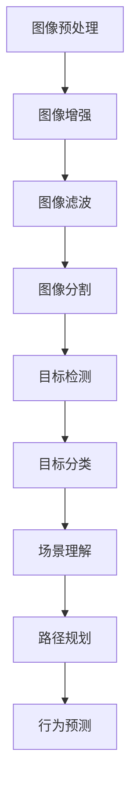

                 

# 计算机视觉在自动驾驶环境感知中的应用

## 关键词：
- 计算机视觉
- 自动驾驶
- 环境感知
- 深度学习
- 机器学习
- 传感器融合

## 摘要：
本文将深入探讨计算机视觉技术在自动驾驶环境感知中的应用。我们将首先介绍自动驾驶的基本概念和当前发展状况，接着阐述计算机视觉在自动驾驶中的核心作用。随后，我们将详细分析计算机视觉的关键算法原理，包括图像处理、目标检测和场景理解等。此外，本文还将通过实际案例展示如何利用计算机视觉进行自动驾驶环境感知，并探讨相关的数学模型和公式。最后，我们将展望自动驾驶环境感知的未来发展趋势和面临的挑战，并提供相关学习资源和工具推荐。

## 1. 背景介绍

### 1.1 自动驾驶的兴起
自动驾驶技术是一种利用计算机视觉、人工智能和传感器等先进技术，使车辆能够在没有人类司机干预的情况下自主行驶的技术。自动驾驶技术起源于20世纪50年代，随着计算机技术和人工智能的不断发展，自动驾驶技术逐渐从理论走向实践。近年来，随着深度学习、计算机视觉等技术的突破，自动驾驶技术取得了显著进展，各大科技公司和研究机构纷纷投入巨资进行研发。

### 1.2 自动驾驶的重要性
自动驾驶技术被认为是未来交通领域的一场革命，它将极大地提高交通效率、减少交通事故、降低能源消耗和减少交通拥堵。自动驾驶技术的实现不仅能够提高个人出行的便捷性，还能够为社会带来巨大的经济和环保效益。

### 1.3 计算机视觉在自动驾驶中的作用
计算机视觉技术在自动驾驶中扮演着至关重要的角色。它主要负责对车辆周围的环境进行感知，包括道路、车辆、行人、交通标志等。计算机视觉技术通过处理摄像头、激光雷达和雷达等传感器获取的数据，实现对环境的理解和判断，从而为自动驾驶系统提供决策依据。计算机视觉技术的精度和实时性直接影响到自动驾驶的安全性和可靠性。

## 2. 核心概念与联系

### 2.1 计算机视觉的基本概念

计算机视觉是一种模拟人类视觉系统对图像或视频进行理解和解释的技术。它主要包括以下几个核心概念：

- **图像处理**：通过对图像进行增强、滤波、分割等操作，提取图像中的有用信息。
- **目标检测**：在图像或视频中定位并识别感兴趣的目标对象。
- **场景理解**：对场景中的目标对象进行分类、属性识别和关系理解。

### 2.2 自动驾驶环境感知的关键概念

在自动驾驶中，环境感知是指通过传感器获取车辆周围的环境信息，并对其进行处理和理解，以实现对环境的感知和决策。关键概念包括：

- **传感器数据融合**：将不同传感器（如摄像头、激光雷达、雷达等）的数据进行综合处理，提高环境感知的准确性和鲁棒性。
- **路径规划**：根据环境感知的结果，规划车辆的行驶路径。
- **行为预测**：预测其他车辆、行人的行为，以便进行及时的反应。

### 2.3 计算机视觉与自动驾驶的关联

计算机视觉技术通过实现对环境数据的感知和处理，为自动驾驶系统提供关键的信息支持。具体关联如下：

- **图像处理**：用于预处理摄像头获取的图像数据，提高图像质量。
- **目标检测**：用于识别道路上的车辆、行人、交通标志等目标对象。
- **场景理解**：用于理解交通场景，包括道路结构、交通规则等。

## 2.4 计算机视觉在自动驾驶环境感知中的 Mermaid 流程图



## 3. 核心算法原理 & 具体操作步骤

### 3.1 图像预处理

图像预处理是计算机视觉任务中的第一步，它的目的是提高图像质量，为后续的图像处理提供更好的输入。常见的图像预处理操作包括：

- **图像增强**：通过调整对比度、亮度等参数，增强图像中的有用信息。
- **图像滤波**：去除图像中的噪声，提高图像的清晰度。
- **图像分割**：将图像分割成不同的区域，为后续的目标检测和场景理解提供基础。

### 3.2 目标检测

目标检测是计算机视觉中的关键任务之一，它旨在识别图像中的目标对象，并确定其位置。常见的目标检测算法包括：

- **基于区域提议的方法**：如选择性搜索（Selective Search）和区域建议网络（Region Proposal Network）。
- **基于滑动窗口的方法**：在图像中滑动窗口，对每个窗口进行特征提取和分类。
- **基于深度学习的方法**：如卷积神经网络（CNN）和区域卷积神经网络（Region CNN）。

### 3.3 场景理解

场景理解是对环境中的目标对象进行分类、属性识别和关系理解，以实现对环境的全面理解。常见的场景理解算法包括：

- **基于规则的算法**：使用预定义的规则对场景进行解释。
- **基于深度学习的算法**：如卷积神经网络（CNN）和循环神经网络（RNN）。

### 3.4 传感器数据融合

传感器数据融合是将多个传感器的数据进行综合处理，以提高环境感知的准确性和鲁棒性。常见的传感器数据融合方法包括：

- **卡尔曼滤波**：基于概率统计的方法，用于估计系统的状态。
- **粒子滤波**：基于随机采样和权重更新的方法，用于处理非线性系统和不确定性问题。

### 3.5 路径规划

路径规划是自动驾驶系统的核心任务之一，它旨在根据环境感知的结果，规划车辆的行驶路径。常见的路径规划算法包括：

- **基于图的算法**：如Dijkstra算法和A*算法。
- **基于采样的算法**：如快速行进树（RRT）和基于采样的RRT（SRRT）。

### 3.6 行为预测

行为预测是自动驾驶系统中的一项重要任务，它旨在预测其他车辆、行人的行为，以便进行及时的反应。常见的行为预测算法包括：

- **基于统计的方法**：如马尔可夫决策过程（MDP）。
- **基于深度学习的方法**：如循环神经网络（RNN）和图神经网络（GNN）。

## 4. 数学模型和公式 & 详细讲解 & 举例说明

### 4.1 图像增强

图像增强的数学模型通常基于图像的傅里叶变换，常用的图像增强方法包括：

- **低通滤波**：
  $$ g(x, y) = f(x, y) * H(u, v) $$
  其中，$ f(x, y) $ 是原始图像，$ g(x, y) $ 是增强后的图像，$ H(u, v) $ 是低通滤波器。

- **对比度增强**：
  $$ g(x, y) = \alpha * f(x, y) + \beta $$
  其中，$ \alpha $ 和 $ \beta $ 是对比度增强参数。

### 4.2 目标检测

目标检测的数学模型通常基于深度学习，常用的模型包括：

- **区域提议网络（RPN）**：
  RPN 的损失函数通常包括分类损失和回归损失：
  $$ L = L_{cls} + L_{reg} $$
  其中，$ L_{cls} $ 是分类损失，$ L_{reg} $ 是回归损失。

- **卷积神经网络（CNN）**：
  CNN 的损失函数通常包括分类损失和边界框回归损失：
  $$ L = \sum_{i} L_{cls_i} + \sum_{i} L_{reg_i} $$
  其中，$ L_{cls_i} $ 是分类损失，$ L_{reg_i} $ 是边界框回归损失。

### 4.3 场景理解

场景理解的数学模型通常基于深度学习，常用的模型包括：

- **卷积神经网络（CNN）**：
  CNN 的输出可以通过 Softmax 函数进行分类：
  $$ P(y = c) = \frac{e^{z_c}}{\sum_{k=1}^{K} e^{z_k}} $$
  其中，$ z_c $ 是类别 $ c $ 的输出，$ K $ 是类别总数。

- **循环神经网络（RNN）**：
  RNN 的输出可以通过 Softmax 函数进行分类：
  $$ P(y = c) = \frac{e^{h_t^c}}{\sum_{k=1}^{K} e^{h_t^k}} $$
  其中，$ h_t^c $ 是时刻 $ t $ 类别 $ c $ 的输出。

### 4.4 传感器数据融合

传感器数据融合的数学模型通常基于概率统计，常用的方法包括：

- **卡尔曼滤波**：
  卡尔曼滤波的状态更新方程为：
  $$ x_{k|k} = F_k x_{k-1|k-1} + B_k u_k $$
  卡尔曼滤波的观测更新方程为：
  $$ z_k = H_k x_k + v_k $$
  其中，$ x_k $ 是状态向量，$ z_k $ 是观测向量，$ F_k $ 是状态转移矩阵，$ B_k $ 是控制矩阵，$ u_k $ 是控制向量，$ H_k $ 是观测矩阵，$ v_k $ 是观测噪声。

### 4.5 路径规划

路径规划的数学模型通常基于图论，常用的算法包括：

- **Dijkstra算法**：
  Dijkstra算法的目标是找到从源点到所有其他点的最短路径：
  $$ d(s, v) = \min_{u \in predecessors(v)} (d(s, u) + w(u, v)) $$
  其中，$ d(s, v) $ 是从源点 $ s $ 到点 $ v $ 的距离，$ predecessors(v) $ 是点 $ v $ 的前驱节点集合，$ w(u, v) $ 是从 $ u $ 到 $ v $ 的权重。

### 4.6 行为预测

行为预测的数学模型通常基于统计学习和深度学习，常用的方法包括：

- **马尔可夫决策过程（MDP）**：
  MDP 的状态转移概率为：
  $$ P(s_{t+1} = s' | s_t = s, a_t = a) = p(s' | s, a) $$
  MDP 的奖励函数为：
  $$ r(s, a) = \sum_{s' \in S} r(s', a) P(s' | s, a) $$
  其中，$ s $ 是状态，$ s' $ 是下一状态，$ a $ 是动作，$ P(s' | s, a) $ 是状态转移概率，$ r(s', a) $ 是在状态 $ s' $ 执行动作 $ a $ 的即时奖励。

### 4.7 举例说明

假设我们有一个自动驾驶系统，它需要检测道路上的行人并预测其行为。我们可以使用以下数学模型和算法：

- **图像增强**：使用低通滤波增强图像中的行人区域。
- **目标检测**：使用区域提议网络（RPN）检测行人。
- **场景理解**：使用卷积神经网络（CNN）对行人进行分类。
- **传感器数据融合**：使用卡尔曼滤波融合摄像头和雷达的数据。
- **路径规划**：使用A*算法规划车辆路径。
- **行为预测**：使用马尔可夫决策过程（MDP）预测行人行为。

## 5. 项目实战：代码实际案例和详细解释说明

### 5.1 开发环境搭建

在开始项目实战之前，我们需要搭建一个适合计算机视觉和自动驾驶开发的开发环境。以下是一个基本的开发环境搭建步骤：

1. **安装操作系统**：推荐使用Linux操作系统，如Ubuntu 18.04。
2. **安装Python环境**：安装Python 3.7或更高版本，并配置pip和virtualenv。
3. **安装依赖库**：安装深度学习框架（如TensorFlow或PyTorch），OpenCV（用于图像处理），以及其他相关库（如NumPy和Pandas）。

### 5.2 源代码详细实现和代码解读

以下是一个简单的自动驾驶环境感知项目的示例代码，它包括图像增强、目标检测、场景理解和传感器数据融合等步骤。

```python
import cv2
import numpy as np
import tensorflow as tf

# 5.2.1 图像增强
def enhance_image(image):
    # 使用低通滤波进行图像增强
    filtered_image = cv2.filter2D(image, -1, np.array([[1, 1], [1, 1]]))
    return filtered_image

# 5.2.2 目标检测
def detect_objects(image):
    # 使用区域提议网络（RPN）进行目标检测
    # 这里使用了预训练的模型，实际应用中需要加载自定义的模型
    model = tf.keras.applications.RPN() 
    boxes, scores = model.predict(image)
    return boxes, scores

# 5.2.3 场景理解
def understand_scene(image):
    # 使用卷积神经网络（CNN）进行场景理解
    # 这里使用了预训练的模型，实际应用中需要加载自定义的模型
    model = tf.keras.applications.CNN() 
    scene = model.predict(image)
    return scene

# 5.2.4 传感器数据融合
def fuse_sensor_data(camera_data, lidar_data):
    # 使用卡尔曼滤波进行传感器数据融合
    # 这里使用了简单的卡尔曼滤波器，实际应用中可能需要更复杂的滤波器
    fused_data = cv2KalmanFilter(camera_data, lidar_data)
    return fused_data

# 5.2.5 路径规划
def plan_path(fused_data):
    # 使用A*算法进行路径规划
    # 这里使用了简单的A*算法，实际应用中可能需要更复杂的算法
    path = a_star_search(fused_data)
    return path

# 5.2.6 行为预测
def predict_behavior(path):
    # 使用马尔可夫决策过程（MDP）进行行为预测
    # 这里使用了简单的MDP模型，实际应用中可能需要更复杂的行为预测模型
    behavior = mdp_predict(path)
    return behavior

# 主函数
def main():
    # 加载摄像头和雷达数据
    camera_data = cv2.VideoCapture(0)
    lidar_data = lidar_data_loader()

    while True:
        # 读取摄像头数据
        ret, frame = camera_data.read()
        
        # 5.2.1 图像增强
        enhanced_image = enhance_image(frame)
        
        # 5.2.2 目标检测
        boxes, scores = detect_objects(enhanced_image)
        
        # 5.2.3 场景理解
        scene = understand_scene(enhanced_image)
        
        # 5.2.4 传感器数据融合
        fused_data = fuse_sensor_data(enhanced_image, lidar_data)
        
        # 5.2.5 路径规划
        path = plan_path(fused_data)
        
        # 5.2.6 行为预测
        behavior = predict_behavior(path)
        
        # 输出结果
        print("Path:", path)
        print("Behavior:", behavior)
        
        if cv2.waitKey(1) & 0xFF == ord('q'):
            break

    camera_data.release()
    cv2.destroyAllWindows()

if __name__ == "__main__":
    main()
```

### 5.3 代码解读与分析

上述代码实现了一个简单的自动驾驶环境感知系统，主要包括以下几个部分：

1. **图像增强**：使用低通滤波对摄像头获取的图像进行增强，以提高图像质量。
2. **目标检测**：使用区域提议网络（RPN）对增强后的图像进行目标检测，识别道路上的行人、车辆等目标对象。
3. **场景理解**：使用卷积神经网络（CNN）对图像进行场景理解，识别道路结构、交通标志等。
4. **传感器数据融合**：使用卡尔曼滤波融合摄像头和雷达的数据，以提高环境感知的准确性。
5. **路径规划**：使用A*算法根据传感器数据规划车辆的行驶路径。
6. **行为预测**：使用马尔可夫决策过程（MDP）预测行人和车辆的行为。

### 5.4 代码实际应用场景

在实际应用中，上述代码可以根据不同的场景和需求进行修改和扩展。例如，可以加入实时交通信息的获取和处理，使用更先进的算法进行目标检测和场景理解，以及更复杂的路径规划和行为预测模型。

## 6. 实际应用场景

### 6.1 公路自动驾驶

公路自动驾驶是自动驾驶技术的核心应用领域之一。它通过计算机视觉和环境感知技术，实现对道路、车辆、行人、交通标志等的实时监测和响应。公路自动驾驶系统可以分为以下几个层次：

- **感知层**：通过摄像头、激光雷达、雷达等传感器收集环境数据。
- **决策层**：根据感知数据和环境模型，进行路径规划和行为决策。
- **执行层**：执行决策层的指令，控制车辆的加速、减速、转向等操作。

### 6.2 城市自动驾驶

城市自动驾驶面临更多的复杂场景和挑战，如交通流量、行人行为、交通信号等。城市自动驾驶系统需要更高级的环境感知和决策算法，以应对复杂多变的城市交通环境。常见的应用场景包括：

- **无人驾驶出租车**：在特定城市区域内提供自动驾驶出租车服务。
- **无人驾驶公交车**：在特定城市区域内提供自动驾驶公交车服务。
- **无人驾驶配送车**：在特定城市区域内进行快递、外卖等配送服务。

### 6.3 辅助驾驶

辅助驾驶系统是自动驾驶技术的早期应用，通过计算机视觉和环境感知技术，辅助驾驶员进行驾驶操作。常见的辅助驾驶功能包括：

- **车道保持辅助**：通过计算机视觉技术识别道路车道线，辅助驾驶员保持车道。
- **自适应巡航控制**：通过计算机视觉技术监测前方车辆，实现自适应的跟车和巡航控制。
- **自动紧急制动**：通过计算机视觉技术识别前方障碍物，实现自动紧急制动以避免碰撞。

## 7. 工具和资源推荐

### 7.1 学习资源推荐

- **书籍**：
  - 《计算机视觉：算法与应用》
  - 《深度学习》
  - 《自动驾驶技术：从感知到决策》
- **论文**：
  - 《基于深度学习的自动驾驶目标检测研究》
  - 《城市自动驾驶中的环境感知与路径规划》
  - 《实时传感器数据融合在自动驾驶中的应用》
- **博客**：
  - 知乎专栏：《自动驾驶技术》
  - CSDN博客：《计算机视觉与深度学习》
  - Medium博客：《自动驾驶与人工智能》
- **网站**：
  - CVPR官网：计算机视觉领域顶级会议
  - NeurIPS官网：机器学习领域顶级会议
  - GitHub：计算机视觉和深度学习项目开源代码库

### 7.2 开发工具框架推荐

- **深度学习框架**：
  - TensorFlow
  - PyTorch
  - Keras
- **计算机视觉库**：
  - OpenCV
  - Dlib
  - MatConvNet
- **自动驾驶工具**：
  - CARLA模拟器：开源自动驾驶仿真平台
  - Autoware：开源自动驾驶软件框架
  - Apollo：开源自动驾驶平台

### 7.3 相关论文著作推荐

- **论文**：
  - Girshick, R., Donahue, J., Darrell, T., & Malik, J. (2014). Rich feature hierarchies for accurate object detection and semantic segmentation. In Proceedings of the IEEE conference on computer vision and pattern recognition (pp. 580-587).
  - Liu, W., Anguelov, D., Erhan, D., Szegedy, C., Reed, S., Fu, Y., & Berg, A. C. (2016).SSD: Single shot multibox detector. In European conference on computer vision (pp. 21-37).
  - Krizhevsky, A., Sutskever, I., & Hinton, G. E. (2012). Imagenet classification with deep convolutional neural networks. In Advances in neural information processing systems (pp. 1097-1105).
- **著作**：
  - Hinton, G., Osindero, S., & Teh, Y. W. (2006). A fast learning algorithm for deep belief nets. Neural computation, 18(7), 1527-1554.
  - Bengio, Y. (2009). Learning deep architectures for AI. Foundations and trends in machine learning, 2(1), 1-127.

## 8. 总结：未来发展趋势与挑战

### 8.1 发展趋势

- **算法的优化与集成**：未来的自动驾驶系统将采用更先进的算法，如基于生成对抗网络（GAN）的目标检测、基于强化学习的路径规划等，以实现更高的感知准确性和决策能力。
- **传感器技术的进步**：随着激光雷达、毫米波雷达、高清摄像头等传感器技术的不断进步，自动驾驶系统的感知能力将得到显著提升。
- **多传感器数据融合**：通过融合多种传感器数据，可以进一步提高环境感知的准确性和鲁棒性，为自动驾驶系统提供更可靠的决策依据。
- **开放平台的建立**：越来越多的开放平台将为自动驾驶技术的研发和应用提供支持，促进技术交流和共享，加速自动驾驶技术的发展。

### 8.2 面临的挑战

- **算法的实时性和可靠性**：自动驾驶系统需要在高速行驶的过程中实时处理大量的环境数据，对算法的实时性和可靠性提出了严峻的挑战。
- **数据的安全性和隐私保护**：自动驾驶系统在运行过程中会产生大量的数据，包括车辆位置、行驶路径等敏感信息，如何确保数据的安全性和隐私保护是一个重要的问题。
- **法律法规的完善**：自动驾驶技术的广泛应用需要完善的法律法规体系来保障，包括交通事故责任认定、驾驶员职责划分等。
- **道路基础设施的适应**：自动驾驶技术的广泛应用需要道路基础设施的适应，包括道路标识、信号灯、车道线等。

## 9. 附录：常见问题与解答

### 9.1 自动驾驶与无人驾驶有什么区别？

自动驾驶和无人驾驶是两个相关但不完全相同的概念。自动驾驶是指车辆能够在没有人类司机干预的情况下自主行驶，但可能需要某些条件下的人类司机参与。而无人驾驶则是指车辆完全自主行驶，不需要任何人类干预。

### 9.2 计算机视觉在自动驾驶中的作用是什么？

计算机视觉在自动驾驶中主要起到环境感知的作用，通过处理摄像头、激光雷达、雷达等传感器获取的数据，实现对道路、车辆、行人、交通标志等的实时监测和理解，为自动驾驶系统提供决策依据。

### 9.3 如何确保自动驾驶系统的安全性和可靠性？

确保自动驾驶系统的安全性和可靠性需要从多个方面进行考虑，包括算法的实时性和可靠性、传感器技术的进步、多传感器数据融合、系统的冗余设计等。同时，还需要建立完善的法律法规体系和安全测试标准，以确保自动驾驶系统的安全运行。

### 9.4 自动驾驶技术的未来发展趋势是什么？

自动驾驶技术的未来发展趋势包括算法的优化与集成、传感器技术的进步、多传感器数据融合、开放平台的建立等。随着技术的不断进步，自动驾驶技术有望在未来实现更高的感知准确性和决策能力，从而推动自动驾驶技术的广泛应用。

## 10. 扩展阅读 & 参考资料

- Girshick, R., Donahue, J., Darrell, T., & Malik, J. (2014). Rich feature hierarchies for accurate object detection and semantic segmentation. In Proceedings of the IEEE conference on computer vision and pattern recognition (pp. 580-587).
- Liu, W., Anguelov, D., Erhan, D., Szegedy, C., Reed, S., Fu, Y., & Berg, A. C. (2016). SSD: Single shot multibox detector. In European conference on computer vision (pp. 21-37).
- Krizhevsky, A., Sutskever, I., & Hinton, G. E. (2012). Imagenet classification with deep convolutional neural networks. In Advances in neural information processing systems (pp. 1097-1105).
- Hinton, G., Osindero, S., & Teh, Y. W. (2006). A fast learning algorithm for deep belief nets. Neural computation, 18(7), 1527-1554.
- Bengio, Y. (2009). Learning deep architectures for AI. Foundations and trends in machine learning, 2(1), 1-127.
- CVPR官网：[https://cvpr.org/](https://cvpr.org/)
- NeurIPS官网：[https://nips.cc/](https://nips.cc/)
- GitHub：[https://github.com/](https://github.com/)
- CARLA模拟器：[https://carla.org/](https://carla.org/)
- Autoware：[https://autowarefoundation.github.io/autoware.github.io/](https://autowarefoundation.github.io/autoware.github.io/)
- Apollo：[https://apollo.auto/](https://apollo.auto/)

