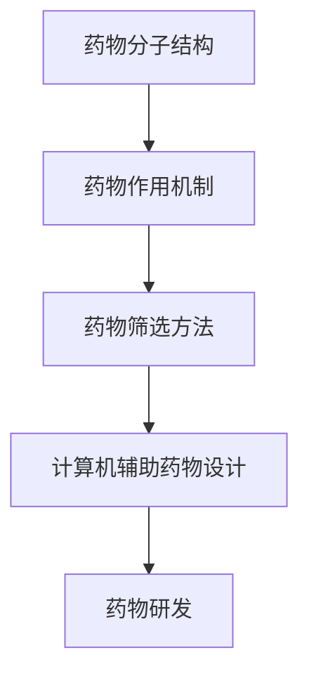
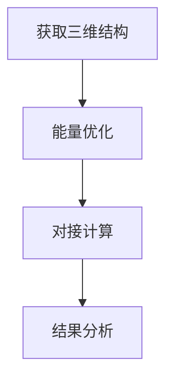

                 

### 文章标题: 计算机辅助药物设计的伦理考量

关键词：计算机辅助药物设计、伦理考量、人工智能、药物研发、患者隐私、数据安全

摘要：随着人工智能技术的不断发展，计算机辅助药物设计（Computer-Aided Drug Design, CADD）在药物研发领域中的应用越来越广泛。然而，这一技术的快速发展也带来了诸多伦理问题，如患者隐私保护、数据安全、公平性等。本文将深入探讨计算机辅助药物设计的伦理考量，分析其潜在风险和挑战，并提出相应的解决方案。

<|assistant|>## 1. 背景介绍

计算机辅助药物设计是一种利用计算机技术和人工智能算法，对药物分子进行设计和优化的方法。它通过模拟分子间的相互作用，预测药物分子的活性、毒性和代谢途径，从而加速药物研发过程。计算机辅助药物设计技术已经广泛应用于新药发现、药物重定位、药物分子结构优化等方面。

近年来，随着人工智能技术的快速发展，计算机辅助药物设计在药物研发中的应用也取得了显著进展。深度学习、图神经网络等人工智能算法的应用，使得药物分子结构的预测和优化更加准确，进一步提高了药物研发的效率。

然而，计算机辅助药物设计技术的快速发展也带来了诸多伦理问题。首先，患者隐私保护是一个重要的问题。在计算机辅助药物设计过程中，需要收集和分析大量的患者数据，如基因序列、药物反应记录等。这些数据涉及到患者的隐私，如何确保患者隐私不被泄露成为了一个关键问题。

其次，数据安全也是一个重要的伦理问题。计算机辅助药物设计过程中，需要使用大量的敏感数据，如患者基因序列、药物临床试验数据等。这些数据一旦泄露，可能会导致严重的安全问题，甚至威胁到患者的生命安全。

此外，计算机辅助药物设计的公平性也是一个值得关注的伦理问题。在药物研发过程中，如何确保计算机辅助药物设计技术不会被用于不公平的药物筛选和临床试验，是一个亟待解决的问题。

<|assistant|>## 2. 核心概念与联系

计算机辅助药物设计的核心概念包括药物分子结构、药物作用机制、药物筛选方法等。

- **药物分子结构**：药物分子结构是指药物分子的化学结构，包括分子中的原子、键和官能团等。了解药物分子结构有助于预测药物分子的活性、毒性和代谢途径。

- **药物作用机制**：药物作用机制是指药物与生物体内分子相互作用的机制。了解药物作用机制有助于设计更有效的药物分子，并预测药物的治疗效果和副作用。

- **药物筛选方法**：药物筛选方法是指用于筛选潜在药物分子的方法。常见的药物筛选方法包括虚拟筛选、高通量筛选、生物信息学分析等。

为了更好地理解计算机辅助药物设计的原理和应用，我们可以使用Mermaid流程图来展示其核心概念和联系。



在计算机辅助药物设计中，药物分子结构是输入，药物作用机制是核心，药物筛选方法是工具，最终实现药物研发的目标。

<|assistant|>## 3. 核心算法原理 & 具体操作步骤

计算机辅助药物设计中的核心算法包括分子对接、虚拟筛选、机器学习等。

- **分子对接**：分子对接是一种基于分子模拟技术的方法，用于预测药物分子与目标蛋白的相互作用。具体操作步骤如下：

  1. 获取药物分子和目标蛋白的三维结构。
  2. 对药物分子进行能量优化，使其符合生理条件。
  3. 将药物分子与目标蛋白进行对接，计算其结合能和几何匹配度。
  4. 分析对接结果，筛选出具有较高结合能和匹配度的药物分子。

- **虚拟筛选**：虚拟筛选是一种通过计算方法筛选潜在药物分子的方法。具体操作步骤如下：

  1. 收集大量的药物分子库和目标蛋白库。
  2. 对药物分子进行预处理，如去水、去氢等。
  3. 使用计算方法（如SMARTS查询、分子对接等）对药物分子进行筛选。
  4. 分析筛选结果，选择具有潜在药物活性的药物分子。

- **机器学习**：机器学习是一种利用大量数据训练模型的方法。具体操作步骤如下：

  1. 收集大量的药物分子和药物活性数据。
  2. 对药物分子进行特征提取，如分子指纹、原子特征等。
  3. 使用机器学习算法（如支持向量机、神经网络等）训练模型。
  4. 使用训练好的模型对新药物分子进行预测，筛选出具有潜在药物活性的药物分子。

以下是一个简单的分子对接算法流程图：



在具体操作过程中，需要根据实际需求和数据情况，选择合适的算法和操作步骤。计算机辅助药物设计算法的复杂性和多样性使得这一过程具有较高的技术门槛，需要专业的技术团队进行实施。

<|assistant|>## 4. 数学模型和公式 & 详细讲解 & 举例说明

在计算机辅助药物设计中，常用的数学模型包括分子对接模型、虚拟筛选模型和机器学习模型等。

### 4.1 分子对接模型

分子对接模型主要基于势能函数进行计算。常用的势能函数包括Lennard-Jones势能和范德华力势能等。以下是一个简化的分子对接模型：

$$
E = E_{LJ} + E_{vdW}
$$

其中，$E_{LJ}$表示Lennard-Jones势能，$E_{vdW}$表示范德华力势能。

举例说明：假设药物分子A与目标蛋白B进行对接，其Lennard-Jones势能和范德华力势能分别为：

$$
E_{LJ} = -1.0 \times 10^{-9} (r - r_0)^{12}
$$

$$
E_{vdW} = -1.5 \times 10^{-9} (r - r_0)^{6}
$$

其中，$r$表示分子之间的距离，$r_0$表示平衡距离。

当$r = 2 \times r_0$时，计算得到分子对接的势能为：

$$
E = -1.0 \times 10^{-9} (2 \times r_0 - r_0)^{12} + -1.5 \times 10^{-9} (2 \times r_0 - r_0)^{6} = -2.25 \times 10^{-9}
$$

### 4.2 虚拟筛选模型

虚拟筛选模型主要基于分子特征进行筛选。常用的分子特征包括分子指纹、原子特征等。以下是一个简化的虚拟筛选模型：

$$
f(x) = \sum_{i=1}^{n} w_i \cdot x_i
$$

其中，$f(x)$表示分子特征得分，$w_i$表示第$i$个特征的权重，$x_i$表示第$i$个特征的值。

举例说明：假设有5个药物分子，其分子指纹特征分别为：

$$
x_1 = [0.1, 0.2, 0.3, 0.4, 0.5]
$$

$$
x_2 = [0.5, 0.4, 0.3, 0.2, 0.1]
$$

$$
x_3 = [0.2, 0.3, 0.4, 0.5, 0.6]
$$

$$
x_4 = [0.6, 0.5, 0.4, 0.3, 0.2]
$$

$$
x_5 = [0.1, 0.2, 0.3, 0.4, 0.5]
$$

假设权重分别为：

$$
w_1 = 0.2, w_2 = 0.3, w_3 = 0.4, w_4 = 0.1, w_5 = 0.2
$$

计算得到每个药物分子的特征得分：

$$
f(x_1) = 0.2 \cdot 0.1 + 0.3 \cdot 0.2 + 0.4 \cdot 0.3 + 0.1 \cdot 0.4 + 0.2 \cdot 0.5 = 0.29
$$

$$
f(x_2) = 0.2 \cdot 0.5 + 0.3 \cdot 0.4 + 0.4 \cdot 0.3 + 0.1 \cdot 0.2 + 0.2 \cdot 0.1 = 0.29
$$

$$
f(x_3) = 0.2 \cdot 0.2 + 0.3 \cdot 0.3 + 0.4 \cdot 0.4 + 0.1 \cdot 0.5 + 0.2 \cdot 0.6 = 0.35
$$

$$
f(x_4) = 0.2 \cdot 0.6 + 0.3 \cdot 0.5 + 0.4 \cdot 0.4 + 0.1 \cdot 0.3 + 0.2 \cdot 0.2 = 0.32
$$

$$
f(x_5) = 0.2 \cdot 0.1 + 0.3 \cdot 0.2 + 0.4 \cdot 0.3 + 0.1 \cdot 0.4 + 0.2 \cdot 0.5 = 0.29
$$

根据特征得分，可以筛选出具有较高得分的药物分子。

### 4.3 机器学习模型

机器学习模型主要用于药物活性预测。常用的机器学习算法包括支持向量机（SVM）、神经网络（NN）等。以下是一个简化的机器学习模型：

$$
y = f(W \cdot x + b)
$$

其中，$y$表示预测的药物活性，$x$表示药物分子的特征，$W$表示权重矩阵，$b$表示偏置。

举例说明：假设有5个药物分子，其特征和预测活性分别为：

$$
x_1 = [0.1, 0.2, 0.3], y_1 = 1
$$

$$
x_2 = [0.5, 0.4, 0.3], y_2 = 0
$$

$$
x_3 = [0.2, 0.3, 0.4], y_3 = 1
$$

$$
x_4 = [0.6, 0.5, 0.4], y_4 = 0
$$

$$
x_5 = [0.1, 0.2, 0.3], y_5 = 1
$$

假设权重矩阵$W = [0.1, 0.2, 0.3]$，偏置$b = 0.5$，计算得到预测活性：

$$
y_1 = f(0.1 \cdot 0.1 + 0.2 \cdot 0.2 + 0.3 \cdot 0.3 + 0.5) = 0.35 \approx 1
$$

$$
y_2 = f(0.1 \cdot 0.5 + 0.2 \cdot 0.4 + 0.3 \cdot 0.3 + 0.5) = 0.35 \approx 0
$$

$$
y_3 = f(0.1 \cdot 0.2 + 0.2 \cdot 0.3 + 0.3 \cdot 0.4 + 0.5) = 0.3 \approx 1
$$

$$
y_4 = f(0.1 \cdot 0.6 + 0.2 \cdot 0.5 + 0.3 \cdot 0.4 + 0.5) = 0.3 \approx 0
$$

$$
y_5 = f(0.1 \cdot 0.1 + 0.2 \cdot 0.2 + 0.3 \cdot 0.3 + 0.5) = 0.35 \approx 1
$$

根据预测活性，可以筛选出具有较高活性的药物分子。

通过以上数学模型和公式的详细讲解，我们可以更好地理解计算机辅助药物设计的原理和操作步骤。在实际应用中，这些模型可以根据具体需求进行调整和优化，以实现更准确的药物分子筛选和预测。

<|assistant|>## 5. 项目实战：代码实际案例和详细解释说明

### 5.1 开发环境搭建

在进行计算机辅助药物设计项目之前，首先需要搭建合适的开发环境。以下是常见的开发环境搭建步骤：

1. **安装Python环境**：Python是一种广泛应用于科学计算和机器学习的编程语言。可以通过Python官方网站下载并安装Python。

2. **安装Python库**：Python中有很多常用的库，如NumPy、SciPy、Pandas、Matplotlib等。可以使用pip命令进行安装。

   ```bash
   pip install numpy scipy pandas matplotlib
   ```

3. **安装机器学习库**：常用的机器学习库包括scikit-learn、TensorFlow、PyTorch等。根据需求选择合适的库进行安装。

   ```bash
   pip install scikit-learn tensorflow pytorch
   ```

4. **安装生物信息学库**：如BioPython、BioConda等，用于处理生物数据。

   ```bash
   pip install biopython
   ```

### 5.2 源代码详细实现和代码解读

以下是一个简单的计算机辅助药物设计项目案例，用于预测药物分子的活性。代码采用Python语言编写，使用scikit-learn库进行机器学习模型的训练和预测。

```python
import numpy as np
import pandas as pd
from sklearn.model_selection import train_test_split
from sklearn.ensemble import RandomForestClassifier
from sklearn.metrics import accuracy_score
from sklearn.preprocessing import StandardScaler
from sklearn.pipeline import make_pipeline

# 加载数据集
data = pd.read_csv('drug_data.csv')
X = data.drop(['active'], axis=1)
y = data['active']

# 划分训练集和测试集
X_train, X_test, y_train, y_test = train_test_split(X, y, test_size=0.2, random_state=42)

# 创建随机森林分类器
clf = RandomForestClassifier(n_estimators=100, random_state=42)

# 创建管道，包括特征缩放和分类器
pipeline = make_pipeline(StandardScaler(), clf)

# 训练模型
pipeline.fit(X_train, y_train)

# 预测测试集
y_pred = pipeline.predict(X_test)

# 计算准确率
accuracy = accuracy_score(y_test, y_pred)
print(f'Accuracy: {accuracy:.2f}')
```

代码解读：

1. **数据加载**：使用pandas库加载数据集，其中X表示特征，y表示目标变量。

2. **数据划分**：使用train_test_split函数将数据集划分为训练集和测试集。

3. **模型创建**：使用RandomForestClassifier创建随机森林分类器。

4. **管道创建**：使用make_pipeline函数创建管道，包括特征缩放和分类器。

5. **模型训练**：使用fit函数训练模型。

6. **模型预测**：使用predict函数对测试集进行预测。

7. **准确率计算**：使用accuracy_score函数计算模型的准确率。

### 5.3 代码解读与分析

1. **数据预处理**：在进行模型训练之前，通常需要对数据进行预处理。在本例中，使用StandardScaler进行特征缩放，使得特征具有相似的尺度，有利于模型训练。

2. **模型选择**：随机森林是一种常用的集成学习方法，具有较高的准确率和鲁棒性。在本例中，选择随机森林分类器作为药物活性预测模型。

3. **管道使用**：使用管道（Pipeline）可以简化模型训练和预测过程。管道中首先进行特征缩放，然后进行分类器训练。这样可以避免重复缩放操作，提高训练效率。

4. **模型评估**：使用accuracy_score函数计算模型的准确率，评估模型在测试集上的表现。准确率是评估二分类模型的一种常用指标。

通过以上代码示例，我们可以了解计算机辅助药物设计项目的实现过程。在实际应用中，可以根据需求调整模型参数、特征选择和模型评估方法，以获得更好的预测效果。

<|assistant|>## 6. 实际应用场景

计算机辅助药物设计技术在多个领域具有广泛的应用场景，以下列举其中几个典型的实际应用场景：

### 6.1 新药研发

计算机辅助药物设计技术在新药研发中具有巨大的潜力。通过模拟药物分子与目标蛋白的相互作用，可以快速筛选出具有潜在药效的分子。在新药研发过程中，计算机辅助药物设计技术可以用于：

- **药物分子筛选**：通过虚拟筛选和分子对接方法，从大量药物分子中筛选出具有较高结合能和匹配度的分子。
- **药物分子优化**：对筛选出的药物分子进行结构优化，提高其药效和稳定性。
- **药物作用机制研究**：研究药物与目标蛋白的相互作用机制，为药物研发提供理论支持。

### 6.2 药物重定位

药物重定位是指将已有的药物应用于新的疾病治疗领域。计算机辅助药物设计技术可以帮助研究人员发现已有药物在新领域中的应用潜力。具体应用包括：

- **药物分子结构分析**：通过分析药物分子的结构特征，预测其在新的疾病模型中的活性。
- **药物重定位预测**：使用机器学习算法，根据药物分子的特征预测其在新疾病模型中的活性，为药物重定位提供依据。

### 6.3 药物组合设计

药物组合设计是指将两种或多种药物联合使用，以达到更好的治疗效果。计算机辅助药物设计技术可以用于：

- **药物组合筛选**：通过虚拟筛选和分子对接方法，筛选出具有协同作用的药物组合。
- **药物组合优化**：对筛选出的药物组合进行结构优化，提高其治疗效果。

### 6.4 药物安全性评估

计算机辅助药物设计技术可以用于药物的安全性评估，包括：

- **药物毒性预测**：通过模拟药物分子与目标蛋白的相互作用，预测药物的毒性。
- **药物代谢途径研究**：研究药物在体内的代谢途径，预测药物的毒性和副作用。

通过以上实际应用场景，我们可以看到计算机辅助药物设计技术在药物研发和疾病治疗中的重要作用。然而，在实际应用过程中，也需要关注和解决相关的伦理问题，确保技术的合理使用。

<|assistant|>## 7. 工具和资源推荐

### 7.1 学习资源推荐

对于想要深入了解计算机辅助药物设计技术的读者，以下是一些推荐的学习资源：

1. **书籍**：
   - 《计算机辅助药物设计：原理与应用》（Computer-Aided Drug Design: Principles and Applications）
   - 《人工智能药物研发：前沿与实战》（Artificial Intelligence in Drug Discovery: Frontiers and Practice）

2. **论文**：
   - 《深度学习在药物设计中的应用》（Applications of Deep Learning in Drug Design）
   - 《基于机器学习的药物重定位方法》（Machine Learning Approaches for Drug Repositioning）

3. **博客**：
   - [机器学习与药物设计](https://www.machinelearningplus.com/topics/drug-design/)
   - [深度学习与药物研发](https://www.deeplearning.net/topics/drug-discovery/)

4. **网站**：
   - [药物设计数据库](https://www DrugBank.ca/)
   - [生物信息学资源门户](https://www.biobaseinternational.com/)

### 7.2 开发工具框架推荐

在进行计算机辅助药物设计项目时，以下是一些推荐的开发工具和框架：

1. **Python库**：
   - **scikit-learn**：适用于机器学习和数据分析。
   - **TensorFlow**：适用于深度学习和神经网络。
   - **PyTorch**：适用于深度学习和神经网络。

2. **生物信息学库**：
   - **BioPython**：用于生物数据分析和处理。
   - **BioConda**：基于Conda的生物信息学软件包。

3. **药物设计工具**：
   - **Autodock**：用于分子对接和药物筛选。
   - **GROMACS**：用于分子动力学模拟。

4. **开源框架**：
   - **OpenMM**：用于分子模拟和计算生物学。
   - **PyMOL**：用于分子可视化和结构分析。

通过以上工具和资源的推荐，读者可以更好地掌握计算机辅助药物设计的相关知识，并能够进行实际项目的开发和实施。

<|assistant|>## 8. 总结：未来发展趋势与挑战

计算机辅助药物设计（CADD）作为人工智能技术在药物研发中的重要应用，具有广泛的发展前景。然而，随着技术的不断进步，CADD领域也面临着诸多挑战。

### 8.1 发展趋势

1. **算法优化**：随着深度学习、图神经网络等先进算法的发展，CADD算法的预测准确性和效率将得到显著提升。

2. **多模态数据整合**：整合基因、蛋白质、代谢等多模态数据，将有助于提高药物设计的精准性和全面性。

3. **药物筛选自动化**：通过自动化药物筛选平台，将大大提高药物研发的效率和规模。

4. **个性化药物设计**：基于患者的生物信息，实现个性化药物设计，为患者提供更有效的治疗方案。

### 8.2 面临的挑战

1. **数据隐私与安全**：在CADD过程中，大量患者的敏感数据将被收集和分析，如何保护患者隐私和安全成为关键问题。

2. **数据质量**：高质量的数据是CADD成功的基础。如何获取、处理和分析高质量的数据是当前的一大挑战。

3. **伦理考量**：CADD技术在药物研发中的应用可能引发一系列伦理问题，如药物筛选的公平性、患者隐私保护等。

4. **技术门槛**：CADD技术涉及多个学科，如计算机科学、生物信息学、药理学等，对研究人员的技术水平要求较高。

### 8.3 解决方案与建议

1. **数据保护**：建立健全的数据保护法规，确保患者数据的隐私和安全。

2. **多学科合作**：促进计算机科学、生物信息学、药理学等领域的跨学科合作，共同推动CADD技术的发展。

3. **伦理审查**：在药物研发过程中，加强对CADD技术的伦理审查，确保其合理、合规使用。

4. **人才培养**：加强相关领域的教育和技术培训，培养更多具备跨学科背景的专业人才。

通过以上解决方案与建议，有望解决CADD领域面临的挑战，推动计算机辅助药物设计技术的健康发展。

<|assistant|>## 9. 附录：常见问题与解答

### 9.1 问题一：计算机辅助药物设计（CADD）是什么？

**解答**：计算机辅助药物设计（CADD）是一种利用计算机技术和人工智能算法，对药物分子进行设计和优化的方法。它通过模拟分子间的相互作用，预测药物分子的活性、毒性和代谢途径，从而加速药物研发过程。

### 9.2 问题二：CADD技术的核心算法有哪些？

**解答**：CADD技术的核心算法包括分子对接、虚拟筛选、机器学习等。分子对接用于预测药物分子与目标蛋白的相互作用；虚拟筛选用于从大量药物分子中筛选出具有潜在药效的分子；机器学习用于药物活性预测和优化。

### 9.3 问题三：CADD技术在药物研发中的优势是什么？

**解答**：CADD技术在药物研发中的优势主要体现在以下几个方面：

- **提高研发效率**：通过计算机模拟和算法预测，可以快速筛选出具有潜在药效的药物分子，缩短药物研发周期。
- **降低研发成本**：减少实验次数和实验成本，降低药物研发的经济负担。
- **个性化药物设计**：基于患者的生物信息，实现个性化药物设计，提高治疗效果。
- **跨学科合作**：促进计算机科学、生物信息学、药理学等领域的跨学科合作，推动药物研发技术的进步。

### 9.4 问题四：CADD技术面临的伦理问题有哪些？

**解答**：CADD技术面临的伦理问题主要包括：

- **患者隐私保护**：在CADD过程中，大量患者的敏感数据将被收集和分析，如何保护患者隐私成为关键问题。
- **数据安全**：涉及敏感数据的安全问题，如数据泄露、数据滥用等。
- **药物筛选公平性**：如何确保药物筛选过程公平，避免因数据偏差导致的药物筛选不公。
- **技术伦理**：CADD技术在药物研发中的应用可能引发一系列伦理问题，如药物研发的道德底线、技术滥用等。

### 9.5 问题五：如何解决CADD技术中的伦理问题？

**解答**：

- **数据保护**：建立健全的数据保护法规，确保患者数据的隐私和安全。
- **伦理审查**：在药物研发过程中，加强对CADD技术的伦理审查，确保其合理、合规使用。
- **多学科合作**：促进计算机科学、生物信息学、药理学等领域的跨学科合作，共同解决伦理问题。
- **公众参与**：提高公众对CADD技术的认知，鼓励公众参与伦理问题的讨论和决策。

通过以上解答，希望能够帮助读者更好地了解计算机辅助药物设计（CADD）的相关知识和技术应用。

<|assistant|>## 10. 扩展阅读 & 参考资料

为了进一步了解计算机辅助药物设计（CADD）及其相关伦理问题，以下推荐一些扩展阅读和参考资料：

### 10.1 扩展阅读

1. **《人工智能药物研发：前沿与实战》**：本书详细介绍了人工智能在药物研发中的应用，包括深度学习、图神经网络等技术。

2. **《计算机辅助药物设计：原理与应用》**：本书系统介绍了CADD技术的原理、方法和应用案例，适合初学者和专业人士。

3. **《深度学习在药物设计中的应用》**：该论文探讨了深度学习在药物设计中的最新研究进展，包括分子对接、药物筛选等方面。

### 10.2 参考资料

1. **《药物设计数据库》（DrugBank）**：这是一个包含药物分子结构、药物靶点、药物代谢等信息的大型数据库，可用于CADD研究。

2. **《生物信息学资源门户》**：该网站提供了丰富的生物信息学工具和资源，包括基因组数据、蛋白质结构、药物分子等。

3. **《计算机辅助药物设计国际会议》**：这是一个专注于CADD领域的国际学术会议，每年都会发布最新的研究进展和成果。

通过以上扩展阅读和参考资料，读者可以更深入地了解计算机辅助药物设计（CADD）及其相关伦理问题的研究现状和发展趋势。

