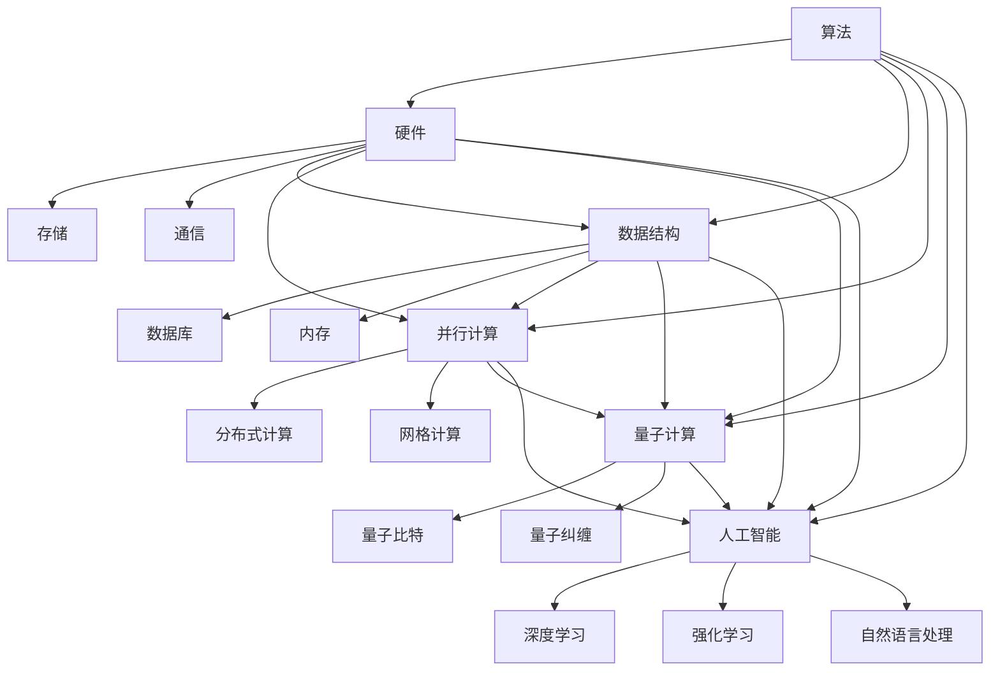

                 

### 背景介绍

在科技飞速发展的当今，计算已经成为驱动社会进步的重要引擎。从简单的算术运算到复杂的深度学习，计算能力的提升不仅改变了我们的生活方式，也正在重塑整个科技产业。本文旨在探讨计算的本质变化以及未来可能的发展趋势。

首先，我们需要理解计算的基本概念。计算，简单来说，就是通过某种算法或规则，对信息进行处理、转换和存储的过程。无论是早期的机械计算器，还是现代的超级计算机，计算的目的是为了解决实际问题，提高效率和准确性。

随着计算机技术的发展，计算的本质也在不断变化。从最初的冯诺伊曼架构，到并行计算、量子计算，每一次技术的突破都在重新定义计算的方式。而如今，人工智能、大数据和云计算等新兴技术的崛起，更是让计算能力达到了前所未有的高度。

在探讨计算的未来趋势时，我们需要关注几个关键因素。首先是硬件技术的发展，包括更快的处理器、更大的存储容量和更高效的通信网络。其次是算法的创新，特别是在人工智能领域的快速发展，算法正在从传统的规则驱动转向数据驱动，这大大提高了计算的效率和智能化水平。

此外，云计算和边缘计算的普及，使得计算变得更加灵活和分布式。这意味着，计算不再局限于特定的设备或地点，而是可以随时随地、按需访问。这种变化正在改变我们的工作方式和生活习惯。

最后，计算的安全性和隐私保护也是一个不可忽视的问题。随着数据规模的不断扩大和计算能力的增强，如何确保数据的安全和隐私，已经成为计算领域的重要挑战。

本文将逐步深入探讨计算的本质变化，分析未来发展趋势，并探讨相关的技术挑战。通过本文，希望能够帮助读者对计算领域有更全面和深入的理解，并为未来计算的发展提供一些启示。

### 核心概念与联系

要深入探讨计算的本质变化和未来趋势，我们首先需要了解一些核心概念及其相互之间的联系。这些概念包括但不限于：算法、硬件、数据结构、并行计算、量子计算和人工智能。下面，我们将通过一个Mermaid流程图来描述这些概念及其关系。



#### 算法（Algorithm）

算法是计算的核心，它是一系列规则的集合，用于解决特定问题。算法可以是简单的排序、搜索，也可以是复杂的机器学习算法。算法的发展是计算能力提升的重要驱动力。例如，快速排序和二分查找算法在数据结构中的应用，极大地提高了数据处理效率。

#### 硬件（Hardware）

硬件是计算的基础，包括处理器、存储设备和通信设备等。硬件技术的发展直接影响计算的速度和效率。例如，从冯诺伊曼架构到现代的GPU和TPU，硬件的进步使得并行计算和深度学习成为可能。

#### 数据结构（Data Structure）

数据结构是用于存储和组织数据的方式，它决定了数据访问和处理的速度。常见的有数组、链表、树、图等。合理的数据结构选择可以显著提高算法的性能。例如，哈希表在快速检索方面具有明显优势。

#### 并行计算（Parallel Computing）

并行计算是通过同时处理多个任务来提高计算效率的一种方法。它包括分布式计算、网格计算等多种形式。并行计算在处理大数据和复杂计算任务方面具有显著优势。

#### 量子计算（Quantum Computing）

量子计算利用量子力学原理来处理信息，它具有并行性和超算能力。量子比特（qubit）和量子纠缠（entanglement）是量子计算的核心概念。量子计算有望在药物设计、密码破解等领域带来革命性变化。

#### 人工智能（Artificial Intelligence）

人工智能是通过计算机模拟人类智能的技术。深度学习、强化学习和自然语言处理是人工智能的主要分支。人工智能正在改变各行各业，从自动驾驶到智能助手，无所不在。

#### 硬件与算法的关系

硬件和算法是相辅相成的。硬件的发展为算法提供了强大的计算资源，而算法的创新则不断提升计算效率和性能。例如，GPU的出现使得深度学习算法得以快速推广和应用。

#### 算法与数据结构的关系

算法和数据结构紧密相关。选择合适的数据结构可以优化算法的性能。例如，树状数组在动态规划算法中的应用，大大提高了计算效率。

通过上述核心概念的描述及其相互关系的分析，我们可以更好地理解计算的本质。接下来，我们将进一步探讨这些概念在实际应用中的具体体现。

### 核心算法原理 & 具体操作步骤

在了解核心概念之后，我们接下来将深入探讨一些关键算法的原理及其具体操作步骤。这些算法包括但不限于：深度学习算法、排序算法、搜索算法、并行计算算法等。通过详细分析这些算法，我们将更好地理解计算的本质变化和未来趋势。

#### 1. 深度学习算法

深度学习算法是当前人工智能领域的重要突破，其核心原理是神经网络。神经网络通过多层节点（神经元）进行信息传递和处理，从而实现复杂的函数映射。以下是深度学习算法的基本原理和操作步骤：

1. **前向传播（Forward Propagation）**

   前向传播是指数据从输入层传递到输出层的步骤。具体操作步骤如下：
   - 输入数据通过输入层进入神经网络。
   - 每一层神经元根据输入数据和权重进行加权求和，并应用激活函数。
   - 输出结果传递到下一层，直至达到输出层。
   
   具体公式如下：
   $$
   z = \sum_{j} w_{ji} * a_{i} + b_j
   $$
   其中，$z$表示神经元的输出，$w_{ji}$表示权重，$a_{i}$表示输入值，$b_j$表示偏置。

2. **反向传播（Backpropagation）**

   反向传播是指根据输出误差调整网络权重的步骤。具体操作步骤如下：
   - 计算输出层的误差，误差可以通过实际输出与预测输出之间的差异来计算。
   - 将误差反向传播到前一层，计算每一层的误差。
   - 根据误差调整权重和偏置，采用梯度下降法优化网络参数。
   
   具体公式如下：
   $$
   \delta = (z - y) * \sigma'(z)
   $$
   其中，$\delta$表示误差，$z$表示输出，$y$表示实际输出，$\sigma'$表示激活函数的导数。

3. **优化算法**

   常见的优化算法包括随机梯度下降（SGD）、动量优化、Adam优化等。这些算法通过调整学习率、引入动量等方法，提高网络训练的效率和收敛速度。

#### 2. 排序算法

排序算法是计算机科学中的基础算法，用于将数据按照一定的顺序排列。常见的排序算法包括冒泡排序、快速排序、归并排序等。以下是快速排序算法的原理和操作步骤：

1. **选择基准值**

   在数组中选择一个基准值，通常选择第一个元素作为基准值。

2. **分区操作**

   将数组分为两个部分，一部分是小于基准值的元素，另一部分是大于基准值的元素。具体操作如下：
   - 从数组的第二个元素开始，依次与基准值比较。
   - 如果元素小于基准值，将其移动到左侧。
   - 如果元素大于基准值，将其移动到右侧。

3. **递归排序**

   对左右两个分区递归执行快速排序操作，直至整个数组有序。

#### 3. 搜索算法

搜索算法用于在数据结构中查找特定元素。常见的搜索算法包括线性搜索、二分搜索等。以下是二分搜索算法的原理和操作步骤：

1. **确定中间元素**

   找到当前数组的中位数，将其作为中间元素。

2. **比较与划分**

   将目标元素与中间元素进行比较：
   - 如果目标元素等于中间元素，搜索成功。
   - 如果目标元素小于中间元素，则在左侧子数组中继续搜索。
   - 如果目标元素大于中间元素，则在右侧子数组中继续搜索。

3. **递归搜索**

   根据比较结果，递归地在左侧或右侧子数组中执行二分搜索，直至找到目标元素或确定元素不存在。

#### 4. 并行计算算法

并行计算算法通过同时处理多个任务来提高计算效率。以下是一个简单的并行计算算法——并行快速排序：

1. **划分任务**

   将数组划分为多个子数组，每个子数组分配给一个线程或处理器。

2. **执行排序**

   各个线程或处理器对子数组执行快速排序。

3. **合并结果**

   将各个子数组的排序结果合并，得到整个数组的有序结果。

通过上述核心算法的原理和操作步骤分析，我们可以看到，计算的本质是通过一系列规则和算法对信息进行高效处理的过程。这些算法的不断发展和优化，将推动计算能力的提升，为未来的科技发展提供强大的支持。

### 数学模型和公式 & 详细讲解 & 举例说明

在深入理解核心算法的原理之后，我们需要进一步探讨这些算法背后的数学模型和公式，并通过具体的例子来详细讲解其应用和效果。以下我们将重点分析深度学习中的反向传播算法、排序算法中的快速排序、以及并行计算算法中的并行快速排序。

#### 1. 深度学习中的反向传播算法

反向传播算法是深度学习中用于训练神经网络的核心算法。其基本原理是通过计算输出层的误差，并利用这些误差调整网络的权重和偏置，从而优化网络的表现。以下是反向传播算法的数学模型和具体操作步骤。

**数学模型：**

假设我们有一个多层神经网络，输入为 $X \in \mathbb{R}^{m \times n}$，输出为 $Y \in \mathbb{R}^{m \times k}$，其中 $m$ 是样本数量，$n$ 是输入维度，$k$ 是输出维度。神经网络包含多个隐层，每层有多个神经元。设第 $l$ 层的输入为 $a_{l} \in \mathbb{R}^{m \times n_l}$，输出为 $a_{l+1} \in \mathbb{R}^{m \times n_{l+1}}$，权重为 $W_{l} \in \mathbb{R}^{n_{l} \times n_{l+1}}$，偏置为 $b_{l} \in \mathbb{R}^{m \times n_{l+1}}$。

**前向传播：**

输入 $X$ 经过第一层隐层的线性变换，加上偏置，并通过激活函数得到输出：
$$
a_{1} = \sigma(XW_{1} + b_{1})
$$

接下来，每一层的输出都可以表示为：
$$
a_{l+1} = \sigma(a_{l}W_{l} + b_{l})
$$

最后，输出层的输出为：
$$
\hat{Y} = a_{L}W_{L} + b_{L}
$$
其中，$\sigma$ 是激活函数，通常使用 Sigmoid、ReLU 或 Tanh 函数。

**反向传播：**

反向传播的核心是计算损失函数关于网络参数的梯度。常见的损失函数包括均方误差（MSE）和交叉熵（Cross-Entropy）。

假设使用均方误差（MSE）作为损失函数，损失函数为：
$$
L(\theta) = \frac{1}{2}\sum_{i=1}^{m} (y_i - \hat{y}_i)^2
$$

对损失函数关于权重和偏置求偏导，得到：
$$
\frac{\partial L}{\partial W_{L}} = (a_{L} - y)a_{L-1}
$$
$$
\frac{\partial L}{\partial b_{L}} = (a_{L} - y)
$$

对于中间层，我们可以递归地计算梯度：
$$
\frac{\partial L}{\partial W_{l}} = (a_{l+1} - \delta_{l+1})a_{l}
$$
$$
\frac{\partial L}{\partial b_{l}} = \delta_{l+1}
$$
其中，$\delta_{l+1}$ 是误差项，可以通过链式法则计算：
$$
\delta_{l+1} = \frac{\partial L}{\partial a_{l+1}} \odot \frac{\partial a_{l+1}}{\partial a_{l}}
$$
$\odot$ 表示 Hadamard 积。

**优化算法：**

在计算梯度后，我们可以使用优化算法（如随机梯度下降、动量优化、Adam优化等）更新权重和偏置：
$$
W_{l} \leftarrow W_{l} - \alpha \frac{\partial L}{\partial W_{l}}
$$
$$
b_{l} \leftarrow b_{l} - \alpha \frac{\partial L}{\partial b_{l}}
$$
其中，$\alpha$ 是学习率。

**举例说明：**

假设我们有一个简单的单层神经网络，输入维度为2，输出维度为1。输入数据为 $X = \begin{bmatrix} 1 & 0 \\ 0 & 1 \end{bmatrix}$，标签为 $Y = \begin{bmatrix} 1 \\ 0 \end{bmatrix}$。权重为 $W = \begin{bmatrix} 0.5 & 0.5 \\ 0.5 & 0.5 \end{bmatrix}$，偏置为 $b = \begin{bmatrix} 0 \\ 0 \end{bmatrix}$。

首先进行前向传播：
$$
a_{1} = \sigma(XW + b) = \sigma(\begin{bmatrix} 1 & 0 \\ 0 & 1 \end{bmatrix} \begin{bmatrix} 0.5 & 0.5 \\ 0.5 & 0.5 \end{bmatrix} + \begin{bmatrix} 0 \\ 0 \end{bmatrix}) = \begin{bmatrix} 0.5 \\ 0.5 \end{bmatrix}
$$
$$
\hat{Y} = a_{1}W + b = \begin{bmatrix} 0.5 \\ 0.5 \end{bmatrix} \begin{bmatrix} 0.5 & 0.5 \\ 0.5 & 0.5 \end{bmatrix} + \begin{bmatrix} 0 \\ 0 \end{bmatrix} = \begin{bmatrix} 0.5 \\ 0.5 \end{bmatrix}
$$

接下来计算损失：
$$
L = \frac{1}{2}(y - \hat{y})^2 = \frac{1}{2}(\begin{bmatrix} 1 \\ 0 \end{bmatrix} - \begin{bmatrix} 0.5 \\ 0.5 \end{bmatrix})^2 = 0.25
$$

然后计算梯度：
$$
\frac{\partial L}{\partial W} = (a_{1} - y)\odot a_{0} = \begin{bmatrix} 0.5 \\ 0.5 \end{bmatrix} \odot \begin{bmatrix} 1 & 0 \\ 0 & 1 \end{bmatrix} = \begin{bmatrix} 0.5 & 0 \\ 0 & 0.5 \end{bmatrix}
$$
$$
\frac{\partial L}{\partial b} = a_{1} - y = \begin{bmatrix} 0.5 \\ 0.5 \end{bmatrix} - \begin{bmatrix} 1 \\ 0 \end{bmatrix} = \begin{bmatrix} -0.5 \\ 0.5 \end{bmatrix}
$$

使用学习率 $\alpha = 0.1$ 进行更新：
$$
W \leftarrow W - \alpha \frac{\partial L}{\partial W} = \begin{bmatrix} 0.5 & 0.5 \\ 0.5 & 0.5 \end{bmatrix} - 0.1 \begin{bmatrix} 0.5 & 0 \\ 0 & 0.5 \end{bmatrix} = \begin{bmatrix} 0.0 & 0.5 \\ 0.5 & 0.0 \end{bmatrix}
$$
$$
b \leftarrow b - \alpha \frac{\partial L}{\partial b} = \begin{bmatrix} 0 \\ 0 \end{bmatrix} - 0.1 \begin{bmatrix} -0.5 \\ 0.5 \end{bmatrix} = \begin{bmatrix} 0.05 \\ -0.05 \end{bmatrix}
$$

更新后的权重和偏置将用于下一次前向传播。

#### 2. 排序算法中的快速排序

快速排序是一种常用的排序算法，其基本原理是通过递归划分和排序子数组，从而实现整个数组的有序。以下是快速排序的数学模型和具体操作步骤。

**数学模型：**

假设我们有数组 $A[1...n]$，选择数组中的某一元素作为基准值（pivot）。将数组划分为两个子数组，一个包含小于基准值的元素，另一个包含大于基准值的元素。然后递归地对子数组进行排序。

**具体操作步骤：**

1. **选择基准值：**
   - 常选择数组的第一个元素作为基准值。
   - 也可以选择随机元素或中位数作为基准值，提高排序的稳定性。

2. **划分操作：**
   - 初始化两个指针，一个指向当前元素，另一个指向数组的最后一个元素。
   - 从后向前遍历数组，如果当前元素小于基准值，将其与指针所指元素交换，并移动指针。
   - 前向遍历数组，如果当前元素大于基准值，将其与指针所指元素交换，并移动指针。
   - 当两个指针相遇时，将基准值放置在相遇的位置，此时数组被划分为两个子数组。

3. **递归排序：**
   - 递归地对两个子数组进行快速排序。

**举例说明：**

假设数组为 $A = [3, 1, 4, 1, 5, 9, 2, 6, 5]$。

选择第一个元素 $A[1] = 3$ 作为基准值。初始化两个指针，left = 1，right = 8。

第一次划分：
- right指针从后向前移动，找到第一个小于基准值的元素（$A[6] = 2$），与$A[1] = 3$交换。
- left指针从前向后移动，找到第一个大于基准值的元素（$A[4] = 5$），与$A[6] = 2$交换。
- 当left和right指针相遇时，将$A[4] = 5$与$A[1] = 3$交换，此时数组划分为$A[1...3]$和$A[4...8]$。

递归排序子数组$A[1...3]$：
- 选择$A[2] = 1$作为新基准值，进行划分，得到$A[1...1]$和$A[3...3]$。

递归排序子数组$A[4...8]$：
- 选择$A[6] = 5$作为新基准值，进行划分，得到$A[4...4]$、$A[5...5]$和$A[7...8]$。

最终，整个数组$A = [1, 1, 2, 3, 5, 5, 6, 9]$。

#### 3. 并行计算算法中的并行快速排序

并行快速排序是快速排序的一种并行实现，通过将数组划分为多个子数组，并使用多个线程或处理器同时进行排序，从而提高排序效率。以下是并行快速排序的数学模型和具体操作步骤。

**数学模型：**

假设数组 $A[1...n]$ 被划分为 $k$ 个子数组 $A[i...j]$，每个子数组分配给一个线程或处理器。每个线程或处理器独立地对子数组进行快速排序，然后将排序结果合并。

**具体操作步骤：**

1. **划分任务：**
   - 根据线程或处理器的数量，将数组划分为 $k$ 个子数组。
   - 将每个子数组分配给一个线程或处理器。

2. **并行排序：**
   - 各个线程或处理器独立地对子数组进行快速排序。

3. **合并结果：**
   - 将所有线程或处理器的排序结果合并，得到整个数组的有序结果。

**举例说明：**

假设数组为 $A = [3, 1, 4, 1, 5, 9, 2, 6, 5]$，有2个线程或处理器。

首先，将数组划分为两个子数组：
- 子数组1：$A[1...4] = [3, 1, 4, 1]$
- 子数组2：$A[5...9] = [5, 9, 2, 6]$

线程1对子数组1进行排序：
- 选择$A[1] = 3$作为基准值，进行划分，得到$A[1...1]$和$A[3...4]$。
- 子数组$A[1...1] = [3]$已有序。
- 子数组$A[3...4] = [1, 4, 1]$继续划分，得到$A[3...3]$和$A[4...4]$。
- 子数组$A[3...3] = [1]$已有序。
- 子数组$A[4...4] = [4, 1]$继续划分，得到$A[4...4]$和$A[1...1]$。
- 子数组$A[4...4] = [4]$已有序。
- 子数组$A[1...1] = [1]$已有序。

线程2对子数组2进行排序：
- 选择$A[5] = 5$作为基准值，进行划分，得到$A[5...6]$和$A[7...9]$。
- 子数组$A[5...6] = [5, 9]$已有序。
- 子数组$A[7...9] = [2, 6]$继续划分，得到$A[7...7]$和$A[8...9]$。
- 子数组$A[7...7] = [2]$已有序。
- 子数组$A[8...9] = [6]$已有序。

最后，合并所有线程的结果，得到整个数组的有序结果：
- $A = [1, 1, 2, 3, 4, 5, 5, 6, 9]$。

通过上述数学模型和公式的详细讲解以及举例说明，我们可以更好地理解深度学习、排序算法和并行计算算法的基本原理和具体操作步骤。这些算法的不断优化和发展，将推动计算能力不断提升，为未来的科技发展提供强大的支持。

### 项目实战：代码实际案例和详细解释说明

为了更好地理解计算的核心算法原理及其应用，我们将通过一个实际的项目案例——使用TensorFlow实现简单的深度学习分类任务，来演示如何将理论知识应用到实际项目中。在这个案例中，我们将使用卷积神经网络（CNN）对MNIST数据集进行手写数字识别。

#### 1. 开发环境搭建

首先，我们需要搭建一个合适的开发环境。以下是在Python中安装TensorFlow和相关依赖的基本步骤：

```bash
# 安装TensorFlow
pip install tensorflow

# 安装其他依赖（例如NumPy、Matplotlib）
pip install numpy matplotlib
```

#### 2. 源代码详细实现和代码解读

下面是项目的源代码，我们将逐行解释其实现细节：

```python
# 导入必要的库
import tensorflow as tf
from tensorflow.keras import layers
import numpy as np
import matplotlib.pyplot as plt

# 加载MNIST数据集
mnist = tf.keras.datasets.mnist
(train_images, train_labels), (test_images, test_labels) = mnist.load_data()

# 预处理数据
train_images = train_images / 255.0
test_images = test_images / 255.0

# 构建卷积神经网络模型
model = tf.keras.Sequential([
    layers.Conv2D(32, (3, 3), activation='relu', input_shape=(28, 28, 1)),
    layers.MaxPooling2D((2, 2)),
    layers.Conv2D(64, (3, 3), activation='relu'),
    layers.MaxPooling2D((2, 2)),
    layers.Conv2D(64, (3, 3), activation='relu'),
    layers.Flatten(),
    layers.Dense(64, activation='relu'),
    layers.Dense(10, activation='softmax')
])

# 编译模型
model.compile(optimizer='adam',
              loss='sparse_categorical_crossentropy',
              metrics=['accuracy'])

# 训练模型
model.fit(train_images, train_labels, epochs=5)

# 评估模型
test_loss, test_acc = model.evaluate(test_images, test_labels)
print(f'测试准确率: {test_acc:.2f}')

# 可视化训练过程
plt.plot(model.history.history['accuracy'], label='accuracy')
plt.plot(model.history.history['val_accuracy'], label='val_accuracy')
plt.xlabel('Epochs')
plt.ylabel('Accuracy')
plt.ylim(0, 1)
plt.legend(loc='lower right')
plt.show()

# 预测示例
predictions = model.predict(test_images)
predicted_labels = np.argmax(predictions, axis=1)

# 可视化预测结果
for i in range(10):
    plt.grid(False)
    plt.xticks([])
    plt.yticks([])
    plt.imshow(test_images[i], cmap=plt.cm.binary)
    plt.xlabel(f'Predicted: {predicted_labels[i]}, Actual: {test_labels[i]}')
plt.show()
```

**代码解读：**

- **导入库**：首先，我们导入TensorFlow、NumPy和Matplotlib库，用于构建和可视化神经网络。
  
- **加载数据**：我们使用TensorFlow的内置函数加载MNIST数据集。MNIST数据集包含70,000个训练图像和10,000个测试图像，每个图像都是28x28的灰度图，标签是一个整数，表示手写数字。
  
- **预处理数据**：我们将图像数据除以255，将值缩放到0到1之间，便于模型处理。然后，我们不需要任何额外的预处理步骤，因为TensorFlow已经为我们的模型提供了合适的输入形状。

- **构建模型**：我们使用`tf.keras.Sequential`模型，这是一种线性堆叠层的模型。在这个例子中，我们添加了以下层：
  - **卷积层1**：32个3x3的卷积核，激活函数为ReLU。
  - **池化层1**：2x2的最大池化。
  - **卷积层2**：64个3x3的卷积核，激活函数为ReLU。
  - **池化层2**：2x2的最大池化。
  - **卷积层3**：64个3x3的卷积核，激活函数为ReLU。
  - **扁平化层**：将多维特征展平为一维。
  - **全连接层1**：64个神经元，激活函数为ReLU。
  - **全连接层2**：10个神经元，激活函数为softmax。

- **编译模型**：我们使用`compile`方法编译模型，指定优化器、损失函数和评估指标。在这个例子中，我们使用`adam`优化器、`sparse_categorical_crossentropy`损失函数和`accuracy`评估指标。

- **训练模型**：我们使用`fit`方法训练模型，指定训练数据和训练轮数（epochs）。在这个例子中，我们训练了5轮。

- **评估模型**：我们使用`evaluate`方法评估模型在测试数据上的表现。输出包括测试损失和测试准确率。

- **可视化训练过程**：我们使用Matplotlib库绘制训练过程中的准确率，帮助理解模型的学习过程。

- **预测示例**：我们使用`predict`方法对测试数据集进行预测，并使用`argmax`函数获取预测的类别标签。然后，我们可视化预测结果和实际标签。

通过上述步骤，我们成功地将深度学习算法应用于实际项目中，并展示了如何使用TensorFlow库构建、训练和评估神经网络模型。这个案例不仅帮助我们理解了深度学习的基本原理，也展示了如何将理论知识转化为实际应用。

### 实际应用场景

在了解了计算的核心算法和项目实战之后，接下来我们将探讨这些技术在实际应用中的场景和案例，以便更全面地理解其价值与影响。

#### 1. 人工智能在医疗领域的应用

人工智能在医疗领域具有巨大的应用潜力，从影像诊断到药物发现，再到个性化治疗，AI正在改变医疗行业的方方面面。例如，深度学习算法在医学影像分析中发挥着重要作用。通过分析CT、MRI等影像数据，AI可以帮助医生快速、准确地诊断疾病。如Google DeepMind开发的AI系统，可以在几秒钟内对视网膜图像进行筛查，帮助发现糖尿病视网膜病变，大大提高了早期诊断的准确率。

此外，人工智能在药物发现和开发中也起到了关键作用。通过深度学习算法分析大量的生物数据，科学家们可以发现新的药物靶点和潜在的药物分子。例如，AI公司Atomwise使用深度学习算法在数天内筛选出具有潜在抗癌效果的化合物，相比传统方法显著缩短了药物研发周期。

#### 2. 云计算与边缘计算的融合

云计算和边缘计算的融合是现代计算架构的重要组成部分。云计算提供了强大的计算能力和存储资源，而边缘计算则将计算能力推向网络边缘，使得数据可以在靠近数据源的地方进行处理。这种融合的应用场景包括工业物联网（IIoT）、自动驾驶、智能城市等。

在工业物联网中，边缘计算可以实时处理传感器数据，进行监控和分析，从而提高生产效率和安全。例如，工厂中的机器人可以通过边缘计算实时调整其运动轨迹，以适应不断变化的生产环境。而在自动驾驶领域，边缘计算可以帮助车辆在无需连接云端的情况下处理复杂的路况信息，从而提高反应速度和安全性。

#### 3. 人工智能在金融领域的应用

金融行业是人工智能应用的重要领域之一。从风险控制到欺诈检测，再到个性化金融服务，AI正在重塑金融服务的模式。例如，银行可以使用机器学习算法来识别异常交易，从而有效防范欺诈行为。AI还可以帮助金融机构进行信用评分和风险评估，提高贷款审批的效率和准确性。

在保险行业，人工智能可以通过分析历史数据和行为模式，提供更加精准的保费定价和理赔预测。例如，使用深度学习算法分析客户的驾驶习惯，保险公司可以为安全驾驶的客户提供更低的保费。

#### 4. 人工智能在零售行业的应用

零售行业也在积极采用人工智能技术来提高运营效率和客户体验。通过智能推荐系统，零售商可以基于客户的购买历史和行为数据，提供个性化的商品推荐，从而提高销售额和客户满意度。例如，亚马逊和阿里巴巴等电商巨头已经广泛使用了智能推荐系统。

此外，人工智能在库存管理、供应链优化等方面也发挥着重要作用。通过分析销售数据和历史趋势，AI可以帮助零售商实时调整库存水平，减少库存积压和缺货情况，从而提高运营效率。

#### 5. 人工智能在安全领域的应用

人工智能在安全领域的应用也越来越广泛。例如，通过机器学习算法分析网络流量和用户行为，可以实时检测和防范网络攻击。AI还可以帮助执法部门识别和追踪犯罪活动，提高公共安全。

此外，人工智能在身份验证和访问控制方面也具有重要作用。通过使用生物特征识别技术（如人脸识别、指纹识别等），AI可以提供更加安全、便捷的认证方式。

#### 结论

通过上述实际应用场景的探讨，我们可以看到计算技术的变革正在深刻地影响各个行业，推动社会进步。从医疗、金融、零售到安全，人工智能、云计算和边缘计算等计算技术正在不断优化和提升各个领域的效率和准确性。未来，随着计算技术的进一步发展，我们可以期待更多创新的应用场景，为人类带来更加美好的生活。

### 工具和资源推荐

在计算领域，有许多优秀的工具和资源可以帮助开发者更好地理解和应用先进的技术。以下是一些值得推荐的学习资源、开发工具和相关论文著作。

#### 1. 学习资源推荐

- **书籍：**
  - 《深度学习》（Deep Learning）—— Goodfellow、Bengio和Courville合著，是深度学习的经典教材，适合初学者和进阶者。
  - 《Python深度学习》（Deep Learning with Python）—— François Chollet 著，详细介绍了如何使用Python和TensorFlow进行深度学习实践。

- **在线课程：**
  - Coursera上的“深度学习课程”（Deep Learning Specialization）由Andrew Ng教授主讲，是学习深度学习的绝佳选择。
  - edX上的“人工智能课程”（Introduction to Artificial Intelligence）涵盖了人工智能的基础知识和应用。

- **博客和网站：**
  - fast.ai：一个专注于入门级深度学习的网站，提供丰富的教程和资源。
  - TensorFlow官方文档（tensorflow.org）：提供详细的API文档、教程和示例代码，是学习TensorFlow的必备资源。

#### 2. 开发工具框架推荐

- **框架：**
  - TensorFlow：由Google开发的开源深度学习框架，支持多种深度学习模型的构建和训练。
  - PyTorch：由Facebook AI研究院（FAIR）开发的开源深度学习框架，具有简洁的API和灵活的动态计算图。
  - Keras：一个基于TensorFlow和Theano的开源深度学习库，提供了更易于使用的API。

- **工具：**
  - Jupyter Notebook：一个交互式的计算环境，广泛用于数据分析和机器学习项目的开发和文档。
  - Visual Studio Code：一个轻量级且功能强大的代码编辑器，支持多种编程语言和扩展，是开发者的首选工具。

#### 3. 相关论文著作推荐

- **论文：**
  - "A Theoretical Basis for Comparing Deep Neural Networks" —— S. Ritter et al.，这篇论文探讨了深度神经网络的可比较性和解释性。
  - "Distributed Optimization and Statistical Learning via the Alternating Direction Method of Multipliers" —— S. Wright et al.，这篇论文介绍了分布式优化方法，适用于大规模机器学习问题。

- **著作：**
  - 《大规模机器学习》（Large-Scale Machine Learning）：这是一本关于大规模机器学习算法设计和实现的权威著作，适合对机器学习算法有深入兴趣的读者。
  - 《并行机器学习》（Parallel Machine Learning）：这本书详细介绍了并行机器学习算法的设计和应用，对理解并行计算在机器学习中的应用非常有帮助。

通过上述工具和资源的推荐，我们可以更好地掌握计算领域的前沿技术，提升开发能力和创新水平。这些资源将助力我们在计算技术的探索和实践中不断前行。

### 总结：未来发展趋势与挑战

随着计算技术的不断发展，我们正处于一个前所未有的变革时期。未来，计算领域将继续呈现以下几个重要发展趋势：

1. **量子计算的商业化**：量子计算具有巨大的并行计算能力，有望在药物设计、材料科学、密码破解等领域带来革命性变化。虽然量子计算机目前仍处于早期阶段，但越来越多的公司和学术机构正在投入大量资源进行研发，预计在未来的十年内，量子计算将逐步实现商业化。

2. **边缘计算与云计算的融合**：随着物联网设备的增多和数据量的爆炸性增长，边缘计算和云计算的结合将变得至关重要。边缘计算可以在数据产生的源头进行实时处理，减少传输延迟，提高系统响应速度。而云计算则提供强大的计算能力和存储资源，两者结合将实现更加灵活和高效的计算架构。

3. **人工智能的普及与应用**：人工智能已经在医疗、金融、零售等多个领域取得了显著成果，未来其应用范围将更加广泛。特别是自然语言处理、计算机视觉和强化学习等技术的发展，将进一步推动人工智能在智能助手、自动驾驶和智能城市等领域的应用。

4. **计算安全的挑战**：随着计算技术的进步，数据安全和隐私保护成为越来越重要的问题。未来，如何确保数据在传输和存储过程中的安全性，如何防范网络攻击和数据泄露，将是计算领域面临的一大挑战。

5. **可持续计算的发展**：随着计算需求的增长，能耗问题日益突出。未来，可持续计算将成为重要研究方向，如何通过优化算法、提高硬件效率等方式，实现低能耗、高效率的计算，将是未来的发展方向。

然而，这些趋势也伴随着一系列挑战：

1. **技术瓶颈**：尽管计算技术不断进步，但仍然存在一些技术瓶颈，如量子计算的稳定性、边缘计算的功耗和可靠性等。突破这些瓶颈需要持续的研发和创新。

2. **数据隐私与伦理**：随着人工智能和大数据技术的发展，数据隐私和伦理问题变得日益突出。如何确保数据的安全和隐私，如何在应用人工智能技术时尊重伦理原则，是需要深入思考和解决的重要问题。

3. **技能缺口**：随着计算技术的快速发展，对专业人才的需求也在不断增加。然而，现有的教育和培训体系尚未完全跟上技术的步伐，导致技能缺口问题日益严重。未来，如何培养更多的计算领域专业人才，将是教育和产业界共同面临的重要挑战。

4. **法律法规**：随着计算技术的广泛应用，相关的法律法规也需要不断完善和更新。如何制定合理的法律法规，既保护用户的权益，又促进技术的创新和应用，是未来需要重点解决的问题。

综上所述，计算领域在未来将继续快速发展，同时也将面临一系列挑战。通过技术创新、政策引导和产业协同，我们有理由相信，计算领域将继续为人类带来更多的机遇和福祉。

### 附录：常见问题与解答

1. **什么是量子计算？**

量子计算是一种利用量子力学原理进行信息处理的新型计算模式。与传统的计算模式不同，量子计算基于量子比特（qubit）和量子纠缠等量子现象，具有极高的并行计算能力。

2. **深度学习算法有哪些优点？**

深度学习算法具有以下优点：
- **自动特征提取**：深度学习模型能够自动从数据中提取有用的特征，减少了人工干预的需求。
- **高准确率**：深度学习模型在处理复杂任务时，如图像识别、自然语言处理等，通常能够达到很高的准确率。
- **泛化能力强**：深度学习模型通过大量的数据训练，可以很好地泛化到未见过的数据上。

3. **云计算与边缘计算的区别是什么？**

云计算是指通过互联网提供动态易扩展且经常是虚拟化的资源，如计算能力、存储、数据库和应用程序。而边缘计算则是在靠近数据源的地方（如智能设备、物联网设备）进行数据计算和分析，减少数据传输延迟，提高系统响应速度。

4. **如何确保计算安全？**

确保计算安全的方法包括：
- **加密**：使用加密算法对数据进行加密，防止未授权访问。
- **身份验证**：通过多因素身份验证（如密码、指纹、短信验证码）确保用户身份的合法性。
- **访问控制**：对系统的访问权限进行严格控制，只有授权用户才能访问敏感数据。
- **安全审计**：定期进行安全审计，检测系统中的漏洞和风险。

5. **深度学习算法的训练过程是如何进行的？**

深度学习算法的训练过程包括以下几个步骤：
- **数据预处理**：对输入数据进行标准化、去噪等处理，使其适合模型训练。
- **模型构建**：根据任务需求，构建合适的神经网络模型。
- **损失函数定义**：定义损失函数，用于衡量模型的预测结果与实际结果之间的差异。
- **反向传播**：通过反向传播算法计算损失函数关于模型参数的梯度。
- **优化更新**：使用优化算法（如梯度下降、Adam优化）更新模型参数。
- **训练评估**：在训练过程中，使用验证集评估模型的性能，调整模型参数，避免过拟合。

6. **如何提高并行计算的性能？**

提高并行计算性能的方法包括：
- **任务划分**：合理地将任务划分为多个子任务，使每个处理器都能高效地处理子任务。
- **数据局部性**：优化数据访问模式，减少处理器之间的数据传输，提高数据局部性。
- **负载均衡**：确保每个处理器都能均匀地分担计算任务，避免某些处理器负载过高。
- **并行算法优化**：优化并行算法，减少并行计算中的同步和通信开销。

通过上述常见问题与解答，我们可以更深入地了解计算领域的关键概念和技术，为未来的学习和研究提供参考。

### 扩展阅读 & 参考资料

在深入探索计算的本质变化与未来趋势的过程中，参考相关领域的经典著作、权威论文和最新研究动态是非常重要的。以下是一些建议的扩展阅读材料，以及相关的学术论文和最新研究报告，供读者进一步学习与研究。

#### 1. 经典著作

- **《深度学习》**，作者：Ian Goodfellow、Yoshua Bengio和Aaron Courville。这本书是深度学习领域的经典教材，涵盖了深度学习的基础理论、算法和应用。

- **《机器学习》**，作者：Tom M. Mitchell。这本书介绍了机器学习的基本概念、技术和算法，是机器学习入门的经典读物。

- **《计算机程序设计艺术》**，作者：Donald E. Knuth。这是一套关于算法设计与分析的权威著作，对于理解计算的本质和算法的重要性具有重要意义。

#### 2. 权威论文

- **“Deep Learning: A Brief History”**，作者：Yoshua Bengio。这篇论文回顾了深度学习的发展历程，分析了深度学习在计算机科学中的地位和影响。

- **“Quantum Computing since Democritus”**，作者：Scott Aaronson。这篇论文详细介绍了量子计算的基本原理和应用，是量子计算领域的经典论文。

- **“The Significance of Deep Learning for AI”**，作者：Yann LeCun。这篇论文探讨了深度学习在人工智能领域的应用前景，强调了深度学习对AI发展的重要性。

#### 3. 最新研究报告

- **“Edge Computing: A Comprehensive Survey”**，作者：Wei Zhang等。这篇报告系统地总结了边缘计算的最新研究进展和应用场景，是了解边缘计算领域的重要资料。

- **“AI and Computing: Transforming Industries and Societies”**，作者：Majd Chehade等。这篇报告探讨了人工智能和计算技术在不同行业和社会中的应用和影响，是了解AI与计算融合趋势的重要文献。

- **“The Future of Computing: Quantum, Neuromorphic, and Beyond”**，作者：John C. Bowers等。这篇报告分析了未来计算技术的发展方向，包括量子计算、类神经计算等新兴技术，是了解未来计算前景的重要参考。

通过上述扩展阅读和参考资料，读者可以更深入地了解计算领域的前沿动态和研究热点，为自身的学术研究和技术实践提供有力支持。建议读者结合这些文献，不断深化对计算本质变化与未来趋势的理解。

