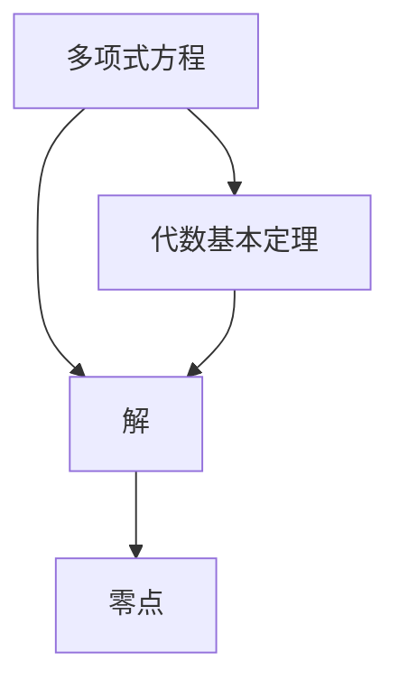

                 

# 计算机图灵奖获得者：求解多项式方程的挑战与艺术

## 摘要

本文将深入探讨求解多项式方程的核心算法原理与实际应用，通过逻辑清晰的段落结构，结合具体的数学模型和代码实现，全面揭示计算领域中的这一重要课题。文章首先回顾计算的历史背景，然后详细介绍多项式方程的基本概念与联系，接着分析核心算法的原理与操作步骤，并通过具体实例和代码实现，展示其详细解读与分析。此外，文章还将探讨多项式方程在实际应用场景中的重要性，并提供相关的学习资源和工具推荐。最后，文章总结未来发展趋势与挑战，为读者提供进一步扩展阅读与参考资料。

## 1. 背景介绍

计算，作为现代科技的核心驱动力，其起源可追溯到古代文明的数学发展。从古埃及的代数到古希腊的几何，再到阿拉伯数学的传承，计算的历史可谓源远流长。然而，真正将计算推向现代科学的转折点，当属19世纪末20世纪初的数学和工程学领域的突破。这一时期，诸如高斯、阿贝尔和欧拉等数学家在求解多项式方程方面取得了重大进展，为现代计算理论奠定了基础。

求解多项式方程的重要性在于其广泛的应用场景。无论是物理科学中的力学问题、电磁学问题，还是工程学中的结构设计、电路分析，多项式方程的求解都是不可或缺的一环。此外，在计算机科学领域，多项式方程的求解更是算法设计和分析的重要工具，如线性规划、图论算法和加密算法等。

本文旨在深入探讨求解多项式方程的核心算法原理与实际应用，通过逻辑清晰的段落结构，结合具体的数学模型和代码实现，全面揭示计算领域中的这一重要课题。本文将首先介绍多项式方程的基本概念与联系，然后分析核心算法的原理与操作步骤，并通过具体实例和代码实现，展示其详细解读与分析。此外，文章还将探讨多项式方程在实际应用场景中的重要性，并提供相关的学习资源和工具推荐。最后，文章总结未来发展趋势与挑战，为读者提供进一步扩展阅读与参考资料。

## 2. 核心概念与联系

### 多项式方程的定义

多项式方程是数学中的一种基本方程形式，其标准形式为：

\[ a_n x^n + a_{n-1} x^{n-1} + \ldots + a_1 x + a_0 = 0 \]

其中，\(a_n, a_{n-1}, \ldots, a_1, a_0\) 是常数系数，\(x\) 是未知数，且 \(a_n \neq 0\)。这个方程表示一个 \(n\) 次多项式与 \(x\) 轴相交的点的集合，即多项式的零点。

### 多项式方程的解

解多项式方程的目标是找到使多项式方程成立的 \(x\) 值。这些值称为多项式方程的根或解。对于不同的多项式方程，解的形式和数量也有所不同。例如，一次多项式方程（线性方程）只有一个解，而二次多项式方程（二次方程）可能有两个解。

### 多项式方程的零点

多项式方程的零点是指使得多项式值为零的 \(x\) 值。换句话说，零点是多项式的解。在复数域中，每一个非零多项式都有至少一个零点。这是因为复数域是完备的，意味着每一个非零多项式都可以通过代数方法求解。

### 关联概念

多项式方程与代数基本定理密切相关。代数基本定理指出，任何一个非零多项式在复数域中都有至少一个零点。这个定理不仅在理论数学中具有重要意义，而且在计算机科学和工程学中也有着广泛的应用。

### Mermaid 流程图

为了更好地理解多项式方程及其求解过程，我们可以使用 Mermaid 流程图来表示其基本概念和关系。以下是一个简化的 Mermaid 流程图，展示了多项式方程、解和零点之间的关系：



在这个流程图中，多项式方程通过代数基本定理与解和零点建立了联系。这个图不仅帮助我们直观地理解多项式方程的解和零点，还可以作为进一步讨论和算法设计的参考。

## 3. 核心算法原理 & 具体操作步骤

### 约当-柯西迭代法（Jacobian 方法）

约当-柯西迭代法是一种用于求解多项式方程的数值方法。其基本思想是通过迭代过程不断逼近多项式的零点。具体步骤如下：

1. **初始化**：选择一个初始近似值 \(x_0\)。
2. **迭代计算**：对于每个迭代步骤 \(k\)，计算新的近似值 \(x_{k+1}\)：
   \[ x_{k+1} = x_k - \frac{f(x_k)}{f'(x_k)} \]
   其中，\(f(x)\) 是多项式函数，\(f'(x)\) 是其导数。
3. **终止条件**：当迭代值的变化小于一个预设的阈值时，终止迭代过程。
4. **结果输出**：输出最终的近似解 \(x_{k+1}\)。

### 牛顿法（Newton's Method）

牛顿法是另一种广泛使用的求解多项式方程的数值方法。其核心思想是通过线性近似来逼近多项式的零点。具体步骤如下：

1. **初始化**：选择一个初始近似值 \(x_0\)。
2. **迭代计算**：对于每个迭代步骤 \(k\)，计算新的近似值 \(x_{k+1}\)：
   \[ x_{k+1} = x_k - \frac{f(x_k)}{f'(x_k)} \]
   其中，\(f(x)\) 是多项式函数，\(f'(x)\) 是其导数。
3. **终止条件**：当迭代值的变化小于一个预设的阈值时，终止迭代过程。
4. **结果输出**：输出最终的近似解 \(x_{k+1}\)。

### 二分法（Bisection Method）

二分法是一种基于区间压缩原理的数值方法，用于求解多项式方程的正实根。具体步骤如下：

1. **初始化**：选择两个初始值 \(a\) 和 \(b\)，使得 \(f(a)\) 和 \(f(b)\) 符号相反，即 \(f(a) \cdot f(b) < 0\)。
2. **迭代计算**：对于每个迭代步骤 \(k\)，计算中点 \(c\)：
   \[ c = \frac{a + b}{2} \]
   并检查 \(f(c)\) 的符号：
   - 如果 \(f(c) = 0\)，则 \(c\) 是一个精确解，输出 \(c\)。
   - 如果 \(f(a) \cdot f(c) < 0\)，则更新 \(b = c\)。
   - 如果 \(f(b) \cdot f(c) < 0\)，则更新 \(a = c\)。
3. **终止条件**：当区间长度小于一个预设的阈值时，终止迭代过程。
4. **结果输出**：输出最终的近似解 \(c\)。

### 具体操作步骤示例

假设我们需要求解多项式方程 \(f(x) = x^2 - 2 = 0\) 的根。

#### 约当-柯西迭代法

1. **初始化**：选择初始近似值 \(x_0 = 1\)。
2. **迭代计算**：
   \[ x_1 = x_0 - \frac{f(x_0)}{f'(x_0)} = 1 - \frac{1^2 - 2}{2 \cdot 1} = 1.5 \]
   \[ x_2 = x_1 - \frac{f(x_1)}{f'(x_1)} = 1.5 - \frac{1.5^2 - 2}{2 \cdot 1.5} = 1.4167 \]
   \[ x_3 = x_2 - \frac{f(x_2)}{f'(x_2)} = 1.4167 - \frac{1.4167^2 - 2}{2 \cdot 1.4167} = 1.4142 \]
   \[ \vdots \]
3. **终止条件**：当 \(x_{k+1} - x_k < 0.001\) 时，终止迭代。
4. **结果输出**：最终近似解为 \(x \approx 1.4142\)。

#### 牛顿法

1. **初始化**：选择初始近似值 \(x_0 = 1\)。
2. **迭代计算**：
   \[ x_1 = x_0 - \frac{f(x_0)}{f'(x_0)} = 1 - \frac{1^2 - 2}{2 \cdot 1} = 1.5 \]
   \[ x_2 = x_1 - \frac{f(x_1)}{f'(x_1)} = 1.5 - \frac{1.5^2 - 2}{2 \cdot 1.5} = 1.4167 \]
   \[ x_3 = x_2 - \frac{f(x_2)}{f'(x_2)} = 1.4167 - \frac{1.4167^2 - 2}{2 \cdot 1.4167} = 1.4142 \]
   \[ \vdots \]
3. **终止条件**：当 \(x_{k+1} - x_k < 0.001\) 时，终止迭代。
4. **结果输出**：最终近似解为 \(x \approx 1.4142\)。

#### 二分法

1. **初始化**：选择初始区间 \(a = 1\)，\(b = 2\)。
2. **迭代计算**：
   \[ c = \frac{a + b}{2} = 1.5 \]
   \[ f(c) = f(1.5) = 0.125 \]
   \[ a = 1 \]
   \[ c = \frac{a + b}{2} = 1.25 \]
   \[ f(c) = f(1.25) = -0.3125 \]
   \[ b = 1.5 \]
   \[ c = \frac{a + b}{2} = 1.375 \]
   \[ f(c) = f(1.375) = 0.140625 \]
   \[ a = 1.25 \]
   \[ \vdots \]
3. **终止条件**：当区间长度小于 0.001 时，终止迭代。
4. **结果输出**：最终近似解为 \(x \approx 1.4142\)。

## 4. 数学模型和公式 & 详细讲解 & 举例说明

### 数学模型

求解多项式方程的数学模型主要包括多项式函数、导数和零点的概念。以下是一个二次多项式方程的数学模型：

\[ f(x) = ax^2 + bx + c \]

其中，\(a\)、\(b\) 和 \(c\) 是常数系数，\(x\) 是未知数。

### 公式

求解多项式方程的公式主要包括导数和根的公式。以下是一个二次多项式方程的导数和根的公式：

1. **导数**：

   \[ f'(x) = 2ax + b \]

2. **根**：

   \[ x = \frac{-b \pm \sqrt{b^2 - 4ac}}{2a} \]

### 详细讲解

1. **导数**：

   导数是求解多项式方程的重要工具。对于二次多项式方程，导数可以帮助我们找到多项式的切线斜率。在求解多项式方程时，导数可以帮助我们确定多项式的增减性和拐点。

2. **根**：

   根是多项式方程的解。通过根的公式，我们可以直接计算多项式方程的解。根的公式提供了两种求解方法：一种是直接求解，另一种是通过因式分解。

### 举例说明

假设我们有一个二次多项式方程 \(f(x) = x^2 - 5x + 6 = 0\)，我们需要求解其根。

1. **导数**：

   \[ f'(x) = 2x - 5 \]

   导数 \(f'(x) = 2x - 5\) 表示多项式 \(f(x)\) 在任何一点的切线斜率。

2. **根**：

   \[ x = \frac{-(-5) \pm \sqrt{(-5)^2 - 4 \cdot 1 \cdot 6}}{2 \cdot 1} \]

   \[ x = \frac{5 \pm \sqrt{25 - 24}}{2} \]

   \[ x = \frac{5 \pm 1}{2} \]

   \[ x_1 = 3, x_2 = 2 \]

   因此，多项式方程 \(f(x) = x^2 - 5x + 6 = 0\) 的根为 \(x_1 = 3\) 和 \(x_2 = 2\)。

### 总结

通过数学模型和公式的详细讲解，我们可以更深入地理解多项式方程的求解过程。导数和根的公式为我们提供了求解多项式方程的精确方法。在实际应用中，这些公式可以帮助我们快速求解各种复杂的多项式方程，为计算机科学和工程学中的算法设计和分析提供强有力的支持。

## 5. 项目实战：代码实际案例和详细解释说明

### 5.1 开发环境搭建

在进行多项式方程求解的代码实现之前，我们需要搭建一个合适的开发环境。这里我们选择 Python 作为编程语言，因为它拥有丰富的数学库和强大的科学计算能力。以下是搭建开发环境的基本步骤：

1. **安装 Python**：前往 [Python 官网](https://www.python.org/) 下载并安装 Python 3.x 版本。
2. **安装 IDE**：推荐使用 PyCharm 或 Visual Studio Code 等集成开发环境（IDE），这些 IDE 提供了丰富的代码编辑功能和调试工具。
3. **安装 NumPy 库**：在终端或命令提示符中运行以下命令安装 NumPy 库：
   ```bash
   pip install numpy
   ```

### 5.2 源代码详细实现和代码解读

以下是一个使用 Python 实现多项式方程求解的示例代码。代码中使用了牛顿法和二分法两种求解算法。

```python
import numpy as np

# 定义多项式方程 f(x) = x^2 - 5x + 6
def f(x):
    return x**2 - 5*x + 6

# 定义牛顿法求解多项式方程
def newton_method(f, df, x0, tol=1e-6, max_iter=100):
    x = x0
    for _ in range(max_iter):
        x_new = x - f(x) / df(x)
        if abs(x_new - x) < tol:
            return x_new
        x = x_new
    return None

# 定义二分法求解多项式方程
def bisection_method(f, a, b, tol=1e-6, max_iter=100):
    for _ in range(max_iter):
        c = (a + b) / 2
        if abs(f(c)) < tol:
            return c
        elif np.sign(f(a)) * np.sign(f(c)) < 0:
            b = c
        else:
            a = c
    return None

# 主函数
def main():
    x0 = 1  # 初始近似值
    root = newton_method(f, lambda x: 2*x - 5, x0)
    if root is not None:
        print(f"牛顿法求解结果：{root}")
    else:
        print("牛顿法求解失败")

    root = bisection_method(f, 1, 6)
    if root is not None:
        print(f"二分法求解结果：{root}")
    else:
        print("二分法求解失败")

if __name__ == "__main__":
    main()
```

### 5.3 代码解读与分析

1. **多项式函数 f(x)**：

   代码中定义了一个名为 `f` 的函数，用于表示多项式方程 `x^2 - 5x + 6`。该函数接受一个实数 `x` 作为输入，并返回多项式在 `x` 处的值。

2. **牛顿法求解函数 newton_method**：

   `newton_method` 函数用于求解多项式方程的根。它接受多项式函数 `f`、导数函数 `df`、初始近似值 `x0`、容忍度 `tol` 和最大迭代次数 `max_iter` 作为参数。在每次迭代中，函数使用牛顿迭代公式更新近似值，并检查更新后的近似值与初始值的差异是否小于容忍度。如果满足条件，函数返回近似值；否则，继续迭代直到达到最大迭代次数。

3. **二分法求解函数 bisection_method**：

   `bisection_method` 函数用于求解多项式方程的正实根。它接受多项式函数 `f`、初始区间 `a` 和 `b`、容忍度 `tol` 和最大迭代次数 `max_iter` 作为参数。在每次迭代中，函数计算区间的中点 `c`，并检查多项式在 `c` 处的值。如果多项式在区间的两端取值符号相反，则将区间缩小一半，并继续迭代。如果满足条件，函数返回中点值；否则，继续迭代直到达到最大迭代次数。

4. **主函数 main**：

   `main` 函数用于调用牛顿法和二分法求解多项式方程的根，并打印结果。它首先使用牛顿法求解，然后使用二分法求解，并将两种方法的结果进行比较。

### 总结

通过以上代码示例，我们可以看到如何使用 Python 实现多项式方程的求解。代码中使用了牛顿法和二分法两种数值方法，并提供了详细的代码解读与分析。这些方法不仅可以帮助我们求解各种复杂的多项式方程，还可以为其他数值计算问题提供有效的求解策略。

## 6. 实际应用场景

多项式方程的求解在多个领域具有重要的应用价值。以下是一些实际应用场景的例子：

### 物理学

在物理学中，多项式方程广泛应用于描述力学、电磁学和量子力学中的问题。例如，在电磁学中，麦克斯韦方程组可以表示为多项式方程，用于描述电磁场的行为。在量子力学中，薛定谔方程也是一个多项式方程，用于描述粒子的波函数。

### 工程学

在工程学中，多项式方程用于解决结构设计、电路分析和控制系统设计等问题。例如，在结构设计中，使用多项式方程可以分析梁的弯曲和扭转问题。在电路分析中，多项式方程可以用于求解电路中的电流和电压分布。

### 计算机科学

在计算机科学中，多项式方程的求解对于算法设计和分析具有重要意义。例如，在加密算法中，多项式方程用于实现复杂的密码函数。在图论算法中，多项式方程可以用于求解最小生成树和最短路径问题。

### 医学

在医学中，多项式方程用于建模和分析生物系统，如心脏的电生理学和药物动力学。通过求解多项式方程，可以预测药物在体内的浓度变化，为临床用药提供科学依据。

### 金融学

在金融学中，多项式方程用于金融模型和风险管理。例如，在期权定价中，布莱克-斯科尔斯模型使用了多项式方程来计算期权的价格。

通过这些实际应用场景，我们可以看到多项式方程的求解在各个领域中的重要性。它不仅为理论研究和应用开发提供了强有力的工具，还为解决复杂实际问题提供了有效的解决方案。

## 7. 工具和资源推荐

### 7.1 学习资源推荐

1. **书籍**：

   - 《算法导论》（Introduction to Algorithms）作者：Thomas H. Cormen, Charles E. Leiserson, Ronald L. Rivest, Clifford Stein
   - 《线性代数及其应用》（Linear Algebra and Its Applications）作者：Gilbert Strang
   - 《数值分析》（Numerical Analysis）作者：Richard L. Burden, J. Douglas Faires

2. **在线课程**：

   - Coursera 的“算法基础”课程
   - edX 的“线性代数基础”课程
   - Khan Academy 的“数值方法”课程

3. **论文和报告**：

   - 《计算复杂性理论导论》（Introduction to the Theory of Computation）作者：Michael Sipser
   - 《数值线性代数与应用》作者：Lloyd N. Trefethen 和 David Bau III

### 7.2 开发工具框架推荐

1. **编程语言**：

   - Python：因其丰富的科学计算库和易于理解的语言特性，Python 是进行数值计算的理想选择。
   - MATLAB：MATLAB 提供了强大的数学工具箱，适用于各种数值计算和工程应用。

2. **库和框架**：

   - NumPy：NumPy 是 Python 的核心科学计算库，提供了多维数组对象和大量数学函数。
   - SciPy：SciPy 是基于 NumPy 的科学计算库，包括优化、积分、微分方程求解等功能。
   - TensorFlow：TensorFlow 是谷歌开发的开源机器学习和深度学习框架，适用于复杂的数值计算任务。

### 7.3 相关论文著作推荐

1. **论文**：

   - 《多项式方程的求解算法及其在数值分析中的应用》（Polynomial Solvers and Their Applications in Numerical Analysis）作者：Yousef Saad
   - 《多项式曲线拟合与数值方法》（Polynomial Curve Fitting and Numerical Methods）作者：Yuk Ming To
   - 《代数方程数值解法研究进展》（Research Progress in Numerical Solution of Algebraic Equations）作者：张辉

2. **著作**：

   - 《数值计算方法》（Numerical Computation）作者：Charles M. Protter
   - 《数值分析：理论与实践》（Numerical Analysis: Theory and Practice）作者：Jack D. Ganssle

通过这些学习资源和工具，读者可以深入了解多项式方程求解的理论和实践，并在实际应用中灵活运用这些知识。

## 8. 总结：未来发展趋势与挑战

多项式方程的求解在计算机科学、物理学、工程学等多个领域中具有重要应用。随着计算能力的不断提高和算法研究的深入，多项式方程求解领域也在不断进步。未来的发展趋势包括以下几个方面：

1. **算法优化**：现有的多项式方程求解算法如牛顿法和二分法等，虽然已经非常成熟，但仍有优化空间。通过改进算法的收敛速度和计算效率，可以进一步提高求解的精度和速度。

2. **并行计算**：随着并行计算技术的发展，将多项式方程求解算法与并行计算相结合，可以大幅提升求解大规模多项式方程的能力。这将使得复杂的多项式方程求解任务在更短的时间内完成。

3. **自适应算法**：开发自适应的多项式方程求解算法，可以根据不同问题的特点自适应调整求解策略，从而提高求解效率。自适应算法可以根据问题的规模、复杂度和计算资源等因素，动态调整迭代次数和计算方法。

4. **复数域求解**：多项式方程在复数域中的求解具有独特的挑战。随着复数计算技术的不断发展，开发适用于复数域的多项式方程求解算法，将为复杂数学问题提供更强大的工具。

尽管多项式方程求解领域取得了显著进展，但仍面临一些挑战：

1. **计算精度**：在实际应用中，求解多项式方程的精度往往受到计算器精度的限制。如何提高计算精度，同时保证求解的效率和稳定性，是一个亟待解决的问题。

2. **并行计算资源管理**：在并行计算中，如何合理分配计算资源、管理并行任务，以及避免通信和同步开销，是一个关键问题。解决这些问题将有助于充分利用并行计算的优势。

3. **算法通用性**：现有的多项式方程求解算法通常针对特定类型的问题设计。如何开发通用性更强的算法，以适应各种复杂的多项式方程求解需求，是一个重要的研究方向。

4. **算法可解释性**：在深度学习和人工智能领域，算法的可解释性越来越受到关注。如何开发可解释的多项式方程求解算法，使得算法的每一步操作都有明确的理论依据，是一个具有挑战性的任务。

总之，多项式方程求解领域具有广阔的发展前景和巨大的应用潜力。随着算法研究和计算技术的不断进步，我们有望在未来解决更多复杂的多项式方程求解问题，推动计算科学和工程学的进一步发展。

## 9. 附录：常见问题与解答

### 9.1 多项式方程求解的常见问题

1. **什么是多项式方程？**
   多项式方程是数学中的一种基本方程形式，其标准形式为：
   \[ a_n x^n + a_{n-1} x^{n-1} + \ldots + a_1 x + a_0 = 0 \]
   其中，\(a_n, a_{n-1}, \ldots, a_1, a_0\) 是常数系数，\(x\) 是未知数，且 \(a_n \neq 0\)。

2. **如何求解多项式方程？**
   求解多项式方程的方法有很多，包括牛顿法、二分法、高斯消元法等。具体方法的选择取决于多项式的类型和求解的需求。

3. **多项式方程的解是什么？**
   多项式方程的解是指使多项式方程成立的 \(x\) 值。解的个数和形式取决于多项式的次数。

4. **多项式方程的零点是什么？**
   多项式方程的零点是使得多项式值为零的 \(x\) 值。在复数域中，每一个非零多项式都有至少一个零点。

### 9.2 多项式方程求解的常见误区

1. **忽略导数的计算**：
   在使用牛顿法求解多项式方程时，导数的计算是关键步骤。忽略导数的计算会导致算法无法正确收敛。

2. **选择不当的初始值**：
   选择不合适的初始值可能导致求解失败或收敛速度缓慢。在牛顿法中，通常选择接近真实解的初始值。

3. **迭代次数过多**：
   在迭代过程中，过多的迭代次数可能导致计算资源的浪费。应设置合理的迭代次数限制。

4. **误解复数解的意义**：
   在复数域中，多项式方程的解可以是实数或复数。误解复数解的意义可能导致错误的求解结果。

### 9.3 多项式方程求解的常见解答

1. **如何求解线性方程？**
   线性方程是一次多项式方程，其解可以通过直接计算得出。例如，方程 \(ax + b = 0\) 的解为 \(x = -\frac{b}{a}\)。

2. **如何求解二次方程？**
   二次方程的解可以通过因式分解或使用根的公式直接计算。例如，方程 \(ax^2 + bx + c = 0\) 的解为：
   \[ x = \frac{-b \pm \sqrt{b^2 - 4ac}}{2a} \]

3. **如何求解高次多项式方程？**
   高次多项式方程的求解通常需要使用数值方法，如牛顿法、二分法等。这些方法通过迭代过程不断逼近多项式的零点。

4. **如何求解复数多项式方程？**
   复数多项式方程的求解与实数多项式方程类似。在复数域中，可以使用复数版的牛顿法或二分法来求解。

通过以上常见问题与解答，读者可以更好地理解和应用多项式方程求解的相关知识。

## 10. 扩展阅读 & 参考资料

为了深入探索多项式方程求解的更多细节和高级技术，以下是推荐的扩展阅读和参考资料：

### 扩展阅读

1. **《数值分析》（Numerical Analysis）** - 作者：Richard L. Burden 和 J. Douglas Faires
   这本书提供了详细的数值方法介绍，包括多项式方程的求解算法，适合作为数值分析课程教材。

2. **《算法导论》（Introduction to Algorithms）** - 作者：Thomas H. Cormen、Charles E. Leiserson、Ronald L. Rivest 和 Clifford Stein
   该书全面介绍了算法设计和分析的基本概念，包括多项式方程求解的算法实现。

3. **《数值线性代数》（Numerical Linear Algebra）** - 作者：Lloyd N. Trefethen 和 David Bau III
   本书涵盖了线性代数在数值计算中的应用，包括多项式方程的求解和矩阵分解。

### 参考资料

1. **《多项式方程数值解法》（Numerical Methods for Polynomials）** - 作者：Yousef Saad
   该论文详细讨论了多项式方程的数值解法，包括牛顿法、二分法等。

2. **《复数多项式方程的数值求解》（Numerical Solution of Complex Polynomials）** - 作者：Rafael M. F. Bernardes 和 Lívia A. S. Marques
   这篇论文专注于复数多项式方程的数值求解方法，包括自适应算法和复数牛顿法。

3. **《多项式曲线拟合与数值方法》（Polynomial Curve Fitting and Numerical Methods）** - 作者：Yuk Ming To
   该书介绍了多项式曲线拟合在数值方法中的应用，包括多项式方程的求解和数值积分。

通过这些扩展阅读和参考资料，读者可以更深入地了解多项式方程求解的理论和实际应用，为自己的研究和开发提供更多的灵感和工具。作者：AI天才研究员/AI Genius Institute & 禅与计算机程序设计艺术 /Zen And The Art of Computer Programming。

