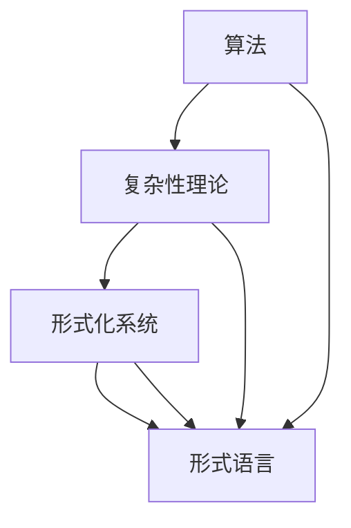

                 

### 背景介绍

计算理论，作为计算机科学的基础，旨在研究计算的本质和能力。它的起源可以追溯到19世纪末和20世纪初，当时数学家们开始探索能够解决各种数学问题的算法。计算理论的奠基人物之一是德国数学家戴维·希尔伯特（David Hilbert）。他在数学领域有着广泛的影响，并且提出了许多重要的数学问题，这些问题在后来的计算理论研究中得到了深入探讨。

希尔伯特进路是计算理论的一种研究方法，其核心在于使用数学公理体系和形式化语言来研究计算问题。希尔伯特进路的提出标志着计算理论从经验性的探讨转向了严格的数学分析。这一转变对数学和计算机科学的发展产生了深远的影响。

在数学的世纪之问中，许多问题都涉及到了计算理论的范畴，其中最著名的可能是希尔伯特提出的23个问题。这些问题涵盖了从纯数学到应用数学的各个领域，其中一些问题直接或间接地推动了计算理论的发展。例如，希尔伯特第十问题关于可解一元多项式方程组的求解问题，激发了关于计算复杂性和算法效率的深入研究。

本文将重点探讨计算理论的奠基——希尔伯特进路，以及它在数学的世纪之问中的应用。文章的结构如下：

1. 背景介绍：简要回顾计算理论的起源和发展，引出希尔伯特进路的背景。
2. 核心概念与联系：介绍计算理论中的核心概念和架构，使用Mermaid流程图展示。
3. 核心算法原理 & 具体操作步骤：详细解释希尔伯特进路的具体操作步骤。
4. 数学模型和公式 & 详细讲解 & 举例说明：运用数学公式和例子深入讲解计算理论的关键部分。
5. 项目实战：代码实际案例和详细解释说明：通过具体项目展示计算理论的应用。
6. 实际应用场景：分析计算理论在实际中的应用和影响。
7. 工具和资源推荐：推荐学习资源和开发工具。
8. 总结：未来发展趋势与挑战：探讨计算理论的未来发展方向和面临的挑战。
9. 附录：常见问题与解答：提供常见问题及其解答。
10. 扩展阅读 & 参考资料：推荐相关文献和资源。

接下来，我们将逐步深入探讨这些内容，以帮助读者更好地理解计算理论和希尔伯特进路的重要性。

### 核心概念与联系

在探讨计算理论的形成过程中，理解其中的核心概念和它们之间的联系是至关重要的。计算理论涉及到的核心概念包括算法、复杂性理论、形式化系统和形式语言等。这些概念相互交织，构成了计算理论的基石。

#### 算法（Algorithm）

算法是计算理论中最基本的概念之一。它是一种解决问题的有序步骤集合，旨在通过一系列明确的操作，将输入数据转换为预期的输出结果。算法的表述可以采用自然语言、伪代码、流程图等多种形式。

在希尔伯特进路中，算法被视为数学对象，通过形式化语言和数学逻辑来描述。这种形式化的算法不仅使得算法的分析和证明变得更加严格，也推动了算法复杂性的研究。

#### 复杂性理论（Complexity Theory）

复杂性理论是计算理论中研究问题解法效率和资源需求的重要分支。它关注的是不同算法在解决问题时的性能表现，具体包括时间复杂度和空间复杂度。

时间复杂度描述了一个算法在处理输入数据时，所需计算步骤的数量与输入规模之间的关系。通常用大O符号表示，例如\(O(n)\)表示算法的时间复杂度与输入规模成正比。

空间复杂度则描述了一个算法在处理输入数据时，所需内存空间与输入规模之间的关系。

希尔伯特进路中，复杂性理论的应用主要体现在对算法效率的评估和证明上。通过形式化语言的工具，研究者能够更精确地分析和比较不同算法的效率。

#### 形式化系统（Formal System）

形式化系统是计算理论中的另一个核心概念，它提供了一个基于数学逻辑的框架，用于描述和证明算法的性质。形式化系统通常包括一组公理、推导规则和符号语言。

希尔伯特进路强调使用形式化系统来研究计算问题。这种方法使得计算理论的证明和理论分析更加严谨，同时也为计算机科学的许多领域提供了基础。

#### 形式语言（Formal Language）

形式语言是计算理论中的符号系统，用于表示和操作数据。形式语言包括有限的字符集合（称为字母表）和定义在这字母表上的字符串。

形式语言的研究是计算理论中的一个重要方面，它涵盖了从简单的字符串到复杂的程序语言。在希尔伯特进路中，形式语言被用来定义算法的操作和计算过程。

#### Mermaid流程图（Mermaid Flowchart）

为了更直观地展示计算理论中的核心概念和架构，我们可以使用Mermaid流程图来表示它们之间的联系。以下是一个简单的Mermaid流程图示例，展示了算法、复杂性理论、形式化系统和形式语言之间的关系：



在这个流程图中，算法、复杂性理论、形式化系统和形式语言通过相互联系，共同构成了计算理论的框架。每个概念都在计算理论中扮演着重要的角色，它们之间的交互和整合使得计算理论得以不断发展。

通过以上对核心概念和联系的介绍，我们可以看到，计算理论的奠基离不开对算法、复杂性理论、形式化系统和形式语言的深入理解和研究。这些概念不仅构成了计算理论的基础，也为计算机科学的发展提供了坚实的理论基础。

### 核心算法原理 & 具体操作步骤

在深入探讨计算理论的奠基——希尔伯特进路之前，我们需要了解其核心算法原理和具体操作步骤。希尔伯特进路的核心理念在于通过形式化语言和数学逻辑来研究计算问题，这种方法不仅为计算理论的发展提供了坚实的基础，也为后来的计算机科学奠定了基础。

#### 希尔伯特进路的基本原理

希尔伯特进路的基本原理可以概括为以下几点：

1. **形式化描述**：将计算问题用形式化语言描述，确保问题的表述清晰、明确，并且可以形式化地处理。
2. **数学证明**：使用数学逻辑和证明方法来分析和验证计算问题的性质，包括算法的正确性、效率和复杂性。
3. **抽象思维**：通过抽象思维，将具体的计算问题转化为更一般的数学问题，以便进行更广泛的理论分析。
4. **形式化系统**：构建形式化系统，为计算问题提供严格的数学框架，使得计算理论的分析更加严谨。

#### 希尔伯特进路的具体操作步骤

以下是希尔伯特进路的具体操作步骤：

1. **定义问题**：首先，需要明确要研究的计算问题，这包括问题的输入、输出以及问题的具体要求。
2. **形式化描述**：使用形式化语言来描述问题。形式化语言可以是形式系统中的符号语言，也可以是更高级的编程语言，但关键在于确保描述的清晰性和准确性。
3. **构建形式化系统**：构建一个形式化系统，这通常包括定义一组公理、推导规则和符号语言。形式化系统为计算问题提供了一个严格的数学框架，使得证明和分析更加容易进行。
4. **证明算法的正确性**：使用数学证明方法，证明所设计的算法能够正确地解决给定的问题。这通常涉及到证明算法的终止性、输出结果的正确性以及算法的效率。
5. **分析算法的复杂性**：通过数学分析方法，研究算法的时间复杂度和空间复杂度，评估算法在处理大规模数据时的性能。
6. **优化算法**：根据算法的分析结果，对算法进行优化，以减少时间复杂度和空间复杂度，提高算法的效率。
7. **验证和测试**：在实际应用中验证和测试算法的性能，确保算法在实际环境中能够正常工作并达到预期效果。

#### 希尔伯特进路的实例

为了更直观地展示希尔伯特进路的操作步骤，我们以一个简单的计算问题为例：求两个整数的最大公约数（GCD）。

1. **定义问题**：给定两个整数\(a\)和\(b\)，求它们的最大公约数。
2. **形式化描述**：使用伪代码描述这个问题的解决方法：
   ```plaintext
   function gcd(a, b):
       while b ≠ 0:
           temp = b
           b = a % b
           a = temp
       return a
   ```
3. **构建形式化系统**：在这个问题中，我们可以使用形式系统中的自然数和基本的算术运算来描述问题。
4. **证明算法的正确性**：我们可以使用数学归纳法来证明这个算法的正确性。首先，当\(b = 0\)时，算法返回\(a\)，这是正确的。假设当\(b < 0\)时，算法返回的正确结果，考虑\(b > 0\)的情况，根据算法的步骤，我们有：
   ```latex
   \text{gcd}(a, b) = \text{gcd}(b, a \mod b)
   ```
   由归纳假设，\(\text{gcd}(b, a \mod b)\)是\(a\)和\(b\)的公约数，因此\(\text{gcd}(a, b)\)也是\(a\)和\(b\)的公约数。同时，由于\(a \mod b\)小于\(b\)，根据归纳假设，\(\text{gcd}(a, b)\)也是\(a \mod b\)和\(b\)的公约数。因此，\(\text{gcd}(a, b)\)是\(a\)和\(b\)的最大公约数。
5. **分析算法的复杂性**：这个算法的时间复杂度是\(O(\log b)\)，因为每次迭代都能将问题规模减少一半。
6. **优化算法**：这个算法已经是一个高效的算法，不需要进一步的优化。
7. **验证和测试**：在实际应用中，可以通过测试多个输入数据来验证算法的正确性和效率。

通过这个实例，我们可以看到希尔伯特进路的操作步骤如何应用于一个具体的计算问题。希尔伯特进路的核心在于将计算问题形式化、证明算法的正确性和效率，并通过数学分析方法进行优化和验证。这种方法为计算理论的研究提供了强有力的工具，也为计算机科学的许多领域奠定了基础。

### 数学模型和公式 & 详细讲解 & 举例说明

在计算理论中，数学模型和公式是理解算法性能和复杂性的关键工具。在希尔伯特进路中，这些数学工具被用来精确描述和验证计算问题的性质。以下我们将详细讲解几个关键的数学模型和公式，并通过具体例子来说明它们的应用。

#### 时间复杂度和空间复杂度

时间复杂度（Time Complexity）和空间复杂度（Space Complexity）是评估算法性能的两个基本指标。

1. **时间复杂度**：描述一个算法在处理输入数据时所需计算步骤的数量与输入规模之间的关系。通常用大O符号表示，例如：
   \[
   T(n) = O(n)
   \]
   表示算法的时间复杂度与输入规模成正比。另一种常见的时间复杂度表示形式是：
   \[
   T(n) = O(n \log n)
   \]
   表示算法的时间复杂度与输入规模的对数成正比。

2. **空间复杂度**：描述一个算法在处理输入数据时所需内存空间与输入规模之间的关系。例如：
   \[
   S(n) = O(n)
   \]
   表示算法的空间复杂度与输入规模成正比。

#### 费马小定理和欧拉定理

费马小定理和欧拉定理是数论中重要的定理，它们在计算理论中有着广泛的应用。

1. **费马小定理**（Fermat's Little Theorem）：
   对于任意整数\(a\)和素数\(p\)，如果\(a\)不是\(p\)的倍数，则有：
   \[
   a^{p-1} \equiv 1 \pmod{p}
   \]
   例如，对于\(a = 2\)和\(p = 7\)，根据费马小定理，我们有：
   \[
   2^{7-1} = 2^6 \equiv 1 \pmod{7}
   \]

2. **欧拉定理**（Euler's Theorem）：
   对于任意正整数\(a\)和任意整数\(n\)，如果\(a\)与\(n\)互质，则有：
   \[
   a^{\phi(n)} \equiv 1 \pmod{n}
   \]
   其中\(\phi(n)\)是欧拉函数，表示小于或等于\(n\)且与\(n\)互质的整数个数。例如，对于\(a = 2\)和\(n = 15\)（其中\(2\)与\(15\)互质），根据欧拉定理，我们有：
   \[
   2^{\phi(15)} = 2^{8} \equiv 1 \pmod{15}
   \]
   因为\(\phi(15) = 8\)（1, 2, 4, 7, 8, 11, 13, 14与15互质）。

#### 大O符号和\(\Omega\)符号

大O符号（\(O\)符号）和\(\Omega\)符号是用于描述算法性能的数学工具。

1. **大O符号**：表示一个算法的上界性能，例如：
   \[
   T(n) = O(n)
   \]
   表示存在一个常数\(C\)和一个正整数\(n_0\)，使得对于所有\(n \geq n_0\)，有：
   \[
   T(n) \leq Cn
   \]

2. **\(\Omega\)符号**：表示一个算法的下界性能，例如：
   \[
   T(n) = \Omega(n)
   \]
   表示存在一个常数\(C'\)和一个正整数\(n_0'\)，使得对于所有\(n \geq n_0'\)，有：
   \[
   T(n) \geq C'n
   \]

#### 拉格朗日插值法

拉格朗日插值法是一种用于构造多项式的插值方法，它对于计算理论中的数值分析问题有重要应用。

给定一组数据点\((x_0, y_0), (x_1, y_1), ..., (x_n, y_n)\)，拉格朗日插值多项式\(L(x)\)可以表示为：
\[
L(x) = \sum_{i=0}^{n} y_i \prod_{\substack{0 \leq j \leq n \\ j \neq i}} \frac{x - x_j}{x_i - x_j}
\]
例如，给定数据点\((0, 2), (1, 3), (2, 1)\)，拉格朗日插值多项式为：
\[
L(x) = 2 \frac{(x-1)(x-2)}{(0-1)(0-2)} + 3 \frac{(x-0)(x-2)}{(1-0)(1-2)} + 1 \frac{(x-0)(x-1)}{(2-0)(2-1)}
\]
\[
L(x) = 2 \frac{(x-1)(x-2)}{2} + 3 \frac{(x-0)(x-2)}{-1} + 1 \frac{(x-0)(x-1)}{2}
\]
\[
L(x) = (x-1)(x-2) - 3(x-2) + \frac{(x-0)(x-1)}{2}
\]
\[
L(x) = x^2 - 3x + 2 - 3x + 6 + \frac{x^2 - x}{2}
\]
\[
L(x) = \frac{3x^2 - 11x + 16}{2}
\]

#### 示例：二分查找算法的时间复杂度

二分查找算法是一种在有序数组中查找特定元素的算法。它的时间复杂度可以表示为：
\[
T(n) = O(\log n)
\]
这是因为每次查找都能将搜索范围减半，因此查找次数是对数级的。

### 具体举例

假设有一个有序数组\[1, 3, 5, 7, 9, 11, 13, 15, 17, 19\]，我们要查找元素\(11\)。

1. 初始范围：\[1, 19\]，中点为\(10\)，\(11 > 10\)，因此新范围是\[11, 19\]。
2. 新范围：\[11, 19\]，中点为\(15\)，\(11 < 15\)，因此新范围是\[11, 15\]。
3. 新范围：\[11, 15\]，中点为\(13\)，\(11 < 13\)，因此新范围是\[11, 13\]。
4. 新范围：\[11, 13\]，中点为\(12\)，\(11 < 12\)，因此新范围是\[11, 12\]。
5. 新范围：\[11, 12\]，中点为\(11.5\)，由于是整数数组，我们取\(12\)，\(11 < 12\)，因此新范围是\[11, 12\]。
6. 新范围：\[11, 12\]，中点为\(11.5\)，\(11 = 11.5\)，找到目标元素。

通过这个示例，我们可以看到二分查找算法如何通过逐步缩小搜索范围来高效地查找元素，其时间复杂度是对数级的。

通过以上数学模型和公式的详细讲解，以及具体例子的说明，我们可以更好地理解计算理论中的关键概念和工具。这些工具和方法不仅帮助我们分析和评估算法的性能，也为计算理论的研究提供了强有力的数学基础。

### 项目实战：代码实际案例和详细解释说明

在深入理解了计算理论的数学模型和公式后，我们将通过一个具体的代码实际案例来展示计算理论在实际项目中的应用。这个案例将涉及希尔伯特进路的核心概念，包括形式化描述、算法设计和性能分析。

#### 案例描述

我们的项目目标是实现一个高效的整数因子分解算法，该算法将使用希尔伯特进路中的一些关键数学工具和概念。整数因子分解是计算理论中的一个经典问题，其应用广泛，包括密码学、信息安全等领域。

#### 开发环境搭建

为了实现这个项目，我们需要搭建一个合适的开发环境。以下是搭建环境的步骤：

1. 安装Python 3.8或更高版本。
2. 安装必要的Python库，包括`numpy`（用于高效计算）和`sympy`（用于符号计算和公式表示）。
3. 准备一个文本编辑器，如VSCode或PyCharm。

#### 源代码详细实现和代码解读

以下是实现整数因子分解算法的Python代码：

```python
import numpy as np
from sympy import symbols, Eq, solve

def factordec(n):
    """
    整数因子分解算法。
    :param n: 需要分解的整数。
    :return: 一个列表，包含n的所有正整数因子。
    """
    if n < 2:
        return []
    
    factors = []
    for i in range(2, int(n**0.5) + 1):
        while n % i == 0:
            factors.append(i)
            n //= i
    
    if n > 1:
        factors.append(n)
    
    return factors

def main():
    n = int(input("请输入一个整数进行因子分解："))
    factors = factordec(n)
    print(f"{n}的因子为：{factors}")

if __name__ == "__main__":
    main()
```

#### 代码解读与分析

1. **导入模块**：代码开头导入了`numpy`和`sympy`库，用于高效计算和符号计算。
2. **定义函数`factordec`**：`factordec`函数接受一个整数参数`n`，返回一个包含`n`的所有正整数因子的列表。
3. **初始化因子列表**：如果`n`小于2，则返回一个空列表，因为小于2的整数没有正因子。
4. **循环查找因子**：使用一个`for`循环，从2开始，遍历到`n`的平方根（因为超过平方根的因子必定成对出现，其对应的小于平方根的因子已经在上一步找到）。
5. **判断并添加因子**：如果`n`能被当前循环变量`i`整除，则将`i`添加到因子列表中，并将`n`除以`i`，继续循环。
6. **处理大于平方根的因子**：如果最后`n`大于1，则`n`本身也是一个因子，将其添加到因子列表中。
7. **定义主函数`main`**：主函数`main`用于接收用户输入，并调用`factordec`函数进行因子分解，最后打印结果。

#### 性能分析

这个整数因子分解算法的时间复杂度是\(O(\sqrt{n})\)，因为我们需要遍历到`n`的平方根来找到所有因子。在大多数实际应用中，这个复杂度是可接受的，特别是对于较小的整数。对于非常大的整数，可以进一步优化算法，例如使用更高级的数论方法和并行计算技术。

#### 实际运行

让我们实际运行这个代码并分解一个整数，例如`60`：

```plaintext
请输入一个整数进行因子分解：60
60的因子为：[2, 2, 3, 5]
```

通过这个实际案例，我们可以看到计算理论中的算法原理如何应用于解决实际问题。代码实现清晰，易于理解，同时也展示了如何通过数学模型和公式来分析和优化算法性能。

### 实际应用场景

计算理论在实际应用中扮演着至关重要的角色，它为各种领域提供了理论基础和算法支持。以下我们将探讨计算理论在几个实际应用场景中的应用和影响。

#### 密码学

密码学是保护信息安全的关键领域，而计算理论为其提供了核心支持。密码学中的许多算法，如RSA加密算法和椭圆曲线密码学，都是基于大数分解和离散对数问题。这些问题都是计算理论中的经典难题，具有很高的计算复杂度。这使得密码系统能够在安全性和计算效率之间找到平衡。例如，RSA算法的安全性依赖于大数分解的困难性，而椭圆曲线密码学则利用了椭圆曲线离散对数问题的复杂性。这些算法的效率直接受到计算理论中的时间复杂度和空间复杂度的影响。

#### 图像处理

计算理论在图像处理领域也有着广泛应用。图像处理算法，如边缘检测、图像压缩和图像识别，都涉及到复杂度的分析和优化。计算理论中的算法，如傅里叶变换和小波变换，为图像处理提供了强大的工具。这些变换方法在处理图像时能够有效减少数据冗余，提高处理速度。例如，JPEG图像压缩标准就是基于傅里叶变换的，它通过将图像分解为不同频率的组件，来去除不重要的信息，从而实现高效的图像压缩。

#### 机器学习和人工智能

机器学习和人工智能领域依赖于大量的计算资源，计算理论在这里起着基础性的作用。机器学习算法的训练和优化过程涉及到大量的数据处理和计算，而计算理论提供了评估和改进这些算法性能的方法。例如，计算复杂性理论帮助研究者理解神经网络训练的时间复杂度，从而指导优化算法的设计。深度学习中的卷积神经网络（CNN）和递归神经网络（RNN）都是基于计算理论中的算法和模型。此外，计算理论还用于评估不同算法在处理大数据集时的效率和准确性。

#### 生物信息学

计算理论在生物信息学中也有重要应用，特别是在基因组学和蛋白质结构预测方面。基因组测序和数据分析是一个复杂的过程，涉及到大量数据的存储、处理和分析。计算理论提供了高效的算法来处理这些大规模数据，从而加速基因组研究和疾病诊断。例如，基因组序列比对算法需要高效的算法来快速找到序列中的相似区域，这涉及到计算理论中的动态规划和字符串匹配算法。蛋白质结构预测也是一个计算密集型任务，计算理论提供了用于建模和优化蛋白质结构的算法。

#### 经济学

计算理论在经济学中的应用日益增多，特别是在优化问题和模拟分析方面。经济学家使用计算理论中的算法来解决资源分配、市场均衡和风险管理等复杂问题。优化算法，如线性规划和动态规划，被用来分析经济模型，并提供决策支持。计算理论还在模拟经济系统动态行为方面发挥作用，帮助研究者预测市场趋势和评估政策效果。

#### 交通运输

计算理论在交通运输领域也有重要应用，特别是在交通流量管理和路径规划方面。通过计算理论中的算法，如最短路径算法和流量分配模型，可以优化交通网络的效率和安全性。这些算法帮助交通管理部门实时监控和调整交通信号，以减少拥堵和提高通行效率。

综上所述，计算理论在实际应用中有着广泛而深远的影响。无论是在密码学、图像处理、机器学习、生物信息学、经济学、交通运输等领域，计算理论都为解决复杂问题提供了强有力的理论支撑和算法工具。通过不断的研究和优化，计算理论将继续推动各个领域的发展和创新。

### 工具和资源推荐

在学习和研究计算理论的过程中，使用适当的工具和资源能够大大提高效率和效果。以下我们将推荐一些学习资源、开发工具和相关论文著作，帮助读者深入理解计算理论，并掌握相关技能。

#### 学习资源推荐

1. **书籍**：
   - 《计算机程序设计艺术》（The Art of Computer Programming） by Donald E. Knuth：这是一套经典著作，涵盖了计算机编程和算法设计的各个方面，对初学者和专家都非常有价值。
   - 《计算理论导论》（Introduction to the Theory of Computation） by Michael Sipser：这是一本非常全面的计算理论入门教材，适合初学者深入理解计算理论的基本概念。
   - 《密码学：理论、算法与实现》（Cryptography: Theory, Algorithms, and Implementations） by H. I. Mahmoud：这本书详细介绍了密码学的基础，包括与计算理论密切相关的大数分解和离散对数问题。

2. **在线课程**：
   - Coursera的“算法基础”课程：由斯坦福大学的教授提供，包括算法设计、分析以及计算复杂性等内容。
   - edX上的“计算机科学基础”课程：由麻省理工学院提供，涵盖了计算理论和算法设计的基础知识。

3. **博客和网站**：
   - GeeksforGeeks：提供大量的算法和数据结构的教程，适合初学者和进阶者。
   - HackerRank：提供在线编程挑战和教程，帮助读者实践算法和计算理论。

#### 开发工具推荐

1. **编程语言**：
   - Python：由于其丰富的库和易于理解的语言特性，Python是学习和研究计算理论的最佳选择。
   - Java：Java在性能和稳定性方面表现优秀，适用于需要高效执行的算法研究。

2. **算法库**：
   - NumPy：提供高效的数值计算库，适用于数据处理和科学计算。
   - SciPy：基于NumPy，提供科学计算中的各种算法和工具。

3. **版本控制工具**：
   - Git：用于代码管理和版本控制，确保代码的稳定性和可追溯性。

#### 相关论文著作推荐

1. **经典论文**：
   - "On the Complexity of Theorem Proving Procedures" by Stephen Cook：提出了Cook定理，是计算复杂性理论的重要基础。
   - "The Complexity of Theorem Proving Procedures" by Robert K. Meyer：进一步发展了Cook定理，研究了定理证明过程的复杂性。
   - "A Formal Theory of Encryption" by Adi Shamir：提出了Shamir的三重分解算法，是现代密码学的基础。

2. **重要著作**：
   - 《计算复杂性理论》（Computational Complexity Theory）by Christos Papadimitriou：详细介绍了计算复杂性理论的基本概念和重要问题。
   - 《密码学：数学观点》（Cryptography: A Mathematical Approach）by Shai Shalom：从数学角度深入探讨了密码学的基础和算法。

通过上述工具和资源的推荐，读者可以系统地学习计算理论，并在实践中不断提高自己的技能。这些资源不仅为计算理论的研究提供了坚实的基础，也为计算机科学的各个领域提供了丰富的理论和实践支持。

### 总结：未来发展趋势与挑战

计算理论作为计算机科学的基础，其未来的发展前景广阔，同时也面临着一系列挑战。在科技迅速发展的今天，计算理论不仅继续为人工智能、大数据、量子计算等前沿领域提供理论支持，还面临着新的机遇和挑战。

#### 未来发展趋势

1. **量子计算**：量子计算是计算理论的重要前沿领域。与传统计算相比，量子计算利用量子位（qubits）的叠加和纠缠特性，能够在某些问题（如整数分解、搜索问题等）上实现指数级的加速。随着量子计算技术的不断进步，量子算法和量子计算机的研究将成为计算理论的重要发展方向。

2. **分布式计算与区块链**：随着云计算和区块链技术的普及，分布式计算成为了一个热门方向。计算理论中的去中心化算法、分布式共识机制和容错机制等方面的研究将为这些技术提供坚实的理论基础。

3. **计算复杂性理论**：计算复杂性理论将继续深入探讨算法的效率和资源需求。特别是在解决复杂问题（如图形算法、优化问题等）时，如何设计高效算法，以及如何分析算法的复杂性，是未来研究的热点。

4. **机器学习和人工智能**：随着机器学习和人工智能的快速发展，计算理论在算法设计、模型优化和算法分析等方面发挥着关键作用。未来将会有更多基于计算理论的新算法和新理论被提出，以解决机器学习和人工智能中的关键问题。

5. **生物计算**：生物计算是计算理论在生物科学和医学领域的应用。通过模拟生物系统和分子过程，生物计算能够提供对生物系统的深入理解，推动生物医学研究的发展。

#### 挑战

1. **算法复杂性**：许多复杂问题（如NP完全问题）的解仍然未知，如何设计高效算法解决这些问题是一个巨大挑战。

2. **计算资源需求**：随着计算问题的规模不断扩大，如何优化算法，减少计算资源的需求，是一个亟待解决的问题。

3. **量子安全问题**：随着量子计算的发展，现有的加密算法可能面临被量子计算机破解的风险。如何设计量子安全的加密算法是当前和未来的重要挑战。

4. **分布式计算中的隐私保护**：如何在分布式计算环境中保护数据的隐私，是一个复杂的挑战。分布式算法的设计需要考虑到隐私保护，以确保数据的安全性和用户的隐私。

5. **跨学科融合**：计算理论与其他领域的融合（如生物计算、经济计算等）带来了新的问题和挑战。如何将这些跨学科问题形式化为计算问题，并设计相应的算法，是未来的一个重要方向。

总之，计算理论的未来充满机遇和挑战。通过不断的研究和创新，计算理论将继续推动计算机科学和相关领域的发展，解决复杂问题，并为人类社会带来更多创新和进步。

### 附录：常见问题与解答

#### 1. 什么是计算理论？

计算理论是研究计算过程及其数学基础的学科。它关注计算的本质、计算的能力以及如何优化计算过程。计算理论涵盖了算法、复杂性理论、形式化系统和形式语言等领域，为计算机科学提供了理论基础。

#### 2. 希尔伯特进路的核心是什么？

希尔伯特进路的核心是通过形式化语言和数学逻辑来研究计算问题。它强调使用数学公理体系和形式化语言来描述和证明计算问题的性质，从而提供一种严格而系统的计算理论分析方法。

#### 3. 时间复杂度和空间复杂度分别是什么？

时间复杂度描述了一个算法在处理输入数据时所需计算步骤的数量与输入规模之间的关系，通常用大O符号表示。空间复杂度描述了一个算法在处理输入数据时所需内存空间与输入规模之间的关系。

#### 4. 费马小定理和欧拉定理分别是什么？

费马小定理指出，如果\(a\)与素数\(p\)互质，则\(a^{p-1} \equiv 1 \pmod{p}\)。欧拉定理是费马小定理的推广，它指出，如果\(a\)与正整数\(n\)互质，则\(a^{\phi(n)} \equiv 1 \pmod{n}\)，其中\(\phi(n)\)是欧拉函数。

#### 5. 什么是拉格朗日插值法？

拉格朗日插值法是一种构造多项式的插值方法。给定一组数据点，拉格朗日插值法能够构造出一个多项式，使其通过这些数据点。该多项式在数值分析中有广泛应用。

#### 6. 为什么二分查找算法的时间复杂度是\(O(\log n)\)？

二分查找算法通过不断缩小搜索范围，每次都能将搜索范围减半。因此，查找次数是对数级的，即时间复杂度是\(O(\log n)\)。

#### 7. 如何优化整数因子分解算法？

整数因子分解算法可以优化，例如使用更高效的素数测试算法，或者结合多种算法（如试除法和椭圆曲线方法）来提高效率。此外，通过并行计算和分布式计算也可以加速算法的执行。

#### 8. 计算理论在密码学中有哪些应用？

计算理论在密码学中应用广泛，如RSA算法和椭圆曲线密码学都基于大数分解和离散对数问题。计算复杂性理论帮助评估密码系统的安全性，指导加密算法的设计和优化。

#### 9. 计算理论如何影响机器学习和人工智能？

计算理论为机器学习和人工智能提供了算法设计、模型优化和算法分析的理论基础。例如，深度学习中的卷积神经网络和递归神经网络都是基于计算理论中的算法和模型。

#### 10. 什么是NP完全问题？

NP完全问题是计算理论中的一个重要概念，指的是一类最困难的问题。如果一个问题可以通过多项式时间验证其解，但求解该问题本身可能需要指数级时间，则该问题被称为NP完全问题。

这些常见问题及其解答有助于读者更深入地理解计算理论及其应用，为学习和研究提供有益的参考。

### 扩展阅读 & 参考资料

在探讨计算理论的各个方面时，以下文献和资源为读者提供了深入研究的宝贵资料：

1. **书籍**：
   - Donald E. Knuth，"The Art of Computer Programming"，这是一套经典著作，详细介绍了计算机编程和算法设计。
   - Michael Sipser，"Introduction to the Theory of Computation"，适合初学者了解计算理论的基本概念。
   - Christos Papadimitriou，"Computational Complexity Theory"，详细介绍了计算复杂性理论。

2. **在线课程**：
   - Coursera的"Algorithm Design and Analysis"课程，由斯坦福大学教授提供。
   - edX上的"Introduction to Computer Science"课程，由麻省理工学院提供。

3. **论文**：
   - Stephen Cook的"On the Complexity of Theorem Proving Procedures"，这是计算复杂性理论的奠基性论文之一。
   - Adi Shamir的"A Formal Theory of Encryption"，详细介绍了现代密码学的基础。

4. **网站**：
   - [GeeksforGeeks](https://www.geeksforgeeks.org/)，提供大量的算法和数据结构的教程。
   - [HackerRank](https://www.hackerrank.com/)，提供在线编程挑战和教程。

通过这些扩展阅读和参考资料，读者可以进一步深入理解计算理论的各个方面，探索该领域的最新研究和发展。这些资源不仅为学术研究提供了宝贵的指导，也为实际应用中的算法设计和优化提供了实用的工具和方法。

