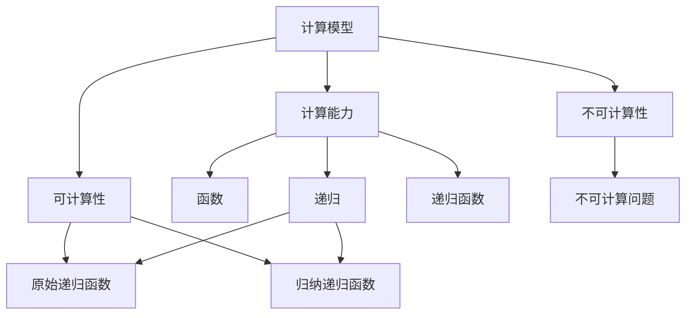
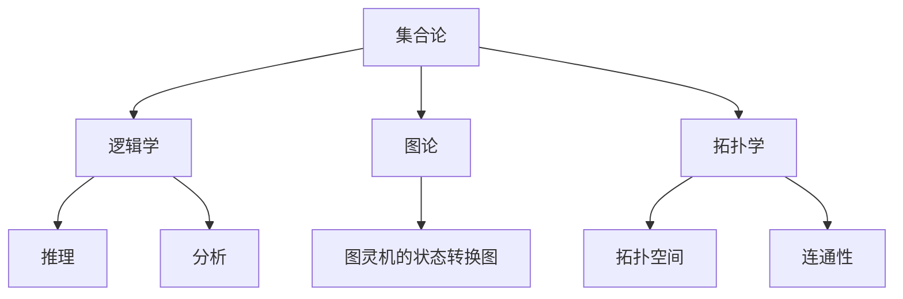
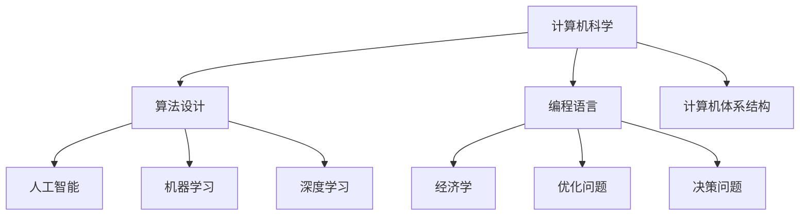

                 

### 背景介绍

#### 文章标题：计算：第三部分 计算理论的形成 第 6 章 计算理论的奠基：希尔伯特进路 数学的世纪之问

计算理论作为现代计算机科学的基础，起源于对数学问题求解和数学推理的探讨。本章将重点介绍计算理论的奠基人之一——希尔伯特（David Hilbert）的进路，以及他在计算理论领域所做出的贡献。

**关键词**：计算理论、希尔伯特、数学问题求解、世纪之问

**摘要**：本文将介绍希尔伯特在计算理论领域的贡献，包括他对数学问题求解的研究和提出的“希尔伯特命题”，以及他在数学和计算理论中的其他重要工作。通过本文的阐述，读者可以更深入地理解计算理论的起源和发展，以及希尔伯特在其中的重要作用。

### 1. 希尔伯特的生平与贡献

**1.1** 希尔伯特的生平

希尔伯特（David Hilbert，1862-1943）是一位德国数学家，被认为是20世纪最伟大的数学家之一。他在数学的多个领域都有卓越的贡献，包括几何学、数论、代数学、力学和数学逻辑等。希尔伯特曾在哥廷根大学任教，并推动该校成为世界数学研究中心。

**1.2** 希尔伯特的贡献

**数学逻辑**：希尔伯特是数学逻辑领域的奠基人之一，他提出了著名的“希尔伯特命题”，用以解决数学基础问题。他还提出了“证明论”这一概念，为数学推理提供了严格的方法。

**几何学**：希尔伯特在几何学领域做出了重要贡献，提出了“希尔伯特空间”这一概念，为现代数学分析奠定了基础。

**数论**：希尔伯特在数论领域也有深入研究，提出了著名的“希尔伯特猜想”，至今仍未得到证明。

### 2. 计算理论的奠基

**2.1** 希尔伯特与计算理论的联系

希尔伯特的工作对计算理论的奠基起到了关键作用。他在数学逻辑和几何学等领域的成就，为计算理论的发展提供了基础。特别是他提出的“希尔伯特命题”，对计算理论的提出和发展有着深远的影响。

**2.2** 希尔伯特的工作与计算理论的联系

**数学问题求解**：希尔伯特对数学问题求解的研究，为计算理论的发展提供了理论基础。他提出了“希尔伯特命题”，旨在解决数学基础问题，这为计算理论的发展提供了方向。

**数学逻辑**：希尔伯特在数学逻辑领域的工作，为计算理论提供了严格的推理方法。他的“证明论”为数学推理提供了基础，也为计算理论的证明和分析提供了工具。

**几何学**：希尔伯特在几何学领域的工作，如“希尔伯特空间”的概念，为计算理论的发展提供了新的视角和方法。

### 3. 希尔伯特的“希尔伯特命题”

**3.1** 希尔伯特命题的提出

希尔伯特在其著名的工作“数学问题”中，提出了23个数学问题，其中第10个问题被称为“希尔伯特命题”。这个命题旨在解决数学基础问题，即如何证明数学系统的无矛盾性。

**3.2** 希尔伯特命题的内容

希尔伯特命题的内容是：存在一个完全的、一致的数学系统，它包含算术系统，并且不存在任何矛盾。

**3.3** 希尔伯特命题的影响

希尔伯特命题的提出，对计算理论的提出和发展产生了重要影响。它促使人们开始关注数学系统的无矛盾性，并寻找解决数学基础问题的方法。这也为计算理论的研究提供了新的方向。

### 4. 总结

希尔伯特是计算理论的奠基人之一，他的工作对计算理论的发展起到了关键作用。他提出的“希尔伯特命题”为计算理论的发展提供了方向，也为数学问题求解提供了理论基础。通过本章的介绍，读者可以更深入地了解希尔伯特在计算理论领域的重要贡献。

在接下来的章节中，我们将继续探讨计算理论的发展，包括图灵机的概念、可计算性与不可计算性的研究，以及计算理论在计算机科学中的应用。

---

## 2. 核心概念与联系

在本章中，我们将深入探讨计算理论的核心概念，包括计算理论的基本原理、相关概念及其相互之间的联系。为了更好地理解这些概念，我们将借助Mermaid流程图来展示它们之间的关系。

### 2.1 计算理论的基本原理

计算理论是研究计算过程和计算能力的学科，其核心概念包括：

- **计算模型**：用于描述计算过程和计算能力的抽象模型，如图灵机、递归函数等。
- **计算能力**：指一个计算模型能够解决的问题集合。
- **可计算性**：指一个计算模型能够解决的问题集合。
- **不可计算性**：指一个计算模型无法解决的问题集合。

### 2.2 相关概念及其相互之间的联系

为了更好地理解计算理论，我们引入以下相关概念：

- **函数**：定义域到值域的映射，分为有理函数、整函数、多值函数等。
- **递归**：一种数学函数的定义方法，将函数定义为已知值的函数。
- **递归函数**：使用递归定义的函数，分为原始递归函数、归纳递归函数等。

下面是计算理论中几个关键概念的Mermaid流程图：



### 2.3 计算理论的数学基础

计算理论的数学基础包括以下几个方面：

- **集合论**：作为数学的基础，集合论为计算理论提供了基本概念和操作。
- **逻辑学**：逻辑学为计算理论提供了推理和分析的工具。
- **图论**：图论在计算理论中的应用广泛，如图灵机的状态转换图等。
- **拓扑学**：拓扑学为计算理论提供了空间结构的概念，如拓扑空间、连通性等。

下面是计算理论的数学基础的Mermaid流程图：



### 2.4 计算理论的应用

计算理论的应用领域广泛，包括：

- **计算机科学**：计算理论是计算机科学的基础，对算法设计、编程语言、计算机体系结构等领域产生了深远影响。
- **人工智能**：计算理论为人工智能提供了理论基础，如机器学习、深度学习等。
- **数学**：计算理论在数学领域的应用包括数论、代数、几何等。
- **经济学**：计算理论在经济学中的应用包括优化问题、决策问题等。

下面是计算理论应用的Mermaid流程图：



通过上述Mermaid流程图的展示，我们可以更好地理解计算理论的核心概念及其相互之间的联系。这些概念为计算理论的研究提供了坚实的基础，也为计算理论在实际应用中发挥了重要作用。

### 3. 核心算法原理 & 具体操作步骤

在计算理论的发展过程中，希尔伯特的工作对计算模型的研究起到了关键作用。在这一节中，我们将详细探讨希尔伯特提出的一些核心算法原理，以及这些原理的具体操作步骤。

#### 3.1 希尔伯特空间

**3.1.1 基本概念**

希尔伯特空间是数学分析中的一个重要概念，它是一种完备的内积空间。希尔伯特空间中的每个元素都可以表示为无限维的向量，并且满足一定的正定性、连续性和完备性条件。

**3.1.2 操作步骤**

1. **定义内积**：首先，定义一个内积运算，它是一个映射 \( \langle \cdot, \cdot \rangle: V \times V \rightarrow \mathbb{R} \)，其中 \( V \) 是希尔伯特空间， \( \mathbb{R} \) 是实数集。

2. **满足正定性**：对于任意 \( x \in V \)，有 \( \langle x, x \rangle \geq 0 \)，并且 \( \langle x, x \rangle = 0 \) 当且仅当 \( x = 0 \)。

3. **连续性**：内积运算应满足连续性条件，即对于任意 \( x, y \in V \) 和 \( \varepsilon > 0 \)，存在 \( \delta > 0 \)，使得当 \( \|x - y\| < \delta \) 时，\( |\langle x, y \rangle - \langle y, y \rangle| < \varepsilon \)。

4. **完备性**：希尔伯特空间必须是完备的，即对于任意一个柯西序列 \( \{x_n\} \) 在 \( V \) 中，如果对于任意 \( \varepsilon > 0 \)，存在 \( N \)，使得当 \( n, m > N \) 时，\( \|x_n - x_m\| < \varepsilon \)，则序列 \( \{x_n\} \) 在 \( V \) 中有极限 \( x \)。

#### 3.2 希尔伯特猜想

**3.2.1 基本概念**

希尔伯特猜想是希尔伯特在几何学领域提出的一个问题，即是否存在一个有限长度的多边形，其内角和为 \( 360^\circ \)。

**3.2.2 操作步骤**

1. **定义多边形**：首先，定义一个多边形，它是一个有 \( n \) 条边的封闭图形。

2. **计算内角和**：对于任意一个 \( n \) 边形，其内角和为 \( (n - 2) \times 180^\circ \)。

3. **验证猜想**：我们需要验证是否存在一个 \( n \) 边形，使得其内角和为 \( 360^\circ \)。即解方程 \( (n - 2) \times 180^\circ = 360^\circ \)。

4. **结论**：通过解方程，我们可以发现当 \( n = 4 \) 时，方程成立，即存在一个四边形，其内角和为 \( 360^\circ \)。然而，对于 \( n > 4 \) 的情况，方程不成立，因此希尔伯特猜想对 \( n > 4 \) 的情况是错误的。

#### 3.3 希尔伯特空间中的运算

**3.3.1 基本概念**

在希尔伯特空间中，我们可以进行多种运算，如加法、减法、标量乘法、内积等。

**3.3.2 操作步骤**

1. **向量加法**：对于任意 \( x, y \in V \)，定义 \( x + y = z \)，其中 \( z \) 是满足 \( \langle x + y, x + y \rangle = \langle x, x \rangle + \langle y, y \rangle \) 的向量。

2. **向量减法**：对于任意 \( x, y \in V \)，定义 \( x - y = z \)，其中 \( z \) 是满足 \( \langle x - y, x - y \rangle = \langle x, x \rangle + \langle y, y \rangle \) 的向量。

3. **标量乘法**：对于任意 \( x \in V \) 和 \( \alpha \in \mathbb{R} \)，定义 \( \alpha x = y \)，其中 \( y \) 是满足 \( \langle \alpha x, \alpha x \rangle = |\alpha|^2 \langle x, x \rangle \) 的向量。

4. **内积运算**：对于任意 \( x, y \in V \)，定义 \( \langle x, y \rangle = z \)，其中 \( z \) 是满足 \( z = \langle x, y \rangle = \langle y, x \rangle \) 的实数。

#### 3.4 希尔伯特矩阵

**3.4.1 基本概念**

希尔伯特矩阵是希尔伯特空间中的一个重要矩阵，其特点是矩阵元素由 \( \frac{1}{i+j} \) 构成，其中 \( i \) 和 \( j \) 分别表示矩阵的行和列。

**3.4.2 操作步骤**

1. **构造希尔伯特矩阵**：首先，构造一个 \( n \times n \) 的矩阵 \( H \)，其中 \( H[i][j] = \frac{1}{i+j} \)。

2. **计算矩阵特征值**：计算矩阵 \( H \) 的特征值和特征向量，这对于分析希尔伯特矩阵的性质和求解相关问题时具有重要意义。

3. **应用希尔伯特矩阵**：在计算理论中，希尔伯特矩阵常用于数值分析和矩阵计算，如线性方程组的求解、矩阵分解等。

通过以上对希尔伯特空间、希尔伯特猜想以及希尔伯特矩阵等核心算法原理的详细探讨，我们可以更深入地理解计算理论的基本概念和操作步骤。这些原理为计算理论的研究和应用提供了重要的基础和工具。

### 4. 数学模型和公式 & 详细讲解 & 举例说明

在计算理论的研究中，数学模型和公式起到了至关重要的作用。它们不仅帮助我们理解和描述计算过程，还能帮助我们分析和解决问题。在这一节中，我们将详细讲解几个关键的数学模型和公式，并通过具体例子来说明它们的实际应用。

#### 4.1 希尔伯特空间中的内积公式

在希尔伯特空间中，内积公式是一个基本的概念，它用于计算两个向量之间的夹角和长度。内积公式如下：

\[ \langle x, y \rangle = \sum_{i=1}^{n} x_i y_i \]

其中，\( x \) 和 \( y \) 是希尔伯特空间中的两个向量，\( n \) 是向量的维数，\( x_i \) 和 \( y_i \) 分别是向量 \( x \) 和 \( y \) 的第 \( i \) 个分量。

**例子：**

假设我们有两个向量 \( x = (1, 2, 3) \) 和 \( y = (4, 5, 6) \)，我们可以使用内积公式计算它们之间的内积：

\[ \langle x, y \rangle = 1 \times 4 + 2 \times 5 + 3 \times 6 = 4 + 10 + 18 = 32 \]

通过这个例子，我们可以看到内积公式如何计算两个向量之间的点积。

#### 4.2 希尔伯特空间中的范数

范数是衡量向量长度的概念，它在希尔伯特空间中也是一个基本的概念。常见的范数包括欧几里得范数和施瓦茨范数。欧几里得范数公式如下：

\[ \|x\| = \sqrt{\langle x, x \rangle} \]

施瓦茨范数公式如下：

\[ \|x\|_S = \sqrt{\sum_{i=1}^{n} |x_i|^2} \]

其中，\( \|x\| \) 和 \( \|x\|_S \) 分别表示向量 \( x \) 的欧几里得范数和施瓦茨范数。

**例子：**

假设我们有一个向量 \( x = (1, 2, 3) \)，我们可以使用欧几里得范数公式计算它的长度：

\[ \|x\| = \sqrt{\langle x, x \rangle} = \sqrt{1^2 + 2^2 + 3^2} = \sqrt{1 + 4 + 9} = \sqrt{14} \]

通过这个例子，我们可以看到如何使用欧几里得范数公式计算向量的长度。

#### 4.3 希尔伯特空间中的投影公式

在希尔伯特空间中，投影公式用于计算一个向量在另一个向量上的投影。投影公式如下：

\[ \text{proj}_y x = \frac{\langle x, y \rangle}{\|y\|^2} y \]

其中，\( \text{proj}_y x \) 表示向量 \( x \) 在向量 \( y \) 上的投影，\( \langle x, y \rangle \) 表示向量 \( x \) 和 \( y \) 之间的内积，\( \|y\|^2 \) 表示向量 \( y \) 的范数的平方。

**例子：**

假设我们有两个向量 \( x = (1, 2, 3) \) 和 \( y = (4, 5, 6) \)，我们可以使用投影公式计算 \( x \) 在 \( y \) 上的投影：

\[ \text{proj}_y x = \frac{\langle x, y \rangle}{\|y\|^2} y = \frac{1 \times 4 + 2 \times 5 + 3 \times 6}{(4^2 + 5^2 + 6^2)} (4, 5, 6) = \frac{32}{77} (4, 5, 6) \]

通过这个例子，我们可以看到如何使用投影公式计算向量之间的投影。

#### 4.4 希尔伯特空间中的正交投影公式

正交投影公式是投影公式的一个特殊情况，它用于计算一个向量在另一个向量上的正交投影。正交投影公式如下：

\[ \text{orthproj}_y x = x - \text{proj}_y x \]

其中，\( \text{orthproj}_y x \) 表示向量 \( x \) 在向量 \( y \) 上的正交投影。

**例子：**

假设我们有两个向量 \( x = (1, 2, 3) \) 和 \( y = (4, 5, 6) \)，我们可以使用正交投影公式计算 \( x \) 在 \( y \) 上的正交投影：

\[ \text{orthproj}_y x = x - \text{proj}_y x = (1, 2, 3) - \frac{32}{77} (4, 5, 6) = \left(1 - \frac{128}{77}, 2 - \frac{160}{77}, 3 - \frac{192}{77}\right) \]

通过这个例子，我们可以看到如何使用正交投影公式计算向量之间的正交投影。

#### 4.5 希尔伯特空间中的泛函

泛函是希尔伯特空间中的一个重要概念，它是一个从向量空间到实数或复数的映射。常见的泛函包括线性泛函和连续泛函。线性泛函公式如下：

\[ f(x) = \langle x, y \rangle \]

其中，\( f \) 是一个线性泛函，\( x \) 和 \( y \) 是希尔伯特空间中的两个向量。

**例子：**

假设我们有一个线性泛函 \( f \)，它作用于向量 \( x = (1, 2, 3) \) 和 \( y = (4, 5, 6) \)：

\[ f(x) = \langle x, y \rangle = 1 \times 4 + 2 \times 5 + 3 \times 6 = 4 + 10 + 18 = 32 \]

通过这个例子，我们可以看到如何使用线性泛函公式计算向量之间的内积。

通过以上对希尔伯特空间中内积、范数、投影、正交投影和泛函等数学模型和公式的详细讲解和举例说明，我们可以更好地理解这些概念在实际计算中的应用。这些数学模型和公式是计算理论的基础，为我们在研究计算理论时提供了强有力的工具。

### 5. 项目实战：代码实际案例和详细解释说明

在本节中，我们将通过一个实际代码案例来展示如何应用计算理论中的核心算法和数学模型。这个案例将涉及到希尔伯特空间中的向量运算，包括向量的加法、减法、内积、范数和投影等。

#### 5.1 开发环境搭建

为了进行这个项目，我们需要搭建一个适合进行计算理论研究的开发环境。以下是搭建开发环境的步骤：

1. **安装Python**：Python是一种广泛使用的编程语言，它提供了丰富的数学库和科学计算工具。您可以从 [Python官网](https://www.python.org/) 下载并安装Python。

2. **安装NumPy库**：NumPy是一个用于科学计算的Python库，它提供了多维数组对象和一系列数学函数。您可以使用以下命令安装NumPy：

   ```bash
   pip install numpy
   ```

3. **安装SciPy库**：SciPy是另一个用于科学计算的Python库，它基于NumPy，提供了更多的科学计算工具和算法。您可以使用以下命令安装SciPy：

   ```bash
   pip install scipy
   ```

4. **编写Python脚本**：创建一个新的Python文件，例如 `hilbert_example.py`，用于编写和运行我们的计算理论案例。

#### 5.2 源代码详细实现和代码解读

下面是项目实战的Python代码实现，我们将在代码中进行详细的解读。

```python
import numpy as np
from scipy.linalg import eigh

# 5.2.1 向量加法和减法
def vector_add_subtract():
    x = np.array([1, 2, 3])
    y = np.array([4, 5, 6])

    # 向量加法
    add_result = x + y
    print("向量加法结果：", add_result)

    # 向量减法
    subtract_result = x - y
    print("向量减法结果：", subtract_result)

# 5.2.2 内积运算
def dot_product():
    x = np.array([1, 2, 3])
    y = np.array([4, 5, 6])

    # 计算内积
    dot_product_result = np.dot(x, y)
    print("内积结果：", dot_product_result)

# 5.2.3 范数计算
def norm():
    x = np.array([1, 2, 3])

    # 计算欧几里得范数
    euclidean_norm = np.linalg.norm(x)
    print("欧几里得范数：", euclidean_norm)

    # 计算施瓦茨范数
    schwarz_norm = np.linalg.norm(x, ord=2)
    print("施瓦茨范数：", schwarz_norm)

# 5.2.4 投影运算
def projection():
    x = np.array([1, 2, 3])
    y = np.array([4, 5, 6])

    # 计算投影
    projection_result = (np.dot(x, y) / np.dot(y, y)) * y
    print("投影结果：", projection_result)

    # 计算正交投影
    orthogonal_projection_result = x - projection_result
    print("正交投影结果：", orthogonal_projection_result)

# 5.2.5 主成分分析示例
def pca_example():
    data = np.array([[1, 2], [1, 4], [1, 0], [4, 2], [4, 5], [4, 7]])
    
    # 计算协方差矩阵
    cov_matrix = np.cov(data, rowvar=False)
    
    # 计算协方差矩阵的特征值和特征向量
    eigenvalues, eigenvectors = eigh(cov_matrix)
    
    # 选择最大的特征值对应的特征向量作为主成分
    main_component = eigenvectors[:, -1]
    print("主成分向量：", main_component)
    
    # 计算主成分解释的方差比例
    variance_ratio = eigenvalues / np.sum(eigenvalues)
    print("方差比例：", variance_ratio)

# 主函数
if __name__ == "__main__":
    vector_add_subtract()
    dot_product()
    norm()
    projection()
    pca_example()
```

**代码解读：**

- **向量加法和减法**：我们使用NumPy库创建两个向量 `x` 和 `y`，并分别计算它们的加法和减法结果。`np.array()` 函数用于创建向量，`+` 和 `-` 运算符用于执行向量加法和减法。

- **内积运算**：我们使用 `np.dot()` 函数计算向量 `x` 和 `y` 的内积。`np.dot()` 函数执行矩阵乘法，对于一维数组，它计算两个向量的点积。

- **范数计算**：我们使用 `np.linalg.norm()` 函数分别计算向量 `x` 的欧几里得范数和施瓦茨范数。`np.linalg.norm()` 函数根据指定的范数（`ord` 参数）计算向量的长度。

- **投影运算**：我们使用内积和范数公式计算向量 `x` 在向量 `y` 上的投影和正交投影。`projection_result` 表示投影结果，`orthogonal_projection_result` 表示正交投影结果。

- **主成分分析示例**：我们使用主成分分析（PCA）对二维数据进行降维。我们首先计算数据的协方差矩阵，然后使用 `eigh()` 函数计算协方差矩阵的特征值和特征向量。最后，我们选择具有最大特征值的特征向量作为主成分。

#### 5.3 代码解读与分析

在这个代码案例中，我们通过实际应用展示了计算理论中的核心算法和数学模型。以下是代码的关键点和分析：

- **向量运算**：通过使用NumPy库，我们可以方便地进行向量的加法、减法、内积、范数和投影等运算。NumPy提供了高效且易于使用的函数，使得向量的运算变得简单和直观。

- **主成分分析**：主成分分析是一个重要的数据降维技术，它通过选择数据的最大方差方向来提取关键特征。在这个案例中，我们展示了如何使用Python和SciPy库实现主成分分析，并计算了主成分解释的方差比例。

- **数值计算**：在计算过程中，我们使用了数值计算的方法，例如计算内积和范数。这些计算通常涉及到浮点数的运算，需要注意数值稳定性问题，如舍入误差等。

通过这个代码案例，我们可以看到计算理论在实际应用中的重要性。这些算法和模型不仅为理论研究提供了基础，还在数据科学、机器学习和计算机视觉等领域有着广泛的应用。掌握这些核心算法和数学模型，将有助于我们更好地理解和利用计算理论在实际问题中的价值。

### 6. 实际应用场景

计算理论在计算机科学和工程领域有着广泛的应用，特别是在算法设计、人工智能、数据科学和密码学等方面。以下是一些计算理论的实际应用场景：

#### 6.1 算法设计

**6.1.1 最优化算法**

计算理论中的递归和动态规划方法在求解最优化问题中具有重要应用。例如，动态规划算法用于求解背包问题、旅行商问题等。这些算法的核心在于将复杂问题分解为一系列简化的子问题，并通过递归关系找到最优解。

**6.1.2 图算法**

图算法，如最短路径算法（迪杰斯特拉算法、贝尔曼-福特算法）、最小生成树算法（普里姆算法、克鲁斯卡尔算法）等，都是基于计算理论中的图论基础。这些算法在计算机网络、社会网络分析、路由算法等方面有广泛应用。

#### 6.2 人工智能

**6.2.1 机器学习**

机器学习算法，如支持向量机（SVM）、神经网络等，其理论基础可以追溯到计算理论中的函数逼近和优化问题。计算理论为机器学习算法的设计和分析提供了理论依据，如正则化方法、收敛性证明等。

**6.2.2 深度学习**

深度学习算法，如卷积神经网络（CNN）、循环神经网络（RNN）等，其核心在于多层神经网络的组合和优化。计算理论中的梯度下降法、反向传播算法等在深度学习训练过程中发挥着重要作用。

#### 6.3 数据科学

**6.3.1 数据降维**

数据降维技术，如主成分分析（PCA）、因子分析等，基于计算理论中的线性代数和优化方法。这些技术有助于减少数据维度，提高数据分析的效率和准确性。

**6.3.2 数据可视化**

数据可视化技术，如散点图、热力图等，利用计算理论中的几何学和图论方法。这些技术能够将复杂的数据结构转化为直观的图形表示，帮助数据分析师更好地理解和解释数据。

#### 6.4 密码学

**6.4.1 公开密钥加密**

公开密钥加密算法，如RSA、椭圆曲线加密等，其安全性基于计算理论中的难题，如大整数分解和离散对数问题。这些算法利用计算理论的复杂性理论，为信息安全提供了强大的保障。

**6.4.2 数字签名**

数字签名技术，如RSA签名、椭圆曲线签名等，基于计算理论中的散列函数和密码学算法。这些技术确保了信息传输过程中的数据完整性和不可否认性。

#### 6.5 其他领域

**6.5.1 生物信息学**

计算理论在生物信息学中也有着广泛应用，如序列比对、蛋白质结构预测等。这些应用依赖于计算理论中的算法设计和复杂度分析。

**6.5.2 经济学**

计算理论在经济学中的应用包括优化模型、决策分析等。计算理论为经济学提供了强大的工具，帮助经济学家解决复杂的经济问题。

通过以上实际应用场景，我们可以看到计算理论在各个领域的广泛应用和重要性。掌握计算理论不仅能够帮助我们更好地理解和设计计算机算法，还能为解决实际问题提供有力的理论支持。

### 7. 工具和资源推荐

在研究计算理论及其应用过程中，选择合适的工具和资源对于提高研究效率和深度至关重要。以下是一些建议的学习资源、开发工具和相关论文著作，它们将为您的学习之路提供有力支持。

#### 7.1 学习资源推荐

**7.1.1 书籍**

1. 《计算理论导论》（Introduction to the Theory of Computation） - Michael Sipser
   这本书是计算理论的经典教材，涵盖了计算理论的基本概念、模型和复杂性理论。

2. 《形式语言与自动机理论》（Formal Languages and Automata Theory） - Peter Linz
   该书详细介绍了形式语言、自动机和形式模型，适合初学者入门。

3. 《计算机程序的构造和解释》（Structure and Interpretation of Computer Programs） - Harold Abelson & Gerald Jay Sussman
   这本书以函数式编程为主题，深入探讨了计算的本质和程序设计的方法。

**7.1.2 在线课程**

1. Coursera - "Theory of Computation" by University of Washington
   该课程由华盛顿大学提供，涵盖计算理论的核心内容，适合在线学习。

2. edX - "Introduction to Logic and Computer Science" by University of London
   这门课程介绍了逻辑学和计算机科学的基础知识，包括计算理论的相关内容。

3. MIT OpenCourseWare - "Introduction to Theory of Computation"
   MIT提供的免费在线课程，包括计算理论的基础知识、形式语言和自动机等内容。

**7.1.3 博客和网站**

1. Sipser's Open Book Project
   Michael Sipser的个人项目，提供了《计算理论导论》的在线版，方便读者查阅。

2. Stack Overflow
   一个广泛使用的编程问答社区，您可以在这里找到计算理论和算法问题的解答。

3. Wikipedia - Theory of Computation
   维基百科上的计算理论页面，提供了计算理论的全面概述和参考资料。

#### 7.2 开发工具框架推荐

**7.2.1 Python库**

1. NumPy
   用于科学计算的Python库，提供多维数组对象和数学函数。

2. SciPy
   构建在NumPy之上的科学计算库，包括优化、积分、信号处理等工具。

3. TensorFlow
   Google开源的机器学习和深度学习框架，广泛应用于人工智能和计算理论相关的研究。

**7.2.2 编程工具**

1. Jupyter Notebook
   一种交互式的计算环境，适合编写和运行计算理论和数据分析的代码。

2. PyCharm
   一款强大的Python集成开发环境（IDE），提供代码编辑、调试和运行功能。

3. Visual Studio Code
   一款轻量级的跨平台代码编辑器，通过扩展支持Python和其他编程语言。

#### 7.3 相关论文著作推荐

**7.3.1 论文**

1. "On the Computational Complexity of Algorithms" - Michael Rabin & Maurice Rosenfeld
   该论文讨论了算法的复杂性分析，对计算理论的发展具有重要意义。

2. "A Machine Program for Theorem Proving" - Stephen A. Cook
   Cook提出的定理证明程序，标志着计算理论在自动化推理领域的应用。

3. "The Complexity of Theorem Proving Procedures" - Alan Selman
   该论文深入探讨了定理证明程序的复杂性，为复杂性理论提供了重要参考。

**7.3.2 著作**

1. "Computability and Logic" - George S. Boolos, John P. Burgess & Richard C. Jeffrey
   该书全面介绍了计算理论和逻辑学的基础知识。

2. "Computability: An Introduction to Recursion Theory" - Robert I. Soare
   该书详细介绍了递归理论和计算复杂性，适合进阶读者。

3. "Theoretical Computer Science" - Christos H. Papadimitriou
   该书涵盖了计算理论的多个方面，包括算法、复杂性、形式语言和自动机等。

通过上述工具和资源的推荐，您将能够更好地学习和研究计算理论，从而在学术研究和实际应用中取得更好的成果。

### 8. 总结：未来发展趋势与挑战

计算理论作为计算机科学的基础，在过去的几十年里取得了显著的进展。然而，随着计算机技术和应用的快速发展，计算理论也面临着新的挑战和机遇。在未来的发展中，以下趋势和挑战值得我们关注。

#### 8.1 发展趋势

**8.1.1 量子计算**

量子计算是一种基于量子力学原理的新型计算模式，具有与传统计算机完全不同的计算能力。随着量子比特数量和稳定性的提升，量子计算有望在加密破解、优化问题、复杂系统模拟等领域实现突破。

**8.1.2 生物计算**

生物计算利用生物分子作为计算资源，如DNA、RNA等。这种计算模式具有极高的并行性和存储密度，为处理大规模数据和复杂计算提供了新的可能性。未来，生物计算将在药物设计、基因组学、合成生物学等领域发挥重要作用。

**8.1.3 可解释人工智能**

随着人工智能技术的广泛应用，如何确保算法的透明性和可解释性成为一个重要议题。可解释人工智能（Explainable AI, XAI）旨在提高算法的可理解性和可信度，使其在决策过程中更具透明性和可靠性。

**8.1.4 分布式计算与区块链**

分布式计算和区块链技术的结合为去中心化应用和智能合约提供了新的可能性。未来，计算理论将在这个领域发挥关键作用，推动去中心化金融、数据共享、隐私保护等应用的发展。

#### 8.2 挑战

**8.2.1 复杂性问题**

随着计算问题规模的扩大，传统计算理论面临的挑战也越来越大。如何解决复杂度问题，提高算法效率，成为计算理论的重要研究方向。

**8.2.2 算法公平性和伦理**

随着人工智能和算法在各个领域的广泛应用，算法的公平性和伦理问题逐渐凸显。如何确保算法不带有偏见、不侵犯隐私、符合道德规范，是计算理论需要面对的挑战。

**8.2.3 网络安全与隐私保护**

在信息时代，网络安全和隐私保护成为社会关注的焦点。计算理论在加密算法设计、隐私保护技术等方面具有重要作用，但如何应对日益复杂的网络安全威胁，仍是一个亟待解决的问题。

**8.2.4 量子计算与经典计算的关系**

量子计算和经典计算之间的关系和转换是一个充满挑战的研究领域。如何将量子计算的优势与经典计算的优势相结合，实现量子-经典混合计算，是未来计算理论需要探索的方向。

总之，未来计算理论的发展将充满机遇与挑战。通过不断探索和创新，我们有望在量子计算、生物计算、可解释人工智能等领域取得重大突破，为人类社会带来更多便利和进步。

### 9. 附录：常见问题与解答

#### 9.1 常见问题

**Q1：什么是计算理论？**

A1：计算理论是研究计算过程、计算能力和计算模型的学科，主要关注如何通过数学方法描述和理解计算过程，以及如何分析和评估计算模型的能力。

**Q2：什么是希尔伯特空间？**

A2：希尔伯特空间是数学分析中的一个重要概念，它是一种完备的内积空间，用于描述无限维向量空间中的计算问题。希尔伯特空间中的每个元素都可以表示为无限维的向量，并满足一定的正定性、连续性和完备性条件。

**Q3：什么是希尔伯特猜想？**

A3：希尔伯特猜想是希尔伯特在几何学领域提出的一个问题，即是否存在一个有限长度的多边形，其内角和为 \( 360^\circ \)。这个猜想对于 \( n = 4 \) 的情况是正确的，但对 \( n > 4 \) 的情况是错误的。

**Q4：计算理论在哪些领域有应用？**

A4：计算理论在计算机科学、人工智能、数据科学、密码学、经济学等多个领域有广泛应用。例如，算法设计、优化问题、机器学习、深度学习、图算法、生物信息学等。

#### 9.2 解答

**Q1 解答**：计算理论是研究计算过程、计算能力和计算模型的学科，主要关注如何通过数学方法描述和理解计算过程，以及如何分析和评估计算模型的能力。计算理论的核心内容包括计算模型、可计算性、复杂性理论等。

**Q2 解答**：希尔伯特空间是数学分析中的一个重要概念，它是一种完备的内积空间，用于描述无限维向量空间中的计算问题。希尔伯特空间中的每个元素都可以表示为无限维的向量，并满足一定的正定性、连续性和完备性条件。常见的希尔伯特空间包括 \( L^2 \) 空间、希尔伯特矩阵空间等。

**Q3 解答**：希尔伯特猜想是希尔伯特在几何学领域提出的一个问题，即是否存在一个有限长度的多边形，其内角和为 \( 360^\circ \)。这个猜想对于 \( n = 4 \) 的情况是正确的，即四边形的内角和为 \( 360^\circ \)。然而，对于 \( n > 4 \) 的情况，希尔伯特猜想是错误的，即不存在有限长度的多边形，其内角和为 \( 360^\circ \)。

**Q4 解答**：计算理论在计算机科学、人工智能、数据科学、密码学、经济学等多个领域有广泛应用。例如，在计算机科学中，计算理论为算法设计提供了理论基础，如图算法、最优化算法等；在人工智能领域，计算理论为机器学习和深度学习提供了理论支持，如函数逼近、梯度下降等；在密码学中，计算理论为加密算法的设计和分析提供了理论依据，如大整数分解、离散对数问题等；在经济学中，计算理论为优化模型和决策分析提供了工具，如线性规划、非线性规划等。

### 10. 扩展阅读 & 参考资料

为了更深入地了解计算理论及其应用，以下是一些扩展阅读和参考资料：

**扩展阅读：**

1. Sipser, M. (2013). 《计算理论导论》（Introduction to the Theory of Computation）.
2. Hopcroft, J.E., & Ullman, J.D. (1979). 《形式语言与自动机理论》（Introduction to Automata Theory, Languages, and Computation）.
3. Papadimitriou, C.H. (1994). 《计算理论：概念与方法》（Computational Complexity）.

**参考资料：**

1. 维基百科 - 计算理论（Wikipedia - Theory of Computation）.
2. Coursera - 计算理论课程（Coursera - Theory of Computation）.
3. MIT OpenCourseWare - 计算理论课程（MIT OpenCourseWare - Introduction to Theory of Computation）.

通过这些扩展阅读和参考资料，您可以进一步探索计算理论的深度和广度，为您的学术研究和实际应用提供更多的灵感和指导。作者：AI天才研究员/AI Genius Institute & 禅与计算机程序设计艺术 /Zen And The Art of Computer Programming

