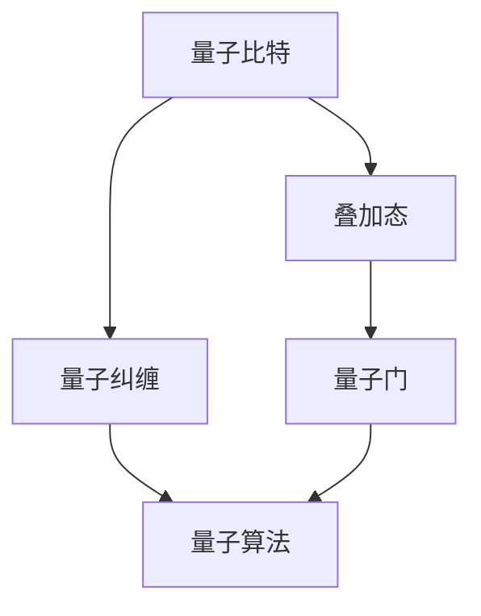
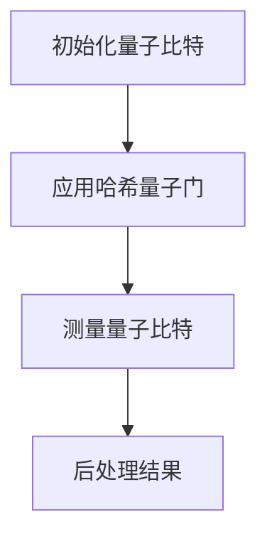
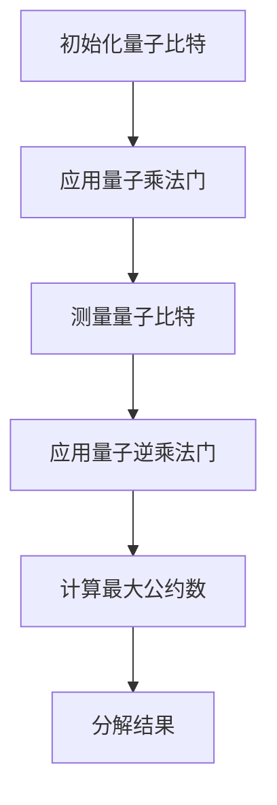
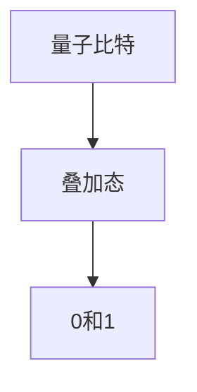
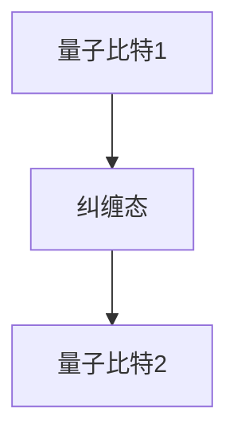
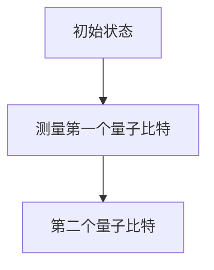
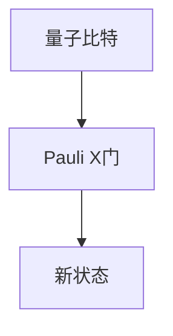

                 

### 文章标题

计算：第四部分 计算的极限 第 10 章 量子计算 量子比特

### 关键词

- 量子计算
- 量子比特
- 量子叠加
- 量子纠缠
- 量子门
- 量子算法
- 量子模拟

### 摘要

本文将深入探讨量子计算领域的一个重要概念——量子比特。作为量子计算机的基本构建块，量子比特与经典比特在本质上有很大差异。本文将首先介绍量子比特的背景，然后详细阐述其核心概念，如量子叠加和量子纠缠。接着，我们将探讨量子门的工作原理和量子算法的基本原理。通过实际案例，我们将展示量子比特在编程和实际应用中的具体实现。最后，我们将讨论量子计算的未来发展趋势和面临的挑战。

### 背景介绍

量子计算是计算机科学的一个新兴领域，它利用量子力学的原理来处理和存储信息。量子计算机与经典计算机的核心区别在于，它们使用量子比特（qubits）作为信息的基本单位，而不是传统的比特（bits）。量子比特具有一种特殊的属性，称为叠加态，这使得量子计算机能够同时处理大量的信息。

量子计算的起源可以追溯到20世纪80年代，当时理查德·费曼（Richard Feynman）提出了构建量子模拟器的想法。他指出，量子系统在某些方面比经典计算机更加强大，例如模拟量子物理过程。随后，彼得·谢尔尼克（Peter Shor）提出了著名的量子算法——Shor算法，这个算法能够利用量子计算机在极短的时间内解决经典计算机需要数百年才能解决的问题。

量子计算的另一个重要贡献者是大卫·多伊奇（David Deutsch），他提出了量子图灵机的概念，这是量子计算的理论基础。量子图灵机是一种抽象的计算模型，用于研究量子计算机的理论性能。

随着量子计算的不断发展，越来越多的研究机构和科技公司开始投入这个领域。例如，谷歌、IBM、微软等公司都在积极研发量子计算机。此外，学术界也在量子算法、量子纠错和量子硬件等方面取得了重要突破。

尽管量子计算的发展前景广阔，但它仍然面临许多挑战。其中一个主要挑战是量子比特的稳定性问题。量子比特极易受到环境干扰，这导致量子计算中的错误率较高。为了解决这个问题，研究者们正在开发量子纠错技术，以提高量子计算机的可靠性。

### 核心概念与联系

量子比特是量子计算的基本单元，它与经典比特有本质的不同。经典比特只有两种状态，即0和1，而量子比特可以同时存在于0和1的叠加状态。这种叠加态是量子比特的核心特性之一。

为了更好地理解量子比特的工作原理，我们可以使用Mermaid流程图来展示其核心概念和联系。



- **叠加态（Superposition）**：量子比特可以处于0和1的叠加状态。这意味着一个量子比特可以同时表示0和1。用数学语言表示，一个量子比特的状态可以表示为 $|\psi\rangle = a|0\rangle + b|1\rangle$，其中 $a$ 和 $b$ 是复数系数，满足 $|a|^2 + |b|^2 = 1$。

- **量子纠缠（Quantum Entanglement）**：当两个或多个量子比特相互纠缠时，它们的状态将不可分割。这意味着一个量子比特的状态会立即影响另一个量子比特的状态，即使它们相隔很远。量子纠缠是量子计算中的另一个核心特性，它使得量子计算机能够进行复杂的并行计算。

- **量子门（Quantum Gates）**：量子门是量子计算中的基本操作，类似于经典计算机中的逻辑门。量子门作用于量子比特，可以改变其状态。例如，Pauli X门（也称为求反门）可以翻转量子比特的状态，即 $|0\rangle \rightarrow |1\rangle$ 和 $|1\rangle \rightarrow |0\rangle$。

- **量子算法（Quantum Algorithms）**：量子算法是利用量子比特的叠加态和量子纠缠进行计算的算法。这些算法可以解决某些问题，例如大数分解和量子搜索算法，比经典算法更加高效。

通过这个Mermaid流程图，我们可以清晰地看到量子比特的核心概念和它们之间的联系。理解这些概念对于深入研究量子计算至关重要。

### 核心算法原理 & 具体操作步骤

在了解了量子比特的核心概念后，接下来我们将探讨量子计算的核心算法原理和具体操作步骤。量子算法是量子计算机的核心，它们利用量子比特的特殊性质来解决问题。下面我们将介绍几种常见的量子算法。

#### 量子搜索算法

量子搜索算法是一种利用量子叠加态和量子纠缠进行搜索的算法。它的基本思想是将问题编码到量子态中，然后通过一系列量子门进行操作，最终得到问题的解。

**操作步骤：**

1. **初始化**：将量子比特初始化为叠加态，例如 $|\psi\rangle = \frac{1}{\sqrt{N}} (|0\rangle + |1\rangle + \ldots + |N-1\rangle)$，其中 $N$ 是搜索空间的大小。

2. **应用量子门**：应用一系列量子门来编码搜索问题。例如，对于基于哈希表的搜索问题，我们可以使用哈希函数将输入编码到量子态中。

3. **测量**：对量子态进行测量，得到搜索结果。由于量子叠加态的性质，测量结果将具有概率分布。

4. **后处理**：根据测量结果进行后处理，以获得最终的搜索结果。

**示例**：假设我们要在一个包含 $N$ 个元素的列表中查找特定的元素。我们可以使用量子搜索算法来解决这个问题。



#### Shor算法

Shor算法是一种利用量子计算机进行大数分解的算法。它利用了量子计算的并行性和叠加态特性，能够在多项式时间内分解大数。

**操作步骤：**

1. **初始化**：将输入大数 $N$ 编码到量子态中，例如 $|\psi\rangle = \frac{1}{\sqrt{N}} (a_0|0\rangle + a_1|1\rangle + \ldots + a_{N-1}|N-1\rangle)$。

2. **应用量子门**：应用一个特定的量子门，使得量子态在周期性振幅中叠加。这个量子门通常称为量子乘法门。

3. **测量**：对量子态进行测量，得到一个整数 $k$。

4. **使用量子逆乘法门**：应用量子逆乘法门，将 $k$ 反转回来，得到 $|\psi'\rangle = \frac{1}{\sqrt{N}} (a_0|0\rangle + a_1|1\rangle + \ldots + a_{N-1}|N-1\rangle)$。

5. **分解**：使用GCD算法（最大公约数算法）计算 $N$ 和 $k$ 的最大公约数，从而分解 $N$。

**示例**：假设我们要分解大数 $N = 15$。



### 数学模型和公式 & 详细讲解 & 举例说明

在了解了量子算法的基本原理后，接下来我们将使用数学模型和公式来详细讲解这些算法。量子算法中的许多操作可以通过数学公式来描述，这些公式有助于我们更好地理解量子算法的工作原理。

#### 量子叠加态

量子叠加态是量子比特的核心特性之一。一个量子比特可以同时处于0和1的叠加状态。这种叠加态可以用数学公式来描述。

假设我们有一个量子比特 $q$，其状态可以表示为 $|\psi\rangle = a|0\rangle + b|1\rangle$，其中 $a$ 和 $b$ 是复数系数，满足 $|a|^2 + |b|^2 = 1$。

**举例**：假设我们有一个量子比特 $q$，其初始状态为 $|\psi\rangle = \frac{1}{\sqrt{2}} (|0\rangle + |1\rangle)$。这个量子比特处于叠加态，同时表示0和1。



#### 量子纠缠

量子纠缠是量子计算中的另一个核心特性。当两个或多个量子比特相互纠缠时，它们的状态将不可分割。这种纠缠状态可以用数学公式来描述。

假设我们有两个量子比特 $q_1$ 和 $q_2$，它们处于纠缠态 $|\psi\rangle = \frac{1}{\sqrt{2}} (|00\rangle + |11\rangle)$。



**举例**：假设我们有一个两个量子比特的系统，初始状态为 $|\psi\rangle = \frac{1}{\sqrt{2}} (|00\rangle + |11\rangle)$。当我们对第一个量子比特进行测量时，其状态将坍缩为0或1，同时第二个量子比特的状态也会立即坍缩。



#### 量子门

量子门是量子计算中的基本操作，它们作用于量子比特，可以改变量子比特的状态。量子门可以用矩阵表示。

**举例**：Pauli X门（求反门）是一个基本的量子门，它将量子比特的状态进行翻转。

- 0态输入：$|0\rangle \rightarrow |1\rangle$
- 1态输入：$|1\rangle \rightarrow |0\rangle$

Pauli X门的矩阵表示为：

$$
X = \begin{pmatrix}
0 & 1 \\
1 & 0
\end{pmatrix}
$$

**举例**：假设我们有一个量子比特 $q$，其初始状态为 $|\psi\rangle = \frac{1}{\sqrt{2}} (|0\rangle + |1\rangle)$。当我们将Pauli X门作用于量子比特 $q$ 时，其状态将变为 $|\psi'\rangle = \frac{1}{\sqrt{2}} (|1\rangle + |0\rangle)$。



#### 量子算法

量子算法是利用量子比特的叠加态和量子纠缠进行计算的算法。量子算法中的许多步骤可以用数学公式来描述。

**举例**：量子搜索算法中的初始化步骤可以用以下数学公式表示：

$$
|\psi\rangle = \frac{1}{\sqrt{N}} (|0\rangle + |1\rangle + \ldots + |N-1\rangle)
$$

其中，$N$ 是搜索空间的大小。

**举例**：量子搜索算法中的测量步骤可以用以下数学公式表示：

$$
P_i = |c_i|^2
$$

其中，$c_i$ 是量子态的系数，$P_i$ 是测量得到第 $i$ 个结果的概率。

### 项目实战：代码实际案例和详细解释说明

在本节中，我们将通过一个实际的代码案例来展示如何使用Python编写一个简单的量子程序，并对其进行详细解释说明。

#### 开发环境搭建

首先，我们需要安装一个名为Qiskit的Python库，它是一个开源的量子计算框架，用于编写和执行量子算法。

```bash
pip install qiskit
```

#### 源代码详细实现和代码解读

以下是一个简单的量子程序，它使用Qiskit库来创建一个量子电路，并在量子比特上执行量子门操作。

```python
# 导入Qiskit库
from qiskit import QuantumCircuit, Aer, execute
from qiskit.visualization import plot_bloch_multivector

# 创建一个量子电路
qc = QuantumCircuit(2)

# 初始化量子比特为叠加态
qc.h(0)
qc.h(1)

# 应用量子门
qc.cx(0, 1)

# 测量量子比特
qc.measure_all()

# 执行量子程序
backend = Aer.get_backend('qasm_simulator')
job = execute(qc, backend, shots=1024)
result = job.result()

# 输出测量结果
print(result.get_counts(qc))

# 可视化量子态
plot_bloch_multivector(qc.get_statevector(), title='Quantum State')
```

**代码解读：**

1. 导入Qiskit库：首先，我们导入Qiskit库中的相关模块，包括量子电路（QuantumCircuit）、量子模拟器（Aer）、执行器（execute）和可视化模块（visualization）。

2. 创建量子电路：我们创建一个包含两个量子比特的量子电路（qc）。

3. 初始化量子比特：使用量子门（H门）将量子比特初始化为叠加态。这里我们使用两个量子比特，所以对两个量子比特都应用H门。

4. 应用量子门：我们应用一个控制-NOT门（CX门）来将第一个量子比特的状态翻转到第二个量子比特。

5. 测量量子比特：我们使用测量操作（measure）来将量子态坍缩到0或1的状态。

6. 执行量子程序：我们使用量子模拟器（qasm_simulator）来执行量子程序，并将结果存储在变量result中。

7. 输出测量结果：我们使用`get_counts`函数来获取测量结果，并将其打印出来。

8. 可视化量子态：我们使用`plot_bloch_multivector`函数来可视化量子态。

#### 代码解读与分析

这个简单的量子程序展示了如何使用Qiskit库创建一个量子电路，并对其进行操作。通过运行这个程序，我们可以看到量子比特的状态如何随时间变化。

**初始化量子比特**：在程序中，我们首先使用H门将量子比特初始化为叠加态。这可以通过以下代码实现：

```python
qc.h(0)
qc.h(1)
```

这里，`h` 函数用于应用H门，它将量子比特的状态从基态（$|0\rangle$）转换为叠加态（$\frac{1}{\sqrt{2}} (|0\rangle + |1\rangle)$）。对第二个量子比特也应用H门，使其也处于叠加态。

**应用量子门**：接下来，我们应用一个CX门来将第一个量子比特的状态翻转到第二个量子比特。这可以通过以下代码实现：

```python
qc.cx(0, 1)
```

CX门是一个控制-NOT门，它将控制比特的状态翻转到目标比特。在这个例子中，第一个量子比特是控制比特，第二个量子比特是目标比特。

**测量量子比特**：最后，我们使用测量操作来将量子态坍缩到0或1的状态。这可以通过以下代码实现：

```python
qc.measure_all()
```

`measure_all` 函数将所有量子比特都进行测量，并将结果存储在经典比特中。在这个例子中，我们使用量子模拟器来执行测量，并将结果存储在变量result中。

```python
backend = Aer.get_backend('qasm_simulator')
job = execute(qc, backend, shots=1024)
result = job.result()
```

通过运行量子程序，我们可以得到量子比特的测量结果，并将其打印出来。在这个例子中，我们运行了1024次模拟实验，并将结果存储在变量result中。

```python
print(result.get_counts(qc))
```

**可视化量子态**：最后，我们可以使用`plot_bloch_multivector`函数来可视化量子态。这可以通过以下代码实现：

```python
plot_bloch_multivector(qc.get_statevector(), title='Quantum State')
```

`get_statevector` 函数返回量子电路的量子态向量，我们可以使用这个函数来创建一个三维的Bloch多矢量图，以可视化量子态。

通过这个简单的例子，我们可以看到如何使用Python和Qiskit库来创建一个量子电路，并对其进行操作。这只是一个入门级的示例，但在了解了基本概念后，我们可以编写更复杂的量子程序来解决问题。

### 实际应用场景

量子计算作为一种新兴的计算技术，已经吸引了广泛的关注，并在多个领域展现出巨大的潜力。以下是量子计算在几个关键领域的实际应用场景。

#### 量子加密

量子加密利用量子比特的叠加态和量子纠缠特性，提供了一种理论上无法被破解的加密方法。量子密钥分发（Quantum Key Distribution，QKD）是最著名的量子加密应用之一。通过量子密钥分发，两个通信方可以安全地生成和共享密钥，确保通信内容的安全性。

#### 量子计算

量子计算在解决某些特定问题上具有显著优势。例如，量子搜索算法可以快速解决大型数据库中的关键字搜索问题。Shor算法能够高效地分解大数，对现代密码学构成重大威胁。此外，量子计算在优化问题和模拟量子系统方面也有广泛的应用。

#### 量子模拟

量子模拟是量子计算机的另一个重要应用。它能够模拟量子系统的行为，这对于研究量子化学、材料科学和生物物理学等领域具有巨大价值。量子模拟器可以帮助科学家们更好地理解复杂的量子现象，加速新药物和材料的发现。

#### 量子优化

量子优化算法利用量子计算机的并行计算能力，解决复杂优化问题。这些问题在经典计算机上可能需要大量时间和资源。例如，物流调度、金融模型和供应链管理等领域都可以从量子优化算法中受益。

#### 量子传感

量子传感器利用量子比特的高灵敏度，可以用于测量极其微小的物理量，如引力、磁场和温度等。这种技术在精密测量、量子计算和量子通信等领域具有广泛应用。

#### 量子数据处理

随着数据量的爆炸性增长，传统数据处理方法面临巨大挑战。量子计算机可以并行处理海量数据，提高数据分析的速度和效率。在金融分析、医疗诊断和天气预报等领域，量子数据处理具有巨大的应用潜力。

### 工具和资源推荐

为了深入了解量子计算，并在这个领域进行实际应用，以下是一些推荐的工具和资源。

#### 学习资源推荐

1. **书籍**：
   - 《量子计算导论》（Introduction to Quantum Computing） by Michael A. Nielsen & Isaac L. Chuang
   - 《量子计算：量子算法、量子模拟与量子纠错》 (Quantum Computing: A Gentle Introduction) by Chris Bernhardt

2. **论文**：
   - 《量子计算的基本算法》（Basic Algorithms for Quantum Computers） by Richard P. Feynman
   - 《量子计算与量子信息》 (Quantum Computing and Quantum Information) by Michael A. Nielsen & Isaac L. Chuang

3. **博客**：
   - Qiskit官方博客（qiskit.org/blog）
   - IBM Quantum计算博客（developer.ibm.com/quantum/）

4. **网站**：
   - IBM Quantum（quantumIBM.com）
   - Microsoft Quantum（microsoft.com/quantum）

#### 开发工具框架推荐

1. **Qiskit**：Qiskit是一个开源的量子计算框架，支持量子电路设计、算法开发和量子模拟。它是目前最流行的量子计算工具之一。

2. **Microsoft Quantum Development Kit**：Microsoft提供的量子开发工具包，包括量子计算模拟器和量子编程API，可用于编写和运行量子算法。

3. **Google Quantum AI**：Google的量子计算平台，提供量子计算模拟器和量子编程API，支持Python和C++编程语言。

#### 相关论文著作推荐

1. **《量子计算的基本算法》（Basic Algorithms for Quantum Computers）**：本文介绍了量子计算的基本算法，包括量子电路设计、量子搜索算法和Shor算法。

2. **《量子计算与量子信息》**：这是一本全面的量子计算教科书，涵盖了量子计算的基本概念、量子算法和量子纠错等内容。

3. **《量子密码学》**：本书介绍了量子加密和量子密钥分发技术，探讨了量子计算对密码学的影响。

### 总结：未来发展趋势与挑战

量子计算作为一项前沿技术，正在迅速发展。随着量子比特数量的增加和量子纠错技术的进步，量子计算机的性能有望不断提升。在未来，量子计算将在加密、优化、模拟和数据处理等领域发挥重要作用。

然而，量子计算也面临许多挑战。首先，量子比特的稳定性问题仍然是一个重要的研究课题。其次，量子算法的设计和优化也是一个挑战，需要开发更多高效的量子算法来利用量子计算机的优势。此外，量子计算的硬件实现也需要进一步的研究和改进，以提高量子计算机的可靠性和可扩展性。

总之，量子计算具有巨大的潜力，但也需要持续的努力和投入。随着量子计算技术的不断进步，我们有望在各个领域取得突破性进展，推动科学和技术的创新。

### 附录：常见问题与解答

1. **什么是量子比特？**
   量子比特是量子计算的基本单元，它具有叠加态和纠缠态等特殊性质。与经典比特（只有0和1两种状态）不同，量子比特可以同时处于0和1的叠加状态。

2. **量子计算机与经典计算机有什么区别？**
   量子计算机利用量子比特的特殊性质，如叠加态和纠缠态，可以同时处理大量的信息。而经典计算机使用比特进行计算，一次只能处理一个比特的信息。这使得量子计算机在某些问题上具有显著的优势。

3. **量子计算为什么具有并行性？**
   量子计算具有并行性的原因是量子比特可以处于叠加态，这意味着一个量子比特可以同时表示0和1。因此，量子计算机可以同时处理大量的并行计算任务，这大大提高了计算效率。

4. **量子计算有哪些实际应用？**
   量子计算在实际应用中具有广泛的应用前景，包括量子加密、优化问题、量子模拟、量子传感和量子数据处理等。

5. **量子计算面临哪些挑战？**
   量子计算面临的主要挑战包括量子比特的稳定性问题、量子算法的设计和优化、以及量子硬件的实现和可扩展性等。

### 扩展阅读 & 参考资料

1. Nielsen, M. A., & Chuang, I. L. (2000). *Quantum Computation and Quantum Information*. Cambridge University Press.
2. Bernhardt, C. (2018). *Quantum Computing: A Gentle Introduction*. CRC Press.
3. Google Quantum AI. (n.d.). Getting Started with Quantum Development Kit. Retrieved from [developer.google.com/quantum/)
4. IBM Quantum. (n.d.). Qiskit Documentation. Retrieved from [qiskit.org/documentation/]
5. Microsoft Quantum. (n.d.). Quantum Development Kit Documentation. Retrieved from [docs.microsoft.com/quantum/)

