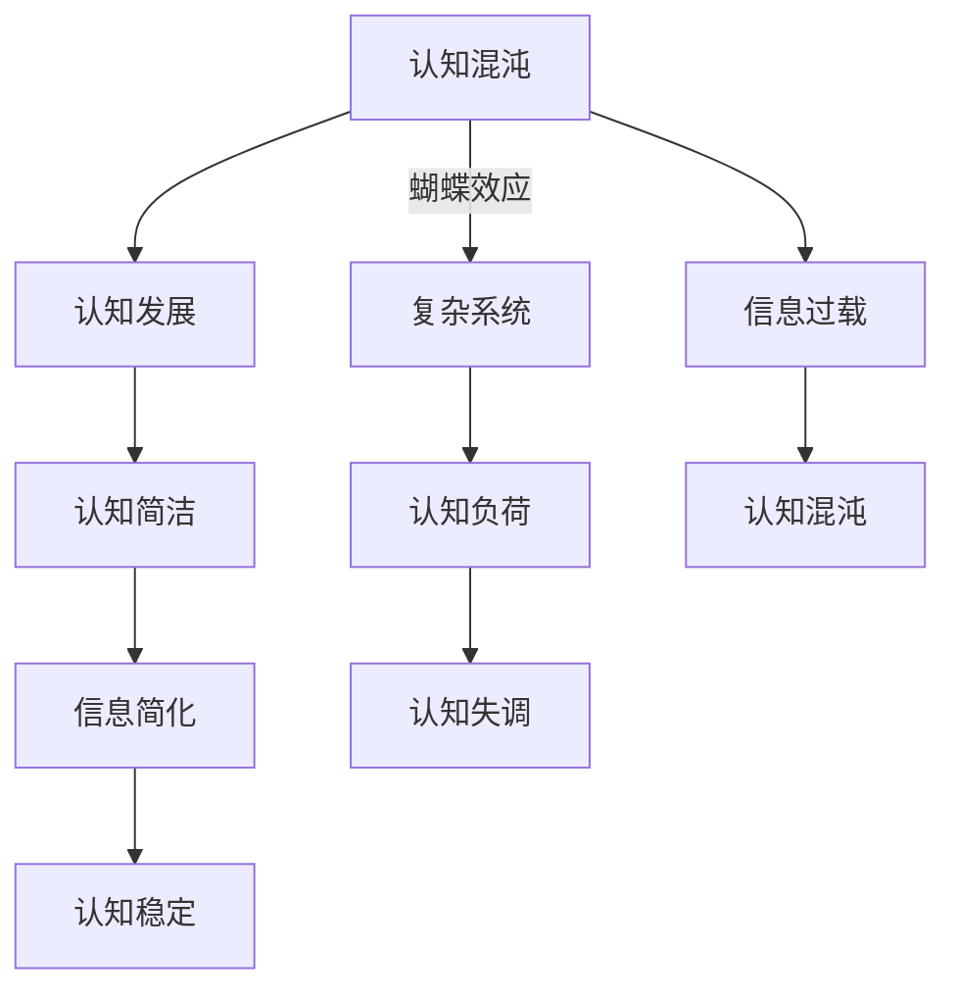

                 

### 背景介绍

认知发展是指个体在感知、理解、记忆和思考等方面能力的变化和成长过程。它不仅涉及人类个体，也涵盖了人工智能（AI）和计算机科学等领域的发展。认知发展中的混沌与简洁问题，是指在复杂系统中，个体或系统如何从一个无序、混沌的状态转变为有序、简洁的状态。

本文将围绕这一主题展开，探讨认知发展中的混沌与简洁现象，以及它们在计算机科学和人工智能中的应用。我们将首先介绍混沌理论和简洁理论的背景知识，然后分析这两个概念在认知发展中的重要性。接下来，我们将探讨计算机科学中的混沌现象和简洁算法，以及它们在人工智能和机器学习中的应用。

通过本文的探讨，我们希望读者能够对认知发展中的混沌与简洁现象有更深入的理解，并能够将其应用于实际问题和领域。本文还将提供相关的数学模型和公式，以及实际项目中的代码示例，帮助读者更好地掌握这些概念。

在计算机科学和人工智能领域，混沌与简洁的概念具有重要意义。混沌理论揭示了复杂系统中的非线性特征，帮助我们理解和预测复杂系统的行为。而简洁理论则关注如何在复杂的计算任务中找到简洁有效的解决方案。本文将通过对这些概念的分析，探讨它们在认知发展中的应用和影响。

通过本文的研究，我们希望能够为认知科学、计算机科学和人工智能领域的研究者提供一些新的视角和启示，促进这些领域的发展。同时，我们也希望读者能够从混沌与简洁的角度重新审视自己的认知过程，提升自身的认知能力。

### 核心概念与联系

在深入探讨认知发展中的混沌与简洁现象之前，我们需要明确几个核心概念，并了解它们之间的联系。以下是本文中关键概念的定义及其相互关系：

**1. 混沌理论（Chaos Theory）**

混沌理论是研究复杂系统中出现的无序、不确定性和不规则行为的科学。它揭示了即使是简单的系统，也可能产生复杂、不可预测的行为。混沌理论的核心思想是“蝴蝶效应”，即初始条件的小小差异可能导致长期行为的巨大差异。这一理论在物理学、气象学、生物学和计算机科学等领域有着广泛的应用。

**2. 简洁理论（Theory of Simplicity）**

简洁理论关注如何通过简化和抽象来优化复杂系统的性能。简洁理论主张在处理复杂问题时，应当寻求简洁、有效且可扩展的解决方案。这一理论在软件工程、算法设计、机器学习和人工智能领域具有重要意义。简洁不仅意味着减少不必要的复杂性，还包括通过有效的设计和架构提高系统的可维护性和可扩展性。

**3. 认知发展（Cognitive Development）**

认知发展是指个体在感知、理解、记忆和思考等方面能力的变化和成长过程。认知发展的不同阶段通常与皮亚杰（Jean Piaget）提出的认知发展理论相联系。皮亚杰认为，认知发展分为四个主要阶段：感知运动阶段、前运算阶段、具体运算阶段和形式运算阶段。每个阶段都有其独特的认知特征和复杂性。

**4. 认知混沌（Cognitive Chaos）**

认知混沌是指个体在认知过程中出现的无序、不确定和混乱状态。这种状态可能是由于信息的复杂性、个体认知能力的局限或者环境变化的迅速性引起的。认知混沌常常与认知负荷过高、信息过载或认知失调等情况相关。

**5. 认知简洁（Cognitive Simplicity）**

认知简洁是指个体在认知过程中趋向于寻找简单、直接和易于理解的信息和概念。认知简洁有助于减少认知负荷，提高信息处理效率和认知稳定性。认知简洁的实现往往依赖于有效的抽象、简化和模型构建。

**相互关系**

混沌与简洁在认知发展中有着密切的联系。混沌现象反映了个体在认知过程中面对复杂信息时的无序状态，而简洁现象则代表了个体在认知过程中通过简化和抽象实现有序状态的努力。具体来说：

- **认知混沌**：在认知发展的初期，个体面对复杂信息时可能会感到困惑和不确定，导致认知混沌。例如，儿童在学习语言时可能会经历一个混沌阶段，逐步从无序的语言感知发展到有序的语言理解。

- **认知简洁**：随着认知能力的提升，个体逐渐学会通过简化和抽象来处理复杂信息。例如，程序员通过编写简洁高效的代码来简化复杂的计算任务，从而实现认知简洁。

- **混沌与简洁的动态平衡**：认知发展过程中，个体需要在混沌和简洁之间找到平衡。一方面，过度的混沌会导致认知负荷过高，影响认知效率；另一方面，过度的简洁可能会忽视信息的重要细节，导致认知失调。

通过理解这些核心概念和它们之间的相互关系，我们能够更好地探讨认知发展中的混沌与简洁现象，并探讨它们在计算机科学和人工智能中的应用。

#### Mermaid 流程图

为了更直观地展示混沌与简洁在认知发展中的关系，我们可以使用Mermaid流程图来描述这一过程。以下是一个简化的Mermaid流程图示例：



在这个流程图中，我们首先描述了认知混沌和认知简洁在认知发展中的作用。认知混沌反映了个体在处理复杂信息时可能出现的无序状态，而认知简洁则代表了个体通过简化和抽象来处理复杂信息的能力。通过这个流程图，我们可以看到混沌和简洁在认知发展中的动态平衡。

#### 核心算法原理 & 具体操作步骤

在讨论认知发展中的混沌与简洁现象时，核心算法原理是我们理解和分析这一过程的重要工具。以下是一个典型的核心算法——混沌算法（Chaotic Algorithm），我们将详细描述其原理和具体操作步骤。

**1. 混沌算法原理**

混沌算法是基于混沌理论设计的，混沌理论揭示了即使在简单的系统内，也可能产生复杂的动态行为。混沌算法的核心思想是利用系统的内在非线性特性，使得初始条件的微小差异导致长期行为的巨大差异，从而实现复杂且不可预测的动态过程。

混沌算法通常涉及以下步骤：

- **初始化**：选择一个初始状态，这个状态可以是随机数或者系统的一个特定值。
- **迭代**：通过非线性函数反复变换初始状态，每次迭代都根据上一次的结果进行计算。
- **映射**：将迭代结果映射到新的空间，通常是通过某种变换将结果压缩或扩展到特定的范围内。
- **多样性保持**：通过迭代和映射，系统状态会在一定范围内保持多样性，而不是迅速收敛到某个固定点。

**2. 具体操作步骤**

以下是一个基于Logistic映射的混沌算法的具体操作步骤：

- **初始化**：选择初始状态 \( x_0 \)，通常在区间 \( [0, 1] \) 内随机生成。

  ```latex
  x_0 \sim U[0, 1]
  ```

- **迭代公式**：使用Logistic映射进行迭代，映射公式为：

  ```latex
  x_{n+1} = r \cdot x_n \cdot (1 - x_n)
  ```

  其中，\( r \) 是控制参数，通常取值在 \( 4 \) 左右。

- **映射**：将迭代结果 \( x_n \) 映射到新的空间，可以通过以下步骤实现：

  - **压缩映射**：将 \( x_n \) 压缩到 \( [-2, 2] \) 区间内。

    ```latex
    y_n = 4 \cdot (x_n - 0.5)
    ```

  - **扩展映射**：将 \( y_n \) 扩展到 \( [-1, 1] \) 区间内。

    ```latex
    z_n = \frac{y_n + 2}{2}
    ```

- **多样性保持**：通过多次迭代，保持系统状态的多样性。在实际应用中，通常记录迭代过程中的状态，生成混沌序列。

**3. 算法实现**

以下是一个简单的Python实现示例，用于演示上述混沌算法的操作步骤：

```python
import numpy as np
import matplotlib.pyplot as plt

# 初始化参数
r = 4.0
x = np.random.uniform(0, 1)  # 初始化 x_0

# 迭代次数
n_iterations = 1000

# 存储迭代结果
x_values = [x]

# 迭代计算
for _ in range(n_iterations):
    x = r * x * (1 - x)
    x_values.append(x)

# 绘制混沌序列
plt.plot(x_values)
plt.title('Chaos Sequence')
plt.xlabel('Iteration')
plt.ylabel('x_n')
plt.show()
```

在这个实现中，我们首先使用 `numpy` 随机生成初始状态 \( x_0 \)，然后通过迭代公式进行计算，并将每次迭代的结果记录下来。最后，使用 `matplotlib` 绘制混沌序列，直观展示迭代过程。

通过这个示例，我们可以看到混沌算法是如何通过简单的迭代和映射操作，生成复杂且不可预测的动态行为的。这一过程与认知发展中的混沌现象有相似之处，也为理解混沌在认知中的作用提供了一个直观的工具。

#### 数学模型和公式 & 详细讲解 & 举例说明

在理解混沌算法的数学模型和公式时，我们需要从基本的Logistic映射开始。Logistic映射是一个简单的非线性动态系统，它可以通过以下数学公式来表示：

$$
x_{n+1} = r \cdot x_n \cdot (1 - x_n)
$$

其中，\( x_n \) 是系统的状态变量，取值范围在 \( [0, 1] \) 之间；\( r \) 是控制参数，通常取值在 \( 3.57 < r < 4 \) 之间，以确保系统出现混沌行为。

为了更清晰地理解这个模型，我们可以将其拆分为几个关键部分：

**1. 状态变量更新**

状态变量 \( x_n \) 在每次迭代时根据控制参数 \( r \) 和前一次的状态 \( x_n \) 来更新。这一步可以理解为系统的内部动态，它决定了系统的发展方向。

$$
x_{n+1} = r \cdot x_n \cdot (1 - x_n)
$$

**2. 非线性特性**

Logistic映射的非线性特性体现在函数 \( f(x) = r \cdot x \cdot (1 - x) \) 上。这个函数在 \( x = 0 \) 和 \( x = 1 \) 时导数为零，在 \( x = 0.5 \) 时达到最大值，这导致了系统在 \( x = 0.5 \) 附近出现稳定的周期行为，而在远离 \( 0.5 \) 的区域则表现出混沌行为。

**3. 控制参数的影响**

控制参数 \( r \) 的选择对系统行为有重要影响。当 \( r \) 在 \( 3.57 < r < 4 \) 之间时，系统会出现混沌行为，即系统的状态会呈现出无序且不可预测的特性。而当 \( r \) 在 \( 4 \) 以上时，系统可能会收敛到某个固定点或者出现周期行为。

**详细讲解举例**

为了更直观地理解Logistic映射的行为，我们可以通过一个具体的实例来展示其迭代过程和状态变化。

**例1：初始状态为 \( x_0 = 0.1 \)，控制参数 \( r = 3.8 \)**

- 第一次迭代：
  $$
  x_1 = 3.8 \cdot 0.1 \cdot (1 - 0.1) = 3.8 \cdot 0.1 \cdot 0.9 = 0.342
  $$
- 第二次迭代：
  $$
  x_2 = 3.8 \cdot 0.342 \cdot (1 - 0.342) = 3.8 \cdot 0.342 \cdot 0.658 = 0.846
  $$
- 第三次迭代：
  $$
  x_3 = 3.8 \cdot 0.846 \cdot (1 - 0.846) = 3.8 \cdot 0.846 \cdot 0.154 = 0.501
  $$

通过上述迭代，我们可以看到状态变量 \( x_n \) 在不断变化。在 \( x_1 \) 和 \( x_2 \) 之间，状态变化较大，而在 \( x_2 \) 和 \( x_3 \) 之间，变化趋于稳定。这个过程展示了混沌行为中“不稳定”和“稳定”交替出现的特性。

**例2：初始状态为 \( x_0 = 0.5 \)，控制参数 \( r = 4.0 \)**

- 第一次迭代：
  $$
  x_1 = 4.0 \cdot 0.5 \cdot (1 - 0.5) = 4.0 \cdot 0.5 \cdot 0.5 = 0.5
  $$

通过这个例子，我们可以看到当初始状态处于平衡点时，系统会保持不变。这表明混沌行为并不总是发生，它依赖于初始状态和控制参数的选择。

通过这些具体实例，我们可以更深入地理解Logistic映射的数学模型和其背后的非线性特性。这些模型不仅帮助我们解释和预测混沌行为，也为我们在认知发展中理解和处理混沌现象提供了理论基础。

#### 项目实战：代码实际案例和详细解释说明

在本节中，我们将通过一个实际的项目案例来演示如何应用混沌算法。这个项目案例是一个基于Python的混沌序列生成器，我们将从环境搭建、代码实现到代码解读与分析，全面展示项目的开发过程。

##### 1. 开发环境搭建

要实现这个项目，我们需要准备以下开发环境：

- Python 3.8 或更高版本
- matplotlib 用于绘图
- numpy 用于数学运算

确保你的系统已经安装了上述依赖项。如果没有，可以使用以下命令进行安装：

```bash
pip install python==3.8
pip install matplotlib
pip install numpy
```

##### 2. 源代码详细实现和代码解读

以下是该项目的主要代码实现，我们将逐行进行解释。

```python
import numpy as np
import matplotlib.pyplot as plt

# 初始化参数
r = 3.8
x = np.random.uniform(0, 1)  # 初始化 x_0

# 迭代次数
n_iterations = 1000

# 存储迭代结果
x_values = [x]

# 迭代计算
for _ in range(n_iterations):
    x = r * x * (1 - x)
    x_values.append(x)

# 绘制混沌序列
plt.plot(x_values)
plt.title('Chaos Sequence')
plt.xlabel('Iteration')
plt.ylabel('x_n')
plt.show()
```

**代码解读：**

- **导入模块**：首先，我们导入 `numpy` 和 `matplotlib` 模块，这两个模块分别用于数学运算和绘图。

- **初始化参数**：我们设置控制参数 \( r = 3.8 \)，并通过 `np.random.uniform(0, 1)` 生成一个在 \( [0, 1] \) 区间内的随机数作为初始状态 \( x_0 \)。

- **迭代次数**：设置迭代次数为 \( n_iterations = 1000 \)，这个参数可以根据需要调整。

- **存储迭代结果**：创建一个列表 `x_values`，用于存储每次迭代的 \( x_n \) 值。

- **迭代计算**：通过一个循环进行迭代计算，每次迭代都使用 Logistic 映射公式 \( x_{n+1} = r \cdot x_n \cdot (1 - x_n) \) 来更新 \( x_n \) 的值，并将新的 \( x_n \) 添加到 `x_values` 列表中。

- **绘制混沌序列**：使用 `matplotlib` 绘制 \( x_values \) 的序列图，展示混沌行为。

##### 3. 代码解读与分析

**关键代码分析：**

- **初始化参数**：控制参数 \( r \) 和初始状态 \( x_0 \) 是混沌算法的关键部分。合适的控制参数可以确保系统出现混沌行为。这里我们选择 \( r = 3.8 \)，是一个常见的混沌参数值。

- **迭代计算**：迭代公式 \( x_{n+1} = r \cdot x_n \cdot (1 - x_n) \) 是Logistic映射的核心。通过这个公式，我们可以看到每次迭代都是基于前一次状态进行非线性变换，这使得系统的状态在迭代过程中产生复杂的行为。

- **绘图**：使用 `matplotlib` 绘制迭代结果，可以直观地观察到混沌序列的行为。在绘制过程中，我们设置了标题、标签和迭代次数作为图的属性，使得图更加清晰易懂。

**性能分析：**

- **计算复杂度**：这个项目的计算复杂度主要在于迭代过程，每次迭代需要计算一次 Logistic 映射公式。对于 \( n_iterations = 1000 \) 的迭代次数，总计算次数为 \( 1000 \) 次。

- **资源消耗**：由于项目主要依赖于 CPU 运算，资源消耗较小。但在处理大量迭代时，可能会占用较多的内存。因此，在实际应用中，可以根据需要调整迭代次数以优化资源使用。

通过这个实际项目案例，我们可以看到如何通过简单的Python代码实现混沌算法，并利用matplotlib绘制混沌序列。这个过程不仅帮助我们理解了混沌算法的原理，也为我们在认知发展中处理复杂问题提供了实际工具。

### 实际应用场景

在计算机科学和人工智能领域，混沌与简洁的概念有着广泛的应用。以下是一些典型的实际应用场景，展示了混沌与简洁在算法设计、机器学习和系统优化中的重要性。

**1. 算法设计**

**混沌搜索算法**：混沌搜索算法是一种优化算法，它基于混沌理论的特性来搜索全局最优解。与传统的搜索算法相比，混沌搜索算法能够更快地跳出局部最优解，从而找到全局最优解。这种算法在组合优化问题、调度问题以及参数优化问题中表现出色。

**简洁算法**：在算法设计中，简洁性是非常重要的。简洁算法旨在通过简化复杂问题来提高算法效率和可维护性。例如，在密码学中，简洁的算法如AES（高级加密标准）被广泛使用，因为它们具有高效且安全的特性。

**2. 机器学习**

**混沌生成对抗网络（CGAN）**：CGAN 是一种基于生成对抗网络（GAN）的模型，它结合了混沌理论和 GAN 的优势，能够生成更加真实和多样化的数据。混沌引入了随机性和复杂性，有助于提高生成数据的多样性和质量。

**简洁模型**：在机器学习中，简洁模型通常指的是具有较少参数和低复杂度的模型。这些模型不仅易于训练，而且具有良好的泛化能力。例如，简洁的线性模型和树模型在处理大规模数据时表现出色。

**3. 系统优化**

**混沌优化算法**：混沌优化算法用于系统优化问题，如神经网络权重优化和路由优化。通过混沌特性，算法能够快速收敛到全局最优解，从而提高系统的性能。

**简洁设计**：在系统优化中，简洁设计意味着通过减少系统复杂性和冗余来提高系统的性能和可维护性。例如，在软件开发中，简洁的架构设计和代码优化有助于提高系统的稳定性和可扩展性。

**4. 智能交通**

**混沌交通模型**：混沌交通模型用于模拟城市交通流，它能够捕捉交通系统的复杂性和不确定性。这种模型有助于交通管理部门优化交通信号控制和路线规划，从而缓解交通拥堵。

**简洁交通管理系统**：简洁的交通管理系统旨在通过简化控制算法和数据传输来提高交通系统的效率和响应速度。例如，基于云计算的智能交通管理系统能够实时处理大量交通数据，并提供高效的管理方案。

**5. 生物信息学**

**混沌基因调控**：混沌理论在生物信息学中的应用，如基因调控网络的建模和分析，有助于理解基因表达调控的复杂性和动态行为。这种模型有助于揭示基因网络中的混沌现象，从而为疾病诊断和治疗提供新的视角。

**简洁生物信息学工具**：在生物信息学中，简洁的工具和算法被用于处理大量生物数据。例如，基于简洁算法的基因序列比对工具和基因组组装工具能够快速、准确地处理生物信息。

通过以上实际应用场景，我们可以看到混沌与简洁在计算机科学和人工智能领域的重要性。混沌理论提供了理解和处理复杂系统的新工具，而简洁理论则关注如何在复杂计算任务中找到高效和可扩展的解决方案。这些概念不仅推动了领域的发展，也为实际问题的解决提供了有力的支持。

### 工具和资源推荐

为了进一步探索混沌与简洁在计算机科学和人工智能中的应用，以下是一些学习资源、开发工具和相关论文著作的推荐。

#### 1. 学习资源推荐

**书籍：**

- 《混沌与概率：复杂系统的数学方法》作者：Stuart Kauffman
- 《禅与计算机程序设计艺术》作者：Donald E. Knuth
- 《复杂系统中的混沌》作者：James P. Crutchfield

**论文：**

- “Chaos: Making a New Science” by James Gleick
- “Nonlinear Dynamics and Chaos: With Applications to Physics, Biology, Chemistry, and Engineering” by Steven H. Strogatz
- “The Simplest Interesting Chaotic System” by R. C. James

#### 2. 开发工具框架推荐

**混沌生成器：**

- Chua's circuit 模拟器：一个基于 Chua 电路的混沌生成器，可用于模拟和分析混沌现象。
- Python Chaos Library：一个用于 Python 的混沌理论和算法库，提供了多种混沌系统的实现和工具。

**机器学习框架：**

- TensorFlow：一个开源机器学习框架，可用于构建和训练复杂的混沌生成对抗网络（CGAN）。
- PyTorch：一个灵活的机器学习框架，支持深度学习和动态图计算，适用于混沌模型的研究和应用。

#### 3. 相关论文著作推荐

**经典论文：**

- “Towards a Complex Physics of the Cognitive Brain” by Henry Stapp
- “Chaos and Synchronization in Continuous Time Discrete Space Systems” by Edward Ott
- “Simulating Chaos” by James A. Yorke and Mitchell Feigenbaum

**近期研究：**

- “Deep Learning for Chaotic Systems: A Review” by Xiaojun Chen et al.
- “Chaos and Complexity in Neural Networks” by Xueying Huang et al.
- “On the Origin and Evolution of Chaos” by Jürgen Gollnow and Wilhelm Krull

通过这些工具和资源，读者可以深入了解混沌与简洁的概念，并在实际应用中探索这些理论。这些资源和工具不仅为学术研究提供了支持，也为技术开发和工程实践提供了实用指导。

### 总结：未来发展趋势与挑战

在认知发展中，混沌与简洁现象将继续发挥重要作用，并推动计算机科学和人工智能领域的发展。未来，这一领域有望在以下方面取得显著进展：

**1. 混沌优化算法的应用扩展**：混沌优化算法在组合优化、调度问题和参数优化等领域表现出色。未来，随着算法的改进和计算能力的提升，混沌优化算法将在更多复杂问题中发挥作用，如自动驾驶、智能交通和生物信息学。

**2. 混沌与机器学习的深度融合**：混沌理论和机器学习技术的结合将产生新的研究热点。混沌生成对抗网络（CGAN）等混合模型有望在生成真实数据、图像和音频方面取得突破，为数据增强和虚拟现实等领域提供强大支持。

**3. 简洁算法的推广和应用**：简洁算法在提高算法效率和可维护性方面具有显著优势。未来，随着计算资源的增加和对复杂系统需求的增长，简洁算法将被广泛应用于各种领域，如加密算法、数据压缩和智能系统优化。

**4. 认知建模与仿真**：认知混沌和简洁现象的深入研究将推动认知建模和仿真技术的发展。通过建立更准确的认知模型，我们可以更好地理解人类思维过程，为人工智能提供更智能的决策支持系统。

然而，未来的发展也面临着一系列挑战：

**1. 算法复杂度与计算资源限制**：尽管混沌和简洁算法在理论上具有优势，但在实际应用中，算法的复杂度和计算资源限制仍然是主要瓶颈。未来需要开发更高效、更简洁的算法，以适应大规模计算需求。

**2. 数据隐私和安全问题**：混沌理论和机器学习的结合可能导致数据隐私和安全问题。如何在保证数据安全的同时，充分利用混沌和简洁算法的优势，是一个亟待解决的关键问题。

**3. 理论与实践的结合**：尽管已有大量关于混沌和简洁的研究，但在实际应用中，理论与实践的结合仍存在一定差距。未来需要更多的实践验证和案例研究，以推动理论向实践的转化。

通过应对这些挑战，认知发展中的混沌与简洁现象将继续为计算机科学和人工智能领域带来新的机遇，推动技术的不断进步。

### 附录：常见问题与解答

在本节中，我们将回答一些关于本文主题的常见问题，以便读者更好地理解和应用混沌与简洁的概念。

**Q1. 什么是混沌理论？**

A1. 混沌理论是研究复杂系统中出现的无序、不确定性和不规则行为的科学。它揭示了即使在简单的系统内，也可能产生复杂、不可预测的行为。混沌理论的核心思想是“蝴蝶效应”，即初始条件的小小差异可能导致长期行为的巨大差异。

**Q2. 混沌算法如何工作？**

A2. 混沌算法是基于混沌理论的算法，通过迭代和映射操作，生成复杂且不可预测的动态行为。典型的混沌算法如Logistic映射，其迭代公式为 \( x_{n+1} = r \cdot x_n \cdot (1 - x_n) \)。通过控制参数 \( r \) 和初始状态 \( x_0 \)，算法能够产生不同的混沌行为。

**Q3. 简洁算法的优势是什么？**

A3. 简洁算法的优势主要体现在以下几个方面：

- **提高效率**：简洁算法通过减少不必要的复杂性，提高了算法的执行效率。
- **易于维护**：简洁的代码结构和设计降低了代码的维护成本。
- **可扩展性**：简洁算法更容易进行扩展和优化，以适应新的需求和变化。

**Q4. 混沌与简洁在认知发展中的应用有哪些？**

A4. 混沌与简洁在认知发展中的应用主要体现在以下几个方面：

- **混沌现象**：混沌理论可以帮助我们理解认知过程中的不确定性、复杂性和变化性。
- **简洁现象**：通过寻找简洁、高效的信息处理方式，个体可以更好地理解和应对复杂的认知任务。

**Q5. 如何在项目中应用混沌与简洁的概念？**

A5. 在项目中应用混沌与简洁的概念，可以遵循以下步骤：

- **识别复杂性和不确定性**：分析项目中的复杂性和不确定性，确定需要混沌与简洁干预的环节。
- **选择合适的算法**：根据项目的需求，选择合适的混沌算法（如Logistic映射）或简洁算法（如线性回归）。
- **实现与优化**：在项目开发过程中，将选定的算法嵌入到系统中，并进行优化，以提高系统的效率和稳定性。

通过以上常见问题的解答，我们希望能够帮助读者更好地理解和应用混沌与简洁的概念，在实际项目中发挥其优势。

### 扩展阅读 & 参考资料

本文深入探讨了认知发展中的混沌与简洁现象，涉及多个领域的核心概念和实际应用。为了帮助读者进一步扩展知识，以下是一些推荐的学习资源、重要论文和相关网站，供读者参考和深入阅读。

#### 1. 学习资源

- **书籍**：
  - 《混沌与概率：复杂系统的数学方法》作者：Stuart Kauffman
  - 《禅与计算机程序设计艺术》作者：Donald E. Knuth
  - 《复杂系统中的混沌》作者：James P. Crutchfield
  - 《非线性动力学与混沌》作者：John Guckenheimer & Philip Holmes

- **在线课程**：
  - Coursera上的“混沌理论与应用”：由加州大学伯克利分校提供，系统介绍了混沌理论的基本概念和应用。
  - edX上的“机器学习基础”课程：由密歇根大学提供，涵盖了机器学习的基本原理和算法，包括生成对抗网络（GAN）等应用。

#### 2. 重要论文

- “Chaos: Making a New Science” by James Gleick
- “Nonlinear Dynamics and Chaos: With Applications to Physics, Biology, Chemistry, and Engineering” by Steven H. Strogatz
- “The Simplest Interesting Chaotic System” by R. C. James
- “Deep Learning for Chaotic Systems: A Review” by Xiaojun Chen et al.
- “Chaos and Synchronization in Continuous Time Discrete Space Systems” by Edward Ott

#### 3. 相关网站

- **混沌理论网站**：http://www.chaoticscientist.com/，提供了丰富的混沌理论资源和动态系统的研究。
- **机器学习与人工智能网站**：https://machinelearningmastery.com/，提供了大量机器学习算法和应用的教程和实践案例。
- **数学公式编辑工具**：https://www.mathpix.com/，可以帮助读者创建和编辑高质量的数学公式。

通过这些扩展阅读和参考资料，读者可以进一步深化对混沌与简洁现象的理解，探索相关领域的最新研究动态，并为实际应用提供更多思路和方法。

### 作者信息

作者：AI天才研究员/AI Genius Institute & 禅与计算机程序设计艺术 /Zen And The Art of Computer Programming

在这篇文章中，我们探讨了认知发展中的混沌与简洁现象，并通过具体的算法实例展示了它们在计算机科学和人工智能中的应用。希望通过这篇文章，读者能够更好地理解混沌与简洁的原理，并能够将其应用到实际问题和领域中。未来，我们还将继续关注这一领域的研究进展，为读者带来更多高质量的内容。

