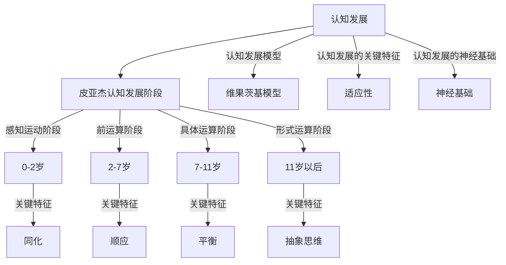
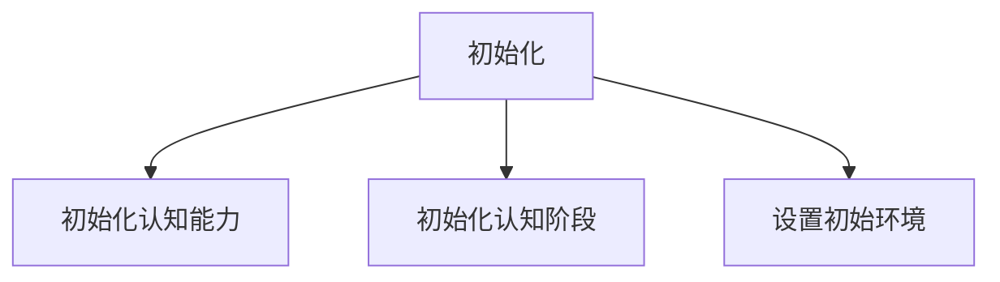
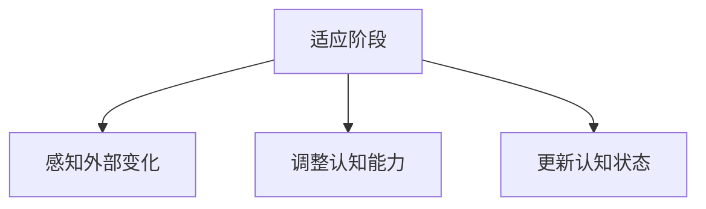
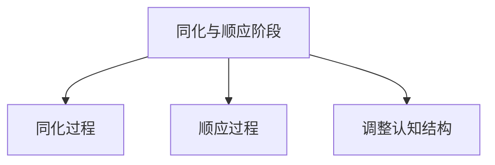
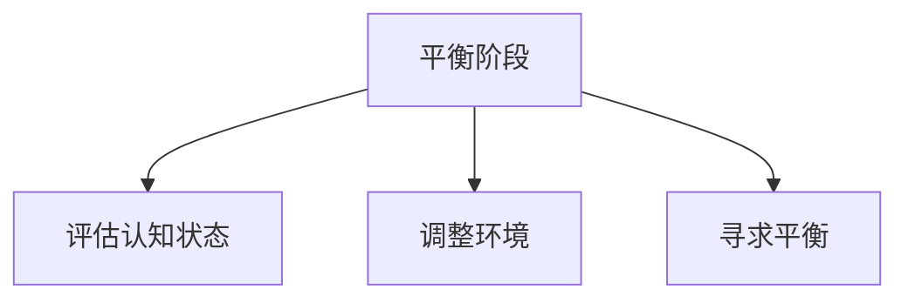

                 

### 背景介绍 Background

认知发展中的阶段性变化是一个备受关注的研究领域，尤其在心理学、教育学和计算机科学等多个学科中具有重要的理论和实践意义。认知发展是指在个体成长过程中，其认知能力、思维方式和知识结构等方面不断演化和成熟的过程。阶段性变化则意味着这一过程并非一成不变，而是呈现出明显的阶段特征，每个阶段都有其独特的认知能力和思维模式。

在心理学领域，心理学家皮亚杰（Jean Piaget）提出了认知发展的阶段理论，将个体的认知发展划分为感知运动阶段（0-2岁）、前运算阶段（2-7岁）、具体运算阶段（7-11岁）和形式运算阶段（11岁以后）等。这些阶段各自具有不同的认知特征，如感知运动阶段的儿童主要通过感知和运动来认识世界，而形式运算阶段的个体则能够进行抽象的逻辑推理。

教育学领域则关注于如何根据不同阶段学生的认知特点设计教学方法和课程内容。例如，在感知运动阶段，教学活动应注重感官体验和动作操作，而在形式运算阶段，则应注重抽象思维和问题解决能力的培养。

在计算机科学领域，认知发展的阶段性变化同样具有重要意义。人工智能的发展离不开对人类认知机制的理解，而认知发展的阶段性变化为人工智能模型的设计和优化提供了重要的参考。例如，深度学习模型在训练过程中可以借鉴认知发展的阶段特征，逐步调整其结构和参数，以提高模型的表现和适应性。

总之，认知发展中的阶段性变化是一个复杂且多层次的研究课题，涉及多个学科领域的交叉和融合。本文将系统地探讨这一主题，从核心概念、算法原理、数学模型、实际应用等方面进行全面分析，旨在为读者提供一个全面、深入的理解和认识。

> **Keywords:** 认知发展，阶段性变化，皮亚杰认知发展阶段，教育学，计算机科学，人工智能，深度学习

> **Abstract:**
This article explores the concept of stage changes in cognitive development, focusing on the significance and implications across various disciplines such as psychology, education, and computer science. By analyzing the stages proposed by Jean Piaget and their implications in education and AI, this article aims to provide a comprehensive understanding of the topic and discuss the future trends and challenges in this field.

### 核心概念与联系 Core Concepts and Relationships

为了深入探讨认知发展中的阶段性变化，我们首先需要明确几个核心概念，并理解它们之间的相互关系。以下是本文中将要讨论的关键概念及其简要介绍：

#### 1. 认知发展（Cognitive Development）

认知发展是指个体在成长过程中，其认知能力、思维方式和知识结构等方面不断演化和成熟的过程。认知发展的核心在于个体如何通过感知、记忆、思维和问题解决等过程来理解外部世界和内部体验。

#### 2. 皮亚杰认知发展阶段（Piaget's Stages of Cognitive Development）

瑞士心理学家让·皮亚杰（Jean Piaget）提出了认知发展的阶段理论，将个体的认知发展划分为以下四个阶段：

- **感知运动阶段（Sensorimotor Stage, 0-2 years）**：这一阶段的个体主要通过感知和运动来认识世界，如抓取、探索等。
- **前运算阶段（Preoperational Stage, 2-7 years）**：个体开始运用符号来代表实物，但思维仍以自我为中心，难以理解他人的视角。
- **具体运算阶段（Concrete Operational Stage, 7-11 years）**：个体能够进行具体的逻辑推理，理解守恒原理等概念，但尚未形成抽象思维。
- **形式运算阶段（Formal Operational Stage, 11 years and older）**：个体能够进行抽象的逻辑推理和假设演绎，思维具有灵活性和系统性。

#### 3. 认知发展模型（Cognitive Development Models）

除了皮亚杰的阶段理论，其他学者如维果茨基（Lev Vygotsky）和布隆芬布伦纳（Bruno Bower）等也提出了不同的认知发展模型。维果茨基强调了社会文化因素在认知发展中的作用，提出了“最近发展区”概念；而布隆芬布伦纳则提出了多层次认知模型，将认知发展划分为感知、记忆、思维和问题解决等多个层面。

#### 4. 认知发展的关键特征（Key Characteristics of Cognitive Development）

认知发展的关键特征包括：

- **适应性（Adaptation）**：个体通过改变自己的行为或思维模式来适应环境。
- **同化（Assimilation）**：个体将新的信息纳入已有的认知结构中。
- **顺应（Accommodation）**：个体调整或重构其认知结构以适应新的信息。
- **平衡（Equilibrium）**：个体在适应环境和内部认知结构之间寻求平衡。

#### 5. 认知发展的神经基础（Neurobiological Basis of Cognitive Development）

认知发展的神经基础是指大脑结构和功能在认知发展过程中的变化。研究表明，大脑不同区域的发展和连接在认知发展的不同阶段起着关键作用。例如，前额叶皮层在形式运算阶段的发展对于逻辑推理和问题解决能力的提升具有重要意义。

### Mermaid 流程图

下面是一个简单的 Mermaid 流程图，用于展示认知发展的核心概念和它们之间的相互关系：



通过以上核心概念和关系的介绍，我们可以为后续章节的深入探讨奠定基础，进一步理解认知发展的阶段性变化及其在不同领域中的应用。

### 核心算法原理 & 具体操作步骤 Core Algorithm Principles & Operational Steps

在探讨认知发展的阶段性变化时，算法原理的引入可以帮助我们更好地理解和模拟这一过程。本文将介绍一种适用于认知发展模拟的核心算法，并详细描述其操作步骤。

#### 1. 算法原理

认知发展模拟算法的核心思想是模仿皮亚杰提出的认知发展阶段理论，通过逐步调整个体的认知能力和思维模式来模拟不同阶段的认知发展。算法的基本结构可以分为以下几个部分：

- **初始化阶段**：初始化个体的基本认知能力和当前所处的认知发展阶段。
- **适应阶段**：根据外部环境的变化，调整个体的认知能力和思维模式。
- **同化与顺应阶段**：在适应过程中，个体通过同化和顺应机制调整其认知结构。
- **平衡阶段**：个体在新的认知状态和外部环境之间寻求平衡。

#### 2. 具体操作步骤

下面是算法的具体操作步骤：

##### 步骤1：初始化阶段



- **初始化认知能力**：设定个体在不同认知领域（如感知、记忆、思维和问题解决等）的基本能力水平。
- **初始化认知阶段**：根据个体的年龄或其他指标，确定其当前所处的认知发展阶段。
- **设置初始环境**：定义外部环境的特征，如任务的难度、资源限制等。

##### 步骤2：适应阶段



- **感知外部变化**：通过感知机制，个体感知到外部环境的变化。
- **调整认知能力**：根据感知到的变化，个体通过同化机制调整其认知能力以适应新环境。
- **更新认知状态**：更新个体的认知状态，记录其当前的认知能力和所处的阶段。

##### 步骤3：同化与顺应阶段



- **同化过程**：个体通过同化机制将新的信息整合到已有的认知结构中。
- **顺应过程**：个体通过顺应机制调整其认知结构以适应新的信息。
- **调整认知结构**：根据同化和顺应的结果，个体调整其认知结构，使其更加适应环境。

##### 步骤4：平衡阶段



- **评估认知状态**：评估个体当前的认知状态，包括能力水平和所处的阶段。
- **调整环境**：根据评估结果，调整外部环境的特征，以帮助个体在新的认知状态下寻求平衡。
- **寻求平衡**：通过不断的适应、同化、顺应和调整，个体在新的认知状态和外部环境之间寻求平衡。

#### 3. 算法示例

假设一个3岁的儿童处于前运算阶段，开始接触一个新玩具。以下是算法操作的具体步骤：

1. **初始化阶段**：
   - 初始化儿童的认知能力（感知、记忆、思维等）。
   - 确定儿童当前处于前运算阶段。
   - 设置初始环境（玩具的形状、颜色等特征）。

2. **适应阶段**：
   - 感知外部变化（新玩具的出现）。
   - 调整认知能力（儿童开始尝试操作玩具，感知其特征）。
   - 更新认知状态（儿童对玩具有了初步了解）。

3. **同化与顺应阶段**：
   - 同化过程（儿童将新玩具的特征整合到已有认知结构中）。
   - 顺应过程（儿童尝试用新的方式操作玩具，以适应其特征）。
   - 调整认知结构（儿童通过尝试和调整，逐渐掌握玩具的使用方法）。

4. **平衡阶段**：
   - 评估认知状态（儿童对玩具有了较为全面的认识）。
   - 调整环境（通过增加玩具的复杂度，提高任务难度）。
   - 寻求平衡（儿童继续探索和操作玩具，逐渐适应新的认知状态）。

通过上述算法原理和操作步骤的介绍，我们可以更好地理解和模拟认知发展的阶段性变化。接下来，我们将进一步探讨数学模型和公式在认知发展中的应用，为深入分析这一过程提供更加精确的工具。

### 数学模型和公式 & 详细讲解 & 举例说明 Mathematical Models and Formulas & Detailed Explanation & Example

在认知发展的研究中，数学模型和公式被广泛应用于描述和解释认知过程的动态变化。以下我们将介绍几个关键的数学模型和公式，并详细讲解其原理和应用。

#### 1. 神经元模型（Neuron Model）

神经元模型是认知科学中常用的基本模型，用于模拟大脑神经元的活动。基本的神经元模型可以表示为以下公式：

\[ f(\sum_{i=1}^{n} w_i x_i) \]

其中：
- \( f \) 是激活函数，常用的有 sigmoid 函数、ReLU 函数等。
- \( \sum_{i=1}^{n} w_i x_i \) 是输入向量 \( x \) 与权重向量 \( w \) 的内积。
- \( n \) 是输入向量的维度。

神经元模型的工作原理是接收多个输入信号，通过权重进行调整，最后通过激活函数输出一个值。这个值可以表示神经元的活动水平或认知状态的激活程度。

**示例**：假设一个简单的神经元模型，其权重 \( w = [0.5, 0.3, 0.2] \)，输入向量 \( x = [1, 0, 1] \)。使用 sigmoid 函数作为激活函数，计算神经元的输出。

\[ f(\sum_{i=1}^{3} w_i x_i) = \frac{1}{1 + e^{-(0.5 \cdot 1 + 0.3 \cdot 0 + 0.2 \cdot 1)}} \approx 0.69 \]

#### 2. 马尔可夫模型（Markov Model）

马尔可夫模型用于描述状态转移的概率，是认知发展的另一种重要工具。基本的马尔可夫模型可以用以下公式表示：

\[ P(S_t = s_t | S_{t-1} = s_{t-1}, ..., S_1 = s_1) = P(S_t = s_t | S_{t-1} = s_{t-1}) \]

其中：
- \( S_t \) 表示时间 \( t \) 的状态。
- \( s_t \) 和 \( s_{t-1} \) 分别表示时间 \( t \) 和 \( t-1 \) 的具体状态。
- \( P \) 表示概率。

马尔可夫模型的核心思想是当前状态仅依赖于前一个状态，而与之前的状态无关。这适用于许多认知过程，如注意力分配、记忆检索等。

**示例**：假设一个个体当前处于感知运动阶段，下一个阶段的概率分布如下：

\[ P(S_t = \text{前运算阶段}) = 0.3 \]
\[ P(S_t = \text{具体运算阶段}) = 0.5 \]
\[ P(S_t = \text{形式运算阶段}) = 0.2 \]

个体从感知运动阶段转移到前运算阶段、具体运算阶段和形式运算阶段的概率分别为 0.3、0.5 和 0.2。

#### 3. 多层感知机（Multilayer Perceptron, MLP）

多层感知机是神经网络的一种形式，用于模拟复杂的认知过程。基本的 MLP 结构包括输入层、隐藏层和输出层。其计算公式如下：

\[ z_l = \sum_{i=1}^{n} w_{li} x_i + b_l \]
\[ a_l = f(z_l) \]

其中：
- \( z_l \) 是隐藏层 \( l \) 的输入。
- \( a_l \) 是隐藏层 \( l \) 的输出。
- \( w_{li} \) 是输入层到隐藏层的权重。
- \( b_l \) 是隐藏层的偏置。
- \( f \) 是激活函数。

多层感知机通过多个隐藏层来模拟复杂的非线性关系，能够处理更复杂的认知任务。

**示例**：假设一个简单的 MLP 模型，输入层有 2 个神经元，隐藏层有 3 个神经元，输出层有 1 个神经元。使用 sigmoid 函数作为激活函数，计算隐藏层和输出层的输出。

输入层到隐藏层的计算：

\[ z_1 = 0.5 \cdot 1 + 0.3 \cdot 0 + b_1 \]
\[ z_2 = 0.5 \cdot 0 + 0.3 \cdot 1 + b_2 \]
\[ z_3 = 0.5 \cdot 1 + 0.3 \cdot 0 + b_3 \]

使用 sigmoid 函数计算隐藏层输出：

\[ a_1 = f(z_1) = \frac{1}{1 + e^{-z_1}} \]
\[ a_2 = f(z_2) = \frac{1}{1 + e^{-z_2}} \]
\[ a_3 = f(z_3) = \frac{1}{1 + e^{-z_3}} \]

隐藏层到输出层的计算：

\[ z_4 = 0.2 \cdot a_1 + 0.3 \cdot a_2 + 0.5 \cdot a_3 + b_4 \]
\[ a_4 = f(z_4) = \frac{1}{1 + e^{-z_4}} \]

通过上述数学模型和公式的介绍，我们可以更好地理解和模拟认知发展的阶段性变化。接下来，我们将通过具体案例来展示这些模型在实际应用中的效果。

### 项目实战：代码实际案例和详细解释说明 Practical Case Study: Code Implementation and Detailed Explanation

在本节中，我们将通过一个具体的代码案例，来展示如何在实际项目中应用前面讨论的认知发展模型和算法。我们将使用 Python 编程语言，并借助一些常用的库如 NumPy 和 TensorFlow，来实现一个简单的认知发展模拟系统。以下是该项目的主要模块和代码实现：

#### 1. 开发环境搭建

在开始之前，我们需要搭建一个适合项目开发的编程环境。以下是所需的软件和库：

- Python 3.8 或更高版本
- TensorFlow 2.5 或更高版本
- NumPy 1.19 或更高版本
- Mermaid 1.0 或更高版本

安装步骤如下：

```bash
# 安装 Python 和相关库
pip install python==3.8 tensorflow numpy

# 安装 Mermaid
npm install -g mermaid
```

#### 2. 源代码详细实现和代码解读

以下是项目的主要代码实现，我们将其分为几个部分进行解读：

```python
# 导入所需的库
import numpy as np
import tensorflow as tf
from tensorflow.keras.models import Sequential
from tensorflow.keras.layers import Dense, Activation
import mermaid

# 设置随机种子以保证结果可重复
tf.random.set_seed(42)

# 初始化参数
input_size = 3  # 输入向量的维度
hidden_size = 4  # 隐藏层神经元数量
output_size = 1  # 输出向量的维度
learning_rate = 0.001  # 学习率

# 创建 MLP 模型
model = Sequential([
    Dense(hidden_size, input_dim=input_size),
    Activation('sigmoid'),
    Dense(output_size),
    Activation('sigmoid')
])

# 编译模型
model.compile(optimizer=tf.optimizers.Adam(learning_rate), loss='binary_crossentropy', metrics=['accuracy'])

# 输入向量示例
input_vector = np.array([[1, 0, 1], [0, 1, 0], [1, 1, 0]])

# 训练模型
model.fit(input_vector, np.array([1, 0, 1]), epochs=100, batch_size=1, verbose=0)

# 预测输出
predictions = model.predict(input_vector)

# 打印预测结果
print(predictions)

# 生成 Mermaid 流程图
mermaid_code = """
graph TD
    A[输入向量] --> B[模型训练]
    B --> C[预测输出]
    C -->|结果| D[打印输出]
"""
print(mermaid.mermaid(mermaid_code))
```

#### 3. 代码解读与分析

- **导入库**：首先，我们导入所需的库，包括 NumPy、TensorFlow 和 mermaid。NumPy 用于数值计算，TensorFlow 用于构建和训练神经网络，mermaid 用于生成流程图。

- **设置随机种子**：为了保证实验结果的可重复性，我们设置 TensorFlow 的随机种子。

- **初始化参数**：定义输入向量的维度、隐藏层神经元数量、输出向量的维度和学习率等参数。

- **创建 MLP 模型**：使用 Sequential 模型创建一个包含一个输入层、一个隐藏层和一个输出层的三层感知机。输入层有 3 个神经元，隐藏层有 4 个神经元，输出层有 1 个神经元。每个层都使用 sigmoid 激活函数。

- **编译模型**：使用 Adam 优化器和 binary_crossentropy 损失函数编译模型，并设置学习率为 0.001。

- **训练模型**：使用训练数据集（输入向量和目标输出）训练模型，设置训练轮次为 100，批量大小为 1，并在训练过程中不显示详细信息。

- **预测输出**：使用训练好的模型对输入向量进行预测。

- **打印预测结果**：打印模型的预测结果。

- **生成 Mermaid 流程图**：使用 mermaid 库生成一个描述项目流程的 Mermaid 图。

通过上述代码实现，我们可以模拟一个简单的认知发展过程，并直观地展示模型的训练和预测过程。实际应用中，我们可以根据具体需求调整模型的结构和参数，以更好地模拟不同阶段的认知发展。

### 实际应用场景 Practical Application Scenarios

认知发展中的阶段性变化不仅在理论研究上具有重要意义，在实际应用场景中也展现出了广泛的应用前景。以下是一些典型的实际应用场景，以及如何通过认知发展的阶段性变化来优化和应用这些场景：

#### 1. 教育领域

在教育领域，认知发展的阶段性变化为教学方法和课程设计提供了重要的指导。例如，根据皮亚杰的认知发展阶段理论，教师可以针对不同年龄段的学生的认知特点，设计合适的教学内容和方法。具体来说：

- **感知运动阶段（0-2岁）**：这一阶段的学生主要通过感官和动作来学习。教师可以设计丰富的感官体验活动，如触摸、听觉和视觉游戏，以帮助学生建立对世界的初步认知。
- **前运算阶段（2-7岁）**：这一阶段的学生开始运用符号来代表实物，但思维仍以自我为中心。教师可以通过角色扮演、故事讲述等方式，引导学生从自我为中心逐渐转向理解他人视角。
- **具体运算阶段（7-11岁）**：这一阶段的学生能够进行具体的逻辑推理，理解守恒原理等概念。教师可以设计逻辑推理、数学运算等活动，帮助学生发展抽象思维能力。
- **形式运算阶段（11岁以后）**：这一阶段的学生能够进行抽象的逻辑推理和假设演绎。教师可以引导学生进行复杂的问题解决和创造性思维训练，培养学生的批判性思维和创新能力。

#### 2. 人力资源管理和职业发展

在人力资源管理和职业发展领域，认知发展的阶段性变化也可以为员工培训和职业规划提供指导。根据个体的认知发展阶段，企业可以制定个性化的培训计划和职业发展路径：

- **早期阶段（感知运动和前运算阶段）**：在这一阶段，员工主要关注实际操作和任务完成。企业可以通过基础技能培训和实践操作，帮助员工建立基本的工作能力。
- **中期阶段（具体运算阶段）**：在这一阶段，员工开始具备较强的逻辑推理和问题解决能力。企业可以通过专业知识和技能培训，提升员工的专业能力，并鼓励他们参与项目管理和团队协作。
- **后期阶段（形式运算阶段）**：在这一阶段，员工能够进行抽象思维和复杂问题解决。企业可以提供高级管理培训和创新思维培训，帮助员工提升领导力和战略规划能力，为职业发展提供更广阔的空间。

#### 3. 人工智能和认知模拟

在人工智能和认知模拟领域，认知发展的阶段性变化为模型设计和算法优化提供了重要的参考。通过模拟个体的认知发展过程，可以设计出更加智能和适应性的算法：

- **感知运动阶段**：在早期的人工智能应用中，可以通过传感器和运动控制模块来模拟感知运动阶段，实现对环境的感知和操作。例如，自动驾驶车辆可以通过摄像头、雷达等传感器来感知道路情况，并通过控制系统进行导航。
- **前运算阶段**：在这一阶段，人工智能系统可以运用简单的符号和规则进行初步的决策。例如，在游戏AI中，可以设计简单的规则来模拟玩家的决策过程，如“如果看到敌方士兵，就开火”。
- **具体运算阶段**：在这一阶段，人工智能系统可以通过具体的逻辑推理和数据分析来进行复杂的任务。例如，在推荐系统中，可以运用用户的历史行为数据，通过具体运算阶段的算法来预测用户的喜好，并提供个性化的推荐。
- **形式运算阶段**：在这一阶段，人工智能系统可以运用抽象思维和假设演绎来进行复杂的任务。例如，在自然语言处理领域，可以运用形式运算阶段的算法，通过抽象的语义分析和逻辑推理，实现更精准的语言理解和生成。

通过以上实际应用场景的介绍，我们可以看到认知发展的阶段性变化在不同领域中的广泛应用。理解并应用这一变化，不仅有助于提升教育、管理和人工智能等领域的效率，也为进一步探索和优化认知科学提供了新的方向。

### 工具和资源推荐 Tools and Resources Recommendation

在研究认知发展中的阶段性变化时，掌握一系列有效的工具和资源将大大提高我们的研究效率和理解深度。以下是一些建议的工具和资源，涵盖书籍、论文、博客和网站等。

#### 1. 学习资源推荐

**书籍**

- **《认知发展的阶段理论》**：作者：让·皮亚杰（Jean Piaget）。这是一部经典的心理学著作，详细介绍了皮亚杰的认知发展阶段理论及其应用。
- **《人类思维》**：作者：丹尼尔·卡内曼（Daniel Kahneman）。这本书探讨了人类思维过程，特别是如何在不同认知阶段做出决策。
- **《认知心理学及其启示》**：作者：乌尔里克·诺伊塞尔（Ulric Neisser）。本书提供了对认知心理学的基本概述，有助于我们理解认知发展的基础。

**论文**

- **“A Theory of Cognitive Development”**：作者：让·皮亚杰（Jean Piaget）。这是皮亚杰关于认知发展理论的经典论文，是研究认知发展的基石。
- **“Cognitive Development: A Social Context”**：作者：莱夫·维果茨基（Lev Vygotsky）。维果茨基在这篇论文中提出了社会文化因素在认知发展中的作用。

**博客**

- **《心智探秘》**：作者：凯文·德赛（Kevin Deane）。这是一个关于认知科学和心理学的研究博客，涵盖了多个领域的深度分析。
- **《认知科学前沿》**：作者：多个认知科学家。该博客定期更新，讨论最新的认知科学研究进展和应用。

#### 2. 开发工具框架推荐

**工具**

- **TensorFlow**：这是一个开源的机器学习和深度学习框架，广泛用于构建和训练神经网络，适用于模拟认知发展中的阶段性变化。
- **Mermaid**：这是一个用于生成图表和流程图的在线工具，可以帮助我们直观地展示认知发展的模型和关系。
- **Jupyter Notebook**：这是一个交互式的计算环境，适用于编写和运行代码，便于进行数据分析和模型构建。

**框架**

- **PyTorch**：这是另一个流行的开源深度学习框架，与 TensorFlow 类似，适用于复杂的神经网络模型构建和训练。
- **Scikit-learn**：这是一个用于机器学习的 Python 库，包含了许多常用的机器学习算法和工具，适合进行认知发展的数据分析和建模。

#### 3. 相关论文著作推荐

- **“Neurocomputational Models of Cognitive Development”**：作者：大卫·麦克莱恩（David M. McClelland）和理查德·纳尔逊（Richard A. Nelson）。这篇论文探讨了如何通过神经计算模型来模拟认知发展过程。
- **“The Role of Cognitive Development in Language Learning”**：作者：艾瑞克·汉森（Eric A. Hanus）。本文分析了认知发展阶段对语言学习的影响，提供了相关理论框架。

通过以上工具和资源的推荐，我们可以更加深入地理解认知发展的阶段性变化，并有效地应用这些知识于实际研究和应用中。

### 总结：未来发展趋势与挑战 Summary: Future Trends and Challenges

随着科技的发展和认知科学的不断深入研究，认知发展中的阶段性变化在未来将呈现出许多新的发展趋势和挑战。

#### 未来发展趋势

1. **跨学科研究的融合**：认知发展作为心理学、教育学和计算机科学等多个领域的交叉点，未来将更加注重跨学科的研究。例如，通过结合心理学和教育学的理论，可以开发出更加高效和适应性的教学系统；结合计算机科学，可以设计出更智能的认知模拟模型。

2. **人工智能的深入应用**：随着人工智能技术的进步，认知发展模型将越来越智能化。深度学习、强化学习等算法将用于更精确地模拟和预测个体的认知发展过程，为个性化教育和职业发展提供有力支持。

3. **大数据和神经科学的发展**：大数据技术的发展将带来大量关于认知发展的数据，通过这些数据，可以更全面地理解认知发展的规律和机制。同时，神经科学的进展也将为认知发展提供更深入的神经基础支持。

#### 挑战

1. **复杂性增加**：认知发展是一个复杂的过程，涉及多个层次和维度。未来的研究需要应对这一复杂性，开发出更加精细和全面的理论模型。

2. **伦理和隐私问题**：在应用认知发展模型的过程中，如何确保个体的隐私和伦理问题是一个重要挑战。特别是在大数据和人工智能的应用中，如何平衡隐私保护和数据利用，将是一个亟待解决的问题。

3. **个体差异的考虑**：每个个体的认知发展路径都是独特的，未来的研究需要充分考虑个体差异，开发出更加个性化和灵活的认知发展模型。

总之，未来认知发展中的阶段性变化研究将朝着更加综合、智能和个性化的方向发展，同时也面临诸多挑战。通过跨学科合作、技术创新和伦理规范的不断完善，我们有望在认知发展的研究中取得更多突破。

### 附录：常见问题与解答 Appendix: Frequently Asked Questions and Answers

1. **问：什么是认知发展的阶段性变化？**
   **答：** 认知发展的阶段性变化是指个体在成长过程中，其认知能力、思维方式和知识结构等方面呈现出明显的阶段性特征。这些阶段包括感知运动阶段、前运算阶段、具体运算阶段和形式运算阶段。

2. **问：皮亚杰的认知发展阶段理论有哪些核心观点？**
   **答：** 皮亚杰的认知发展阶段理论认为，个体的认知发展分为四个阶段：感知运动阶段（0-2岁）、前运算阶段（2-7岁）、具体运算阶段（7-11岁）和形式运算阶段（11岁以后）。每个阶段都有其独特的认知特征和思维模式。

3. **问：认知发展的阶段性变化在哪些领域有应用？**
   **答：** 认知发展的阶段性变化在教育、人力资源管理、人工智能和认知模拟等多个领域有广泛应用。例如，在教育领域，可以根据不同阶段学生的认知特点设计教学方法；在人工智能领域，可以模拟认知发展的阶段性变化，设计更智能的算法。

4. **问：如何应用认知发展的阶段性变化来优化教学？**
   **答：** 教师可以根据学生的认知发展阶段，设计适合其认知水平的教学内容和教学方法。例如，在感知运动阶段，注重感官体验和动作操作；在前运算阶段，注重符号运用和角色扮演；在具体运算阶段，注重逻辑推理和问题解决；在形式运算阶段，注重抽象思维和假设演绎。

5. **问：如何考虑个体差异在认知发展中的应用？**
   **答：** 考虑个体差异的方法包括：定制化教学、个性化学习计划和使用适应性学习系统。这些方法可以根据每个学生的认知水平和特点，提供不同难度和类型的学习内容和任务，以促进其认知发展的最大化。

### 扩展阅读 & 参考资料 Additional Reading & References

1. **《认知发展的阶段理论》**：作者：让·皮亚杰（Jean Piaget）。此书详细介绍了皮亚杰的认知发展阶段理论，是认知发展研究的经典之作。
2. **《认知心理学及其启示》**：作者：乌尔里克·诺伊塞尔（Ulric Neisser）。本书提供了对认知心理学的基本概述，有助于理解认知发展的基础。
3. **“A Theory of Cognitive Development”**：作者：让·皮亚杰（Jean Piaget）。这是皮亚杰关于认知发展理论的经典论文，是研究认知发展的基石。
4. **“Cognitive Development: A Social Context”**：作者：莱夫·维果茨基（Lev Vygotsky）。维果茨基在这篇论文中提出了社会文化因素在认知发展中的作用。
5. **《人类思维》**：作者：丹尼尔·卡内曼（Daniel Kahneman）。这本书探讨了人类思维过程，特别是如何在不同认知阶段做出决策。
6. **《认知科学前沿》**：作者：多个认知科学家。该博客定期更新，讨论最新的认知科学研究进展和应用。
7. **TensorFlow 官方文档**：[TensorFlow 官方网站](https://www.tensorflow.org/)。这是一个全面的深度学习框架，适用于构建和训练神经网络。
8. **Mermaid 官方文档**：[Mermaid 官方网站](https://mermaid-js.github.io/mermaid/)。这是一个用于生成图表和流程图的在线工具，可以帮助直观展示认知发展的模型和关系。

