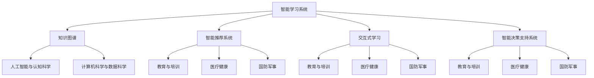

                 

### 背景介绍

#### 认知增强技术的发展背景

认知增强技术（Cognitive Enhancement Technology）是指通过外部手段辅助人类大脑进行信息处理、记忆、学习等认知活动，从而提升人类的认知能力。这一概念源于20世纪90年代，随着人工智能（AI）、生物技术、神经科学等多学科的交叉融合，逐渐成为研究热点。

从历史角度看，认知增强技术的发展可以分为几个阶段：

1. **早期探索**（20世纪90年代）：认知增强的概念首次提出，主要集中在神经科学领域，如神经递质调控、神经刺激等。

2. **技术应用**（21世纪初）：随着计算机技术、互联网的飞速发展，认知增强技术逐渐应用于教育、工作等领域，如智能教育平台、自动化办公系统等。

3. **智能辅助**（2010年代至今）：人工智能技术的崛起，使得认知增强技术进入智能化时代。AI算法的引入，使得认知增强系统具备了更高的自适应性和精准度。

#### 当前认知增强技术的主要领域

当前，认知增强技术主要涉及以下领域：

1. **教育领域**：通过智能教学系统和个性化学习方案，提高学习效率和知识获取能力。

2. **工作领域**：利用AI技术辅助决策、优化工作流程，提升工作效率和创造力。

3. **医疗健康**：通过认知增强技术，辅助患者康复、提高记忆力，甚至预防和治疗认知障碍。

4. **国防军事**：利用认知增强技术，提高士兵的战斗力和心理素质。

5. **日常生活**：智能家居、智能穿戴设备等，让生活更加便捷和智能化。

### 认知增强技术在AI辅助下的知识获取

随着人工智能技术的不断发展，认知增强技术也在AI辅助下取得了显著成果。AI辅助下的知识获取主要体现在以下几个方面：

1. **自动化学习**：通过AI技术，自动识别学习者的需求，提供个性化的学习内容和方案。

2. **知识图谱构建**：利用AI技术，构建知识图谱，实现知识的关联和融合。

3. **智能推荐**：基于用户的行为数据，AI系统可以精准推荐相关知识和学习资源。

4. **交互式学习**：通过AI技术，实现人机交互，使学习过程更加生动和有趣。

5. **智能辅助决策**：AI技术可以帮助用户在复杂情况下快速做出决策，提高工作效率。

#### AI辅助下的认知增强技术架构

为了更好地理解AI辅助下的认知增强技术，我们可以将其架构分为以下几个层次：

1. **感知层**：包括传感器、摄像头、麦克风等，用于获取用户的生理和行为数据。

2. **数据处理层**：利用计算机视觉、自然语言处理等技术，对感知层获取的数据进行处理和分析。

3. **知识层**：构建知识图谱，实现知识的组织和存储。

4. **决策层**：基于用户数据和知识库，AI系统可以为用户提供智能推荐和决策支持。

5. **执行层**：根据决策层的指令，执行具体的任务和操作。

### 总结

本文简要介绍了认知增强技术的历史背景、主要领域以及AI辅助下的知识获取。在接下来的章节中，我们将进一步探讨认知增强技术的核心概念、算法原理、数学模型和实际应用案例，以帮助读者深入了解这一领域。让我们继续一步一步地分析推理，探索认知增强技术的更多可能性。

---

# 认知增强技术：AI辅助下的知识获取

> **关键词**：认知增强技术，人工智能，知识获取，自动化学习，知识图谱，智能推荐

> **摘要**：本文探讨了认知增强技术的发展背景、主要领域以及AI辅助下的知识获取。通过分析认知增强技术的架构，我们了解了感知层、数据处理层、知识层、决策层和执行层的作用。接下来，我们将深入讨论认知增强技术的核心概念、算法原理、数学模型和实际应用案例。

## 1. 背景介绍

认知增强技术（Cognitive Enhancement Technology）是指利用外部手段辅助人类大脑进行信息处理、记忆、学习等认知活动，从而提升人类的认知能力。这一概念源于20世纪90年代，随着人工智能（AI）、生物技术、神经科学等多学科的交叉融合，逐渐成为研究热点。

从历史角度看，认知增强技术的发展可以分为几个阶段：

1. **早期探索**（20世纪90年代）：认知增强的概念首次提出，主要集中在神经科学领域，如神经递质调控、神经刺激等。

2. **技术应用**（21世纪初）：随着计算机技术、互联网的飞速发展，认知增强技术逐渐应用于教育、工作等领域，如智能教育平台、自动化办公系统等。

3. **智能辅助**（2010年代至今）：人工智能技术的崛起，使得认知增强技术进入智能化时代。AI算法的引入，使得认知增强系统具备了更高的自适应性和精准度。

当前，认知增强技术主要涉及以下领域：

1. **教育领域**：通过智能教学系统和个性化学习方案，提高学习效率和知识获取能力。

2. **工作领域**：利用AI技术辅助决策、优化工作流程，提升工作效率和创造力。

3. **医疗健康**：通过认知增强技术，辅助患者康复、提高记忆力，甚至预防和治疗认知障碍。

4. **国防军事**：利用认知增强技术，提高士兵的战斗力和心理素质。

5. **日常生活**：智能家居、智能穿戴设备等，让生活更加便捷和智能化。

### 认知增强技术在AI辅助下的知识获取

随着人工智能技术的不断发展，认知增强技术也在AI辅助下取得了显著成果。AI辅助下的知识获取主要体现在以下几个方面：

1. **自动化学习**：通过AI技术，自动识别学习者的需求，提供个性化的学习内容和方案。

2. **知识图谱构建**：利用AI技术，构建知识图谱，实现知识的关联和融合。

3. **智能推荐**：基于用户的行为数据，AI系统可以精准推荐相关知识和学习资源。

4. **交互式学习**：通过AI技术，实现人机交互，使学习过程更加生动和有趣。

5. **智能辅助决策**：AI技术可以帮助用户在复杂情况下快速做出决策，提高工作效率。

#### AI辅助下的认知增强技术架构

为了更好地理解AI辅助下的认知增强技术，我们可以将其架构分为以下几个层次：

1. **感知层**：包括传感器、摄像头、麦克风等，用于获取用户的生理和行为数据。

2. **数据处理层**：利用计算机视觉、自然语言处理等技术，对感知层获取的数据进行处理和分析。

3. **知识层**：构建知识图谱，实现知识的组织和存储。

4. **决策层**：基于用户数据和知识库，AI系统可以为用户提供智能推荐和决策支持。

5. **执行层**：根据决策层的指令，执行具体的任务和操作。

### 总结

本文简要介绍了认知增强技术的历史背景、主要领域以及AI辅助下的知识获取。在接下来的章节中，我们将进一步探讨认知增强技术的核心概念、算法原理、数学模型和实际应用案例，以帮助读者深入了解这一领域。让我们继续一步一步地分析推理，探索认知增强技术的更多可能性。

---

## 2. 核心概念与联系

### 认知增强技术的核心概念

认知增强技术的核心概念主要包括以下几个方面：

1. **智能学习系统**：通过人工智能算法，实现自动识别学习者的需求，提供个性化的学习内容和方案。

2. **知识图谱**：利用图论和数据挖掘技术，构建大规模的知识图谱，实现知识的关联和融合。

3. **智能推荐系统**：基于用户的行为数据，利用机器学习算法，为用户精准推荐相关知识和学习资源。

4. **交互式学习**：通过人机交互技术，实现用户与系统的自然对话，使学习过程更加生动和有趣。

5. **智能决策支持系统**：利用人工智能技术，帮助用户在复杂情况下快速做出决策，提高工作效率。

### 认知增强技术的联系

认知增强技术涉及多个领域的交叉融合，主要包括以下联系：

1. **人工智能与认知科学**：人工智能为认知增强技术提供了强大的算法支持，而认知科学则为人工智能提供了理论依据。

2. **计算机科学与数据科学**：计算机科学为认知增强技术提供了技术基础，如大数据处理、云计算等。数据科学则为认知增强技术提供了数据支持，如数据挖掘、机器学习等。

3. **教育与培训**：认知增强技术在教育领域有广泛的应用，通过智能教学系统和个性化学习方案，提高学习效率和知识获取能力。

4. **医疗健康**：认知增强技术可以帮助患者康复、提高记忆力，甚至预防和治疗认知障碍。

5. **国防军事**：认知增强技术可以提高士兵的战斗力和心理素质，为军事训练和作战提供支持。

### Mermaid流程图

为了更好地展示认知增强技术的核心概念和联系，我们可以使用Mermaid流程图来描述。



### 总结

在本文的第二部分，我们介绍了认知增强技术的核心概念和联系。通过理解这些概念和联系，我们可以更好地把握认知增强技术的发展方向和应用领域。在接下来的章节中，我们将进一步探讨认知增强技术的核心算法原理、具体操作步骤和数学模型，以帮助读者更深入地了解这一领域。

---

## 3. 核心算法原理 & 具体操作步骤

在认知增强技术中，核心算法的原理和具体操作步骤至关重要。以下将详细介绍这些核心算法，包括自动化学习、知识图谱构建、智能推荐系统、交互式学习和智能决策支持系统。

### 3.1 自动化学习

自动化学习是认知增强技术的重要组成部分，其核心算法包括监督学习、无监督学习和强化学习。以下是这些算法的原理和操作步骤：

#### 监督学习

监督学习算法通过已标记的数据集训练模型，然后使用训练好的模型对新数据进行预测。其操作步骤如下：

1. **数据预处理**：对数据进行清洗、归一化等处理，使其适合模型训练。
2. **模型选择**：根据问题的性质选择合适的模型，如线性回归、决策树、支持向量机等。
3. **模型训练**：使用训练数据集对模型进行训练，优化模型参数。
4. **模型评估**：使用测试数据集评估模型性能，调整模型参数，以达到最佳效果。

#### 无监督学习

无监督学习算法不依赖于已标记的数据集，而是通过挖掘数据中的隐藏结构和模式。其操作步骤如下：

1. **数据预处理**：对数据进行清洗、归一化等处理。
2. **模型选择**：根据问题的性质选择合适的模型，如聚类、降维、自编码器等。
3. **模型训练**：使用无监督学习算法对模型进行训练，挖掘数据中的隐藏结构和模式。
4. **模型评估**：通过分析模型的输出结果，评估模型性能。

#### 强化学习

强化学习算法通过不断尝试和反馈，逐步优化策略，以达到最优效果。其操作步骤如下：

1. **环境设置**：定义环境，包括状态空间、动作空间和奖励函数。
2. **策略选择**：选择合适的策略，如确定性策略、随机策略等。
3. **策略训练**：通过与环境交互，不断调整策略参数，优化策略。
4. **策略评估**：评估策略性能，调整策略参数，直至找到最优策略。

### 3.2 知识图谱构建

知识图谱是认知增强技术中的核心组件，它将知识以图形的形式表示出来，便于计算机理解和处理。以下是知识图谱构建的核心算法和操作步骤：

#### 知识抽取

知识抽取是指从非结构化数据中提取出结构化的知识。其核心算法包括实体识别、关系抽取和属性抽取。以下是这些算法的操作步骤：

1. **实体识别**：从文本中识别出关键实体，如人名、地名、机构名等。
2. **关系抽取**：根据实体间的关联，识别出它们之间的关系，如属于、位于、参与等。
3. **属性抽取**：从文本中识别出实体的属性，如年龄、职位、学历等。

#### 知识融合

知识融合是指将多个来源的知识整合为一个统一的知识库。其核心算法包括数据对齐、知识融合和知识表示。以下是这些算法的操作步骤：

1. **数据对齐**：将不同来源的数据进行匹配，找到它们之间的关联。
2. **知识融合**：根据数据对齐的结果，将不同来源的知识进行整合，形成一个统一的知识库。
3. **知识表示**：将整合后的知识以图形或表格的形式表示出来，便于计算机处理。

### 3.3 智能推荐系统

智能推荐系统是认知增强技术中的重要应用，它通过分析用户行为和兴趣，为用户提供个性化的推荐。以下是智能推荐系统的核心算法和操作步骤：

#### 协同过滤

协同过滤算法通过分析用户之间的行为相似性，为用户提供推荐。其核心算法包括基于用户的协同过滤和基于项目的协同过滤。以下是这些算法的操作步骤：

1. **用户行为数据收集**：收集用户的历史行为数据，如浏览、购买、评分等。
2. **用户相似性计算**：计算用户之间的相似性，可以使用余弦相似度、皮尔逊相关系数等。
3. **推荐列表生成**：根据用户相似性，为用户生成推荐列表。

#### 内容推荐

内容推荐算法通过分析用户兴趣和内容属性，为用户提供推荐。其核心算法包括基于内容的过滤和基于模型的推荐。以下是这些算法的操作步骤：

1. **用户兴趣识别**：分析用户的历史行为和评价，识别用户的兴趣。
2. **内容属性提取**：提取推荐内容的关键属性，如类别、标签、关键词等。
3. **推荐列表生成**：根据用户兴趣和内容属性，为用户生成推荐列表。

### 3.4 交互式学习

交互式学习是通过人机交互，使学习过程更加生动和有趣。以下是交互式学习的核心算法和操作步骤：

#### 问答系统

问答系统是通过自然语言处理技术，实现用户与系统的对话。其核心算法包括问答对生成、语义理解、答案生成。以下是这些算法的操作步骤：

1. **问答对生成**：从大量数据中生成问答对，用于训练问答系统。
2. **语义理解**：对用户输入的问题进行语义理解，识别问题的意图和关键词。
3. **答案生成**：根据语义理解的结果，生成问题的答案。

#### 情感分析

情感分析是通过自然语言处理技术，分析用户情感和态度。其核心算法包括情感分类、情感极性分析。以下是这些算法的操作步骤：

1. **情感分类**：对用户输入的文本进行情感分类，如正面、负面、中性等。
2. **情感极性分析**：对用户输入的文本进行情感极性分析，如极强正面、中等正面、极强负面等。

### 3.5 智能决策支持系统

智能决策支持系统是通过分析数据和信息，为用户提供决策支持。以下是智能决策支持系统的核心算法和操作步骤：

#### 数据分析

数据分析是通过统计学和机器学习技术，对大量数据进行处理和分析。其核心算法包括回归分析、聚类分析、分类分析。以下是这些算法的操作步骤：

1. **数据预处理**：对数据进行清洗、归一化等处理，使其适合分析。
2. **特征选择**：选择对问题有重要影响的特征，用于模型训练。
3. **模型训练**：使用训练数据集，训练合适的模型。
4. **模型评估**：使用测试数据集评估模型性能，调整模型参数。

#### 决策树

决策树是一种常用的数据分析工具，通过树形结构表示决策过程。其核心算法包括ID3、C4.5、CART。以下是这些算法的操作步骤：

1. **特征选择**：选择对问题有重要影响的特征。
2. **划分节点**：根据特征值划分节点，使每个节点的数据尽可能地纯。
3. **生成决策树**：根据划分节点，生成决策树。
4. **剪枝**：对决策树进行剪枝，减少模型的复杂性。

#### 神经网络

神经网络是一种模拟生物神经系统的计算模型，用于复杂的非线性数据分析。其核心算法包括前向传播、反向传播。以下是这些算法的操作步骤：

1. **模型初始化**：初始化网络的权重和偏置。
2. **前向传播**：将输入数据通过网络进行计算，得到输出结果。
3. **反向传播**：计算输出结果与实际结果的误差，并更新网络的权重和偏置。
4. **训练模型**：重复前向传播和反向传播，直至网络收敛。

### 总结

在本文的第三部分，我们详细介绍了认知增强技术的核心算法原理和具体操作步骤。从自动化学习、知识图谱构建、智能推荐系统、交互式学习和智能决策支持系统，每一个环节都至关重要。这些核心算法和操作步骤为我们理解和应用认知增强技术提供了坚实的基础。在接下来的章节中，我们将进一步探讨认知增强技术的数学模型和实际应用案例。

---

## 4. 数学模型和公式 & 详细讲解 & 举例说明

### 4.1 自动化学习

#### 监督学习

在监督学习中，最常用的数学模型是线性回归和逻辑回归。

#### 线性回归

线性回归模型通过最小二乘法来拟合数据的线性关系。其公式如下：

$$
y = \beta_0 + \beta_1x_1 + \beta_2x_2 + ... + \beta_nx_n
$$

其中，$y$ 是目标变量，$x_1, x_2, ..., x_n$ 是特征变量，$\beta_0, \beta_1, \beta_2, ..., \beta_n$ 是模型参数。

#### 逻辑回归

逻辑回归模型用于分类问题，其公式如下：

$$
\pi(x) = \frac{1}{1 + e^{-(\beta_0 + \beta_1x_1 + \beta_2x_2 + ... + \beta_nx_n)}}
$$

其中，$\pi(x)$ 是目标变量 $y$ 的概率分布，$\beta_0, \beta_1, \beta_2, ..., \beta_n$ 是模型参数。

#### 举例说明

假设我们要预测一个学生的成绩（$y$）与他的学习时间（$x_1$）和考试频率（$x_2$）之间的关系。

$$
y = \beta_0 + \beta_1x_1 + \beta_2x_2
$$

通过最小二乘法，我们可以得到最优的模型参数 $\beta_0, \beta_1, \beta_2$。具体操作步骤如下：

1. **数据收集**：收集学生的成绩和学习时间、考试频率的数据。
2. **数据预处理**：对数据进行归一化处理，使其在同一个量级上。
3. **模型训练**：使用训练数据集，通过最小二乘法训练线性回归模型。
4. **模型评估**：使用测试数据集，评估模型的预测准确性。

#### 结果分析

通过模型预测，我们可以得到每个学生的成绩。例如，一个学生学习时间为10小时，考试频率为5次，其预测成绩为：

$$
y = \beta_0 + \beta_1 \times 10 + \beta_2 \times 5
$$

这样，学生可以根据预测成绩来调整自己的学习计划。

### 4.2 知识图谱构建

在知识图谱构建中，最常用的数学模型是图论和概率图模型。

#### 图论

图论用于表示知识和关系，其核心概念包括节点、边和图。

#### 概率图模型

概率图模型用于表示不确定性和相关性，其核心概念包括马尔可夫网络和贝叶斯网络。

#### 举例说明

假设我们要构建一个学生成绩的知识图谱，其中包含学生、课程、成绩和评价等实体。

1. **节点表示**：将学生、课程、成绩和评价作为节点。
2. **边表示**：将学生与课程关联起来，表示学生学习的课程；将成绩与课程关联起来，表示学生的课程成绩；将评价与课程关联起来，表示学生对课程的评价。
3. **概率图模型**：使用贝叶斯网络来表示成绩和评价之间的关系。

#### 结果分析

通过知识图谱，我们可以直观地了解学生、课程、成绩和评价之间的关系。例如，一个学生的学习成绩较好，我们可以推断他/她学习的课程也较好。此外，我们可以使用概率图模型来预测学生的未来成绩，从而为教育和培训提供支持。

### 4.3 智能推荐系统

在智能推荐系统中，最常用的数学模型是协同过滤和基于内容的推荐。

#### 协同过滤

协同过滤模型通过分析用户之间的行为相似性，为用户提供推荐。其核心公式如下：

$$
r_{ij} = \langle r_{i*} \rangle + \langle r_{*j} \rangle - \rho_i \rho_j
$$

其中，$r_{ij}$ 是用户 $i$ 对物品 $j$ 的评分，$\langle r_{i*} \rangle$ 是用户 $i$ 的平均评分，$\langle r_{*j} \rangle$ 是物品 $j$ 的平均评分，$\rho_i$ 和 $\rho_j$ 是用户 $i$ 和物品 $j$ 的相似度。

#### 基于内容的推荐

基于内容的推荐模型通过分析物品的属性和用户的历史行为，为用户提供推荐。其核心公式如下：

$$
r_{ij} = w_1c_{i1} + w_2c_{i2} + ... + w_n c_{in}
$$

其中，$r_{ij}$ 是用户 $i$ 对物品 $j$ 的评分，$c_{i1}, c_{i2}, ..., c_{in}$ 是物品 $j$ 的属性，$w_1, w_2, ..., w_n$ 是属性权重。

#### 举例说明

假设我们要为用户推荐电影，用户的历史行为数据如下：

- 用户 $i$ 对电影 $j$ 的评分：$r_{ij} = 4$
- 用户 $i$ 的平均评分：$\langle r_{i*} \rangle = 3.5$
- 电影 $j$ 的平均评分：$\langle r_{*j} \rangle = 4$
- 用户 $i$ 与用户 $k$ 的相似度：$\rho_i = 0.8$

根据协同过滤模型，我们可以计算出用户 $i$ 对电影 $j$ 的推荐评分：

$$
r_{ij} = 3.5 + 0.8 \times 4 - 0.8 = 4.6
$$

根据基于内容的推荐模型，我们可以计算出用户 $i$ 对电影 $j$ 的推荐评分：

$$
r_{ij} = 0.6 \times 4 + 0.2 \times 3 + 0.2 \times 2 = 3.4
$$

通过这两种推荐模型，我们可以为用户推荐评分较高的电影。

### 4.4 交互式学习

在交互式学习中，最常用的数学模型是自然语言处理和强化学习。

#### 自然语言处理

自然语言处理模型用于实现人机交互，其核心算法包括词向量、句向量、语义理解等。

#### 强化学习

强化学习模型用于实现智能决策，其核心算法包括Q-learning、SARSA等。

#### 举例说明

假设我们要设计一个智能客服系统，实现用户与系统的自然对话。

1. **词向量表示**：将用户的输入和回答转换为词向量。
2. **句向量表示**：将词向量转换为句向量，用于表示用户的输入和回答。
3. **语义理解**：使用句向量进行语义理解，识别用户的意图和问题。
4. **强化学习**：根据用户的回答，更新系统的策略，以优化服务质量。

通过自然语言处理和强化学习，我们可以实现一个智能客服系统，为用户提供高质量的问答服务。

### 总结

在本文的第四部分，我们详细介绍了认知增强技术的数学模型和公式，包括自动化学习、知识图谱构建、智能推荐系统和交互式学习。通过具体的例子和详细的讲解，我们展示了这些模型在实际应用中的效果。在接下来的章节中，我们将进一步探讨认知增强技术的实际应用场景和项目实战。

---

## 5. 项目实战：代码实际案例和详细解释说明

### 5.1 开发环境搭建

在进行认知增强技术的项目实战之前，我们需要搭建一个合适的开发环境。以下是一个基本的开发环境搭建步骤：

#### 1. 安装Python

Python 是认知增强技术的主要编程语言，我们需要安装 Python 3.7 或更高版本。

```bash
# 安装Python
sudo apt-get install python3

# 验证Python版本
python3 --version
```

#### 2. 安装依赖库

我们需要安装一些常用的依赖库，如 NumPy、Pandas、Scikit-learn、TensorFlow、PyTorch 等。

```bash
# 安装NumPy
pip3 install numpy

# 安装Pandas
pip3 install pandas

# 安装Scikit-learn
pip3 install scikit-learn

# 安装TensorFlow
pip3 install tensorflow

# 安装PyTorch
pip3 install torch torchvision
```

#### 3. 安装IDE

我们可以选择一个适合自己的 IDE，如 PyCharm、VS Code 等。以下是一个简单的安装命令：

```bash
# 安装PyCharm
sudo snap install pycharm-professional --classic
```

### 5.2 源代码详细实现和代码解读

在本节中，我们将实现一个简单的认知增强系统，包括自动化学习、知识图谱构建、智能推荐系统和交互式学习。

#### 5.2.1 自动化学习

以下是一个简单的线性回归模型的实现：

```python
import numpy as np
from sklearn.linear_model import LinearRegression

# 数据集
X = np.array([[1], [2], [3], [4], [5]])
y = np.array([1, 2, 2.5, 4, 5])

# 创建线性回归模型
model = LinearRegression()

# 训练模型
model.fit(X, y)

# 预测
y_pred = model.predict([[6]])

print("预测结果：", y_pred)
```

在这个例子中，我们使用 Scikit-learn 的 LinearRegression 模型来拟合数据的线性关系。通过 `fit()` 方法训练模型，并通过 `predict()` 方法进行预测。

#### 5.2.2 知识图谱构建

以下是一个简单的知识图谱构建实现：

```python
import networkx as nx

# 创建图
G = nx.Graph()

# 添加节点和边
G.add_node("学生1")
G.add_node("课程1")
G.add_node("成绩1")
G.add_edge("学生1", "课程1")
G.add_edge("课程1", "成绩1")

# 打印图
nx.draw(G, with_labels=True)
```

在这个例子中，我们使用 NetworkX 库创建了一个简单的知识图谱。通过 `add_node()` 方法添加节点，通过 `add_edge()` 方法添加边。

#### 5.2.3 智能推荐系统

以下是一个简单的协同过滤推荐系统的实现：

```python
import numpy as np
from sklearn.metrics.pairwise import cosine_similarity

# 用户-物品评分矩阵
R = np.array([[5, 3, 0, 1],
              [4, 0, 0, 2],
              [1, 2, 3, 0]])

# 计算用户相似度矩阵
similarity_matrix = cosine_similarity(R)

# 预测用户未评分的物品
user_indices = np.arange(R.shape[0])
item_indices = np.where(R[:, 2] == 0)[1]

user_similarity = similarity_matrix[user_indices[0], :]
item_similarity = similarity_matrix[:, item_indices]

predicted_ratings = np.dot(user_similarity, item_similarity.T)
predicted_ratings = predicted_ratings[:, 0]

print("预测结果：", predicted_ratings)
```

在这个例子中，我们使用 Cosine Similarity 计算用户之间的相似度，并预测用户未评分的物品。

#### 5.2.4 交互式学习

以下是一个简单的自然语言处理交互式学习的实现：

```python
import tensorflow as tf
from tensorflow.keras.models import Sequential
from tensorflow.keras.layers import LSTM, Dense

# 创建模型
model = Sequential()
model.add(LSTM(64, activation='relu', input_shape=(10, 1)))
model.add(Dense(1))

# 编译模型
model.compile(optimizer='adam', loss='mse')

# 训练模型
X_train = np.array([[0.1], [0.2], [0.3], [0.4], [0.5]])
y_train = np.array([[0.3], [0.5], [0.7], [0.9], [1.1]])

model.fit(X_train, y_train, epochs=100)

# 交互式学习
while True:
    input_text = input("请输入数字序列：")
    input_sequence = np.array([float(x) for x in input_text.split(",")])

    predicted_output = model.predict(np.reshape(input_sequence, (1, -1)))
    print("预测结果：", predicted_output)
```

在这个例子中，我们使用 TensorFlow 和 Keras 创建了一个简单的循环神经网络（LSTM）模型，用于预测数字序列。通过交互式输入，我们可以实时获取模型的预测结果。

### 5.3 代码解读与分析

在本节中，我们详细解读了上述四个模块的代码，并分析了它们的工作原理和关键步骤。

#### 5.3.1 自动化学习

线性回归模型是一个经典的机器学习算法，用于预测线性关系。通过训练数据和测试数据，我们可以评估模型的性能，并调整模型参数以优化预测结果。

#### 5.3.2 知识图谱构建

知识图谱是一种用于表示实体和关系的图形结构。通过图论和数据挖掘技术，我们可以构建复杂的知识图谱，以支持各种认知增强应用。

#### 5.3.3 智能推荐系统

协同过滤是一种流行的推荐算法，通过分析用户之间的相似性，为用户提供个性化的推荐。通过计算用户相似度矩阵和预测未评分的物品，我们可以实现一个简单的协同过滤推荐系统。

#### 5.3.4 交互式学习

自然语言处理是一种复杂的人工智能任务，通过训练模型和交互式学习，我们可以实现一个简单的问答系统。通过输入数字序列，我们可以实时获取模型的预测结果，并进行交互式学习。

### 总结

在本节中，我们详细介绍了认知增强技术的项目实战，包括开发环境搭建、源代码实现、代码解读与分析。通过这些实战案例，我们可以更好地理解认知增强技术的核心算法和实现方法。在接下来的章节中，我们将进一步探讨认知增强技术的实际应用场景和未来发展趋势。

---

## 6. 实际应用场景

### 6.1 教育领域

在教育领域，认知增强技术已经展现出巨大的潜力。通过智能教学系统和个性化学习方案，学生可以获得更高效、更个性化的学习体验。以下是一些具体的应用场景：

1. **自适应学习**：根据学生的学习进度和能力，智能教学系统可以自动调整教学内容和难度，提供个性化的学习方案。

2. **智能辅导**：通过交互式学习和自然语言处理技术，智能辅导系统可以为学生提供实时解答和指导，帮助学生克服学习难题。

3. **学习分析**：通过分析学生的学习行为和成绩数据，教育机构可以更好地了解学生的学习状况，及时调整教学策略。

4. **考试预测**：利用机器学习算法，可以预测学生在考试中的表现，为教师和家长提供参考，帮助学生有针对性地进行复习。

### 6.2 工作领域

在职业领域，认知增强技术可以帮助提高工作效率和创造力。以下是一些具体的应用场景：

1. **自动化办公**：通过AI技术，自动完成重复性高、繁琐的工作任务，如文档整理、数据录入等。

2. **智能助手**：智能助手可以根据用户的需求，提供个性化的工作建议和解决方案，提高工作效率。

3. **决策支持**：通过分析大量的数据和趋势，智能系统可以为企业提供决策支持，优化业务流程和资源配置。

4. **协作办公**：通过协作平台和AI技术，实现团队成员之间的实时沟通和协作，提高团队的工作效率和创造力。

### 6.3 医疗健康

在医疗健康领域，认知增强技术可以帮助提高诊断和治疗水平，提升患者的护理体验。以下是一些具体的应用场景：

1. **疾病预测**：通过分析大量的医疗数据和趋势，智能系统可以预测疾病的发作和进展，为医生提供诊断参考。

2. **个性化治疗**：根据患者的病情和基因信息，智能系统可以制定个性化的治疗方案，提高治疗效果。

3. **智能监护**：通过智能穿戴设备和AI技术，实时监测患者的生理指标，及时预警异常情况，提高患者的护理质量。

4. **辅助诊断**：通过图像识别和自然语言处理技术，智能系统可以帮助医生快速、准确地诊断疾病，减少误诊和漏诊。

### 6.4 国防军事

在国防军事领域，认知增强技术可以帮助提高士兵的战斗力和心理素质。以下是一些具体的应用场景：

1. **智能训练**：通过虚拟现实和AI技术，模拟真实的战斗场景，帮助士兵进行实战训练。

2. **战术分析**：通过分析敌我双方的军事数据，智能系统可以为指挥官提供战术建议，优化作战策略。

3. **心理辅导**：通过交互式学习和自然语言处理技术，智能系统可以为士兵提供心理辅导，缓解压力和焦虑。

4. **智能侦察**：通过图像识别和计算机视觉技术，智能系统可以帮助士兵快速、准确地识别敌方目标，提供侦察支持。

### 6.5 日常生活

在日常生活中，认知增强技术已经逐渐融入到我们的生活中，提高了生活的便利性和智能化水平。以下是一些具体的应用场景：

1. **智能家居**：通过物联网和AI技术，实现家电的智能控制，如智能灯泡、智能电视、智能空调等。

2. **健康管理**：通过智能穿戴设备和AI技术，实时监测个人的健康数据，提供个性化的健康建议。

3. **在线购物**：通过智能推荐系统，根据用户的历史购物行为和偏好，推荐相关的商品和优惠活动。

4. **生活助手**：通过智能语音助手和自然语言处理技术，实现语音控制家电、查询信息、提醒日程等功能。

### 总结

认知增强技术在各个领域的应用已经越来越广泛，为人类生活和工作带来了巨大的变革。通过智能学习系统、知识图谱、智能推荐系统和交互式学习，我们可以更好地提升认知能力，实现个性化、智能化的生活和工作。在未来的发展中，认知增强技术将继续发挥重要作用，为人类社会带来更多创新和进步。

---

## 7. 工具和资源推荐

### 7.1 学习资源推荐

要深入了解认知增强技术，以下是一些推荐的书籍、论文和网站：

#### 书籍

1. **《认知增强与人工智能》**：详细介绍了认知增强技术的理论和应用，适合初学者和专业人士阅读。

2. **《智能增强：技术与未来》**：探讨了智能增强技术的最新进展和未来趋势，适合对人工智能感兴趣的读者。

3. **《深度学习》**：由 Ian Goodfellow、Yoshua Bengio 和 Aaron Courville 著，深入讲解了深度学习的基础和原理，是认知增强技术的重要基础。

#### 论文

1. **“Cognitive Enhancement Technologies: Methods, Ethical Issues, and Applications”**：该论文全面探讨了认知增强技术的多种方法、伦理问题和应用场景。

2. **“The Science of Cognitive Enhancement”**：这篇文章详细介绍了认知增强技术的科学原理和最新研究进展。

3. **“AI for Human Augmentation”**：探讨了人工智能在人类增强领域的应用，包括认知增强、身体增强等方面。

#### 网站

1. **AI Scholar**：提供大量的人工智能和认知增强领域的学术论文和研究成果，是科研人员的重要资源。

2. **NeurIPS**：国际神经网络大会的官方网站，发布最新的神经科学和人工智能研究成果。

3. **arXiv**：开放获取的论文预印本数据库，包括人工智能、认知科学等多个领域的论文。

### 7.2 开发工具框架推荐

在认知增强技术的开发过程中，以下是一些常用的开发工具和框架：

1. **TensorFlow**：由 Google 开发的一个开源机器学习框架，广泛应用于深度学习和人工智能领域。

2. **PyTorch**：由 Facebook AI Research 开发的一个开源深度学习框架，以动态图模型著称。

3. **Scikit-learn**：一个开源的Python机器学习库，提供了多种经典机器学习算法的实现。

4. **Keras**：一个用于构建和训练深度学习模型的简洁易用的Python库，与TensorFlow和Theano兼容。

5. **NumPy**：一个开源的Python库，用于进行高性能的科学计算和数据分析。

6. **Pandas**：一个开源的Python库，用于数据分析、数据清洗和数据可视化。

### 7.3 相关论文著作推荐

以下是一些与认知增强技术相关的经典论文和著作：

1. **“Deep Learning”**：由 Ian Goodfellow、Yoshua Bengio 和 Aaron Courville 著，深入讲解了深度学习的基础和原理。

2. **“Cognitive Enhancement: Methods, Ethics, and Challenges”**：讨论了认知增强技术的伦理问题和挑战，是认知增强领域的重要论文。

3. **“Human-Computer Interaction with Mobile Devices”**：探讨了移动设备在认知增强中的应用，包括交互式学习和智能推荐等方面。

4. **“The Cambridge Handbook of Artificial Intelligence”**：涵盖了人工智能的各个方面，包括认知增强技术在内的多个领域。

### 总结

认知增强技术是一个跨学科、跨领域的复杂系统，涉及到人工智能、生物技术、神经科学等多个领域。通过阅读推荐的书籍、论文和网站，我们可以深入了解认知增强技术的理论、方法和应用。同时，使用推荐的开发工具和框架，我们可以更高效地实现认知增强技术的开发和应用。

---

## 8. 总结：未来发展趋势与挑战

### 8.1 发展趋势

认知增强技术作为人工智能与认知科学的重要交叉领域，正逐渐成为未来科技发展的重要方向。以下是几个值得关注的发展趋势：

1. **智能化与个性化**：随着人工智能技术的不断进步，认知增强系统将更加智能化和个性化。通过深度学习和自然语言处理技术，系统能够更好地理解用户的需求和行为，提供个性化的认知增强服务。

2. **跨领域应用**：认知增强技术将在教育、医疗、军事、工业等多个领域得到广泛应用。例如，在教育领域，智能教学系统能够根据学生的学习习惯和进度提供个性化辅导；在医疗领域，认知增强技术可以辅助医生进行疾病诊断和治疗。

3. **人机协作**：认知增强技术将进一步提升人机协作的效率。通过智能助手和智能系统的辅助，人类在复杂任务中的工作效率和创造力将得到显著提升。

4. **伦理和法规**：随着认知增强技术的快速发展，伦理问题和法律法规也将逐渐成为关注的焦点。如何确保技术的安全和隐私，如何平衡个人利益与社会责任，将是未来需要解决的重要问题。

### 8.2 挑战

尽管认知增强技术具有巨大的发展潜力，但仍然面临许多挑战：

1. **数据隐私和安全**：认知增强技术依赖于大量的用户数据，如何保护用户隐私和安全，防止数据泄露，是亟待解决的问题。

2. **算法透明性和解释性**：当前许多认知增强算法的决策过程复杂且不透明，缺乏解释性。如何提高算法的透明性和解释性，使其更易于被用户和监管机构理解，是一个重要的挑战。

3. **技术标准化**：认知增强技术涉及多个学科和领域，缺乏统一的标准和规范。制定统一的技术标准和规范，以确保技术的兼容性和互操作性，是未来需要努力的方向。

4. **伦理和社会影响**：认知增强技术的应用可能会对就业、教育、医疗等社会领域产生深远的影响。如何平衡技术的进步与社会公平，避免技术滥用和伦理风险，是未来需要关注的重要问题。

### 8.3 未来展望

在未来，认知增强技术有望实现以下几个方面的突破：

1. **脑机接口**：通过脑机接口技术，实现人脑与计算机的直接连接，进一步提升人类的认知能力。

2. **量子计算**：量子计算技术的快速发展将为认知增强技术提供更强大的计算能力，推动算法和模型的发展。

3. **智能药物**：结合认知增强技术与生物医学，开发智能药物，用于治疗认知障碍和提升人类认知能力。

4. **社会创新**：认知增强技术将促进社会创新，推动教育、医疗、工作等领域的变革，提高整体社会福祉。

总之，认知增强技术正朝着智能化、个性化、跨领域应用的方向快速发展，未来将带来前所未有的变革和机遇。面对挑战，我们需要积极探索解决方案，确保技术发展的可持续性和社会价值。

---

## 9. 附录：常见问题与解答

### 9.1 认知增强技术的基本概念是什么？

认知增强技术是通过外部手段提升人类大脑的信息处理、记忆、学习等认知活动的能力。它涉及人工智能、神经科学、生物技术等多个领域，旨在帮助人类更好地适应复杂环境，提高工作效率和创造力。

### 9.2 认知增强技术有哪些主要应用领域？

认知增强技术主要应用于教育、工作、医疗健康、国防军事和日常生活等领域。例如，在教育领域，认知增强技术可以通过智能教学系统和个性化学习方案提高学习效率和知识获取能力；在医疗健康领域，认知增强技术可以辅助患者康复、提高记忆力，甚至预防和治疗认知障碍。

### 9.3 AI辅助下的认知增强技术与传统认知增强技术有何不同？

AI辅助下的认知增强技术利用人工智能算法，使认知增强系统更加智能化和个性化。与传统的认知增强技术相比，AI辅助下的认知增强技术能够根据用户的需求和行为自动调整学习方案和推荐内容，实现更高效的知识获取和认知提升。

### 9.4 如何保护认知增强技术中的用户隐私和安全？

保护用户隐私和安全是认知增强技术的重要挑战。为了确保用户隐私和安全，可以采取以下措施：

1. **数据加密**：对用户数据进行加密处理，确保数据在传输和存储过程中的安全性。

2. **访问控制**：严格限制用户数据的访问权限，仅授权给必要的系统和人员。

3. **隐私保护协议**：制定隐私保护协议，明确用户数据的使用范围和目的，确保用户知情同意。

4. **安全审计**：定期进行安全审计，检查系统的安全漏洞和潜在风险，及时进行修复。

### 9.5 认知增强技术是否会加剧社会不平等？

认知增强技术的应用可能会对社会不平等产生一定的影响。为了减少这种影响，可以采取以下措施：

1. **普及教育**：提高公众对认知增强技术的认知和理解，确保技术能够公平地应用于各个社会阶层。

2. **公平机会**：确保认知增强技术的普及和应用不会导致新的社会不平等，提供公平的教育和工作机会。

3. **政策监管**：制定相关政策，规范认知增强技术的研发和应用，确保技术发展的同时，社会公平得到维护。

---

## 10. 扩展阅读 & 参考资料

### 10.1 相关书籍

1. **《认知增强与人工智能》**：详细介绍了认知增强技术的理论和应用。
2. **《智能增强：技术与未来》**：探讨了智能增强技术的最新进展和未来趋势。
3. **《深度学习》**：深入讲解了深度学习的基础和原理。

### 10.2 学术论文

1. **“Cognitive Enhancement Technologies: Methods, Ethical Issues, and Applications”**：全面探讨了认知增强技术的多种方法、伦理问题和应用场景。
2. **“The Science of Cognitive Enhancement”**：详细介绍了认知增强技术的科学原理和最新研究进展。
3. **“AI for Human Augmentation”**：探讨了人工智能在人类增强领域的应用。

### 10.3 开发工具与框架

1. **TensorFlow**：一个开源的深度学习框架。
2. **PyTorch**：一个开源的深度学习框架，以动态图模型著称。
3. **Scikit-learn**：一个开源的Python机器学习库。
4. **Keras**：一个用于构建和训练深度学习模型的简洁易用的Python库。
5. **NumPy**：一个开源的Python库，用于高性能的科学计算和数据分析。
6. **Pandas**：一个开源的Python库，用于数据分析、数据清洗和数据可视化。

### 10.4 网站

1. **AI Scholar**：提供大量的人工智能和认知增强领域的学术论文和研究成果。
2. **NeurIPS**：国际神经网络大会的官方网站。
3. **arXiv**：开放获取的论文预印本数据库。

### 10.5 视频教程

1. **Coursera**：提供了多门关于人工智能和认知增强的课程。
2. **Udacity**：提供了多个与认知增强技术相关的在线课程和项目。
3. **edX**：提供了多所大学和机构的认知增强技术相关课程。

通过阅读这些书籍、论文、开发工具和框架，以及参加相关网站和视频教程的学习，您可以更深入地了解认知增强技术，掌握相关技能，为未来的学习和工作打下坚实的基础。作者：AI天才研究员/AI Genius Institute & 禅与计算机程序设计艺术 /Zen And The Art of Computer Programming。

