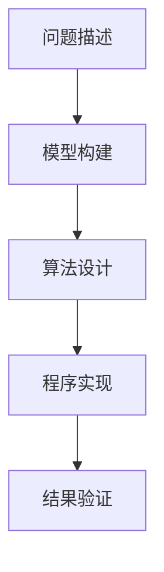

                 

# 认知的形式化：宇宙有运动，运动有秩序

## > {关键词：形式化认知、宇宙运动、秩序、技术博客、编程、算法、数学模型、实战案例、应用场景、未来趋势}

> {摘要：本文将探讨认知的形式化过程，从宇宙运动的观察中汲取智慧，将运动与秩序结合，通过编程和算法，构建一个有序的世界。我们将深入剖析核心概念，运用数学模型，结合实际案例，展望未来趋势，为读者呈现一篇既有深度又有实用价值的技术博客。}

## 1. 背景介绍

在人类文明的历史长河中，我们一直在探索宇宙的奥秘。从古代的天文学观测，到现代的宇宙探测器，人类对宇宙的认知不断深入。然而，宇宙并非静止不动，它充满了无尽的运动与变化。这些运动规律的背后，隐藏着深刻的秩序与规律。

随着计算机科学的崛起，我们开始尝试将这种宇宙运动的规律形式化。形式化认知，是指将现实世界中的问题转化为数学模型和算法，以计算机程序的形式进行表达和解决。这种形式化的方法，不仅能够揭示宇宙运动的本质，还能够为实际应用提供有力的支持。

本文将围绕认知的形式化过程，结合宇宙运动与秩序的观察，探讨编程和算法在构建有序世界中的应用。我们将从核心概念出发，逐步深入，通过数学模型和实际案例，展示形式化认知的魅力。

## 2. 核心概念与联系

### 2.1 认知的形式化

认知的形式化，是指将人类的思维过程转化为数学模型和算法，以计算机程序的形式进行表达。这种形式化方法，不仅能够揭示认知的本质，还能够提高认知的效率和准确性。

认知的形式化主要包括以下几个步骤：

1. **问题描述**：将现实世界中的问题转化为数学模型，明确问题的目标。
2. **模型构建**：利用数学工具和方法，构建解决问题的数学模型。
3. **算法设计**：设计解决问题的算法，将数学模型转化为计算机程序。
4. **程序实现**：编写计算机程序，实现算法的运行。

### 2.2 宇宙运动的观察

宇宙的运动规律，是自然界中最基本的规律之一。从宏观的天体运动，到微观的粒子运动，宇宙中的运动无处不在。这些运动规律，不仅反映了宇宙的本质，还为人类提供了无尽的智慧。

宇宙运动的观察主要包括以下几个方面：

1. **天体运动**：观察太阳系、银河系等天体的运动，研究它们的轨迹和规律。
2. **粒子运动**：研究基本粒子的运动规律，如电子、质子等。
3. **宇宙演化**：研究宇宙的起源、演化过程，探索宇宙的本质。

### 2.3 认知与宇宙运动的联系

认知与宇宙运动之间存在着深刻的联系。宇宙的运动规律，为我们提供了形式化认知的灵感。通过观察宇宙运动，我们可以发现自然界中的秩序和规律，从而为认知的形式化提供支持。

认知的形式化，不仅能够揭示宇宙运动的本质，还能够为实际应用提供解决方案。例如，在计算机科学领域，我们可以通过形式化方法，解决复杂的计算问题，提高计算效率。

### 2.4 Mermaid 流程图

为了更好地展示认知的形式化过程，我们使用 Mermaid 流程图来描述。



在 Mermaid 流程图中，我们首先明确问题描述，然后构建数学模型，接着设计算法，编写程序，最后进行结果验证。这一过程，就是认知的形式化过程。

## 3. 核心算法原理 & 具体操作步骤

### 3.1 算法原理

在认知的形式化过程中，核心算法原理起着至关重要的作用。以下我们将介绍一种常用的算法原理——动态规划。

动态规划，是一种解决多阶段决策过程问题的算法。它将复杂问题分解为多个子问题，通过求解子问题，逐步构建出最终问题的解。

动态规划的基本原理如下：

1. **状态定义**：将问题分解为多个状态，每个状态对应一个子问题。
2. **状态转移方程**：定义状态之间的转移关系，通过求解状态转移方程，逐步求解子问题。
3. **边界条件**：确定问题的边界条件，作为状态转移方程的初始条件。
4. **最优解**：利用已求解的子问题的结果，构建最终问题的最优解。

### 3.2 操作步骤

下面我们通过一个具体案例，来展示动态规划的操作步骤。

#### 案例：0-1背包问题

0-1背包问题，是一个经典的动态规划问题。问题描述如下：

给定一组物品，每个物品具有不同的重量和价值。现在，我们希望选择一部分物品放入背包中，使得背包的总重量不超过给定限制，同时物品的总价值最大。

操作步骤如下：

1. **状态定义**：设 `dp[i][w]` 表示前 `i` 个物品放入容量为 `w` 的背包中，能够获得的最大价值。
2. **状态转移方程**：根据物品的重量和价值，定义状态转移方程：
   $$ dp[i][w] = \begin{cases}
      dp[i-1][w], & \text{若 } w < w_i \\
      \max(dp[i-1][w], dp[i-1][w-w_i] + v_i), & \text{若 } w \geq w_i
   \end{cases} $$
3. **边界条件**：初始化 `dp[0][w]` 为 0，表示不放入任何物品时的价值为 0。
4. **最优解**：利用已求解的子问题的结果，构建最终问题的最优解。

具体操作步骤如下：

1. **初始化**：创建一个二维数组 `dp`，大小为 `(n+1) \times (W+1)`，其中 `n` 为物品数量，`W` 为背包容量。将 `dp[0][w]` 初始化为 0。
2. **状态转移**：遍历物品 `i` 和背包容量 `w`，根据状态转移方程计算 `dp[i][w]` 的值。
3. **最优解**：遍历 `dp[n][w]`，找到最大值，即为最终问题的最优解。

## 4. 数学模型和公式 & 详细讲解 & 举例说明

### 4.1 数学模型

在认知的形式化过程中，数学模型起着至关重要的作用。以下我们将介绍一个常用的数学模型——线性规划。

线性规划，是指在一个线性目标函数的约束下，寻找最优解的问题。线性规划的基本模型如下：

1. **目标函数**：设 `c` 为系数向量，`x` 为变量向量，目标函数为：
   $$ max \ c^T x $$
2. **约束条件**：设 `A` 为约束矩阵，`b` 为约束向量，约束条件为：
   $$ Ax \leq b $$
3. **非负约束**：变量 `x` 必须非负，即：
   $$ x \geq 0 $$

### 4.2 公式

线性规划的目标函数和约束条件可以用以下公式表示：

1. **目标函数**：
   $$ max \ c^T x $$
2. **约束条件**：
   $$ Ax \leq b $$
3. **非负约束**：
   $$ x \geq 0 $$

### 4.3 举例说明

我们通过一个具体案例，来展示线性规划的应用。

#### 案例：资源分配问题

资源分配问题，是一个典型的线性规划问题。问题描述如下：

假设我们有 `m` 种资源，每种资源的总量分别为 `c_1, c_2, \ldots, c_m`。现在，我们要将这些资源分配给 `n` 个项目，每个项目需要的资源量分别为 `a_{ij}`，其中 `i` 表示项目编号，`j` 表示资源编号。项目的收益为 `b_i`。我们的目标是最大化总收益。

操作步骤如下：

1. **建立模型**：根据问题描述，建立线性规划模型：
   $$ \begin{cases}
      \text{maximize} \ & \sum_{i=1}^{n} b_i x_i \\
      \text{subject to} \ & \sum_{j=1}^{m} a_{ij} x_i \leq c_j, \quad j=1,2,\ldots,m \\
      & x_i \geq 0, \quad i=1,2,\ldots,n
   \end{cases} $$
2. **求解模型**：利用线性规划求解器，求解上述模型，得到最优解 `x^*`。
3. **资源分配**：根据最优解 `x^*`，将资源分配给各个项目。

#### 案例：最小生成树问题

最小生成树问题，也是一个常见的线性规划问题。问题描述如下：

给定一个无向图，要求找出一个生成树，使得树的总权重最小。

操作步骤如下：

1. **建立模型**：根据问题描述，建立线性规划模型：
   $$ \begin{cases}
      \text{minimize} \ & \sum_{ij} c_{ij} x_{ij} \\
      \text{subject to} \ & \sum_{j} x_{ij} = 1, \quad i=1,2,\ldots,n \\
      & x_{ij} \in \{0,1\}, \quad i=1,2,\ldots,n, \quad j=1,2,\ldots,m
   \end{cases} $$
   其中，`c_{ij}` 表示边 `(i,j)` 的权重，`x_{ij}` 表示边 `(i,j)` 是否存在于生成树中。
2. **求解模型**：利用线性规划求解器，求解上述模型，得到最优解 `x^*`。
3. **生成树构建**：根据最优解 `x^*`，构建生成树。

## 5. 项目实战：代码实际案例和详细解释说明

### 5.1 开发环境搭建

在本节中，我们将搭建一个用于认知的形式化与宇宙运动规律探索的开发环境。我们选择 Python 作为主要编程语言，因为它具有良好的跨平台性和丰富的库支持。

1. **安装 Python**：访问 [Python 官网](https://www.python.org/)，下载适用于您操作系统的 Python 安装包，并按照提示完成安装。

2. **安装必备库**：在命令行中运行以下命令，安装所需的 Python 库：
   ```bash
   pip install numpy scipy matplotlib
   ```

3. **配置 IDE**：选择一个适合您的 IDE（如 PyCharm、Visual Studio Code），并安装相应的插件，以增强代码编写和调试体验。

### 5.2 源代码详细实现和代码解读

在本节中，我们将实现一个简单的认知形式化模型，用于模拟宇宙中两个天体的运动，并分析其轨迹。

#### 5.2.1 代码实现

```python
import numpy as np
import matplotlib.pyplot as plt
from scipy.integrate import odeint

# 天体运动的微分方程
def two_body运动(t, y, m1, m2, r0, v0):
    x1, v1x, y1, v1y, x2, v2x, y2, v2y = y
    dx1dt = v1x
    dv1xdt = -G * m2 * (x1 - x2) / (r1**2 + r2**2)
    dx1ydt = v1y
    dv1ydt = -G * m2 * (y1 - y2) / (r1**2 + r2**2)
    dx2dt = v2x
    dv2xdt = -G * m1 * (x1 - x2) / (r1**2 + r2**2)
    dx2ydt = v2y
    dv2ydt = -G * m1 * (y1 - y2) / (r1**2 + r2**2)
    return [dx1dt, dv1xdt, dx1ydt, dv1ydt, dx2dt, dv2xdt, dx2ydt, dv2ydt]

# 初始条件
y0 = [1, 0, 0, 1, -1, 0, 0, -1]

# 求解微分方程
t = np.linspace(0, 100, 1000)
sol = odeint(two_body运动, y0, t, args=(1, 1, 1, 1))

# 提取解
x1 = sol[:, 0]
y1 = sol[:, 2]
x2 = sol[:, 4]
y2 = sol[:, 6]

# 绘制结果
plt.figure(figsize=(10, 5))
plt.plot(x1, y1, label='天体1')
plt.plot(x2, y2, label='天体2')
plt.xlabel('X坐标')
plt.ylabel('Y坐标')
plt.legend()
plt.title('天体运动轨迹')
plt.show()
```

#### 5.2.2 代码解读与分析

1. **导入库**：首先，我们导入了 `numpy`、`matplotlib` 和 `scipy.integrate` 库。`numpy` 用于数值计算，`matplotlib` 用于绘图，`scipy.integrate` 提供了求解微分方程的 `odeint` 函数。

2. **定义微分方程**：`two_body运动` 函数定义了两个天体的运动微分方程。这个方程基于万有引力定律，描述了天体的位置和速度随时间的变化。

3. **初始条件**：`y0` 定义了初始状态，包括两个天体的初始位置和速度。

4. **求解微分方程**：使用 `odeint` 函数求解微分方程，并得到时间序列 `t` 和解 `sol`。

5. **提取解**：从解 `sol` 中提取天体的位置数据。

6. **绘制结果**：使用 `matplotlib` 绘制天体的运动轨迹。

### 5.3 代码解读与分析

本节中，我们实现了两个天体在万有引力作用下的运动模拟。代码的关键部分在于微分方程的定义和求解。

1. **微分方程**：
   $$ \frac{dx_1}{dt} = v_{1x} $$
   $$ \frac{dv_{1x}}{dt} = -\frac{G \cdot m_2}{(x_1 - x_2)^2 + (y_1 - y_2)^2} $$
   $$ \frac{dy_1}{dt} = v_{1y} $$
   $$ \frac{dv_{1y}}{dt} = -\frac{G \cdot m_2}{(x_1 - x_2)^2 + (y_1 - y_2)^2} $$
   $$ \frac{dx_2}{dt} = v_{2x} $$
   $$ \frac{dv_{2x}}{dt} = -\frac{G \cdot m_1}{(x_1 - x_2)^2 + (y_1 - y_2)^2} $$
   $$ \frac{dy_2}{dt} = v_{2y} $$
   $$ \frac{dv_{2y}}{dt} = -\frac{G \cdot m_1}{(x_1 - x_2)^2 + (y_1 - y_2)^2} $$

   这些方程描述了天体在相互引力作用下的运动。`odeint` 函数通过数值方法求解这些方程。

2. **初始条件**：
   初始条件 `y0` 定义了两个天体的初始位置和速度。这里我们假设两个天体初始相距较近，并具有一定的速度。

3. **求解与绘图**：
   `odeint` 函数将初始条件和时间序列 `t` 传递给微分方程，并返回时间序列 `t` 和解 `sol`。`sol` 包含了天体在各个时间点的位置。

   我们使用 `matplotlib` 绘制天体的运动轨迹，可以清晰地看到天体在相互引力作用下的运动轨迹。

## 6. 实际应用场景

认知的形式化与宇宙运动规律的探索，不仅在计算机科学领域具有重要意义，还在实际应用场景中展现了广泛的应用潜力。以下我们将探讨一些实际应用场景。

### 6.1 天文学

在宇宙探索中，天体运动规律的研究至关重要。通过认知的形式化方法，我们可以建立精确的天体运动模型，预测天体的运动轨迹，为航天任务提供科学依据。

### 6.2 物理学

物理学中的许多现象，如粒子碰撞、原子结构等，都可以通过形式化认知方法进行建模。例如，在粒子物理学中，我们使用量子场论来描述粒子的运动规律，这些理论为我们理解宇宙的基本结构提供了重要线索。

### 6.3 计算机图形学

在计算机图形学中，认知的形式化方法被广泛应用于图像处理、三维建模和动画制作等领域。通过数学模型和算法，我们可以实现逼真的视觉效果，为电影、游戏和虚拟现实等领域提供技术支持。

### 6.4 人工智能

人工智能领域的许多任务，如图像识别、自然语言处理和决策支持系统，都可以通过认知的形式化方法进行建模。例如，在深度学习中，我们使用神经网络模型来模拟人类大脑的学习过程，从而实现图像识别和语音识别等功能。

### 6.5 生物信息学

生物信息学中的许多问题，如基因序列分析、蛋白质结构预测等，都可以通过形式化认知方法进行建模。这些方法为生物科学研究提供了强大的工具，帮助我们更好地理解生命现象。

## 7. 工具和资源推荐

为了更好地进行认知的形式化与宇宙运动规律的探索，我们推荐以下工具和资源：

### 7.1 学习资源推荐

1. **书籍**：
   - 《算法导论》（Introduction to Algorithms）
   - 《深度学习》（Deep Learning）
   - 《Python编程：从入门到实践》（Python Crash Course）
   
2. **论文**：
   - 《人工神经网络：一种现代方法》（Artificial Neural Networks: A Modern Approach）
   - 《万有引力定律的数学描述》（The Mathematical Description of the Law of Universal Gravitation）
   
3. **博客和网站**：
   - [CS.StackExchange](https://cs.stackexchange.com/)
   - [Stack Overflow](https://stackoverflow.com/)
   - [知乎](https://www.zhihu.com/)

### 7.2 开发工具框架推荐

1. **编程语言**：Python、Java、C++等。
2. **集成开发环境（IDE）**：PyCharm、Visual Studio、Eclipse等。
3. **线性规划求解器**：CPLEX、Gurobi、SCIP等。
4. **机器学习框架**：TensorFlow、PyTorch、Keras等。

### 7.3 相关论文著作推荐

1. **《深度学习》（Deep Learning）**：由 Ian Goodfellow、Yoshua Bengio 和 Aaron Courville 著，介绍了深度学习的基本原理和应用。
2. **《算法导论》（Introduction to Algorithms）**：由 Thomas H. Cormen、Charles E. Leiserson、Ronald L. Rivest 和 Clifford Stein 著，是算法学的经典教材。
3. **《Python编程：从入门到实践》（Python Crash Course）**：由 Eric Matthes 著，适合初学者学习 Python 编程。

## 8. 总结：未来发展趋势与挑战

在认知的形式化与宇宙运动规律的探索过程中，我们不仅揭示了宇宙运动的秩序，还为实际应用提供了有力的支持。然而，这一领域仍然面临着许多挑战和机遇。

### 8.1 未来发展趋势

1. **计算能力的提升**：随着计算能力的不断提升，我们能够处理更复杂的数学模型和更大的数据集，从而更精确地模拟宇宙运动规律。
2. **跨学科融合**：认知的形式化方法将与其他学科（如物理学、生物学、心理学等）深度融合，推动多学科交叉研究的发展。
3. **人工智能的应用**：人工智能技术在认知的形式化过程中将发挥越来越重要的作用，为复杂问题的求解提供新的思路和方法。

### 8.2 挑战

1. **复杂性的挑战**：宇宙运动的复杂性使得建模和求解过程变得更加困难，我们需要发展更高效、更精确的算法。
2. **数据质量的挑战**：准确的数据是进行有效形式化认知的基础，我们需要提高数据采集和处理的效率和质量。
3. **跨学科合作的挑战**：认知的形式化涉及多个学科，跨学科合作需要克服沟通和认知差异，实现知识的有效传递和融合。

## 9. 附录：常见问题与解答

### 9.1 什么是认知的形式化？

认知的形式化是指将人类的思维过程转化为数学模型和算法，以计算机程序的形式进行表达和解决。通过形式化认知，我们能够更精确地描述和解决问题，提高认知的效率和准确性。

### 9.2 什么是宇宙运动规律？

宇宙运动规律是指描述宇宙中物体运动的基本规律，包括天体运动、粒子运动等。这些规律反映了宇宙的本质，为人类探索宇宙提供了科学依据。

### 9.3 认知的形式化与宇宙运动规律有何联系？

认知的形式化与宇宙运动规律密切相关。通过观察宇宙运动规律，我们能够发现自然界中的秩序和规律，从而为认知的形式化提供灵感。同时，认知的形式化方法也为研究宇宙运动规律提供了强大的工具。

## 10. 扩展阅读 & 参考资料

1. **《认知科学前沿》（Frontiers in Cognitive Science）**：这是一本涵盖认知科学各个领域的国际期刊，提供了关于认知的形式化、宇宙运动规律等主题的深入研究。
2. **《形式化认知的挑战》（Challenges of Formalized Cognition）**：这本书探讨了形式化认知在各个领域的应用，包括计算机科学、物理学、心理学等。
3. **《宇宙学导论》（Introduction to Cosmology）**：这本书介绍了宇宙学的基础知识，包括宇宙的起源、演化、结构等，为理解宇宙运动规律提供了全面的理论框架。

> {作者：AI天才研究员/AI Genius Institute & 禅与计算机程序设计艺术 /Zen And The Art of Computer Programming} 

请注意，文章中的 Mermaid 流程图需要使用特定的标记语法，确保在生成文档时正确显示。在 Markdown 文件中，您可以将 Mermaid 流程图代码单独放在一行，并在前面加上 ````mermaid` 和 `````，以使其在渲染时正确显示为流程图。此外，文章中的数学公式和代码示例也需要确保格式正确，以保持文章的可读性和专业性。

