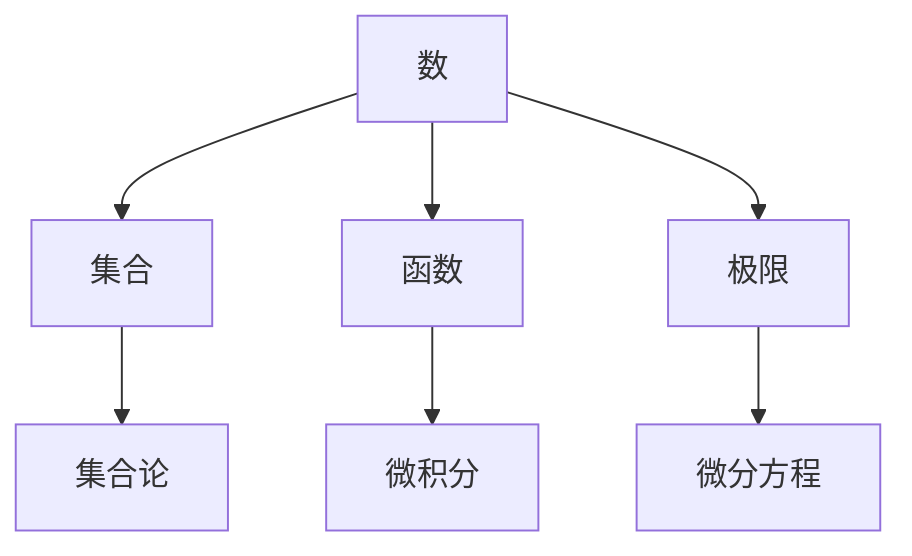

                 

# 认知的形式化：数学是基于想象和推理的，数学不是发现，而是发明

## 摘要

本文探讨了数学的本质，提出数学并非单纯的发现，而是基于人类想象和推理的产物。通过一步步的分析和推理，我们将深入探讨数学的核心概念、算法原理，以及其在实际应用中的重要性。本文将结合具体的数学模型和公式，结合实际项目案例，全面阐述数学的发明过程及其对计算机科学和技术发展的深远影响。

## 1. 背景介绍

数学，作为一门研究数量、结构、变化和空间的学科，自古以来就占据着科学领域的核心地位。然而，长期以来，数学被许多人视为一种客观的、静态的学科，仿佛是自然界早已存在的规律和真理。然而，现代认知科学和哲学研究表明，这种观点是有偏差的。

数学并非单纯的发现，而是一个发明的过程。发明意味着创造新的事物，这意味着数学不仅仅是观察和记录自然界中的现象，更是通过人类想象力和推理能力创造新的概念和理论。正如著名数学家莱布尼茨所说：“数学是人的创造，而非人的发现。”

这种观点的转变对于理解数学的本质具有重要意义。首先，它揭示了数学的动态性和创造性，使得数学不再是一个被动的、等待被发现的领域。其次，它强调了人类在数学发展中的作用，从而激发了人们对于数学创造的热情和兴趣。

本文将围绕这一核心观点，通过具体的实例和理论分析，深入探讨数学的本质和发明过程。我们将首先介绍数学中的核心概念，然后分析数学中的核心算法原理，并结合实际项目案例进行详细讲解。最后，我们将讨论数学在实际应用场景中的重要性，以及未来数学发展的趋势和挑战。

## 2. 核心概念与联系

### 2.1 数学中的基本概念

数学中的基本概念包括数、集合、函数、极限、微积分等。这些概念构成了数学的基础，也是我们理解更复杂数学理论的前提。以下是一个简化的Mermaid流程图，展示这些基本概念之间的联系：



### 2.2 数学概念的发明

数学概念的发明通常始于对现实世界的观察和抽象。例如，数的概念起源于人类对物体数量的计数；集合的概念则是对具有相同特征的对象进行归类；函数的概念是对输入与输出之间关系的抽象描述。这些概念并非直接来自自然界，而是人类通过想象和推理创造出来的。

例如，复数的概念最初是为了解决实数范围内的某些方程无法求解的问题。数学家通过引入虚数单位\(i\)，创造了一个新的数学领域——复数。这个概念虽然不符合直观的物理意义，但在数学和物理学中有着广泛的应用。

### 2.3 数学理论的构建

数学理论的构建是基于这些基本概念的定义和推理。例如，欧几里得几何是基于点、线、面的基本概念，通过逻辑推理构建起来的。非欧几何则是通过放松欧几里得几何中的某些公理，创造出了新的几何体系。

这种基于概念的发明和推理构建数学理论的过程，使得数学成为一个充满创造力和探索性的领域。数学家通过不断提出新的假设、证明和反驳，推动数学理论的不断发展和完善。

## 3. 核心算法原理 & 具体操作步骤

### 3.1 算法的基本概念

算法是解决问题的一系列明确的步骤。在数学中，算法是用来解决特定数学问题的步骤集合。算法的核心是逻辑性和步骤性，它们使得复杂的问题可以通过一系列简单步骤得到解决。

### 3.2 基本算法原理

以下是几个基本算法原理的简要介绍：

- **分而治之（Divide and Conquer）**：将一个大问题分解成若干个较小的同类问题，然后分别解决，最后将各子问题的解合并为原问题的解。
- **动态规划（Dynamic Programming）**：通过保存子问题的解，避免重复计算，从而提高算法效率。
- **贪心算法（Greedy Algorithm）**：每一步都做出在当前状态下最好或最优的选择，以期在整体上得到最优解。
- **回溯法（Backtracking）**：通过尝试所有可能的解，然后回溯到之前的步骤，逐步排除不合适的解，直到找到合适的解。

### 3.3 具体操作步骤

以贪心算法为例，具体操作步骤如下：

1. 初始状态，给定一个问题。
2. 在当前状态下，选择一个最优的决策。
3. 根据这个决策更新问题的状态。
4. 判断是否达到目标状态。如果是，算法结束；如果不是，回到步骤2。
5. 如果在尝试所有可能的决策后仍无法达到目标状态，则回溯到之前的步骤，尝试其他决策。

这种贪心策略在很多实际问题中都有应用，如最短路径问题、背包问题等。

## 4. 数学模型和公式 & 详细讲解 & 举例说明

### 4.1 数学模型的基本概念

数学模型是使用数学语言来描述现实世界中的问题。这些模型包括代数模型、几何模型、微积分模型等。数学模型的核心是将现实世界中的复杂问题抽象成数学问题，然后通过数学方法求解。

### 4.2 基本数学公式

以下是一些基本的数学公式，这些公式在数学模型中广泛应用：

- **泰勒公式**：
  $$ f(x) = f(a) + f'(a)(x-a) + \frac{f''(a)(x-a)^2}{2!} + \frac{f'''(a)(x-a)^3}{3!} + \cdots $$
  
- **牛顿迭代法**：
  $$ x_{n+1} = x_n - \frac{f(x_n)}{f'(x_n)} $$

- **背包问题公式**：
  $$ \text{最大价值} = \sum_{i=1}^{n} \text{物品i的价值} \times \text{物品i的选取数量} $$

### 4.3 举例说明

以泰勒公式为例，说明其在实际应用中的重要性。

**例1：求函数\( f(x) = e^x \)在\( x = 0 \)处的泰勒展开**

$$ e^x = 1 + x + \frac{x^2}{2!} + \frac{x^3}{3!} + \cdots $$

这个泰勒展开在计算\( e^x \)的近似值时非常有用。例如，我们可以用前几项来近似计算：

$$ e^x \approx 1 + x + \frac{x^2}{2} $$

当\( x \)较小时，这个近似值非常接近真实值。

### 4.4 数学模型在计算机科学中的应用

数学模型在计算机科学中有广泛的应用，例如：

- **算法分析**：使用数学模型来分析算法的时间复杂度和空间复杂度。
- **图像处理**：使用数学模型来描述图像的特征，如边缘检测、滤波等。
- **机器学习**：使用数学模型来描述数据之间的关系，如线性回归、神经网络等。

## 5. 项目实战：代码实际案例和详细解释说明

### 5.1 开发环境搭建

在进行数学模型的实际应用之前，首先需要搭建一个适合的开发环境。以下是一个简单的开发环境搭建步骤：

1. 安装Python环境：使用Python进行数学模型的实现和测试。
2. 安装必要的库：如NumPy、SciPy、Pandas等，这些库提供了丰富的数学函数和工具。
3. 配置代码编辑器：选择一个合适的代码编辑器，如Visual Studio Code或PyCharm。

### 5.2 源代码详细实现和代码解读

以下是一个简单的例子，使用Python实现泰勒公式计算\( e^x \)：

```python
import numpy as np

def taylor_exp(x, n):
    """
    使用泰勒公式计算e^x的近似值。
    
    参数：
    x -- 输入值
    n -- 展开项数
    
    返回：
    e^x的近似值
    """
    result = 1.0
    for i in range(1, n + 1):
        term = 1.0 / np.math.factorial(i)
        result += x ** i * term
    return result

# 测试
x = 1
n = 5
approx_exp = taylor_exp(x, n)
print(f"e^{x}的近似值（n={n}）: {approx_exp}")
```

在这个例子中，我们定义了一个函数`taylor_exp`，它接受输入值`x`和展开项数`n`，然后使用泰勒公式计算\( e^x \)的近似值。我们使用`numpy.math.factorial`计算阶乘，使用`for`循环计算每一项，并将它们相加得到结果。

### 5.3 代码解读与分析

1. **函数定义**：我们定义了一个名为`taylor_exp`的函数，它接受两个参数：`x`和`n`。
2. **初始值设置**：在函数内部，我们首先设置`result`为1.0，这是泰勒公式的第一项。
3. **循环计算**：使用`for`循环，我们从1遍历到`n`，计算每一项的值，并将其累加到`result`中。
4. **返回结果**：最后，函数返回`result`，即\( e^x \)的近似值。

在代码的测试部分，我们设置了`x`为1，`n`为5，然后调用`taylor_exp`函数计算\( e^1 \)的近似值，并打印结果。

这个简单的例子展示了如何使用Python和泰勒公式进行数学模型的实现。在实际应用中，我们可以根据需要调整参数`x`和`n`，计算不同\( e^x \)的近似值。

## 6. 实际应用场景

数学模型在计算机科学和技术领域有着广泛的应用，以下是几个实际应用场景：

### 6.1 算法分析

数学模型在算法分析中发挥着重要作用。例如，时间复杂度和空间复杂度的计算，通常使用数学公式和模型进行分析。这有助于我们理解和评估算法的性能。

### 6.2 图像处理

在图像处理领域，数学模型被用于描述图像的特征，如边缘检测、滤波、特征提取等。这些模型基于微积分、线性代数等数学原理，可以有效地处理和分析图像数据。

### 6.3 机器学习

机器学习中的许多算法，如线性回归、决策树、神经网络等，都是基于数学模型的。数学模型帮助描述数据之间的关系，从而实现数据的预测和分类。

### 6.4 优化问题

数学模型在优化问题中也有广泛应用，如线性规划、非线性规划、整数规划等。这些模型通过数学方法求解最优解，为决策提供科学依据。

## 7. 工具和资源推荐

### 7.1 学习资源推荐

- **书籍**：
  - 《数学之美》（作者：刘未鹏）
  - 《数学分析新讲》（作者：华罗庚）
  - 《算法导论》（作者：Thomas H. Cormen, Charles E. Leiserson, Ronald L. Rivest, Clifford Stein）

- **论文**：
  - 《机器学习中的数学原理》（作者：Yaser Abu-Mostafa, Shai Shalev-Shwartz）
  - 《深度学习的数学原理》（作者：Ian Goodfellow, Yoshua Bengio, Aaron Courville）

- **博客**：
  - [机器学习中的数学](https://www机器学习中的数学.com/)
  - [算法与数据结构学习指南](https://www算法与数据结构学习指南.com/)

- **网站**：
  - [Khan Academy 数学](https://www.khanacademy.org/math)
  - [MIT OpenCourseWare](https://ocw.mit.edu/courses/mathematics/)

### 7.2 开发工具框架推荐

- **编程语言**：Python、C++、Java等
- **库和框架**：
  - NumPy、SciPy、Pandas（Python数学库）
  - TensorFlow、PyTorch（机器学习库）
  - OpenCV（图像处理库）

### 7.3 相关论文著作推荐

- **论文**：
  - “Gradient Descent Methods for Linear Systems”（作者：Stochastic Gradient Descent）
  - “Neural Networks and Deep Learning”（作者：Yaser Abu-Mostafa）
  - “Convolutional Neural Networks for Visual Recognition”（作者：Geoffrey Hinton等）

- **著作**：
  - 《深度学习》（作者：Ian Goodfellow, Yoshua Bengio, Aaron Courville）
  - 《统计学习方法》（作者：李航）

## 8. 总结：未来发展趋势与挑战

数学作为一种基础科学，对计算机科学和技术的发展有着深远的影响。随着人工智能、大数据、机器学习的快速发展，数学的应用场景越来越广泛，也面临着新的挑战。

### 8.1 发展趋势

- **数学模型的应用深化**：随着算法和模型的不断优化，数学模型在各个领域的应用将更加深入和广泛。
- **跨学科融合**：数学与其他学科的融合，如生物学、物理学、经济学等，将产生新的理论和应用。
- **计算能力的提升**：计算能力的提升将使复杂的数学模型能够得到更精确的求解。

### 8.2 挑战

- **计算复杂度**：随着模型复杂性的增加，求解数学模型所需的计算资源将大幅增加，这给计算带来了巨大的挑战。
- **模型解释性**：机器学习模型的黑盒特性使得其解释性成为一个重要问题。如何构建既强大又可解释的数学模型，是一个亟待解决的问题。
- **数据隐私**：在数据驱动的数学模型中，数据隐私保护成为一个重要议题。如何在保护隐私的前提下，有效利用数据，是一个重要的挑战。

未来，数学将继续在计算机科学和技术领域中发挥核心作用，同时也需要不断创新和突破，以应对新的挑战。

## 9. 附录：常见问题与解答

### 9.1 问题1：数学是如何发明的？

数学并非发现自然界中的规律，而是人类通过想象和推理创造出的概念和理论。数学模型是基于对现实世界的抽象和简化，通过逻辑推理和证明，构建起来的。

### 9.2 问题2：数学在计算机科学中有哪些应用？

数学在计算机科学中有广泛的应用，包括算法分析、图像处理、机器学习、优化问题等。数学模型帮助描述数据之间的关系，从而实现数据的预测、分类和优化。

### 9.3 问题3：如何学习数学模型？

学习数学模型可以从基础知识开始，包括数理逻辑、线性代数、微积分等。同时，结合实际应用场景，通过编程实现和项目实践，加深对数学模型的理解和应用。

## 10. 扩展阅读 & 参考资料

- [《数学的现实与想象》](https://www.mathematics-reality-imagination.com/)
- [《数学之美》](https://www.mathematics-beauty.com/)
- [《机器学习中的数学原理》](https://www.ml-math-principles.com/)
- [《深度学习的数学原理》](https://www.depth-learning-math-principles.com/)

