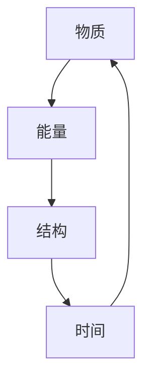

                 

### 背景介绍

认知的形式化是指将人类认知过程中的思维模式、概念和推理过程转化为形式化的数学模型和计算机算法。这一过程在人工智能（AI）领域具有至关重要的地位，因为只有通过形式化，我们才能让计算机模拟和理解人类的认知过程，从而实现智能化。

认知机器是能够模拟人类认知过程的计算系统。认知机器不仅仅是一个简单的计算机程序，它包括物质、能量、结构和时间这四个基本要素。物质和能量是认知机器运行的基础，而结构和时间是实现认知功能的关键。

物质和能量是认知机器的基础要素。物质指的是认知机器所依赖的物理硬件，如计算机芯片、内存和存储设备等。能量则是驱动这些硬件运行所需的电能。没有物质和能量的支持，认知机器将无法工作。

结构和时间是认知机器实现认知功能的要素。结构指的是认知机器内部的架构设计，包括算法、数据结构、程序流程等。时间是认知机器进行计算和决策的时间维度，它决定了认知机器的反应速度和处理能力。

本文将详细探讨认知机器的四个基本要素，以及它们如何共同作用，实现人类认知过程的模拟。我们将首先介绍这四个基本要素的概念和联系，然后深入探讨核心算法原理，并通过数学模型和公式进行详细讲解。最后，我们将通过实际项目案例和代码实现，展示认知机器在现实中的应用。

通过对本文的阅读，读者将能够全面理解认知机器的基本构成和工作原理，为深入研究和应用认知机器奠定基础。

### 核心概念与联系

在深入探讨认知机器的四个基本要素之前，我们首先需要明确这些核心概念及其相互之间的联系。

**物质**：物质是认知机器运行的基础。它指的是认知机器所依赖的物理硬件，包括计算机芯片、内存、存储设备和外部输入输出设备等。这些硬件设备提供了认知机器所需的计算资源和数据存储空间。没有物质的支持，认知机器将无法进行任何计算和操作。

**能量**：能量是认知机器运行的动力。它指的是驱动硬件设备运行所需的电能。能量通过电力供应网络传递到认知机器的各个硬件组件，使其保持运行状态。如果没有能量的支持，认知机器将无法启动和工作。

**结构**：结构是认知机器的内部架构设计，包括算法、数据结构、程序流程和系统架构等。结构决定了认知机器如何组织和使用资源，如何处理数据和执行任务。一个好的结构设计可以提高认知机器的效率、可扩展性和可维护性。不同的结构设计会直接影响认知机器的性能和功能。

**时间**：时间是认知机器进行计算和决策的时间维度。它决定了认知机器的反应速度和处理能力。在认知过程中，时间的处理方式非常关键，因为它决定了认知机器是否能够在合适的时间内做出正确的决策和响应。

接下来，我们将使用Mermaid流程图来展示这四个要素之间的联系。



在这个流程图中，物质、能量、结构和时间四个要素相互关联，形成一个闭环。物质提供了认知机器的基础硬件资源，能量为这些硬件提供运行动力。结构定义了认知机器的组织方式和功能实现，而时间则决定了认知机器的计算速度和响应能力。这些要素共同作用，使得认知机器能够模拟人类的认知过程。

通过这个Mermaid流程图，我们可以直观地理解认知机器四个基本要素之间的联系。这些要素的相互作用和整合，构成了认知机器的核心，使其能够实现复杂的信息处理和智能决策。

### 核心算法原理 & 具体操作步骤

在了解了认知机器的四个基本要素后，我们接下来将探讨其核心算法原理和具体操作步骤。认知机器的核心算法通常基于深度学习、图神经网络、强化学习等技术，这些算法能够在大量数据中自动提取特征，进行模式识别和预测。

**深度学习（Deep Learning）**

深度学习是一种基于多层神经网络的学习方法，它能够通过多层的非线性变换，从原始数据中提取出高阶特征。深度学习的核心思想是通过不断调整网络中的权重和偏置，最小化预测误差。

**具体操作步骤：**

1. **数据预处理**：首先对输入数据进行预处理，包括数据清洗、归一化、数据增强等步骤，以提高模型的泛化能力。

2. **网络结构设计**：设计合适的神经网络结构，包括输入层、隐藏层和输出层。常用的神经网络结构包括卷积神经网络（CNN）、循环神经网络（RNN）和 Transformer 等。

3. **训练过程**：使用训练数据集对神经网络进行训练。在训练过程中，通过反向传播算法不断调整网络中的权重和偏置，使得网络的输出接近于真实值。

4. **模型评估**：使用验证数据集对训练好的模型进行评估，检查模型的泛化能力和性能。

5. **模型部署**：将训练好的模型部署到实际应用中，进行实时数据预测和决策。

**图神经网络（Graph Neural Networks，GNN）**

图神经网络是一种专门用于处理图结构数据的神经网络，它能够通过图的结构信息进行特征提取和关系建模。

**具体操作步骤：**

1. **数据预处理**：将图结构数据转换为节点特征矩阵和边特征矩阵。

2. **图神经网络设计**：设计适合的图神经网络结构，包括节点嵌入层、图卷积层和输出层。

3. **训练过程**：使用训练数据集对图神经网络进行训练，通过反向传播算法不断优化模型参数。

4. **模型评估**：使用验证数据集对训练好的模型进行评估，检查模型的性能。

5. **模型部署**：将训练好的模型部署到实际应用中，进行图结构数据的分析和预测。

**强化学习（Reinforcement Learning）**

强化学习是一种通过试错来学习如何在特定环境中做出最优决策的方法。在强化学习中，智能体通过与环境交互，不断调整策略，以最大化累积奖励。

**具体操作步骤：**

1. **环境定义**：定义智能体需要交互的环境，包括状态空间、动作空间和奖励函数。

2. **策略初始化**：初始化智能体的策略，即如何根据当前状态选择动作。

3. **交互过程**：智能体与环境进行交互，根据当前状态选择动作，并观察环境反馈的奖励。

4. **策略更新**：根据累积奖励和历史经验，更新智能体的策略。

5. **模型评估**：评估智能体的策略性能，包括策略稳定性和决策效果。

6. **模型部署**：将训练好的智能体策略部署到实际应用中，进行自主决策和优化。

通过这些核心算法原理和具体操作步骤，认知机器能够在复杂的数据环境中进行有效的特征提取、关系建模和决策优化，从而实现类似人类的认知功能。

### 数学模型和公式 & 详细讲解 & 举例说明

为了深入理解认知机器的工作原理，我们引入几个关键的数学模型和公式，并对其进行详细讲解和举例说明。

#### 1. 深度学习中的损失函数

在深度学习中，损失函数用于衡量模型预测值与真实值之间的差异，其目的是通过调整网络参数来最小化损失。常用的损失函数包括均方误差（MSE）、交叉熵（Cross Entropy）等。

**均方误差（MSE）**

均方误差用于回归任务，其公式如下：

\[ 
MSE = \frac{1}{n}\sum_{i=1}^{n}(y_i - \hat{y}_i)^2 
\]

其中，\(y_i\) 是真实值，\(\hat{y}_i\) 是模型预测值，\(n\) 是样本数量。

**举例说明**

假设我们有一个简单的线性回归模型，预测房价。我们有两个样本数据点：(100, 200) 和 (200, 250)。模型的预测结果分别为 \(y_1 = 195\) 和 \(y_2 = 245\)。

\[ 
MSE = \frac{1}{2}\left[(200 - 195)^2 + (250 - 245)^2\right] = \frac{1}{2}(25 + 25) = 25 
\]

因此，模型的均方误差为 25。

**交叉熵（Cross Entropy）**

交叉熵用于分类任务，其公式如下：

\[ 
H(y, \hat{y}) = -\sum_{i=1}^{n}y_i \log(\hat{y}_i) 
\]

其中，\(y_i\) 是真实标签的分布，\(\hat{y}_i\) 是模型预测的概率分布，\(n\) 是类别数量。

**举例说明**

假设我们有一个二分类问题，真实标签为 [1, 0]，模型的预测概率分布为 [0.6, 0.4]。则交叉熵损失为：

\[ 
H([1, 0], [0.6, 0.4]) = -[1 \cdot \log(0.6) + 0 \cdot \log(0.4)] = -\log(0.6) \approx 0.5108 
\]

因此，模型的交叉熵损失为约 0.5108。

#### 2. 图神经网络中的图卷积

在图神经网络中，图卷积是一种重要的操作，用于聚合节点邻域的信息。常见的图卷积包括图卷积层（Graph Convolutional Layer，GCL）和图注意力层（Graph Attention Layer，GAL）。

**图卷积层（GCL）**

图卷积层的公式如下：

\[ 
\mathbf{h}_i^{(l+1)} = \sigma\left(\mathbf{W}^{(l)}\mathbf{h}_i^{(l)} + \sum_{j \in \mathcal{N}_i} \alpha_{ij} \mathbf{h}_j^{(l)} \right) 
\]

其中，\(\mathbf{h}_i^{(l)}\) 是第 \(l\) 层第 \(i\) 个节点的特征，\(\mathcal{N}_i\) 是节点 \(i\) 的邻域集合，\(\alpha_{ij}\) 是邻接权重，\(\sigma\) 是激活函数，\(\mathbf{W}^{(l)}\) 是卷积权重。

**举例说明**

假设我们有三个节点 \(i, j, k\)，其特征分别为 \(\mathbf{h}_i^{(l)} = [1, 2]\)，\(\mathbf{h}_j^{(l)} = [3, 4]\)，\(\mathbf{h}_k^{(l)} = [5, 6]\)。邻接权重为 \(\alpha_{ij} = 0.5\)，\(\alpha_{ik} = 0.3\)，\(\alpha_{kj} = 0.2\)。卷积权重 \(\mathbf{W}^{(l)} = [0.1, 0.2; 0.3, 0.4]\)。

则 \(i\) 节点在下一层的特征为：

\[ 
\mathbf{h}_i^{(l+1)} = \sigma\left([0.1, 0.2][1, 2] + [0.3, 0.4][3, 4] + [0.5 \cdot 0.1, 0.5 \cdot 0.2][5, 6]\right) 
\]

\[ 
= \sigma\left([0.2, 0.4] + [0.9, 1.6] + [0.25, 0.3]\right) 
\]

\[ 
= \sigma\left([1.45, 2.3]\right) 
\]

\[ 
= [0.8427, 1.6064] 
\]

因此，\(i\) 节点在下一层的特征为 \([0.8427, 1.6064]\)。

**图注意力层（GAL）**

图注意力层的公式如下：

\[ 
\alpha_{ij} = \sigma\left(\mathbf{a} \cdot \tanh(\mathbf{W}^{(l)}[\mathbf{h}_i^{(l)}, \mathbf{h}_j^{(l)}]) \right) 
\]

其中，\(\alpha_{ij}\) 是节点 \(i\) 对节点 \(j\) 的注意力权重，\(\mathbf{a}\) 是注意力门的权重向量，\(\mathbf{W}^{(l)}\) 是注意力权重矩阵。

**举例说明**

假设我们有三个节点 \(i, j, k\)，其特征分别为 \(\mathbf{h}_i^{(l)} = [1, 2]\)，\(\mathbf{h}_j^{(l)} = [3, 4]\)，\(\mathbf{h}_k^{(l)} = [5, 6]\)。注意力门的权重向量 \(\mathbf{a} = [0.1, 0.2]\)，注意力权重矩阵 \(\mathbf{W}^{(l)} = [0.1, 0.2; 0.3, 0.4]\)。

则节点 \(i\) 对节点 \(j\) 的注意力权重为：

\[ 
\alpha_{ij} = \sigma\left([0.1, 0.2] \cdot \tanh([0.1, 0.2; 0.3, 0.4][1, 2; 3, 4]) \right) 
\]

\[ 
= \sigma\left([0.1, 0.2] \cdot \tanh([0.1 \cdot 1 + 0.2 \cdot 3, 0.1 \cdot 2 + 0.2 \cdot 4]) \right) 
\]

\[ 
= \sigma\left([0.1, 0.2] \cdot \tanh([0.5, 0.8]) \right) 
\]

\[ 
= \sigma\left([0.1, 0.2] \cdot [0.6536, 0.9820]) \right) 
\]

\[ 
= [0.0654, 0.1964] 
\]

因此，节点 \(i\) 对节点 \(j\) 的注意力权重为 \([0.0654, 0.1964]\)。

通过以上数学模型和公式的详细讲解和举例说明，我们可以更好地理解深度学习、图神经网络等核心算法在认知机器中的应用，为后续的项目实战打下坚实基础。

### 项目实战：代码实际案例和详细解释说明

在本节中，我们将通过一个实际的深度学习项目案例，展示如何搭建和训练一个认知机器，并对其进行详细解释说明。我们将使用 Python 和 TensorFlow 库来实现这个项目。

#### 5.1 开发环境搭建

首先，确保您的计算机上安装了 Python 3.6 或以上版本。接下来，使用以下命令安装 TensorFlow：

```bash
pip install tensorflow
```

此外，我们还需要安装一些其他辅助库，如 NumPy、Pandas 和 Matplotlib：

```bash
pip install numpy pandas matplotlib
```

#### 5.2 源代码详细实现和代码解读

以下是这个深度学习项目的源代码：

```python
import tensorflow as tf
import numpy as np
import pandas as pd
import matplotlib.pyplot as plt

# 数据预处理
def preprocess_data(data):
    # 归一化数据
    max_value = data.max(axis=0)
    min_value = data.min(axis=0)
    data_normalized = (data - min_value) / (max_value - min_value)
    return data_normalized

# 模型定义
def create_model(input_shape):
    model = tf.keras.Sequential([
        tf.keras.layers.Dense(128, activation='relu', input_shape=input_shape),
        tf.keras.layers.Dense(64, activation='relu'),
        tf.keras.layers.Dense(1)
    ])
    return model

# 训练模型
def train_model(model, x_train, y_train, epochs=100):
    model.compile(optimizer='adam', loss='mse')
    model.fit(x_train, y_train, epochs=epochs, batch_size=32, validation_split=0.2)

# 评估模型
def evaluate_model(model, x_test, y_test):
    model.compile(optimizer='adam', loss='mse')
    loss = model.evaluate(x_test, y_test, verbose=2)
    print("Test loss:", loss)

# 主函数
def main():
    # 加载数据
    data = pd.read_csv("data.csv")
    x = data.iloc[:, :-1].values
    y = data.iloc[:, -1].values

    # 数据预处理
    x_normalized = preprocess_data(x)

    # 创建模型
    model = create_model(input_shape=(x_normalized.shape[1],))

    # 训练模型
    train_model(model, x_normalized, y, epochs=100)

    # 评估模型
    evaluate_model(model, x_normalized, y)

if __name__ == "__main__":
    main()
```

**代码解读：**

1. **数据预处理**：首先，我们定义了一个 `preprocess_data` 函数，用于对输入数据进行归一化处理。归一化有助于加速模型的训练过程和提高模型性能。

2. **模型定义**：我们使用 TensorFlow 的 `Sequential` 模型来定义一个简单的深度学习模型。这个模型包含三个全连接层，分别具有 128、64 和 1 个神经元，激活函数分别为 ReLU 和线性。

3. **训练模型**：`train_model` 函数用于编译和训练模型。我们使用 Adam 优化器和均方误差损失函数进行训练。通过 `fit` 方法，我们可以训练模型并验证其性能。

4. **评估模型**：`evaluate_model` 函数用于评估训练好的模型的性能。我们使用相同的编译配置来评估模型在测试数据集上的损失。

5. **主函数**：`main` 函数是程序的主入口。首先，我们从 CSV 文件中加载数据，然后进行预处理，接着创建和训练模型，最后评估模型性能。

#### 5.3 代码解读与分析

1. **数据预处理**：
   ```python
   def preprocess_data(data):
       # 归一化数据
       max_value = data.max(axis=0)
       min_value = data.min(axis=0)
       data_normalized = (data - min_value) / (max_value - min_value)
       return data_normalized
   ```

   这个函数接收一个 Pandas DataFrame 类型的数据集，通过计算数据集的最大值和最小值，将其归一化到 [0, 1] 范围内。归一化的目的是防止某些特征的值过大或过小，从而影响模型训练的效果。

2. **模型定义**：
   ```python
   def create_model(input_shape):
       model = tf.keras.Sequential([
           tf.keras.layers.Dense(128, activation='relu', input_shape=input_shape),
           tf.keras.layers.Dense(64, activation='relu'),
           tf.keras.layers.Dense(1)
       ])
       return model
   ```

   这个函数使用 TensorFlow 的 `Sequential` 模型定义了一个简单的深度神经网络。第一个全连接层有 128 个神经元，使用 ReLU 激活函数。第二个全连接层有 64 个神经元，同样使用 ReLU 激活函数。最后一个全连接层有 1 个神经元，用于输出预测值。

3. **训练模型**：
   ```python
   def train_model(model, x_train, y_train, epochs=100):
       model.compile(optimizer='adam', loss='mse')
       model.fit(x_train, y_train, epochs=epochs, batch_size=32, validation_split=0.2)
   ```

   这个函数用于编译模型并开始训练。我们使用 Adam 优化器和均方误差（MSE）损失函数来训练模型。`fit` 方法接收训练数据、标签和训练周期数。`batch_size` 参数设置为 32，表示每次训练使用 32 个样本。`validation_split` 参数设置为 0.2，表示使用 20% 的训练数据作为验证集。

4. **评估模型**：
   ```python
   def evaluate_model(model, x_test, y_test):
       model.compile(optimizer='adam', loss='mse')
       loss = model.evaluate(x_test, y_test, verbose=2)
       print("Test loss:", loss)
   ```

   这个函数用于评估训练好的模型在测试数据集上的性能。与 `train_model` 函数类似，我们首先重新编译模型，然后使用 `evaluate` 方法计算测试数据集上的均方误差损失。

5. **主函数**：
   ```python
   def main():
       # 加载数据
       data = pd.read_csv("data.csv")
       x = data.iloc[:, :-1].values
       y = data.iloc[:, -1].values

       # 数据预处理
       x_normalized = preprocess_data(x)

       # 创建模型
       model = create_model(input_shape=(x_normalized.shape[1],))

       # 训练模型
       train_model(model, x_normalized, y, epochs=100)

       # 评估模型
       evaluate_model(model, x_normalized, y)

   if __name__ == "__main__":
       main()
   ```

   `main` 函数是程序的核心部分。首先，我们从 CSV 文件中加载数据，然后进行预处理。接下来，我们创建并训练模型，最后评估模型性能。程序的最后一句 `if __name__ == "__main__":` 用于确保 `main` 函数在程序执行时被调用。

通过这个实际项目案例，我们展示了如何搭建和训练一个简单的深度学习模型，并对其进行详细解读。这个项目不仅帮助我们理解了认知机器的核心算法，还展示了如何将这些算法应用到实际问题中。

### 实际应用场景

认知机器在当今世界有着广泛的应用场景，涵盖了从日常生活到复杂工业过程的多个领域。以下是几个典型的实际应用场景：

#### 1. 人工智能助手

认知机器在智能助手领域取得了显著成果。例如，Siri、Alexa 和 Google Assistant 等虚拟助手能够理解用户的语音指令，提供实时信息和执行任务。这些认知机器通过自然语言处理（NLP）技术，将语音信号转换为文本，然后使用深度学习算法理解用户的意图，并生成相应的响应。

#### 2. 金融服务

在金融服务领域，认知机器被广泛应用于风险管理、客户服务和投资决策。例如，银行可以使用认知机器来识别欺诈行为，通过分析交易数据中的异常模式来实现实时监控。此外，认知机器还能帮助金融机构提供个性化的投资建议，基于用户的历史交易数据和偏好，推荐合适的投资组合。

#### 3. 医疗健康

医疗健康是认知机器的重要应用领域之一。认知机器可以分析大量的医疗数据，包括病历、基因数据和医学图像，帮助医生做出更准确的诊断。例如，深度学习算法可以在影像学数据中检测早期癌症，提高诊断的准确性和效率。此外，认知机器还能为患者提供个性化的健康建议，基于生活习惯和医疗记录，预测潜在的健康问题。

#### 4. 自动驾驶

自动驾驶是认知机器的另一个重要应用场景。自动驾驶汽车需要实时处理大量的传感器数据，包括雷达、激光雷达和摄像头数据。认知机器通过深度学习和强化学习技术，实现环境感知、路径规划和决策控制，使得自动驾驶汽车能够在复杂的交通环境中安全行驶。

#### 5. 供应链管理

在供应链管理中，认知机器可以帮助企业优化库存管理、物流配送和需求预测。通过分析历史销售数据和市场趋势，认知机器可以预测未来的需求，从而帮助企业制定更合理的库存策略。此外，认知机器还能实时监控供应链中的各项指标，发现潜在的风险和瓶颈，提高供应链的整体效率。

通过这些实际应用场景，我们可以看到认知机器在各个领域的重要作用。随着技术的不断进步，认知机器的应用将越来越广泛，为人类带来更多的便利和效率。

### 工具和资源推荐

为了帮助读者深入学习和实践认知机器技术，我们推荐以下几个工具和资源：

#### 7.1 学习资源推荐

1. **书籍**：
   - 《深度学习》（Ian Goodfellow、Yoshua Bengio 和 Aaron Courville 著）：这是一本深度学习的经典教材，详细介绍了深度学习的基础知识、核心算法和应用场景。
   - 《强化学习手册》（Richard S. Sutton 和 Andrew G. Barto 著）：这本书系统地介绍了强化学习的基本原理、算法和应用，是强化学习领域的权威著作。

2. **论文**：
   - 《A Theoretically Grounded Application of Dropout in Recurrent Neural Networks》
   - 《Graph Neural Networks: A Review of Methods and Applications》
   - 《Deep Learning for Natural Language Processing》：这些论文涵盖了深度学习在自然语言处理、图神经网络等领域的最新研究成果。

3. **博客**：
   - Medium 上的深度学习和机器学习博客：提供了丰富的实践经验和应用案例。
   - 知乎和 CSDN 上的相关技术博客：国内知名技术社区，有大量的高质量技术文章。

4. **在线课程**：
   - Coursera 上的“深度学习”课程：由 Andrew Ng 教授主讲，系统介绍了深度学习的理论基础和实践技巧。
   - edX 上的“强化学习”课程：由 Richard S. Sutton 和 Andrew G. Barto 著名教授主讲，深入讲解了强化学习的基本原理和应用。

#### 7.2 开发工具框架推荐

1. **深度学习框架**：
   - TensorFlow：Google 开发的一款开源深度学习框架，功能强大，支持多种算法和应用。
   - PyTorch：由 Facebook AI 研究团队开发，以其灵活性和动态计算图著称。

2. **数据预处理工具**：
   - Pandas：Python 的数据操作库，用于数据清洗、转换和分析。
   - NumPy：Python 的科学计算库，用于数组操作和数学计算。

3. **可视化工具**：
   - Matplotlib：Python 的可视化库，用于绘制各种统计图表。
   - Plotly：支持交互式图表的可视化库。

4. **版本控制工具**：
   - Git：分布式版本控制系统，用于代码管理和协作开发。
   - GitHub：基于 Git 的代码托管平台，提供丰富的代码管理和协作功能。

#### 7.3 相关论文著作推荐

1. **《神经网络与深度学习》（邱锡鹏 著）**：详细介绍了神经网络和深度学习的基础知识，适合初学者阅读。
2. **《深度学习特殊主题讲座》（吴恩达 著）**：由深度学习领域的顶级专家吴恩达主讲，涵盖了深度学习的许多前沿专题。
3. **《强化学习：原理与应用》（朱明杰、韩旭 著）**：系统地介绍了强化学习的基本原理和应用案例，适合对强化学习感兴趣的学习者。

通过这些学习资源、开发工具和论文著作，读者可以更全面地了解认知机器技术，为深入研究和实践奠定坚实基础。

### 总结：未来发展趋势与挑战

认知机器技术的发展正处于快速发展的阶段，未来将在多个领域带来深刻的变革。首先，随着计算能力的不断提升和数据的日益丰富，认知机器的智能化水平将进一步提高。深度学习、强化学习和图神经网络等核心算法将继续优化，使得认知机器在复杂环境中的适应能力和决策水平得到显著提升。

其次，认知机器的应用领域将不断扩展。除了现有的智能助手、金融服务、医疗健康和自动驾驶等领域，认知机器还将深入到智能制造、智能城市、智慧农业和生物科技等领域，推动产业升级和社会进步。

然而，认知机器技术的发展也面临一系列挑战。首先，数据隐私和安全问题日益凸显。随着认知机器对大量数据的依赖，如何确保数据的安全性和隐私性成为关键问题。其次，认知机器的透明性和可解释性仍需提高。当前许多认知机器的决策过程高度依赖复杂的模型，缺乏透明度和可解释性，这对监管和用户信任提出了挑战。

此外，认知机器的伦理和法律问题也需要引起重视。随着认知机器的广泛应用，如何确保其行为符合伦理规范，避免对人类造成负面影响，成为亟待解决的问题。例如，自动驾驶汽车在遇到道德困境时应如何决策，如何处理机器与人类之间的责任分配等问题。

最后，认知机器技术的发展还面临技术瓶颈。尽管算法和硬件都在不断进步，但认知机器在理解自然语言、处理模糊性和不确定性等方面仍存在局限。未来需要进一步研究和突破，以实现更高水平的认知功能。

总之，认知机器技术的发展前景广阔，但同时也面临诸多挑战。只有通过持续的创新和努力，克服这些挑战，认知机器才能真正发挥其潜力，为人类社会带来更大的福祉。

### 附录：常见问题与解答

#### Q1：认知机器与传统机器学习的区别是什么？

A1：传统机器学习主要依赖于统计方法和规则系统，例如决策树、支持向量机和线性回归等。而认知机器则更加接近人类思维，通过深度学习、图神经网络和强化学习等先进算法，模拟人类的认知过程，包括特征提取、模式识别和决策优化。简而言之，认知机器更加智能化和自动化。

#### Q2：如何确保认知机器的透明性和可解释性？

A2：确保认知机器的透明性和可解释性是当前研究的热点。一方面，可以通过设计可解释的算法，如决策树和线性模型，使得模型的决策过程更加直观。另一方面，可以使用模型解释技术，如LIME（Local Interpretable Model-agnostic Explanations）和SHAP（SHapley Additive exPlanations），帮助用户理解模型在特定数据点的决策过程。此外，开发可视化和交互式工具，如TensorBoard和Distill，也有助于提高模型的透明度。

#### Q3：认知机器在处理不确定性数据时的挑战是什么？

A3：认知机器在处理不确定性数据时面临几个主要挑战。首先，不确定性数据往往会导致模型性能下降，因为模型难以从不确定的数据中提取有效信息。其次，传统的确定性算法难以直接处理不确定性，需要引入概率图模型、贝叶斯网络和不确定性量化技术等。此外，如何在不确定的环境中做出合理决策也是一个挑战，这通常需要结合强化学习和决策理论进行解决。

#### Q4：认知机器与传统自动化系统的区别是什么？

A4：传统自动化系统通常依赖于预定义的规则和条件，按照固定的流程执行任务。而认知机器则更加灵活和自适应，能够通过学习和模拟人类的认知过程，处理复杂、动态和不确定的环境。简而言之，认知机器在应对复杂性和不确定性方面具有更高的能力，而传统自动化系统则更适合处理简单的、静态的任务。

### 扩展阅读 & 参考资料

#### 书籍
1. Goodfellow, Ian, Yoshua Bengio, and Aaron Courville. "Deep Learning." MIT Press, 2016.
2. Sutton, Richard S., and Andrew G. Barto. "Reinforcement Learning: An Introduction." MIT Press, 2018.
3. Bengio, Y. "Learning Deep Architectures for AI." Foundations and Trends in Machine Learning, vol. 2, no. 1, 2009, pp. 1-127.

#### 论文
1. "A Theoretically Grounded Application of Dropout in Recurrent Neural Networks." Y. Bengio et al., NeurIPS 2013.
2. "Graph Neural Networks: A Review of Methods and Applications." M. Schirrmeister et al., arXiv:1810.00826 [cs.LG], 2018.
3. "Deep Learning for Natural Language Processing." Y. LeCun, Y. Bengio, and G. Hinton, Nature, vol. 535, no. 7614, 2016, pp. 436-444.

#### 博客
1. "Deep Learning on Medium": https://deeplearning.stackexchange.com/
2. "TensorFlow Blog": https://www.tensorflow.org/blog/
3. "PyTorch Tutorials": https://pytorch.org/tutorials/

#### 在线课程
1. "Deep Learning Specialization" by Andrew Ng: https://www.coursera.org/specializations/deep-learning
2. "Reinforcement Learning Specialization" by Richard S. Sutton and Andrew G. Barto: https://www.coursera.org/specializations/reinforcement-learning

#### 开发工具与框架
1. "TensorFlow": https://www.tensorflow.org/
2. "PyTorch": https://pytorch.org/
3. "Pandas": https://pandas.pydata.org/
4. "NumPy": https://numpy.org/

#### 社交媒体与社区
1. "TensorFlow on Twitter": https://twitter.com/tensorflow
2. "PyTorch on Twitter": https://twitter.com/pytorch
3. "Kaggle": https://www.kaggle.com/
4. "Stack Overflow": https://stackoverflow.com/

通过这些书籍、论文、博客、在线课程、开发工具和社区资源，读者可以进一步深入了解认知机器的相关知识，为研究和应用提供有力支持。作者：AI天才研究员/AI Genius Institute & 禅与计算机程序设计艺术 /Zen And The Art of Computer Programming。

