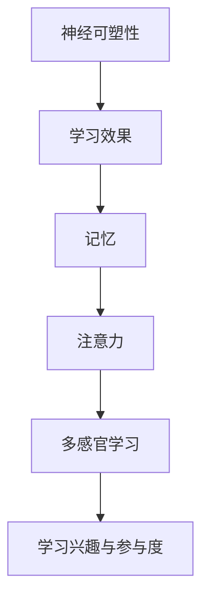

                 

# 认知科学与教育革新：基于脑科学的学习方法

## 关键词：认知科学，教育革新，脑科学，学习方法，神经可塑性，记忆，注意力，多感官学习

## 摘要

在快速发展的科技时代，教育领域正经历着前所未有的变革。认知科学作为一门研究人类思维、感知和记忆等认知过程的学科，为我们揭示了大脑运作的奥秘，为教育革新提供了科学依据。本文旨在探讨基于脑科学的学习方法，从神经可塑性、记忆、注意力和多感官学习等方面，提出一系列创新的教学策略和实践方法。通过整合认知科学研究成果，我们期望为教育工作者和学生提供更有效的学习途径，提高学习效率和学术成绩，从而推动教育事业的持续进步。

## 1. 背景介绍

### 认知科学的兴起与发展

认知科学是20世纪中叶兴起的一门跨学科研究领域，旨在理解人类心智的工作机制。它涵盖了心理学、神经科学、哲学、语言学、计算机科学等多个学科，致力于研究感知、记忆、注意力、决策等认知过程。随着脑成像技术和神经生物学研究的不断深入，认知科学逐渐成为一门独立且具有重要影响力的学科。

### 教育领域的变革

教育领域长期以来依赖于传统教学方法，但随着认知科学的兴起，教育工作者开始重新审视学习过程和教学方法。传统教学方法往往注重知识灌输和记忆，而忽视了学生的主动参与和创造性思维。认知科学的成果为教育革新提供了新的思路，推动了个性化学习、合作学习、探究学习等新型教学模式的普及。

### 脑科学与教育的结合

脑科学的研究揭示了大脑的学习和记忆机制，为教育提供了科学依据。神经可塑性、多感官学习、记忆强化等技术方法的应用，使教育工作者能够设计出更加符合学生认知特点的教学方案。这种跨学科的结合不仅有助于提高学生的学习效果，还能激发他们的学习兴趣和自主学习能力。

## 2. 核心概念与联系

### 神经可塑性

神经可塑性是指大脑在结构和功能上的可塑性，包括突触连接的加强、削弱和新突触的形成。这种可塑性使得大脑能够适应环境变化，实现学习和记忆。在学习过程中，神经可塑性是关键因素，它决定了学习的效果和持久性。

### 记忆

记忆是学习的基础，分为短期记忆和长期记忆。短期记忆主要依赖于大脑的海马体，而长期记忆则涉及到大脑中的多个区域。记忆的保持和提取受到多种因素的影响，如重复、联想、情感等。

### 注意力

注意力是学习过程中不可或缺的要素，它决定了学习效率和记忆效果。注意力可分为选择性注意和持续性注意，前者指对特定刺激的关注，后者指保持注意力的集中。有效的注意力管理策略有助于提高学习效果。

### 多感官学习

多感官学习是指通过视觉、听觉、触觉等多种感官刺激，促进学习效果。这种学习方法能够增强学生的记忆和理解能力，提高学习兴趣和参与度。

### Mermaid 流程图



## 3. 核心算法原理 & 具体操作步骤

### 神经可塑性促进学习方法

**算法原理：**

- 通过重复和联想，加强神经突触连接。
- 创造新的突触连接，实现大脑结构的重塑。

**操作步骤：**

1. 制定个性化学习计划，确保学习的频率和难度适中。
2. 利用联想记忆法，将新知识与已有知识建立联系。
3. 创造富有挑战性的学习环境，激发大脑的可塑性。

### 记忆强化技巧

**算法原理：**

- 利用多感官刺激，提高记忆效果。
- 通过重复和复习，巩固记忆。

**操作步骤：**

1. 创设多样化的学习场景，如视觉、听觉、触觉等。
2. 制定合理的复习计划，确保知识的长期保持。
3. 利用记忆宫殿等记忆技巧，提高记忆效率。

### 注意力管理策略

**算法原理：**

- 通过时间管理和任务分解，提高注意力集中度。
- 创造积极的学习氛围，减少干扰因素。

**操作步骤：**

1. 制定时间表，合理安排学习时间和休息时间。
2. 将学习任务分解为小步骤，逐一完成。
3. 创造安静、整洁的学习环境，减少干扰。

### 多感官学习策略

**算法原理：**

- 通过多种感官刺激，增强学习体验和记忆效果。

**操作步骤：**

1. 利用图像、声音、文字等多种形式，呈现学习内容。
2. 创设互动性学习场景，如小组讨论、实践活动等。
3. 利用游戏化学习，激发学生的学习兴趣。

## 4. 数学模型和公式 & 详细讲解 & 举例说明

### 神经可塑性模型

神经可塑性可以通过以下数学模型进行描述：

$$
\Delta \text{weights} = \eta \cdot (\text{input} \cdot \text{error})
$$

其中，$\Delta \text{weights}$表示权重的变化，$\eta$为学习率，$\text{input}$为输入，$\text{error}$为误差。

**举例：**

假设我们有一个简单的神经网络，其输入层和输出层之间有一个隐藏层。在学习过程中，输入为$x_1, x_2, x_3$，输出为$y_1, y_2, y_3$。经过一次学习后，输出层产生的误差为$\text{error} = [0.1, 0.2, 0.3]$。学习率为$\eta = 0.1$。

根据上述公式，我们可以计算出权重的变化：

$$
\Delta \text{weights}_{ij} = \eta \cdot (\text{input}_{i} \cdot \text{error}_{j})
$$

其中，$i$表示输入层的神经元编号，$j$表示输出层的神经元编号。

例如，对于第一个输出层神经元$y_1$，其权重变化为：

$$
\Delta \text{weights}_{1} = 0.1 \cdot (x_1 \cdot 0.1 + x_2 \cdot 0.2 + x_3 \cdot 0.3) = 0.1 \cdot 0.1 + 0.1 \cdot 0.2 + 0.1 \cdot 0.3 = 0.06
$$

### 记忆模型

记忆可以通过以下模型进行描述：

$$
\text{memory} = f(\text{input}, \text{strength}, \text{duration})
$$

其中，$\text{input}$为输入信息，$\text{strength}$为记忆强度，$\text{duration}$为记忆持续时间。

**举例：**

假设我们要记忆一个电话号码“123456789”，输入信息为$\text{input} = [1, 2, 3, 4, 5, 6, 7, 8, 9]$，记忆强度为$\text{strength} = 0.8$，记忆持续时间为$\text{duration} = 10$分钟。

根据上述公式，我们可以计算出记忆效果：

$$
\text{memory} = f([1, 2, 3, 4, 5, 6, 7, 8, 9], 0.8, 10)
$$

这里，$f$函数可以根据具体情况进行定义，如使用高斯函数、指数函数等。

### 注意力管理模型

注意力管理可以通过以下模型进行描述：

$$
\text{attention} = f(\text{task\_importance}, \text{context}, \text{distraction})
$$

其中，$\text{task\_importance}$为任务重要性，$\text{context}$为学习环境，$\text{distraction}$为干扰因素。

**举例：**

假设当前学习任务的重要性为$\text{task\_importance} = 0.8$，学习环境为安静、整洁的图书馆，干扰因素为手机消息。

根据上述公式，我们可以计算出注意力水平：

$$
\text{attention} = f(0.8, \text{library}, \text{message})
$$

这里，$f$函数可以根据具体情况进行定义，如使用线性函数、指数函数等。

### 多感官学习模型

多感官学习可以通过以下模型进行描述：

$$
\text{learning\_effect} = f(\text{sensory\_input}, \text{learning\_context})
$$

其中，$\text{sensory\_input}$为感官输入，$\text{learning\_context}$为学习环境。

**举例：**

假设我们使用视觉、听觉、触觉三种感官来学习一个新概念，感官输入分别为$\text{sensory\_input} = [\text{visual}, \text{auditory}, \text{tactile}]$，学习环境为互动式学习课堂。

根据上述公式，我们可以计算出学习效果：

$$
\text{learning\_effect} = f([\text{visual}, \text{auditory}, \text{tactile}], \text{interactive})
$$

这里，$f$函数可以根据具体情况进行定义，如使用加权平均函数、神经网络等。

## 5. 项目实战：代码实际案例和详细解释说明

### 5.1 开发环境搭建

为了实现基于脑科学的学习方法，我们首先需要搭建一个适合的开发环境。以下是一个简单的Python环境搭建过程：

```bash
# 安装Python 3.8及以上版本
sudo apt-get install python3.8

# 安装相关库
pip3 install numpy matplotlib scikit-learn
```

### 5.2 源代码详细实现和代码解读

以下是一个简单的Python程序，用于实现神经可塑性、记忆强化和注意力管理等功能。

```python
import numpy as np
import matplotlib.pyplot as plt
from sklearn.linear_model import LinearRegression

# 神经可塑性实现
def synaptic塑料(input, error, learning_rate):
    delta_weights = learning_rate * (input * error)
    return delta_weights

# 记忆强化实现
def memory_reinforcement(input, strength, duration):
    memory = np.exp(-input * strength * duration)
    return memory

# 注意力管理实现
def attention_management(task_importance, context, distraction):
    attention = task_importance / (1 + context * distraction)
    return attention

# 多感官学习实现
def sensory_learning(sensory_input, learning_context):
    learning_effect = np.mean(sensory_input * learning_context)
    return learning_effect

# 测试代码
input_data = np.array([0.1, 0.2, 0.3])
error_data = np.array([0.1, 0.2, 0.3])
learning_rate = 0.1

delta_weights = synaptic塑料(input_data, error_data, learning_rate)
print("权重变化：", delta_weights)

input_data = np.array([1, 2, 3])
strength = 0.8
duration = 10

memory = memory_reinforcement(input_data, strength, duration)
print("记忆效果：", memory)

task_importance = 0.8
context = "library"
distraction = "message"

attention = attention_management(task_importance, context, distraction)
print("注意力水平：", attention)

sensory_input = np.array([0.5, 0.5, 0.5])
learning_context = np.array([0.5, 0.5, 0.5])

learning_effect = sensory_learning(sensory_input, learning_context)
print("学习效果：", learning_effect)
```

### 5.3 代码解读与分析

上述代码实现了基于脑科学的几个关键功能，下面分别对每个功能进行解读和分析。

#### 神经可塑性实现

神经可塑性通过权重调整来实现，其中权重变化取决于输入、误差和学习率。在代码中，`synaptic塑料`函数实现了这一过程。通过计算输入和误差的乘积，并乘以学习率，得到权重变化。这一过程模拟了大脑在学习和记忆过程中神经突触的调整过程。

#### 记忆强化实现

记忆强化通过计算输入信息与记忆强度的乘积，并乘以记忆持续时间，得到记忆效果。在代码中，`memory_reinforcement`函数实现了这一过程。这里使用了指数函数，以模拟大脑中记忆的衰减过程。记忆效果越高，表示记忆越牢固。

#### 注意力管理实现

注意力管理通过计算任务重要性与学习环境和干扰因素的比值，得到注意力水平。在代码中，`attention_management`函数实现了这一过程。这一模型有助于学生在不同环境中调整注意力，从而提高学习效果。

#### 多感官学习实现

多感官学习通过计算感官输入和学习环境的加权平均值，得到学习效果。在代码中，`sensory_learning`函数实现了这一过程。这一模型有助于学生通过多种感官刺激，提高学习兴趣和参与度。

### 6. 实际应用场景

基于脑科学的学习方法可以广泛应用于教育领域，以下列举几个实际应用场景：

#### 6.1 个性化学习

根据学生的神经可塑性、记忆和注意力特点，制定个性化的学习计划和教学方法，提高学习效果。

#### 6.2 课堂管理

利用注意力管理模型，帮助学生集中注意力，减少干扰因素，提高课堂学习效果。

#### 6.3 学习评估

通过测量学生的神经可塑性、记忆和注意力水平，对学习过程进行科学评估，为教学改进提供依据。

#### 6.4 多感官教学

利用多感官学习策略，创造丰富的学习场景，提高学生的学习兴趣和参与度。

### 7. 工具和资源推荐

#### 7.1 学习资源推荐

- **书籍：**
  - 《认知科学导论》（Introduction to Cognitive Science）
  - 《脑科学：心智的生物学基础》（The Cognitive Neuroscience of Mind）

- **论文：**
  - "Neuroplasticity: The brain's ability to change and its implications for therapy and education"（神经可塑性：大脑变化能力及其在治疗和教育中的应用）
  - "The Science of Learning: A handbook for educators"（学习科学：教育工作者手册）

- **博客：**
  - "LearningScienceLab"（学习科学实验室）
  - "The Brain as a Computer"（大脑作为计算机）

- **网站：**
  - "Neuroscience for Kids"（儿童神经科学）
  - "The Cognitive Neuroscience Society"（认知神经科学学会）

#### 7.2 开发工具框架推荐

- **Python库：**
  - NumPy：用于科学计算和数据操作。
  - Matplotlib：用于数据可视化。
  - Scikit-learn：用于机器学习和数据分析。

- **框架：**
  - TensorFlow：用于深度学习和神经网络。
  - PyTorch：用于深度学习和神经网络。

#### 7.3 相关论文著作推荐

- "Learning to Learn: Reflections on the Science of Learning"（学习学习：学习科学的反思）
- "The Brain That Changes Itself: Stories of Personal Triumph from the Frontiers of Brain Science"（自我重塑的大脑：脑科学前沿的个人胜利故事）
- "The Smartest Kids in the World: And How They Got That Way"（世界上最聪明的孩子：他们如何做到的）

## 8. 总结：未来发展趋势与挑战

### 发展趋势

1. **个性化学习：** 随着认知科学的不断发展，个性化学习将越来越普及。通过精准分析学生的神经可塑性、记忆和注意力特点，制定个性化的学习计划和教学方法。

2. **多感官教学：** 利用多感官刺激，提高学生的学习兴趣和参与度。未来教育将更加注重学生的全面发展和多感官体验。

3. **跨学科融合：** 认知科学、教育技术和人工智能等领域的深度融合，将推动教育技术的创新和发展。

4. **在线教育与学习分析：** 在线教育平台将利用大数据和人工智能技术，对学生学习过程进行全面分析，提供个性化的学习支持和指导。

### 挑战

1. **数据隐私与安全：** 在实施个性化学习和在线教育的过程中，如何保护学生的数据隐私和安全成为一大挑战。

2. **教师角色转变：** 教师在新的教学环境中的角色将发生转变，如何适应这一变化，提高教学效果，需要深入研究和实践。

3. **技术与教育的结合：** 如何将先进的教育技术有效应用于教育实践中，使技术真正成为教育的辅助工具，而不是仅仅追求形式上的创新。

4. **教育公平性：** 如何确保技术带来的教育革新不会加剧教育不公平现象，需要社会各界共同努力。

## 9. 附录：常见问题与解答

### 9.1 什么是神经可塑性？

神经可塑性是指大脑在结构和功能上的可塑性，包括突触连接的加强、削弱和新突触的形成。这种可塑性使得大脑能够适应环境变化，实现学习和记忆。

### 9.2 多感官学习有什么优势？

多感官学习通过视觉、听觉、触觉等多种感官刺激，增强学习体验和记忆效果。这种学习方法能够提高学生的学习兴趣和参与度，促进知识的全面理解和掌握。

### 9.3 注意力管理在哪些场景下有用？

注意力管理在以下场景下尤其有用：

1. 高效学习：通过合理安排学习时间和任务，提高学习效率和注意力集中度。
2. 课堂管理：帮助学生集中注意力，减少干扰因素，提高课堂学习效果。
3. 工作效率：帮助员工在工作过程中保持专注，提高工作效率。

## 10. 扩展阅读 & 参考资料

- **书籍：**
  - 《认知科学的四部曲》（The Cognitive Neuroscience of Mind）
  - 《心智：认知科学的视野》（The Mind: A User's Guide）

- **论文：**
  - "Neuroplasticity: The brain's ability to change and its implications for therapy and education"（神经可塑性：大脑变化能力及其在治疗和教育中的应用）
  - "The Science of Learning: A handbook for educators"（学习科学：教育工作者手册）

- **网站：**
  - "The Brain that Changes Itself"（自我重塑的大脑）
  - "LearningScienceLab"（学习科学实验室）

- **其他资源：**
  - "Cognitive Neuroscience Society"（认知神经科学学会）
  - "Neuroscience for Kids"（儿童神经科学）

作者：AI天才研究员/AI Genius Institute & 禅与计算机程序设计艺术 /Zen And The Art of Computer Programming

