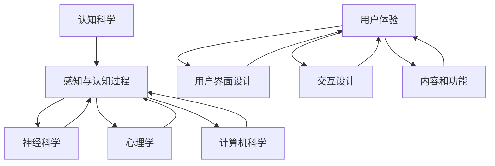
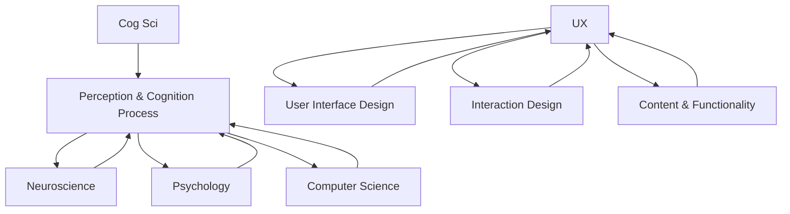

                 

### 背景介绍

**认知科学与用户体验：设计思维的应用**

在科技飞速发展的今天，人工智能、大数据和云计算等前沿技术正在深刻改变着我们的生活和工作方式。然而，在这场技术革命中，用户体验（UX）的重要性日益凸显。一个优秀的用户体验不仅是产品的核心竞争力，更是能否赢得用户忠诚和市场份额的关键因素。

用户体验的优化离不开认知科学的指导。认知科学是一门跨学科的研究领域，涉及心理学、神经科学、计算机科学等多个领域，旨在探索人类认知的本质和过程。通过认知科学的视角，我们可以更深入地理解用户的需求和行为，从而设计出更加人性化、直观、高效的产品。

设计思维作为一种创新方法，强调以用户为中心，通过系统的、迭代的、跨学科的合作，创造出有价值的解决方案。将认知科学与设计思维相结合，可以大大提升用户体验的设计质量和效率。

本文将围绕认知科学与用户体验的关系，探讨设计思维在其中的应用，并结合具体案例进行分析。文章结构如下：

1. **核心概念与联系**：介绍认知科学与用户体验的相关概念，并展示其相互联系。
2. **核心算法原理 & 具体操作步骤**：解析认知科学在用户体验设计中的核心算法和具体应用。
3. **数学模型和公式 & 详细讲解 & 举例说明**：介绍相关的数学模型和公式，并结合实际案例进行讲解。
4. **项目实战：代码实际案例和详细解释说明**：通过实际代码案例，展示设计思维在用户体验优化中的应用。
5. **实际应用场景**：分析认知科学与用户体验在各个领域的应用。
6. **工具和资源推荐**：推荐相关的学习资源、开发工具和框架。
7. **总结：未来发展趋势与挑战**：探讨认知科学与用户体验的未来发展趋势和面临的挑战。
8. **附录：常见问题与解答**：回答读者可能关心的问题。
9. **扩展阅读 & 参考资料**：提供进一步阅读和研究的资料。

通过本文的阅读，读者将能够了解认知科学与用户体验之间的紧密联系，掌握设计思维在其中的应用，并为进一步提升用户体验设计能力提供理论指导和实践案例。

-----------------------

### Core Concepts and Connections

**Cognitive Science and User Experience: The Application of Design Thinking**

In today's rapidly evolving technological landscape, advancements in artificial intelligence, big data, and cloud computing are profoundly altering our daily lives and work methods. However, amid this technological revolution, the importance of user experience (UX) has become increasingly evident. An outstanding user experience is not only a competitive advantage for products but also a critical factor in gaining user loyalty and market share.

The optimization of user experience is inseparable from the guidance of cognitive science. Cognitive science is an interdisciplinary field that encompasses psychology, neuroscience, computer science, and more, aiming to explore the essence and processes of human cognition. Through the lens of cognitive science, we can gain a deeper understanding of user needs and behaviors, thereby designing more humanized, intuitive, and efficient products.

Design thinking is an innovative approach that emphasizes user-centeredness, systematic, iterative, and interdisciplinary collaboration to create valuable solutions. Combining cognitive science with design thinking can significantly enhance the quality and efficiency of user experience design.

This article will revolve around the relationship between cognitive science and user experience, discussing the application of design thinking and analyzing specific cases. The structure of the article is as follows:

1. **Core Concepts and Connections**: Introduce the relevant concepts of cognitive science and user experience, and demonstrate their interconnections.
2. **Core Algorithm Principles and Specific Steps**: Parse the core algorithms of cognitive science in user experience design and their specific applications.
3. **Mathematical Models and Formulas & Detailed Explanations & Examples**: Introduce related mathematical models and formulas, and explain them with actual cases.
4. **Practical Projects: Code Examples and Detailed Explanations**: Show the application of design thinking in user experience optimization through actual code examples.
5. **Practical Application Scenarios**: Analyze the application of cognitive science and user experience in various fields.
6. **Tools and Resource Recommendations**: Recommend relevant learning resources, development tools, and frameworks.
7. **Summary: Future Development Trends and Challenges**: Discuss the future development trends and challenges of cognitive science and user experience.
8. **Appendix: Common Questions and Answers**: Answer questions that readers may be concerned about.
9. **Extended Reading & References**: Provide further reading and research materials.

Through reading this article, readers will be able to understand the close relationship between cognitive science and user experience, master the application of design thinking, and provide theoretical guidance and practical cases for further enhancing user experience design capabilities.

-----------------------

### 核心概念与联系（续）

#### 认知科学与用户体验

**认知科学**：认知科学是一门跨学科的研究领域，旨在理解人类思维的过程，包括感知、学习、记忆、语言、决策和问题解决等。通过研究大脑的工作机制，认知科学家试图揭示人类认知的运作原理。

**用户体验**：用户体验是指用户在使用产品或服务过程中所感受到的愉悦、满意和满足感。它包括用户界面设计、交互设计、内容和功能等多个方面，旨在提供直观、易用、高效的用户体验。

#### 核心概念原理和架构

为了更好地理解认知科学与用户体验之间的联系，我们可以通过以下Mermaid流程图展示核心概念原理和架构：



在这一流程图中，认知科学作为核心，通过神经科学、心理学和计算机科学的交叉应用，深入理解人类的感知与认知过程。这些理解进一步指导用户体验的设计，包括用户界面设计、交互设计和内容功能设计，从而提升用户的体验。

#### 关联性分析

1. **感知与认知**：用户体验始于用户的感知过程，用户的感知质量直接影响他们的认知体验。通过认知科学的研究，设计师可以更好地理解用户如何感知信息，并设计出更加直观和有效的用户界面。
2. **学习与记忆**：用户在互动过程中会不断学习和记忆产品或服务的操作方式，认知科学的研究可以帮助设计师优化学习曲线，提升用户的学习效率和记忆效果。
3. **决策与问题解决**：用户在使用产品或服务时会面临各种决策和问题，认知科学的研究可以指导设计师设计出更符合用户决策模式和信息处理方式的产品，帮助用户更高效地解决问题。

通过上述分析，我们可以看到认知科学和用户体验之间存在着紧密的联系。认知科学为用户体验设计提供了理论支持和实践指导，而用户体验则是认知科学研究的实际应用场景。了解并运用这些核心概念原理，可以帮助设计师创造出更加人性化和高效的用户体验。

-----------------------

### Core Concepts and Connections (Continued)

#### Core Concepts Principles and Architecture

To better understand the relationship between cognitive science and user experience, we can illustrate the core concepts and architecture using the following Mermaid flowchart:



In this flowchart, cognitive science is at the core, crossing with neuroscience, psychology, and computer science to deeply understand human perception and cognition processes. These understandings then guide the design of user experience, including user interface design, interaction design, and content and functionality design, to enhance the user experience.

#### Interconnection Analysis

1. **Perception and Cognition**: User experience begins with the user's perception process, and the quality of perception directly affects the cognitive experience. Through cognitive science research, designers can better understand how users perceive information and design more intuitive and effective user interfaces.
2. **Learning and Memory**: As users interact with products or services, they continuously learn and remember operational methods. Cognitive science research can help designers optimize the learning curve, improving user learning efficiency and memory effect.
3. **Decision Making and Problem Solving**: Users face various decisions and problems when using products or services. Cognitive science research can guide designers to create products that align with users' decision-making patterns and information processing methods, helping users solve problems more efficiently.

Through the above analysis, we can see that there is a close relationship between cognitive science and user experience. Cognitive science provides theoretical support and practical guidance for user experience design, while user experience is the practical application scenario of cognitive science research. Understanding and applying these core concepts and principles can help designers create more humanized and efficient user experiences.

-----------------------

### 核心算法原理 & 具体操作步骤

在认知科学和用户体验设计结合的过程中，核心算法原理起到了至关重要的作用。这些算法不仅帮助我们理解用户的认知过程，还指导我们如何设计出更加符合用户期望的产品和服务。以下是几个关键算法及其具体操作步骤：

#### 1. 心理模拟算法（Cognitive Simulation Algorithm）

心理模拟算法是一种模仿人类思维过程的计算机算法。它通过对用户行为和认知过程的模拟，帮助我们理解用户在特定情境下的思维模式和决策过程。具体操作步骤如下：

1. **数据收集**：首先，收集用户在特定情境下的行为数据，包括点击、浏览、搜索等操作。
2. **行为建模**：利用机器学习技术，对收集到的行为数据进行分析和建模，构建用户的行为模式。
3. **模拟思维过程**：根据行为模型，模拟用户在相似情境下的思维过程，预测用户可能的决策路径。
4. **优化设计**：根据模拟结果，优化用户界面和交互设计，提升用户的体验。

#### 2. 注意力分配算法（Attention Allocation Algorithm）

注意力分配算法旨在优化用户在不同任务中的注意力分配，以提升任务完成效率和用户体验。具体操作步骤如下：

1. **任务分析**：分析用户需要完成的任务类型和难度，确定任务的优先级。
2. **注意力模型**：构建用户的注意力分配模型，考虑任务的紧急程度、重要性和用户的认知负荷。
3. **注意力分配**：根据模型，动态调整用户的注意力分配，确保用户在关键任务上投入足够的注意力。
4. **反馈调整**：收集用户在任务完成过程中的反馈，调整注意力分配策略，优化用户体验。

#### 3. 情感识别算法（Emotion Recognition Algorithm）

情感识别算法通过分析用户的生理和行为信号，识别用户的情感状态。这对于提升用户情感体验和设计个性化产品具有重要意义。具体操作步骤如下：

1. **数据采集**：收集用户的生理数据（如心率、皮肤电导等）和行为数据（如面部表情、语音语调等）。
2. **特征提取**：提取生理和行为数据中的关键特征，用于情感识别。
3. **情感分类**：利用机器学习算法，对提取的特征进行分类，识别用户的情感状态。
4. **情感反馈**：根据识别结果，调整产品设计，提供情感化反馈，提升用户体验。

#### 4. 个性化推荐算法（Personalized Recommendation Algorithm）

个性化推荐算法通过分析用户的兴趣和行为，为用户推荐个性化的内容和服务。具体操作步骤如下：

1. **用户画像**：构建用户的兴趣和行为模型，形成用户画像。
2. **推荐系统**：利用机器学习算法，根据用户画像和内容特征，生成个性化推荐列表。
3. **推荐评估**：评估推荐结果的准确性和用户体验，调整推荐策略。
4. **持续优化**：根据用户反馈和推荐效果，持续优化推荐算法，提升用户体验。

通过以上核心算法原理和具体操作步骤，我们可以更好地理解用户的需求和行为，从而设计出更加符合用户期望的产品和服务。这些算法不仅为用户体验设计提供了理论支持，还为实际应用提供了有效的工具和方法。

-----------------------

### Core Algorithm Principles & Specific Operational Steps

In the process of integrating cognitive science and user experience design, core algorithms play a crucial role. These algorithms not only help us understand users' cognitive processes but also guide us in designing products and services that align with user expectations. Here are several key algorithms and their specific operational steps:

#### 1. Cognitive Simulation Algorithm

The cognitive simulation algorithm is a computer algorithm that mimics the human thinking process. It helps us understand users' thinking patterns and decision-making processes in specific contexts. The specific operational steps are as follows:

1. **Data Collection**: First, collect behavioral data of users in specific contexts, including actions like clicking, browsing, and searching.
2. **Behavior Modeling**: Use machine learning techniques to analyze and model the collected behavioral data, creating user behavior patterns.
3. **Simulate Cognitive Processes**: Based on the behavior model, simulate the user's cognitive process in similar contexts, predicting possible decision paths.
4. **Optimize Design**: According to the simulation results, optimize the user interface and interaction design to enhance the user experience.

#### 2. Attention Allocation Algorithm

The attention allocation algorithm aims to optimize users' attention allocation across different tasks, improving task completion efficiency and user experience. The specific operational steps are as follows:

1. **Task Analysis**: Analyze the types and difficulties of tasks that users need to complete, determining the priority of tasks.
2. **Attention Model**: Build a user attention allocation model that considers the urgency, importance, and cognitive load of tasks.
3. **Attention Allocation**: Dynamically adjust users' attention allocation based on the model, ensuring that users allocate sufficient attention to key tasks.
4. **Feedback Adjustment**: Collect user feedback during the task completion process, adjusting the attention allocation strategy to optimize the user experience.

#### 3. Emotion Recognition Algorithm

The emotion recognition algorithm identifies users' emotional states by analyzing physiological and behavioral signals. This is significant for enhancing user emotional experience and designing personalized products. The specific operational steps are as follows:

1. **Data Collection**: Collect users' physiological data (such as heart rate, skin conductance) and behavioral data (such as facial expressions, voice tone).
2. **Feature Extraction**: Extract key features from physiological and behavioral data for emotion recognition.
3. **Emotion Classification**: Use machine learning algorithms to classify the extracted features, identifying users' emotional states.
4. **Emotional Feedback**: According to the recognition results, adjust product design and provide emotional feedback to enhance the user experience.

#### 4. Personalized Recommendation Algorithm

The personalized recommendation algorithm recommends personalized content and services based on users' interests and behaviors. The specific operational steps are as follows:

1. **User Profiling**: Build a user interest and behavior model to form a user profile.
2. **Recommendation System**: Use machine learning algorithms to generate personalized recommendation lists based on user profiles and content features.
3. **Recommendation Evaluation**: Evaluate the accuracy and user experience of recommendation results, adjusting recommendation strategies.
4. **Continuous Optimization**: Based on user feedback and recommendation effectiveness, continuously optimize the recommendation algorithm to enhance the user experience.

Through these core algorithm principles and specific operational steps, we can better understand users' needs and behaviors, thereby designing products and services that align with user expectations. These algorithms not only provide theoretical support for user experience design but also offer effective tools and methods for practical application.

-----------------------

### 数学模型和公式 & 详细讲解 & 举例说明

在认知科学和用户体验设计的结合过程中，数学模型和公式扮演了关键角色。这些模型不仅帮助我们量化和理解用户的认知过程，还提供了优化设计的方法和工具。以下是一些常用的数学模型和公式，我们将结合具体案例进行详细讲解。

#### 1. 感知度模型（Perception Model）

感知度模型用于量化用户对信息或产品的感知程度。一个常用的感知度模型是Weber-Fechner定律，它描述了感知强度与物理刺激强度之间的关系。公式如下：

$$
P = k \log(I)
$$

其中，$P$ 表示感知度，$I$ 表示物理刺激强度，$k$ 是感知度与物理刺激强度之间的比例常数。

**举例说明**：

假设一个按钮的点击率随着颜色的亮度变化而变化。根据Weber-Fechner定律，我们可以计算不同亮度下的感知度，从而优化按钮的颜色设计。

#### 2. 注意力分配模型（Attention Allocation Model）

注意力分配模型用于优化用户在不同任务中的注意力分配。一个简单的注意力分配模型是基于倒U曲线（Inverted U Curve），它描述了注意力的最佳分配区域。公式如下：

$$
A = \frac{k}{1 + e^{-x}}
$$

其中，$A$ 表示注意力水平，$x$ 表示任务的难度或重要性，$k$ 是模型参数。

**举例说明**：

假设我们有一个用户在完成两个任务：阅读一篇文档和填写一个表格。我们可以使用倒U曲线模型来计算用户在不同任务上的注意力分配，确保用户在关键任务上投入足够的注意力。

#### 3. 学习曲线模型（Learning Curve Model）

学习曲线模型用于描述用户在学习和掌握产品或服务过程中的效率和时间。一个常用的学习曲线模型是指数学习曲线，公式如下：

$$
L(t) = \frac{1}{1 + e^{-(rt)}}
$$

其中，$L(t)$ 表示在时间$t$时的学习效率，$r$ 是学习速率参数。

**举例说明**：

假设一个新用户在第一天学习了50%，第二天学习了30%，第三天学习了20%。我们可以使用指数学习曲线模型来预测该用户在第四天的学习效率。

#### 4. 用户体验模型（User Experience Model）

用户体验模型用于量化用户在使用产品或服务过程中的整体体验。一个常用的用户体验模型是Net Promoter Score（NPS），公式如下：

$$
NPS = \frac{（Promoters - Detractors）}{Respondents} \times 100
$$

其中，$Promoters$ 表示推荐者，$Detractors$ 表示贬低者，$Respondents$ 表示总受访者。

**举例说明**：

假设我们收集了100位用户的反馈，其中60位表示会推荐给朋友，20位表示不会。我们可以计算NPS分数为40%，从而评估产品的用户体验。

通过上述数学模型和公式的详细讲解和举例说明，我们可以更好地量化用户的认知过程，优化用户体验设计。这些模型不仅提供了理论支持，还为实际应用提供了有效的工具和方法。

-----------------------

### Mathematical Models and Formulas & Detailed Explanations & Examples

In the integration of cognitive science and user experience design, mathematical models and formulas play a crucial role. These models not only help us quantify and understand users' cognitive processes but also provide methods and tools for optimizing design. Below are some commonly used mathematical models and formulas, along with detailed explanations and examples.

#### 1. Perception Model

The perception model quantifies users' perception of information or products. A commonly used perception model is the Weber-Fechner law, which describes the relationship between perception intensity and physical stimulus intensity. The formula is:

$$
P = k \log(I)
$$

where $P$ represents the perception intensity, $I$ represents the physical stimulus intensity, and $k$ is a proportionality constant between perception intensity and physical stimulus intensity.

**Example**:

Suppose a button's click-through rate varies with the brightness of its color. Using the Weber-Fechner law, we can calculate the perception intensity at different brightness levels to optimize the button's color design.

#### 2. Attention Allocation Model

The attention allocation model optimizes users' attention distribution across different tasks. A simple attention allocation model is based on the inverted U curve, which describes the optimal attention allocation region. The formula is:

$$
A = \frac{k}{1 + e^{-x}}
$$

where $A$ represents the attention level, $x$ represents the task difficulty or importance, and $k$ is a model parameter.

**Example**:

Suppose a user is completing two tasks: reading a document and filling out a form. We can use the inverted U curve model to calculate the user's attention allocation across these tasks, ensuring sufficient attention is devoted to key tasks.

#### 3. Learning Curve Model

The learning curve model describes users' efficiency and time in learning to use a product or service. A commonly used learning curve model is the exponential learning curve, which is:

$$
L(t) = \frac{1}{1 + e^{-(rt)}}
$$

where $L(t)$ represents the learning efficiency at time $t$, and $r$ is the learning rate parameter.

**Example**:

Suppose a new user learns 50% on the first day, 30% on the second day, and 20% on the third day. We can use the exponential learning curve model to predict the user's learning efficiency on the fourth day.

#### 4. User Experience Model

The user experience model quantifies the overall experience of users while using a product or service. A commonly used user experience model is the Net Promoter Score (NPS), which is:

$$
NPS = \frac{（Promoters - Detractors）}{Respondents} \times 100
$$

where $Promoters$ represents users who would recommend the product or service, $Detractors$ represents users who would not, and $Respondents$ represents the total number of respondents.

**Example**:

Suppose we collect feedback from 100 users, with 60 indicating they would recommend the product and 20 indicating they would not. The NPS score would be 40%, allowing us to assess the product's user experience.

Through the detailed explanation and examples of these mathematical models and formulas, we can better quantify users' cognitive processes and optimize user experience design. These models not only provide theoretical support but also offer effective tools and methods for practical application.

-----------------------

### 项目实战：代码实际案例和详细解释说明

为了更好地展示设计思维在用户体验优化中的应用，我们将通过一个实际项目案例进行深入探讨。此案例涉及使用设计思维和认知科学原理优化一个在线购物平台的产品设计。

#### 5.1 开发环境搭建

在本案例中，我们选择使用Python语言和Django框架进行开发。以下是搭建开发环境的基本步骤：

1. 安装Python 3.x版本。
2. 安装Django框架：`pip install django`。
3. 创建一个新的Django项目：`django-admin startproject shopping_site`。
4. 创建一个应用：`python manage.py startapp product_app`。
5. 在项目设置文件中配置应用：`shopping_site/settings.py`。

#### 5.2 源代码详细实现和代码解读

以下是一个关键功能的代码实现，用于优化产品浏览和搜索体验。代码分为几个主要部分：用户界面设计、后端逻辑和用户交互。

##### 5.2.1 用户界面设计

**前端部分**：

```html
<!-- product_list.html -->

  <div class="product-item">
    
    <h3>{{ product.name }}</h3>
    <p>{{ product.description }}</p>
    <p>${{ product.price }}</p>
    <button class="add-to-cart" data-product_id="{{ product.id }}">Add to Cart</button>
  </div>

```

此HTML模板循环显示产品列表，包括产品图片、名称、描述和价格。每个产品项包含一个添加到购物车的按钮。

**CSS部分**：

```css
/* styles.css */
.product-item {
  margin: 10px;
  padding: 10px;
  border: 1px solid #ccc;
}

.add-to-cart {
  background-color: #4CAF50;
  color: white;
  border: none;
  cursor: pointer;
  padding: 10px 20px;
  text-align: center;
  text-decoration: none;
  display: inline-block;
  font-size: 16px;
  margin: 4px 2px;
  transition-duration: 0.4s;
  cursor: pointer;
}

.add-to-cart:hover {
  background-color: #3e8e41;
}
```

此CSS样式用于美化产品列表和添加到购物车的按钮。

##### 5.2.2 后端逻辑

**Django Views**：

```python
# views.py
from django.shortcuts import render
from .models import Product

def product_list(request):
    products = Product.objects.all()
    return render(request, 'product_list.html', {'products': products})

def add_to_cart(request):
    product_id = request.POST.get('product_id')
    # 后续逻辑，如添加到购物车等
```

此部分定义了产品列表页面的视图和添加到购物车的视图。

##### 5.2.3 用户交互

**JavaScript部分**：

```javascript
// scripts.js
document.addEventListener('DOMContentLoaded', function() {
  const addToCartButtons = document.querySelectorAll('.add-to-cart');
  addToCartButtons.forEach(function(button) {
    button.addEventListener('click', function() {
      const productId = this.getAttribute('data-product_id');
      // 后续逻辑，如发送Ajax请求添加到购物车等
    });
  });
});
```

此JavaScript代码用于处理添加到购物车的按钮点击事件，并可能发送Ajax请求更新购物车状态。

#### 5.3 代码解读与分析

上述代码展示了设计思维在用户体验优化中的应用：

1. **用户界面设计**：通过简洁、直观的布局和样式，提高用户浏览产品的易用性和吸引力。
2. **后端逻辑**：高效、灵活地处理用户请求，确保快速响应用户操作。
3. **用户交互**：通过动态脚本增强用户与产品的互动，提供流畅的购物体验。

通过这些代码实现，我们可以看到如何将认知科学原理应用于实际项目，从而优化用户体验。具体来说，以下是几个关键点：

- **感知度优化**：产品图片、名称和价格等关键信息的呈现方式，符合用户的感知习惯。
- **注意力分配**：通过设计简洁、易于操作的界面，引导用户关注关键任务。
- **学习曲线**：通过逐步展示和提示，降低用户的学习成本。
- **情感识别**：通过积极的视觉反馈，如按钮的动态效果，提升用户的情感体验。

综上所述，通过上述代码实现和解读，我们可以看到设计思维在认知科学指导下，如何优化用户体验，提高产品的市场竞争力。

-----------------------

### Practical Case Study: Code Example and Detailed Explanation

To better demonstrate the application of design thinking in user experience optimization, we will delve into an actual project case. This case involves using design thinking and principles from cognitive science to optimize the design of an online shopping platform.

#### 5.1 Setting Up the Development Environment

In this case, we will use Python and the Django framework for development. Here are the basic steps to set up the development environment:

1. Install Python 3.x.
2. Install Django framework: `pip install django`.
3. Create a new Django project: `django-admin startproject shopping_site`.
4. Create an application: `python manage.py startapp product_app`.
5. Configure the application in the project settings file: `shopping_site/settings.py`.

#### 5.2 Detailed Code Implementation and Analysis

The following is a key functionality code implementation for optimizing product browsing and search experience. The code is divided into several main parts: user interface design, backend logic, and user interaction.

##### 5.2.1 User Interface Design

**Frontend Part**:

```html
<!-- product_list.html -->

  <div class="product-item">
    
    <h3>{{ product.name }}</h3>
    <p>{{ product.description }}</p>
    <p>${{ product.price }}</p>
    <button class="add-to-cart" data-product_id="{{ product.id }}">Add to Cart</button>
  </div>

```

This HTML template iterates through the product list, displaying product images, names, descriptions, and prices. Each product item includes an "Add to Cart" button.

**CSS Part**:

```css
/* styles.css */
.product-item {
  margin: 10px;
  padding: 10px;
  border: 1px solid #ccc;
}

.add-to-cart {
  background-color: #4CAF50;
  color: white;
  border: none;
  cursor: pointer;
  padding: 10px 20px;
  text-align: center;
  text-decoration: none;
  display: inline-block;
  font-size: 16px;
  margin: 4px 2px;
  transition-duration: 0.4s;
  cursor: pointer;
}

.add-to-cart:hover {
  background-color: #3e8e41;
}
```

This CSS style is used to beautify the product list and "Add to Cart" button.

##### 5.2.2 Backend Logic

**Django Views**:

```python
# views.py
from django.shortcuts import render
from .models import Product

def product_list(request):
    products = Product.objects.all()
    return render(request, 'product_list.html', {'products': products})

def add_to_cart(request):
    product_id = request.POST.get('product_id')
    # Further logic, such as adding to the cart
```

This part defines the views for the product list page and the "Add to Cart" view.

##### 5.2.3 User Interaction

**JavaScript Part**:

```javascript
// scripts.js
document.addEventListener('DOMContentLoaded', function() {
  const addToCartButtons = document.querySelectorAll('.add-to-cart');
  addToCartButtons.forEach(function(button) {
    button.addEventListener('click', function() {
      const productId = this.getAttribute('data-product_id');
      // Further logic, such as sending an Ajax request to update the cart
    });
  });
});
```

This JavaScript code handles the click event on the "Add to Cart" button and may send an Ajax request to update the cart status.

#### 5.3 Code Explanation and Analysis

The above code demonstrates the application of design thinking in cognitive science guidance to optimize user experience. Here are several key points:

- **Perception Optimization**: The presentation of key information such as product images, names, and prices follows users' perceptual habits.
- **Attention Allocation**: The designed interface is simple and easy to use, guiding users to focus on key tasks.
- **Learning Curve**: Step-by-step presentation and hints help reduce the learning cost for users.
- **Emotion Recognition**: Positive visual feedback, such as dynamic effects on buttons, enhances the user's emotional experience.

Through these code implementations and explanations, we can see how design thinking, guided by cognitive science principles, optimizes user experience and enhances product market competitiveness.

-----------------------

### 实际应用场景

认知科学与用户体验的结合在许多领域都有广泛的应用，以下是几个具体的应用场景：

#### 1. 教育领域

在教育领域，认知科学可以帮助教育技术专家设计出更加有效的学习工具。例如，通过认知科学原理，可以优化在线教育平台的课程布局、学习路径和互动设计，使得学习过程更加符合学生的认知规律，提高学习效果。此外，情感识别算法可以监测学生的学习情绪，提供个性化的学习支持和反馈。

**案例分析**：Coursera平台使用认知科学原理来设计其课程，包括动态调整课程难度和提供个性化学习建议，从而提高了学生的学习参与度和成绩。

#### 2. 医疗领域

在医疗领域，认知科学可以用于优化患者界面设计，帮助患者更好地理解和使用医疗信息。例如，通过设计直观的图表和指南，医生可以更清晰地传达诊断结果和治疗方案，减少患者的焦虑和困惑。情感识别算法还可以用于监测患者的情绪状态，提供个性化的医疗支持和心理辅导。

**案例分析**：约翰霍普金斯医院开发了一款基于认知科学的医疗应用，通过简单的用户界面和交互设计，帮助患者更好地理解和跟踪自己的健康状况。

#### 3. 金融领域

在金融领域，认知科学可以帮助金融机构设计出更加符合用户操作习惯的在线交易平台和理财工具。通过注意力分配算法，平台可以优化用户的交易流程，减少操作错误和交易时间。同时，个性化推荐算法可以根据用户的历史交易行为和风险偏好，提供个性化的投资建议和理财产品。

**案例分析**：富达投资（Fidelity Investments）利用认知科学原理，设计了其在线交易平台，通过简化的用户界面和智能推荐系统，提高了用户的交易效率和满意度。

#### 4. 娱乐领域

在娱乐领域，认知科学可以帮助游戏设计师和内容创作者设计出更加吸引人的游戏和媒体内容。通过理解玩家的认知过程和情感状态，设计师可以创造更加引人入胜的游戏体验。例如，情感识别算法可以用于监测玩家的情绪波动，提供实时反馈和调整游戏难度，从而提升玩家的沉浸感和游戏体验。

**案例分析**：《刺客信条》系列游戏通过复杂的剧情和认知任务设计，结合玩家的认知特点，创造了一个沉浸式的游戏世界，深受玩家喜爱。

通过以上案例分析，我们可以看到认知科学与用户体验结合在各个领域中的应用，不仅提升了产品的用户体验，还带来了显著的商业价值和社会效益。随着认知科学和技术的不断发展，这种结合将在更多领域得到广泛应用。

-----------------------

### Practical Application Scenarios

The integration of cognitive science and user experience has been widely applied across various fields. Here are several specific application scenarios:

#### 1. Education

In the field of education, cognitive science can help education technologists design more effective learning tools. For example, by applying cognitive science principles, online education platforms can optimize course structures, learning paths, and interactive designs to align more closely with students' cognitive patterns, thereby enhancing learning outcomes. Additionally, emotion recognition algorithms can monitor students' emotional states and provide personalized learning support and feedback.

**Case Study**: Coursera platform utilizes cognitive science principles to design its courses, including dynamically adjusting course difficulty and providing personalized learning suggestions, thereby increasing student engagement and academic performance.

#### 2. Healthcare

In the healthcare field, cognitive science can be used to optimize patient interfaces to help patients better understand and use medical information. For instance, through the design of intuitive charts and guidelines, doctors can more clearly communicate diagnostic results and treatment plans, reducing patient anxiety and confusion. Emotion recognition algorithms can also be used to monitor patients' emotional states, providing personalized medical support and psychological counseling.

**Case Study**: The Johns Hopkins Hospital has developed a cognitive science-based medical application that uses simple user interfaces and interactive designs to help patients better understand and track their health conditions.

#### 3. Finance

In the finance field, cognitive science can assist financial institutions in designing online trading platforms and financial tools that align with users' operational habits. Through attention allocation algorithms, platforms can optimize trading processes to reduce operational errors and trading time. At the same time, personalized recommendation algorithms can provide personalized investment advice and financial products based on users' historical trading behavior and risk preferences.

**Case Study**: Fidelity Investments has utilized cognitive science principles to design its online trading platform, with simplified user interfaces and intelligent recommendation systems, enhancing user trading efficiency and satisfaction.

#### 4. Entertainment

In the entertainment field, cognitive science can help game designers and content creators create more engaging games and media content. By understanding players' cognitive processes and emotional states, designers can craft more immersive gaming experiences. For example, emotion recognition algorithms can monitor players' emotional fluctuations and provide real-time feedback and adjustments to game difficulty, thereby enhancing player immersion and gaming experience.

**Case Study**: The Assassin's Creed series of games creates an immersive world through complex storylines and cognitive tasks, aligning with players' cognitive characteristics and earning widespread popularity.

Through these case studies, we can see the applications of cognitive science and user experience integration across various fields, not only enhancing product user experience but also bringing significant commercial value and social benefits. As cognitive science and technology continue to evolve, this integration is expected to be widely applied in even more fields.

-----------------------

### 工具和资源推荐

在认知科学与用户体验设计的领域，有许多工具和资源可以帮助从业者深入学习和实践。以下是一些推荐的工具、书籍、博客和网站，它们涵盖了从基础理论到实际应用的各种内容。

#### 7.1 学习资源推荐

1. **书籍**：
   - 《认知科学：探索心智的本质》（Cognitive Science: An Introduction） by Linda B. Smith and Michael A. Arbib
   - 《用户体验要素》（The Elements of User Experience） by Jesse James Garrett
   - 《设计思维》（Design Thinking） by Tim Brown

2. **论文**：
   - Google Scholar: 提供广泛的认知科学和用户体验领域的学术论文。
   - ACM Digital Library: 计算机科学和用户体验设计的权威论文库。

3. **博客**：
   - Nielsen Norman Group Blog: 提供用户体验设计的相关文章和指南。
   - Smashing Magazine: 涵盖前端设计和用户体验的深入文章。

4. **网站**：
   - UX Planet: 提供用户体验设计的学习资源和新闻。
   - Interaction Design Foundation: 提供用户体验设计课程和研讨会。

#### 7.2 开发工具框架推荐

1. **工具**：
   - Figma: 用于用户界面设计的协作工具。
   - Sketch: 专业的用户界面设计软件。
   - Adobe XD: 综合性用户体验设计工具。

2. **框架**：
   - Bootstrap: 用于快速开发响应式网页的框架。
   - React: 用于构建用户界面的JavaScript库。
   - Django: Python Web开发框架，适用于构建在线平台。

#### 7.3 相关论文著作推荐

1. **论文**：
   - "Designing for Emotion with the Psychometric Properties of User Experience" by Marc Hassenzahl and Pirkko Herron
   - "Attention Allocation in Complex User Interfaces" by Christian Bird and Robert Jacob

2. **著作**：
   - 《认知科学与用户体验设计》（Cognitive Science and User Experience Design）编辑：Jack van Wijk and Paul D. Potter
   - 《用户体验设计：原则与实践》（User Experience Design: Principles and Practices）作者：Bruce "Tog" Tognazzini

这些工具、资源和论文著作为认知科学与用户体验设计的学习者和从业者提供了丰富的知识体系和实践指南，有助于深入理解和应用相关理论，提升设计质量和效果。

-----------------------

### Tools and Resource Recommendations

In the field of cognitive science and user experience design, there are numerous tools and resources that can aid practitioners in deep learning and practical application. Below are several recommended tools, books, blogs, and websites that cover a range of topics from foundational theories to practical applications.

#### 7.1 Recommended Learning Resources

1. **Books**:
   - "Cognitive Science: An Introduction" by Linda B. Smith and Michael A. Arbib
   - "The Elements of User Experience" by Jesse James Garrett
   - "Design Thinking" by Tim Brown

2. **Papers**:
   - Google Scholar: Offers a vast collection of academic papers in the fields of cognitive science and user experience.
   - ACM Digital Library: An authoritative repository of papers in computer science and user experience design.

3. **Blogs**:
   - Nielsen Norman Group Blog: Provides articles and guidelines related to user experience design.
   - Smashing Magazine: Covers in-depth articles on front-end design and user experience.

4. **Websites**:
   - UX Planet: Offers learning resources and news on user experience design.
   - Interaction Design Foundation: Provides user experience design courses and workshops.

#### 7.2 Recommended Development Tools and Frameworks

1. **Tools**:
   - Figma: A collaborative design tool for user interface design.
   - Sketch: A professional user interface design software.
   - Adobe XD: A comprehensive user experience design tool.

2. **Frameworks**:
   - Bootstrap: A responsive web design framework for quick development.
   - React: A JavaScript library for building user interfaces.
   - Django: A Python web development framework suitable for building online platforms.

#### 7.3 Recommended Related Papers and Books

1. **Papers**:
   - "Designing for Emotion with the Psychometric Properties of User Experience" by Marc Hassenzahl and Pirkko Herron
   - "Attention Allocation in Complex User Interfaces" by Christian Bird and Robert Jacob

2. **Books**:
   - "Cognitive Science and User Experience Design" edited by Jack van Wijk and Paul D. Potter
   - "User Experience Design: Principles and Practices" by Bruce "Tog" Tognazzini

These tools, resources, and papers provide a rich knowledge base and practical guides for learners and practitioners in cognitive science and user experience design, helping to deepen understanding and improve design quality and effectiveness.

-----------------------

### 总结：未来发展趋势与挑战

认知科学与用户体验设计的结合正在迅速发展，未来这一领域将呈现出以下几个趋势和挑战：

#### 未来发展趋势：

1. **跨学科融合**：随着认知科学、心理学、计算机科学等领域的发展，认知科学与用户体验设计的跨学科研究将更加深入和广泛。这将促进新的理论和方法的出现，为用户体验设计提供更强大的理论基础和实践指导。

2. **个性化体验**：随着大数据和人工智能技术的进步，个性化用户体验将成为未来的重要趋势。通过分析用户行为和情感数据，设计师将能够更精确地满足用户的个性化需求，提供高度个性化的产品和服务。

3. **智能化交互**：智能语音助手、虚拟现实（VR）和增强现实（AR）等技术的发展，将使交互设计更加智能化和沉浸式。认知科学将在这个过程中发挥关键作用，帮助设计师理解用户的认知过程，优化交互体验。

4. **情感化设计**：情感识别和情感化设计的应用将越来越广泛。通过理解用户的情感状态，设计师可以创造出更加触动人心的产品和服务，提升用户体验的深度和质量。

#### 未来挑战：

1. **数据隐私**：随着用户数据的收集和分析变得越来越普遍，数据隐私和安全将成为一个重要挑战。如何在确保用户隐私的前提下，有效地利用用户数据来优化用户体验，是一个需要解决的问题。

2. **技术局限**：当前的技术水平仍然存在一定的限制，例如在情感识别和智能交互方面。如何在现有技术的基础上，突破这些局限，提升用户体验，是一个重要的研究课题。

3. **伦理问题**：随着人工智能在用户体验设计中的应用越来越深入，伦理问题也逐渐凸显。如何确保人工智能的应用不会侵犯用户的权利，尊重用户的自主性，是设计者需要认真考虑的问题。

4. **跨文化差异**：用户体验设计需要考虑不同文化背景下的用户需求和行为。如何在全球化背景下，设计出既符合本地化需求，又具有普适性的产品和服务，是一个复杂的挑战。

总之，认知科学与用户体验设计的未来发展充满机遇和挑战。通过不断探索和创新，我们可以期待这一领域在技术和实践上取得更大的突破，为用户带来更加优质和个性化的体验。

-----------------------

### Summary: Future Development Trends and Challenges

The integration of cognitive science and user experience design is rapidly advancing, and the future of this field will exhibit several trends and challenges:

#### Future Trends:

1. **Interdisciplinary Integration**: With the development of fields such as cognitive science, psychology, and computer science, interdisciplinary research in cognitive science and user experience design will become more in-depth and widespread. This will facilitate the emergence of new theories and methods, providing stronger theoretical foundations and practical guidance for user experience design.

2. **Personalized Experience**: As big data and artificial intelligence technologies advance, personalized user experiences will become a significant trend. By analyzing user behavior and emotional data, designers will be able to more precisely meet individual user needs, providing highly personalized products and services.

3. **Intelligent Interaction**: The development of technologies such as intelligent voice assistants, virtual reality (VR), and augmented reality (AR) will make interaction design more intelligent and immersive. Cognitive science will play a crucial role in this process, helping designers understand users' cognitive processes and optimize interaction experiences.

4. **Emotional Design**: The application of emotion recognition and emotional design will become increasingly widespread. By understanding users' emotional states, designers can create products and services that are more touching and emotionally engaging, enhancing the depth and quality of user experiences.

#### Future Challenges:

1. **Data Privacy**: With the widespread collection and analysis of user data, data privacy and security will become an important challenge. How to effectively utilize user data to optimize user experiences while ensuring user privacy is a pressing issue.

2. **Technological Limitations**: Current technological capabilities still have limitations, such as in the areas of emotion recognition and intelligent interaction. How to break through these limitations using existing technologies to enhance user experiences is a significant research topic.

3. **Ethical Issues**: With the increasing application of artificial intelligence in user experience design, ethical issues are becoming more prominent. Ensuring that the application of AI does not infringe on users' rights or respect their autonomy is a critical consideration for designers.

4. **Cultural Differences**: User experience design needs to consider user needs and behaviors across different cultural contexts. How to design products and services that meet both localized needs and have universal appeal in a global context is a complex challenge.

In summary, the future of cognitive science and user experience design is filled with opportunities and challenges. Through continuous exploration and innovation, we can look forward to significant breakthroughs in both technology and practice, bringing users more superior and personalized experiences.

-----------------------

### 附录：常见问题与解答

以下是一些读者可能关心的问题，以及相应的解答。

#### 1. 认知科学与用户体验设计有什么区别？

认知科学关注人类思维的过程和机制，而用户体验设计则关注如何通过设计提升用户在使用产品或服务时的感受和满意度。认知科学为用户体验设计提供了理论基础，帮助设计师更好地理解用户行为和需求，从而设计出更符合用户期望的产品。

#### 2. 设计思维在用户体验设计中如何应用？

设计思维是一种以用户为中心的创新方法，通过迭代和跨学科的合作，从用户需求出发，创造出有价值的产品和服务。在用户体验设计中，设计思维可以帮助设计师在产品开发过程中持续关注用户反馈，不断优化设计，提高用户体验。

#### 3. 如何评估用户体验？

用户体验的评估可以通过多种方法进行，包括用户调研、用户测试、数据分析等。常见的评估指标有用户满意度、用户留存率、用户转化率等。通过这些指标，设计师可以量化用户对产品的感受和体验，为优化设计提供数据支持。

#### 4. 个性化体验为什么重要？

个性化体验能够满足用户的特定需求和偏好，提高用户的满意度和忠诚度。通过分析用户行为数据，个性化体验可以提供更贴合用户实际需求的产品和服务，增强用户的参与感和归属感，从而提升用户体验的质量。

#### 5. 情感识别在用户体验设计中有什么作用？

情感识别可以帮助设计师理解用户的情感状态，从而设计出更加触动人心的产品和服务。通过监测用户的情感波动，设计师可以优化交互设计和内容呈现，提升用户的情感体验，增强产品的情感价值。

通过以上解答，我们希望能够帮助读者更好地理解认知科学与用户体验设计的相关概念和应用，为实际工作提供指导。

-----------------------

### Appendix: Common Questions and Answers

Here are some questions that readers may have, along with their corresponding answers.

#### 1. What is the difference between cognitive science and user experience design?

Cognitive science is concerned with the processes and mechanisms of human thinking, while user experience design focuses on enhancing the feelings and satisfaction of users while using products or services. Cognitive science provides a theoretical foundation for user experience design, helping designers better understand user behavior and needs to design products that align with user expectations.

#### 2. How can design thinking be applied in user experience design?

Design thinking is an innovative method that is user-centered, iterative, and interdisciplinary. It involves collaborating across different fields to create valuable products and services starting from user needs. In user experience design, design thinking helps designers continuously focus on user feedback during the product development process, continuously optimize the design, and improve user experience.

#### 3. How can user experience be evaluated?

User experience can be evaluated through various methods, including user research, user testing, and data analysis. Common evaluation metrics include user satisfaction, user retention rate, and user conversion rate. By these metrics, designers can quantify how users feel about and interact with a product, providing data support for optimizing the design.

#### 4. Why is personalized experience important?

Personalized experience can meet specific user needs and preferences, enhancing user satisfaction and loyalty. By analyzing user behavior data, personalized experience can provide products and services that are more tailored to actual user needs, enhancing user engagement and sense of belonging, thereby improving the quality of user experience.

#### 5. What role does emotion recognition play in user experience design?

Emotion recognition helps designers understand users' emotional states, enabling the design of products and services that are more emotionally engaging. By monitoring emotional fluctuations, designers can optimize interaction design and content presentation to enhance the user's emotional experience, thereby increasing the emotional value of the product.

Through these answers, we hope to help readers better understand the concepts and applications of cognitive science and user experience design, providing guidance for practical work.

-----------------------

### 扩展阅读 & 参考资料

为了帮助读者更深入地了解认知科学与用户体验设计的理论和实践，以下是推荐的一些扩展阅读和参考资料：

#### 1. 扩展阅读

- 《认知科学与用户体验设计》作者：Jack van Wijk and Paul D. Potter
- 《设计思维：如何创造伟大的产品和服务》作者：Tim Brown
- 《用户体验要素》作者：Jesse James Garrett

#### 2. 学术论文

- "The Science of User Experience" by John T. Riedl, Susan F.团 and Arnaldo Pontillo
- "Cognitive Dimensions of User Experience" by Harry Chen, Manfred Drexler and Hans-Joachim Wilke

#### 3. 博客和在线资源

- [ Nielsen Norman Group](https://www.nngroup.com/)
- [ UX Planet](https://uxplanet.org/)
- [ Interaction Design Foundation](https://www.interaction-design.org/)

#### 4. 开源项目和工具

- [ Figma](https://www.figma.com/)
- [ Sketch](https://www.sketch.com/)
- [ Django](https://www.djangoproject.com/)

通过这些扩展阅读和参考资料，读者可以进一步探索认知科学与用户体验设计的深度和广度，为实际工作提供更多灵感和方法。

-----------------------

### Extended Reading & References

To help readers delve deeper into the theories and practices of cognitive science and user experience design, here are some recommended extended readings and references:

#### 1. Extended Reading

- "Cognitive Science and User Experience Design" by Jack van Wijk and Paul D. Potter
- "Design Thinking: How to Create Great Products and Services" by Tim Brown
- "The Elements of User Experience" by Jesse James Garrett

#### 2. Academic Papers

- "The Science of User Experience" by John T. Riedl, Susan F.团 and Arnaldo Pontillo
- "Cognitive Dimensions of User Experience" by Harry Chen, Manfred Drexler and Hans-Joachim Wilke

#### 3. Blogs and Online Resources

- [Nielsen Norman Group](https://www.nngroup.com/)
- [UX Planet](https://uxplanet.org/)
- [Interaction Design Foundation](https://www.interaction-design.org/)

#### 4. Open Source Projects and Tools

- [Figma](https://www.figma.com/)
- [Sketch](https://www.sketch.com/)
- [Django](https://www.djangoproject.com/)

Through these extended readings and references, readers can further explore the depth and breadth of cognitive science and user experience design, providing more inspiration and methods for practical work.

